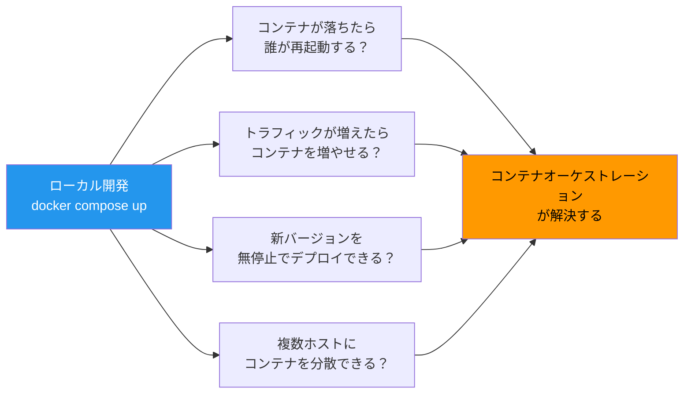
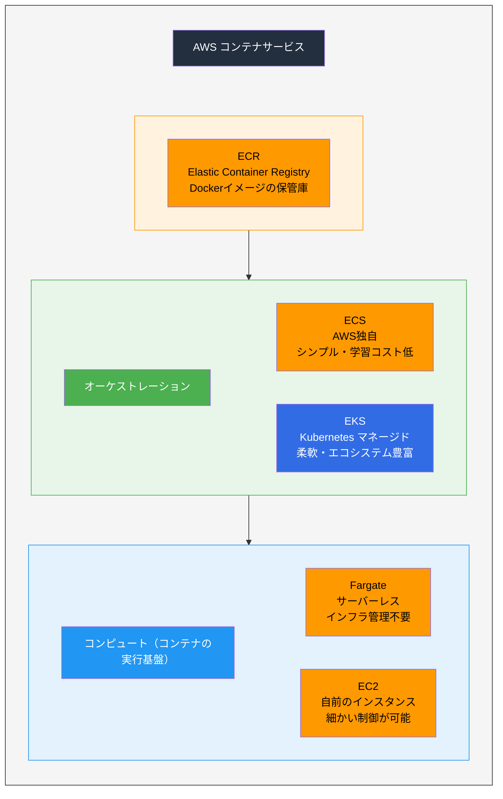
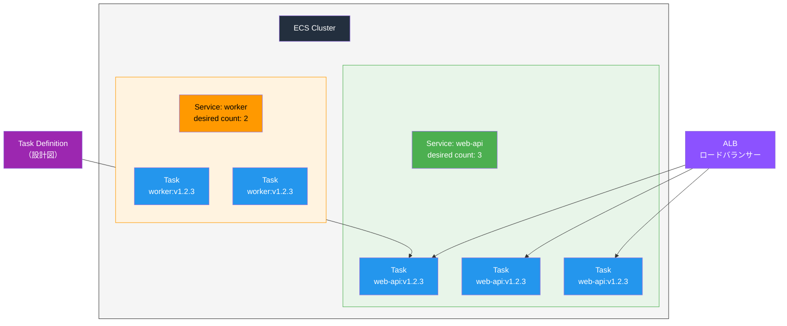
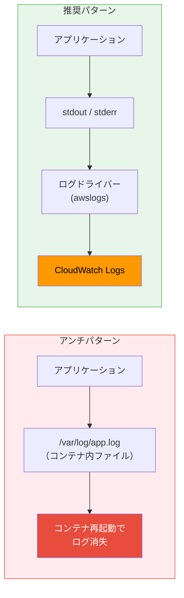
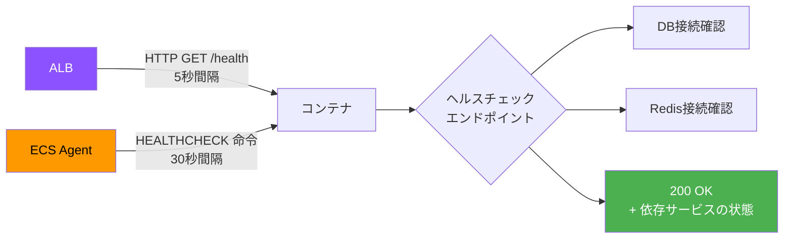
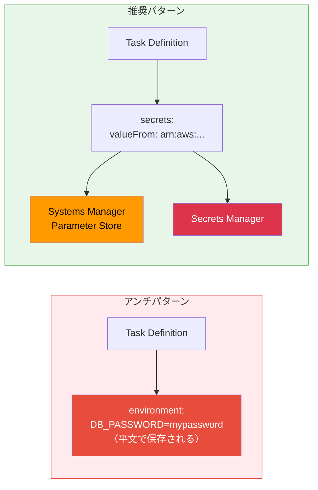
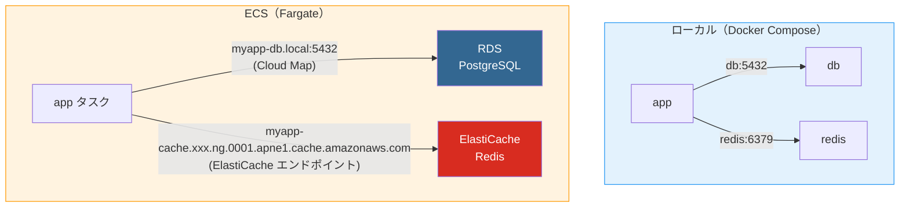
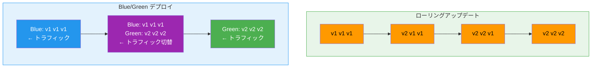
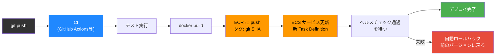
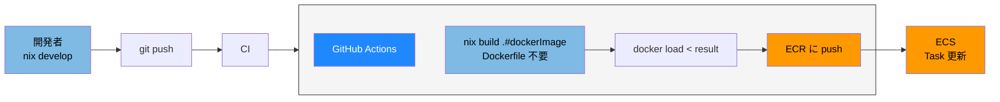

# AWSコンテナサービスとDockerの実運用

> **一言で言うと:** ローカルで `docker compose up` していたコンテナを本番で動かすには、コンテナオーケストレーション（Container Orchestration）が必要になる。AWSでは ECS（Elastic Container Service）と EKS（Elastic Kubernetes Service）が主な選択肢であり、ローカルDocker環境との差異 — 特にログ出力・ネットワーク・シークレット管理・ヘルスチェック — を理解しておかないと本番で事故が起きる。

## なぜオーケストレーションが必要か

ローカル開発では `docker compose` が全てを管理してくれるが、本番ではそれだけでは足りない問題がある。



## AWSコンテナサービスの全体像



### ECS vs EKS の選定

| 観点 | ECS | EKS |
|------|-----|-----|
| 学習コスト | 低い（AWSの概念だけ） | 高い（Kubernetes の知識が前提） |
| 設定の柔軟性 | AWSサービスとの統合が簡単 | Kubernetes エコシステム全体が使える |
| マルチクラウド | AWS専用 | GCP/Azureにも移行可能 |
| 運用コスト | Fargate併用で最小化 | コントロールプレーン費用（約$70/月）+ ノード |
| 推奨ケース | AWS中心の中小規模サービス | 大規模・マルチクラウド・Kubernetes経験者 |

**判断の指針:** チームにKubernetes経験者がいなければECS + Fargateから始めるのが最も現実的。ECSで不足を感じてからEKSへの移行を検討すればよい。

## ECS の基本概念



| ECSの概念 | Docker Compose での対応 | 説明 |
|----------|----------------------|------|
| **Cluster** | — | コンテナを実行する論理的なグループ |
| **Task Definition** | `docker-compose.yml` のサービス定義 | コンテナの「設計図」。イメージ、CPU/メモリ、環境変数、ログ設定などを定義 |
| **Task** | `docker compose up` で起動したコンテナ | Task Definition から起動した実際のコンテナインスタンス |
| **Service** | — | Task の「あるべき状態」を維持する。desired count=3 なら常に3つのTaskを起動し続ける |

## ローカルDockerから本番ECSへ — 変更が必要な設計判断

### 1. ログ出力: ファイルではなく stdout/stderr へ

**これが最も重要な設計変更。** ローカル開発ではログをファイルに書くことが多いが、ECSではコンテナのファイルシステムへの書き込みは一時的であり、コンテナ再起動で消失する。



#### 言語別: stdout にログを出す設定

**Node.js** — デフォルトで `console.log` は stdout に出るため変更不要。ただし、ロギングライブラリの設定に注意。

```javascript
// pino（Node.js の高速ロガー）
import pino from 'pino';

// Good: stdout に JSON で出力（ECS/CloudWatch と相性がよい）
const logger = pino({
  level: 'info',
  // transport はローカル開発時のみ pretty に
  ...(process.env.NODE_ENV !== 'production' && {
    transport: { target: 'pino-pretty' }
  })
});

logger.info({ userId: 123 }, 'User logged in');
// 本番出力: {"level":30,"time":1711612800000,"userId":123,"msg":"User logged in"}
```

**PHP** — 伝統的にファイルにログを書く文化があるため、明示的な変更が必要。

```php
// Laravel の場合: config/logging.php
'channels' => [
    // NG: ファイルに書く（ECSではコンテナ再起動で消える）
    'daily' => [
        'driver' => 'daily',
        'path' => storage_path('logs/laravel.log'),
    ],

    // OK: stderr に出力（ECS のログドライバーが収集する）
    'stderr' => [
        'driver' => 'monolog',
        'handler' => StreamHandler::class,
        'with' => [
            'stream' => 'php://stderr',
        ],
        'formatter' => JsonFormatter::class,  // JSON形式が検索しやすい
    ],
],

// .env
// LOG_CHANNEL=stderr
```

**Go** — 標準の `log` パッケージはデフォルトで stderr に出力する。

```go
import (
    "log/slog"
    "os"
)

// JSON形式で stdout に出力
logger := slog.New(slog.NewJSONHandler(os.Stdout, nil))
logger.Info("User logged in", "userId", 123)
// 出力: {"time":"2026-03-28T...","level":"INFO","msg":"User logged in","userId":123}
```

#### ECS Task Definition でのログ設定

```json
{
  "containerDefinitions": [
    {
      "name": "web-api",
      "image": "123456789012.dkr.ecr.ap-northeast-1.amazonaws.com/myapp:v1.2.3",
      "logConfiguration": {
        "logDriver": "awslogs",
        "options": {
          "awslogs-group": "/ecs/myapp/web-api",
          "awslogs-region": "ap-northeast-1",
          "awslogs-stream-prefix": "ecs",
          "awslogs-create-group": "true"
        }
      }
    }
  ]
}
```

`awslogs` ドライバーは、コンテナの stdout/stderr を自動的に CloudWatch Logs に転送する。アプリケーション側はログをファイルに書くかCloudWatchに書くかを意識する必要がない — **ただ stdout に書くだけ。**

#### 構造化ログが重要な理由

CloudWatch Logs Insights で検索・集計するために、ログは JSON 形式で出力するのが鉄則。

```
# プレーンテキスト（検索しにくい）
[2026-03-28 10:15:30] ERROR: Payment failed for user 123, amount 5000

# JSON（CloudWatch Logs Insights でクエリ可能）
{"time":"2026-03-28T10:15:30Z","level":"ERROR","msg":"Payment failed","userId":123,"amount":5000}
```

```sql
-- CloudWatch Logs Insights でのクエリ例
fields @timestamp, msg, userId, amount
| filter level = "ERROR"
| filter msg = "Payment failed"
| stats sum(amount) as totalLost by bin(1h)
```

### 2. ヘルスチェック: ALB + コンテナの二重チェック

ローカルでは `docker compose up` してアクセスできれば十分だが、ECSではヘルスチェックが正しく設定されていないとデプロイが永遠にロールバックし続ける。



```javascript
// ヘルスチェックエンドポイントの実装例（Express）
app.get('/health', async (req, res) => {
  const checks = {};

  // DB接続確認
  try {
    await db.query('SELECT 1');
    checks.database = 'ok';
  } catch (e) {
    checks.database = 'error';
  }

  // Redis接続確認
  try {
    await redis.ping();
    checks.redis = 'ok';
  } catch (e) {
    checks.redis = 'error';
  }

  const healthy = Object.values(checks).every(v => v === 'ok');
  res.status(healthy ? 200 : 503).json({
    status: healthy ? 'healthy' : 'unhealthy',
    checks,
    uptime: process.uptime()
  });
});
```

**注意:** ヘルスチェックが重すぎる処理（毎回DBにクエリを投げるなど）を行うと、それ自体がサービスの負荷になる。キャッシュを使って5秒に1回だけ実際のチェックを行うなどの工夫が必要。

### 3. シークレット管理: 環境変数のハードコードは厳禁



```json
{
  "containerDefinitions": [
    {
      "name": "web-api",
      "secrets": [
        {
          "name": "DATABASE_URL",
          "valueFrom": "arn:aws:ssm:ap-northeast-1:123456789012:parameter/myapp/prod/database-url"
        },
        {
          "name": "API_KEY",
          "valueFrom": "arn:aws:secretsmanager:ap-northeast-1:123456789012:secret:myapp/api-key"
        }
      ],
      "environment": [
        {
          "name": "NODE_ENV",
          "value": "production"
        }
      ]
    }
  ]
}
```

| 種類 | 格納先 | 用途 |
|------|--------|------|
| 機密情報（パスワード、APIキー） | Secrets Manager / Parameter Store (SecureString) | `secrets` で参照 |
| 非機密の設定値（NODE_ENV等） | Task Definition の `environment` | 直接記述OK |

### 4. ネットワーク: docker-compose のサービス名は使えない

ローカルでは `db:5432` や `redis:6379` でサービスに接続できるが、ECSでは構成が異なる。



| ローカル | ECS本番 | 理由 |
|---------|---------|------|
| Docker Compose のサービス名 (`db`) | RDS エンドポイント | DBはマネージドサービスを使う |
| `localhost:6379` | ElastiCache エンドポイント | Redis もマネージドサービス |
| `localhost:3000` | ALB の DNS名 | ロードバランサー経由でアクセス |
| コンテナ間直接通信 | ECS Service Connect / Cloud Map | サービスディスカバリが必要 |

**環境変数で接続先を切り替えるのが鉄則:**

```javascript
// ローカルでも ECS でも同じコードで動く
const dbUrl = process.env.DATABASE_URL || 'postgres://user:pass@db:5432/mydb';
const redisUrl = process.env.REDIS_URL || 'redis://redis:6379';
```

### 5. デプロイ戦略: ローリングアップデートとBlue/Green



| 戦略 | メリット | デメリット | 推奨ケース |
|------|---------|----------|-----------|
| ローリング | リソースの追加コストが小さい | 一時的にv1とv2が混在する | APIの後方互換がある場合 |
| Blue/Green | 即座にロールバック可能、混在なし | 一時的に2倍のリソースが必要 | DB マイグレーションを伴うデプロイ |

## CI/CD パイプラインの全体像



```yaml
# GitHub Actions の例
name: Deploy to ECS

on:
  push:
    branches: [main]

jobs:
  deploy:
    runs-on: ubuntu-latest
    steps:
      - uses: actions/checkout@v4

      - name: Configure AWS credentials
        uses: aws-actions/configure-aws-credentials@v4
        with:
          role-to-assume: arn:aws:iam::123456789012:role/github-actions-deploy
          aws-region: ap-northeast-1

      - name: Login to ECR
        id: ecr-login
        uses: aws-actions/amazon-ecr-login@v2

      - name: Build and push image
        env:
          ECR_REGISTRY: ${{ steps.ecr-login.outputs.registry }}
          IMAGE_TAG: ${{ github.sha }}
        run: |
          docker build -t $ECR_REGISTRY/myapp:$IMAGE_TAG .
          docker push $ECR_REGISTRY/myapp:$IMAGE_TAG

      - name: Deploy to ECS
        uses: aws-actions/amazon-ecs-deploy-task-definition@v2
        with:
          task-definition: task-definition.json
          service: web-api
          cluster: myapp-cluster
          wait-for-service-stability: true  # ヘルスチェック通過まで待つ
```

## Nix を組み合わせた ECS 運用

[[DockerとNix-Flakeによる開発環境管理]] で紹介した Nix は、ローカル開発だけでなく ECS にデプロイする本番イメージの構築にも大きな利点がある。

### 開発 → ビルド → デプロイの全体フロー



**ポイント:** ローカルで `nix develop` に使っているのと同じ `flake.nix` から本番用 Docker イメージを生成するため、「開発環境では動くのに本番イメージでは依存が足りない」という問題が構造的に発生しない。

### flake.nix で開発環境と本番イメージを統一管理する

```nix
{
  description = "Web API — 開発・ビルド・デプロイを Nix で統一管理";

  inputs = {
    nixpkgs.url = "github:NixOS/nixpkgs/nixos-24.05";
    flake-utils.url = "github:numtide/flake-utils";
  };

  outputs = { self, nixpkgs, flake-utils }:
    flake-utils.lib.eachDefaultSystem (system:
      let
        pkgs = nixpkgs.legacyPackages.${system};

        # アプリケーションのビルド定義（開発・本番で共有）
        myApp = pkgs.buildNpmPackage {
          pname = "myapp";
          version = "1.0.0";
          src = ./.;
          npmDepsHash = "sha256-XXXX...";  # npm 依存のハッシュ
          installPhase = ''
            mkdir -p $out
            cp -r dist $out/
            cp -r node_modules $out/
          '';
        };
      in {
        # ローカル開発用シェル
        devShells.default = pkgs.mkShell {
          packages = [
            pkgs.nodejs_20
            pkgs.pnpm
            pkgs.awscli2      # ECS 操作用
            pkgs.postgresql_16 # psql クライアント
          ];
        };

        # 本番用 Docker イメージ（Dockerfile 不要）
        packages.dockerImage = pkgs.dockerTools.buildLayeredImage {
          name = "myapp";
          tag = self.rev or "dev";  # git コミットハッシュをタグに

          contents = [
            pkgs.nodejs_20-slim
            myApp
            pkgs.cacert          # HTTPS 通信用の CA 証明書
            pkgs.tzdata          # タイムゾーンデータ
          ];

          config = {
            Cmd = [ "${pkgs.nodejs_20}/bin/node" "${myApp}/dist/server.js" ];
            User = "1000:1000";
            ExposedPorts."3000/tcp" = {};
            Env = [
              "NODE_ENV=production"
              "TZ=Asia/Tokyo"
            ];
          };
        };
      }
    );
}
```

### Dockerfile方式 vs Nix方式 — ECS での違い

| 観点 | Dockerfile → ECR → ECS | Nix → ECR → ECS |
|------|----------------------|-----------------|
| イメージの中身 | ベースイメージに含まれる不要なツール（bash, apt等）も入る | 指定したパッケージだけが入る |
| イメージサイズ | node:20-slim でも約180MB | 必要最小限で50〜80MB程度 |
| ビルドの再現性 | `apt-get install` は時期で結果が変わる | flake.lock で完全固定 |
| 脆弱性スキャン | 不要パッケージの脆弱性も検出される → ノイズが多い | 含まれるパッケージが明確 → 対応すべき脆弱性が明瞭 |
| CI での構築 | Docker が必要 | Nix が必要（`docker load` で ECR push 可能） |
| チームの学習コスト | 低い | 高い（Nix 言語の理解が前提） |
| デバッグ | `docker exec -it ... bash` が使える | シェルを含めないとコンテナ内に入れない |

### CI/CD パイプライン（Nix版）

```yaml
# GitHub Actions — Nix で Docker イメージを生成して ECS にデプロイ
name: Deploy to ECS (Nix)

on:
  push:
    branches: [main]

jobs:
  deploy:
    runs-on: ubuntu-latest
    steps:
      - uses: actions/checkout@v4

      - name: Install Nix
        uses: DeterminateSystems/nix-installer-action@main

      - name: Setup Nix cache
        uses: DeterminateSystems/magic-nix-cache-action@main

      - name: Configure AWS credentials
        uses: aws-actions/configure-aws-credentials@v4
        with:
          role-to-assume: arn:aws:iam::123456789012:role/github-actions-deploy
          aws-region: ap-northeast-1

      - name: Login to ECR
        id: ecr-login
        uses: aws-actions/amazon-ecr-login@v2

      - name: Build and push image with Nix
        env:
          ECR_REGISTRY: ${{ steps.ecr-login.outputs.registry }}
          IMAGE_TAG: ${{ github.sha }}
        run: |
          # Nix で Docker イメージを生成（Dockerfile 不要）
          nix build .#dockerImage

          # 生成されたイメージを Docker にロード
          docker load < result

          # ECR 用にタグ付けして push
          docker tag myapp:${{ github.sha }} $ECR_REGISTRY/myapp:$IMAGE_TAG
          docker push $ECR_REGISTRY/myapp:$IMAGE_TAG

      - name: Deploy to ECS
        uses: aws-actions/amazon-ecs-deploy-task-definition@v2
        with:
          task-definition: task-definition.json
          service: web-api
          cluster: myapp-cluster
          wait-for-service-stability: true
```

### Nix + ECS での注意点

#### 1. CA 証明書とタイムゾーンデータを忘れない

Nix の `dockerTools.buildLayeredImage` は最小限しか含まないため、通常のベースイメージに含まれている [[CA証明書とタイムゾーンデータ|CA 証明書（`cacert`）やタイムゾーンデータ（`tzdata`）]] を明示的に追加する必要がある。これを忘れると HTTPS 通信が失敗する。

#### 2. デバッグ用にシェルを含めるかの判断

最小イメージにはシェル（bash/sh）が含まれない。ECS Exec（`aws ecs execute-command`）でコンテナに入ってデバッグしたい場合は、`pkgs.bashInteractive` と `pkgs.coreutils` を contents に追加する。

```nix
# 本番イメージにデバッグツールを含めるかの選択
contents = [
  pkgs.nodejs_20-slim
  myApp
  pkgs.cacert
  pkgs.tzdata
] ++ pkgs.lib.optionals (builtins.getEnv "INCLUDE_DEBUG_TOOLS" == "1") [
  # CI の環境変数でデバッグツールの有無を制御
  pkgs.bashInteractive
  pkgs.coreutils
  pkgs.curl
];
```

#### 3. Nix store のキャッシュで CI を高速化する

Nix のビルドはキャッシュがないと遅い。`magic-nix-cache-action` や [Cachix](https://www.cachix.org/) を使って Nix store を CI 間で共有することで、2回目以降のビルドを大幅に短縮できる。

## よくある落とし穴

### 1. ログをファイルに書いてしまう

最も多い事故。ローカルでは `storage/logs/laravel.log` に書いていたログが、ECSではコンテナのライフサイクルとともに消える。さらに Fargate ではコンテナ内のファイルシステムに SSH できないため、障害時にログを見ることすらできない。**stdout/stderr + awslogs ドライバーが唯一の正解。**

### 2. Fargate のエフェメラルストレージの上限

Fargate タスクにはデフォルト20GBのエフェメラルストレージがある（最大200GBまで拡張可能）。一時ファイルの生成（画像処理、レポート生成等）がこの上限を超えるとタスクがクラッシュする。大きなファイルは S3 を使う。

### 3. タスクロールと実行ロールの混同

| ロール | 誰が使う | 用途 |
|--------|---------|------|
| **タスク実行ロール** (executionRoleArn) | ECS エージェント | ECRからのイメージ取得、CloudWatch Logsへの書き込み、Secrets Managerの参照 |
| **タスクロール** (taskRoleArn) | アプリケーションコード | S3へのアップロード、DynamoDBへのアクセスなど、アプリが必要とするAWSリソースへのアクセス |

この2つを混同すると「イメージは取得できるがアプリからS3にアクセスできない」あるいは「アプリは動くがログがCloudWatchに出ない」という問題が起きる。

### 4. デプロイ時のマイグレーション実行

DBマイグレーションをコンテナの起動コマンドに含めると、複数タスクが同時にマイグレーションを実行してしまう。マイグレーションは ECS RunTask（1回だけ実行するタスク）で別途実行するか、デプロイパイプラインの中で明示的に1回だけ実行する。

```yaml
# デプロイパイプラインの中で
- name: Run migration
  run: |
    aws ecs run-task \
      --cluster myapp-cluster \
      --task-definition myapp-migration \
      --launch-type FARGATE \
      --network-configuration "..." \
      --overrides '{"containerOverrides":[{"name":"app","command":["npx","prisma","migrate","deploy"]}]}'
```

### 5. コンテナの Graceful Shutdown を考慮しない

ECSがタスクを停止するとき、まず SIGTERM を送り、デフォルト30秒後に SIGKILL で強制終了する。処理中のリクエストを安全に完了させるには、アプリケーション側で SIGTERM をハンドリングする必要がある。

```javascript
// Node.js — Graceful Shutdown
const server = app.listen(3000);

process.on('SIGTERM', () => {
  console.log('SIGTERM received, shutting down gracefully...');

  // 新しいリクエストの受け付けを停止
  server.close(() => {
    console.log('All connections closed');
    // DB接続のクリーンアップ
    db.end().then(() => process.exit(0));
  });

  // 30秒以内に終わらなければ強制終了
  setTimeout(() => {
    console.error('Forced shutdown');
    process.exit(1);
  }, 25000);
});
```

## 参考リソース

- [AWS ECS 公式 — Best practices](https://docs.aws.amazon.com/AmazonECS/latest/bestpracticesguide/)
- [AWS ECS Workshop](https://ecsworkshop.com/) — ハンズオン形式でECSを学べる
- [The Twelve-Factor App — XI. Logs](https://12factor.net/logs) — ログをイベントストリームとして扱う思想
- [AWS Fargate 公式 — Task networking](https://docs.aws.amazon.com/AmazonECS/latest/developerguide/task-networking.html)
- [CloudWatch Logs Insights クエリ構文](https://docs.aws.amazon.com/AmazonCloudWatch/latest/logs/CWL_QuerySyntax.html)

## 関連トピック

- [[Docker]] — コンテナの基本。ECS はこの上に構築されている
- [[DockerとNix-Flakeによる開発環境管理]] — ローカル開発環境の構築手法
- [[Linux基本操作]] — コンテナ内のトラブルシューティング
- [[Layer5-パフォーマンス/_index|Layer 5: パフォーマンス]] — オートスケーリング、モニタリング
- [[Layer6-セキュリティ/_index|Layer 6: セキュリティ]] — IAMロール、最小権限の原則
