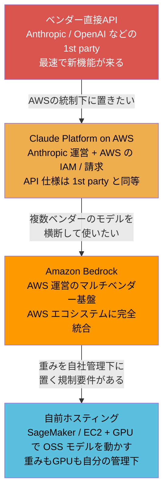
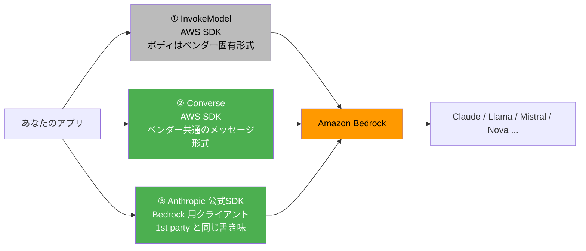

# Amazon Bedrock とモデル提供形態の選択（Foundation Model as a Service）

> **一言で言うと:** Amazon Bedrock は「基盤モデル（Foundation Model）を AWS のマネージドサービスとして、IAM 認証・VPC 経由で呼べるようにしたもの」であり、クラウドサービスモデルの責任分界の階段に **「モデルの運用をどこまで他社に任せるか」という新しい段** を追加した存在。技術的な優劣ではなく、**認証・データ境界・調達・使える機能の範囲**のトレードオフで選ぶ。

## なぜ「どこ経由でモデルを呼ぶか」が設計判断になるのか

個人開発なら話は単純だ。ベンダーの API キーを取得し、`ANTHROPIC_API_KEY` を環境変数に置いて SDK を叩けば終わる。だが企業のシステムに載せようとすると、コードとは無関係の問いが次々に出てくる。

- **認証情報を誰が持つのか** — API キーは「持っている人が全員フルアクセス」の平文シークレット。社内の誰が・どのサービスが呼べるかを IAM のような仕組みで統制したい
- **データはどこを通るのか** — 顧客の個人情報をプロンプトに含める場合、インターネットに出るのか、VPC 内で閉じるのか。監査でまず聞かれる点
- **請求書をどこから受け取るのか** — 新規ベンダーとの契約は法務・調達のレビューが要る。既存の AWS 契約に相乗りできるなら数ヶ月短縮できることがある
- **ログはどこに残るのか** — 「いつ誰がどんなプロンプトを投げたか」を CloudTrail や S3 に残せるか

つまり **モデルの賢さではなく、組織の統制手段に合わせて経路を選ぶ** 問題だ。これは [[クラウドサービスモデル]] が扱う「どこまでを自分で管理し、どこからをベンダーに任せるか」の議論そのものであり、Bedrock はその階段の上のほうに位置する。

> [!info] 用語ミニ辞典
> - **基盤モデル（Foundation Model / FM）** — 大量データで事前学習され、幅広いタスクに転用できる大規模モデルの総称。LLM（大規模言語モデル）は基盤モデルの一種で、画像生成モデルや埋め込みモデルも含む広い語。
> - **FMaaS / MaaS（Model as a Service）** — 基盤モデルを API 越しに従量課金で使わせる提供形態。GPU の調達もモデルの更新も提供側が持つ、SaaS の一種と考えてよい。
> - **SigV4（AWS Signature Version 4）** — AWS API へのリクエストに、アクセスキーを使った署名を付けて認証する方式。API キーをそのままヘッダに載せる方式と違い、**署名は時刻とリクエスト内容に紐づくため使い回しが効かない**。
> - **データレジデンシー（Data Residency）** — データを物理的にどの国・地域に置くかの要件。金融・医療・公共分野では法規制で指定されることがある。
> - **ARN（Amazon Resource Name）** — AWS 上の個々のリソースを一意に指す識別子。`arn:aws:bedrock:us-east-1::foundation-model/...` のような文字列で、IAM ポリシーの `Resource` 欄に書いて「どのリソースに対する操作を許すか」を絞るのに使う。

## 選択肢の地図 — 責任分界の階段にモデルを載せる

モデルを呼ぶ経路は大きく4つある。上に行くほど自分で持つものが減り、下に行くほど制御が効く。



| 経路 | 運営主体 | 認証 | 請求 | 新機能の反映 | 向いているケース |
|---|---|---|---|---|---|
| **ベンダー直接 API** | モデルベンダー | API キー / OAuth | ベンダーに直接 | 最速 | 個人開発・スタートアップ・最新機能を追いたい |
| **Claude Platform on AWS** | Anthropic（AWS インフラ上） | IAM / SigV4 | AWS Marketplace | 1st party と同等 | AWS の統制は欲しいが機能は削りたくない |
| **Amazon Bedrock** | AWS（パートナー運営） | IAM / SigV4 | AWS 請求 | 遅れる・一部は未提供 | AWS 中心の企業システム・複数ベンダーのモデルを横断利用 |
| **自前ホスティング** | 自分 | 自分で設計 | GPU インスタンス代 | 自分次第 | 完全なデータ隔離・独自ファインチューニング・オフライン環境 |

ここで見落とされがちなのが2行目だ。**「AWS 経由で Claude を使う ＝ Bedrock」ではない**。Anthropic 自身が AWS インフラ上で運営する **Claude Platform on AWS** という経路があり、こちらは SigV4 認証と AWS Marketplace 請求を使いながら、API 仕様は 1st party と同等に保たれる。モデル ID の書式にも違いが出る（後述）。「IAM で統制したい」という動機だけで Bedrock を選ぶと、後述する機能制約という代償を必要以上に払うことになる。

## Bedrock の実体 — 何がマネージドなのか

Bedrock が肩代わりするのは、モデルを動かすために本来必要なほぼ全てだ。

| レイヤー | 自前ホスティング | Bedrock |
|---|---|---|
| GPU インスタンスの確保 | 自分（かつ在庫不足と戦う） | AWS |
| モデルの重みの配置・更新 | 自分 | AWS |
| 推論サーバー（vLLM 等）の運用 | 自分 | AWS |
| スケーリング・冗長化 | 自分 | AWS（サーバーレス） |
| プロンプト設計・出力品質の評価 | 自分 | **自分** |
| 認可・入力検証・監査ログ | 自分 | **自分** |

つまり Bedrock は **モデル版の FaaS** に近い。呼んだ分だけ課金され、待機中のコストは発生しない。裏で GPU が何枚動いているかは見えないし、見る必要もない。

一方、下2行が「自分」のまま残る点は強調しておきたい。**マネージドサービスは運用を肩代わりするが、設計判断は肩代わりしない**。「Bedrock を使っているから安全」は成り立たず、[[最小権限の原則]] に沿った IAM 設計も、モデル出力を信用しない [[バリデーション]] も、依然として自分の責任範囲にある。

### リージョンとモデルアクセスの有効化

Bedrock は **リージョナルサービス**（リージョンごとに独立して動くサービス）だ。ここから、初見で必ずつまずく2つの性質が出てくる。

1. **リージョンごとに使えるモデルが違う** — 新モデルはまず米国リージョンに来て、他リージョンには遅れて来る（あるいは来ない）
2. **アカウントごとにモデルアクセスの有効化が必要** — コンソールでモデルの利用を有効にするまで、正しいコードを書いても `AccessDeniedException` で弾かれる

この「リージョンに縛られる」性質を緩めるのが **クロスリージョン推論プロファイル（Cross-Region Inference Profile）** だ。素のモデル ID の代わりに `us.` / `eu.` / `apac.` といった接頭辞の付いたプロファイル ID を指定すると、リクエストがその地理圏内の複数リージョンへ自動で振り分けられる。スループット上限に当たりにくくなる代わりに、**推論が実行されるのは「圏内のどこかのリージョン」になる**。さらに地理圏を限定しない **Global スコープ**のプロファイルもあり、こちらは全ての商用リージョンが振り分け先の候補になる。

ここは「AWS 内で閉じているのだから安全」という直感が裏切られる場所なので、3点を明示しておく。

- **振り分け先には、アカウントで有効化していないオプトインリージョン（明示的に有効化しないと使えないリージョン）も含まれうる。** そして入力プロンプトと出力は、濫用検知の目的でその先のリージョンに保存されることがある
- **地理圏スコープ（US / EU / APAC）のプロファイルは、振り分け先リージョンの一覧が後から変わらない**ことが保証されている。一方 Global スコープは AWS が商用リージョンを増やせば候補も増える。データレジデンシー要件があるなら、Global ではなく地理圏スコープを選ぶ理由がここにある
- **SCP（Service Control Policy / 組織全体に効く権限のガードレール）で振り分け先のいずれかのリージョンをブロックしていると、他が許可されていてもリクエストは失敗する。** マルチアカウント環境で「開発アカウントでは動くのに本番では動かない」の典型原因になる

つまり、プロファイル ID の接頭辞1つがコンプライアンスと権限設計の両方に波及する。要件がある案件では、選定時に「どのリージョンに routing されうるか」を一覧で押さえておくこと（各モデルの詳細ページに、使えるプロファイル ID と対応リージョンが掲載されている）。

### リージョン距離とレイテンシ

もう1つ、リージョン選択には体感に直結する側面がある。**日本のユーザー向けアプリから米国リージョンの Bedrock を呼べば、その分の往復ネットワークレイテンシが必ず上乗せされる**。LLM の応答自体が秒単位かかるため相対的な比率は小さいが、効くのは「最初の1文字が出るまでの時間」だ。ユーザーは総生成時間より、**送信してから何も起きない沈黙の長さ**を待たされたと感じる。

対策は2つあり、順番が大事だ。まず [[ストリームレスポンス]] で生成中のトークンを流し、沈黙そのものを無くす。**レイテンシ差を吸収する手段としてはこちらのほうが効果が大きい**。そのうえで、モデルがそのリージョンで提供されており規制上も問題ないなら、近いリージョンを選ぶ。逆に「レイテンシのために近いリージョンを選んだら、使いたいモデルが無かった」は順序を間違えた典型例で、モデルの可用性が先、距離は後になる。

## 呼び方が3通りある問題

同じ Bedrock 上の同じモデルを呼ぶのに、コードの書き方が3系統ある。ここが最大の混乱源なので、まず地図を持っておく。



- **① `InvokeModel`** — 最初期からある低レベル API。リクエストボディがモデルベンダーごとに違う（Claude なら Anthropic 形式の JSON を丸ごと詰める）。一部の新機能がここにしか来ないこともあるが、**モデルを差し替えるとボディの組み立てを書き直す**羽目になる
- **② `Converse`** — 後発の統一 API。`messages` / `system` / `inferenceConfig` / `toolConfig` というベンダー中立の形に揃えられており、モデル ID を差し替えるだけで Claude と Llama を切り替えられる。**「Bedrock を選ぶ主な理由」がこれ**
- **③ Anthropic 公式 SDK の Bedrock クライアント** — Claude だけを使うなら最短。1st party 向けに書いたコードを、クライアント生成の1行だけ差し替えて動かせる

「なぜ ② が後から作られたのか」を押さえておくと選択がぶれない。① は「各ベンダーの API をそのまま通す」設計で、Bedrock を単なるプロキシとして最速で立ち上げるには合理的だった。しかしこの形だと、**マルチベンダーの入口という Bedrock の売りを、アプリ側のコードが台無しにしてしまう** — モデルを変えるたびにアプリを書き直すなら、統一基盤である意味が薄い。② はその反省から、API の形を「アプリとベンダーの間の契約」として切り直したものだ。これは [[SDKとAPIクライアント]] が扱う「抽象化レイヤーをどこに置くか」の実例でもある。

### コード例

**Python — AWS SDK (boto3) の Converse API**。ベンダー中立の形。`modelId` を差し替えれば他社モデルにも同じコードが通る。

```python
import boto3

# 認証情報は IAM ロール / 環境変数 / ~/.aws/credentials から自動で解決される。
# API キーを書く場所がそもそも無いのが Bedrock 経路の特徴。
client = boto3.client("bedrock-runtime", region_name="us-east-1")

# 実際に使うモデルの ID に置き換える（下のコメント参照）
MODEL_ID = "us.anthropic.claude-3-haiku-20240307-v1:0"

response = client.converse(
    # モデルIDは「ベンダー名.モデル名-日付-バージョン」の形式で、
    # 先頭の "us." はクロスリージョン推論プロファイルであることを表す。
    # 例: us.anthropic.claude-3-haiku-20240307-v1:0
    # 実在するIDはモデルとリージョンで異なる。各モデルの詳細ページで確認すること。
    modelId=MODEL_ID,
    system=[{"text": "あなたは簡潔に答えるアシスタントです。"}],
    messages=[
        {"role": "user", "content": [{"text": "Bedrock を一言で説明して"}]}
    ],
    inferenceConfig={"maxTokens": 1024, "temperature": 0.3},
)

# 応答は output.message.content の配列。テキスト以外のブロックも入りうる。
print(response["output"]["message"]["content"][0]["text"])
print(response["usage"])       # 入出力トークン数 — コスト監視の一次情報
print(response["stopReason"])  # end_turn / max_tokens / tool_use など
```

**Python — Anthropic 公式 SDK の Bedrock クライアント**。Claude 専用だが、1st party 向けのコードをほぼそのまま持ち込める。

```python
# pip install "anthropic[bedrock]"
from anthropic import AnthropicBedrockMantle

# リージョンは必須。AWS 認証情報は boto3 と同じ解決順で拾われる。
client = AnthropicBedrockMantle(aws_region="us-east-1")

message = client.messages.create(
    model="anthropic.claude-opus-5",  # Bedrock 経路では "anthropic." 接頭辞が付く
    max_tokens=1024,
    messages=[{"role": "user", "content": "Bedrock を一言で説明して"}],
)
print(message.content[0].text)
```

**TypeScript — 同じことを公式 SDK で**。Bedrock 用の専用パッケージを使う。

```typescript
// npm install @anthropic-ai/bedrock-sdk
import { AnthropicBedrockMantle } from "@anthropic-ai/bedrock-sdk";

const client = new AnthropicBedrockMantle({ awsRegion: "us-east-1" });

const message = await client.messages.create({
  model: "anthropic.claude-opus-5",
  max_tokens: 1024,
  messages: [{ role: "user", content: "Bedrock を一言で説明して" }],
});

// content は複数ブロックの配列。text 以外（tool_use 等）も来うるので、
// 実務では type で絞り込む。ここは最小例として先頭をそのまま出している。
console.log(message.content[0]);
```

なお `AnthropicBedrock`（`Mantle` なし）という古いクライアント名も広く出回っているが、これは ① の `InvokeModel` 経路にあたる旧実装だ。新規コードでは `Mantle` 付きを使う。AI に生成させると訓練データに多い古いほうが出てくることがあるので、レビュー時の確認点になる。

## 何が使えて、何が使えないか

Bedrock は AWS が運営するため、**モデルベンダー側の新機能がそのまま使えるとは限らない**。これは Bedrock を選ぶ際の最大の落とし穴であり、かつ事前に調べれば必ず分かる種類のリスクでもある。以下は 2026年8月時点の Claude を例にした代表例（最新は必ず公式ドキュメントで確認すること）。

| 機能 | ベンダー直接 API | Amazon Bedrock |
|---|---|---|
| メッセージ送受信 / ストリーミング / ツール利用 | ✅ | ✅ |
| プロンプトキャッシュ（明示指定） | ✅ | ✅ |
| 自動プロンプトキャッシュ | ✅ | ❌ |
| 拡張思考（thinking）/ 思考量の指定 | ✅ | ✅ |
| PDF 入力 / 引用（Citations） | ✅ | ✅ |
| サーバーサイドの Web 検索・Web 取得 | ✅ | ❌ |
| サーバーサイドのコード実行 | ✅ | ❌ |
| MCP コネクタ | β | ❌ |
| ベンダーの Message Batches API | ✅ | ❌（※ Bedrock は独自のバッチ推論を持つ。後述） |
| Files API（ファイルを事前アップロードして再利用） | β | ❌ |
| Models API（モデル一覧・仕様の取得） | ✅ | ❌ |
| マネージドなエージェント実行基盤 | β | ❌ |

読み取るべき傾向は明確だ。**「モデルにテキストを投げて返す」というコア機能は揃っているが、ベンダー側のサーバーで動く付加機能はほぼ来ない**。Web 検索やコード実行を使いたければ、Bedrock 経路では **自分でツールを実装して [[ToolCalling]] のループに載せる** ことになる（それ自体は難しくないが、工数と運用が発生する）。

この差が生まれる理由も理解しておきたい。サーバーサイドツールはベンダーが自社インフラ上で実行するもので、AWS のリージョン境界・IAM・課金体系の中に持ち込むには両社の統合作業が要る。**パートナー運営という構造そのものが機能反映の遅れを生む** のであって、AWS の怠慢ではない。だからこの差は今後も「ゼロにはならないが縮んでいく」と見ておくのが妥当で、**選定時点で「今使えないもの」を自分の要件と突き合わせる**のが正しい向き合い方になる。

## コストの考え方

料金の実額は頻繁に変わり、ベンダー直接 API と Bedrock では体系も異なる。ここでは **課金モードの種類** だけ押さえる（金額は必ず公式の料金ページで確認する）。

| モード | 課金の考え方 | 向いているケース |
|---|---|---|
| **オンデマンド** | 入出力トークン量に応じた従量課金。待機コストなし | 通常の Web アプリ。まずここから始める |
| **バッチ推論** | 非同期でまとめて処理する代わりに単価が下がる | 夜間の一括分類・要約など即時性が不要な処理 |
| **プロビジョンドスループット** | 「モデルユニット」を時間単位で予約購入し、専有スループットを確保 | 大規模で安定した高負荷。期間コミットが前提 |

ここで前節の表と混同しやすい点を整理しておく。表で「❌」としたのは **ベンダー自身が提供する Message Batches API** のことで、**Bedrock には Bedrock 独自のバッチ推論（Batch Inference）がある**。仕組みは大きく違い、Bedrock 版は「プロンプトを1行1件の JSONL ファイルにまとめて S3 に置き、ジョブを起動し、完了後に S3 から結果を回収する」形を取る。同期 API を非同期にしたものではなく、**データパイプラインとして設計されている**と考えたほうが近い。

そのため制約も独特で、選定前に知っておかないと設計をやり直すことになる。

- **ツール呼び出し（[[ToolCalling]]）と構造化出力に対応していない** — 各レコードは独立に1往復で処理されるため、モデルとアプリが何度もやり取りする機能は原理的に使えない
- **プロビジョンドスループットのモデルでは利用できない**
- **入出力が S3 経由になる** — 個人情報を含むなら、そのバケットの暗号化・アクセス制御・保持期間まで設計範囲に入る

「安いから夜間処理はバッチで」と決める前に、その処理がツールを使うかどうかを先に確認すること。

もう1つ見落とされやすいのが、**プロビジョンドスループットは「安くする仕組み」ではなく「上限を買う仕組み」** だという点だ。オンデマンドにはアカウント・リージョン・モデル単位のクォータ（TPM = 1分あたりトークン数 / RPM = 1分あたりリクエスト数）があり、超えるとスロットリングされる。予約はこの上限を外すためのもので、稼働率が低ければ単価はむしろ上がる。[[機能要件と非機能要件]] でいうスループット要件が実測で固まるまでは、オンデマンド＋リトライで様子を見るのが定石だ。

## よくある落とし穴

| 落とし穴 | 何が起きるか | 対処 |
|---|---|---|
| **モデルアクセスを有効化していない** | コードが正しくても `AccessDeniedException`。IAM の問題だと思い込んで何時間も溶かす | コンソールの Model access でモデルごとに有効化する。IAM 権限とは別の関門だと覚える |
| **そのリージョンにモデルが無い** | `ValidationException`。「東京リージョンで動かない」の典型 | モデルの提供リージョンを確認。クロスリージョン推論プロファイルの利用を検討する |
| **SCP が推論プロファイルの振り分け先リージョンを塞いでいる** | 開発アカウントでは動くのに本番アカウントだけ失敗する。IAM ポリシーばかり見て原因に辿り着けない | 使うプロファイルの振り分け先リージョン全てで、必要な Bedrock アクションが SCP・IAM 双方で許可されているか確認する |
| **モデル ID の接頭辞を取り違える** | Bedrock は `anthropic.` 付き、Claude Platform on AWS は接頭辞なし、推論プロファイルはさらに `us.` が付く | 経路とモデル ID をセットで管理する。ハードコードせず設定値として外に出す |
| **スロットリングを想定しない** | 負荷試験や本番ピークで `ThrottlingException` が多発し、ユーザーにエラーが露出する | 指数バックオフ付きリトライを標準装備にする。設計は [[レート制限]] と [[フォールバックとグレースフルデグラデーション]] を参照 |
| **「Bedrock だからデータは安全」と考える** | VPC エンドポイントを張らずインターネット経由で呼び、監査で指摘される | データ境界は自分で設計する。VPC エンドポイント（[[VPC・サブネット・NAT]]）・呼び出しログの保存・[[最小権限の原則]] はすべて自分の仕事 |
| **IAM で `bedrock:*` / `Resource: "*"` を許可** | 全モデル・全操作を誰でも叩ける。高額モデルの濫用やコスト事故につながる | 使うモデルの ARN と `bedrock:InvokeModel` などに限定する |
| **Converse に寄せれば完全にベンダー中立だと考える** | API の形式は揃うが、モデル固有パラメータ・トークン単価・得意分野・応答傾向は揃わない。差し替えたら品質が落ちる | 「API 形式の中立化」と「モデルの互換性」は別問題。切り替え時は評価をやり直す |

## Bedrock 周辺機能と自前実装の線引き

Bedrock にはモデル呼び出しの上に、RAG（Knowledge Bases）・入出力フィルタ（Guardrails）・エージェント実行基盤といったマネージド機能が乗っている。ここでも判断軸は [[クラウドサービスモデル]] と同じ「制御を手放す代わりに何を得るか」だ。

| 機能 | マネージドを選ぶ理由 | 自前実装を選ぶ理由 |
|---|---|---|
| **Knowledge Bases（RAG）** | ベクトル DB の構築・チャンク分割・埋め込みの更新を書かずに済む | チャンク戦略や検索ランキングを細かく調整したい（[[RAG]]） |
| **Guardrails（入出力フィルタ）** | 禁止トピック・個人情報マスキングを宣言的に設定でき、監査説明がしやすい | 業務固有の判定ロジックが必要。多層防御の一枚として併用もできる |
| **エージェント実行基盤** | ツール実行ループとステート管理を任せられる | ループの制御と権限境界を自分で握りたい（[[ToolCalling]] / [[MCP]]） |

初手としては、**まずモデル呼び出しだけを Bedrock に任せ、RAG やエージェントは自前で書いてみる** のが学習効率でも設計判断の質でも有利だ。中身を一度自分で書いておくと、マネージド機能が何を肩代わりしているのか・どこが調整できないのかが具体的に分かる。

## AI 実装のアンチパターン

AI コーディングエージェントに Bedrock 連携を書かせたとき、頻出する誤りとレビュー観点。

| アンチパターン | なぜ起きるか | 直し方 |
|---|---|---|
| 古いクライアント名・古いモデル ID を使う | 訓練データに旧 API の例が大量にある | 経路とモデル ID は人間が確定し、プロンプトに明記して渡す |
| `Resource: "*"` の IAM ポリシーを生成する | 「まず動く」ことを優先する傾向 | 使うモデル ARN に限定する。[[最小権限の原則]] の観点で必ずレビュー |
| リトライ処理が無い | 正常系だけを書く傾向 | スロットリング前提の指数バックオフを要件として明記する |
| ベンダー抽象化レイヤーを最初から自作する | 「将来の差し替えに備える」提案をしがち | 実際に2モデル以上を運用する必要が出てから作る（[[YAGNI]]） |
| API キーを環境変数で渡す前提のコード | 1st party API のサンプルが多数派 | Bedrock 経路では IAM ロールで解決する。キーを置く場所自体を作らない |

→ レイヤー横断のアンチパターン索引: [[_anti-patterns/_index|AIアンチパターン索引]]

## 実務での判断チェックリスト

- 既存システムが AWS 中心で、IAM と VPC でデータ境界を閉じる要件があるか → Bedrock または Claude Platform on AWS
- サーバーサイドの Web 検索・コード実行・ベンダーの Batch API を使いたいか → ベンダー直接 API か Claude Platform on AWS
- 複数ベンダーのモデルを横断比較・併用したいか → Bedrock の Converse API
- データの保存先・経由先の国を限定する要件があるか → 地理圏スコープの推論プロファイルを選び、振り分け先リージョンを事前に確認する（Global スコープは避ける）
- ユーザーとリージョンが地理的に離れるか → まず [[ストリームレスポンス]] で沈黙時間を潰す。近いリージョン選択はモデルの可用性を確認したうえで
- モデルの重みを自社管理下に置く規制要件があるか → 自前ホスティング（コストと運用負荷は跳ね上がる）
- まだ要件が固まっていないか → **直接 API で PoC を作り、呼び出し部分を関数1つに閉じ込めておく**。経路の差し替えはその関数の中だけで済む

最後の項目が実務では一番効く。経路の選択は後から変えられるが、**呼び出しコードがアプリ中に散らばっていると変えられなくなる**。これは [[クラウドサービスモデル]] のベンダーロックイン対策と同じ話で、「マルチクラウド対応の抽象化基盤」を先回りして作ることではなく、**外部との接点を一箇所に絞っておく** ことが本質だ。

## 参考リソース

- [Amazon Bedrock ユーザーガイド](https://docs.aws.amazon.com/bedrock/latest/userguide/) — モデル提供リージョン・推論プロファイル・クォータの一次情報
- [Amazon Bedrock 料金](https://aws.amazon.com/bedrock/pricing/) — 課金モードと実額
- [Converse API リファレンス](https://docs.aws.amazon.com/bedrock/latest/APIReference/API_runtime_Converse.html) — リクエスト / レスポンス構造の正確な定義

## 関連トピック

- [[クラウドサービスモデル]] — 親トピック。責任分界の階段という考え方そのもの
- [[ToolCalling]] — Bedrock 経路でサーバーサイドツールが使えない分を埋める仕組み
- [[RAG]] — Knowledge Bases が肩代わりしている処理の中身
- [[SDKとAPIクライアント]] — 3系統の呼び方が示す「抽象化をどこに置くか」の問題
- [[ストリームレスポンス]] — リージョン距離によるレイテンシを体感上どう吸収するか
- [[最小権限の原則]] — IAM 設計の指針
- [[レート制限]] / [[フォールバックとグレースフルデグラデーション]] — スロットリングへの備え
