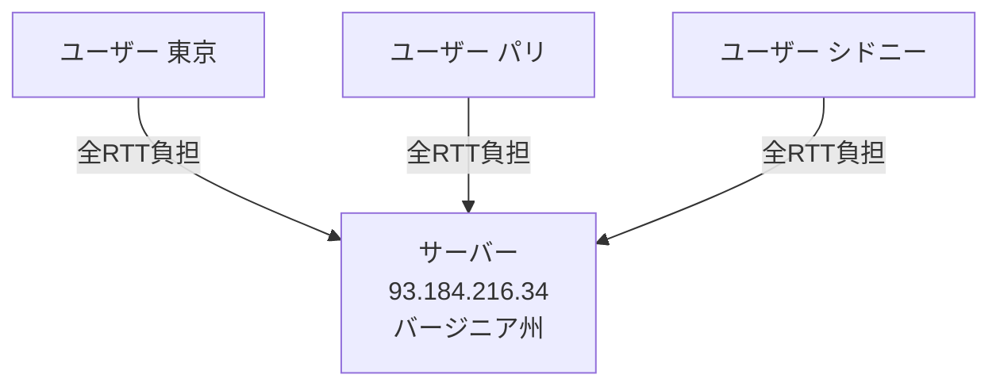
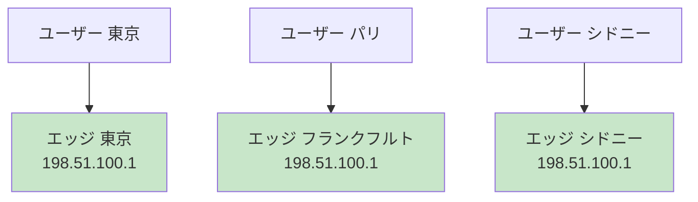
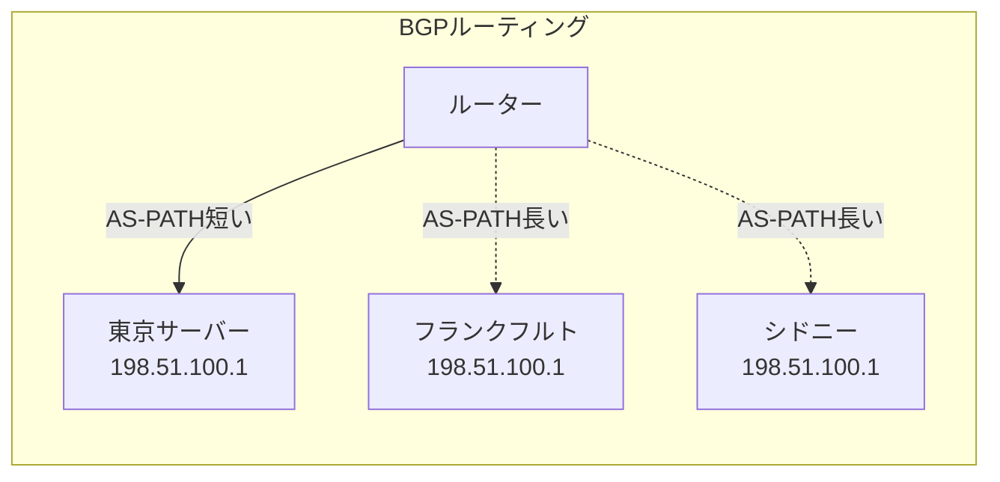
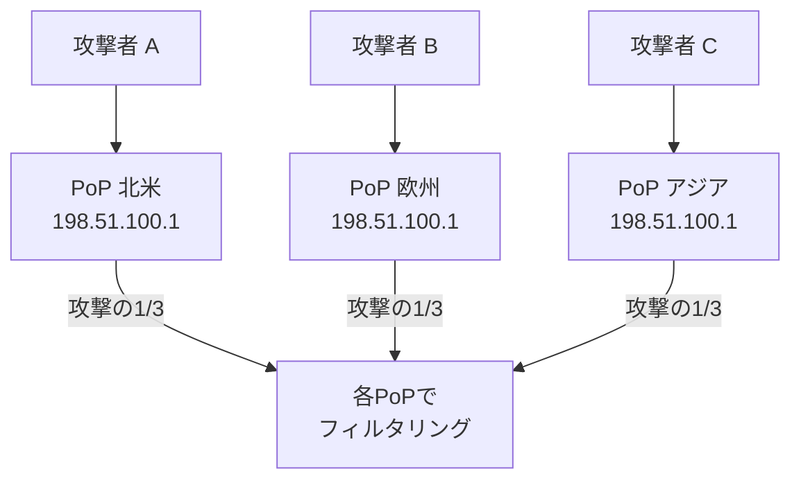

# Anycast と Unicast（Anycast vs Unicast）

> **一言で言うと:** Unicastは「1つの宛先に届ける」、Anycastは「同じIPアドレスを持つ複数のサーバーのうち、ネットワーク的に最も近い1台に届ける」。DNSルートサーバーやCDNの地理的分散の基盤技術。

## IPアドレスの通信モデル

IPアドレスの「使い方」には4つのモデルがある。Anycastを理解するには、Unicastとの対比が最も重要。

| モデル | 送信先 | 概要 |
|--------|--------|------|
| **Unicast** | 1対1 | 世界で1台のサーバーに届く。最も一般的 |
| **Anycast** | 1対最寄り1 | 同じIPを持つ複数サーバーのうち、最寄りの1台に届く |
| **Broadcast** | 1対全 | 同一ネットワーク内の全ホストに届く（IPv4のみ） |
| **Multicast** | 1対グループ | 特定のグループに属するホスト全員に届く |

## Unicast --- 「1つのIPアドレスは1台のサーバー」

通常のIPアドレスの使い方。`93.184.216.34` というアドレスは世界で1台のサーバーだけが持ち、すべてのリクエストはそのサーバーに到達する。



**問題点:**
- 地理的に遠いユーザーはRTT（Round Trip Time）が大きい
- 1台に負荷が集中する
- その1台がダウンするとサービス全停止

## Anycast --- 「同じIPアドレスを複数台で共有する」

複数のサーバーが**同じIPアドレス**を広告（BGPアナウンス）する。インターネットのルーティングプロトコル（BGP: Border Gateway Protocol）は、各ルーターが「最も近い」経路を選択するため、パケットは自動的にネットワーク的に最寄りのサーバーに到達する。



3台のサーバーが全て `198.51.100.1` というIPアドレスをBGPで広告している。ルーターはBGPの経路選択アルゴリズム（AS-PATHの短さ、IGPメトリクス等）に基づいて最寄りのサーバーにパケットを転送する。

### なぜこれが可能なのか

BGPは「宛先 `198.51.100.1/32` への経路」を複数のルーターから受け取ったとき、**最もコストが低い経路を1つ選択**する。これはBGPの正常な動作であり、Anycastはプロトコルの改変ではなく、既存のルーティングの仕組みを利用したデプロイ手法。



## Anycast と DNS

Anycastの最も代表的な活用がDNSルートサーバーである。

DNSルートサーバーは論理的には13系統（a.root-servers.net 〜 m.root-servers.net）だが、物理的にはAnycastにより世界中に**数百台以上**が分散配置されている。例えば `198.41.0.4`（a.root-servers.net）は、東京、ロンドン、サンパウロなど複数のPoPで同じIPアドレスを広告している。

### DNSとAnycastの相性が良い理由

1. **UDPベース** --- DNS問い合わせは主にUDPで、コネクションレス。Anycastでルーティング先が変わっても、個々のクエリは独立しているため問題にならない
2. **短い通信** --- 1往復（クエリ→応答）で完結するため、途中でサーバーが切り替わるリスクが低い
3. **冗長性** --- あるPoPがダウンすると、BGPがそのPoPへの経路広告を停止し、次に近いPoPへ自動的にルーティングが切り替わる

### Anycast と TCP

TCPはコネクションの状態（3ウェイハンドシェイク、シーケンス番号）をサーバーが保持するため、通信途中でルーティング先が変わるとコネクションが切断される。

しかし実際には、BGPの経路が安定している限りルーティング先は変わらないため、CDN（Cloudflare等）はAnycast + TCPで問題なく運用されている。BGPの経路変動が起きた場合はTCPのリトライで対処する。

## Anycast と CDN

[[CDN]]はAnycastを活用してユーザーを最寄りのエッジサーバーにルーティングする。代表的な実装:

| CDNプロバイダ | ルーティング方式 |
|---|---|
| **Cloudflare** | Anycast（全エッジが同じIP） |
| **AWS CloudFront** | DNSベース（GeoDNSでエッジのIPを返す） |
| **Akamai** | DNSベース + 独自マッピング |
| **Fastly** | Anycast |

**Anycast方式のメリット（Cloudflare型）:**
- DNSの伝播遅延に依存しない（IPアドレスが変わらない）
- DNS TTLに関係なく即座に最寄りPoPにルーティング
- DDoS攻撃のトラフィックが自動的に分散される

**DNSベース方式のメリット（CloudFront型）:**
- より細かいルーティング制御が可能（地域、レイテンシ、重み付け）
- TCPコネクションの安定性が高い（経路変動の影響を受けない）

## Anycast と DDoS防御

AnycastはDDoS（Distributed Denial of Service）攻撃への耐性を自然に持つ。攻撃トラフィックは宛先IPに向かうが、Anycastにより世界中のPoPに分散される。1つのPoPに集中する攻撃量は、全体の一部にとどまる。



## コード例: DNS応答からAnycast PoPを確認する

### dig で確認

```bash
# Cloudflare DNSリゾルバ（Anycast）に問い合わせ
dig @1.1.1.1 whoami.cloudflare.com TXT CH +short
# → 応答元のPoPの識別情報が返る

# ルートサーバーのAnycastインスタンスを確認
dig @a.root-servers.net hostname.bind TXT CH +short
# → "sea1a" など、応答したPoPの識別子が返る（seaはシアトル等）

# 同じIPアドレスに対して異なるルートからtracerouteすると
# 異なるサーバーに到達することがAnycastの証拠
traceroute 1.1.1.1
```

### Python でDNSラウンドロビンとAnycastの違いを観察

```python
import dns.resolver
import socket

# DNSラウンドロビン: 複数の異なるIPが返る
answers = dns.resolver.resolve('google.com', 'A')
print("google.com のAレコード（複数のIP = ラウンドロビン）:")
for rdata in answers:
    print(f"  {rdata.address}")
# → 142.250.196.110, 142.250.196.100, ... （複数のIP）

# Anycast: 単一のIPだが、物理的には最寄りのサーバーに到達
answers = dns.resolver.resolve('one.one.one.one', 'A')
print("\none.one.one.one のAレコード（Anycast）:")
for rdata in answers:
    print(f"  {rdata.address}")
# → 1.1.1.1, 1.0.0.1 （少数のIPだが、各IPの背後に数百のPoP）
```

### Go でレイテンシ比較

```go
package main

import (
	"fmt"
	"net"
	"time"
)

func measureDNS(server string) time.Duration {
	start := time.Now()
	conn, err := net.DialTimeout("udp", server+":53", 5*time.Second)
	if err != nil {
		fmt.Printf("  %s: エラー %v\n", server, err)
		return 0
	}
	defer conn.Close()
	return time.Since(start)
}

func main() {
	// Anycast DNS（最寄りのPoPに到達するため低レイテンシ）
	servers := map[string]string{
		"Cloudflare (Anycast)":  "1.1.1.1",
		"Google DNS (Anycast)":  "8.8.8.8",
	}

	for name, addr := range servers {
		latency := measureDNS(addr)
		fmt.Printf("%s (%s): %v\n", name, addr, latency)
	}
}
```

## よくある落とし穴

### 1. 「Anycastは特殊なプロトコル」という誤解

Anycastは新しいプロトコルではなく、BGPの通常のルーティング動作を利用したデプロイ戦略。特別なハードウェアやソフトウェアは不要だが、BGPの経路広告を行うためにISP/ホスティング事業者との連携（AS番号の取得、BGPピアリング）が必要。個人や小規模サービスが独自にAnycastを構築するのはハードルが高い。

### 2. 「Anycastでは必ず地理的に最寄りのサーバーに到達する」

BGPが選択する「最寄り」はネットワーク的な距離（AS-PATHの長さやルーティングポリシー）であり、物理的な地理距離とは一致しないことがある。東京のユーザーが大阪ではなく香港のPoPに接続されるケースもある。

### 3. 「Anycastの切り替えは瞬時」

あるPoPがダウンした場合、BGPの経路撤回が伝播して新しい最寄りPoPに切り替わるまでには**数秒〜数十秒**かかる。この間、そのPoPに向かうパケットはブラックホール化（到達不能）する可能性がある。BGPの収束時間はインターネット全体のルーティングテーブルの更新速度に依存する。

## 関連トピック

- [[DNS]] --- 親トピック。DNSルートサーバーのAnycast配置、CDN連携におけるAnycastルーティング
- [[CDN]] --- AnycastによるグローバルなトラフィックルーティングはCDNの基盤技術
- [[ロードバランシング]] --- AnycastはグローバルなL3レベルのロードバランシングとして機能する
- [[TCP-IP]] --- Anycastが動作するIPレイヤー（L3）とBGPの基礎
- [[プライベートIPとパブリックIP]] --- Anycastで使われるのはパブリックIPアドレス
- [[DNSレコードタイプ]] --- Aレコードで返されるIPがAnycastかUnicastかは見た目では区別できない
