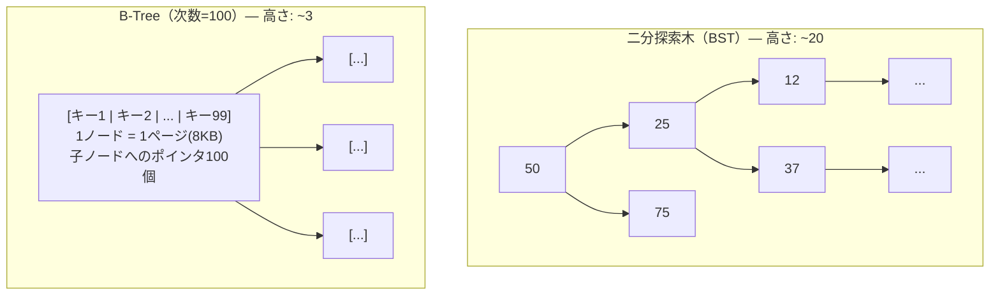
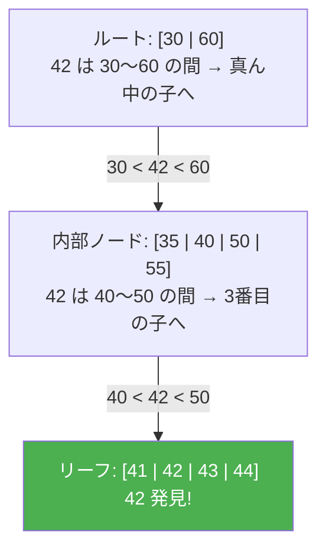
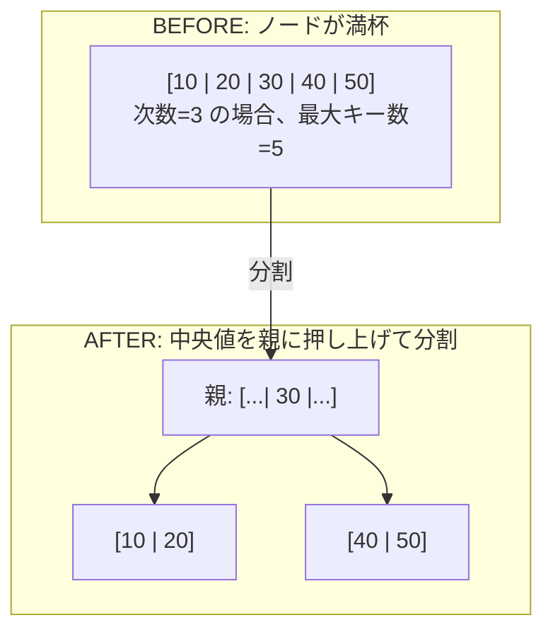
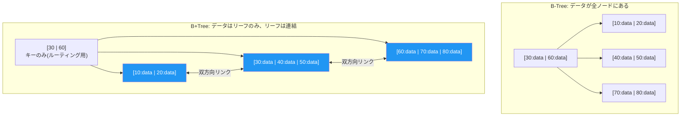

# B-TreeとB+Tree（B-Tree and B+Tree）

> **一言で言うと:** B-Treeはディスクのブロック読み書きに最適化された平衡多分木で、[[Resources/Study/Layer3-データ永続化/インデックス|インデックス]]の内部構造として使われる。B+Treeはその改良版で、データをリーフノードにのみ格納し、範囲検索に強い。RDBのインデックスはほぼ全てB+Treeである。

## なぜ二分探索木では不十分なのか

[[データ構造とアルゴリズム]]で学ぶ二分探索木（BST: Binary Search Tree）は、メモリ上では O(log n) で効率的に検索できる。しかしデータベースのデータはディスク上にあり、ディスクI/Oには根本的な制約がある。

**ディスクI/Oの特性:**
- ディスクは **ページ（ブロック）単位** で読み書きする（通常4KB〜16KB）
- 1バイトだけ読むのも、4KB読むのも、かかる時間はほぼ同じ
- ランダムアクセス1回にHDDで約10ms、SSDで約0.1ms

二分探索木は1ノードに1つのキーしか持たないため、ノード数が多くツリーが深い。100万キーの二分探索木は高さ約20で、最悪20回のディスクI/Oが必要になる。しかも各I/Oで読み込むデータは数バイトだけ — **4KBのページのほとんどが無駄になる**。



B-Treeは1ノードに**数百のキー**を格納し、1回のI/Oでページ分のデータを丸ごと読み込む。結果としてツリーの高さが3〜4に収まり、数百万行のテーブルでも3〜4回のディスクアクセスで目的のデータに到達できる。

## B-Treeの構造

B-Tree（Balanced Tree）は Rudolf Bayer と Edward McCreight が1972年に発表した自己平衡型の多分木である。

### 基本ルール（次数 m のB-Tree）

1. 各ノードは最大 **m-1 個のキー** と **m 個の子ポインタ** を持つ
2. 各ノード（ルート以外）は最低 **⌈m/2⌉-1 個のキー** を持つ（半分以上埋まっている）
3. 全てのリーフは同じ深さにある（**完全に平衡**）
4. キーはノード内でソート済み

### 検索の流れ

値 `42` を検索する場合:



各ノードの読み込みが1回のディスクI/Oに対応する。この例ではたった **3回のI/O** で目的のデータに到達した。

### 挿入と分割（Split）

B-Treeは挿入時にノードが溢れると、**分割（Split）** によってバランスを維持する。



分割は親ノードに中央のキーを押し上げる。親も溢れた場合は再帰的に分割が伝播し、ルートが分割されるとツリーの高さが1増える。**高さが増えるのはルートの分割時だけ**なので、全リーフが常に同じ深さに保たれる。

### 削除とマージ（Merge）

削除によってノードのキー数が最小値を下回ると、**隣接ノードからの借用（Redistribution）** または **マージ（Merge）** が発生する。

## B+Tree — RDBが実際に使う改良版

RDB（PostgreSQL、MySQL InnoDB、SQLite）のインデックスは B-Tree ではなく **B+Tree** を使っている。

### B-Treeとの本質的な違い



| 特性 | B-Tree | B+Tree |
|------|--------|--------|
| データの位置 | 全ノード | **リーフノードのみ** |
| 内部ノードの役割 | キー + データ + 子ポインタ | キー + 子ポインタ（ルーティング専用） |
| リーフノード間の接続 | なし | **双方向リンクリスト** |
| 内部ノードのファンアウト | 低い（データが場所を取る） | **高い**（キーだけなので多くのキーが入る） |
| 等値検索 | 内部ノードで見つかれば速い | 必ずリーフまで降りる |
| **範囲検索** | ツリーを繰り返し走査 | **リーフを横方向にスキャンするだけ** |

### B+Treeが範囲検索に強い理由

```sql
SELECT * FROM users WHERE age BETWEEN 20 AND 30;
```

B+Treeでは:
1. ルートから `age = 20` のリーフを見つける（O(log n)、3〜4回のI/O）
2. そこからリーフの双方向リンクを辿って `age = 30` まで順に読む（シーケンシャルI/O）

B-Treeでは:
1. `age = 20` をツリー内で見つける
2. 次のキー `21`, `22`, ... をそれぞれツリーを走査して見つける必要がある

**シーケンシャルI/O（連続読み取り）はランダムI/Oの数十〜数百倍高速**であるため、範囲検索でのB+Treeの優位性は圧倒的になる。

### ファンアウトの計算例

PostgreSQLのデフォルトページサイズは8KBである。BIGINT（8バイト）のキーでインデックスを作った場合:

```
ページサイズ: 8,192 バイト
ヘッダ等のオーバーヘッド: 約 100 バイト
キー1つ + ポインタ: 約 16 バイト

1ページに格納できるキー数 ≈ (8192 - 100) / 16 ≈ 505 キー
```

| ツリーの高さ | 格納可能行数 | ディスクI/O回数 |
|------------|------------|--------------|
| 1（ルートのみ） | 約505行 | 1回 |
| 2 | 約505² = 約25万行 | 2回 |
| 3 | 約505³ = 約1.3億行 | 3回 |
| 4 | 約505⁴ = 約650億行 | 4回 |

**1.3億行でも3回のディスクI/Oで検索が完了する。** しかもルートページと2段目のページはバッファプール（メモリキャッシュ）に載っていることが多いため、実質1〜2回のI/Oで済む。

## コード例

### TypeScript — B-Treeの簡易実装（概念理解用）

```typescript
// B-Treeの検索アルゴリズム（概念理解用の簡易実装）
interface BTreeNode<K> {
  keys: K[];          // ソート済みのキー配列
  children: BTreeNode<K>[]; // 子ノードのポインタ（リーフなら空）
  isLeaf: boolean;
}

function search<K>(node: BTreeNode<K>, key: K): { node: BTreeNode<K>; index: number } | null {
  // ノード内のキーを走査して位置を特定
  let i = 0;
  while (i < node.keys.length && key > node.keys[i]) {
    i++;
  }

  // キーが見つかった
  if (i < node.keys.length && key === node.keys[i]) {
    return { node, index: i };
  }

  // リーフに到達しても見つからなかった
  if (node.isLeaf) {
    return null;
  }

  // 適切な子ノードに再帰的に降りる
  return search(node.children[i], key);
}

// 使用例
const root: BTreeNode<number> = {
  keys: [30, 60],
  isLeaf: false,
  children: [
    { keys: [10, 20], isLeaf: true, children: [] },
    { keys: [35, 42, 50], isLeaf: true, children: [] },
    { keys: [70, 80, 90], isLeaf: true, children: [] },
  ],
};

const result = search(root, 42);
console.log(result); // { node: { keys: [35, 42, 50], ... }, index: 1 }
```

### Go — B-Treeの検索とディスクI/Oの可視化

```go
package main

import (
	"fmt"
	"sort"
)

// BTreeNode はB-Treeのノードを表す（概念理解用）
type BTreeNode struct {
	Keys     []int
	Children []*BTreeNode
	IsLeaf   bool
}

// Search はB-Treeからキーを検索し、アクセスしたノード数を返す
func Search(node *BTreeNode, key int) (*BTreeNode, int, int) {
	if node == nil {
		return nil, -1, 0
	}

	ioCount := 1 // このノードの読み込み = 1回のディスクI/O

	// ノード内のキーから位置を二分探索で特定
	i := sort.SearchInts(node.Keys, key)

	// キーが見つかった
	if i < len(node.Keys) && node.Keys[i] == key {
		return node, i, ioCount
	}

	// リーフなら見つからない
	if node.IsLeaf {
		return nil, -1, ioCount
	}

	// 子ノードに再帰
	found, idx, childIO := Search(node.Children[i], key)
	return found, idx, ioCount + childIO
}

func main() {
	// 3段のB-Treeを構築
	root := &BTreeNode{
		Keys:   []int{30, 60},
		IsLeaf: false,
		Children: []*BTreeNode{
			{Keys: []int{10, 20}, IsLeaf: true},
			{Keys: []int{35, 42, 50}, IsLeaf: true},
			{Keys: []int{70, 80, 90}, IsLeaf: true},
		},
	}

	// 検索してI/O回数を表示
	targets := []int{42, 10, 90, 55}
	for _, key := range targets {
		node, idx, ios := Search(root, key)
		if node != nil {
			fmt.Printf("key=%d: found at index %d, disk I/Os: %d\n", key, idx, ios)
		} else {
			fmt.Printf("key=%d: not found, disk I/Os: %d\n", key, ios)
		}
	}
	// key=42: found at index 1, disk I/Os: 2
	// key=10: found at index 0, disk I/Os: 2
	// key=90: found at index 2, disk I/Os: 2
	// key=55: not found, disk I/Os: 2
}
```

### SQL — B-Treeインデックスの動作を確認する

```sql
-- PostgreSQLでインデックスの内部構造を確認する
-- pageinspect 拡張を使ってB-Treeの中身を見る
CREATE EXTENSION IF NOT EXISTS pageinspect;

-- テスト用テーブルとインデックス
CREATE TABLE test_btree (id BIGINT PRIMARY KEY, value TEXT);
INSERT INTO test_btree
    SELECT i, 'value_' || i FROM generate_series(1, 10000) AS i;

-- B-Treeのメタ情報を確認
SELECT * FROM bt_metap('test_btree_pkey');
-- level（ツリーの高さ）、root（ルートページ番号）等が見える

-- 特定ページのキーを確認
SELECT * FROM bt_page_items('test_btree_pkey', 1) LIMIT 10;
-- 各キーとその位置（ctid）が見える

-- EXPLAIN でインデックスの使用を確認
EXPLAIN (ANALYZE, BUFFERS)
SELECT * FROM test_btree WHERE id = 5000;
-- Buffers: shared hit=3 → 3ページ（=3ノード）をアクセス
```

## 実務での影響 — なぜWeb開発者がB-Treeを知るべきか

B-Treeの構造を理解していると、以下の「なぜ」に答えられるようになる:

| 現象 | B-Treeの知識による説明 |
|------|---------------------|
| UUID v4 の主キーでINSERTが遅い | ランダム値がB+Treeの様々な位置に挿入され、ページ分割が頻発する。[[サロゲートキーと自然キー\|UUID v7]]は単調増加なので末尾への追記で済む |
| `LIKE '%keyword%'` が遅い | B-Treeは左端からの比較しかできない。中間一致はフルスキャンになる |
| 複合インデックス `(a, b)` で `WHERE b = ?` が効かない | B-Treeのキーは左から順にソートされる。`a` を飛ばして `b` だけでは木を辿れない |
| インデックスの追加で書き込みが遅くなった | INSERT/UPDATE のたびにB-Treeの挿入（+ 分割の可能性）が全インデックスで発生する |
| `ORDER BY created_at DESC LIMIT 10` が速い | B+Treeのリーフを末尾から10個辿るだけ（シーケンシャルI/O 1回） |
| テーブルサイズの割にインデックスが大きい | 内部ノードのキー+ポインタ、リーフノードのキー+行位置で、テーブルサイズの10〜30%程度になる |

## よくある落とし穴

1. **「B-Treeの B は Binary の B」** — よくある誤解だが、B-Treeの "B" の正式な意味は発明者たちによって明かされていない。"Balanced"、"Broad"、"Bayer"（発明者の名前）など諸説あるが、Binary ではない。B-Treeは多分木（1ノードに複数キー）であり、二分木とは根本的に異なる。

2. **「B-TreeとB+Treeは同じもの」** — 多くの文献やORMのドキュメントで「B-Tree」と呼ばれているものは、実際にはB+Treeであることが多い。PostgreSQLの `CREATE INDEX` は内部的にB+Treeを作成する。等値検索ではほぼ同じ性能だが、範囲検索の効率が大きく異なる。

3. **「メモリ上のデータ構造としてB-Treeを使うべき」** — B-TreeはディスクのブロックI/Oに最適化されたデータ構造であり、全データがメモリ上にある場合は赤黒木や[[ハッシュテーブル]]の方が効率的。言語の標準ライブラリで `TreeMap`（Java）や `BTreeMap`（Rust）が提供されている場合があるが、これらはキャッシュライン効率のために多分木を使っている別の事情がある。

## 関連トピック

- [[データ構造とアルゴリズム]] — 親トピック。二分探索木やハッシュテーブルとの比較
- [[Resources/Study/Layer3-データ永続化/インデックス|インデックス]] — B+TreeはRDBインデックスの中核データ構造
- [[ハッシュテーブル]] — 等値検索のみなら O(1) で B-Tree より速い。用途に応じて使い分ける
- [[計算量-BigO]] — B-Treeの検索 O(log n) の意味を理解する基礎
- [[ファイルシステムとIO]] — B-Treeがディスクのページ単位I/Oに最適化されている理由
- [[PostgreSQLとMySQLの比較]] — クラスタインデックス（MySQL）とヒープテーブル（PostgreSQL）でB+Treeの使われ方が異なる
- [[サロゲートキーと自然キー]] — UUID v4 vs v7 のB-Tree挿入性能差

## 参考リソース

- [Use The Index, Luke — Anatomy of an Index](https://use-the-index-luke.com/sql/anatomy) — B-Treeインデックスの内部構造を図解
- 『Database Internals』（Alex Petrov著） — B-Tree / B+Tree / LSM-Tree の実装を深く解説
- [PostgreSQL: pageinspect](https://www.postgresql.org/docs/current/pageinspect.html) — B-Treeの中身を直接確認する拡張
