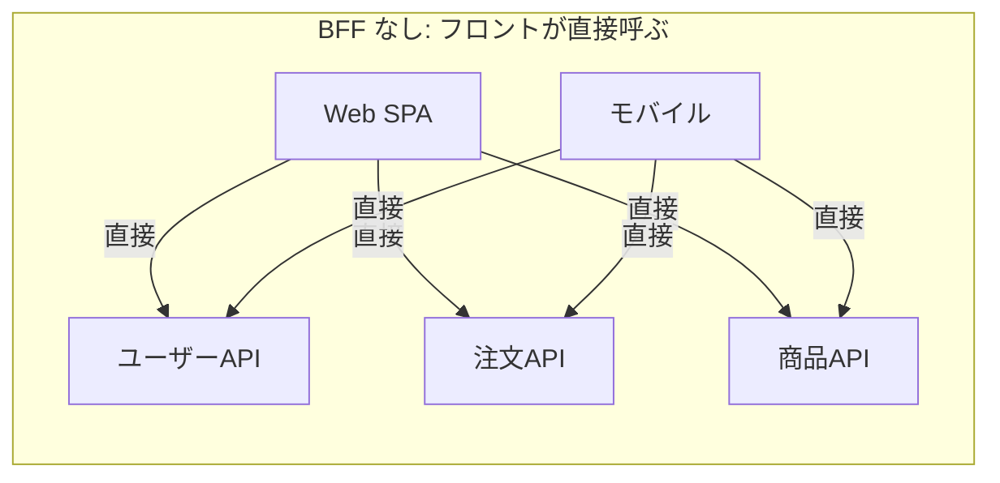
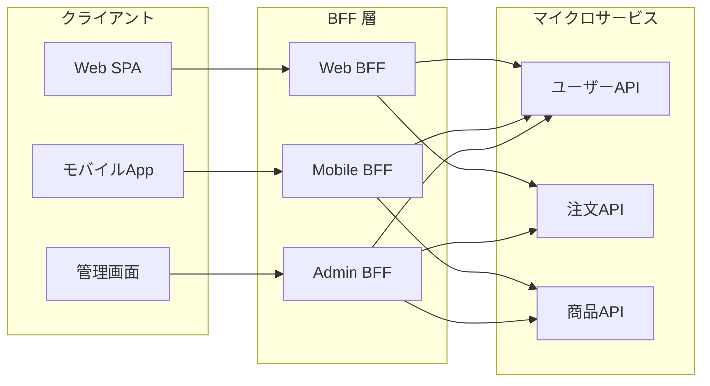
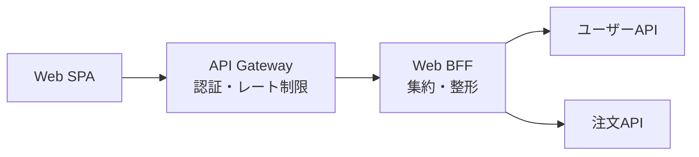
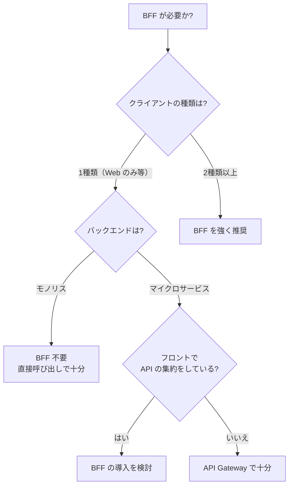

# Backend For Frontend（BFF）

> **一言で言うと:** フロントエンドの種類（Web、モバイル、管理画面など）ごとに専用のバックエンドサーバーを用意するアーキテクチャパターン。汎用 API とフロントエンドの間に「翻訳層」を挟むことで、各クライアントに最適化されたレスポンスを返す。

## なぜ必要か

フロントエンドからバックエンド API を直接呼び出す構成は、システムが小さいうちは問題なく動く。しかしクライアントの種類が増え、バックエンドがマイクロサービス化すると、以下の問題が表面化する:

1. **クライアントが複数のマイクロサービスを直接呼び分ける必要がある** — 1画面の表示に 5 つのサービスへリクエストが飛ぶ
2. **レスポンス形式がクライアントごとに異なる** — モバイルは軽量な JSON、Web は SEO 用のメタデータ付き、管理画面は全フィールド
3. **フロントエンドにビジネスロジックが漏れる** — 複数 API のレスポンスを結合・変換するロジックがクライアント側に蓄積する
4. **API の変更がフロントエンドに直撃する** — バックエンドのスキーマ変更がそのままクライアントの破壊的変更になる

BFF はこれらを解決するために、Sam Newman が 2015 年に提唱した（"Backends For Frontends" パターン）。

## フロントから直接 API を叩くリスク

BFF を経由せずにフロントエンドから REST API を直接呼ぶ構成のリスクを整理する。小規模な SPA + モノリス API なら問題にならないものも多いが、システムが成長すると顕在化する。

### アーキテクチャ上のリスク



| リスク | 説明 | 具体例 |
|--------|------|--------|
| **Over-fetching / Under-fetching** | 汎用 API はすべてのクライアントに対応するため、あるクライアントには不要なフィールドまで返す（Over-fetching）。逆に1画面に必要なデータが複数エンドポイントに分散する（Under-fetching） | モバイルのリスト画面で `GET /users/42` が返す 30 フィールドのうち 3 つしか使わない |
| **クライアント側のオーケストレーション** | 複数 API の呼び出し順序・エラーハンドリング・データ結合のロジックがフロントに蓄積し、テストが困難になる | 「ユーザー取得 → ユーザーの注文一覧取得 → 注文ごとの商品詳細取得」を React コンポーネントで直列実行 |
| **API 変更の影響範囲が広い** | バックエンドの内部リファクタリング（エンドポイント統合・フィールド名変更）がすべてのクライアントに影響する | ユーザーサービスの `full_name` → `first_name` + `last_name` 分割が Web・モバイル・管理画面すべてに破壊的変更 |
| **通信回数の増大** | モバイル回線のような高レイテンシ環境で、複数の直列リクエストが UX を大きく劣化させる | 3G 回線で 5 つの API を直列呼び出し → 合計 RTT が数秒に膨らむ |

### セキュリティ上のリスク

| リスク | 説明 | BFF があれば |
|--------|------|-------------|
| **内部 API のエンドポイントがブラウザに露出する** | マイクロサービスのホスト名・パス構造がネットワークタブから丸見えになる | BFF が単一のエントリポイントとなり、内部構造を隠蔽する |
| **認証トークンの管理がフロントに集中する** | JWT やアクセストークンをブラウザの localStorage / Cookie で管理し、各 API に付与する責務がフロントにある | BFF がセッション管理を担い、フロントは BFF との間だけで認証する（Token Relay パターン） |
| **CORS の設定が複雑化する** | 各マイクロサービスが個別に [[CORS]] ヘッダを設定する必要がある。設定漏れがセキュリティホールになる | BFF が同一オリジンまたは単一の CORS ポリシーでフロントに応答する |
| **レスポンスに不要な内部情報が含まれる** | 汎用 API が管理画面向けのフィールド（内部 ID、監査ログ、原価情報）をすべてのクライアントに返してしまう | BFF がクライアントに必要なフィールドだけに絞って返す |

## BFF のアーキテクチャ



BFF の核心は「**クライアントの種類ごとに 1 つの BFF**」という点にある。すべてのクライアントが共有する単一の API Gateway とは異なり、各 BFF はそのクライアントの画面要件に最適化されたレスポンスを返す。

### BFF の責務

| 責務 | 具体的な処理 |
|------|-------------|
| **API の集約（Aggregation）** | 複数マイクロサービスのレスポンスを1つに結合して返す |
| **レスポンスの整形** | クライアントに不要なフィールドを除去し、必要な形式に変換する |
| **プロトコル変換** | 内部が gRPC でもフロントには REST / GraphQL で公開する |
| **認証の仲介** | フロントとの間でセッションを管理し、内部サービスへは別の認証（サービス間トークン）で通信する |
| **キャッシュ** | クライアント固有のキャッシュ戦略を適用する |

## API Gateway との違い

BFF と API Gateway は混同されやすいが、関心事が異なる。

| 観点 | API Gateway | BFF |
|------|------------|-----|
| 数 | システム全体で**1つ**（または少数） | クライアントの種類ごとに**1つずつ** |
| 責務 | 認証、レート制限、ルーティング、ロギングなど**横断的関心事** | レスポンスの集約・整形など**クライアント固有のロジック** |
| 所有チーム | インフラ / プラットフォームチーム | フロントエンドチーム |
| ロジックの範囲 | 横断的関心事のみ（ビジネスロジックを含まない） | 表示・整形ロジックのみ（ビジネスロジックは含まない） |

実務では **API Gateway の背後に BFF を配置する**構成が一般的:



## コード例

### TypeScript（Node.js / Express）— Web BFF

```typescript
import express from 'express';

const app = express();

// 内部マイクロサービスの URL（環境変数で管理）
const USER_API = process.env.USER_API_URL!;
const ORDER_API = process.env.ORDER_API_URL!;

// BFF エンドポイント: ダッシュボード用の集約データを返す
// フロントは 1 回のリクエストで画面に必要な全データを取得できる
app.get('/bff/dashboard/:userId', async (req, res) => {
  const { userId } = req.params;

  // 複数サービスに並列リクエスト
  const [userRes, ordersRes] = await Promise.all([
    fetch(`${USER_API}/users/${userId}`),
    fetch(`${ORDER_API}/users/${userId}/orders?limit=5`),
  ]);

  if (!userRes.ok) {
    return res.status(userRes.status).json({ error: 'User not found' });
  }

  const user = await userRes.json();
  const orders = await ordersRes.json();

  // クライアントに必要なフィールドだけに絞って返す
  res.json({
    name: user.name,
    email: user.email,
    recentOrders: orders.map((o: any) => ({
      id: o.id,
      total: o.total_amount,  // 内部の命名を API 契約に変換
      date: o.created_at,
      status: o.status,
    })),
  });
});

app.listen(3000);
```

### Go — BFF エンドポイント（並列集約）

```go
package main

import (
	"encoding/json"
	"fmt"
	"net/http"
	"sync"
)

type DashboardResponse struct {
	Name         string  `json:"name"`
	Email        string  `json:"email"`
	RecentOrders []Order `json:"recentOrders"`
}

type Order struct {
	ID     string `json:"id"`
	Total  int    `json:"total"`
	Date   string `json:"date"`
	Status string `json:"status"`
}

func dashboardHandler(w http.ResponseWriter, r *http.Request) {
	userID := r.PathValue("userID")

	var (
		user   map[string]any
		orders []map[string]any
		mu     sync.Mutex
		wg     sync.WaitGroup
		apiErr error
	)

	wg.Add(2)

	// ユーザー取得
	go func() {
		defer wg.Done()
		resp, err := http.Get(fmt.Sprintf("http://user-service/users/%s", userID))
		if err != nil {
			mu.Lock()
			apiErr = err
			mu.Unlock()
			return
		}
		defer resp.Body.Close()
		mu.Lock()
		json.NewDecoder(resp.Body).Decode(&user)
		mu.Unlock()
	}()

	// 注文取得（失敗時は空配列として扱い、ダッシュボードの他の情報は表示する）
	go func() {
		defer wg.Done()
		resp, err := http.Get(fmt.Sprintf("http://order-service/users/%s/orders?limit=5", userID))
		if err != nil {
			return // orders は nil のまま → RecentOrders が空配列になる
		}
		defer resp.Body.Close()
		mu.Lock()
		json.NewDecoder(resp.Body).Decode(&orders)
		mu.Unlock()
	}()

	wg.Wait()
	if apiErr != nil {
		http.Error(w, `{"error":"internal"}`, http.StatusBadGateway)
		return
	}

	// クライアント向けに整形
	result := DashboardResponse{
		Name:  fmt.Sprint(user["name"]),
		Email: fmt.Sprint(user["email"]),
	}
	for _, o := range orders {
		result.RecentOrders = append(result.RecentOrders, Order{
			ID:     fmt.Sprint(o["id"]),
			Total:  int(o["total_amount"].(float64)),
			Date:   fmt.Sprint(o["created_at"]),
			Status: fmt.Sprint(o["status"]),
		})
	}

	w.Header().Set("Content-Type", "application/json")
	json.NewEncoder(w).Encode(result)
}

func main() {
	mux := http.NewServeMux()
	mux.HandleFunc("GET /bff/dashboard/{userID}", dashboardHandler)
	http.ListenAndServe(":3000", mux)
}
```

### PHP（Laravel）— BFF コントローラ

```php
namespace App\Http\Controllers;

use Illuminate\Http\JsonResponse;
use Illuminate\Support\Facades\Http;

class DashboardBffController extends Controller
{
    public function show(string $userId): JsonResponse
    {
        // 複数サービスに並列リクエスト（Laravel HTTP Client の pool）
        $responses = Http::pool(fn ($pool) => [
            $pool->as('user')->get(config('services.user_api.url') . "/users/{$userId}"),
            $pool->as('orders')->get(config('services.order_api.url') . "/users/{$userId}/orders", [
                'limit' => 5,
            ]),
        ]);

        if ($responses['user']->failed()) {
            return response()->json(['error' => 'User not found'], 404);
        }

        $user = $responses['user']->json();
        $orders = $responses['orders']->json();

        // フロント向けに必要なフィールドだけ返す
        return response()->json([
            'name'  => $user['name'],
            'email' => $user['email'],
            'recentOrders' => collect($orders)->map(fn ($o) => [
                'id'     => $o['id'],
                'total'  => $o['total_amount'],
                'date'   => $o['created_at'],
                'status' => $o['status'],
            ])->all(),
        ]);
    }
}
```

## BFF を導入すべきかの判断基準



**BFF が不要なケース:**
- SPA + モノリス API で、API が1つのサービスに集約されている
- Next.js / Nuxt.js などの SSR フレームワークを使っている場合、フレームワーク自体が BFF の役割を果たす（[[SSR-SSG-CSR|Server Components]] がサーバー側で API を集約する）
- クライアントが1種類で、API のレスポンスがそのクライアントに最適化されている

**BFF を導入すべきケース:**
- Web・モバイル・管理画面など複数のクライアントが同じバックエンドを共有する
- フロントエンドのコードに API レスポンスの結合・変換ロジックが増えてきた
- セキュリティ要件として内部 API の構造をクライアントに露出したくない

## よくある落とし穴

### 1. BFF が「もう一つのモノリス」になる

BFF に認証・バリデーション・ビジネスロジック・データ変換を全て詰め込むと、BFF 自体が巨大なモノリスになる。BFF の責務は**集約と整形**に限定し、ビジネスロジックはバックエンドサービスに置く。

### 2. BFF 間でコードが重複する

Web BFF と Mobile BFF で似たようなコードが生まれる。共通ロジックを無理に共有ライブラリに切り出すと、BFF の独立性が失われる。**重複は許容し、各 BFF がそれぞれのクライアントに最適化される自由を優先する**。

### 3. BFF を API Gateway と混同する

レート制限・認証・ロギングといった横断的関心事を BFF に実装すると、API Gateway と責務が重複する。これらは API Gateway に任せ、BFF はクライアント固有の関心事に集中する。

### 4. BFF がバックエンドの変更を隠蔽しすぎる

BFF がバックエンドの変更を吸収しすぎると、BFF の変更コストが高くなる。BFF は「薄い変換層」に留め、バックエンドの大きな変更はフロントエンドにも伝播させるべき。

## AIによる実装のアンチパターン

| アンチパターン | なぜ問題か | 対策 |
|---|---|---|
| BFF でバリデーションとビジネスロジックを実装する | BFF が肥大化し、バックエンドサービスと責務が重複する | BFF は集約・整形に徹し、ロジックはバックエンドに置く |
| 全クライアント共用の「汎用 BFF」を作る | 各クライアントの要件を全て満たそうとして汎用 API と同じ問題に回帰する | クライアントの種類ごとに BFF を分ける |
| BFF 内でバックエンド API を直列に呼ぶ | レイテンシが合算される。3 サービスを直列で呼ぶと 3 倍の応答時間になる | 依存関係がない呼び出しは `Promise.all` や goroutine で並列化する |
| BFF を経由してバックエンドのレスポンスをそのまま返す | BFF の意味がない。レスポンスの整形・フィールド絞り込みを行わなければ単なるプロキシ | クライアントに必要なフィールドだけに変換して返す |

## 関連トピック

- [[API設計-REST-GraphQL]] — 親トピック。BFF は REST と GraphQL の使い分け戦略の一つ
- [[CORS]] — BFF がない場合、各マイクロサービスで個別に CORS 設定が必要になる
- [[認証と認可]] — BFF でのセッション管理と Token Relay パターン
- [[SSR-SSG-CSR]] — Next.js の Server Components は BFF の役割を内包する
- [[SDKとAPIクライアント]] — BFF からバックエンドサービスを呼ぶ際の SDK 活用

## 参考リソース

- Sam Newman, "Backends For Frontends" (2015) — BFF パターンの提唱者による解説記事
- 「マイクロサービスアーキテクチャ」（Sam Newman 著、オライリー）— BFF を含むマイクロサービスの設計パターン
- Phil Calçado, "The Back-end for Front-end Pattern (BFF)" — SoundCloud での実践事例
