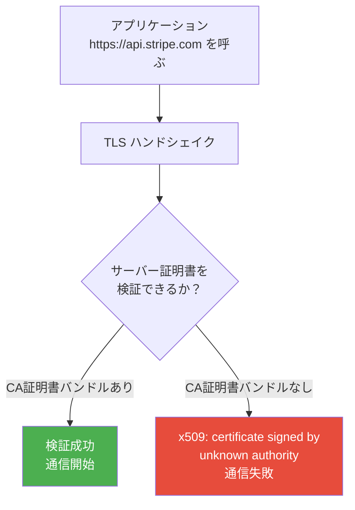
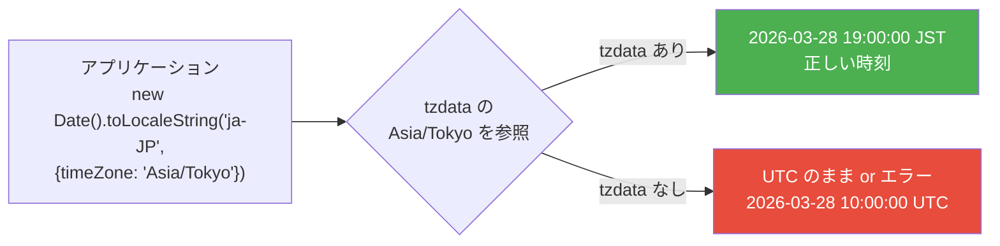

# CA証明書（cacert）とタイムゾーンデータ（tzdata）

> **一言で言うと:** 通常の Linux ディストリビューションや Docker ベースイメージには「当たり前に入っている」ために意識されないが、最小構成のコンテナイメージ（Nix dockerTools, distroless, scratch）ではこれらが欠落し、HTTPS 通信の全滅やログの時刻ズレといった本番障害を引き起こす。

## なぜこの知識が必要か

`FROM node:20-slim` のようなベースイメージを使っている限り、CA証明書もタイムゾーンデータも最初から含まれている。しかし以下の場面で問題が顕在化する：

- Nix の `dockerTools.buildLayeredImage` で本番イメージを生成するとき
- Google の distroless イメージ（`gcr.io/distroless/nodejs`）を使うとき
- Go や Rust のバイナリを `FROM scratch` で動かすとき
- Alpine ベースイメージで `tzdata` を入れ忘れたとき

いずれも「ローカルでは動くのに本番で壊れる」パターンであり、原因の特定に時間がかかることが多い。

## CA証明書（Certificate Authority Certificates）

### CA証明書とは

HTTPS 通信で相手サーバーの証明書が「信頼できるか」を検証するための、**信頼のルート**となる証明書群。ブラウザや OS にはあらかじめ数百の CA 証明書がバンドルされている。



### 通常の環境での配置場所

| 環境 | CA証明書の場所 | 管理方法 |
|------|-------------|---------|
| Ubuntu / Debian | `/etc/ssl/certs/ca-certificates.crt` | `ca-certificates` パッケージ |
| RHEL / Amazon Linux | `/etc/pki/tls/certs/ca-bundle.crt` | `ca-certificates` パッケージ |
| Alpine | `/etc/ssl/certs/ca-certificates.crt` | `ca-certificates` パッケージ |
| macOS | システムキーチェーン | OS 更新で自動管理 |
| Node.js Docker イメージ | ベース Debian に含まれている | イメージ更新で管理 |
| Nix | `/nix/store/...-cacert-.../etc/ssl/certs/` | `pkgs.cacert` パッケージ |

### CA証明書がないと何が起きるか

外部の HTTPS エンドポイントへの全ての通信が失敗する。

```javascript
// Node.js — CA証明書がないコンテナで外部APIを呼ぶ
const res = await fetch('https://api.stripe.com/v1/charges');
// Error: unable to verify the first certificate
// または: UNABLE_TO_GET_ISSUER_CERT_LOCALLY
```

```go
// Go — 同様のエラー
resp, err := http.Get("https://api.stripe.com/v1/charges")
// x509: certificate signed by unknown authority
```

```python
# Python — requests ライブラリ
import requests
requests.get('https://api.stripe.com')
# ssl.SSLCertVerificationError: [SSL: CERTIFICATE_VERIFY_FAILED]
```

**危険な「解決策」に注意:** エラーを見て `NODE_TLS_REJECT_UNAUTHORIZED=0` や `verify=False` で証明書検証を無効化するのは、中間者攻撃（Man-in-the-Middle）を許すことになる。根本原因は CA 証明書の欠落であり、バンドルを追加するのが正しい対処。

### 各環境での追加方法

**Dockerfile（Alpine ベース）:**

```dockerfile
FROM alpine:3.20
# CA証明書を明示的にインストール
RUN apk add --no-cache ca-certificates
```

**Dockerfile（distroless）:**

```dockerfile
# distroless は CA 証明書を含んでいるが、
# カスタムCAを追加したい場合はマルチステージで
FROM debian:bookworm-slim AS certs
RUN apt-get update && apt-get install -y --no-install-recommends ca-certificates

FROM gcr.io/distroless/nodejs20
COPY --from=certs /etc/ssl/certs/ca-certificates.crt /etc/ssl/certs/
```

**Nix dockerTools:**

```nix
pkgs.dockerTools.buildLayeredImage {
  name = "myapp";
  contents = [
    pkgs.cacert    # /etc/ssl/certs/ に CA 証明書を配置
    # ...
  ];
  config = {
    Env = [
      # 一部のランタイムは環境変数で証明書の場所を指定する必要がある
      "SSL_CERT_FILE=/etc/ssl/certs/ca-bundle.crt"
      "NIX_SSL_CERT_FILE=/etc/ssl/certs/ca-bundle.crt"
    ];
  };
};
```

### 社内のプライベート CA を使っている場合

社内の HTTPS サービスが自己署名証明書やプライベート CA を使っている場合、公開 CA 証明書バンドルに加えて社内 CA の証明書もコンテナに追加する必要がある。

```dockerfile
# 公開 CA + 社内 CA をマージ
FROM node:20-slim
COPY internal-ca.crt /usr/local/share/ca-certificates/
RUN update-ca-certificates
```

```nix
# Nix の場合
let
  customCacert = pkgs.cacert.override {
    extraCertificateFiles = [ ./internal-ca.crt ];
  };
in
pkgs.dockerTools.buildLayeredImage {
  contents = [ customCacert ];
  # ...
};
```

## タイムゾーンデータ（tzdata / IANA Time Zone Database）

### tzdata とは

世界中のタイムゾーンの定義 — UTC からのオフセット、サマータイム（DST）の切り替え日時、歴史的な変更 — を収録したデータベース。正式名称は IANA Time Zone Database（別名: Olson database）。



### 通常の環境での配置場所

| 環境 | tzdata の場所 | 管理方法 |
|------|-------------|---------|
| Linux 全般 | `/usr/share/zoneinfo/` | `tzdata` パッケージ |
| Alpine | `/usr/share/zoneinfo/` | `tzdata` パッケージ（デフォルトでは入っていない） |
| macOS | `/var/db/timezone/zoneinfo/` | OS 更新で管理 |
| Nix | `/nix/store/...-tzdata-.../share/zoneinfo/` | `pkgs.tzdata` パッケージ |

`/usr/share/zoneinfo/` 配下にはタイムゾーンごとのバイナリファイルが配置されている：

```
/usr/share/zoneinfo/
├── Asia/
│   ├── Tokyo          # UTC+9, DST なし
│   ├── Shanghai       # UTC+8, DST なし（2014年に廃止）
│   └── Kolkata        # UTC+5:30
├── America/
│   ├── New_York       # UTC-5, DST あり（3月→11月は UTC-4）
│   └── Los_Angeles    # UTC-8, DST あり
├── Europe/
│   ├── London         # UTC+0, DST あり
│   └── Berlin         # UTC+1, DST あり
└── UTC                # 基準時刻
```

### tzdata がないと何が起きるか

**ケース1: タイムゾーン変換が失敗する**

```go
// Go — tzdata がないコンテナ
loc, err := time.LoadLocation("Asia/Tokyo")
// panic: unknown time zone Asia/Tokyo
```

```python
# Python — zoneinfo (3.9+)
from zoneinfo import ZoneInfo
tz = ZoneInfo("Asia/Tokyo")
# zoneinfo._common.ZoneInfoNotFoundError: 'No time zone found with key Asia/Tokyo'
```

**ケース2: ログのタイムスタンプが UTC のまま**

```
# 期待: 日本時間で記録
{"time":"2026-03-28T19:00:00+09:00","msg":"Order placed"}

# 実際: UTC のまま（tzdata なし or TZ 未設定）
{"time":"2026-03-28T10:00:00Z","msg":"Order placed"}
```

CloudWatch Logs の検索で「今日の19時頃のエラー」を探すときに、UTC で検索しなければならず混乱する。

**ケース3: cron やスケジュール処理の実行時刻がズレる**

```javascript
// 「毎日日本時間の9:00に実行」のつもりが UTC 9:00 に実行される
// → 日本時間では18:00に動いてしまう
```

### 各環境での追加方法

**Dockerfile（Alpine ベース）:**

```dockerfile
FROM alpine:3.20
RUN apk add --no-cache tzdata
ENV TZ=Asia/Tokyo
```

**Dockerfile（特定の TZ だけ欲しい場合 — イメージサイズ削減）:**

```dockerfile
FROM alpine:3.20 AS tz
RUN apk add --no-cache tzdata

FROM node:20-alpine
# 全 tzdata ではなく必要な TZ だけコピー
COPY --from=tz /usr/share/zoneinfo/Asia/Tokyo /usr/share/zoneinfo/Asia/Tokyo
COPY --from=tz /usr/share/zoneinfo/UTC /usr/share/zoneinfo/UTC
ENV TZ=Asia/Tokyo
```

**Nix dockerTools:**

```nix
pkgs.dockerTools.buildLayeredImage {
  name = "myapp";
  contents = [
    pkgs.tzdata    # /usr/share/zoneinfo/ 相当を配置
    # ...
  ];
  config = {
    Env = [
      "TZ=Asia/Tokyo"
      # Go は ZONEINFO 環境変数で探す場合がある
      "ZONEINFO=${pkgs.tzdata}/share/zoneinfo"
    ];
  };
};
```

**Go — バイナリに tzdata を埋め込む（コンテナに tzdata 不要にする方法）:**

```go
// main.go — Go 1.15+ で利用可能
import _ "time/tzdata"  // この1行で tzdata をバイナリに埋め込み

// これにより FROM scratch でも time.LoadLocation("Asia/Tokyo") が動く
```

### TZ 環境変数 vs アプリケーションでの指定

| 方法 | 影響範囲 | 推奨ケース |
|------|---------|-----------|
| `ENV TZ=Asia/Tokyo` | コンテナ内の全プロセス | 単一タイムゾーンで運用する場合 |
| アプリケーション内で指定 | そのコードのみ | マルチリージョン、ユーザーごとの TZ |

```javascript
// アプリケーション側で明示的に指定する方が安全
// TZ 環境変数に依存しない
const formatter = new Intl.DateTimeFormat('ja-JP', {
  timeZone: 'Asia/Tokyo',
  year: 'numeric', month: '2-digit', day: '2-digit',
  hour: '2-digit', minute: '2-digit', second: '2-digit',
});

console.log(formatter.format(new Date()));
// → "2026/03/28 19:00:00"
```

**ベストプラクティス:**
- ログのタイムスタンプは常に **UTC + ISO 8601 形式**（`2026-03-28T10:00:00Z`）で記録する
- タイムゾーン変換はログの表示時・ユーザー向け表示時にのみ行う
- サーバーの `TZ` 環境変数は `UTC` のままにし、アプリケーション層でユーザーのタイムゾーンに変換するのが最も事故が少ない

## tzdata の更新が重要な理由

タイムゾーンのルールは**政治的な決定で変わる**。サマータイムの廃止・導入、UTC オフセットの変更は各国の法改正で発生する。

過去の実例：
- **2011年 ロシア** — サマータイムを廃止し通年UTC+4に（後に撤回してUTC+3に）
- **2018年 北朝鮮** — UTC+8:30 から UTC+9 に変更（韓国と統一）
- **2019年 ブラジル** — サマータイムを廃止

古い `tzdata` を使い続けると、これらの変更が反映されず、特定地域のユーザーに対して1時間ズレた時刻を表示してしまう。`flake.lock` や Docker イメージのベースを定期的に更新する理由の一つ。

## よくある落とし穴

### 1. 「ローカルで動くから大丈夫」

ローカルの Docker Desktop はホスト OS の CA 証明書と tzdata を共有する場合がある。本番の Fargate では共有されないため、ローカルでは動くのに本番で HTTPS 通信が全滅するという事故が起きる。

### 2. Alpine で tzdata を入れ忘れる

`node:20-alpine` は tzdata を含まない。`node:20-slim`（Debian ベース）は含む。Alpine を選んだ場合は `apk add tzdata` が必要。

### 3. 証明書検証の無効化で「解決」してしまう

`NODE_TLS_REJECT_UNAUTHORIZED=0` は開発時のワークアラウンドとしてすら危険。本番にこの設定が残ると中間者攻撃を許す。正しい対処は CA 証明書バンドルの追加。

### 4. DST（サマータイム）の考慮漏れ

`Asia/Tokyo` は DST がないため問題ないが、`America/New_York` を扱うシステムでは、年に2回の DST 切り替え時にスケジュール処理が二重実行またはスキップされるバグが発生しうる。固定オフセット（`UTC-5`）ではなく tzdata のタイムゾーン名（`America/New_York`）を使うことで、DST の自動切り替えが正しく行われる。

## 参考リソース

- [IANA Time Zone Database](https://www.iana.org/time-zones) — tzdata の公式配布元
- [Mozilla CA Certificate Program](https://wiki.mozilla.org/CA) — ブラウザ・OS が信頼する CA の一覧管理
- [Let's Encrypt — Chain of Trust](https://letsencrypt.org/certificates/) — 証明書チェーンの仕組み
- [Go time/tzdata パッケージ](https://pkg.go.dev/time/tzdata) — バイナリ埋め込み方式のドキュメント

## 関連トピック

- [[Docker]] — コンテナイメージの構築と最小化
- [[AWSコンテナサービスとDockerの実運用]] — ECS + Nix での実運用における cacert/tzdata の扱い
- [[DockerとNix-Flakeによる開発環境管理]] — Nix dockerTools でのイメージ生成
