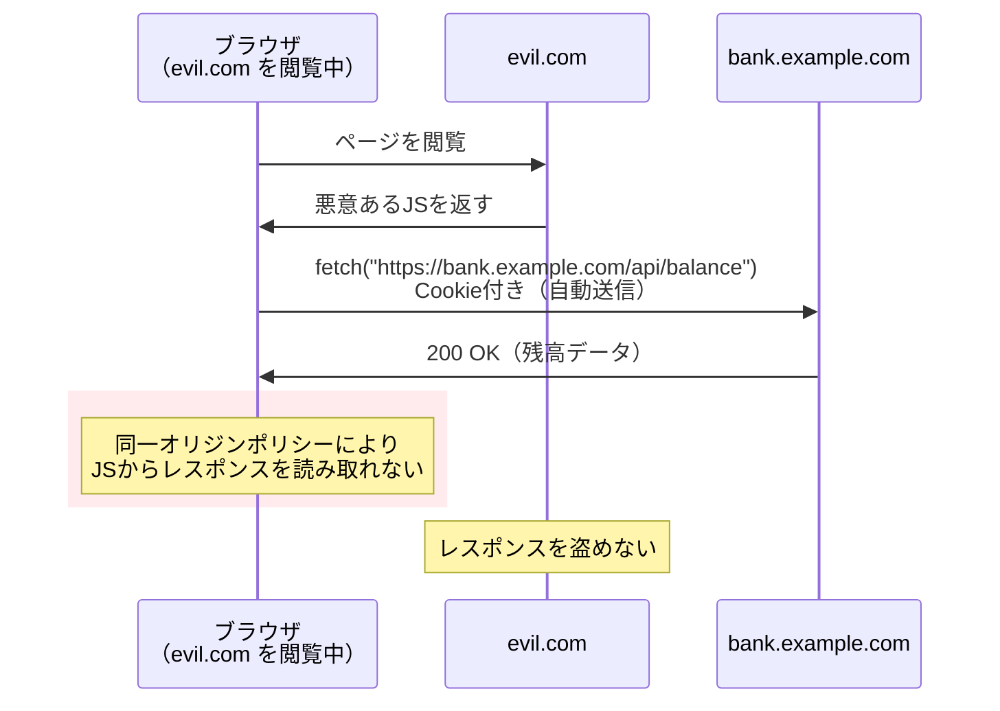
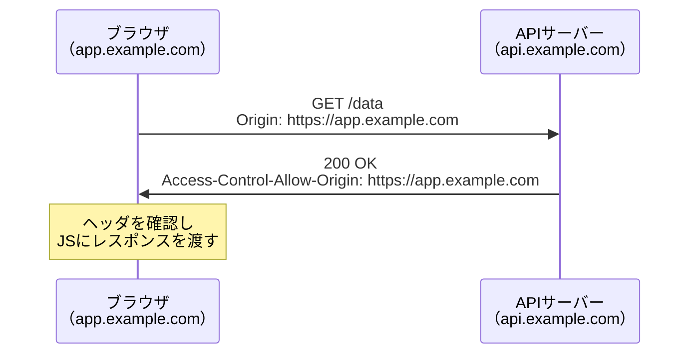
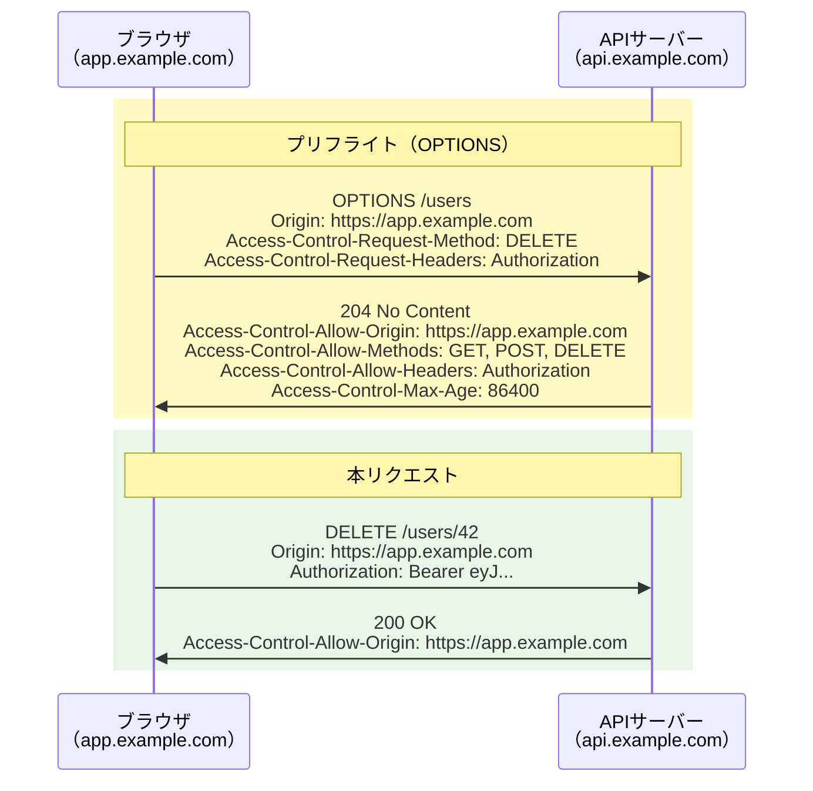

# CORS（Cross-Origin Resource Sharing）

> **一言で言うと:** ブラウザの同一オリジンポリシー（Same-Origin Policy）を**安全に緩和する**ための仕組み。サーバーが「このオリジンからのリクエストは許可する」とHTTPヘッダで宣言することで、異なるオリジン間の通信を制御する。

## 前提: 同一オリジンポリシー

CORSを理解するには、まず「なぜブラウザがクロスオリジンリクエストを制限するのか」を知る必要がある。

**オリジン（Origin）** = スキーム + ホスト + ポートの組み合わせ。1つでも異なれば「異なるオリジン」になる。

| URL | `https://app.example.com` と同一か | 理由 |
|-----|-----|------|
| `https://app.example.com/page` | 同一 | パスが違うだけ |
| `http://app.example.com` | 異なる | スキームが違う（http vs https） |
| `https://api.example.com` | 異なる | ホストが違う（サブドメイン違い） |
| `https://app.example.com:8080` | 異なる | ポートが違う |

ブラウザは同一オリジンポリシーにより、あるオリジンのページから**別のオリジンへのHTTPリクエストのレスポンス読み取り**をデフォルトで禁止する。これがないと、悪意あるサイトがユーザーのログイン済みセッションを利用して、銀行サイトのAPIを叩いてレスポンスを盗み見ることができてしまう。



**重要:** 同一オリジンポリシーが制限するのは**レスポンスの読み取り**であって、**リクエストの送信自体ではない**。リクエストはサーバーに到達する（これがCSRF攻撃の根拠）。CORSはこの「レスポンス読み取り禁止」を、サーバーの許可に基づいて緩和する。

## CORSの仕組み — 2つのリクエストフロー

### 単純リクエスト（Simple Request）

以下の条件を**すべて満たす**リクエストは、プリフライトなしで直接送信される:

- メソッドが `GET`、`HEAD`、`POST` のいずれか
- ヘッダが `Accept`、`Accept-Language`、`Content-Language`、`Content-Type` のみ
- `Content-Type` が `application/x-www-form-urlencoded`、`multipart/form-data`、`text/plain` のいずれか



### プリフライトリクエスト（Preflight Request）

単純リクエストの条件を満たさない場合（`PUT`/`DELETE` メソッド、`Authorization` ヘッダ、`application/json` の `Content-Type` など）、ブラウザは本リクエストの前に `OPTIONS` リクエストを送信して許可を確認する。



## CORSヘッダ一覧

### レスポンスヘッダ（サーバーが返す）

| ヘッダ | 役割 | 値の例 |
|--------|------|--------|
| `Access-Control-Allow-Origin` | 許可するオリジン | `https://app.example.com` または `*` |
| `Access-Control-Allow-Methods` | 許可するHTTPメソッド（プリフライト応答） | `GET, POST, PUT, DELETE` |
| `Access-Control-Allow-Headers` | 許可するリクエストヘッダ（プリフライト応答） | `Authorization, Content-Type` |
| `Access-Control-Allow-Credentials` | Cookieの送信を許可するか | `true` |
| `Access-Control-Expose-Headers` | JSから読み取り可能にするレスポンスヘッダ | `X-Request-Id, X-Total-Count` |
| `Access-Control-Max-Age` | プリフライト結果のキャッシュ秒数 | `86400`（24時間） |

### リクエストヘッダ（ブラウザが自動付与）

| ヘッダ | 役割 |
|--------|------|
| `Origin` | リクエスト元のオリジン |
| `Access-Control-Request-Method` | 本リクエストで使うメソッド（プリフライト時） |
| `Access-Control-Request-Headers` | 本リクエストで送るヘッダ（プリフライト時） |

## コード例

### Express（Node.js）— CORSミドルウェアの実装

```javascript
import express from 'express';

const app = express();

// 許可するオリジンのリスト
const ALLOWED_ORIGINS = [
  'https://app.example.com',
  'https://staging.example.com',
];

// CORSミドルウェア
function cors(req, res, next) {
  const origin = req.headers.origin;

  if (ALLOWED_ORIGINS.includes(origin)) {
    res.setHeader('Access-Control-Allow-Origin', origin);
    res.setHeader('Access-Control-Allow-Credentials', 'true');
    res.setHeader('Access-Control-Expose-Headers', 'X-Request-Id');
    res.setHeader('Vary', 'Origin');
  }

  // プリフライトリクエストへの応答
  if (req.method === 'OPTIONS') {
    res.setHeader('Access-Control-Allow-Methods', 'GET, POST, PUT, DELETE');
    res.setHeader('Access-Control-Allow-Headers', 'Authorization, Content-Type');
    res.setHeader('Access-Control-Max-Age', '86400');
    return res.status(204).end();
  }

  next();
}

app.use(cors);

app.get('/api/data', (req, res) => {
  res.json({ message: 'CORSが許可されたレスポンス' });
});

app.listen(3000);
```

### Go（Chi）— CORSミドルウェアの実装

```go
package main

import (
	"net/http"
	"slices"

	"github.com/go-chi/chi/v5"
)

var allowedOrigins = []string{
	"https://app.example.com",
	"https://staging.example.com",
}

func corsMiddleware(next http.Handler) http.Handler {
	return http.HandlerFunc(func(w http.ResponseWriter, r *http.Request) {
		origin := r.Header.Get("Origin")

		if slices.Contains(allowedOrigins, origin) {
			w.Header().Set("Access-Control-Allow-Origin", origin)
			w.Header().Set("Access-Control-Allow-Credentials", "true")
			w.Header().Set("Vary", "Origin")
		}

		// プリフライトリクエストへの応答
		if r.Method == http.MethodOptions {
			w.Header().Set("Access-Control-Allow-Methods", "GET, POST, PUT, DELETE")
			w.Header().Set("Access-Control-Allow-Headers", "Authorization, Content-Type")
			w.Header().Set("Access-Control-Max-Age", "86400")
			w.WriteHeader(http.StatusNoContent)
			return
		}

		next.ServeHTTP(w, r)
	})
}

func main() {
	r := chi.NewRouter()
	r.Use(corsMiddleware)

	r.Get("/api/data", func(w http.ResponseWriter, r *http.Request) {
		w.Header().Set("Content-Type", "application/json")
		w.Write([]byte(`{"message":"CORSが許可されたレスポンス"}`))
	})

	http.ListenAndServe(":3000", r)
}
```

### Python（FastAPI）— CORS設定

```python
from fastapi import FastAPI
from fastapi.middleware.cors import CORSMiddleware

app = FastAPI()

app.add_middleware(
    CORSMiddleware,
    allow_origins=["https://app.example.com", "https://staging.example.com"],
    allow_credentials=True,
    allow_methods=["GET", "POST", "PUT", "DELETE"],
    allow_headers=["Authorization", "Content-Type"],
    expose_headers=["X-Request-Id"],
    max_age=86400,
)

@app.get("/api/data")
def get_data():
    return {"message": "CORSが許可されたレスポンス"}
```

## よくある落とし穴

### 1. `Access-Control-Allow-Origin: *` と `Credentials` の併用

`Allow-Origin: *` と `Allow-Credentials: true` は**同時に使えない**。ブラウザはこの組み合わせを明示的に拒否する。Credentials（Cookie等）を送る場合は、`Allow-Origin` に具体的なオリジンを指定する必要がある。

```javascript
// ❌ ブラウザがエラーにする
res.setHeader('Access-Control-Allow-Origin', '*');
res.setHeader('Access-Control-Allow-Credentials', 'true');

// ✅ リクエストのOriginヘッダを検証して動的に設定
const origin = req.headers.origin;
if (allowedOrigins.includes(origin)) {
  res.setHeader('Access-Control-Allow-Origin', origin);
  res.setHeader('Access-Control-Allow-Credentials', 'true');
}
```

### 2. `Vary: Origin` ヘッダの付け忘れ

オリジンに応じて `Allow-Origin` の値を動的に変える場合、`Vary: Origin` を付けないとCDNやブラウザキャッシュが誤ったオリジンのレスポンスを返す。

```
# オリジンAへのレスポンスがキャッシュされ、
# オリジンBのリクエストにもそのキャッシュが返される → CORSエラー
```

### 3. プリフライトが飛ぶ条件の誤解

「`Content-Type: application/json` にしただけでプリフライトが発生する」ことに気づかないケースが多い。開発時にネットワークタブを見て `OPTIONS` リクエストが飛んでいることを確認し、サーバーが正しく応答しているかチェックすべき。

### 4. CORSをセキュリティの壁だと考える

CORSは**ブラウザの仕組み**であり、サーバーを保護するものではない。`curl` やサーバー間通信にはCORSの制約は存在しない。CORS設定だけで「不正なアクセスを防いでいる」と考えるのは危険。サーバー側での[[認証と認可]]は別途必須。

### 5. `Access-Control-Allow-Origin` にオリジンをリスト指定する

このヘッダには**1つのオリジンまたは `*`** しか指定できない。複数オリジンを許可するにはサーバー側でリクエストの `Origin` ヘッダを検証し、動的にレスポンスを返す必要がある。

```javascript
// ❌ 仕様違反（複数オリジン指定）
res.setHeader('Access-Control-Allow-Origin',
  'https://app.example.com, https://admin.example.com');

// ✅ サーバー側で検証して動的に返す
const origin = req.headers.origin;
if (allowedOrigins.includes(origin)) {
  res.setHeader('Access-Control-Allow-Origin', origin);
}
```

## AIによる実装のアンチパターン

| アンチパターン | なぜ問題か | 対策 |
|---|---|---|
| `Allow-Origin: *` で全開放 | 認証付きリクエストで使えず、本番に持ち込むとセキュリティリスク | 環境変数で許可オリジンを管理し、本番では具体的なオリジンのみ許可 |
| CORSミドルウェアとOPTIONSルートの二重定義 | プリフライトが2回処理されるか、片方が優先されて混乱 | フレームワークのCORS機能を使うか、ミドルウェアで一元管理 |
| 全メソッド・全ヘッダを許可 | 必要最小限の原則に反し、攻撃面が不必要に広がる | 実際に使うメソッドとヘッダのみを許可 |
| 開発用CORS設定を環境分岐なしに本番にデプロイ | `localhost:3000` や `*` が本番で許可される | 環境変数で `ALLOWED_ORIGINS` を管理 |

## 関連トピック

- [[ルーティングとミドルウェア]] — 親トピック。CORSはミドルウェアとして実装される代表例
- [[HTTP-HTTPS]] — CORSはHTTPヘッダベースの仕組み。オリジンの定義にスキーム（http/https）が含まれる
- [[認証と認可]] — `Allow-Credentials: true` との関係。CORS設定だけではサーバー保護にならない
- [[API設計-REST-GraphQL]] — フロントエンドとバックエンドが異なるオリジンにデプロイされる場合にCORS設定が必須
