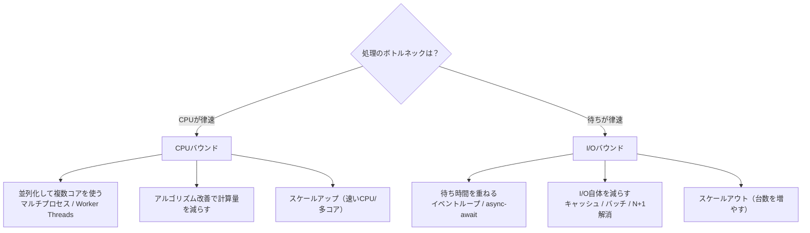
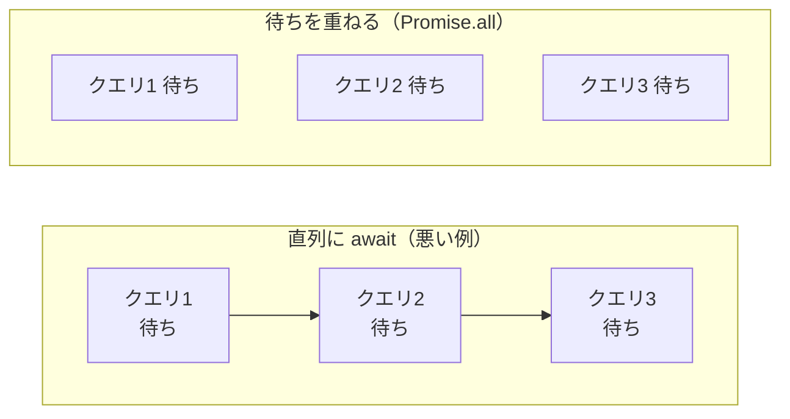

# CPUバウンドとI/Oバウンド（CPU-bound vs I/O-bound）

> **一言で言うと:** ある処理が「**CPUの計算速度**で頭打ちになる（CPUバウンド）」のか「**外部の応答待ち**で頭打ちになる（I/Oバウンド）」のかを見分ける考え方。どちらに分類されるかで、速くするための正しい打ち手（並行モデル・スレッド数・スケール方向）が正反対に変わる。

この区別は、本教材の至るところで「前提知識」として使われている。[[並行性の基本概念]] の「適切な並行モデルを選択する」、[[プロセスとスレッド]] の「I/Oバウンドにはイベント駆動、CPUバウンドにはマルチプロセス」、[[イベントループ]] が活きる理由、[[パフォーマンス最適化]] のボトルネック切り分け——これらはすべて、この一語の理解の上に乗っている。だからこそ、ここで一度しっかり腹落ちさせておく価値がある。

## まず「バウンド（bound）」とは何か

**バウンド（bound）** とは「**〜によって制約されている / 上限が決まっている**」という意味。日本語にすると「**律速**（りっそく）」が近い。化学反応で全体の速度を決める一番遅い段階を「律速段階」と呼ぶのと同じ発想で、**処理全体の速度を決めている一番のボトルネックが何か** を指す言葉だ。

- **CPUバウンド（CPU-bound）** = 処理速度がCPUの計算能力で律速されている。CPUがずっと忙しく働いていて、「もっと速いCPU / もっと多いコア」があれば速くなる状態。
- **I/Oバウンド（I/O-bound）** = 処理速度が入出力（Input/Output）の待ち時間で律速されている。CPUは暇で、「ディスク・ネットワーク・DBの応答」を待っている時間が支配的な状態。

ここで **I/O（Input/Output、入出力）** とは、プログラムが自分の外の世界とやりとりする操作すべてを指す。ディスクの読み書き、ネットワーク通信、DBへの問い合わせ、外部API呼び出し、ユーザーのキー入力などが該当する。これらは「リクエストを出してから結果が返るまで、CPUから見ると気が遠くなるほど長い」のが共通点だ（→ 時間スケールの感覚は後述）。


上の図がこの章の核心だ。CPUバウンドは「**CPUの帯がびっしり埋まっている**」。I/Oバウンドは「**CPUの仕事は点のように小さく、大半が待ち（空白）**」。この形の違いが、後述するすべての打ち手の違いを生む。

## なぜ待ち時間がそんなに長いのか — 時間スケールの直感

「CPUは暇で待っている」と言われてもピンとこないかもしれない。実際の時間スケールを、CPUの1サイクルを「1秒」に拡大した比喩で見るとよくわかる（よく知られた *Latency Numbers Every Programmer Should Know* を人間の時間感覚に翻訳したもの）。

| 操作 | 実際の時間 | CPU1サイクル=1秒に拡大すると |
|---|---|---|
| CPUキャッシュ（L1）参照 | ~1 ns | 約1秒 |
| メインメモリ参照 | ~100 ns | 約2分 |
| SSD ランダムread | ~100 µs | 約1.5日 |
| 同一データセンター内の往復 | ~500 µs | 約1週間 |
| HDD シーク | ~10 ms | 約4ヶ月 |
| 別大陸へのネットワーク往復 | ~150 ms | **約5年** |

CPUにとって、メモリアクセスは「2分」、ネットワーク越しのAPI呼び出しは「数年」に相当する。**その間CPUは完全に手持ち無沙汰になる**。I/Oバウンドな処理を「速いCPUに替える」のが無意味なのは、この比喩を見れば明らかだろう。何年も待つ作業の待ち時間は、作業員（CPU）の腕を上げても1秒も縮まらない。

## 見分け方 — どちらに分類されるか

実務での判定は、**「CPU使用率」と「処理時間」を同時に見る** のが基本。

| 観察 | 分類 | 意味 |
|---|---|---|
| 処理中ずっとCPU使用率が高い（1コア100%等） | CPUバウンド | CPUが律速。コアを増やせば速くなる余地 |
| 処理は遅いのにCPU使用率は低い | I/Oバウンド | CPUは待っている。I/O側がボトルネック |

この切り分けには [[ロードアベレージとCPU負荷]] が直結する。Linux の `vmstat 1` で **`wa`（iowait、I/O待ちでCPUがアイドルしていた割合）** が高ければI/Oバウンドの強い証拠だ。

```bash
$ vmstat 1
procs -----------memory---------- -----io---- ------cpu-----
 r  b   swpd   free   buff  cache    bi    bo  us sy id wa st
 1  4      0 512000  64000 204800   800  1200  10  5 25 60  0
#                                                       ^^ wa=60% → I/O待ちが支配的＝I/Oバウンド
```

> [!info] 用語ミニ辞典
> - **`wa`（iowait）** — CPUが「やることはあるがI/Oの完了待ちで何もできなかった」時間の割合。高ければI/Oがボトルネック
> - **`us`（user）/ `sy`（system）** — CPUがユーザーコード / カーネル処理で実際に働いた割合。これが高くアイドルが低ければCPUバウンド
> - **`id`（idle）** — CPUが完全に暇だった割合

### 代表例の分類

| CPUバウンド | I/Oバウンド |
|---|---|
| 画像・動画のエンコード/リサイズ | DBへの問い合わせ |
| 暗号化・ハッシュ計算（[[パスワードハッシュ]]） | 外部API・マイクロサービス呼び出し |
| 大量データのソート・集計 | ファイルの読み書き |
| 機械学習の推論・学習 | ネットワーク通信全般 |
| 正規表現の重いマッチング、JSONの巨大変換 | キャッシュ（Redis等）アクセス |
| 動画のトランスコード | ユーザー入力待ち |

**Webアプリケーションの大半はI/Oバウンド** である。1リクエストの処理は「DBに問い合わせて、結果を整形して返す」が中心で、CPUがゴリゴリ計算する場面は少ない。この事実が、Node.js のようなシングルスレッド・イベント駆動ランタイムが実用に足る根拠になっている（→ [[Webサーバーとランタイムのリクエスト処理モデル]]）。

## なぜこの区別が決定的なのか — 打ち手が正反対になる

分類を間違えると、努力の方向そのものが間違う。ここが本章で一番伝えたいことだ。



### CPUバウンドの打ち手：並列化（実際に同時に計算させる）

CPUバウンドな処理は、CPUが本当に忙しい。1コアでは1コア分の計算しかできないので、**複数のコアに仕事を分けて物理的に同時実行（並列、Parallel）** するのが王道だ。Node.js なら `Worker Threads` や `cluster`、Python なら `multiprocessing`、Go なら複数のGoroutineが複数OSスレッドに乗る。

ここで重要な落とし穴が **Python のGIL（Global Interpreter Lock）** だ。CPython には「同時に1つのスレッドしかPythonバイトコードを実行できない」というロックがあり、CPUバウンドな処理をスレッドで並列化しても速くならない（→ [[Python]]）。だからPythonでCPUバウンドを並列化するなら `threading` ではなく `multiprocessing`（プロセスを分ける＝GILも分かれる）を使う。

> なお Python 3.13 から GIL を無効化できるビルド（free-threaded CPython、PEP 703）が実験的に導入されたが、2026年時点では標準ではなく、多くのライブラリが未対応。「CPUバウンド＝マルチプロセス」のセオリーは依然として実務の基本である。

### I/Oバウンドの打ち手：並行化（待ち時間を重ねる）

I/Oバウンドは、CPUがほとんど暇。だから「コアを増やす」のは的外れ——暇なコアをもう1つ用意しても、やはり暇なだけだ。正しい打ち手は、**待っている間に別の仕事を進める＝待ち時間を重ね合わせる（オーバーラップ）** こと。

ここで効くのが [[イベントループ]] や `async/await` だ。1つのDBクエリを待っている間に、別のリクエストのDBクエリを発行する。CPUの「点」のような仕事を次々詰め込み、待ちの「空白」を他の仕事の点で埋めていく。これは並列（同時に計算）ではなく **並行（複数の処理が進行中）** であり、シングルスレッドでも成立する。[[並行性の基本概念]] で扱った「並行 ≠ 並列」の区別が、ここで実利として効いてくる。



I/Oバウンドのもう一つの王道は **「そもそもI/Oを減らす」**。N+1クエリの解消、キャッシュ、バッチ取得など。待ち時間を重ねるより、待ち自体をなくす方が効くことも多い（→ [[パフォーマンス最適化]]）。

### 1枚にまとめると

| 観点 | CPUバウンド | I/Oバウンド |
|---|---|---|
| ボトルネック | CPUの計算能力 | 外部の応答待ち |
| 処理中のCPU使用率 | 高い | 低い |
| 効く並行モデル | **並列**（マルチプロセス/スレッド） | **並行**（イベントループ/async） |
| スレッドを増やすと | コア数まで有効、超えると逆効果 | 待ちを重ねられる分、コア数より多くても有効 |
| 根本対策 | アルゴリズム改善・計算量削減 | I/O削減（キャッシュ/バッチ/N+1解消） |
| スケール方向 | スケールアップ寄り | スケールアウト寄り |
| Webでの頻度 | 少数（画像処理・暗号化等） | 大多数 |

## コード例

### Python — 同じ「重い処理」でも分類で最適解が変わる

```python
import requests
from concurrent.futures import ThreadPoolExecutor, ProcessPoolExecutor

# --- CPUバウンドな処理: 素数判定（ひたすら計算する）---
def is_prime(n: int) -> bool:
    if n < 2:
        return False
    for i in range(2, int(n ** 0.5) + 1):  # CPUがフル稼働する
        if n % i == 0:
            return False
    return True

# --- I/Oバウンドな処理: HTTP取得（ほとんど応答待ち）---
def fetch(url: str) -> int:
    return len(requests.get(url).content)  # 送って → 待つ

numbers = [10**9 + i for i in range(8)]
urls = ["https://example.com"] * 8

# CPUバウンドは「プロセス」で並列化（GILを回避して複数コアを使う）
with ProcessPoolExecutor() as pool:
    list(pool.map(is_prime, numbers))      # ← ThreadPool だとGILで速くならない

# I/Oバウンドは「スレッド」で並行化（待ち時間を重ねる。GILは待ち中に解放される）
with ThreadPoolExecutor(max_workers=8) as pool:
    list(pool.map(fetch, urls))            # ← ProcessPool は重すぎて無駄
```

ポイントは **同じ「8件を速く処理したい」でも、CPUバウンドは `ProcessPoolExecutor`、I/Oバウンドは `ThreadPoolExecutor`** と道具が逆になること。Pythonのスレッドは「I/O待ちの間はGILを手放す」ため、I/Oバウンドでは普通に効く。一方CPUバウンドでは計算中ずっとGILを握るため、スレッドを増やしても1コア分しか進まない。

### TypeScript（Node.js） — I/Oバウンドは並行化、CPUバウンドはイベントループの外へ

```typescript
// --- I/Oバウンド: 独立したI/Oは Promise.all で待ちを重ねる ---
async function loadDashboard(userId: string) {
  // 3つのI/Oは互いに独立 → 直列 await ではなく並行実行
  const [user, orders, notifications] = await Promise.all([
    fetchUser(userId),         // DBクエリ
    fetchOrders(userId),       // 別テーブルへのクエリ
    fetchNotifications(userId) // 外部サービス呼び出し
  ]);
  return { user, orders, notifications };
}

// --- CPUバウンド: イベントループ上で同期実行すると全リクエストが固まる ---
import { Worker } from "node:worker_threads";

// NG: ハンドラ内で重い計算を同期実行 → イベントループが何百msもブロックされ、
//     その間サーバーは他の全リクエストに応答できなくなる
// function handler() { const hash = expensiveHash(data); ... }

// OK: CPUバウンドな計算は Worker Threads（別スレッド）に逃がす
function hashInWorker(data: string): Promise<string> {
  return new Promise((resolve, reject) => {
    const worker = new Worker("./hash-worker.js", { workerData: data });
    worker.on("message", resolve);
    worker.on("error", reject);
  });
}
```

Node.js のイベントループは「点のようなCPU仕事を高速に切り替える」前提で成り立っている。そこにCPUバウンドな「帯」を置くと、切り替えが止まり、**1つの重い計算が全リクエストを巻き添えにする**。これはNode.jsで最も有名な事故パターンであり、対策は計算を `Worker Threads` / 別プロセス / 専用マイクロサービスへ追い出すこと（→ [[プロセスとスレッド]]、[[Node.js]]）。

### Node.js の要注意点 — 同じCPUバウンドでも「メインスレッドを止める」ものと「止めない」ものがある

Node.js でCPUバウンドを語るとき、初学者が最も誤解するのが **「`await` が付いているから安全」「ライブラリが非同期APIだからイベントループは止まらない」** という思い込みだ。これは半分しか正しくない。鍵は **「その重い計算がどこで走るか」**——メインスレッド（イベントループ）か、libuv のスレッドプール（C++側の別スレッド、既定4本）か——にある。

- **ネイティブアドオン（C/C++実装）のライブラリ** は、CPU計算を **libuv のスレッドプールに逃がす**。CPUバウンドだが**メインスレッドは止まらない**ので、`await` している間に他のリクエストを捌ける。
- **純JavaScript実装のライブラリ** は、逃がし先がなく **メインスレッド上で同期的に計算する**。`await` が付いていても、その間 CPU を独占して**全リクエストをブロックする**。

| ライブラリ / 処理 | 実装 | CPUバウンド | イベントループを**止める**か |
|---|---|---|---|
| **pdf-lib / pdfkit**（PDF生成・描画） | 純JS | ✅ | ⛔ **止める** |
| **exceljs**（Excel生成） | 純JS | ✅ | ⛔ 止める |
| 巨大JSONの `JSON.parse` / `stringify` | 純JS（同期） | ✅ | ⛔ 止める |
| 正規表現の暴走（catastrophic backtracking） | 純JS | ✅ | ⛔ 止める |
| **sharp**（画像リサイズ、libvips） | ネイティブ | ✅ | ✅ **止めない** |
| **bcrypt / argon2**（[[パスワードハッシュ]]） | ネイティブ非同期版 | ✅ | ✅ 止めない |
| `node:crypto` の `pbkdf2`（非同期版）/ `node:zlib` の非同期gzip | ネイティブ + libuv | ✅ | ✅ 止めない |

**具体例: pdf-lib での PDF 描画は「CPUバウンド かつ メインスレッドを止める」**——Node で最も注意すべき組み合わせ。PDF の「描画」は外部とやりとりしているように見えて、実態は**メモリ上でデータ構造を組み立てる純粋な計算**だからだ。

```typescript
import { PDFDocument } from "pdf-lib";
import fs from "node:fs/promises";

async function buildInvoice(imageUrl: string) {
  const tpl = await fs.readFile("template.pdf");                 // I/O（ディスク待ち）
  const img = await fetch(imageUrl).then(r => r.arrayBuffer());  // I/O（ネット待ち）

  const doc = await PDFDocument.load(tpl);     // CPU: PDFのパース
  const jpg = await doc.embedJpg(img);         // CPU: JPEGデコード＋埋め込み（重い）
  doc.getPages()[0].drawImage(jpg);            // CPU: 描画
  return await doc.save();                      // CPU: 直列化＋Deflate圧縮
}
```

`await PDFDocument.load`・`await doc.save()` の `await` を見て「I/Oだから安全」と思うのが罠だ。**待っているのではなく CPU を独占している**（フォントのサブセット化、画像のデコード、オブジェクトグラフの直列化、圧縮）。テンプレ読み込みと画像取得だけが I/O で、処理時間を支配するのは描画・埋め込み・`save` の CPU 部分。だから全体としては **CPUバウンドとして扱う**（落とし穴4「フェーズで律速が移る」の実例でもある）。

少数の小さい PDF なら実害は出ないが、**大きな PDF・同時多発・バッチ生成**では、この同期計算がイベントループを数百ミリ秒〜秒単位で塞ぎ、サーバー全体のレスポンスを止める。対策は他のCPUバウンドと同じで、**Worker Threads / 別プロセス / 専用のジョブキュー（生成ワーカー）へ分離する**こと。

> 逆に sharp で画像をリサイズする処理は、CPUバウンドでありながら libvips（ネイティブ）が libuv スレッドプールで計算するため、メインスレッドは塞がらない。「重い画像処理だから Worker に逃がさなきゃ」と機械的に判断せず、**そのライブラリがネイティブか純JSか** を一度確認するのが正しい。

### Go — マルチスレッド言語だと何が変わるか（イベントループの代わりにスケジューラ）

ここまでの Node.js の議論は「**シングルスレッドのイベントループを塞ぐな**」が主題だった。だが Go のようなマルチスレッド前提の言語では、前提そのものが変わる。**Go にはアプリが意識する単一のイベントループが存在しない**。代わりに、ランタイムの **M:N スケジューラ** が、大量の goroutine（軽量スレッド）を少数の OS スレッドの上に多重化して走らせる（Go 言語自体の設計思想・CSP モデルは [[Go]] を参照）。

> [!info] 用語ミニ辞典
> - **goroutine** — Go の軽量スレッド。生成コストが極小（初期スタック数KB）で、数十万個でも実用になる。OSスレッドより遥かに軽い
> - **M:N スケジューラ** — M個の goroutine を N個の OSスレッドに割り当てる方式。Go ランタイムが内部で切り替える
> - **GOMAXPROCS** — Goコードを**同時に実行できるOSスレッド数の上限**。既定値はCPUコア数。実質「並列度の上限」
> - **netpoller** — Go ランタイムが持つ非同期I/O監視機構。ブロッキングに見えるI/O呼び出しの裏で goroutine をパーク（一時退避）し、別の goroutine に CPU を回す

この違いが、CPUバウンド／I/Oバウンドそれぞれの扱いを Node.js から一変させる。

**I/Oバウンド: `async/await` の色分けが要らない。`go` するだけ。**
Go では DB クエリや HTTP 取得を **同期的に見えるコードで書く**（`async`/`await` キーワードがない）。ブロッキング呼び出しに見えても、netpoller が「待ち」を検知して goroutine をパークし、その隙に別の goroutine を走らせる。**待ち時間の重ね合わせ（オーバーラップ）をランタイムが自動でやってくれる**。Node.js が `Promise.all` で明示した並行化を、Go は「goroutine を spawn する」だけで実現する。

```go
// I/Oバウンド: goroutine を起動するだけ。netpoller が待ちを重ねる（await 不要）
func fetchAll(urls []string) [][]byte {
    results := make([][]byte, len(urls))
    sem := make(chan struct{}, 20) // 同時実行数を制限（相手のレート制限・コネクション上限を守る）
    var wg sync.WaitGroup
    for i, url := range urls {
        wg.Add(1)
        go func(i int, url string) {
            defer wg.Done()
            sem <- struct{}{}; defer func() { <-sem }()
            resp, _ := http.Get(url)        // ブロッキングに見えるが、待ち中はruntimeが別goroutineを走らせる
            body, _ := io.ReadAll(resp.Body)
            resp.Body.Close()
            results[i] = body
        }(i, url)
    }
    wg.Wait()
    return results
}
```

I/Oバウンドでは goroutine を大量に起動してよい（数千でも軽い）。ただし**無制限に起動すると相手側のコネクション上限やレート制限を超える**ため、上の `sem`（チャネルで作るセマフォ）のように同時実行数を絞るのが定石。これは「I/Oバウンドでもスレッド数に上限がある」という落とし穴の Go 版だ。

**CPUバウンド: GIL がないので goroutine は複数コアで「本当に並列」に走る。**
Python の GIL（1コア分しか進まない）や Node.js のイベントループ閉塞（全部止まる）と違い、Go の goroutine は **GOMAXPROCS 個の OS スレッドに乗って物理的に同時実行**される。CPUバウンドな計算を素直に並列化できる——これがマルチスレッド言語の強み。ただし**並列度の上限は GOMAXPROCS（≒コア数）**。純粋なCPU処理に対して goroutine を1000個起動しても、同時に走れるのはコア数分だけで、残りはスケジューリング待ちの無駄。だから **CPUバウンドのワーカープールは「≒ GOMAXPROCS」に揃える**のが正しい。「CPUバウンドはスレッド数 ≒ コア数」という普遍則が、Go では「ワーカー goroutine 数 ≒ GOMAXPROCS」として現れる。

```go
// CPUバウンド: goroutine は複数コアで真に並列（GILなし・イベントループ閉塞なし）
// ただし並列度は GOMAXPROCS が上限 → プールもその数に揃える
func primesParallel(nums []int) []bool {
    workers := runtime.GOMAXPROCS(0) // 現在の GOMAXPROCS（=既定でコア数）を取得
    results := make([]bool, len(nums))
    jobs := make(chan int, len(nums))
    var wg sync.WaitGroup
    for w := 0; w < workers; w++ { // コア数分のワーカーだけ起動（増やしても無駄）
        wg.Add(1)
        go func() {
            defer wg.Done()
            for i := range jobs {
                results[i] = isPrime(nums[i]) // CPUフル稼働。別コアで並列に走る
            }
        }()
    }
    for i := range nums {
        jobs <- i
    }
    close(jobs)
    wg.Wait()
    return results
}
```

**Node.js では「これはイベントループを塞ぐか？」が中心の問いだったが、Go ではその問いがほぼ消える。** 重いCPU goroutine が他を巻き添えにしないか——歴史的には、関数呼び出しもI/Oもない**タイトなループ**（`for { x++ }` のような）がスケジューラの切り替え点を与えず他の goroutine を飢餓させる問題があったが、**Go 1.14 の非同期プリエンプション（asynchronous preemption）で解消**され、実務でこれを手動で気にする場面はほぼなくなった。代わりに Go で問うべきは「**このプールを goroutine 何個で回すか**」——I/Oバウンドなら多め（同時実行数だけ絞る）、CPUバウンドなら ≒ GOMAXPROCS、という設計判断になる。

**コンテナでの GOMAXPROCS 落とし穴（シニア必修）。** GOMAXPROCS の既定値は伝統的に**ホストの物理コア数**だった。Kubernetes で CPU 制限（cgroup の `cpu.max`、例: 「2コア相当」）をかけても、Go ランタイムはそれを知らずホストの全コア数（例: 64）を見てしまい、**過剰なスレッドで激しいコンテキストスイッチと CPU スロットリング**を起こす。長らく対策は uber-go の `automaxprocs` ライブラリ（cgroup の割当に GOMAXPROCS を合わせる）だったが、**Go 1.25 以降はランタイムが cgroup の CPU 制限を既定で考慮する**ようになった（Linux のみ・GOMAXPROCS を明示した場合や `GODEBUG=containermaxprocs=0` 時は従来挙動）。この「ホストのコア数 ≠ コンテナの割当」の罠は [[ロードアベレージとCPU負荷]] のコンテナ注記と同じ根を持つ。

> まとめると、CPUバウンド／I/Oバウンドの**分類そのものは言語を問わず重要**だが、そこから導かれる打ち手の形は言語のランタイムモデルで変わる。Node.js は「イベントループを塞ぐ純JS計算を Worker に逃がす」、Python は「GILを避けて multiprocessing」、Go は「goroutine は並列に走るので、プールのサイズ（I/Oは多め・CPUは≒コア数）と GOMAXPROCS を正しく設定する」。**根の原則（CPUバウンドは並列度=コア数が上限、I/Oバウンドは待ちを重ねる）は全言語で共通**である。

## よくある落とし穴

### 1. 「遅い＝CPUが足りない」と決めつけてスケールアップする

最も多い誤診。APIが遅いからとサーバーのCPUを増強しても、ボトルネックがDBの応答待ち（I/Oバウンド）なら**1ミリ秒も速くならず、コストだけ増える**。まず `vmstat` の `wa` やCPU使用率を見て、CPUバウンドかI/Oバウンドかを切り分けるのが先（→ [[バックエンドパフォーマンス切り分けガイド]]）。

### 2. I/Oバウンドな処理をマルチプロセスで「並列化」しようとする

「速くしたい＝並列化」と短絡し、I/Oバウンドにプロセスを大量起動する。プロセス生成はコストが高く、待っているだけのプロセスを増やしてもメモリを食うだけ。I/Oバウンドは「1スレッド＋イベントループ」または「軽量スレッド/asyncで多重化」が正解。

### 3. CPUバウンドな処理をスレッドで並列化したのに速くならない（GIL/シングルスレッド）

PythonのGILやNode.jsのシングルスレッドを知らないと、「`threading` で4スレッドにしたのに4倍速くならない」で詰まる。CPUバウンドの真の並列化には、GILを分けるプロセス分割（Python）や Worker Threads（Node.js）が要る。

### 4. 一つの処理を「どちらか一方」に決めつける

実際の処理は混在することが多い。「巨大なCSVをダウンロード（I/Oバウンド）してから集計（CPUバウンド）する」など、フェーズで支配的なボトルネックが移る。プロファイラで**フェーズごとに**どちらが律速かを見るのが正しい。

### 5. スレッド数を増やせば増やすほど速いと思う

I/Oバウンドでも上限はある。コネクションプールの上限、相手側のレート制限、コンテキストスイッチのオーバーヘッドで頭打ちになる。CPUバウンドでは「スレッド数 ≒ コア数」を超えると、切り替えコストでむしろ遅くなる（→ [[シングルコア・マルチコアとスレッドモデル]]）。

## AI実装のアンチパターン

| アンチパターン | なぜ問題か | 対策 |
|---|---|---|
| **I/Oバウンドなのに `multiprocessing` を提案** | プロセス生成コストが高く、待つだけのプロセスはメモリを浪費 | I/Oバウンドには async / スレッドプールを使わせる |
| **CPUバウンドを `threading`（Python）で並列化** | GILで1コア分しか進まず速くならない | `multiprocessing` / `ProcessPoolExecutor` に直させる |
| **重い計算をイベントループ上で同期実行（Node.js）** | 全リクエストがブロックされる | Worker Threads / 別プロセスへ分離させる |
| **`await` 付き純JSライブラリ（pdf-lib等）を「I/Oだから安全」と判断** | `await` でもメインスレッドでCPU計算し、全リクエストを塞ぐ | ネイティブか純JSかを確認し、純JSの重処理は Worker へ |
| **独立したI/Oを直列 `await`** | 待ち時間が単純に足し算になる | `Promise.all` / `asyncio.gather` で並行化 |
| **分類せずに「スレッドを増やせば速い」と一般化** | 律速要因によって最適スレッド数は正反対 | 「CPUバウンドかI/Oバウンドか」を前提として明示させる |

→ レイヤー横断のアンチパターン索引: [[_anti-patterns/_index|AIアンチパターン索引]]

## 関連トピック

- [[並行性の基本概念]] — 親トピック。「適切な並行モデルの選択」の判断軸がまさにこの分類
- [[プロセスとスレッド]] — 「I/Oバウンドにはイベント駆動、CPUバウンドにはマルチプロセス/Worker」の実装論
- [[イベントループ]] — I/Oバウンドを並行化する中核の仕組み。なぜ重いCPU処理を置いてはいけないか
- [[シングルコア・マルチコアとスレッドモデル]] — コア数と最適スレッド数の関係
- [[ロードアベレージとCPU負荷]] — `iowait` を使った切り分けの実地
- [[バックエンドパフォーマンス切り分けガイド]] — 症状からボトルネックを特定する手順
- [[パフォーマンス最適化]] — I/O削減（N+1解消・キャッシュ）という根本対策
- [[Python]] / [[Node.js]] / [[Go]] — GIL・イベントループ・M:Nスケジューラという言語固有の制約とその対処
