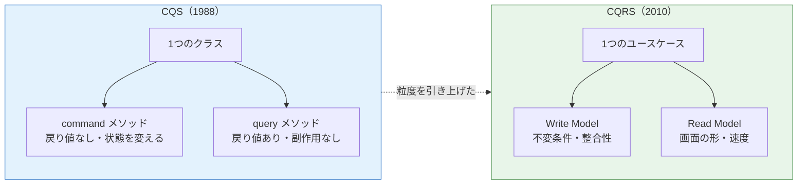
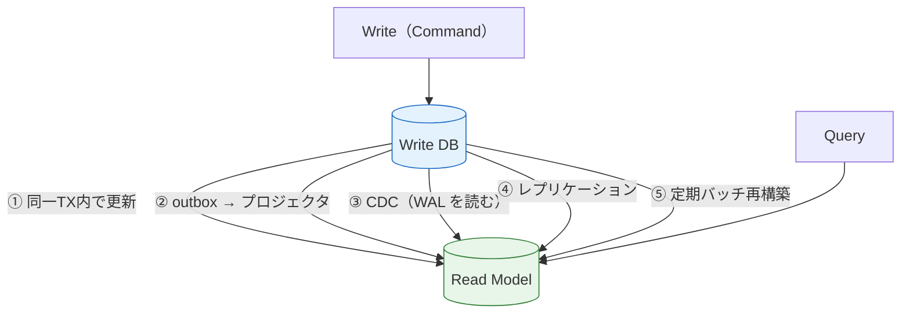
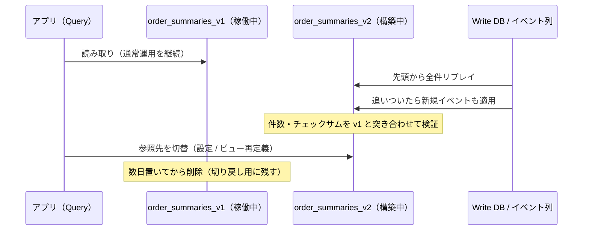

# CQRS（Command Query Responsibility Segregation）

> **一言で言うと:** 「状態を変える操作（Command）」と「状態を問い合わせる操作（Query）」で**別々のモデルを持つ**設計パターン。分離されるのは第一にモデル（クラス・型・責務）であって、DB やサーバーではない。DB 分離は必要になったときに足す**後段の選択肢**にすぎない。

親トピック [[イベント駆動-CQRS]] では「CQRS とは何か」「どの段階まで分離するか」を扱った。この detail はその先、実務で必ず詰まる 3 点を掘り下げる — **なぜこのパターンが誤解され続けているのか（出自）**、**Read Model をどう同期するか（5 つの戦略）**、**結果整合性の遅延をユーザー体験でどう吸収するか**。

## 出自 — CQS から CQRS へ

CQRS を正しく理解する近道は、その**祖先である CQS を知ること**にある。

### CQS（Command Query Separation）— メソッド粒度の規律

**CQS** は Bertrand Meyer が『*Object-Oriented Software Construction*（邦題: オブジェクト指向入門）』(1988) で提唱した原則で、プログラミング言語 Eiffel の設計思想に組み込まれている。主張は 1 行で言える。

> **メソッドは「状態を変えるコマンド」か「値を返すクエリ」のどちらか一方であるべきで、両方をやってはならない。**

この原則はしばしば「**質問をしても答えは変わってはならない**（Asking a question should not change the answer）」と要約される（Meyer 自身の文言ではなく、後年に広まった要約表現）。クエリに副作用がなければ、何度呼んでも安全で、順序を入れ替えてもよく、テストから自由に呼べる — これが規律の見返りである。

```typescript
// ❌ CQS 違反: 値を返しつつ内部状態も変える
// 「今のトップは何か」を知るためだけに呼ぶと、要素が消えてしまう
class Stack<T> {
  private items: T[] = [];
  pop(): T | undefined {
    return this.items.pop();   // 取得（Query）と削除（Command）が同居している
  }
}

// ✅ CQS 準拠: 見るだけの peek と、変えるだけの remove に割る
class Stack2<T> {
  private items: T[] = [];
  peek(): T | undefined { return this.items[this.items.length - 1]; } // Query
  remove(): void { this.items.pop(); }                                // Command
}
```

なお、この `pop()` は「CQS に照らすと違反」という説明用の例であって、**実際の `Array.prototype.pop` が悪いわけではない**。CQS は絶対法則ではなく「破るなら意識して破れ」という規律である（Martin Fowler も「pop のような実用的な例外はある」と明言している）。

### CQRS — モデル粒度への引き上げ

**CQRS** は Greg Young が 2010 年前後に名付けたパターンで、CQS の発想を**メソッドからオブジェクト（モデル）の粒度へ引き上げた**もの。Udi Dahan の "Clarified CQRS"(2009) や Young の "CQRS Documents" が原典にあたる。



### なぜ「CQRS = DB を 2 つ」と誤解されたのか

これは歴史的事故と言ってよい。**パターンが広まった時期に、たまたま重い実装例と一緒に紹介された**ためである。

- 当時 CQRS を紹介する記事のほとんどが、[[イベントソーシング]]（状態をイベント列で保存する別パターン）と**セットで**説明していた。両者は独立に使えるが、同じ図に描かれたことで一体のものと受け取られた
- 図解が「Write DB」「Read DB」の 2 つの箱で描かれることが多く、**分離の主語がモデルではなくインフラだと読まれた**
- 結果として「CQRS を導入する = DB を分けて非同期同期を組む」という重い理解が定着した

命名者の Young 自身がこの誤解に繰り返し反論しており、要旨は「**CQRS はトップレベルのアーキテクチャではなく、境界づけられたコンテキスト（Bounded Context）の一部に適用する小さなパターンにすぎない**」「CQRS を使っている人の大半は使うべきではなかった」というもの。Martin Fowler も bliki で「CQRS は複雑さのリスクが高く、慎重に適用すべき」と警告している。

> [!info] 用語ミニ辞典
> - **境界づけられたコンテキスト（Bounded Context）** — DDD（ドメイン駆動設計）の用語で、ある用語やモデルが一貫した意味を持つ範囲のこと。「注文」という言葉が販売部門と物流部門で違う意味を持つなら、それらは別コンテキスト。CQRS は「システム全体」ではなく、この 1 単位に対して適用するかを判断する。
> - **不変条件（Invariant）** — 常に成り立っていなければならないビジネス規則。「口座残高は 0 未満にならない」「注文には最低 1 商品が必要」など。Write Model が存在する理由はこれを守ることにある。
> - **集約（Aggregate）** — 不変条件を一体として守るためにひとまとめにしたオブジェクトの塊。「注文」と「注文明細」のように、**片方だけが更新されると規則が壊れるもの**を 1 つの境界に入れる。この境界がトランザクションの単位になり、そのまま **Write Model の設計単位**になる。

## 分離されるのは「責務」であって「サーバー」ではない

CQRS を採用したかどうかの判定は、**インフラ構成図ではなくコードの型定義を見れば分かる**。

| 観点 | 分離していない（CRUD） | CQRS |
|------|------------------|------|
| 型 | `Order` クラスが保存も JSON 化も担当 | `Order`（集約）と `OrderSummaryDTO`（表示用の DTO: Data Transfer Object。層をまたいでデータを運ぶだけの、振る舞いを持たない型）が別型 |
| 検証 | 読み書き共通のバリデーション | Write 側にのみ不変条件。Read 側は検証しない |
| 最適化の方向 | 正規化と表示速度の妥協点を探す | Write は正規化、Read は非正規化と別方向に振り切れる |
| 変更の影響 | 画面追加のたびに集約が太る | 画面追加は Read Model の追加で完結し、Write に触らない |

実務でいちばん効く見返りは最後の行である。**「画面の都合でドメインモデルが汚れなくなる」** — 一覧画面のために集約へ `totalAmount` や `userName` を生やす圧力が消える。これは [[関心の分離]] の具体的な適用であり、同時に [[SOLID原則]] のインターフェース分離原則（ISP）の応用でもある。

### 段階を選ぶ判断 — 「得るもの」より「新たに背負うもの」で決める

親トピックの 3 段階に、**その段階で新たに運用しなければならなくなるもの**を並べると判断しやすい。技術選定の失敗は「得られる利点」だけを数えて「増える運用責任」を数えないときに起きる。

| 段階 | 得られるもの | 新たに背負うもの | 元に戻すコスト |
|------|------------|----------------|--------------|
| **1. コード分離**（同一 DB） | モデルの独立進化、テスト容易性 | ほぼゼロ（クラスが増えるだけ） | 低 — マージすれば戻せる |
| **1.5. マテリアライズドビュー** | 重い集計の事前計算 | リフレッシュのタイミング設計 | 低 — ビューを消すだけ |
| **2. 読み取りレプリカ** | 読み取り負荷の水平分散 | レプリケーション遅延の監視、遅延時の読み先切替 | 中 — 接続先を戻す |
| **3. 独立した Read DB** | 別種の DB（検索エンジン・KVS）を選べる自由度 | 同期パイプライン、遅延監視、再構築手順、二重障害対応 | **高 — 一度組むと戻せない** |

> [!warning] 段階 1.5 は DB 製品に依存する
> **マテリアライズドビュー（Materialized View）** は、クエリの結果を実体のあるテーブルとして保持しておくビューのこと。PostgreSQL / Oracle 等の機能で、**MySQL には存在しない**（MySQL では集計テーブルを自作し、トリガーまたはバッチで更新する形になる）。また PostgreSQL で無停止リフレッシュを行う `REFRESH MATERIALIZED VIEW CONCURRENTLY` は**対象に UNIQUE インデックスがあることが前提**で、無い場合はリフレッシュ中の読み取りがブロックされる。

段階 3 に進む前に問うべきは「読み取りが遅いか」ではなく「**RDB のインデックス設計（[[インデックス設計の判断基準]]）と非正規化（[[正規化と非正規化の判断基準]]）で解けないか**」である。多くの「CQRS が必要」に見える問題は、実際には 1 本の複合インデックスで解ける。

## Read Model をどう同期するか — 5 つの戦略

段階 2 以降で必ず設計が必要になるのがここ。**同じ「CQRS」でも、この選択次第で遅延も障害モードも運用負荷も全く別物になる。**



| # | 戦略 | 遅延 | 主な失敗モード | 向く場面 |
|---|------|------|--------------|---------|
| ① | **同一トランザクション内で同期更新** | ゼロ | Read Model 更新の失敗が書き込み全体を巻き戻す。書き込みが重くなる | Read Model が同一 DB にあり、数が少ない |
| ② | **Transactional Outbox + プロジェクタ** | 数百 ms 〜 数秒 | プロジェクタ停止で遅延が無限に伸びる（監視必須） | 最も汎用的。異種 DB への同期も可 |
| ③ | **CDC（Change Data Capture）** | 数百 ms 〜 数秒 | **内部テーブル構造が下流に露出**し、カラム変更が破壊的変更になる。未消費 WAL の滞留 | アプリを改修せず既存 DB から流したい |
| ④ | **読み取りレプリカ** | ミリ秒〜秒 | レプリケーション遅延、フェイルオーバー時の巻き戻り | Read Model が Write と同スキーマでよい |
| ⑤ | **定期バッチ再構築** | 分〜時間 | 鮮度が要件を満たさない | 分析用途、日次レポート |

② の **Transactional Outbox**（DB 更新と同じトランザクションで `outbox` テーブルに書き、別プロセスが転送する）は CQRS 固有ではなく非同期処理全般の定石なので、仕組みの詳細は [[非同期処理とメッセージキュー]] と [[配信保証セマンティクス]] を参照。④ の遅延の実態は [[レプリケーションとレプリケーション遅延]] に詳しい。

### ② と ③ の決定的な違い — 何が「契約」になるか

この 2 つは「非同期でイベントを流す」点が同じに見えるため混同されやすいが、**下流に対して何を約束することになるかが正反対**である。

- **② outbox** — 流れるのは、こちらが**公開してよいと決めて設計したイベント**。内部のテーブル構造を自由に変えても、イベントの形さえ保てば下流は壊れない
- **③ CDC** — 流れるのは**物理テーブルの行そのもの**。つまり**内部スキーマがそのまま外部への契約になる**。カラム名を変えただけで下流の消費者が壊れる

「アプリを改修せず導入できる」という ③ の手軽さは、**内部設計の変更自由度を担保に差し出している**ことと引き換えである。既存システムからの移行では ③ で始め、落ち着いたら ② に移す、という段階戦略がよく採られる。

> [!warning] 未消費 WAL の滞留に注意
> ③ を選ぶ場合、PostgreSQL はレプリケーションスロットを通じて「まだ読まれていない WAL」を**削除せず保持し続ける**。消費側（Debezium 等）が停止したまま放置すると WAL がディスクを圧迫し、最終的に**書き込み側の DB が停止する**。CDC の導入時はスロットの遅延量（`pg_replication_slots` の滞留バイト数）の監視をセットで用意する。

> [!info] 用語ミニ辞典
> - **CDC（Change Data Capture）** — DB のトランザクションログ（PostgreSQL なら WAL: Write-Ahead Log）を読み取り、行の変更を変更イベント列として外部に流す仕組み。代表実装は Debezium。**アプリケーションコードを 1 行も変えずに**変更を取り出せるのが最大の利点で、レガシー DB からの移行で強い。
> - **プロジェクション / プロジェクタ（Projection / Projector）** — イベントや変更ログを読んで Read Model を組み立てる処理（およびそれを担うプロセス）のこと。「射影」の名の通り、真実の源であるデータを別の形に写し取る。

### 根本の設計原則: Read Model は「いつでも捨てて作り直せる」ものにする

同期戦略をどう選んでも、守るべき不変の原則が 1 つある。

> **Read Model は派生データ（derived data）であって、真実の源（source of truth）ではない。**

つまり「Read Model を全部 `TRUNCATE` して作り直したら、完全に同じ状態が復元できる」ことが**設計要件**である。これが成り立てば、プロジェクションのバグは「直して再構築」で解決する。成り立たなければ、Read Model にしか存在しないデータが生まれ、同じバグが**復元不能なデータ損失**に化ける。CQRS の運用が破綻する事例のほとんどは、この一線を越えたところで起きている。

ただしこの原則には前提がある。**再構築できる範囲は「復元元が何を保持しているか」で決まる。**

| 復元元 | 再構築できる Read Model | できないもの |
|--------|---------------------|------------|
| Write DB（現在状態のみ） | 現在の状態から導ける集計・非正規化ビュー | 「累計キャンセル回数」「ステータス遷移に要した時間」など**履歴に由来する値** |
| イベント列（[[イベントソーシング]] / 監査テーブル） | 過去の任意時点を含め、ほぼ何でも | — |

履歴由来の値を Read Model に置きたいなら、Write 側にも履歴を残す仕組みが要る。「Read Model は作り直せる」という原則を守るために、**Write 側の永続化方式まで遡って決める必要がある**というのがここでの設計判断である。

具体的な禁止事項に落とすと、**Read Model への直接 UPDATE を、プロジェクタ以外の誰にも許さない**（管理画面の「ちょっと直す」機能を含む）。

## 結果整合性をユーザー体験でどう吸収するか

段階 2 以降では「注文したのに注文履歴に出てこない」が構造的に起きる。これは自分の書き込みが自分の読み取りに見えない状態で、**read-your-writes 整合性（自分の書き込みの読み取り整合性）の破れ**と呼ばれる。技術的には正しく動いていてもユーザーには**バグにしか見えない**のがこの問題の厄介なところで、対策は 3 通りある。

| 手法 | やり方 | 向く場面 | 弱点 |
|------|--------|---------|------|
| **A. コマンドの結果を直接返す** | Write 側が作った結果をそのままレスポンスに含め、画面はそれを表示する | 作成直後の詳細画面 | 一覧・検索には使えない |
| **B. 楽観的 UI 更新** | クライアント側で結果を先に描画し、裏で同期完了を待つ | SNS の投稿、いいね | 失敗時のロールバック表示が必要 |
| **C. バージョンゲート（sticky read）** | Write が返した位置（版番号）まで Read Model が追いつくのを待つ／それまで Write 側から読む | 遅延が許されない一覧 | 実装が最も重い。待ち時間の上限設計が必要 |

C を最小構成で書くとこうなる。ポイントは「**待つ**」ことではなく「**待てなかったときの逃げ道を必ず用意する**」ことにある。

```typescript
// Write 側は「この書き込みは位置 N で確定した」という単調増加の版番号を返す
// （PostgreSQL の LSN: Log Sequence Number、Kafka のオフセット、独自のシーケンスなど）
//
// ★ 版番号は string で外に出す。JS の bigint は JSON.stringify が
//   TypeError を投げて直列化できないため、HTTP 境界を越えられない
type CommandResult = { orderId: string; version: string };

async function placeOrder(cmd: CreateOrderCommand): Promise<CommandResult> {
  const { orderId, version } = await writeDb.insertOrderReturningVersion(cmd);
  return { orderId, version: version.toString() };  // クライアントに版番号を渡すのが肝
}

// Read 側は「クライアントが知っている版番号」まで追いついているかを確認する
// クエリ文字列で受け取るので入口は string、比較する直前に bigint へ戻す
async function getOrders(userId: string, minVersionRaw?: string) {
  if (minVersionRaw !== undefined) {
    const minVersion = BigInt(minVersionRaw);
    const caughtUp = await waitForProjection(minVersion, { timeoutMs: 500 });
    // ★ 追いつかなかったら諦めて Write DB から読む（フォールバック）。
    //   ここで無限に待つと、プロジェクタ障害が全ユーザーのタイムアウトに化ける
    if (!caughtUp) return readFromWriteDb(userId);
  }
  return readDb.query('SELECT * FROM order_summaries WHERE user_id = $1', [userId]);
}

async function waitForProjection(minVersion: bigint, opt: { timeoutMs: number }) {
  const deadline = Date.now() + opt.timeoutMs;
  while (Date.now() < deadline) {
    const applied = await readDb.getCheckpoint('order_summaries'); // 適用済みの版番号
    if (applied >= minVersion) return true;
    await new Promise((r) => setTimeout(r, 20));
  }
  return false;
}
```

実務では **A で足りることが大半**である。C を選ぶ前に「その画面は本当に一覧でなければならないか」を疑うほうが、コストに見合うことが多い。

## プロジェクタの実装 — 冪等性とチェックポイント

プロジェクタには 2 つの要件がある。**同じイベントを 2 回処理しても結果が変わらないこと（冪等性）** と、**どこまで処理したかを記録して再開できること（チェックポイント）**。メッセージングは基本的に at-least-once（最低 1 回配信 = 重複しうる）なので、重複は例外ではなく前提として設計する（[[配信保証セマンティクス]] / [[データ書き込みの冪等性設計]]）。

ここで初学者がつまずきやすいのは、**冪等性と順序耐性が別の要件**だという点である。

- **冪等性** — 同じイベントを 2 回処理しても壊れない
- **順序耐性** — **古いイベントが後から届いても壊れない**

`upsert` を使えば冪等性は満たせるが、順序耐性は満たせない。例えば `OrderShipped` を処理して `status='shipped'` にした後で、リトライ経路から古い `OrderPlaced` が遅れて届くと、**ステータスが 'placed' に巻き戻る**。複数パーティションやリトライがある経路では順序は保証されないため、両方を明示的に設計する必要がある。

```go
// Go: 注文イベントから order_summaries を組み立てるプロジェクタの中核
// pos はイベントの単調増加位置（Kafka のオフセット / outbox の連番など）
func (p *Projector) Apply(ctx context.Context, ev OrderPlaced, pos int64) error {
    tx, err := p.db.BeginTx(ctx, nil)
    if err != nil {
        return err
    }
    defer tx.Rollback() // Commit 済みなら no-op。エラー経路で確実に巻き戻す

    // ① Read Model の更新は必ず upsert（INSERT ... ON CONFLICT）で書く。
    //    素の INSERT だと再配信のたびに一意制約違反で止まり、
    //    素の UPDATE だと初回配信時に何も起きずデータが欠ける
    //
    //    さらに行ごとに「どの位置のイベントまで反映済みか」を持たせ、
    //    WHERE 句で古いイベントによる巻き戻しを弾く（＝順序耐性）
    _, err = tx.ExecContext(ctx, `
        INSERT INTO order_summaries
            (order_id, user_id, total_amount, status, placed_at, last_position)
        VALUES ($1, $2, $3, 'placed', $4, $5)
        ON CONFLICT (order_id) DO UPDATE
          SET total_amount  = EXCLUDED.total_amount,
              status        = EXCLUDED.status,
              last_position = EXCLUDED.last_position
          WHERE order_summaries.last_position < EXCLUDED.last_position`,
        ev.OrderID, ev.UserID, ev.TotalAmount, ev.PlacedAt, pos)
    if err != nil {
        return err
    }

    // ② チェックポイントは「Read Model と同じトランザクション」で進める。
    //    別トランザクションにすると、更新済みなのに位置が戻る／
    //    位置だけ進んで更新が失われる、という取りこぼしが発生する
    //
    //    UPDATE ではなく upsert にするのが要点。素の UPDATE だと
    //    初回起動時（行がまだ無い）に 0 行更新となり、エラーも出ずに
    //    素通りする → 再起動のたびに先頭から再処理し続けるが、
    //    ①が冪等なので結果は正しく見え、異常に気づけない
    _, err = tx.ExecContext(ctx, `
        INSERT INTO projection_checkpoints (name, position)
        VALUES ('order_summaries', $1)
        ON CONFLICT (name) DO UPDATE
          SET position = EXCLUDED.position
          WHERE projection_checkpoints.position < EXCLUDED.position`, pos)
    if err != nil {
        return err
    }
    return tx.Commit()
}
```

2 箇所の `WHERE ... position < EXCLUDED.position` が、**古いイベントが遅れて届いても状態とチェックポイントを巻き戻さない**ための防波堤である。順序が保証されない経路では、この一行の有無が復旧可否を分ける。

なお PostgreSQL の `ON CONFLICT ... DO UPDATE` に付く `WHERE` 句は**更新をスキップするだけでエラーにはならない**。古いイベントは「何も起きずに捨てられる」という挙動になり、これが狙いどおりの結果である。

### プロジェクションの作り直し — Blue/Green 方式

Read Model のスキーマを変えたい、プロジェクタのバグを直したい、という要求は必ず来る。稼働中のテーブルを書き換えるのではなく、**新しいテーブルを別に作って完成後に切り替える**のが定石。



この手順が成立するのは、前述の「Read Model は捨てて作り直せる」原則が守られている場合に限る。ゼロダウンタイムでの切替の一般論は [[ゼロダウンタイムマイグレーション]] と同じ考え方（新旧併存 → 切替 → 撤去）である。

## よくある落とし穴

### 1. Read Model が真実の源になってしまう

管理画面から `order_summaries` を直接 UPDATE する機能を足した瞬間、そのデータは Write DB から復元できなくなる。以後、再構築は**データを消す操作**に変わり、プロジェクタのバグを直せなくなる。Read Model のテーブルには**プロジェクタ専用の DB ユーザーだけに書き込み権限を与える**（[[GRANTとREVOKE]]）のが確実な予防策。

### 2. CQS の規律を API 境界にそのまま持ち込む

「コマンドは値を返してはいけない（CQS）」を HTTP API の設計にそのまま適用してよいか — これは初学者が最も混乱する論点で、**正解は 1 つではない**。取りうる道は 2 つあり、どちらも成立する。

| 方式 | 採番の場所 | コマンドの戻り値 | 利点 |
|------|----------|---------------|------|
| **クライアント採番**（CQRS の標準形） | クライアントが UUID を生成してコマンドに載せる | void でよい | **再送しても同じ ID になるので、リトライが自然に冪等になる**。DB 採番を待たずに済む |
| **サーバ採番** | DB のシーケンス等 | 生成された ID を返す | 一般的な REST API（`201 Created` + ID）と素直に噛み合う |

CQRS の文脈では**前者が定石**である。理由は CQS の教条ではなく実利にあり、識別子をクライアントが決めていれば、ネットワークが不安定でコマンドを再送しても**同じ ID の書き込みが 2 回届くだけ**になり、重複作成を DB 側の一意制約で弾ける（[[データ書き込みの冪等性設計]]）。「コマンドが void で済む」のは、この設計の副産物にすぎない。

一方でサーバ採番を選んでも CQRS が壊れるわけではない。**守るべき一線は「Command 経路が Read Model を直接更新しないこと」であって、戻り値の有無ではない。** メソッド粒度の規律である CQS と、モデル粒度のパターンである CQRS を取り違えると、「ID を返すコードは違反だ」という不毛な議論に迷い込む。

なお ID を一切返さない設計にする場合は、前節の手法 A（コマンド結果を直接返す）が使えなくなる点に注意する。クライアント採番ならクライアントが最初から ID を知っているため、手法 A と同じ効果が得られる。

### 3. プロジェクション遅延を計測していない

CQRS の障害は落ちない。**静かに古いデータを返し続ける**。`現在時刻 - 最後に適用したイベントの発生時刻`（projection lag）をメトリクス化してアラートを張らないと、ユーザーからの「表示がおかしい」で初めて気づくことになる。監視対象として [[SLI-SLO-SLA]] に載せるべき指標。

### 4. 全テーブルに一律適用する

CQRS は「読み書きの要件が衝突している 1 つのコンテキスト」に効く道具であって、全社標準にするものではない。マスタ管理画面の CRUD に Command / Query / Handler / DTO / Projector を一式生成すると、コード量は数倍になり、得るものはゼロになる（[[YAGNI]]）。

### 5. Write Model を Read Model の形に引きずられて設計する

「一覧画面に出す項目が集約に全部ある方が楽」という理由で Write Model を太らせると、CQRS を入れた意味が消える。Write Model の形を決めるのは**不変条件を守るのに必要な範囲**だけであり、画面の都合は Read Model 側で吸収する。

## AI実装のアンチパターン

| AI がやりがちなこと | なぜ問題か | どう直すか |
|---|---|---|
| CRUD を機械変換して `CreateXCommand` / `GetXQuery` を全エンティティに生成 | 分離の利点（別方向への最適化）がなく、ボイラープレートだけが増える | 「読み書きの要件が衝突している箇所はどこか」を先に人間が特定し、そこだけ適用させる |
| Read Model 更新を Command ハンドラ内に直書き（同一 TX でも outbox でもない） | 更新失敗が黙って握りつぶされ、Read Model が恒久的にずれる | ①〜⑤のどの戦略かを明示的に指定してから実装させる |
| プロジェクタを素の `INSERT` / `UPDATE` で書く | 再配信で一意制約違反、または初回で欠損 | 「at-least-once 前提で冪等な upsert にせよ」と制約に明記する |
| upsert にはしたが、古いイベントによる巻き戻しを防いでいない | 遅れて届いた過去のイベントが**確定済みのステータスを差し戻す** | 「冪等性だけでなく**順序耐性**も要る」と伝え、行に位置を持たせた `WHERE` 句を要求する |
| チェックポイントを Read Model 更新と別トランザクションで進める | クラッシュ時に取りこぼし・二重適用が起きる | 同一トランザクション内で更新しているかをレビューで確認する |
| チェックポイントの初期行が無い前提を確認せず `UPDATE` で書く | 0 行更新が**エラーにならず素通り**し、再起動のたびに全件再処理する（冪等なので気づけない） | upsert にすること、および起動時に初期位置を必ず確定させることを指定する |
| 結果整合性の遅延に一切触れないコードを出す | 「注文したのに履歴に出ない」がリリース後に発覚する | 「Write 直後に Read するユースケースをどう扱うか」を必ずプロンプトに含める |

→ レイヤー横断のアンチパターン索引: [[_anti-patterns/_index|AIアンチパターン索引]]

## 実務での使用シーン

| シーン | 分離の段階 | 同期戦略 | 理由 |
|--------|----------|---------|------|
| EC の商品検索（Elasticsearch） | 段階 3 | ② outbox または ③ CDC | 全文検索は RDB で代替しにくく、数秒の遅延は許容される |
| 管理画面の集計ダッシュボード | 段階 1.5 | ⑤ バッチ / マテビュー | 鮮度要件が緩く、重い集計を毎回走らせたくない |
| SNS のタイムライン | 段階 3 | ② outbox（fan-out on write）※ | 読み取りが書き込みの数百倍。投稿時に各フォロワーの Read Model へ書く |
| 業務システムの一覧画面が重い | **段階 0** | — | まず [[インデックス設計の判断基準]] と N+1（[[EagerロードとLazyロード]]）を疑う。CQRS の出番ではないことが多い |
| 銀行の残高照会 | 段階 1 or 2 | ④ レプリカ（遅延監視付き） | 金額の見え方に遅延は許されない。read-your-writes をバージョンゲートで担保する |

※ **fan-out on write** — 投稿の**書き込み時に**フォロワー全員のタイムライン（Read Model）へ配っておく方式。読み取りは自分の行を引くだけで済む。対になるのが **fan-out on read**（読み取り時にフォロー中の全員の投稿を集める方式）で、書き込みは軽いが読み取りが重くなる。**どちらを選ぶかは「読み書きのどちらに負荷を寄せるか」の判断**であり、フォロワー数が極端に多いアカウントだけ後者に切り替える折衷もよく使われる。

最終行が示す通り、**CQRS を「採用しない」判断ができることが、このパターンを理解している証拠**である。

## 関連トピック

- [[イベント駆動-CQRS]] — 親トピック。CQRS / イベント駆動 / イベントソーシングの三者の関係と適用判断フロー
- [[イベントソーシング]] — Write 側の永続化方式。CQRS と独立だが、組み合わせると Read Model の再構築が自然に成立する
- [[配信保証セマンティクス]] — at-least-once 前提での冪等なプロジェクタ設計の土台
- [[レプリケーションとレプリケーション遅延]] — 戦略④の遅延の実態と監視方法
- [[正規化と非正規化の判断基準]] — Read Model をどこまで非正規化するかの判断軸
- [[関心の分離]] / [[SOLID原則]] — CQRS を支える設計原則（ISP の応用）
- [[キャッシュ書き込み戦略とTTL設計]] — Read Model はキャッシュの一種であり、無効化問題と同じ構造を持つ

## 参考リソース

- [Greg Young "CQRS Documents"(2010)](https://cqrs.wordpress.com/wp-content/uploads/2010/11/cqrs_documents.pdf) — 命名者による原典。クライアント側での識別子採番を含む、標準形の設計が示されている
- [Greg Young "CQRS is not an Architecture"(2012)](https://gregfyoung.wordpress.com/2012/09/09/cqrs-is-not-an-architecture/) — 「CQRS はアーキテクチャではなくアーキテクチャパターンである」という本人による位置づけの明確化
- [Martin Fowler: CQRS](https://martinfowler.com/bliki/CQRS.html) — 適用に慎重であるべき理由の簡潔なまとめ
- [Martin Fowler: CommandQuerySeparation](https://martinfowler.com/bliki/CommandQuerySeparation.html) — CQS 側の解説と、実用上の例外について
- [Udi Dahan "Clarified CQRS"(2009年12月)](https://www.dddcommunity.org/library/dahan_2010) — CQRS 普及の初期に書かれた整理。イベントソーシングと切り離した説明として貴重
- Martin Kleppmann『*Designing Data-Intensive Applications*』— 派生データ（derived data）と真実の源（system of record）の区別、Ch.11 のストリーム処理
