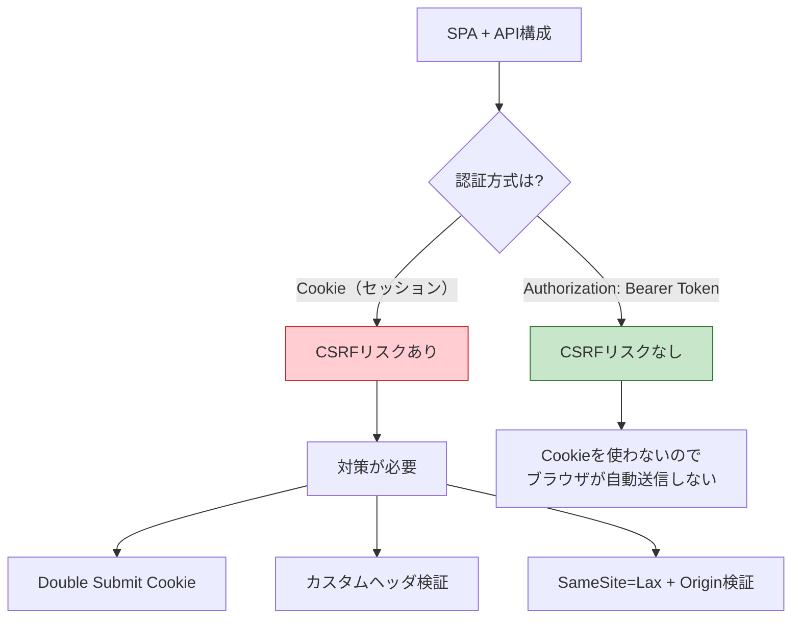

# CSRF防御の実装ガイド

> **一言で言うと:** CSRFの概念・攻撃原理・防御戦略は[[CSRF]]トピックを参照。本ドキュメントでは、各フレームワークでの具体的な実装方法と、SPA + API構成での認証方式別の対策パターンに焦点を当てる。

## 各フレームワークでの実装例

### PHP（Laravel）

Laravelは `VerifyCsrfToken` ミドルウェアがデフォルトで有効。Bladeテンプレートで `@csrf` ディレクティブを使うだけでよい。

```php
{{-- resources/views/transfer.blade.php --}}
<form method="POST" action="/transfer">
    @csrf
    <input name="to" />
    <input name="amount" type="number" />
    <button type="submit">送金</button>
</form>

{{-- @csrf は以下のhidden inputを生成する --}}
{{-- <input type="hidden" name="_token" value="CSRFトークン値"> --}}
```

```php
// routes/web.php
// webミドルウェアグループにはVerifyCsrfTokenが含まれている
Route::post('/transfer', function (Request $request) {
    // トークン検証は自動で行われる
    // 不正なトークンの場合は419ステータスが返される
    $validated = $request->validate([
        'to' => 'required|string',
        'amount' => 'required|numeric|min:1',
    ]);
    // 送金処理...
    return response('送金処理完了');
});
```

```php
// Ajax/SPAからのリクエストの場合
// LaravelはXSRF-TOKENクッキーを発行し、
// AxiosがX-XSRF-TOKENヘッダとして自動送信する

// 特定ルートをCSRF検証から除外する場合
// app/Http/Middleware/VerifyCsrfToken.php
class VerifyCsrfToken extends Middleware
{
    protected $except = [
        'webhook/*', // 外部Webhookはトークン検証不要
    ];
}
```

### Ruby（Rails）

Railsは `protect_from_forgery` がデフォルトで有効。フォームヘルパーが自動でCSRFトークンを埋め込む。

```ruby
# app/controllers/application_controller.rb
class ApplicationController < ActionController::Base
  # Rails 5.2+ ではデフォルトで有効
  protect_from_forgery with: :exception
end

# app/controllers/transfers_controller.rb
class TransfersController < ApplicationController
  def new
    # フォーム表示
  end

  def create
    # CSRFトークンの検証は自動で行われる
    # 不正なトークンの場合はActionController::InvalidAuthenticityToken
    Transfer.create!(
      to: params[:to],
      amount: params[:amount]
    )
    redirect_to root_path, notice: "送金処理完了"
  end
end
```

```erb
<%# app/views/transfers/new.html.erb %>
<%# form_with は自動でauthenticity_tokenを埋め込む %>
<%= form_with url: transfers_path, method: :post do |f| %>
  <%= f.text_field :to %>
  <%= f.number_field :amount %>
  <%= f.submit "送金" %>
<% end %>

<%# 生成されるHTML: %>
<%# <input type="hidden" name="authenticity_token" value="トークン値"> %>
```

### Python（FastAPI）

FastAPIはデフォルトではCSRF保護を持たない（API指向でBearer Tokenを想定しているため）。Cookie認証を使う場合は `fastapi-csrf-protect` を導入する。

```python
from fastapi import FastAPI, Request, Depends
from fastapi.responses import HTMLResponse
from fastapi_csrf_protect import CsrfProtect
from pydantic import BaseModel

app = FastAPI()


class CsrfSettings(BaseModel):
    secret_key: str = "your-secret-key"
    cookie_samesite: str = "lax"
    cookie_secure: bool = True


@CsrfProtect.load_config
def get_csrf_config():
    return CsrfSettings()


@app.get("/transfer", response_class=HTMLResponse)
async def show_form(request: Request, csrf_protect: CsrfProtect = Depends()):
    token, signed = csrf_protect.generate_csrf_tokens()
    return f"""
    <form method="POST" action="/transfer">
      <input type="hidden" name="csrf_token" value="{token}" />
      <input name="to" />
      <input name="amount" type="number" />
      <button type="submit">送金</button>
    </form>
    """


@app.post("/transfer")
async def handle_transfer(
    request: Request,
    csrf_protect: CsrfProtect = Depends(),
):
    await csrf_protect.validate_csrf(request)
    form = await request.form()
    return {"message": "送金処理完了", "to": form["to"], "amount": form["amount"]}
```

### フレームワーク比較

| フレームワーク | CSRF保護 | トークンの埋め込み | 除外方法 |
|---|---|---|---|
| **Laravel** | デフォルト有効 | `@csrf` | `$except` 配列 |
| **Rails** | デフォルト有効 | `form_with` が自動 | `skip_forgery_protection` |
| **Django** | デフォルト有効 | `` | `@csrf_exempt` |
| **Express** | なし（要パッケージ） | 手動で hidden field | ルート単位で適用 |
| **Go** | なし（要パッケージ） | 手動で hidden field | ハンドラ単位で適用 |
| **FastAPI** | なし（要パッケージ） | 手動で hidden field | ルート単位で適用 |

## SPA + API構成での対策

SPA（Single Page Application）とAPIサーバーの構成では、認証方式によってCSRFリスクが根本的に異なる。



### Bearer Token の保存場所とリスクのトレードオフ

Bearer Tokenをどこに保存するかで、CSRFリスクと[[XSS]]リスクのバランスが変わる:

| 保存場所 | CSRFリスク | XSSリスク | 備考 |
|----------|-----------|----------|------|
| `HttpOnly` Cookie | あり（自動送信される） | なし（JSからアクセス不可） | CSRF対策が別途必要 |
| `localStorage` / `sessionStorage` | なし | あり（JSからアクセス可能） | XSS成功時にトークン窃取 |
| メモリ（変数） | なし | 低い（永続化されない） | ページリロードで消える |

セキュリティ要件が高い場合の推奨パターン:
- **Refresh Token** → `HttpOnly` Cookie に保存（XSSから保護）
- **Access Token** → メモリにのみ保持（短命、CSRFリスクなし）
- Access Tokenが期限切れになったら、Refresh Token Cookie で新しいAccess Tokenを取得

### Origin / Referer ヘッダ検証（補助的防御）

CSRFトークンに加えて、サーバー側でリクエストの `Origin` または `Referer` ヘッダを検証する防御層を追加できる。

- `Origin` ヘッダ: スキーム + ホスト + ポートのみを含む（パス情報なし）。POSTリクエストではほぼ確実に送信される
- `Referer` ヘッダ: 完全なURLを含む。プライバシー設定で省略される場合がある

CSRFトークンが主防御、Origin/Referer検証は補助的防御として位置づける。

## 関連リンク

- [[CSRF]] — Layer 6 トピック。CSRFの攻撃原理・防御戦略・誤解されやすいポイントの包括的解説
- [[認証と認可]] — 親トピック。CSRF攻撃はCookieベースの認証機構を悪用する
- [[セッションとJWT]] — セッション方式はCSRFリスクが高く、JWT Bearer方式はCSRFリスクが低い
- [[CORS]] — CORSはレスポンスの読み取りを制御し、CSRFはリクエスト送信の悪用を防ぐ。防御の方向が異なる
