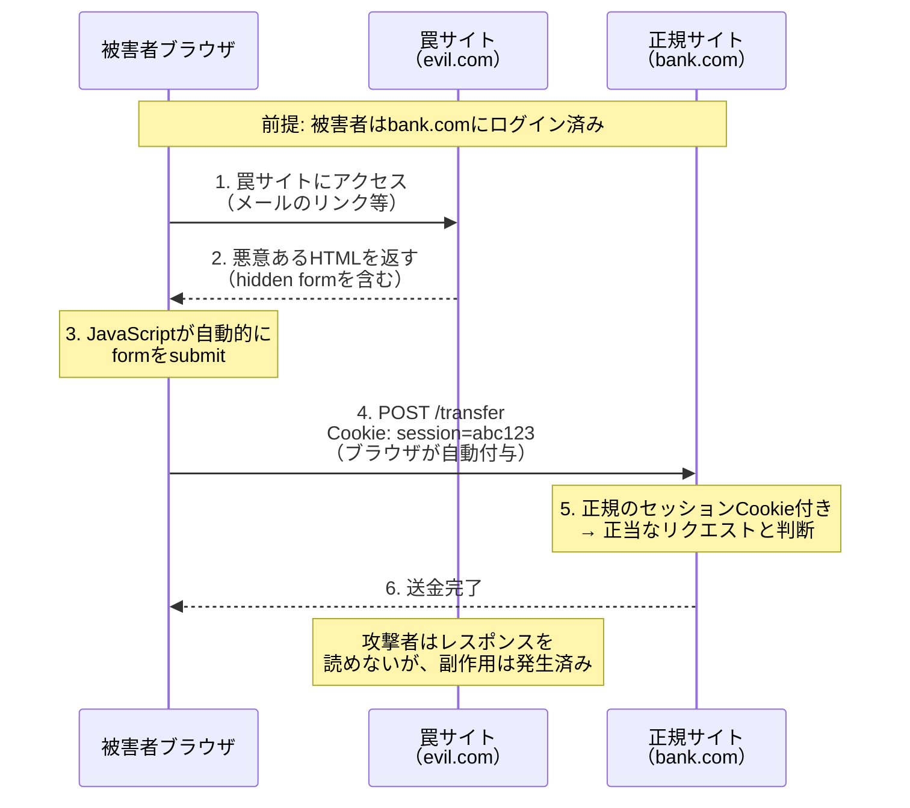
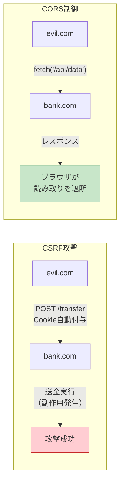
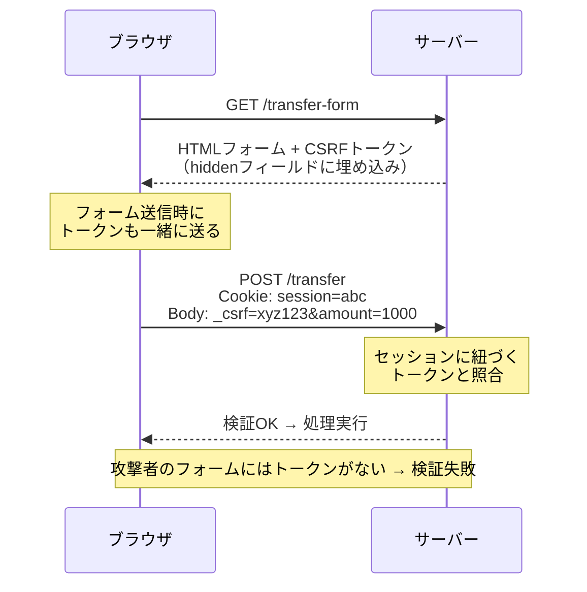
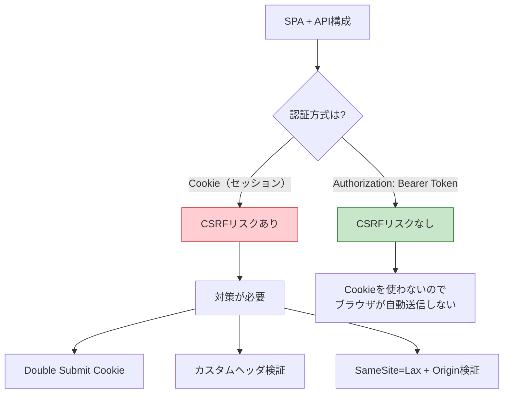

# CSRF（Cross-Site Request Forgery）

> **一言で言うと:** 攻撃者が被害者のブラウザに「認証済みCookieを自動送信させる」ことを悪用し、被害者になりすましてサーバーに意図しないリクエストを送信させる攻撃。被害者がログイン中であるという事実そのものが武器になる。

## CSRFとは何か

CSRF（Cross-Site Request Forgery、クロスサイトリクエストフォージェリ）は、Webアプリケーションに対する攻撃手法の一つ。攻撃者が直接サーバーを攻撃するのではなく、**被害者のブラウザを踏み台として利用する**点が特徴的である。

### 攻撃が成立する前提条件

1. 被害者が対象サイトに**ログイン済み**である（認証Cookieがブラウザに保存されている）
2. 対象サイトが**Cookieベースの認証**を使用している
3. 対象サイトのリクエスト処理に**リクエスト元の検証がない**
4. 攻撃者が被害者を**罠サイトに誘導**できる

### なぜCookieが問題になるのか

ブラウザはCookieをドメインに紐づけて管理し、そのドメインへのリクエスト時に**自動的に**Cookieを付与する。これはリクエストの発信元がどこであろうと関係なく行われる。つまり `evil.com` のページから `bank.com` へのリクエストが発生した場合でも、ブラウザは `bank.com` のCookieを自動的に送信する。

## 攻撃フロー



攻撃者が実際に使う罠ページの例:

```html
<!-- evil.com に設置された罠ページ -->
<html>
<body onload="document.getElementById('csrf-form').submit()">
  <form id="csrf-form" action="https://bank.com/transfer" method="POST">
    <input type="hidden" name="to" value="attacker-account" />
    <input type="hidden" name="amount" value="1000000" />
  </form>
</body>
</html>
```

被害者がこのページを開くだけで、ブラウザが `bank.com` への送金リクエストを自動送信する。`bank.com` のセッションCookieが自動付与されるため、サーバーは正当なリクエストと区別できない。

## [[CORS]]との違い

CSRFとCORSは混同されやすいが、保護する方向がまったく異なる。

| 観点 | CSRF | CORS |
|------|------|------|
| **攻撃/制御の対象** | 書き込み（状態変更の副作用） | 読み取り（レスポンスの参照） |
| **何が問題か** | リクエストが送信されること自体 | レスポンスが読めること |
| **防御の主体** | サーバー側の検証ロジック | ブラウザによるレスポンス遮断 |
| **CORSで防げるか** | **防げない** — CORSはレスポンスの読み取りを制限するだけで、リクエスト送信自体は止めない | — |



重要な点: `<form>` によるPOSTは「単純リクエスト（Simple Request）」に該当するため、**CORSプリフライト（preflight）が発生しない**。つまりCORSの設定をどれだけ厳しくしても、formベースのCSRF攻撃は防げない。

## 防御策

### 1. CSRFトークン（Synchronizer Token Pattern）

最も古典的で確実な防御策。サーバーがセッションごとに一意のトークンを生成し、フォームに埋め込む。リクエスト受信時にトークンの一致を検証する。

**なぜ有効か:** 攻撃者は被害者のセッションに紐づくCSRFトークンの値を知ることができない。Cookieは自動送信されるが、フォーム内のhiddenフィールドの値は攻撃者が制御できない。



### 2. SameSite Cookie属性

Cookieに `SameSite` 属性を設定することで、クロスサイトリクエスト時のCookie送信を制御する。

| 値 | 挙動 | CSRF防御 |
|----|------|----------|
| `Strict` | クロスサイトリクエストでは一切Cookieを送信しない | 最も強力だがUXに影響（外部リンクからのアクセスでもログアウト状態になる） |
| `Lax` | トップレベルナビゲーション（リンククリック等）のGETのみCookieを送信 | POSTベースのCSRFを防御。**現在の主要ブラウザのデフォルト** |
| `None` | 常にCookieを送信（`Secure` 属性が必須） | CSRF防御なし |

`Lax` がデフォルトになったことでCSRFの脅威は大幅に低減したが、以下のケースでは不十分:
- GETリクエストで状態変更を行う設計（そもそもHTTPメソッドの使い方が間違っている）
- サブドメイン間でCookieを共有しているケース

### 3. Origin / Referer ヘッダ検証

サーバー側でリクエストの `Origin` または `Referer` ヘッダを検証し、自サイトからのリクエストであることを確認する。

- `Origin` ヘッダ: スキーム + ホスト + ポートのみを含む（パス情報なし）。POSTリクエストではほぼ確実に送信される
- `Referer` ヘッダ: 完全なURLを含む。プライバシー設定で省略される場合がある

## 各フレームワークでの実装例

### TypeScript（Express + csrf-csrf）

`csurf` パッケージは非推奨（deprecated）になったため、代替として `csrf-csrf`（Double Submit Cookie Pattern）を使用する。

```typescript
import express from "express";
import { doubleCsrf } from "csrf-csrf";
import cookieParser from "cookie-parser";

const app = express();
app.use(express.urlencoded({ extended: true }));
app.use(cookieParser("my-secret"));

const {
  generateToken,
  doubleCsrfProtection,
} = doubleCsrf({
  getSecret: () => "my-secret",
  cookieName: "__csrf",
  cookieOptions: {
    httpOnly: true,
    sameSite: "lax",
    secure: process.env.NODE_ENV === "production",
  },
  getTokenFromRequest: (req) =>
    req.body._csrf ?? req.headers["x-csrf-token"],
});

// CSRFトークンをフォームに渡す
app.get("/transfer", (req, res) => {
  const token = generateToken(req, res);
  res.send(`
    <form method="POST" action="/transfer">
      <input type="hidden" name="_csrf" value="${token}" />
      <input name="to" />
      <input name="amount" type="number" />
      <button type="submit">送金</button>
    </form>
  `);
});

// CSRF検証ミドルウェアを適用
app.post("/transfer", doubleCsrfProtection, (req, res) => {
  res.send("送金処理完了");
});

app.listen(3000);
```

### PHP（Laravel）

Laravelは `VerifyCsrfToken` ミドルウェアがデフォルトで有効。Bladeテンプレートで `@csrf` ディレクティブを使うだけでよい。

```php
{{-- resources/views/transfer.blade.php --}}
<form method="POST" action="/transfer">
    @csrf
    <input name="to" />
    <input name="amount" type="number" />
    <button type="submit">送金</button>
</form>

{{-- @csrf は以下のhidden inputを生成する --}}
{{-- <input type="hidden" name="_token" value="CSRFトークン値"> --}}
```

```php
// routes/web.php
// webミドルウェアグループにはVerifyCsrfTokenが含まれている
Route::post('/transfer', function (Request $request) {
    // トークン検証は自動で行われる
    // 不正なトークンの場合は419ステータスが返される
    $validated = $request->validate([
        'to' => 'required|string',
        'amount' => 'required|numeric|min:1',
    ]);
    // 送金処理...
    return response('送金処理完了');
});
```

```php
// Ajax/SPAからのリクエストの場合
// resources/js/bootstrap.js（Axiosのデフォルト設定）
// LaravelはXSRF-TOKENクッキーを発行し、
// AxiosがX-XSRF-TOKENヘッダとして自動送信する

// 特定ルートをCSRF検証から除外する場合
// app/Http/Middleware/VerifyCsrfToken.php
class VerifyCsrfToken extends Middleware
{
    protected $except = [
        'webhook/*', // 外部Webhookはトークン検証不要
    ];
}
```

### Ruby（Rails）

Railsは `protect_from_forgery` がデフォルトで有効。フォームヘルパーが自動でCSRFトークンを埋め込む。

```ruby
# app/controllers/application_controller.rb
class ApplicationController < ActionController::Base
  # Rails 5.2+ ではデフォルトで有効
  protect_from_forgery with: :exception
end

# app/controllers/transfers_controller.rb
class TransfersController < ApplicationController
  def new
    # フォーム表示
  end

  def create
    # CSRFトークンの検証は自動で行われる
    # 不正なトークンの場合はActionController::InvalidAuthenticityToken
    Transfer.create!(
      to: params[:to],
      amount: params[:amount]
    )
    redirect_to root_path, notice: "送金処理完了"
  end
end
```

```erb
<%# app/views/transfers/new.html.erb %>
<%# form_with は自動でauthenticity_tokenを埋め込む %>
<%= form_with url: transfers_path, method: :post do |f| %>
  <%= f.text_field :to %>
  <%= f.number_field :amount %>
  <%= f.submit "送金" %>
<% end %>

<%# 生成されるHTML: %>
<%# <input type="hidden" name="authenticity_token" value="トークン値"> %>
```

### Go（nosurf）

Goではフレームワーク標準のCSRF保護がないため、`nosurf` パッケージを使用する。

```go
package main

import (
	"fmt"
	"html/template"
	"net/http"

	"github.com/justinas/nosurf"
)

var formTmpl = template.Must(template.New("form").Parse(`
<form method="POST" action="/transfer">
  <input type="hidden" name="csrf_token" value="{{.Token}}" />
  <input name="to" />
  <input name="amount" type="number" />
  <button type="submit">送金</button>
</form>
`))

func showForm(w http.ResponseWriter, r *http.Request) {
	formTmpl.Execute(w, map[string]string{
		"Token": nosurf.Token(r),
	})
}

func handleTransfer(w http.ResponseWriter, r *http.Request) {
	// nosurfミドルウェアがトークンを自動検証済み
	fmt.Fprintf(w, "送金処理完了: to=%s, amount=%s",
		r.FormValue("to"), r.FormValue("amount"))
}

func main() {
	mux := http.NewServeMux()
	mux.HandleFunc("GET /transfer", showForm)
	mux.HandleFunc("POST /transfer", handleTransfer)

	// nosurfでラップ — GET/HEAD/OPTIONS/TRACE以外のメソッドで
	// CSRFトークンを自動検証する
	handler := nosurf.New(mux)
	handler.SetBaseCookie(http.Cookie{
		HttpOnly: true,
		SameSite: http.SameSiteLaxMode,
		Secure:   true,
		Path:     "/",
	})

	http.ListenAndServe(":3000", handler)
}
```

### Python（FastAPI）

FastAPIはデフォルトではCSRF保護を持たない（API指向でBearer Tokenを想定しているため）。Cookie認証を使う場合は `fastapi-csrf-protect` を導入する。

```python
from fastapi import FastAPI, Request, Depends
from fastapi.responses import HTMLResponse
from fastapi_csrf_protect import CsrfProtect
from pydantic import BaseModel

app = FastAPI()


class CsrfSettings(BaseModel):
    secret_key: str = "your-secret-key"
    cookie_samesite: str = "lax"
    cookie_secure: bool = True


@CsrfProtect.load_config
def get_csrf_config():
    return CsrfSettings()


@app.get("/transfer", response_class=HTMLResponse)
async def show_form(request: Request, csrf_protect: CsrfProtect = Depends()):
    token, signed = csrf_protect.generate_csrf_tokens()
    return f"""
    <form method="POST" action="/transfer">
      <input type="hidden" name="csrf_token" value="{token}" />
      <input name="to" />
      <input name="amount" type="number" />
      <button type="submit">送金</button>
    </form>
    """


@app.post("/transfer")
async def handle_transfer(
    request: Request,
    csrf_protect: CsrfProtect = Depends(),
):
    await csrf_protect.validate_csrf(request)
    form = await request.form()
    return {"message": "送金処理完了", "to": form["to"], "amount": form["amount"]}
```

## SPA + API構成での対策

SPA（Single Page Application）とAPIサーバーの構成では、認証方式によってCSRFリスクが根本的に異なる。



### Cookie認証の場合（CSRFリスクあり）

SPAでもCookie認証を使う場合（[[セッションとJWT]]のセッション方式など）、CSRFトークンの受け渡し方法が従来のサーバーレンダリングとは異なる。

**Double Submit Cookie Pattern** がSPAでは一般的:

1. サーバーがCSRFトークンをCookieで発行（`HttpOnly: false` にする必要がある）
2. SPAのJavaScriptがCookieからトークンを読み取り、リクエストヘッダに付与する
3. サーバーがCookieの値とヘッダの値を照合する

```typescript
// SPA側（fetch使用）
const csrfToken = document.cookie
  .split("; ")
  .find((row) => row.startsWith("XSRF-TOKEN="))
  ?.split("=")[1];

await fetch("/api/transfer", {
  method: "POST",
  credentials: "include", // Cookie送信に必要
  headers: {
    "Content-Type": "application/json",
    "X-XSRF-TOKEN": csrfToken ?? "",
  },
  body: JSON.stringify({ to: "recipient", amount: 1000 }),
});
```

### Bearer Token方式の場合（CSRFリスクなし）

`Authorization: Bearer <token>` ヘッダで認証する方式では、トークンはJavaScriptが明示的に設定するものであり、ブラウザが自動送信することはない。そのためCSRFは原理的に成立しない。

ただし、Bearer Tokenをどこに保存するかで**XSSリスク**との兼ね合いが生まれる:

| 保存場所 | CSRFリスク | XSSリスク |
|----------|-----------|----------|
| `HttpOnly` Cookie | あり | なし（JSからアクセス不可） |
| `localStorage` / `sessionStorage` | なし | あり（JSからアクセス可能） |
| メモリ（変数） | なし | 低い（永続化されない） |

セキュリティ要件が高い場合、`HttpOnly` CookieにRefresh Tokenを保存し、短命なAccess TokenをメモリにのみJavaScriptで保持するハイブリッド方式が推奨される。

## 落とし穴・よくある誤解

### 「GETリクエストなら安全」という誤解

GETリクエストでも `` のように状態変更を引き起こすURLがあれば攻撃可能。**GETは安全なメソッド（副作用なし）であるべき**というHTTPの原則（RFC 7231）に従うことが根本的な防御になる。

### 「CORSを設定すればCSRFは防げる」という誤解

CORSはレスポンスの**読み取り**を制限するだけであり、リクエストの**送信**を止めるわけではない。`<form>` によるPOSTは単純リクエストとして扱われ、プリフライトなしで送信される。詳しくは [[CORS]] を参照。

### 「Content-Type: application/json なら安全」という誤解

`application/json` のリクエストは確かにCORSプリフライトを発生させるが:
- Flash（廃止済み）やブラウザの脆弱性を利用した回避手段が過去に存在した
- サーバーが `Content-Type` を検証せず `text/plain` でも受け付ける場合は回避可能
- 防御策としてContent-Typeだけに依存するのは危険

### CSRFトークンの実装ミス

- トークンをGETパラメータに含めてしまう → Refererヘッダやサーバーログで漏洩する
- トークンの検証をGETリクエストでも行ってしまう → パフォーマンスの無駄であり、トークン漏洩のリスクが増える
- セッションに紐づけずグローバルなトークンを使ってしまう → 他のユーザーのトークンが使い回せる

## 関連リンク

- [[CORS]] — CORSはレスポンスの読み取りを制御し、CSRFはリクエスト送信の悪用を防ぐ。防御の方向が異なる
- [[認証と認可]] — CSRF攻撃はCookieベースの認証機構を悪用する
- [[セッションとJWT]] — セッション方式はCSRFリスクが高く、JWT Bearer方式はCSRFリスクが低い
- [[SQLインジェクションとXSS]] — XSSが成功するとCSRFトークンも盗める（XSS > CSRF の関係）
