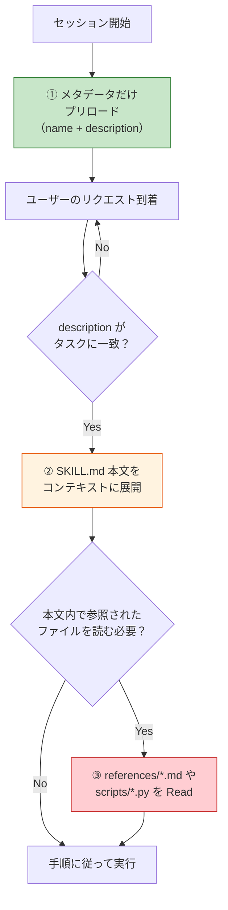
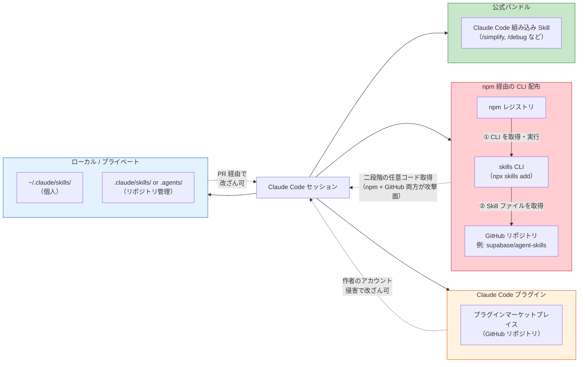

# Claude Skills エコシステム（Claude Code Skills Ecosystem）

> **一言で言うと:** Skills は Claude Code の「オンデマンドで読み込まれる専門知識パッケージ」機能。`SKILL.md` とサポートファイルの入ったディレクトリを、モデルが必要と判断したときだけ本文をコンテキストに展開する（`/skill-name` で直接呼び出すことも可能）。配布形態は CLI（`npx skills add`）・Claude Code プラグイン・Git 管理など複数が並存しており、いずれも「取得した瞬間にモデルへ指示が注入される」性質を持つため、[[サプライチェーンセキュリティ]]の新しい攻撃面でもある。

## Skills とは何か — プログレッシブディスクロージャの仕組み

Skills は 2025 年後半に導入された Claude Code / Claude API の共通機能で、**「タスクに応じて必要な知識だけをロードする」**ためのパッケージ単位。フォルダ 1 つが 1 Skill に対応し、中身は最低限 `SKILL.md`（YAML フロントマター + Markdown 本文）と、任意でスクリプト・テンプレート・参考ドキュメントからなる。フォーマットは [agentskills.io](https://agentskills.io/) で標準化が進んでおり、Claude Code だけでなく Cursor、Cline、GitHub Copilot など 18 以上のエージェントが同一フォーマットを読める。

```
my-skill/
├── SKILL.md          # name / description を含むフロントマター + 手順（必須）
├── scripts/          # 慣習的なサブフォルダ（名前は任意）
│   └── helper.py     # Skill 内から実行できる補助スクリプト
├── references/       # 慣習的なサブフォルダ（名前は任意）
│   └── api-spec.md   # 必要時に Read される参考資料
└── assets/           # 慣習的なサブフォルダ（名前は任意）
    └── template.html # 生成物のテンプレート
```

必須なのは `SKILL.md` だけで、サブフォルダの命名・構成は慣習に従う緩い取り決め。重要なのは「重いリソースを本文から分離しておき、モデルが必要と判断したときだけ Read する」という構造。

### ロード時の 3 段階



この段階的なロード（**Progressive Disclosure**）がキモで、数十個の Skill を登録していても、セッションごとに常時消費するのはフロントマターのメタデータ（`name` + `description`）だけ。コンテキスト窓を節約しつつ巨大なライブラリを持てる構造になっている。

## 類似機能との棲み分け

Claude Code にはエージェントを拡張する機能が複数ある。Skills は 2025 年後半に**カスタムスラッシュコマンドを包含する形で統合**され、現在は Skills がその役割を兼ねている（`.claude/commands/*.md` の旧形式も互換で動作し続ける）。

| 機能 | 実体 | 起動タイミング | 主な用途 | 実行環境 |
|---|---|---|---|---|
| **Skills（デフォルト）** | フォルダ（`SKILL.md` + ファイル群） | モデルの自律判断 + ユーザーの `/skill-name` 入力（両方可） | 手順・知識・テンプレートの再利用 | ホスト側（Read/Bash ツール経由、必要に応じ subagent にフォーク可） |
| **Skills（`disable-model-invocation`）** | 同上 | ユーザーの `/skill-name` 入力のみ | 副作用のある操作（`/deploy`, `/commit` など） | 同上 |
| **Skills（`user-invocable: false`）** | 同上 | モデルの自律判断のみ | 背景知識（`legacy-system-context` など。ユーザーが直接叩く意味がない情報） | 同上 |
| **Subagents** | `.claude/agents/*.md` | モデルが Task ツールで明示的に呼び出す、または Skill の `context: fork` 経由 | 独立コンテキストでの並行作業 | 別プロセス・独立コンテキスト |
| **MCP サーバー** | 独立プロセス（JSON-RPC） | ツール呼び出し時に常時接続 | 外部システム（DB/API/ファイル）との接続 | 独立プロセス・任意言語で実装可 |
| **Hooks** | シェルコマンド（`settings.json`） | イベント（PreToolUse 等）発火時 | 決定論的な自動処理・ガード | シェル（Claude は関与しない） |

典型的な使い分け:

- **Skills（デフォルト）** — 「PDF を生成するときはこの手順で」「コードレビューはこのチェックリストで」のような**知識 + 手順**。モデルが適切なタイミングで使いつつ、ユーザーも `/` から直接呼べる
- **Skills（`disable-model-invocation`）** — `/commit` `/deploy` など**ユーザーが明示的にタイミングを制御したい**ワークフロー。従来の「スラッシュコマンド」の使い方はこの形に移行した
- **Subagents** — 並行探索やコンテキスト隔離が必要な**独立タスク**
- **MCP** — **外部システムとの I/O**（Linear, Slack, DB など）
- **Hooks** — Claude を通さずに**必ず走らせたい処理**（pre-commit 検証など）。モデルの判断に依存しない決定論的な制御

Skills のキモは、デフォルトで**「モデルが必要と判断したらロード」と「ユーザーが `/` で直接呼ぶ」の両方が使える**点にあり、フロントマターの 2 フィールド（`disable-model-invocation`, `user-invocable`）で片方に絞れる。従来の「スラッシュコマンドはユーザー起動、Skills はモデル自律」という二分は現在は正確ではない。

## エコシステムの構造 — どこから取得するか

Skills の配布経路は主に 4 層に分かれる。信頼モデルを理解しておかないと、そのままサプライチェーンの穴になる。



| 層 | 例 | 信頼度 | 主なリスク |
|---|---|---|---|
| **公式（Anthropic 提供）** | Claude Code にバンドルされる `/simplify`, `/debug`, `/loop` などの bundled skill | 高 | Anthropic 側の更新による挙動変更 |
| **CLI 経由（`npx skills add`）** | `supabase/agent-skills` のようなクロスエージェント配布 | 中 | **二段階の任意コード取得**（npm レジストリ + GitHub の両方が攻撃面。[[npxとは]]参照） |
| **Claude プラグイン** | `claude plugin marketplace add` で登録する GitHub 上のマーケットプレイス | 中 | 作者アカウント侵害、タイポスクワッティング |
| **ローカル（`.claude/skills/` / `.agents/` / `~/.claude/skills/`）** | リポジトリにコミットされた社内 Skill、個人の手動配置 | 文脈依存 | PR 経由での設定ファイル改ざん（[[生成AIコーディングエージェントのセキュリティリスク]]参照）、初回配置時の出所確認漏れ |

## 取得方法 — 実際のインストールコマンド

Skill の取得経路は複数並存しており、npm のような単一レジストリ前提ではない。以下は実際に使われている 4 パターン。

### ① `npx skills add` — クロスエージェント対応の CLI

[agentskills.io](https://agentskills.io/) 標準に準拠した Skill を GitHub リポジトリから取り込む CLI。単一のコマンドで Claude Code / Cursor / Cline など**複数エージェントに同じ Skill を配布できる**のが特徴。たとえば Supabase 公式は [`supabase/agent-skills`](https://github.com/supabase/agent-skills) をこの形式で配布している:

```bash
# リポジトリ内のすべての Skill を追加
npx skills add supabase/agent-skills

# 特定の Skill だけ指定
npx skills add supabase/agent-skills --skill supabase
npx skills add supabase/agent-skills --skill supabase-postgres-best-practices
```

実行すると以下が起きる:

- プロジェクトルートに **`skills-lock.json`** が生成される（インストール済み Skill の出所とバージョンを記録するロックファイル）
- 実体ファイル（`SKILL.md` ほか）が **`.agents/` または `.claude/` 配下**に配置される（対象エージェントに応じて振り分け）
- 再実行時は `skills-lock.json` を参照して再現インストールされる

`skills-lock.json` は [[サプライチェーンセキュリティ]]で言う lockfile と同じ役割 — 必ずコミットすること。gitignore してしまうと、CI とローカルでインストールされる Skill が食い違う。

ただしこの方式は **[[npxとは|npx の段階 ②]]** を経由する — 第三者が公開した `skills` パッケージをレジストリから取得して実行し、その CLI がさらに GitHub から Skill ファイルを取得する**二段階の任意コード取得**になる点は認識しておく必要がある。CI では `skills-lock.json` を元にした再現インストールに限定し、新規追加は開発者の手元で行うのが定石。

### ② Claude Code プラグインマーケットプレイス

Claude Code 自身にもプラグイン管理機構があり、`claude` CLI 経由でマーケットプレイスを登録・インストールできる。`supabase/agent-skills` は同時にこの形式にも対応している:

```bash
# 1. マーケットプレイス定義を登録
claude plugin marketplace add supabase/agent-skills

# 2. プラグイン（= Skill を含む配布単位）をインストール
claude plugin install supabase@supabase-agent-skills
claude plugin install postgres-best-practices@supabase-agent-skills
```

`<plugin-name>@<marketplace-name>` の形式で、複数のマーケットプレイスを跨いでも名前衝突しない。Claude Code のみを使うなら①より素直な経路で、**Skill のプロビジョニングを `.claude/` 側に閉じられる**利点がある（`.agents/` ディレクトリが生えない）。

### ③ Git サブモジュール / 手動 clone

CLI を介さず、Skill リポジトリを直接取り込む方式。**バージョンをコミットハッシュに完全に固定したい**場合はこれが最も構造的に安全:

```bash
git submodule add https://github.com/supabase/agent-skills .claude/skills/supabase
git -C .claude/skills/supabase checkout v0.3.0
git add .gitmodules .claude/skills/supabase
git commit -m "chore(skills): pin supabase/agent-skills"
```

利点は **Skill のバージョンが親リポジトリのコミットハッシュに紐づく**こと。`package-lock.json` と同じく再現性が保証され、PR 差分で中身のレビューができる。反面、CLI が生成する `.agents/` 連携などの自動処理は行われない。

### ④ ファイルを直接配置（最小構成）

Skill は単なるフォルダなので、手書きやコピーで配置するだけでも動く:

```bash
mkdir -p ~/.claude/skills/log-summarizer
$EDITOR ~/.claude/skills/log-summarizer/SKILL.md
```

自作 Skill の開発時や、一時的に他プロジェクトの Skill を試すときに使う。

### 取得方法の比較

| 方法 | バージョン固定 | 対応エージェント | レビューのしやすさ | サプライチェーン面のリスク |
|---|---|---|---|---|
| `npx skills add` | `skills-lock.json` で記録 | Claude Code / Cursor / Cline ほか多数 | lock ファイル差分で一応可視 | **中〜高**（npx 二段階 + CLI 更新） |
| `claude plugin install` | マーケットプレイスの実装に依存 | Claude Code のみ | CLI 内の差分確認は限定的 | 中（マーケットプレイス作者に依存） |
| `git submodule add` | コミットハッシュに固定 | 全エージェント（ファイルレイアウト次第） | PR 差分で完全に可視 | 低（`git fetch` のみで postinstall 不発動） |
| 手動配置 | なし（手管理） | 配置先に依存 | ローカル差分のみ | 低（ネットワーク非経由） |

**クロスエージェント環境なら ①、Claude Code に閉じるなら ②、厳密な再現性が欲しい社内プロジェクトなら ③、実験は ④** という住み分けが現実的。いずれの方式でも、導入した Skill の `SKILL.md` に目を通して「モデルにどんな指示が注入されるか」を確認する習慣は必須。

## コード例 — 最小の SKILL.md

```markdown
---
name: log-summarizer
description: Use this skill when the user asks to summarize application logs
  or error reports. Triggers on phrases like "summarize these logs", "what's
  failing in this log file", or when a *.log file is shared.
---

# Log Summarizer

You help the user understand large log files by producing a structured summary.

## Procedure

1. Read the log file(s) the user points to. For files larger than 5 MB, use
   `offset` and `limit` on the Read tool to sample rather than loading the
   whole file at once.
2. Group entries by severity (ERROR / WARN / INFO) and count occurrences.
3. Identify the top 3 most frequent error signatures and cite file paths and
   line numbers for each.
4. Report in this format:

   ```
   ## Top errors
   - <signature> (<count>×) — first seen <path>:<line>

   ## Warnings worth checking
   - <signature> (<count>×)

   ## Notes
   <anomalies, time gaps, unusual patterns>
   ```

Do not invent error causes — only report what appears in the log text.
```

ポイント:

- `description` は**モデルがロード判断するための唯一の情報**。「いつ使うべきか」を具体的なトリガー語で書くのが定石
- 本文はモデルに対する指示書。手順・出力フォーマット・制約を明示する
- 重いリソース（API 仕様書、テンプレート）は別ファイルに分離して `references/` に置き、手順の中で「必要になったら Read せよ」と書く

## コード例 — TypeScript で Skill ディレクトリを静的監査する

`npx skills add` 経由で `.agents/` や `.claude/` に配置された Skill、または手動で `~/.claude/skills/` に置いた Skill に対して、`SKILL.md` のフロントマターと危険な要素を静的にチェックするスクリプトの例:

```typescript
// scripts/audit-skill.ts
// 使い方: npx tsx scripts/audit-skill.ts path/to/skill-dir
import { readFileSync, readdirSync, statSync } from "node:fs";
import { join } from "node:path";

interface Finding {
  severity: "high" | "medium" | "low";
  message: string;
}

function auditSkill(skillDir: string): Finding[] {
  const findings: Finding[] = [];
  const skillMdPath = join(skillDir, "SKILL.md");
  const content = readFileSync(skillMdPath, "utf-8");

  // frontmatter の name / description 必須
  const fm = content.match(/^---\n([\s\S]*?)\n---/);
  if (!fm) {
    findings.push({ severity: "high", message: "frontmatter がありません" });
    return findings;
  }
  if (!/^name:\s*\S+/m.test(fm[1])) {
    findings.push({ severity: "high", message: "name が未定義" });
  }
  if (!/^description:\s*\S+/m.test(fm[1])) {
    findings.push({ severity: "high", message: "description が未定義" });
  }

  // プロンプトインジェクション兆候
  const suspicious = [
    /ignore (previous|above) instructions/i,
    /read\s+\.env/i,
    /curl\s+[^|]+\|\s*sh/i,
  ];
  for (const re of suspicious) {
    if (re.test(content)) {
      findings.push({ severity: "high", message: `疑わしいパターン: ${re}` });
    }
  }

  // 実行ファイルの同梱チェック（Node.js 20.1+ で recursive オプションが利用可能）
  for (const entry of readdirSync(skillDir, { recursive: true })) {
    const full = join(skillDir, entry);
    if (!statSync(full).isFile()) continue;
    if (/\.(sh|ps1|exe|cmd)$/.test(entry)) {
      findings.push({
        severity: "medium",
        message: `実行ファイル同梱: ${entry}`,
      });
    }
  }

  return findings;
}

const target = process.argv[2];
if (!target) {
  console.error("usage: audit-skill.ts <skill-dir>");
  process.exit(2);
}

const findings = auditSkill(target);
for (const f of findings) {
  console.log(`[${f.severity}] ${f.message}`);
}
process.exit(findings.some((f) => f.severity === "high") ? 1 : 0);
```

意図は **「Skill のインストールは npm パッケージ導入と同じ水準の審査が必要」** という扱いに格上げすること。CLI やプラグイン経由で取得した Skill ディレクトリを、セッションで有効化する前にこのスクリプトを通す運用にすると、明らかな悪意を弾ける。CI に組み込めば、PR で追加された Skill の変更も機械的に検査できる。

## 信頼境界 — Skill が「コードと同じ」理由

Skill の `SKILL.md` は一見ドキュメントだが、実際には**システムプロンプトの一部としてモデルに注入される**。つまり:

| Skill の内容 | 実質的な意味 |
|---|---|
| 「次のコマンドを実行してください」という手順 | エージェントの権限で任意コマンドが走る |
| 「この API キーを使って呼び出してください」 | コンテキスト内のシークレットが指示された宛先に送られる |
| 「エラーが出ても無視して続行してください」 | エージェントの安全装置を解除する指示 |

これは npm パッケージ内の `postinstall` スクリプトと構造的に同じで、**「信頼した瞬間に実行権が渡る」**タイプの依存。したがって Skill の取り扱いは以下の原則に従う:

- **出所の確認** — 公式・社内・個人作の区別をつけ、マーケットプレイス品はレビューしてから入れる
- **バージョン固定** — Git サブモジュール化や lockfile に相当するコミット固定で「気づかないうちに更新される」ことを防ぐ
- **権限との組み合わせ** — Skill が指示する操作は Claude Code の [[最小権限の原則]] に基づく permissions 設定で最終的にガードする
- **PR レビューの必須化** — `.claude/skills/` 以下の変更は CODEOWNERS で必須レビューに

## よくある落とし穴

1. **Skill と Slash Command を混同する** — 「固定の定型処理」は Slash Command のほうが適切。Skill にしてしまうと、モデルが気まぐれに起動したりしなかったりする。逆に「タスクに応じて選択的に使いたい知識」は Skill にすべきで、Slash Command にするとユーザーが毎回種類を覚えなくてはならない
2. **description に具体性がない** — `description: "helps with tasks"` のような汎用表現ではモデルがロード判断できない。**「いつ / どんな入力で使うか」**を動詞とキーワードで書く
3. **`SKILL.md` を巨大化させる** — 本文が長いと、ロード時のコンテキスト消費が増えて Progressive Disclosure の利点が消える。重い参考情報は `references/` に分離する
4. **プロジェクト `.claude/skills/` を `.gitignore` に入れる** — チーム共有される Skill は**設定ファイルと同じ扱い**でコミットすべき。Gitignore すると、個人依存の暗黙の動作差が生まれ、レビューも効かない
5. **マーケットプレイスの Skill をそのまま信頼する** — Skill は実質コードなので、npm パッケージ追加時と同じ審査が必要。作者・最終更新日・依存の有無を確認する
6. **Skill 内から `.env` を読むよう指示する** — たとえプロジェクト固有 Skill でも、モデル経由で `.env` を読ませるのは LLM API にシークレットを送ることと同義（[[生成AIコーディングエージェントのセキュリティリスク]]参照）。Skill の手順からシークレット読み取りは除外する

## AIによる実装のアンチパターン

| アンチパターン | なぜ問題か | 対策 |
|---|---|---|
| 1 つの巨大 Skill に全機能を詰め込む | description がぼやけてロード判定が不正確になる | タスク単位で分割し、各 Skill を単機能にする |
| Skill 本文に具体的なシークレット値やパスを直書き | リポジトリに機密が混入する、またモデルがそれを復唱しうる | 環境変数参照に留め、実値は Skill に書かない |
| `SKILL.md` の手順に「必要ならネットワークアクセスしてよい」と書く | 無限定の外部通信は Skill の権限を実質無制限にする | 許可する宛先をホワイトリスト化し、Claude Code の permissions 側でも縛る |
| サードパーティ Skill を `~/.claude/skills/` に `git clone` したまま放置 | 作者による追加コミットが無審査で反映される | Fork → 自社リポジトリ経由で取り込み、更新時はレビュー必須 |

## 関連トピック

- [[サプライチェーンセキュリティ]] — 親トピック。Skill もパッケージ配布物としてこの枠組みに収まる
- [[生成AIコーディングエージェントのセキュリティリスク]] — プロンプトインジェクションや MCP 経由の攻撃面。Skill 配布経路は同じ脅威モデルを共有する
- [[npmサプライチェーン攻撃事例]] — マーケットプレイス配布の Skill も同種の攻撃（タイポスクワッティング・アカウント侵害）を受けうる
- [[最小権限の原則]] — Skill が指示する操作を最終的に制限する枠組み
- [[npxとは]] — 「取ってきて即実行する」構造の類比。Skill のマーケットプレイス取得も同じ性質を持つ

## 参考リソース

- [Claude Code — Extend Claude with skills](https://code.claude.com/docs/en/skills) — 公式ドキュメント。フロントマター仕様・バンドル Skill 一覧・呼び出し制御（`disable-model-invocation` / `user-invocable`）
- [Claude Code — Plugins](https://code.claude.com/docs/en/plugins) — Skill を含むプラグイン配布の仕組み
- [agentskills.io](https://agentskills.io/) — クロスエージェント Skill フォーマットの標準化
- [supabase/agent-skills](https://github.com/supabase/agent-skills) — `npx skills add` および `claude plugin install` 両対応の実配布例
- [Model Context Protocol](https://modelcontextprotocol.io/) — Skills と対比される拡張機構
