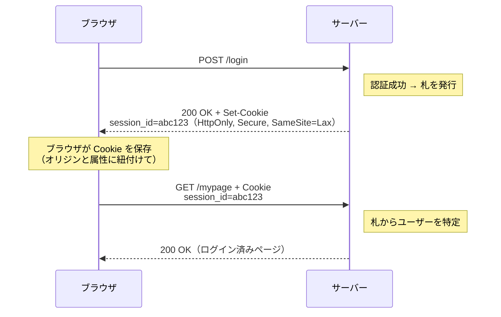
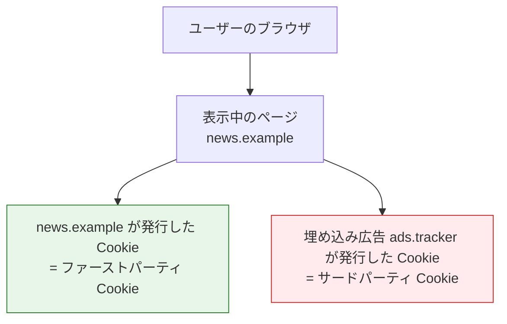

# Cookie（HTTP Cookie）

> **一言で言うと:** Cookie は、サーバーが `Set-Cookie` レスポンスヘッダで発行し、ブラウザがそのオリジンへのリクエストに `Cookie` ヘッダで**自動的に再送**する小さなキー・バリューのデータ。ステートレスな [[HTTP-HTTPS|HTTP]] に「状態」を持たせる最も基本的な仕組みであり、その振る舞い（寿命・送信範囲・JS からの可視性・クロスサイト送信の可否）は**属性**で細かく制御する。

## なぜ Cookie が必要か

[[HTTP-HTTPS|HTTP]] はステートレス、つまりサーバーは各リクエストを独立した「初対面」として扱う。ログインに成功しても、次のリクエストでサーバーはそれを覚えていない。かといって毎回パスワードを送るのは非現実的だ。

そこで「サーバーが小さな札をブラウザに渡し、ブラウザは以後その札を自動で見せ続ける」仕組みが生まれた。これが Cookie である。札の中身（多くはセッションID）をキーに、サーバーは「さっきの人だ」と判別できる。Cookie は**状態維持の運搬手段**であって、状態の保存場所そのもの（セッションストア等）とは別物である点に注意（→ [[セッションとJWT]]）。

## 仕組み — Set-Cookie と Cookie の往復

Cookie のライフサイクルは2つのヘッダの往復で完結する。



- **`Set-Cookie`（レスポンスヘッダ）** — サーバーが発行する。Cookie 1 つにつき 1 行で、`名前=値` の後ろに `;` 区切りで属性を並べる。
- **`Cookie`（リクエストヘッダ）** — ブラウザが送り返す。複数の Cookie を `名前1=値1; 名前2=値2` のようにまとめて送る。**属性は送り返されない**（値だけ）。サーバーは属性を覚えておく必要がない。

実際のヘッダ例:

```http
# サーバー → ブラウザ
Set-Cookie: session_id=abc123; Max-Age=3600; Path=/; Secure; HttpOnly; SameSite=Lax

# ブラウザ → サーバー（以後のリクエスト。属性は付かない）
Cookie: session_id=abc123; theme=dark
```

> [!info] 用語ミニ辞典
> - **オリジン（Origin）:** スキーム（`https`）・ホスト（`example.com`）・ポート（`443`）の3点セット。Cookie の送信範囲は厳密にはオリジンより緩く、後述の `Domain` / `Path` 属性で決まる（スキームやポートは無視されがち）。
> - **セッションID（Session ID）:** サーバー側に保存したユーザー状態を指し示す、意味を持たないランダム文字列。Cookie の最も典型的な中身。

## Cookie 属性 — 振る舞いを決める本体

Cookie の安全性と挙動は、ほぼ属性で決まる。ここが Cookie 理解の核心。

| 属性 | 役割 | 設定しないと |
|------|------|-------------|
| `Domain` | 送信先ホストの範囲 | **ホストのみ**（発行元の正確なホストだけ。サブドメインに送られない） |
| `Path` | 送信先パスの範囲 | リクエストのパスが基準（多くは `Path=/` を明示する） |
| `Expires` / `Max-Age` | 寿命 | **セッションCookie**（ブラウザ終了で消える） |
| `Secure` | HTTPS でのみ送信 | HTTP でも送信され、平文盗聴のリスク |
| `HttpOnly` | JS から不可視 | `document.cookie` で読め、XSS で窃取されうる |
| `SameSite` | クロスサイト送信の可否 | Chromium 系は `Lax` 扱い。ただし Firefox は `None` 扱い等ブラウザ差あり（後述） |

### Domain と Path — どこへ送るか

- **`Domain`** を省略すると **host-only cookie** になり、発行した正確なホスト（例 `app.example.com`）にだけ送られる。`Domain=example.com` と指定すると `example.com` とその**サブドメイン全部**（`app.`, `api.` 等）に送られる。広げるほど漏洩面が増えるので、必要最小限にするのが原則。
  - 歴史的に先頭ドット（`Domain=.example.com`）を書く流儀があったが、現行仕様（RFC 6265）では**先頭ドットは無視**され、書いても書かなくても同じ「サブドメイン含む」になる。
- **`Path=/admin`** とすると `/admin` 配下のリクエストにだけ送られる。ただし Path はセキュリティ境界ではない（同一オリジンの JS から他 Path の Cookie は操作可能）。

### Expires / Max-Age — いつまで生きるか

- **セッションCookie** — `Expires` も `Max-Age` も付けない Cookie。ブラウザを閉じると消える（ただしブラウザの「セッション復元」機能で残ることもある）。
- **永続Cookie** — `Max-Age=3600`（秒数、相対）または `Expires=Wed, 21 Oct 2026 07:28:00 GMT`（絶対日時）で寿命を指定。**両方あれば `Max-Age` が優先**される。`Max-Age=0`（や過去の `Expires`）を送ると Cookie の**削除**になる。

### Secure / HttpOnly — 盗聴と XSS への防御

- **`Secure`** — HTTPS 接続でのみ送信。HTTP では送られないので、平文盗聴で Cookie を抜かれるのを防ぐ。
- **`HttpOnly`** — JavaScript（`document.cookie`）から読めなくする。これにより [[XSS]] が成立してもセッションCookieをJSで直接窃取されにくい。なぜ `localStorage` 保存より安全になるのか、その仕組みは → [[localStorageとXSSによるトークン窃取]]。
  - 注意: `HttpOnly` は「窃取」を防ぐだけで、XSS が起きれば Cookie 自動送信を使った API 悪用は依然可能。XSS の無害化ではない。

### SameSite — クロスサイトに送るか

`SameSite` は、別サイトを起点とするリクエストに Cookie を付けるかを制御する。[[CSRF]] 対策の基盤。

| 値 | クロスサイト送信 | 用途 |
|----|----------------|------|
| `Strict` | 一切送らない | 最も厳格。外部リンクから来ると未ログイン扱いになる UX 影響あり |
| `Lax` | トップレベルナビゲーションの GET のみ送る | Chromium 系（Chrome/Edge/Opera）の既定。POST CSRF を防ぎつつ UX 影響が小さい |
| `None` | 常に送る（`Secure` 必須） | 決済リダイレクトや iframe 埋め込みなど、意図的にクロスサイトで使う場合 |

> **既定値はブラウザで割れる**: 未指定時に `Lax` 扱いになるのは **Chromium 系（Chrome 80・2020〜、Edge/Opera）** で、市場の多数派ではあるが普遍ではない。**Firefox は未指定を実質 `None` 扱い**（別途 Total Cookie Protection でサイト単位に分離）、**Safari も `Lax` 既定ではなく ITP で別管理**。ブラウザ既定に頼らず、OWASP / web.dev の推奨どおり**全 Cookie に `SameSite` を明示する**のが安全。

> `SameSite` の値ごとの攻撃成立条件、CSRF トークンとの併用といった**防御設計の深掘りは [[CSRF]]** に委ねる。本ドキュメントは「Cookie 属性として何を意味するか」までを扱う。

### __Host- / __Secure- プレフィックス — 名前で制約を強制する

Cookie 名の頭に特定の接頭辞を付けると、ブラウザがその Cookie に追加の制約を課す。属性の付け忘れや、サブドメインからの上書き攻撃を防ぐための仕組み。

- **`__Secure-`** 接頭辞 — `Secure` 属性が必須（HTTPS でしか発行できない）。
- **`__Host-`** 接頭辞 — `Secure` 必須・`Path=/` 必須・`Domain` 指定**禁止**（host-only に固定）。最も堅い。セッションCookieはこれを推奨。

```http
Set-Cookie: __Host-session=abc123; Secure; Path=/; HttpOnly; SameSite=Lax
```

## ファーストパーティ Cookie とサードパーティ Cookie

「何番目の party か」は **表示中のページのサイトから見て、その Cookie の所属サイトが同じか違うか**で決まる。



- **ファーストパーティ Cookie** — 訪問中のサイト自身の Cookie。ログイン状態やカートなど、サイトの正常動作に不可欠。
- **サードパーティ Cookie** — ページに埋め込まれた別ドメイン（広告・解析・SNS ボタン等）の Cookie。複数サイトをまたいだ**ユーザー追跡（クロスサイトトラッキング）**に使われてきたため、プライバシー上の問題が大きい。

### サードパーティ Cookie をめぐる現況（重要・最新性に注意）

シニアとして経緯を押さえておきたいトピック。**ブラウザによって扱いが大きく異なる**:

- **Safari** — ITP（Intelligent Tracking Prevention）で**既定でサードパーティ Cookie をブロック**（数年前から）。**Firefox** — Total Cookie Protection で**サイトごとに分離（パーティション）**し、実質的にクロスサイト追跡を遮断（2022年〜既定）。方式は「ブロック」と「分離」で異なるが、いずれもクロスサイトでの追跡用途は成立しない。
- **Chrome** — 当初は全廃を計画していたが、**2024年7月に方針転換**し、**2025年4月に専用の選択プロンプト導入も撤回**。サードパーティ Cookie は当面 Chrome に残る（明確な廃止予定なし）。さらに**2025年10月、代替技術だった Privacy Sandbox の大半（Topics・Protected Audience・Attribution Reporting 等）の終了**が発表された。

実務的な含意: 「サードパーティ Cookie はいずれ消える」という前提で設計してきたが、**Chrome では当面残る**一方、**Safari/Firefox では既に使えない**。クロスサイトで Cookie に依存する機能（埋め込み・SSO の一部）は、ブラウザ差を前提に代替手段（ファーストパーティ化、サーバー間連携、Storage Access API 等）を検討する必要がある。

## Cookie と他のクライアント保存の使い分け

| 保存先 | サーバーへ自動送信 | JS から読めるか | 主な用途 |
|--------|------------------|---------------|---------|
| **Cookie** | される（毎リクエスト） | `HttpOnly` なら不可 | 認証セッション、サーバーが毎回必要とする小さな状態 |
| `localStorage` | されない | 読める | 永続的なクライアント設定。**トークン保存は非推奨**（→ [[localStorageとXSSによるトークン窃取]]） |
| `sessionStorage` | されない | 読める | タブ単位の一時データ |

Cookie の弱みは「毎リクエストに自動で乗る」こと——これが [[CSRF]] の根本原因であり、サイズが大きいと全リクエストが重くなる理由でもある。逆に強みも「自動で乗る」ことで、SSR やサーバー主導の認証と相性が良い。トークン保存場所としての Cookie/ヘッダの選択軸は → [[認証トークンの形式と転送方式]]。

## コード例

### Go（net/http）— 発行・読み取り・削除

```go
package main

import (
	"net/http"
	"time"
)

func setCookie(w http.ResponseWriter, r *http.Request) {
	http.SetCookie(w, &http.Cookie{
		Name:     "__Host-session", // 接頭辞で Secure/Path=/ /Domain なしを強制
		Value:    "abc123",
		Path:     "/",
		MaxAge:   3600,                  // 秒。0 だと「セッションCookie扱い」, 負値で削除
		Secure:   true,                  // HTTPS のみ
		HttpOnly: true,                  // JS から不可視
		SameSite: http.SameSiteLaxMode,  // クロスサイトはトップレベルGETのみ
	})
}

func readCookie(w http.ResponseWriter, r *http.Request) {
	c, err := r.Cookie("__Host-session")
	if err != nil { // http.ErrNoCookie の可能性
		http.Error(w, "no session", http.StatusUnauthorized)
		return
	}
	_ = c.Value // "abc123"
}

func deleteCookie(w http.ResponseWriter, r *http.Request) {
	// 同名・同 Path で MaxAge を負値にして上書き = 削除
	http.SetCookie(w, &http.Cookie{Name: "__Host-session", Path: "/", MaxAge: -1, Secure: true})
}
```

### Express（Node.js）— 発行・読み取り・削除

```javascript
const express = require('express');
const cookieParser = require('cookie-parser');

const app = express();
app.use(cookieParser()); // req.cookies に Cookie をパースして載せる

app.post('/login', (req, res) => {
  res.cookie('session_id', 'abc123', {
    path: '/',
    maxAge: 3600 * 1000, // ミリ秒（Go と単位が違う点に注意）
    secure: true,
    httpOnly: true,
    sameSite: 'lax',
  });
  res.sendStatus(204);
});

app.get('/mypage', (req, res) => {
  const sid = req.cookies.session_id; // "abc123"
  if (!sid) return res.sendStatus(401);
  res.send('logged in');
});

app.post('/logout', (req, res) => {
  res.clearCookie('session_id', { path: '/' }); // 発行時と同じ属性で消す
  res.sendStatus(204);
});

app.listen(3000);
```

## よくある落とし穴

### 1. 削除時に発行時と属性を揃えていない

Cookie の削除は「同じ `名前`・`Path`・`Domain` で `Max-Age=0`（負値）を上書き送信」する。発行時に `Path=/app` を付けたのに、削除時に `Path` を省くと**別の Cookie 扱いになり消えない**。「ログアウトしたのにセッションが残る」事故の典型。

### 2. `Max-Age` と `Expires` の単位・基準の取り違え

`Max-Age` は**秒**かつ**相対**（今から何秒）、`Expires` は**絶対日時**（GMT 文字列）。さらに Express の `maxAge` は**ミリ秒**で、生の `Set-Cookie` の秒とは違う。フレームワークごとの単位を確認する。

### 3. `SameSite=None` に `Secure` を付け忘れる

現代ブラウザは `SameSite=None` の Cookie に `Secure` が無いと**その Cookie を拒否**する。開発を HTTP で行っていると本番（HTTPS）で初めて壊れる典型パターン。

### 4. サイズと個数の上限を超える

1 Cookie あたり約 **4KB**（名前+値+属性込み）、1 ドメインあたり数十個という上限がある（RFC 6265 は最低 4096 バイト/50 個を保証）。JWT のような大きな値を Cookie に詰めると上限に当たったり、全リクエストが肥大化する。

### 5. `Domain` を広げすぎる

`Domain=example.com` にすると全サブドメインに送られる。1 つのサブドメインが [[XSS]] を踏むと、共有された Cookie が他サブドメインの分まで影響しうる。不要にサブドメイン共有しない。可能なら `__Host-` で host-only に固定する。

### 6. `HttpOnly` を「XSS 対策」と誤解する

`HttpOnly` は Cookie の**JS 経由の窃取**を防ぐだけ。XSS が起きれば攻撃者は被害者ブラウザから（自動送信される Cookie を使って）API を直接叩ける。XSS そのものの対策は出力時エスケープ（→ [[XSS]]）。

## AI実装のアンチパターン

| アンチパターン | なぜ問題か | 対策 |
|---|---|---|
| セッションCookieに属性を付けない（`Secure`/`HttpOnly`/`SameSite` 欠落） | 平文盗聴・JS窃取・CSRF の経路が開く | 3属性を必ず付与。可能なら `__Host-` 接頭辞 |
| `SameSite=None` を安易に設定 | クロスサイト送信が常時有効になり CSRF 面が広がる | 本当にクロスサイトが要る時のみ。`Secure` 必須、CSRFトークン併用 |
| トークン（JWT）を巨大なまま Cookie に詰める | 4KB 上限・全リクエスト肥大化 | 不透明セッションIDにする / 必要情報はサーバー保持 |
| ログアウトで Cookie を消すのに属性不一致 | セッションが残り続ける | 発行時と同じ `Path`/`Domain` で削除 |
| `Domain` をルートドメインに広げて共有 | サブドメイン1つの侵害が全体に波及 | 最小スコープ。`__Host-` で host-only 固定 |

## 関連トピック

- [[HTTP-HTTPS]] — 親トピック。Cookie はステートレスな HTTP に状態を持たせる仕組みの一つ
- [[セッションとJWT]] — Cookie が運ぶ「中身」（セッションID / JWT）と状態保持方式
- [[認証トークンの形式と転送方式]] — トークンの保存・転送に Cookie を選ぶ/選ばない判断軸
- [[CSRF]] — Cookie 自動送信が生む脆弱性と、`SameSite` / CSRFトークンによる防御の深掘り
- [[localStorageとXSSによるトークン窃取]] — `HttpOnly` Cookie が `localStorage` より XSS に強い理由
- [[CORS]] — クロスオリジンで Cookie を送る `credentials: 'include'` と CORS 設定の関係

## 参考リソース

- RFC 6265 — HTTP State Management Mechanism（Cookie の基本仕様）
- RFC 6265bis（draft）— `SameSite` や接頭辞などを反映した改訂版
- MDN — Set-Cookie / Using HTTP cookies
- OWASP — Session Management Cheat Sheet（セッションCookieの安全な属性設定）

## 理解度セルフチェック

> 答えられなければ本文に戻る。答えはこのファイル内に必ずある。

1. **`Set-Cookie` と `Cookie` ヘッダの違いを30秒で説明せよ。** ブラウザが送り返すときに「属性」がどうなるかに触れること。
2. **セッションCookieに最低限付けるべき属性を3つ挙げ、それぞれが防ぐ脅威を述べよ。**
3. **AI生成コードレビュー設問:** AI が次の Cookie 発行コードを生成した。本文の観点で**問題点を最低3つ**指摘せよ。

```javascript
// SPA のログイン後、認証用 JWT を Cookie に保存する
res.cookie('token', jwt, {
  domain: 'example.com',
  sameSite: 'none',
  maxAge: 30 * 24 * 60 * 60 * 1000, // 30日
});
```

> [!note]- 解答の指針
>
> > [!info] 用語ミニ辞典
> > - **host-only cookie:** `Domain` 属性を付けずに発行した Cookie。発行元の正確なホストにだけ送られ、サブドメインには送られない。漏洩面が最小。
> > - **セッションCookie:** `Expires`/`Max-Age` を持たず、ブラウザを閉じると消える Cookie。対義は寿命を明示した「永続Cookie」。
> > - **クロスサイトトラッキング:** 複数サイトに同じサードパーティが Cookie を仕込み、サイトをまたいでユーザーを名寄せ・追跡すること。サードパーティ Cookie 規制の主因。
> >
> 1. `Set-Cookie` は**サーバー → ブラウザ**のレスポンスヘッダで、`名前=値` と属性（`Secure` 等）を含めて Cookie を発行する。`Cookie` は**ブラウザ → サーバー**のリクエストヘッダで、保存済みの Cookie を `名前=値; 名前2=値2` の形でまとめて送り返す。このとき**属性は送り返されない**（値だけ）。属性はブラウザ側の挙動を決めるための指示なので、サーバーは覚えておく必要がない。
> 2. 例: **`Secure`**（HTTP 平文での盗聴を防ぐ）、**`HttpOnly`**（XSS による JS 経由の Cookie 窃取を防ぐ）、**`SameSite=Lax` 以上**（クロスサイトからの自動送信を絞り CSRF を防ぐ）。さらに堅くするなら `__Host-` 接頭辞で host-only・`Path=/`・`Secure` を強制する。
> 3. 問題点（最低限以下を指摘できれば本文を理解している）:
>     - **`Secure` が無いのに `SameSite=None`** — 現代ブラウザはこの Cookie を拒否する。`None` を使うなら `Secure` 必須。そもそもこの用途で `None` が要るのか（クロスサイトで送る必要があるのか）から再検討すべき。
>     - **`HttpOnly` が無い** — JWT が `document.cookie` から読めてしまい、XSS で窃取される。認証用なら `HttpOnly` 必須。
>     - **`domain: 'example.com'` で全サブドメインに共有** — 1 つのサブドメインの侵害が認証 Cookie 全体に波及する。host-only（`Domain` 省略）か `__Host-` 接頭辞にすべき。
>     - **有効期限30日が長い** — 漏洩時の影響が大きい。短命トークン＋リフレッシュ構成を検討（→ [[認証トークンの形式と転送方式]]）。
>     - （加点）**そもそも JWT を Cookie に入れるなら CSRF 対策が必要** — Cookie は自動送信されるため、`SameSite` だけに頼らず CSRF トークン併用を検討（→ [[CSRF]]）。
