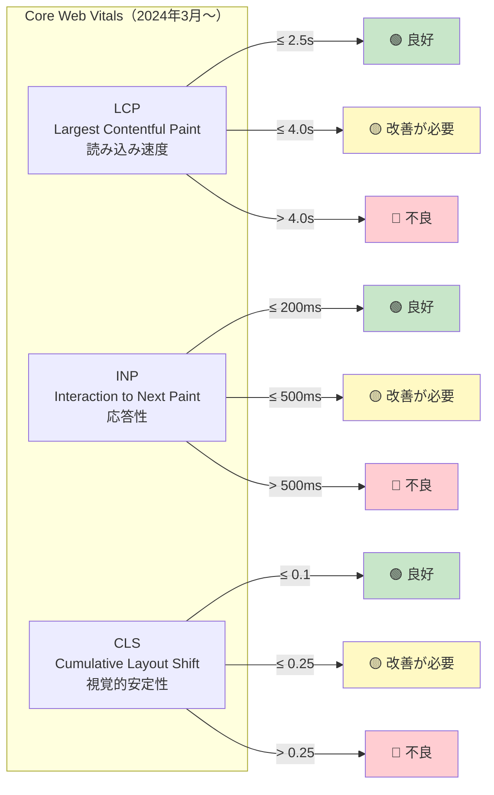
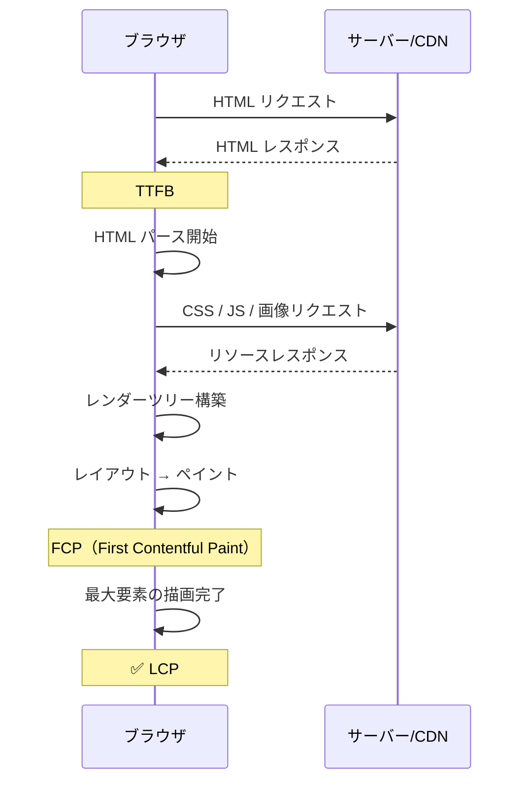
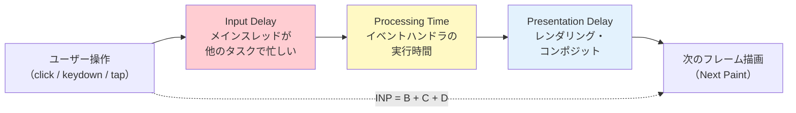
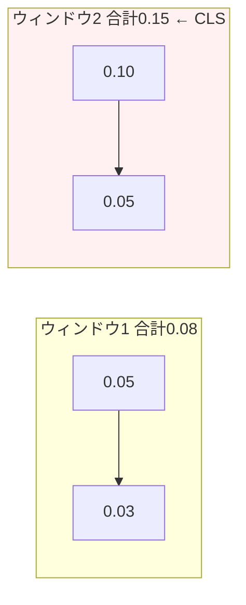

# Core Web Vitals

> **一言で言うと:** Google が定義する「ユーザー体験の質」を測る3つの指標 — LCP（読み込み速度）、INP（応答性）、CLS（視覚的安定性）。検索ランキングに影響し、全てブラウザのレンダリングパイプラインと HTML/CSS/JS の最適化に直結する。

## 概念

Core Web Vitals は「ユーザーが体感するページの品質」を定量化する。従来の技術的指標（TTFB、DOMContentLoaded 等）がサーバーやネットワークの観点だったのに対し、Core Web Vitals は**ユーザーの視点**で「見えた」「操作できた」「ズレなかった」を測る。



### 閾値の一覧

| 指標 | 良好 | 改善が必要 | 不良 | 測定対象 |
|------|------|-----------|------|---------|
| **LCP** | ≤ 2.5秒 | ≤ 4.0秒 | > 4.0秒 | 最大のコンテンツ要素が表示されるまでの時間 |
| **INP** | ≤ 200ms | ≤ 500ms | > 500ms | ユーザー操作から画面更新までの最悪ケースの遅延 |
| **CLS** | ≤ 0.1 | ≤ 0.25 | > 0.25 | 予期しないレイアウトシフトの累積スコア |

**判定基準:** フィールドデータ（実ユーザーデータ）の **75パーセンタイル**が閾値を満たしているかで評価する。中央値ではなく75パーセンタイルを使うのは、大多数のユーザーが良好な体験を得ていることを保証するため。

## LCP — Largest Contentful Paint

ビューポート内で最も大きなコンテンツ要素（画像、動画、テキストブロック）が描画完了するまでの時間。「ページが使えそうに見えるまでの速さ」を表す。

### LCP の対象要素

- `` 要素（`<picture>` 内の `<source>` を含む）
- `<video>` 要素のポスター画像
- CSS `background-image` で読み込まれた画像
- テキストを含むブロックレベル要素（`<h1>`, `<p>` 等）

### LCP が遅くなる主な原因と対策

| 原因 | 詳細 | 対策 |
|------|------|------|
| リソースの読み込み遅延 | LCP 画像のダウンロード開始が遅い | `<link rel="preload">` で事前読み込み、`fetchpriority="high"` を指定 |
| レンダーブロッキング | CSS/JS が描画を阻害する | Critical CSS のインライン化、`<script defer>` の使用 |
| サーバー応答時間 | TTFB（Time to First Byte）が遅い | [[SSR-SSG-CSR|SSG/CDN配信]]、サーバーサイドキャッシュ |
| クライアントサイドレンダリング | JS 実行完了まで描画されない | [[SSR-SSG-CSR|SSR/SSG]] の採用 |
| 画像サイズの未最適化 | 大きすぎるファイルサイズ | [[画像フォーマットと最適化|WebP/AVIF]] + レスポンシブ画像 |



## INP — Interaction to Next Paint

ページ滞在中の全てのユーザー操作（クリック、タップ、キー入力）のうち、**最も遅い応答**の遅延時間（外れ値を除く）。2024年3月に FID（First Input Delay）を置き換えた。

### FID との違い

| 観点 | FID（廃止） | INP（現行） |
|------|-----------|-----------|
| 測定対象 | 最初の操作の**入力遅延のみ** | 全操作の**入力遅延 + 処理時間 + 描画遅延** |
| 測定範囲 | ページ読み込み直後の1回だけ | ページ滞在中の全操作 |
| 問題 | 最初の操作が軽い場合、後の重い操作を見逃す | ライフサイクル全体の応答性を反映する |

### INP の内訳



### INP が悪化する主な原因と対策

| 原因 | 対策 |
|------|------|
| 長いタスクがメインスレッドを占有 | タスクを `requestIdleCallback` や `scheduler.yield()` で分割 |
| 重い JS のイベントハンドラ | 計算を Web Worker にオフロード、または debounce/throttle |
| 巨大な DOM ツリー | DOM ノード数を削減、仮想スクロールの導入 |
| 同期的なレイアウト再計算（Forced Reflow） | DOM の読み取りと書き込みをバッチ化 |

## CLS — Cumulative Layout Shift

ページ読み込み中や操作中に発生する「予期しないレイアウトのずれ」の累積スコア。ユーザーが読んでいるテキストが急に下にずれたり、押そうとしたボタンが移動したりする体験の悪さを数値化する。

### CLS の計算式

個々のレイアウトシフトのスコアは以下で算出する:

```
Layout Shift Score = Impact Fraction × Distance Fraction
```

- **Impact Fraction** — シフトした要素とシフト先が占めるビューポートの割合
- **Distance Fraction** — 要素が移動した距離のビューポート比率

**例:** ビューポートの50%を占める要素が25%下にずれた場合:
`0.5 × 0.25 = 0.125`（1回のシフトで閾値 0.1 を超える）

### セッションウィンドウ（Session Window）

CLS は全シフトの単純合計ではない。2021年のアップデートで**セッションウィンドウ方式**に変更された:

- シフト間の間隔が **1秒以内** のものをグループ化し、最大 **5秒間** のウィンドウにまとめる
- 各ウィンドウ内の Layout Shift Score を合計する
- **最大のウィンドウの合計値**が CLS となる



この方式により、長時間滞在するページ（SPA、無限スクロール等）で CLS が際限なく累積する問題が解消された。

### CLS が発生する主な原因と対策

| 原因 | 対策 |
|------|------|
| 画像・動画のサイズ未指定 | `width` / `height` 属性を必ず設定し、CSS `aspect-ratio` を活用 |
| Web フォントの読み込み（FOUT/FOIT） | `font-display: swap` + `<link rel="preload">` でフォントを事前読み込み |
| 動的に挿入される広告・バナー | 表示領域を事前に確保（`min-height` で placeholder） |
| 非同期で読み込まれるコンテンツ | スケルトンスクリーンで領域を確保 |
| `top` / `left` によるアニメーション | `transform` を使用（コンポジットレイヤーで処理、レイアウトシフトを発生させない） |

## コード例

### LCP の最適化 — 画像のプリロードと優先度指定（HTML）

```html
<head>
  <!-- LCP 画像をプリロードして読み込み開始を早める -->
  <link rel="preload" as="image" href="/hero.webp" type="image/webp"
        fetchpriority="high">

  <!-- Critical CSS をインライン化してレンダーブロッキングを排除 -->
  <style>
    /* ファーストビューに必要な最小限の CSS */
    .hero { width: 100%; height: auto; aspect-ratio: 16 / 9; }
  </style>

  <!-- 残りの CSS は非同期読み込み -->
  <link rel="preload" href="/styles.css" as="style"
        onload="this.onload=null;this.rel='stylesheet'">
</head>
<body>
  
</body>
```

### INP の最適化 — 長いタスクの分割（TypeScript）

```typescript
// ❌ メインスレッドを長時間ブロックする処理
function processLargeList(items: Item[]): void {
  for (const item of items) {
    // 重い計算（各アイテムに5ms → 1000件で5秒ブロック）
    renderItem(item);
  }
}

// ✅ scheduler.yield() でメインスレッドを定期的に解放する
// Chrome 129+ / Firefox 142+ で利用可能、Safari 未対応（2026年4月時点）
async function processLargeList(items: Item[]): Promise<void> {
  let lastYield = performance.now();

  for (const item of items) {
    renderItem(item);

    // 50ms ごとにメインスレッドを解放し、ユーザー操作を受け付ける
    if (performance.now() - lastYield > 50) {
      // scheduler.yield() はブラウザに制御を返し、
      // 保留中のユーザー入力イベントを処理させる
      // Safari 未対応のため setTimeout にフォールバック
      await (scheduler.yield?.() ?? new Promise(r => setTimeout(r, 0)));
      lastYield = performance.now();
    }
  }
}

// ✅ 代替手段: requestIdleCallback でアイドル時に処理
function processInIdle(items: Item[]): void {
  let index = 0;

  function processChunk(deadline: IdleDeadline): void {
    while (index < items.length && deadline.timeRemaining() > 5) {
      renderItem(items[index]);
      index++;
    }
    if (index < items.length) {
      requestIdleCallback(processChunk);
    }
  }

  requestIdleCallback(processChunk);
}
```

### CLS の防止 — レイアウトシフトを発生させない実装（CSS / TypeScript）

```css
/* ✅ 画像の aspect-ratio を指定して読み込み前から領域を確保 */
.responsive-image {
  width: 100%;
  height: auto;
  aspect-ratio: 16 / 9;     /* width/height 属性の代替 */
  object-fit: cover;
}

/* ✅ Web フォントの FOUT/FOIT 対策 */
@font-face {
  font-family: 'CustomFont';
  src: url('/fonts/custom.woff2') format('woff2');
  font-display: swap;        /* システムフォント → カスタムフォントに切り替え */
  /* size-adjust でメトリクスを近づけ、swap 時のシフトを最小化 */
  size-adjust: 105%;
  ascent-override: 90%;
  descent-override: 20%;
}

/* ✅ アニメーションは transform を使う（レイアウトシフトを発生させない） */
.slide-in {
  /* ❌ left: 0 → left: 100px はレイアウト再計算を発生させる */
  /* ✅ transform はコンポジットレイヤーで処理される */
  transform: translateX(0);
  transition: transform 0.3s ease;
}
.slide-in.active {
  transform: translateX(100px);
}
```

```typescript
// ✅ 動的コンテンツの挿入前にスケルトンで領域を確保する
function AdSlot({ width, height }: { width: number; height: number }) {
  const [adLoaded, setAdLoaded] = useState(false);

  return (
    // 広告読み込み前から固定サイズの領域を確保
    <div style={{ width, height, minHeight: height, background: '#f0f0f0' }}>
      {adLoaded ? <AdContent /> : <Skeleton width={width} height={height} />}
    </div>
  );
}
```

### PerformanceObserver による CWV の計測（TypeScript）

```typescript
// web-vitals ライブラリで簡単に計測できる
import { onLCP, onINP, onCLS } from 'web-vitals';

function sendToAnalytics(metric: { name: string; value: number; id: string }) {
  // Google Analytics 4 や自前の分析基盤に送信
  fetch('/api/vitals', {
    method: 'POST',
    body: JSON.stringify({
      name: metric.name,     // "LCP" | "INP" | "CLS"
      value: metric.value,   // ミリ秒またはスコア
      id: metric.id,         // ユニークID（重複排除用）
      page: location.pathname,
    }),
    keepalive: true,  // ページ離脱時でも送信を完了させる
  });
}

onLCP(sendToAnalytics);
onINP(sendToAnalytics);
onCLS(sendToAnalytics);
```

```python
# BigQuery に蓄積された CrUX（Chrome User Experience Report）データを分析
# CrUX は Chrome ブラウザの実ユーザーデータを匿名で集約した公開データセット

from google.cloud import bigquery

client = bigquery.Client()

# materialized テーブルを使用（p75 が事前計算済みで最もシンプル）
query = """
SELECT
  origin,
  p75_lcp,              -- LCP の 75パーセンタイル（ミリ秒）
  p75_cls,              -- CLS の 75パーセンタイル
  p75_inp,              -- INP の 75パーセンタイル（ミリ秒）
  -- LCP が「良好」（2.5秒以下）なユーザーの割合
  small_lcp / (small_lcp + medium_lcp + large_lcp) AS lcp_good_pct,
  -- CLS が「良好」（0.1以下）なユーザーの割合
  small_cls / (small_cls + medium_cls + large_cls) AS cls_good_pct
FROM `chrome-ux-report.materialized.device_summary`
WHERE origin = 'https://example.com'
  AND device = 'phone'           -- 'phone' / 'desktop' / 'tablet'
  AND date = '2026-03-01'        -- 月初の日付で指定
"""

results = client.query(query)
for row in results:
    print(f"LCP p75: {row.p75_lcp}ms, CLS p75: {row.p75_cls:.3f}, INP p75: {row.p75_inp}ms")
    print(f"LCP good: {row.lcp_good_pct:.1%}, CLS good: {row.cls_good_pct:.1%}")
```

## ラボデータとフィールドデータ

Core Web Vitals の計測には2つのアプローチがあり、両方を併用する必要がある。

| 観点 | ラボデータ（Lab） | フィールドデータ（Field / RUM） |
|------|------------------|-------------------------------|
| 取得元 | Lighthouse, DevTools, WebPageTest | CrUX, web-vitals ライブラリ, RUM ツール |
| 環境 | 固定条件（シミュレーション） | 実ユーザーの多様な環境 |
| 用途 | 開発中のデバッグ・回帰検出 | 実際のユーザー体験の把握 |
| INP | 測定不可（自動操作では不十分） | 実操作から計測 |
| 検索ランキング | 影響しない | **これが使われる**（CrUX データ） |
| 注意点 | 高スペックマシンでの結果は楽観的すぎる | データ蓄積に28日間必要 |

**重要:** Google 検索ランキングに影響するのは**フィールドデータ（CrUX）**のみ。Lighthouse で100点でもフィールドデータが悪ければ評価されない。

## よくある落とし穴

### 1. Lighthouse スコアだけを最適化する

Lighthouse はラボ環境のスコアであり、実ユーザーの体験とは乖離することがある。特に INP はラボ環境では測定できないため、フィールドデータ（CrUX / RUM）と必ず併用する。

### 2. CLS を初回読み込み時だけ確認する

CLS はページのライフサイクル全体で累積される。無限スクロールの追加読み込みや、遅延表示される通知バナーなど、操作中のシフトも計測対象。DevTools の Performance パネルで「Layout Shift」を確認し、全体の流れで検証する。

### 3. LCP 画像に `loading="lazy"` を付ける

ファーストビューの LCP 画像を遅延読み込みにすると、ビューポートに入るまでダウンロードが開始されず LCP が大幅に悪化する。LCP 候補の画像には `fetchpriority="high"` を指定し、`loading="lazy"` は付けない。

### 4. 全ての操作で INP 200ms 以内を目指す

INP は75パーセンタイルで評価される。極端に重い操作（ファイルアップロード、ページ遷移等）が1つあっても、全体のパーセンタイルが良ければ問題ない。最適化は頻度の高い操作（スクロール、クリック、入力）を優先する。

### 5. `will-change` の乱用

`will-change: transform` はコンポジットレイヤーを事前作成して CLS 回避に使えるが、全要素に付けると GPU メモリを浪費し、逆にパフォーマンスが悪化する。アニメーション対象の要素にのみ、かつアニメーション直前に適用する。

## 関連トピック

- [[HTML-CSS-JS]] — Core Web Vitals は HTML/CSS/JS の読み込みと実行の結果として計測される。レンダリングパイプラインの理解が最適化の基盤
- [[DOMと仮想DOM]] — 巨大な DOM ツリーは INP を悪化させる。仮想 DOM のバッチ更新は CLS 防止に寄与する
- [[SSR-SSG-CSR]] — レンダリング戦略の選択が LCP に直結する。SSR/SSG は CSR より LCP が有利
- [[画像フォーマットと最適化]] — LCP 要素の多くは画像。WebP/AVIF + レスポンシブ画像が LCP 改善の基本
- [[イベントループ]] — INP の Input Delay は、メインスレッドが長いタスクで占有されている間に発生する

## 参考リソース

- [web.dev - Core Web Vitals](https://web.dev/articles/vitals) — Google 公式の Core Web Vitals 解説
- [web.dev - INP](https://web.dev/articles/inp) — INP の詳細な解説と最適化ガイド
- [Chrome UX Report (CrUX)](https://developer.chrome.com/docs/crux/) — フィールドデータの公開データセット
- [web-vitals ライブラリ](https://github.com/GoogleChrome/web-vitals) — Core Web Vitals を計測するための公式 JS ライブラリ
- [PageSpeed Insights](https://pagespeed.web.dev/) — ラボデータ + フィールドデータの両方を確認できるツール
