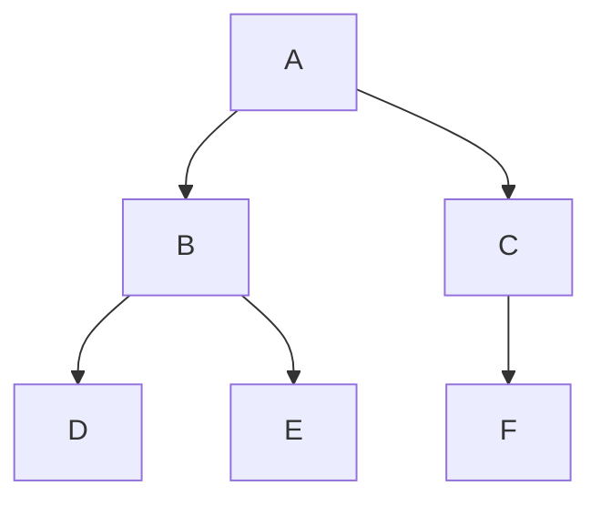

# DFS と BFS（Depth-First Search / Breadth-First Search）

> **一言で言うと:** 木やグラフを「どの順番で訪れるか」の2大戦略。DFS は行けるところまで深く潜ってから戻り、BFS は近いところから順に広げていく。

## 概念

### BFS（幅優先探索）— 近い順に探す

「まず隣の部屋を全部見て、次にその隣の部屋を全部見る」。**キュー（FIFO）** を使う。

### DFS（深さ優先探索）— 突き当たりまで進んで戻る

「一本道をどこまでも進み、行き止まりになったら引き返して別の道を試す」。**スタック（LIFO）** または **再帰** を使う。

### 探索順序の違い

```
        A
       / \
      B   C
     / \   \
    D   E   F
```



| 方法 | 探索順 | 使うデータ構造 |
|------|--------|---------------|
| BFS | A → B → C → D → E → F（層ごと） | キュー |
| DFS（前順） | A → B → D → E → C → F（深さ優先） | スタック / 再帰 |

### いつ使うか

| 場面 | BFS | DFS |
|------|-----|-----|
| **最短経路を求める**（辺の重みが均一） | ✅ 最適 | ❌ 最短を保証しない |
| **全ノードの列挙** | ○ 可能 | ✅ メモリ効率が良い |
| **特定のパスを探す** | △ メモリ消費大 | ✅ バックトラックで自然に実装 |
| **階層ごとの処理**（レベル別表示） | ✅ 自然 | △ 追加の管理が必要 |
| **サイクル検出** | ○ 可能 | ✅ 再帰で自然に検出 |
| **トポロジカルソート** | △ カーンのアルゴリズム | ✅ 帰りがけ順で自然に実現 |

### 計算量

木やグラフのノード数を V、辺の数を E とする。

| | 時間計算量 | 空間計算量 |
|---|---|---|
| BFS | O(V + E) | O(V) — キューに同じ層のノードが全部入る（最悪で幅が広い木は大量） |
| DFS | O(V + E) | O(V) — 再帰スタックの深さ（最悪で木の深さ分） |

時間計算量は同じだが、**空間計算量の特性が違う**:
- BFS: **幅が広い木**でメモリを多く消費する
- DFS: **深い木**でスタックを多く消費する（再帰の場合はスタックオーバーフローのリスク）

## 基本実装

### TypeScript

```typescript
type TreeNode = {
  value: string;
  children: TreeNode[];
};

// BFS — キューを使う
function bfs(root: TreeNode): string[] {
  const result: string[] = [];
  const queue: TreeNode[] = [root];

  while (queue.length > 0) {
    const node = queue.shift()!;
    result.push(node.value);
    for (const child of node.children) {
      queue.push(child);
    }
  }
  return result;
}

// DFS — 再帰（前順: pre-order）
function dfs(node: TreeNode): string[] {
  const result: string[] = [node.value];
  for (const child of node.children) {
    result.push(...dfs(child));
  }
  return result;
}

// DFS — スタックを使う反復版
function dfsIterative(root: TreeNode): string[] {
  const result: string[] = [];
  const stack: TreeNode[] = [root];

  while (stack.length > 0) {
    const node = stack.pop()!;
    result.push(node.value);
    // 子を逆順に積むと、左から順に探索される
    for (let i = node.children.length - 1; i >= 0; i--) {
      stack.push(node.children[i]);
    }
  }
  return result;
}

const tree: TreeNode = {
  value: "A",
  children: [
    { value: "B", children: [
      { value: "D", children: [] },
      { value: "E", children: [] },
    ]},
    { value: "C", children: [
      { value: "F", children: [] },
    ]},
  ],
};

console.log(bfs(tree));          // ["A", "B", "C", "D", "E", "F"]
console.log(dfs(tree));          // ["A", "B", "D", "E", "C", "F"]
console.log(dfsIterative(tree)); // ["A", "B", "D", "E", "C", "F"]
```

### Python

```python
from collections import deque

def bfs(root):
    result = []
    queue = deque([root])
    while queue:
        node = queue.popleft()  # deque の popleft は O(1)
        result.append(node["value"])
        for child in node.get("children", []):
            queue.append(child)
    return result

def dfs(node):
    result = [node["value"]]
    for child in node.get("children", []):
        result.extend(dfs(child))
    return result

tree = {
    "value": "A",
    "children": [
        {"value": "B", "children": [
            {"value": "D", "children": []},
            {"value": "E", "children": []},
        ]},
        {"value": "C", "children": [
            {"value": "F", "children": []},
        ]},
    ],
}

print(bfs(tree))  # ['A', 'B', 'C', 'D', 'E', 'F']
print(dfs(tree))  # ['A', 'B', 'D', 'E', 'C', 'F']
```

### PHP

```php
<?php
function bfs(array $root): array {
    $result = [];
    $queue = [$root];

    while (!empty($queue)) {
        $node = array_shift($queue);
        $result[] = $node['value'];
        foreach ($node['children'] ?? [] as $child) {
            $queue[] = $child;
        }
    }
    return $result;
}

function dfs(array $node): array {
    $result = [$node['value']];
    foreach ($node['children'] ?? [] as $child) {
        $result = array_merge($result, dfs($child));
    }
    return $result;
}

$tree = [
    'value' => 'A',
    'children' => [
        ['value' => 'B', 'children' => [
            ['value' => 'D', 'children' => []],
            ['value' => 'E', 'children' => []],
        ]],
        ['value' => 'C', 'children' => [
            ['value' => 'F', 'children' => []],
        ]],
    ],
];

print_r(bfs($tree)); // ['A', 'B', 'C', 'D', 'E', 'F']
print_r(dfs($tree)); // ['A', 'B', 'D', 'E', 'C', 'F']
```

### Ruby

```ruby
def bfs(root)
  result = []
  queue = [root]

  until queue.empty?
    node = queue.shift
    result << node[:value]
    (node[:children] || []).each { |child| queue << child }
  end
  result
end

def dfs(node)
  result = [node[:value]]
  (node[:children] || []).each { |child| result.concat(dfs(child)) }
  result
end

tree = {
  value: "A",
  children: [
    { value: "B", children: [
      { value: "D", children: [] },
      { value: "E", children: [] },
    ]},
    { value: "C", children: [
      { value: "F", children: [] },
    ]},
  ],
}

p bfs(tree) # ["A", "B", "C", "D", "E", "F"]
p dfs(tree) # ["A", "B", "D", "E", "C", "F"]
```

### Go

```go
package main

import "fmt"

type Node struct {
	Value    string
	Children []*Node
}

func bfs(root *Node) []string {
	var result []string
	queue := []*Node{root}

	for len(queue) > 0 {
		node := queue[0]
		queue = queue[1:]
		result = append(result, node.Value)
		queue = append(queue, node.Children...)
	}
	return result
}

func dfs(node *Node) []string {
	result := []string{node.Value}
	for _, child := range node.Children {
		result = append(result, dfs(child)...)
	}
	return result
}

func main() {
	tree := &Node{"A", []*Node{
		{"B", []*Node{
			{"D", nil},
			{"E", nil},
		}},
		{"C", []*Node{
			{"F", nil},
		}},
	}}
	fmt.Println(bfs(tree)) // [A B C D E F]
	fmt.Println(dfs(tree)) // [A B D E C F]
}
```

## 実務での使用シーン

### 1. DOM のクエリセレクタ（DFS）

ブラウザの `querySelector` は DFS で DOM ツリーを走査する。「ドキュメント順」とは DFS の前順（pre-order）のこと。

```typescript
// querySelector の挙動を再現（簡易版）
function querySelector(root: Element, selector: string): Element | null {
  if (root.matches(selector)) return root;
  for (const child of root.children) {
    const found = querySelector(child, selector);
    if (found) return found; // 最初に見つかったものを返す（DFS前順）
  }
  return null;
}
```

### 2. ルーティングの最短マッチ（BFS）

URL パスのワイルドカードマッチングで、最も具体的な（最短深度の）ルートを見つける。

```typescript
// ルートツリーから最も浅い一致を見つける
type Route = { path: string; handler: string; children: Route[] };

function findRoute(root: Route, segments: string[]): string | null {
  const queue: { node: Route; depth: number }[] = [{ node: root, depth: 0 }];

  while (queue.length > 0) {
    const { node, depth } = queue.shift()!;
    if (depth < segments.length && (node.path === segments[depth] || node.path === "*")) {
      if (depth === segments.length - 1) return node.handler;
      for (const child of node.children) {
        queue.push({ node: child, depth: depth + 1 });
      }
    }
  }
  return null;
}
```

### 3. 依存関係の解決（DFS + トポロジカルソート）

パッケージマネージャやビルドツールが依存関係を解決する際、DFS でグラフを走査し、帰りがけ順（post-order）で処理順序を決定する。

```typescript
// 依存関係グラフからビルド順序を決定
function topologicalSort(graph: Map<string, string[]>): string[] {
  const visited = new Set<string>();
  const result: string[] = [];

  function visit(node: string) {
    if (visited.has(node)) return;
    visited.add(node);
    for (const dep of graph.get(node) ?? []) {
      visit(dep); // 依存先を先に処理（DFS で深く潜る）
    }
    result.push(node); // 帰りがけで追加 → 依存先が先に来る
  }

  for (const node of graph.keys()) {
    visit(node);
  }
  return result;
}

const deps = new Map([
  ["app", ["api", "ui"]],
  ["api", ["db", "auth"]],
  ["ui", ["auth"]],
  ["db", []],
  ["auth", []],
]);
console.log(topologicalSort(deps));
// ["db", "auth", "api", "ui", "app"]
```

## グラフに対する BFS/DFS

木と違い、グラフにはサイクル（循環）がある。**訪問済みノードの管理**が必須になる。

```typescript
// グラフの BFS（隣接リスト表現）
function graphBfs(graph: Map<string, string[]>, start: string): string[] {
  const visited = new Set<string>([start]);
  const queue = [start];
  const result: string[] = [];

  while (queue.length > 0) {
    const node = queue.shift()!;
    result.push(node);
    for (const neighbor of graph.get(node) ?? []) {
      if (!visited.has(neighbor)) {
        visited.add(neighbor);
        queue.push(neighbor);
      }
    }
  }
  return result;
}
```

## よくある落とし穴

1. **BFS で `Array.shift()` を使い続ける** — JavaScript の `shift()` は O(n) なので、大量ノードの BFS では遅くなる。パフォーマンスが問題なら、インデックスで読み取り位置を管理するか、専用のキュー実装を使う。
2. **DFS の再帰でスタックオーバーフロー** — 深い木（数万ノード）を再帰で DFS すると、コールスタックの上限に達する。深い構造にはスタックを使った反復版を使う。
3. **グラフで visited チェックを忘れる** — 木では不要でも、グラフではサイクルがあるため無限ループになる。
4. **BFS と DFS を混同する** — 「とりあえず再帰で書けば探索できる」と DFS を使い、最短経路の問題で間違った答えを返す。最短経路は BFS。
5. **DFS の反復版で子を逆順に積まない** — スタック（LIFO）に左から順に積むと、右の子から先に探索されてしまう。期待する探索順にするには逆順に積む必要がある。

## AIによる実装のアンチパターン

| アンチパターン | なぜ問題か | 対策 |
|---|---|---|
| **全ノード探索に BFS と DFS の両方を実装する** — 「念のため」と両方のメソッドを用意する | 用途に応じてどちらか一方で十分。両方あるとどちらを使うべきか迷う | 要件を明確にし、適切な方を1つだけ実装する |
| **BFS に優先度付きキューを使う** — 重みなしグラフの BFS に PriorityQueue を持ち出す | 単純な FIFO キューで十分。優先度付きキューは Dijkstra 法（重み付きグラフ）の領域 | 辺の重みが均一なら通常のキューを使う |
| **visited を配列で管理する** — `visited.includes(node)` でチェック | 毎回 O(n) の線形探索になる。`Set` なら O(1) | visited には `Set` を使う |

## 関連トピック

- [[データ構造とアルゴリズム]] — 親トピック
- [[計算量-BigO]] — O(V + E) の意味と評価
- [[動的計画法]] — DFS + メモ化は DP の一形態
