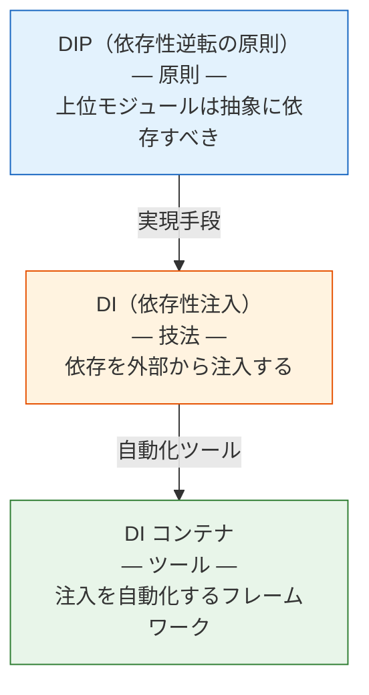
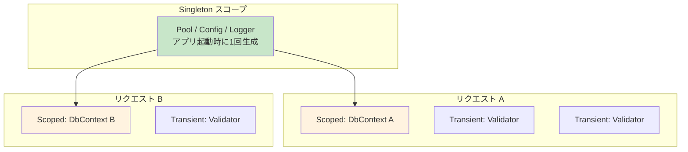

# DIコンテナ（Dependency Injection Container）

> **一言で言うと:** オブジェクトの生成と依存関係の解決を自動化するフレームワーク。[[SOLID原則]]の依存性逆転の原則（DIP）を実践的に支える仕組みで、「誰が `new` するのか」という問題を一元的に管理する。

## 概念

### DIP・DI・DIコンテナの関係

この3つは頻繁に混同されるが、それぞれ異なるレイヤーの概念。



| レベル | 概念 | 説明 |
|--------|------|------|
| 原則 | DIP（Dependency Inversion Principle） | 「具体ではなく抽象に依存せよ」という設計指針 |
| 技法 | DI（Dependency Injection） | コンストラクタ等で外部から依存を渡す実装方法 |
| ツール | DI コンテナ | 依存の解決・インスタンスの生成・生存期間の管理を自動化 |

**重要:** DI コンテナなしでも DI は実践できる。コンストラクタで依存を受け取るだけで DIP は達成される。コンテナは規模が大きくなったときの「便利な自動化ツール」に過ぎない。

### DI コンテナがない場合の問題

```typescript
// 依存の手動組み立て — アプリが大きくなると「組み立てコード」が肥大化する
const logger = new ConsoleLogger();
const config = new AppConfig();
const dbPool = new PostgresPool(config.databaseUrl);
const userRepo = new PostgresUserRepository(dbPool);
const emailService = new SmtpEmailService(config.smtpHost);
const notifier = new UserNotifier(emailService);
const userService = new UserService(userRepo, notifier, logger);
const authService = new AuthService(userRepo, config.jwtSecret, logger);
const orderRepo = new PostgresOrderRepository(dbPool);
const paymentGateway = new StripeGateway(config.stripeKey);
const orderService = new OrderService(orderRepo, paymentGateway, userService, logger);
// ... 数十行続く
```

DI コンテナは、この「依存の組み立て（Composition Root）」を宣言的に管理する。

## コード例

### TypeScript — tsyringe（軽量DIコンテナ）

```typescript
import { container, injectable, inject, singleton } from "tsyringe";

// インターフェース定義（DIP: 抽象に依存）
interface UserRepository {
  findById(id: string): Promise<User | null>;
}

interface Notifier {
  notify(userId: string, message: string): Promise<void>;
}

// 実装クラスに @injectable() を付与
@injectable()
class PostgresUserRepository implements UserRepository {
  constructor(private pool: Pool) {}

  async findById(id: string): Promise<User | null> {
    const result = await this.pool.query("SELECT * FROM users WHERE id = $1", [id]);
    return result.rows[0] ?? null;
  }
}

@injectable()
class EmailNotifier implements Notifier {
  async notify(userId: string, message: string): Promise<void> {
    // メール送信処理
  }
}

// サービス — 抽象にのみ依存
@injectable()
class UserService {
  constructor(
    @inject("UserRepository") private repo: UserRepository,
    @inject("Notifier") private notifier: Notifier,
  ) {}

  async register(data: UserInput): Promise<User> {
    const user = await this.repo.create(data);
    await this.notifier.notify(user.id, "Welcome!");
    return user;
  }
}

// Composition Root — アプリ起動時に1回だけ設定
container.register("UserRepository", { useClass: PostgresUserRepository });
container.register("Notifier", { useClass: EmailNotifier });

// コンテナが依存を自動解決してインスタンスを生成
const userService = container.resolve(UserService);
```

### PHP — Laravel のサービスコンテナ

Laravel のサービスコンテナは PHP エコシステムで最も広く使われている DI コンテナ。

```php
// app/Providers/AppServiceProvider.php
class AppServiceProvider extends ServiceProvider
{
    public function register(): void
    {
        // インターフェース → 実装のバインド
        $this->app->bind(UserRepository::class, PostgresUserRepository::class);

        // シングルトンとしてバインド（リクエスト内で1インスタンス）
        $this->app->singleton(PaymentGateway::class, function ($app) {
            return new StripeGateway(config('services.stripe.secret'));
        });
    }
}

// app/Services/OrderService.php — コンストラクタインジェクション
class OrderService
{
    public function __construct(
        private UserRepository $userRepo,    // コンテナが自動解決
        private PaymentGateway $payment,     // シングルトンインスタンス
    ) {}

    public function checkout(int $orderId): void
    {
        $user = $this->userRepo->findById(auth()->id());
        $this->payment->charge($user, $this->getTotal($orderId));
    }
}

// テスト時 — 実装を差し替え
class OrderServiceTest extends TestCase
{
    public function test_checkout(): void
    {
        // テスト用の実装をバインド
        $this->app->bind(PaymentGateway::class, FakeGateway::class);

        $service = $this->app->make(OrderService::class);
        $service->checkout(orderId: 1);

        // FakeGateway が呼ばれたことを検証
    }
}
```

### Go — DIコンテナを使わないDI（推奨パターン）

Go コミュニティでは DI コンテナよりも**手動の依存注入**が主流。コンパイル時に型安全性が保証され、依存関係が明示的になる。

```go
package main

// インターフェース定義
type UserRepository interface {
	FindByID(id string) (*User, error)
}

type Notifier interface {
	Notify(userID string, message string) error
}

// サービス — コンストラクタでDI
type UserService struct {
	repo     UserRepository
	notifier Notifier
}

func NewUserService(repo UserRepository, notifier Notifier) *UserService {
	return &UserService{repo: repo, notifier: notifier}
}

// Composition Root（main.go）— 依存を手動で組み立て
func main() {
	db := database.Connect(os.Getenv("DATABASE_URL"))
	repo := postgres.NewUserRepository(db)
	notifier := email.NewNotifier(os.Getenv("SMTP_HOST"))
	userService := NewUserService(repo, notifier)

	server := api.NewServer(userService)
	server.Start(":8080")
}
```

Go で DI コンテナを使う場合は Google の **Wire** がよく使われる。コード生成ベースのため、ランタイムのリフレクションが不要。

```go
// wire.go — Wire のプロバイダ定義（ビルド時にコード生成される）
//go:build wireinject

func InitializeUserService() *UserService {
	wire.Build(
		database.Connect,
		postgres.NewUserRepository,
		email.NewNotifier,
		NewUserService,
	)
	return nil // Wire が実装を生成する
}
```

### Python — FastAPI の Depends

```python
from fastapi import Depends, FastAPI
from sqlalchemy.orm import Session

app = FastAPI()

# 依存の定義（ファクトリ関数）
def get_db() -> Session:
    db = SessionLocal()
    try:
        yield db
    finally:
        db.close()

def get_user_repo(db: Session = Depends(get_db)) -> UserRepository:
    return PostgresUserRepository(db)

# エンドポイント — Depends() で依存を自動注入
@app.get("/users/{user_id}")
async def get_user(
    user_id: str,
    repo: UserRepository = Depends(get_user_repo),
):
    user = repo.find_by_id(user_id)
    if not user:
        raise HTTPException(status_code=404)
    return user

# テスト時 — 依存をオーバーライド
def test_get_user(client: TestClient):
    mock_repo = MockUserRepository(users=[User(id="1", name="test")])
    app.dependency_overrides[get_user_repo] = lambda: mock_repo

    response = client.get("/users/1")
    assert response.status_code == 200
```

## スコープ（生存期間）

DI コンテナの重要な機能がインスタンスの**スコープ管理**。

| スコープ | 生存期間 | 用途 | 例 |
|---------|---------|------|-----|
| Transient | 解決のたびに新規生成 | ステートレスなサービス | バリデータ、マッパー |
| Scoped | リクエスト単位で1つ | リクエスト固有の状態 | DB トランザクション、認証コンテキスト |
| Singleton | アプリ全体で1つ | 共有リソース | [[コネクションプール]]、設定、ロガー |



**注意:** Scoped なサービスが Singleton なサービスに注入される（Captive Dependency）と、リクエスト間で状態がリークする。スコープの整合性は DI コンテナの設定時に確認すること。

## よくある落とし穴

### 1. Service Locator パターンとの混同

DI コンテナを「どこからでも呼べるグローバルな取得口」として使うと、[[シングルトンパターン|シングルトン]]と同じ問題（隠れた依存関係）が発生する。

```typescript
// ❌ Service Locator — 依存がシグネチャに現れない（アンチパターン）
class UserService {
  async register(data: UserInput) {
    const repo = container.resolve<UserRepository>("UserRepository");
    // container への依存が隠れている
  }
}

// ✅ コンストラクタインジェクション — 依存が明示的
class UserService {
  constructor(private repo: UserRepository) {}
}
```

### 2. コンストラクタの引数が多すぎる

コンストラクタの引数が 5 個を超えたら、そのクラスの責務が多すぎるサイン（[[SOLID原則|SRP 違反]]）。DI コンテナが自動解決してくれるからといって、依存を増やし続けないこと。

### 3. DI コンテナへの過度な依存

DI コンテナはフレームワークの一部であり、ドメインロジックはコンテナの存在を知るべきではない。ドメイン層のクラスに `@injectable()` のようなデコレータを付ける設計は、フレームワークとドメインの結合を生む。

### 4. テストで本物のコンテナを使う

ユニットテストでは DI コンテナを介さず、テスト対象のクラスに直接モックを渡すのが最もシンプル。コンテナの設定がテストのノイズになる。

```typescript
// ✅ ユニットテストではコンテナ不要 — 直接注入
const mockRepo = { findById: vi.fn() };
const service = new UserService(mockRepo);
```

## AIによる実装のアンチパターン

| アンチパターン | なぜ問題か | 対策 |
|---|---|---|
| 全クラスを DI コンテナに登録 | DTO や値オブジェクトまでコンテナに登録する意味はない | インターフェースを持ち、差し替え可能性が必要なクラスのみ登録 |
| テストコードでもコンテナを使う | テストが DI 設定に依存し、壊れやすく遅くなる | ユニットテストでは手動で `new` してモックを渡す |
| 各メソッド内で `container.resolve()` を呼ぶ | Service Locator アンチパターン。依存が隠れる | コンストラクタインジェクションに統一 |

## 関連トピック

- [[SOLID原則]] — DIP を実践的に支える仕組みとしての DI コンテナ。SRP 違反のシグナル（引数過多）を検出する観点としても
- [[シングルトンパターン]] — DI コンテナの Singleton スコープで代替すべき
- [[ポリモーフィズムとストラテジーパターン]] — DI コンテナはストラテジーの選択と注入を管理する
- [[テスト戦略]] — DI によるモック注入がユニットテストの前提条件
- [[コネクションプール]] — Singleton スコープで管理される典型的な依存

## 参考リソース

- *Dependency Injection: Principles, Practices, and Patterns* — Mark Seemann（DI とコンテナの決定版。.NET 中心だが原則は言語非依存）
- [Laravel - Service Container](https://laravel.com/docs/container) — PHP で最も普及した DI コンテナの公式ドキュメント
- [Google Wire](https://github.com/google/wire) — Go のコンパイル時 DI コード生成ツール
- [FastAPI - Dependencies](https://fastapi.tiangolo.com/tutorial/dependencies/) — Python の関数ベース DI の実例
