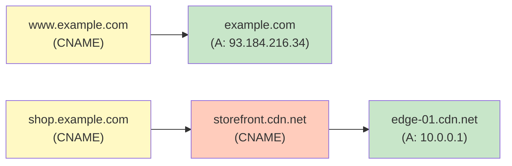
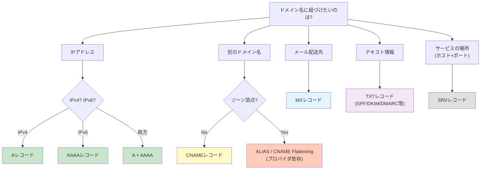

# DNSレコードタイプ（DNS Resource Record Types）

> **一言で言うと:** DNSレコードタイプは、ドメイン名に紐づく情報の「種類」を定義する仕組み。Aレコード（IPアドレス）だけでなく、メール配送先、別名、セキュリティポリシーなど多様な情報をドメイン名に結びつける。

## リソースレコードの構造

DNSの応答に含まれる1件のデータを**リソースレコード（Resource Record / RR）**と呼ぶ。すべてのレコードタイプは共通の構造を持っている。

```
example.com.    3600    IN    A    93.184.216.34
├─ Name         ├─ TTL  ├─ Class ├─ Type ├─ RDATA（値）
```

| フィールド | 意味 |
|-----------|------|
| **Name** | レコードが属するドメイン名 |
| **TTL** | キャッシュの有効期間（秒） |
| **Class** | ほぼ常に `IN`（Internet）。歴史的に `CH`（Chaos）等もあるが現役ではない |
| **Type** | レコードの種類（A, AAAA, CNAME, MX 等） |
| **RDATA** | レコードタイプに応じた実データ |

## 主要なレコードタイプ

### A / AAAA — IPアドレスへのマッピング

最も基本的なレコード。ドメイン名をIPアドレスに変換する。

| レコード | プロトコル | RDATA | 例 |
|---------|-----------|-------|-----|
| **A** | IPv4 | 32ビットアドレス | `example.com → 93.184.216.34` |
| **AAAA** | IPv6 | 128ビットアドレス | `example.com → 2606:2800:220:1::` |

- 1つのドメインに複数のA/AAAAレコードを設定可能 → **DNSラウンドロビン**（リゾルバが返す順序を回転させ、簡易的な負荷分散）
- A と AAAA を両方設定すると、クライアントは**Happy Eyeballs**（RFC 8305）アルゴリズムでIPv4/IPv6を同時に試行し、速い方を採用する

```bash
# Aレコードの問い合わせ
dig example.com A +short
# 93.184.216.34

# AAAAレコードの問い合わせ
dig example.com AAAA +short
# 2606:2800:220:1::
```

### CNAME — ドメインの別名

**CNAME（Canonical Name）**は、あるドメイン名を別のドメイン名のエイリアス（別名）として定義する。

```
www.example.com.   3600  IN  CNAME  example.com.
```

この場合、`www.example.com` のIPアドレスを知りたいリゾルバは、まず CNAME を解決して `example.com` を得て、次にそのAレコードを引く。

**重要な制約:**

- **ゾーン頂点（Zone Apex）には設定できない** — `example.com` 自体にCNAMEは設定不可。RFC 1034 の規定により、CNAMEが存在するドメイン名には他のレコードタイプを共存させられないが、ゾーン頂点にはSOAとNSが必須であるため矛盾する
- **CNAMEチェーンは避ける** — `a → b → c → d` のようにCNAMEが連鎖すると、各段階でDNS問い合わせが必要になり解決時間が増大する



**ゾーン頂点の代替手段:**

CDN やロードバランサを使う場合、ゾーン頂点にCNAME相当の設定が必要になることがある。主要なDNSプロバイダは独自の解決策を提供している:

| プロバイダ | 機能名 | 仕組み |
|-----------|--------|--------|
| AWS Route 53 | ALIAS レコード | 内部的にIPを解決して返す |
| Cloudflare | CNAME Flattening | CNAME先のAレコードを直接返す |
| DNSimple | ALIAS レコード | Route 53と同様 |

### MX — メール配送先

**MX（Mail Exchanger）**レコードは、そのドメイン宛のメールをどのサーバーに配送するかを指定する。

```
example.com.  3600  IN  MX  10 mail1.example.com.
example.com.  3600  IN  MX  20 mail2.example.com.
```

- **優先度（Preference）**: 数値が**小さいほど優先度が高い**。上の例では `mail1` が優先的に使われ、到達不能な場合に `mail2` にフォールバックする
- MXレコードの値はIPアドレスではなく**ドメイン名**でなければならない（そのドメイン名にAレコードが必要）
- MXにCNAMEを指定するのはRFC違反（RFC 2181）で、メール配送が失敗する原因になる

### NS — 権威ネームサーバーの委任

**NS（Name Server）**レコードは、あるゾーンの権威ネームサーバーを指定する。DNSの階層構造における「委任（Delegation）」の仕組みそのもの。

```
example.com.  86400  IN  NS  ns1.example.com.
example.com.  86400  IN  NS  ns2.example.com.
```

- 冗長性のために最低2つのNSレコードが推奨される
- 異なるネットワークに配置することで、ネットワーク障害時の可用性を確保する
- NSレコードが指すドメイン名がゾーン内にある場合、対応するAレコード（**グルーレコード / Glue Record**）が必要。なければ「`ns1.example.com` のIPを知るために `example.com` のNSに聞くが、そのNSが `ns1.example.com` で...」という循環参照に陥る

### TXT — テキスト情報

**TXT**レコードは任意のテキストデータを格納できる汎用レコード。現在では主にセキュリティ・認証目的で使われる。

| 用途 | 内容の例 |
|------|---------|
| **SPF（メール送信元認証）** | `v=spf1 include:_spf.google.com ~all` |
| **DKIM（メール署名検証）** | 公開鍵データ |
| **DMARC（メール認証ポリシー）** | `v=DMARC1; p=reject; rua=mailto:...` |
| **ドメイン所有権の検証** | `google-site-verification=...` |
| **SSL証明書のドメイン検証** | `_acme-challenge.example.com` |

```bash
# SPFレコードの確認
dig example.com TXT +short
# "v=spf1 -all"
```

### SOA — ゾーンの管理情報

**SOA（Start of Authority）**レコードは、ゾーンの管理に関するメタ情報を格納する。すべてのゾーンに1つだけ存在する。

```
example.com.  86400  IN  SOA  ns1.example.com. admin.example.com. (
    2024032801  ; シリアル番号（変更のたびに増加）
    3600        ; リフレッシュ間隔（セカンダリがプライマリに問い合わせる頻度）
    900         ; リトライ間隔（リフレッシュ失敗時の再試行間隔）
    604800      ; 有効期限（セカンダリがプライマリに到達できない場合の応答停止までの時間）
    86400       ; ネガティブキャッシュTTL（「存在しない」という応答のキャッシュ期間）
)
```

- **シリアル番号**: 慣例として `YYYYMMDDNN` 形式（日付+連番）を使うことが多い
- **ネガティブキャッシュTTL**: 「このドメインは存在しない」という NXDOMAIN 応答のキャッシュ期間。短すぎると不在ドメインへの問い合わせが権威サーバーに集中する

### SRV — サービスの場所

**SRV（Service）**レコードは、特定のサービスを提供するホストとポート番号を指定する。

```
_http._tcp.example.com.  3600  IN  SRV  10 60 8080 web1.example.com.
                                         ↑   ↑   ↑    ↑
                                       優先度 重み ポート ホスト
```

- **Kubernetesの内部DNS**はSRVレコードを使ってサービスディスカバリを実現している
- 形式: `_サービス名._プロトコル.ドメイン`

### PTR — 逆引きDNS

**PTR（Pointer）**レコードはIPアドレスからドメイン名を引く**逆引き**に使われる。

```bash
# 逆引きDNS
dig -x 8.8.8.8 +short
# dns.google.
```

- IPv4の逆引きは `in-addr.arpa` ゾーン、IPv6は `ip6.arpa` ゾーンで管理される
- IPアドレスのオクテットを**逆順**にして `.in-addr.arpa` を付ける: `8.8.8.8` → `8.8.8.8.in-addr.arpa`
- メールサーバーのスパム対策で重要 — 送信元IPの逆引きが設定されていないとスパム判定されやすい

### CAA — 証明書発行制限

**CAA（Certification Authority Authorization）**レコードは、そのドメインのSSL/TLS証明書を発行してよい認証局（CA）を制限する。

```
example.com.  3600  IN  CAA  0 issue "letsencrypt.org"
example.com.  3600  IN  CAA  0 issuewild ";"           # ワイルドカード証明書の発行を禁止
example.com.  3600  IN  CAA  0 iodef "mailto:sec@example.com"  # 違反時の通知先
```

- 2017年以降、CAは証明書発行前にCAAレコードを確認することが義務付けられている
- [[TLS-SSL]] のセキュリティ強化に直結する

## レコードの使い分け — 判断フロー



## よくある落とし穴

### 1. ゾーン頂点にCNAMEを設定してメールが届かなくなる

ゾーン頂点にCNAMEを設定すると、MX・TXTなどの他のレコードが参照できなくなる。結果としてメール配送やSPF検証が壊れる。

### 2. MXレコードにIPアドレスやCNAMEを書く

MXのRDATAはドメイン名でなければならない。IPアドレスを直接書いたり、CNAME先のドメイン名を書いたりすると、一部のメールサーバーが配送に失敗する。

### 3. TTLの変更が「すぐ効く」と思って移行作業を始める

TTLを短くしたレコードの変更自体も、旧TTL期間のキャッシュが残っている。TTL変更は**事前に**行い、旧TTLの期間が経過してから本番の変更を行う必要がある。

### 4. ネガティブキャッシュを忘れる

存在しないサブドメインに問い合わせた後、そのサブドメインのレコードを追加しても、SOAのネガティブキャッシュTTL期間中はNXDOMAINが返り続ける。

## digコマンドによるレコード確認

```bash
# 特定のレコードタイプを問い合わせ
dig example.com A        # Aレコード
dig example.com AAAA     # AAAAレコード
dig example.com MX       # MXレコード
dig example.com NS       # NSレコード
dig example.com TXT      # TXTレコード
dig example.com SOA      # SOAレコード
dig example.com CAA      # CAAレコード

# すべてのレコードタイプを問い合わせ
dig example.com ANY      # ただし一部のDNSサーバーはANYクエリを制限している

# 短縮出力（RDATAのみ）
dig example.com A +short

# 権威サーバーに直接問い合わせ（キャッシュを迂回）
dig @ns1.example.com example.com A +norecurse
```

## 関連トピック

- [[DNS]] — 親トピック。名前解決の全体像とDNS設計のベストプラクティス
- [[TLS-SSL]] — CAAレコードによる証明書発行制限、DNS-01チャレンジ
- [[TCP-IP]] — DNS問い合わせのトランスポート（UDP/TCP）
- [[HTTP-HTTPS]] — CNAME/ALIASを使ったCDN連携
