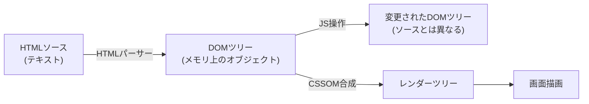
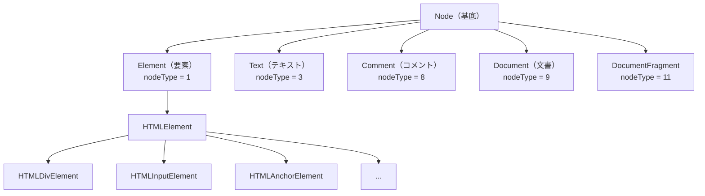
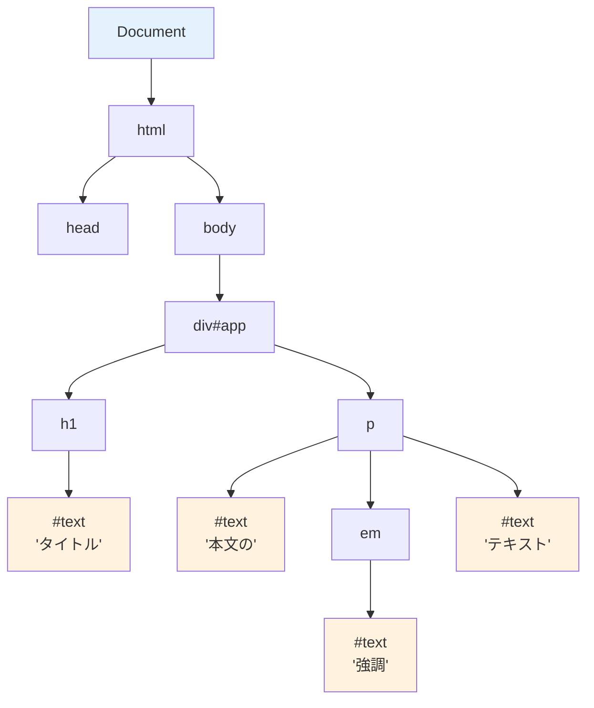
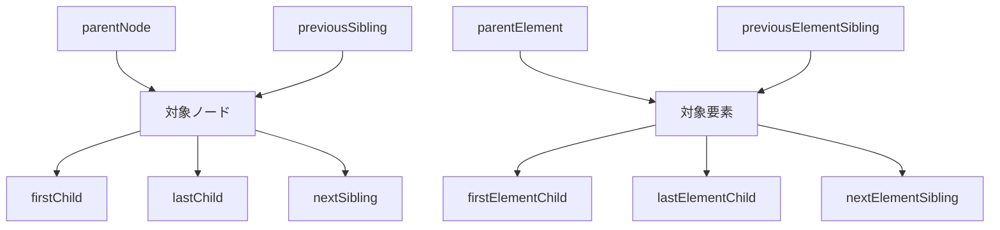
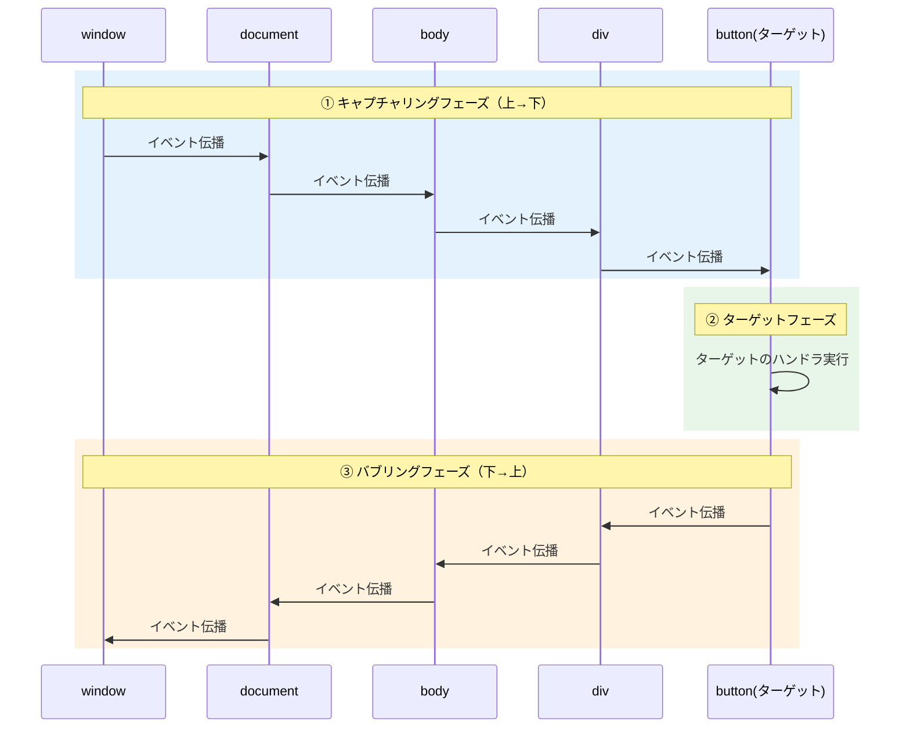
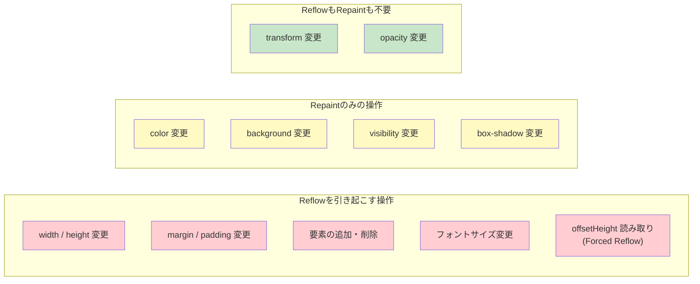

# DOMツリーとノード（DOM Tree & Nodes）

> **一言で言うと:** DOM（Document Object Model）はHTMLを**ツリー構造のオブジェクト**としてメモリ上に表現したもの。HTMLの「ソースコード」ではなく、ブラウザが構築した「生きたデータ構造」であり、JavaScriptからの読み書き、イベント処理、CSSOMとの合成など、ブラウザの全機能の中心にある。

## DOMとは何か

DOMはW3Cが定義する**言語非依存のAPI仕様**であり、文書をノード（Node）の木構造として表現する。ブラウザがHTMLを受け取ると、パーサーがHTMLをトークン化し、ノードを生成し、DOMツリーを構築する。

重要な点: **DOMとHTMLソースは同一ではない**。



HTMLソースとDOMが異なる具体的な場面:

| 状況 | HTMLソース | DOM |
|------|----------|-----|
| `<table>` に `<tbody>` がない | `<table><tr>...</tr></table>` | `<tbody>` が自動挿入される |
| タグの閉じ忘れ | `<p>段落1<p>段落2` | パーサーが `</p>` を補完 |
| JSでDOMを変更 | 変化しない | 変更が反映される |
| `display: none` の要素 | 存在する | DOMには存在する（レンダーツリーには含まれない） |

## ノードの種類

DOMツリーは**ノード（Node）**で構成される。全てのノードは `Node` インターフェースを継承し、`nodeType` プロパティで種類を識別する:



### DOMツリーの実例

```html
<div id="app">
  <h1>タイトル</h1>
  <p>本文の<em>強調</em>テキスト</p>
</div>
```

このHTMLから構築されるDOMツリー:



**注目:** テキストもノードである。`<p>本文の<em>強調</em>テキスト</p>` は `p` 要素の下に3つの子ノード（テキスト、em要素、テキスト）を持つ。この構造の理解なしに `textContent` と `innerHTML` の違いは分からない。

## ノードの走査と検索

### 検索API

| メソッド | 戻り値 | 用途 |
|---------|--------|------|
| `getElementById(id)` | 単一Element | IDで一意に検索（最速） |
| `querySelector(sel)` | 単一Element | CSSセレクタで最初の一致を返す |
| `querySelectorAll(sel)` | 静的NodeList | CSSセレクタで全一致を返す |
| `getElementsByClassName(cls)` | ライブHTMLCollection | クラス名で検索（DOMの変更が反映される） |
| `getElementsByTagName(tag)` | ライブHTMLCollection | タグ名で検索 |
| `closest(sel)` | 単一Element | 祖先方向にCSSセレクタで検索 |

**ライブコレクション vs 静的コレクション** — `getElementsBy*` が返すHTMLCollectionはDOMの変更に追従する（ライブ）。`querySelectorAll` が返すNodeListは取得時のスナップショット（静的）。ライブコレクションをループ中にDOMを変更すると無限ループに陥る危険がある。

### 走査プロパティ



`childNodes` は全種類のノード（テキスト、コメント含む）、`children` は要素ノードのみを返す。

## イベントとイベント伝播

DOMのイベントモデルは**キャプチャリング→ターゲット→バブリング**の3フェーズで伝播する:



このバブリングの仕組みが**イベントデリゲーション**を可能にする。個々の子要素にリスナーを付けるのではなく、親要素で一括捕捉する:

```javascript
// イベントデリゲーション — 親要素で子要素のイベントを処理
document.querySelector('.list').addEventListener('click', (e) => {
  const item = e.target.closest('.item');
  if (!item) return;
  // 動的に追加された要素のイベントも自動的に捕捉される
  console.log('クリックされたアイテム:', item.dataset.id);
});
```

## コード例

### TypeScript — DOMの構造とノード操作

```typescript
// DOMツリーの構造を視覚化する
function inspectDOM(node: Node, depth = 0): void {
  const indent = '  '.repeat(depth);
  const nodeInfo = (() => {
    switch (node.nodeType) {
      case Node.ELEMENT_NODE: {
        const el = node as Element;
        const id = el.id ? `#${el.id}` : '';
        const cls = el.className ? `.${el.className.replace(/ /g, '.')}` : '';
        return `<${el.tagName.toLowerCase()}${id}${cls}>`;
      }
      case Node.TEXT_NODE: {
        const text = node.textContent?.trim();
        return text ? `"${text}"` : null; // 空白のみのテキストノードは除外
      }
      case Node.COMMENT_NODE:
        return `<!-- ${node.textContent} -->`;
      default:
        return `[nodeType=${node.nodeType}]`;
    }
  })();

  if (nodeInfo) {
    console.log(`${indent}${nodeInfo}`);
  }

  node.childNodes.forEach(child => inspectDOM(child, depth + 1));
}

// DOMの変更とHTMLソースの違いを確認
const div = document.createElement('div');
div.innerHTML = '<p>段落1<p>段落2';  // 意図的に閉じタグなし

console.log('innerHTML:', div.innerHTML);
// <p>段落1</p><p>段落2</p>  ← パーサーが補完

console.log('子要素数:', div.children.length);  // 2（p要素が2つ）

// textContent vs innerHTML の違い
const el = document.createElement('div');
el.innerHTML = '<p>Hello <strong>World</strong></p>';

console.log('textContent:', el.textContent);   // "Hello World"（タグ除去）
console.log('innerHTML:', el.innerHTML);        // "<p>Hello <strong>World</strong></p>"
console.log('innerText:', el.innerText);        // "Hello World"（CSSの表示状態を考慮）
```

### TypeScript — DocumentFragmentによる効率的なDOM操作

```typescript
// ❌ 非効率: 1000回のDOM操作
function addItemsSlow(container: HTMLElement, items: string[]): void {
  items.forEach(item => {
    const li = document.createElement('li');
    li.textContent = item;
    container.appendChild(li);  // 毎回DOMに挿入 → Reflowの可能性
  });
}

// ✅ 効率的: DocumentFragmentでバッチ化
function addItemsFast(container: HTMLElement, items: string[]): void {
  const fragment = document.createDocumentFragment();

  items.forEach(item => {
    const li = document.createElement('li');
    li.textContent = item;
    fragment.appendChild(li);  // メモリ上の仮のコンテナに追加
  });

  container.appendChild(fragment);  // 1回のDOM操作で全て挿入
}

// パフォーマンス比較
const list = document.getElementById('list')!;
const items = Array.from({ length: 1000 }, (_, i) => `アイテム ${i + 1}`);

console.time('slow');
addItemsSlow(list, items);
console.timeEnd('slow');

list.innerHTML = '';

console.time('fast');
addItemsFast(list, items);
console.timeEnd('fast');
```

### Python — サーバーサイドでのDOM操作（BeautifulSoup / lxml）

```python
from html.parser import HTMLParser

# ブラウザのDOMツリー構築を簡易的に再現
class SimpleDOM:
    """DOMツリーのノード"""

    def __init__(self, tag: str, parent: "SimpleDOM | None" = None):
        self.tag = tag
        self.children: list["SimpleDOM | str"] = []
        self.parent = parent

    def add_child(self, child: "SimpleDOM | str") -> None:
        self.children.append(child)

    def query_by_tag(self, tag: str) -> list["SimpleDOM"]:
        """再帰的にタグ名で検索（querySelectorの簡易版）"""
        results: list[SimpleDOM] = []
        for child in self.children:
            if isinstance(child, SimpleDOM):
                if child.tag == tag:
                    results.append(child)
                results.extend(child.query_by_tag(tag))
        return results

    def text_content(self) -> str:
        """textContentの再現（全子孫のテキストを連結）"""
        parts: list[str] = []
        for child in self.children:
            if isinstance(child, str):
                parts.append(child)
            else:
                parts.append(child.text_content())
        return "".join(parts)

    def __repr__(self) -> str:
        return f"<{self.tag}>"


# HTMLパーサーでDOMツリーを構築
class DOMBuilder(HTMLParser):
    def __init__(self):
        super().__init__()
        self.root = SimpleDOM("document")
        self.current = self.root

    def handle_starttag(self, tag: str, attrs: list) -> None:
        node = SimpleDOM(tag, parent=self.current)
        self.current.add_child(node)
        # void要素（br, img等）は自動閉じ
        if tag not in ("br", "img", "input", "hr", "meta", "link"):
            self.current = node

    def handle_endtag(self, tag: str) -> None:
        if self.current.parent:
            self.current = self.current.parent

    def handle_data(self, data: str) -> None:
        text = data.strip()
        if text:
            self.current.add_child(text)


html = "<div><h1>タイトル</h1><p>本文の<em>強調</em>テキスト</p></div>"

builder = DOMBuilder()
builder.feed(html)

# DOMツリーの操作
div = builder.root.children[0]
print(f"ルート要素: {div}")                      # <div>
print(f"テキスト内容: {div.text_content()}")       # タイトル本文の強調テキスト
print(f"em要素: {div.query_by_tag('em')}")        # [<em>]
print(f"em内テキスト: {div.query_by_tag('em')[0].text_content()}")  # 強調
```

## ReflowとRepaint — DOMの変更コスト

DOMの変更が画面に反映されるまでに、ブラウザは2種類のコストの高い処理を行う:

| 処理 | トリガー | コスト |
|------|---------|--------|
| **Reflow（Layout）** | 要素のサイズ・位置が変わる操作 | 高い（子孫・兄弟にも波及） |
| **Repaint** | 色・影など見た目だけが変わる操作 | 中程度（レイアウト再計算不要） |



**`transform` と `opacity` は GPU（コンポジターレイヤー）で処理されるため、ReflowもRepaintも発生しない。** アニメーションにはこの2つを優先的に使うべき理由がここにある。

## よくある落とし穴

### 1. Layout Thrashing（レイアウトスラッシング）

レイアウト情報の「読み取り」と「書き込み」を交互に行うと、ブラウザがバッチ処理を放棄して毎回Reflowを実行する:

```javascript
// ❌ Layout Thrashing — 読み書きが交互
items.forEach(item => {
  const height = item.offsetHeight;     // 読み取り → Reflow強制
  item.style.height = height * 2 + 'px'; // 書き込み → 次の読み取りでReflow
});

// ✅ 読み取りを先にまとめ、書き込みを後にまとめる
const heights = items.map(item => item.offsetHeight);  // 読み取りをバッチ化
items.forEach((item, i) => {
  item.style.height = heights[i] * 2 + 'px';           // 書き込みをバッチ化
});
```

### 2. ライブコレクションのループ中にDOM変更

```javascript
// ❌ 無限ループの危険
const divs = document.getElementsByTagName('div'); // ライブコレクション
for (let i = 0; i < divs.length; i++) {
  const newDiv = document.createElement('div');
  document.body.appendChild(newDiv);  // divs.lengthが増え続ける!
}

// ✅ 静的コレクションを使う
const divs = document.querySelectorAll('div');  // 静的NodeList
divs.forEach(div => {
  const newDiv = document.createElement('div');
  document.body.appendChild(newDiv);  // 安全
});
```

### 3. `innerHTML` による既存ノードの破壊

`innerHTML` を上書きすると、子要素に付いていたイベントリスナーやフォームの入力状態が全て失われる:

```javascript
// ❌ 既存のリスナーが全て消える
list.innerHTML += '<li>新しいアイテム</li>';
// += は内部的に: list.innerHTML = list.innerHTML + '...'
// → 全子要素が破棄されて再構築される

// ✅ insertAdjacentHTMLで追加
list.insertAdjacentHTML('beforeend', '<li>新しいアイテム</li>');
// → 既存の子要素はそのまま、末尾に追加される
```

### 4. `textContent` と `innerText` の混同

```javascript
const el = document.createElement('div');
el.innerHTML = 'Hello <span style="display:none">Hidden</span> World';

console.log(el.textContent); // "Hello Hidden World" — DOMの全テキスト（CSSを無視）
console.log(el.innerText);   // "Hello  World"       — 画面に見えるテキスト（CSSを考慮）
// innerTextはReflowを引き起こすため、パフォーマンスコストが高い
```

## 関連トピック

- [[DOMと仮想DOM]] — 親トピック。仮想DOMによるDOM操作の抽象化
- [[HTML-CSS-JS]] — HTMLがDOMの元になるマークアップ。CSSOMとの合成でレンダーツリーを構築
- [[マークアップ言語とHTML]] — HTMLのパースルール（エラー回復）がDOMの構造に影響する

## 参考リソース

- [MDN: Document Object Model](https://developer.mozilla.org/ja/docs/Web/API/Document_Object_Model) — DOM APIの網羅的なリファレンス
- [What, exactly, is the DOM?](https://bitsofco.de/what-exactly-is-the-dom/) — DOMとHTMLソースの違いをわかりやすく解説
- [Avoid large, complex layouts and layout thrashing (web.dev)](https://web.dev/articles/avoid-large-complex-layouts-and-layout-thrashing) — Layout Thrashingの解説と対策
