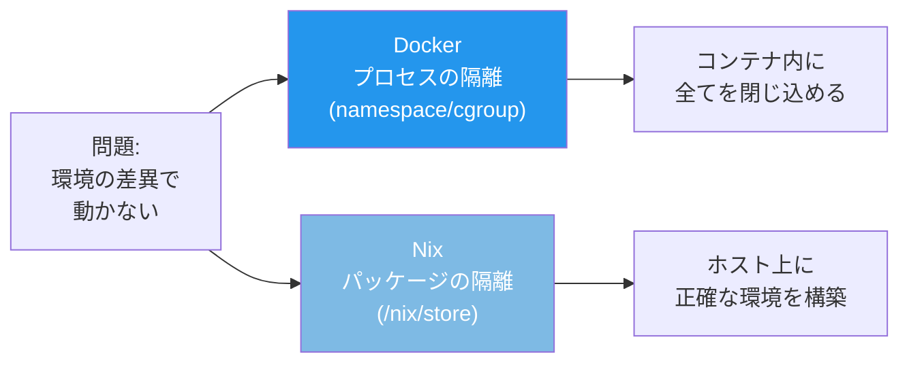

# DockerとNix Flakeによる開発環境管理

> **一言で言うと:** Dockerは「プロセスの隔離」で環境を再現し、Nix Flakeは「パッケージの純粋関数的なビルド」で環境を再現する。両者は競合ではなく補完関係にあり、開発環境にはNix、本番デプロイにはDockerという使い分け、あるいはNixでDockerイメージを生成するという併用が実務では有効。

## Nix / Nix Flakeとは何か

### Nix — 純粋関数型パッケージマネージャー

Nix（ニックス）は「パッケージのビルドとインストールを純粋関数として扱う」パッケージマネージャー。通常のパッケージマネージャー（apt, brew, npmなど）はシステムのグローバル状態を変更するが、Nixは全てのパッケージを `/nix/store/` 配下にハッシュ付きで隔離して格納する。

```
従来のパッケージマネージャー:
/usr/bin/node → Node.js 20（グローバルに1つだけ）

Nix:
/nix/store/abc123...-nodejs-20.11.1/bin/node
/nix/store/def456...-nodejs-18.19.0/bin/node
→ 複数バージョンが衝突なく共存
```

**核心的な特徴:**
- **再現性（Reproducibility）** — 同じ入力（ソースコード + 依存定義）からは常に同じ出力（バイナリ）が生成される
- **宣言的（Declarative）** — 「何が必要か」を記述すれば、Nixが依存解決からビルドまで行う
- **アトミックな変更** — パッケージのインストール/アンインストールが途中で失敗しても、システムは壊れない。ロールバックも可能

### Flake — Nixプロジェクトの標準インターフェース

`flake.nix` はNixプロジェクトの入口ファイル。従来のNixは設定がチャネル（channel）やグローバル状態に依存しており再現性に課題があったが、Flakeはこれを解決する。

```nix
# flake.nix の基本構造
{
  description = "My web application";

  # inputs: 依存するNixパッケージのソース（ロックファイルで固定）
  inputs = {
    nixpkgs.url = "github:NixOS/nixpkgs/nixos-24.05";
    flake-utils.url = "github:numtide/flake-utils";
  };

  # outputs: この Flake が提供するもの
  outputs = { self, nixpkgs, flake-utils }:
    flake-utils.lib.eachDefaultSystem (system:
      let
        pkgs = nixpkgs.legacyPackages.${system};
      in {
        # 開発シェル: nix develop で起動
        devShells.default = pkgs.mkShell {
          packages = [
            pkgs.nodejs_20
            pkgs.pnpm
            pkgs.postgresql_16
            pkgs.redis
          ];

          shellHook = ''
            echo "開発環境が準備されました"
            echo "Node.js: $(node --version)"
          '';
        };
      }
    );
}
```

`flake.lock` が自動生成され、全ての依存を正確なリビジョン（gitコミットハッシュ）で固定する。これにより「半年後に同じ `nix develop` を実行しても同一の環境が再現される」ことが保証される。

## Dockerとの比較

### 解決する問題は同じ、アプローチが違う



| 観点 | Docker | Nix Flake |
|------|--------|-----------|
| 隔離の単位 | プロセス（Linux namespace） | パッケージ（/nix/store のハッシュパス） |
| 再現性の仕組み | Dockerfileのレイヤーキャッシュ | flake.lockによる完全な依存固定 |
| ホストOSとの関係 | 隔離される（Linuxカーネル上で動作） | ホスト上に直接ツールが入る |
| 開発体験 | コンテナ内で作業（ファイル同期・IDEの設定が必要） | ホストのシェルでそのまま作業 |
| ビルドの再現性 | Dockerfileの `RUN apt-get` は実行タイミングで結果が変わりうる | 純粋関数 — 入力が同じなら出力も同じ |
| クロスプラットフォーム | Linux前提（macOS/WindowsはVM経由） | Linux / macOS ネイティブ対応 |
| 本番デプロイ | そのまま本番で動く | 別途デプロイの仕組みが必要 |
| 学習コスト | 低〜中 | 高（Nix言語の習得が必要） |

### 具体的な違い：開発環境の構築

**Docker Compose での開発環境:**

```yaml
# docker-compose.yml
services:
  app:
    build: .
    volumes:
      - .:/app          # ソースコードの同期
      - node_modules:/app/node_modules
    ports:
      - "3000:3000"
    command: npm run dev

  db:
    image: postgres:16
    volumes:
      - db-data:/var/lib/postgresql/data

volumes:
  node_modules:
  db-data:
```

課題:
- ファイルの変更がコンテナに反映されるまでのラグ（特にmacOS）
- IDEの補完・型チェックがコンテナ内のパッケージを参照できない場合がある
- `node_modules` のボリュームマウントによるパフォーマンス問題

**Nix Flake での開発環境:**

```nix
# flake.nix
{
  inputs = {
    nixpkgs.url = "github:NixOS/nixpkgs/nixos-24.05";
    flake-utils.url = "github:numtide/flake-utils";
  };

  outputs = { self, nixpkgs, flake-utils }:
    flake-utils.lib.eachDefaultSystem (system:
      let pkgs = nixpkgs.legacyPackages.${system}; in {
        devShells.default = pkgs.mkShell {
          packages = [
            pkgs.nodejs_20
            pkgs.pnpm
            pkgs.postgresql_16
            pkgs.redis
          ];

          # シェル起動時に自動的にサービスを開始
          shellHook = ''
            export PGDATA="$PWD/.pgdata"
            if [ ! -d "$PGDATA" ]; then
              initdb --no-locale --encoding=UTF8
            fi
            pg_ctl start -l "$PWD/.pglog" || true
          '';
        };
      }
    );
}
```

```bash
# これだけで Node.js 20 + pnpm + PostgreSQL 16 + Redis が使える
nix develop

# ホストのシェルで直接作業 — IDE の補完も完全に動く
pnpm install
pnpm dev
```

利点:
- ホスト上で直接動くため、ファイル同期のラグがゼロ
- IDEがツールやパッケージを直接参照できる
- コンテナのオーバーヘッドがない

## 併用パターン

DockerとNixは排他的ではない。それぞれの強みを活かした併用が最も実践的。

### パターン1: 開発はNix、本番はDocker


最も一般的な併用パターン。開発者はNixでホスト上に快適な環境を構築し、デプロイ時にはDockerイメージとして本番に出す。

```nix
# flake.nix — 開発環境 + Docker イメージ生成
{
  inputs = {
    nixpkgs.url = "github:NixOS/nixpkgs/nixos-24.05";
    flake-utils.url = "github:numtide/flake-utils";
  };

  outputs = { self, nixpkgs, flake-utils }:
    flake-utils.lib.eachDefaultSystem (system:
      let pkgs = nixpkgs.legacyPackages.${system}; in {

        # 開発シェル
        devShells.default = pkgs.mkShell {
          packages = [ pkgs.nodejs_20 pkgs.pnpm ];
        };

        # Docker イメージを Nix で生成
        packages.dockerImage = pkgs.dockerTools.buildLayeredImage {
          name = "myapp";
          tag = "latest";
          contents = [
            pkgs.nodejs_20
            self.packages.${system}.default  # ビルド済みアプリ
          ];
          config = {
            Cmd = [ "node" "dist/server.js" ];
            ExposedPorts."3000/tcp" = {};
          };
        };
      }
    );
}
```

```bash
# Nix で Docker イメージを生成（Dockerfile 不要）
nix build .#dockerImage
docker load < result
docker run -p 3000:3000 myapp:latest
```

### パターン2: devcontainer + Nix

VS Code の Dev Containers 内でNixを使うパターン。チーム全体の環境を統一しつつ、Nixの再現性を活用する。具体的な構成例は [[devcontainerとNixでレガシー環境を再現する]] を参照。

```json
// .devcontainer/devcontainer.json
{
  "image": "nixos/nix:latest",
  "postCreateCommand": "nix develop --command bash -c 'echo ready'",
  "customizations": {
    "vscode": {
      "extensions": ["jnoortheen.nix-ide"]
    }
  }
}
```

### パターン3: NixでDockerイメージを生成（Dockerfile不要）

`pkgs.dockerTools` を使うと、Dockerfileを書かずにNixの宣言的な記述でDockerイメージを生成できる。Nixのビルドシステムが依存関係を正確に把握しているため、最小限の内容だけがイメージに含まれる。

```nix
# 最小限の Node.js イメージ（apt も bash も入らない）
pkgs.dockerTools.buildLayeredImage {
  name = "myapp";
  tag = "v1.0.0";

  # レイヤーを分離してキャッシュ効率を上げる
  contents = [
    pkgs.nodejs_20-slim
    myAppPackage
  ];

  # 非root ユーザーで実行
  fakeRootCommands = ''
    mkdir -p /tmp
    chmod 1777 /tmp
  '';

  config = {
    Cmd = [ "${pkgs.nodejs_20}/bin/node" "dist/server.js" ];
    User = "1000:1000";
    ExposedPorts."3000/tcp" = {};
    Env = [ "NODE_ENV=production" ];
  };
}
```

**Dockerfile vs Nix dockerTools:**

| 観点 | Dockerfile | Nix dockerTools |
|------|-----------|-----------------|
| ベースイメージ | `FROM node:20-slim`（中身は不透明） | 必要なパッケージだけを明示的に含める |
| イメージサイズ | slimでも100MB以上 | 必要最小限（数十MB程度も可能） |
| ビルドの再現性 | `apt-get` の結果が時期で変わりうる | 完全に再現可能 |
| 脆弱性スキャン | ベースイメージに含まれる不要パッケージも対象 | 含まれるパッケージが明確で監査しやすい |
| 学習コスト | 低い | 高い（Nix言語の理解が必要） |

## 関連ツール: direnv との組み合わせ

`direnv` + `nix-direnv` を使うと、プロジェクトディレクトリに `cd` するだけで自動的にNix開発環境が有効化される。

```bash
# .envrc（プロジェクトルートに配置）
use flake
```

```bash
# 使用イメージ
$ cd ~/work/my-project
direnv: loading .envrc
direnv: using flake

$ node --version
v20.11.1          # このプロジェクト用の Node.js

$ cd ~/work/other-project
direnv: loading .envrc

$ node --version
v18.19.0          # 別プロジェクトでは別バージョン
```

これにより、Docker の `docker compose exec` に相当する「プロジェクト固有の環境に入る」操作が、ディレクトリの移動だけで完結する。

## よくある落とし穴

### 1. NixをDockerの「代替」と捉える

NixとDockerは異なるレイヤーの問題を解決する。Nixは「正確な依存関係の管理」に優れるが、プロセスの隔離やネットワーク名前空間の分離は提供しない。本番環境での実行隔離にはDockerが依然として必要。

### 2. Nix言語の学習コストを過小評価する

Nix言語は関数型言語であり、遅延評価やアトリビュートセット（attribute set）など独自の概念がある。チーム全員がNixを学ぶコストは小さくない。`devenv` や `flox` などのラッパーツールで学習曲線を緩和できる。

### 3. macOS と Linux で動作が異なるケースがある

Nixはクロスプラットフォーム対応だが、Linuxバイナリをネイティブにビルドする。macOSでは一部のパッケージでビルド失敗やパッチ適用が必要になることがある。CI（通常Linux）との差異に注意。

### 4. flake.lock を更新せずに放置する

`flake.lock` はセキュリティパッチも含めて依存を固定する。定期的に `nix flake update` でロックファイルを更新し、脆弱性のあるパッケージを最新化する必要がある。

## 参考リソース

- [Nix公式マニュアル — Flakes](https://nix.dev/concepts/flakes)
- [devenv — Nixベースの開発環境マネージャー](https://devenv.sh/) — flake.nixの複雑さを隠蔽するラッパー
- [nix-direnv](https://github.com/nix-community/nix-direnv) — direnvとNix Flakeの統合
- [dockerTools — NixでDockerイメージを生成](https://nixos.org/manual/nixpkgs/stable/#sec-pkgs-dockerTools)
- [Determinate Systems — Zero to Nix](https://zero-to-nix.com/) — Nix入門ガイド
