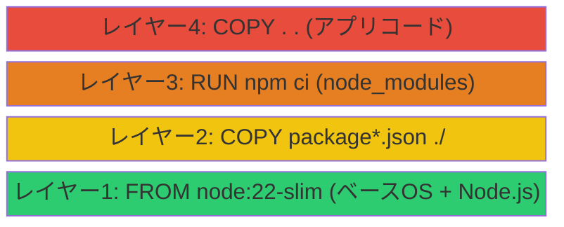
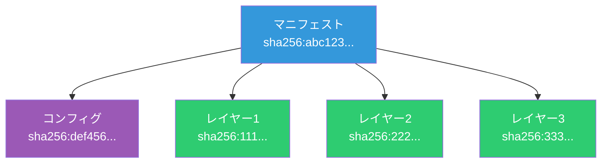

# Dockerイメージ（Docker Image）

> **一言で言うと:** アプリケーションとその実行環境を丸ごとパッケージ化した**読み取り専用のファイルシステムスナップショット**。レイヤーの積み重ねで構成され、コンテンツアドレッシング（SHA256）で一意に識別される。

## イメージの構造

### レイヤーとコンテンツアドレッシング

Dockerイメージは OCI（Open Container Initiative）Image Spec に準拠した**レイヤーの積み重ね**で構成される。各レイヤーは前のレイヤーからの差分（変更されたファイル）だけを保持し、[[ファイルシステムとIO]]で解説する UnionFS（OverlayFS）によって1つのファイルシステムとして合成される。



各レイヤーは内容の SHA256 ハッシュで識別される（コンテンツアドレッシング — [[ハッシュテーブル]]と同じハッシュの原理を応用）。同じ内容のレイヤーは異なるイメージ間でも共有される。

```bash
# イメージのレイヤーを確認
docker inspect --format='{{range .RootFS.Layers}}{{.}}{{"\n"}}{{end}}' node:22-slim

# 出力例:
# sha256:a483da8ab3e941547542718cacd3258c6c705a24e04096c57b3b9b4e610f1dcb
# sha256:8e2b2e4c7e3a7f8d9b6c5a4f3e2d1c0b9a8f7e6d5c4b3a2f1e0d9c8b7a6f5e4
```

### マニフェストとコンフィグ

イメージは3つの要素で構成される:

| 要素 | 役割 | 内容 |
|------|------|------|
| **マニフェスト**（Manifest） | レイヤーの一覧とコンフィグへの参照 | JSON。レジストリがイメージを識別する単位 |
| **コンフィグ**（Config） | 実行時の設定 | ENV, CMD, EXPOSE, WORKDIR など |
| **レイヤー**（Layers） | ファイルシステムの差分 | tar.gz 形式のアーカイブ |



### マルチプラットフォームイメージ

1つのタグで複数のアーキテクチャ（amd64, arm64 など）に対応するため、**マニフェストリスト**（Manifest List / OCI Image Index）が使われる。`docker pull` 時にホストのアーキテクチャに一致するイメージが自動選択される。

```bash
# マルチプラットフォーム対応の確認
docker manifest inspect node:20-slim | jq '.manifests[].platform'

# ビルド時にマルチプラットフォーム対応にする
docker buildx build --platform linux/amd64,linux/arm64 -t myapp:latest .
```

Apple Silicon Mac で開発し、amd64 の本番サーバーにデプロイする場合、この仕組みが重要になる。

## タグとダイジェスト

### タグ（Tag）

タグは**イメージに付ける人間向けのラベル**であり、ミュータブル（書き換え可能）。同じタグが異なるイメージを指す可能性がある。

```
registry.example.com/myapp:v1.2.3
├── レジストリ          ├── タグ
└── リポジトリ名 ───────┘
```

よく使われるタグの命名規則:

| パターン | 例 | 用途 |
|----------|-----|------|
| セマンティックバージョン | `node:22.14.0` | 本番で推奨。再現性が高い |
| メジャー/マイナー | `node:22`, `node:22.14` | パッチ更新を自動追従 |
| バリアント | `node:22-slim`, `node:22-alpine` | ベースイメージの種類を示す |
| `latest` | `node:latest` | **非推奨**。何を指すか不定 |
| Git SHA | `myapp:a1b2c3d` | CI/CD でビルドごとに一意 |

### ダイジェスト（Digest）

ダイジェストはイメージの**イミュータブル（不変）な識別子**。マニフェストの SHA256 ハッシュそのもの。

```bash
# ダイジェストで pull（完全な再現性）
docker pull node@sha256:a1b2c3d4e5f6...

# ローカルイメージのダイジェスト確認
docker images --digests
```

**本番で完全な再現性が必要な場合はダイジェストを使う。** タグは便利だが、誰かが同じタグで別のイメージを push できてしまう。

## レジストリ（Registry）

レジストリはイメージの保管・配布サーバー。`docker push` / `docker pull` の相手先。

| レジストリ | 特徴 |
|-----------|------|
| **Docker Hub** | デフォルト。公式イメージの配布元。無料プランは pull レート制限あり |
| **Amazon ECR** | AWS ネイティブ。IAM 認証。ECS/EKS との統合が容易（→ [[AWSコンテナサービスとDockerの実運用]]） |
| **Google Artifact Registry** | GCP ネイティブ。旧 GCR の後継 |
| **GitHub Container Registry（ghcr.io）** | GitHub Actions との統合が容易 |
| **セルフホスト** | Harbor、GitLab Container Registry など |

```bash
# Docker Hub以外のレジストリに push する場合
docker tag myapp:latest ghcr.io/myorg/myapp:v1.0.0
docker push ghcr.io/myorg/myapp:v1.0.0
```

## イメージサイズの最適化

イメージサイズはビルド時間、pull 時間、ストレージコスト、攻撃表面に直結する。

### ベースイメージの選択

| ベースイメージ | サイズ目安 | 特徴 |
|---------------|----------|------|
| `ubuntu:24.04` | ~75MB | フルOS。デバッグしやすいが大きい |
| `debian:bookworm-slim` | ~75MB | Debian の最小構成 |
| `node:22-slim` | ~60MB | 公式 slim バリアント |
| `alpine:3.21` | ~5MB | musl libc ベース。非常に小さいが互換性問題あり |
| `gcr.io/distroless/nodejs22-debian12` | ~170MB | シェルなし。実行専用 |
| `scratch` | 0MB | 空のイメージ。Go のシングルバイナリ向け |

### マルチステージビルド

ビルドに必要なツール（コンパイラ、開発用依存関係）を最終イメージから除外する。

```go
// main.go — Go のシングルバイナリ例
package main

import (
    "fmt"
    "net/http"
)

func main() {
    http.HandleFunc("/", func(w http.ResponseWriter, r *http.Request) {
        fmt.Fprint(w, "Hello")
    })
    http.ListenAndServe(":8080", nil)
}
```

```dockerfile
# ステージ1: ビルド（~800MB）
FROM golang:1.26 AS builder
WORKDIR /app
COPY go.* ./
RUN go mod download
COPY . .
RUN CGO_ENABLED=0 go build -o server .

# ステージ2: 実行（~10MB）
FROM scratch
COPY --from=builder /app/server /server
EXPOSE 8080
CMD ["/server"]
```

Python の場合もマルチステージ + venv で同様に最適化できる。`requirements.txt` を先にコピーしてキャッシュ効率を上げるのがポイント。

```dockerfile
FROM python:3.13-slim AS builder
WORKDIR /app
COPY requirements.txt .
RUN python -m venv /opt/venv && \
    /opt/venv/bin/pip install --no-cache-dir -r requirements.txt

FROM python:3.13-slim
COPY --from=builder /opt/venv /opt/venv
ENV PATH="/opt/venv/bin:$PATH"
WORKDIR /app
COPY . .
USER nobody
CMD ["python", "app.py"]
```

### .dockerignore

ビルドコンテキストから不要なファイルを除外し、イメージに入り込むのを防ぐ。

```
# .dockerignore
node_modules/
.git/
.env
*.md
docker-compose*.yml
.vscode/
coverage/
dist/
```

## イメージのセキュリティ

### 脆弱性スキャン

イメージ内のパッケージに既知の脆弱性（CVE）がないかを検査する。CI/CD パイプラインに組み込むのが推奨。

```bash
# Docker Scout（Docker 公式）
docker scout cves myapp:latest

# Trivy（オープンソース、広く使われている）
trivy image myapp:latest
```

### セキュリティの原則

1. **非 root ユーザーで実行** — `USER` 命令で非特権ユーザーに切り替える
2. **最小限のパッケージ** — 不要なツール（curl, wget, vi 等）は入れない。攻撃者がコンテナに侵入した場合の行動範囲を制限する
3. **シークレットをイメージに入れない** — `ENV` や `COPY` で秘密情報を含めると、レイヤーに永続的に残る
4. **ベースイメージを定期更新** — OS パッケージの脆弱性修正を取り込む

```dockerfile
# シークレットを安全に使う（BuildKit）
# syntax=docker/dockerfile:1
FROM node:22-slim
RUN --mount=type=secret,id=npm_token \
    NPM_TOKEN=$(cat /run/secrets/npm_token) \
    npm ci --registry https://npm.example.com

# ビルド時:
# docker build --secret id=npm_token,src=.npm_token .
```

## よくある落とし穴

1. **`latest` タグへの過信** — `latest` は「最新」を保証しない。単なるデフォルトのタグ名であり、誰でも任意のイメージに付けられる。本番では `node:22.14.0-slim` のように完全なバージョンを指定する

2. **レイヤーキャッシュの無効化** — `COPY . .` を依存インストールの前に置くと、ソース変更のたびに `npm ci` が再実行される。「変更頻度の低い命令を先に」が鉄則

3. **dangling イメージの蓄積** — ビルドを繰り返すとタグなしの古いイメージが溜まり、ディスクを圧迫する。定期的に `docker image prune` で清掃する

4. **alpine の互換性問題** — alpine は musl libc を使うため、glibc 前提のバイナリ（一部の npm ネイティブモジュールなど）が動作しない場合がある。動かない場合は `slim` バリアントに切り替える

5. **マルチプラットフォーム未対応** — arm64 Mac でビルドしたイメージを amd64 サーバーにデプロイすると `exec format error` で起動しない。CI で `--platform linux/amd64` を明示するか、`docker buildx` でマルチプラットフォームビルドする

## 実務での使用シーン

| シーン | イメージ設計のポイント |
|--------|---------------------|
| **ローカル開発** | Bind Mount でソースを同期。ホットリロード対応。イメージサイズは二の次 |
| **CI/CD** | キャッシュ効率を最大化。レイヤー順序と `.dockerignore` が重要 |
| **本番デプロイ** | マルチステージで最小化。非root実行。脆弱性スキャン必須 |
| **共有ベースイメージ** | 社内共通のベースイメージを作り、セキュリティパッチを一元管理 |

イメージの全体像（コンテナの隔離・Compose・ベストプラクティス）は親トピックの [[Docker]] を参照。
