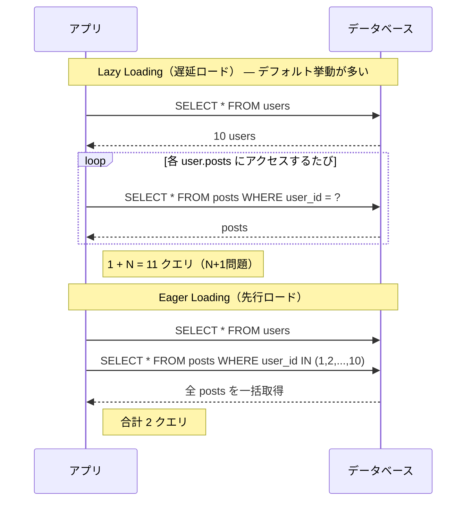
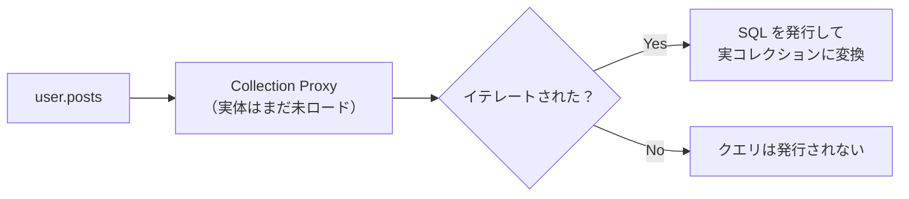
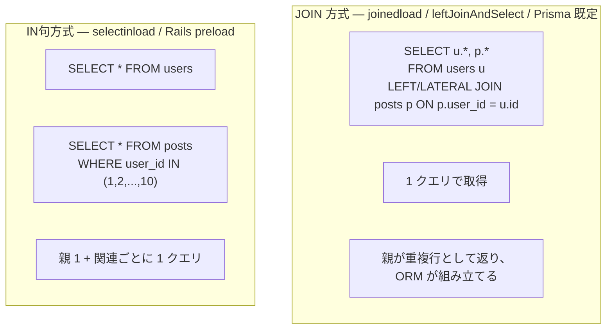

# Eager ロードと Lazy ロード（Eager Loading & Lazy Loading）

> **一言で言うと:** 関連データを「親と一緒にまとめて取る（Eager）」のか「使うときに初めて取る（Lazy）」のか、という ORM のリレーション取得戦略。デフォルトの Lazy のまま放置すると即 N+1 問題になり、雑に Eager にすると不要な JOIN で重くなる。

## 概念

### 2 つの基本戦略

`User` と `Post`（1対多）の関係で、ユーザー一覧とそれぞれの投稿を表示する場合を考える。



| 観点 | Lazy Loading | Eager Loading |
|---|---|---|
| クエリのタイミング | リレーションプロパティへのアクセス時 | 親レコード取得時に同時に |
| クエリ数 | 関連が必要になるたびに発行（N+1 化しやすい） | 関連ごとに 1〜2 クエリにまとまる |
| 過剰取得のリスク | 必要な分しか取らない | 使わない関連まで取ってしまう可能性 |
| コード上の見た目 | `user.posts` でただアクセスするだけ | `include(:posts)` / `Preload` などの**明示的な指示**が必要 |
| デフォルト挙動 | ActiveRecord, Eloquent, Hibernate 等の多くの ORM | Prisma などは「指定しなければ取らない」設計（明示主義） |

### Lazy Loading は「Proxy パターン」で実装される

`user.posts` がただのプロパティアクセスに見えてクエリを発行するのは、ORM が裏で**プロキシオブジェクト**を返しているから。



ActiveRecord の `has_many`、SQLAlchemy のデフォルト `relationship`、Hibernate の `@OneToMany(fetch=LAZY)` などが該当する。**プロパティアクセスがクエリを発行する**という事実が直感に反するため、N+1 を生みやすい。

→ プロキシの仕組みは [[JSにおけるProxyとObject]] にも通底する考え方で、JS 側ではリアクティビティの実装に使われる。

### Eager Loading の 2 つの方式

「Eager Loading」とひとくくりにされがちだが、内部 SQL は **JOIN 方式** と **IN句方式（separate query）** の 2 種類があり、性能特性が大きく異なる。



| 観点 | JOIN 方式 | IN句方式 |
|---|---|---|
| クエリ数 | 1（関連が増えても 1） | 関連の数だけ +1 |
| データ転送量 | **親行が関連数だけ重複**してネットワークを通る（LATERAL JOIN を使う Prisma 等は重複を回避できる） | 重複なし |
| LIMIT との相性 | 単純な JOIN は悪い（後述の落とし穴）／LATERAL JOIN なら親に LIMIT を効かせやすい | 良い（親に LIMIT、関連は IN で別取得） |
| 1対1 / 多対1 | 適している | 適している |
| 1対多 / 多対多 | カーディナリティ次第で重複が爆発する（LATERAL JOIN なら緩和） | 安定して使える |
| 代表 API | SQLAlchemy `joinedload`, TypeORM `leftJoinAndSelect`, GORM `Joins`, Prisma `include`（既定、5.8 以降） | SQLAlchemy `selectinload`, GORM `Preload`, Rails `preload`, Prisma `include` + `relationLoadStrategy: "query"` |

実務では、**1対多・多対多は IN句方式、1対1・多対1（必ず 1 行返るもの）は JOIN 方式**が無難な指針になる。ただし PostgreSQL の LATERAL JOIN を活用する Prisma 5.8+ のような実装は、1対多でも単一クエリで効率的に取得できるため、ORM の実装を確認した上で判断するのが望ましい。

> **Prisma の relationLoadStrategy について:** Prisma は v5.8.0（2024 年）で `relationLoadStrategy` をプレビュー導入し、2025 年中の GA 後は `join`（PostgreSQL では LATERAL JOIN、MySQL では相関サブクエリで単一クエリ）が**既定**になっている。それ以前は IN句方式相当の動作が既定だった。`relationLoadStrategy: "query"` を明示すれば従来の IN句方式に切り替えられる。

### Rails の `includes` / `preload` / `eager_load` の違い

Rails は 3 つの API があり、しばしば混同される。

| メソッド | 内部の SQL 戦略 | WHERE で関連を絞り込めるか |
|---|---|---|
| `preload(:posts)` | 必ず IN句方式（2 クエリ） | できない（関連カラムを `where` で参照すると `ActiveRecord::ConfigurationError` 等でエラー） |
| `eager_load(:posts)` | 必ず JOIN 方式（LEFT OUTER JOIN、1 クエリ） | できる |
| `includes(:posts)` | Rails が状況を見て自動選択（クエリ条件に関連カラムがあれば `eager_load`、なければ `preload`） | できる |

`includes` は「賢い」が、生成される SQL が予測しづらいため、性能が問題になる箇所では `preload` / `eager_load` を明示するのが定石。

### Explicit Loading（明示的ロード）

「Lazy のままにしておくが、必要な箇所で明示的に一括取得する」という第3の選択肢もある。すでに取得済みの親レコードに対して、後から関連を読み込む。

- Rails: `users = User.all; ActiveRecord::Associations::Preloader.new(records: users, associations: :posts).call`
- EF Core: `dbContext.Entry(user).Collection(u => u.Posts).Load()`
- SQLAlchemy: `session.execute(select(User).options(selectinload(User.posts)))` を後から呼ぶ

「条件分岐の片方の枝でしか関連を使わない」場合に有効で、Eager で常に取るより無駄が少ない。

## コード例

### TypeScript — Prisma（明示主義 / 5.8+ は JOIN 既定）

```typescript
import { PrismaClient } from "@prisma/client";
const prisma = new PrismaClient({ log: ["query"] });

// Bad: include を忘れると posts は undefined
//      Prisma は「指定しないと取らない」ので N+1 にすらならない（そもそもアクセスできない）。
const users = await prisma.user.findMany();
// users[0].posts; // ❌ TypeScript エラー: Property 'posts' does not exist

// Good: include で Eager Loading
//   既定（5.8 以降の relationLoadStrategy: "join"）では、
//   PostgreSQL は LATERAL JOIN、MySQL は相関サブクエリで「単一クエリ」で取得する。
const usersWithPosts = await prisma.user.findMany({
  include: { posts: true },
});

// 明示的に IN句方式（複数クエリ）を選択することもできる
const usersWithPostsLegacy = await prisma.user.findMany({
  relationLoadStrategy: "query", // 1) SELECT * FROM users; 2) SELECT * FROM posts WHERE userId IN (...)
  include: { posts: true },
});

// 関連の関連まで取る場合は、ネストして指定する
const usersWithPostsAndComments = await prisma.user.findMany({
  include: {
    posts: {
      include: { comments: true },
    },
  },
});

// 必要なフィールドだけに絞る（過剰取得の回避）
const lightweight = await prisma.user.findMany({
  select: {
    id: true,
    name: true,
    posts: { select: { id: true, title: true } },
  },
});
```

Prisma は「`include` / `select` を書かない限り関連を取らない」ため、Lazy / Eager の対立よりも「**取るか / 取らないか**」を強制する設計になっている。これは N+1 を起こしにくい良い性質。さらに 5.8+ ではリレーション取得戦略（JOIN か IN句か）をクエリ単位で切り替えられるため、データセットの形に応じて最適化しやすい。

### Python — SQLAlchemy（joinedload と selectinload の使い分け）

```python
from sqlalchemy.orm import Session, joinedload, selectinload, lazyload
from sqlalchemy import select

# デフォルトは Lazy — N+1 になる
def bad_n_plus_1(session: Session):
    users = session.scalars(select(User)).all()  # 1 クエリ
    for user in users:
        print(len(user.posts))  # ループのたびに SELECT * FROM posts WHERE user_id = ?

# Eager（JOIN 方式） — 1対1 / 多対1 に向く
def with_joinedload(session: Session):
    stmt = select(User).options(joinedload(User.profile))  # 1対1
    return session.scalars(stmt).unique().all()
    # 注意: 1対多に joinedload を使うと親が重複するので .unique() が必要

# Eager（IN句方式） — 1対多 / 多対多に向く
def with_selectinload(session: Session):
    stmt = select(User).options(selectinload(User.posts))  # 1対多
    return session.scalars(stmt).all()
    # 内部: SELECT * FROM users; SELECT * FROM posts WHERE user_id IN (...)

# 関連の関連まで Eager
def deep_eager(session: Session):
    stmt = select(User).options(
        selectinload(User.posts).selectinload(Post.comments)
    )
    return session.scalars(stmt).all()

# 局所的に Lazy を強制（リレーション定義が eager の場合の打ち消し）
def force_lazy(session: Session):
    stmt = select(User).options(lazyload(User.posts))
    return session.scalars(stmt).all()
```

### Ruby — ActiveRecord（preload / eager_load / includes）

```ruby
# Bad: N+1
User.all.each { |u| puts u.posts.count }
# SELECT * FROM users
# SELECT * FROM posts WHERE user_id = 1
# SELECT * FROM posts WHERE user_id = 2 ... （N回）

# Good: preload（IN句方式、2クエリ固定）
User.preload(:posts).each { |u| puts u.posts.size }
# SELECT * FROM users
# SELECT * FROM posts WHERE user_id IN (1, 2, ..., N)

# eager_load（LEFT OUTER JOIN、1クエリ）
# 関連の WHERE で絞り込みたい場合に必須
User.eager_load(:posts).where(posts: { published: true })
# SELECT users.*, posts.* FROM users
#   LEFT OUTER JOIN posts ON posts.user_id = users.id
#   WHERE posts.published = true

# includes（自動選択） — 推奨だが SQL は文脈次第
# 関連カラムを where に含めない場合 → preload と同じ挙動
User.includes(:posts).each { |u| puts u.posts.size }
# 関連カラムで where する場合 → eager_load と同じ挙動
User.includes(:posts).where(posts: { published: true })

# bullet gem を Gemfile に入れておくと、開発中の N+1 を自動検知してくれる
# gem 'bullet', group: :development
```

## よくある落とし穴

### 1. `include` の中で `where` を書いて関連を絞り込めると思い込む（Prisma 等）

```typescript
// ❌ 期待: 公開済みの post を持つユーザーだけが返ってくる
//    実際: すべてのユーザーが返り、各 user.posts は「公開済みの post」のみが入る
const users = await prisma.user.findMany({
  include: { posts: { where: { published: true } } },
});
```

`include` の中の `where` は**関連側のフィルタ**であり、**親の絞り込みではない**。親を絞り込みたければトップレベルの `where: { posts: { some: { published: true } } }` を使う。SQLAlchemy の `selectinload(...).where(...)` も同じ性質。

### 2. 1対多に JOIN 方式 Eager + LIMIT/ORDER の組み合わせ

「JOIN したテーブルを LIMIT すると、JOIN 後の重複行が LIMIT を食ってしまい、親が意図せず削れる」というのが SQL 直書きでの古典的バグ。

```sql
-- ❌ ナイーブな実装: posts の重複行で LIMIT が消費され、ユーザーが 10 人未満になる
SELECT u.*, p.* FROM users u
  LEFT JOIN posts p ON p.user_id = u.id
  LIMIT 10;
```

ただし**多くのモダン ORM はこれを自動回避している**:

- **Rails の `eager_load(:posts).limit(10)`**: 内部でサブクエリ方式に展開され、先に親 ID を 10 件に絞ってから JOIN する。よって素の Rails ではこの単純なバグは起きない。
- **問題が顕在化するパターン**: 関連テーブルのカラムで `ORDER BY` する場合（PostgreSQL では [rails/rails#33239](https://github.com/rails/rails/issues/33239)）、または ORM が自動サブクエリ化しない構造（GORM の `Joins` で raw SQL を組み立てるケース等）。

```ruby
# ⚠️ ORDER BY が関連テーブルだと、サブクエリ展開でも結果が壊れる
User.eager_load(:posts).order("posts.created_at DESC").limit(10)
```

このパターンに踏み込むなら、IN句方式（`preload` / `selectinload`）に切り替えるか、`row_number() OVER (PARTITION BY ...)` を使った明示的なクエリに置き換えるのが安全。

### 3. デフォルトを Eager にする `default_scope` の濫用

```ruby
class Post < ApplicationRecord
  belongs_to :user
  default_scope { includes(:user) }  # ❌ 「全クエリで user を JOIN」
end
```

「N+1 が出ないように」と全クエリに Eager を仕込むと、`Post.pluck(:title)` のような関連が不要なクエリでも JOIN/IN句が走る。**Eager は呼び出し側が必要に応じて指定するのが原則**。

### 4. シリアライザ（jbuilder / serializer）が裏で Lazy ロードしている

API レスポンスをシリアライズする層が `post.author.name` を参照すると、コントローラ側で Eager し忘れた瞬間に N+1 が発生する。レスポンスに含めるすべての関連は、**コントローラ層で明示的に Eager 指定する**のが鉄則。

### 5. Eager で「念のため全部取る」

```typescript
// ❌ 一覧画面の API なのに、コメントとリアクションまで全部取ってくる
const posts = await prisma.post.findMany({
  include: { user: true, comments: { include: { user: true } }, reactions: true },
});
```

不要な関連まで取ると、N+1 は消えても**ペイロードと DB 負荷が膨らむ**。一覧と詳細でクエリを分け、画面に必要な分だけを取るのが正解。

## AI による実装のアンチパターン

| アンチパターン | なぜ問題か | 対策 |
|---|---|---|
| 関連プロパティを使う前に毎回 `find` し直す | プロキシの存在を理解せず、関連が必要になるたびに別クエリを発行するコードを書きがち | 親取得時に `include` / `Preload` / `selectinload` で一括取得 |
| 「N+1 が怖い」から全関連を Eager にする | 使わない関連まで取って過剰取得になる | 画面/エンドポイント単位で必要な関連だけを Eager 指定 |
| Rails で `includes` を `eager_load` 相当として書き、関連 WHERE が効かないバグ | `includes` の自動切替が裏目に出る | 関連 WHERE で絞るときは `eager_load` を明示する |
| 1対多に JOIN 方式 Eager + 関連カラム ORDER BY + LIMIT | サブクエリ自動化でも壊れる古典パターン（Rails の単純 LIMIT は自動回避されるが、関連 ORDER が絡むと壊れる） | IN句方式に切り替えるか、`row_number()` 等で明示クエリ化 |
| ループ内で `Repo.with('user')->where(...)` のような Eager を実行 | Eager されたコレクションを取り直すだけで本質的に N+1 と変わらない | ループの外で一括取得し、ループ内ではメモリ上のオブジェクトを参照 |

## 実務での使用シーン

- **一覧 API**：親 + 1〜2 個の関連だけを `selectinload` / `preload` 相当で Eager。深い関連は別エンドポイントに分離。
- **管理画面の詳細表示**：1 件取得 + 多くの関連を Eager。ペイロード肥大より N+1 回避が優先。
- **GraphQL リゾルバ**：N+1 の温床。DataLoader で「同一バッチ内の親 ID をまとめて IN句で取る」パターンを導入する。本質的には selectinload と同じ発想。
- **バッチ処理**：`find_each` (Rails) や `yield_per` (SQLAlchemy) でストリーミングしつつ、関連は `preload` で IN句一括取得。

## 関連トピック

- [[データアクセス層]] — 親トピック。N+1 回避は ORM 利用時の最重要設計判断のひとつ
- [[コネクションプール]] — N+1 が発生するとプールが食いつぶされ、他リクエストが詰まる
- [[B-TreeとB+Tree]] — 関連取得の SQL 性能はインデックス設計に強く依存（外部キーにインデックスがないと Eager でも遅い）
- [[ページネーション]] / [[カーソルベースページネーション]] — 1対多 + LIMIT の落とし穴と直結する
- [[JSにおけるProxyとObject]] — Lazy Loading の実装で使われる Proxy パターンと同じ発想
