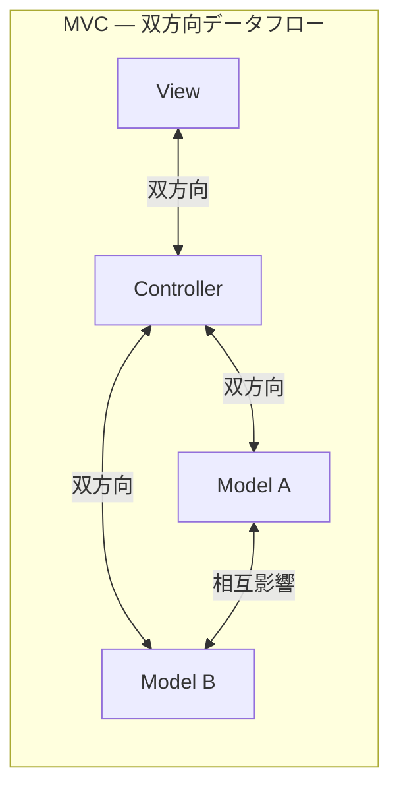
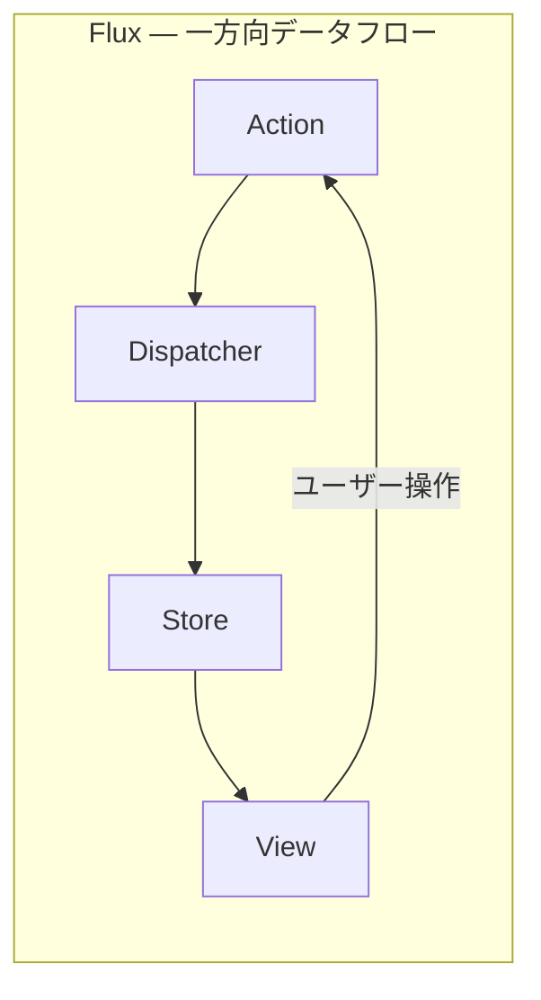
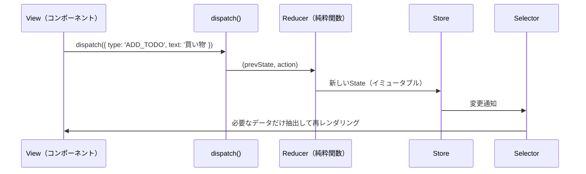
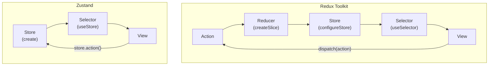

# FluxアーキテクチャとRedux（Flux Architecture & Redux）

> **一言で言うと:** Fluxは「状態変更を一方向のデータフローに制約する」アーキテクチャパターンであり、Reduxはその最も普及した実装。Action→Reducer→Store→Viewの流れにより、状態変更の予測可能性とデバッグ容易性を実現する。Redux Toolkitの登場でボイラープレートは大幅に削減された。

## Fluxアーキテクチャ — なぜ一方向なのか

Facebookが2014年に提唱したFluxは、MVC（Model-View-Controller）の**双方向データフロー**が大規模アプリで破綻した経験から生まれた。



複数のModelとViewが双方向に結合すると、1つの変更がどこに波及するか予測困難になる。Facebookの通知バグ（未読数が消えない）はこの構造に起因していた。



**一方向の制約**により、状態がいつ・なぜ変わったかが全て追跡可能になる。

## Reduxの3原則

ReduxはFluxを**さらにシンプルに**した実装であり、3つの制約を持つ:

| 原則 | 意味 | なぜ重要か |
|------|------|-----------|
| **Single Source of Truth** | アプリ全体の状態を1つのStoreに格納 | 状態の分散と不整合を防ぐ |
| **State is Read-Only** | 状態を直接変更せず、Actionを発行する | 全ての変更が記録・追跡可能 |
| **Changes with Pure Functions** | Reducerは純粋関数（副作用なし） | テスト可能・予測可能 |

### データフローの詳細



## 素のRedux vs Redux Toolkit

### 素のRedux — ボイラープレートの問題

```typescript
// ❌ 素のRedux — コードが冗長

// Action Types（定数）
const ADD_TODO = 'ADD_TODO' as const;
const TOGGLE_TODO = 'TOGGLE_TODO' as const;
const DELETE_TODO = 'DELETE_TODO' as const;

// Action Creators
interface AddTodoAction {
  type: typeof ADD_TODO;
  payload: { id: number; text: string };
}
interface ToggleTodoAction {
  type: typeof TOGGLE_TODO;
  payload: number;
}
interface DeleteTodoAction {
  type: typeof DELETE_TODO;
  payload: number;
}
type TodoAction = AddTodoAction | ToggleTodoAction | DeleteTodoAction;

function addTodo(text: string): AddTodoAction {
  return { type: ADD_TODO, payload: { id: Date.now(), text } };
}
function toggleTodo(id: number): ToggleTodoAction {
  return { type: TOGGLE_TODO, payload: id };
}

// Reducer — イミュータブルな更新が複雑
interface Todo {
  id: number;
  text: string;
  done: boolean;
}

function todosReducer(state: Todo[] = [], action: TodoAction): Todo[] {
  switch (action.type) {
    case ADD_TODO:
      return [...state, { ...action.payload, done: false }];
    case TOGGLE_TODO:
      return state.map(todo =>
        todo.id === action.payload ? { ...todo, done: !todo.done } : todo
      );
    case DELETE_TODO:
      return state.filter(todo => todo.id !== action.payload);
    default:
      return state;
  }
}
```

1つの機能（TODO）に対して、Action Type定数、Action型定義、Action Creator、Reducerの4種類のコードが必要。これが「Reduxはボイラープレートが多い」と言われる理由。

### Redux Toolkit — 現代のRedux

```typescript
// ✅ Redux Toolkit — 同じ機能を1/3のコードで

import { createSlice, configureStore, PayloadAction } from '@reduxjs/toolkit';

interface Todo {
  id: number;
  text: string;
  done: boolean;
}

// createSlice: Action Type + Action Creator + Reducer を一括生成
const todosSlice = createSlice({
  name: 'todos',
  initialState: [] as Todo[],
  reducers: {
    // Immerにより「ミュータブルな書き方」でイミュータブルな更新ができる
    addTodo: {
      reducer(state, action: PayloadAction<{ id: number; text: string }>) {
        state.push({ ...action.payload, done: false });  // push OK（Immerが処理）
      },
      prepare(text: string) {
        return { payload: { id: Date.now(), text } };
      },
    },
    toggleTodo(state, action: PayloadAction<number>) {
      const todo = state.find(t => t.id === action.payload);
      if (todo) todo.done = !todo.done;  // 直接変更 OK（Immerが処理）
    },
    deleteTodo(state, action: PayloadAction<number>) {
      return state.filter(t => t.id !== action.payload);
    },
  },
});

// Action CreatorとAction Typeが自動生成される
export const { addTodo, toggleTodo, deleteTodo } = todosSlice.actions;
// todosSlice.actions.addTodo('買い物')
// → { type: 'todos/addTodo', payload: { id: 123, text: '買い物' } }

// Store設定
const store = configureStore({
  reducer: {
    todos: todosSlice.reducer,
  },
  // DevTools, thunk middleware が自動設定される
});

export type RootState = ReturnType<typeof store.getState>;
export type AppDispatch = typeof store.dispatch;
```

### Redux ToolkitのImmerによる簡素化

Redux Toolkitは内部でImmerライブラリを使用し、「ミュータブルな書き方」を自動的にイミュータブルな更新に変換する:

```typescript
// 素のRedux — スプレッド演算子の連鎖（ネストが深いほど地獄）
function reducer(state, action) {
  return {
    ...state,
    users: {
      ...state.users,
      [action.payload.id]: {
        ...state.users[action.payload.id],
        address: {
          ...state.users[action.payload.id].address,
          city: action.payload.city,  // ここだけ変えたい
        },
      },
    },
  };
}

// Redux Toolkit（Immer）— 直接変更に見えるが内部でイミュータブル
function reducer(state, action) {
  state.users[action.payload.id].address.city = action.payload.city;
  // Immerが差分を検出して新しいオブジェクトを生成する
}
```

## Reactコンポーネントでの使用

```tsx
import { useState } from 'react';
import { useSelector, useDispatch } from 'react-redux';
import { addTodo, toggleTodo, deleteTodo } from './todosSlice';
import type { RootState, AppDispatch } from './store';

function TodoApp() {
  const todos = useSelector((state: RootState) => state.todos);
  const dispatch = useDispatch<AppDispatch>();
  const [input, setInput] = useState('');

  const remaining = todos.filter(t => !t.done).length;

  return (
    <div>
      <form onSubmit={e => {
        e.preventDefault();
        if (input.trim()) {
          dispatch(addTodo(input));  // Actionをdispatch
          setInput('');
        }
      }}>
        <input value={input} onChange={e => setInput(e.target.value)} />
        <button type="submit">追加</button>
      </form>
      <ul>
        {todos.map(todo => (
          <li key={todo.id}>
            <label>
              <input
                type="checkbox"
                checked={todo.done}
                onChange={() => dispatch(toggleTodo(todo.id))}
              />
              {todo.text}
            </label>
            <button onClick={() => dispatch(deleteTodo(todo.id))}>×</button>
          </li>
        ))}
      </ul>
      <p>残り {remaining} 件</p>
    </div>
  );
}
```

## 非同期処理 — createAsyncThunk

ReduxはReducerが純粋関数であるため、API通信などの副作用は**ミドルウェア**で処理する。Redux Toolkitの `createAsyncThunk` が標準的な方法:

```typescript
import { createSlice, createAsyncThunk } from '@reduxjs/toolkit';

interface User {
  id: number;
  name: string;
  email: string;
}

// 非同期Action — pending / fulfilled / rejected の3つのActionを自動生成
export const fetchUsers = createAsyncThunk<User[]>(
  'users/fetchUsers',
  async () => {
    const response = await fetch('/api/users');
    if (!response.ok) throw new Error('Failed to fetch');
    return response.json();
  }
);

interface UsersState {
  items: User[];
  status: 'idle' | 'loading' | 'succeeded' | 'failed';
  error: string | null;
}

const usersSlice = createSlice({
  name: 'users',
  initialState: { items: [], status: 'idle', error: null } as UsersState,
  reducers: {},
  extraReducers: (builder) => {
    builder
      .addCase(fetchUsers.pending, (state) => {
        state.status = 'loading';
      })
      .addCase(fetchUsers.fulfilled, (state, action) => {
        state.status = 'succeeded';
        state.items = action.payload;
      })
      .addCase(fetchUsers.rejected, (state, action) => {
        state.status = 'failed';
        state.error = action.error.message ?? 'Unknown error';
      });
  },
});
```

**注意:** サーバーデータの取得・キャッシュ管理がReduxの主な用途になっている場合、TanStack Queryへの移行を検討すべき。TanStack Queryはキャッシュ・再取得・楽観的更新を自動化し、`createAsyncThunk` + status/error管理のボイラープレートを不要にする。

## Redux vs Zustand — 現代の選択



| 観点 | Redux Toolkit | Zustand |
|------|--------------|---------|
| バンドルサイズ | ~11KB | ~2KB |
| ボイラープレート | Slice定義が必要 | 最小限 |
| DevTools | 組み込み（タイムトラベル） | オプション（middleware追加） |
| ミドルウェア | 豊富なエコシステム | シンプルなmiddleware API |
| 学習コスト | 高い（概念が多い） | 低い（ほぼ素のJS） |
| 適切な規模 | 大規模チーム・複雑な状態遷移 | 中小規模・シンプルな共有状態 |
| Reactへの依存 | react-reduxが必要 | React以外でも使用可能 |

```typescript
// Zustand — 同じTODOアプリ
import { create } from 'zustand';
import { devtools } from 'zustand/middleware';

const useTodoStore = create(devtools((set) => ({
  todos: [],
  addTodo: (text) => set((state) => ({
    todos: [...state.todos, { id: Date.now(), text, done: false }],
  })),
  toggleTodo: (id) => set((state) => ({
    todos: state.todos.map(t => t.id === id ? { ...t, done: !t.done } : t),
  })),
})));

// コンポーネント — dispatchもAction Creatorも不要
function TodoApp() {
  const todos = useTodoStore((s) => s.todos);
  const addTodo = useTodoStore((s) => s.addTodo);
  // addTodo('買い物') で直接呼べる
}
```

## Redux DevTools — 最大の武器

Reduxの最も価値ある機能は**DevTools**。全てのActionが記録され、状態の変遷を時系列で追跡できる:

```
Action Log:
  ① todos/addTodo    → { todos: [{ id: 1, text: '買い物', done: false }] }
  ② todos/addTodo    → { todos: [..., { id: 2, text: '掃除', done: false }] }
  ③ todos/toggleTodo → { todos: [{ ..., done: true }, ...] }
  ④ todos/deleteTodo → { todos: [{ id: 2, text: '掃除', done: false }] }

  ← タイムトラベル: ②の時点まで巻き戻してUIを確認
  → リプレイ: ②→③→④を再実行
```

これにより「いつ・何が原因で・どう状態が変わったか」が完全に可視化される。大規模アプリのデバッグにおいて、この追跡可能性は他の手法では代替困難。

## よくある落とし穴

### 1. 全ての状態をReduxに入れる

フォームの入力値やモーダルの開閉状態まで全てReduxに入れるのは過剰。Reduxに入れるべきは**複数のコンポーネント・画面遷移をまたいで共有される状態**のみ。ローカルな状態は `useState` で十分。

### 2. Reducerに副作用を書く

Reducerは純粋関数でなければならない。API通信、`Date.now()`、`Math.random()` などの副作用をReducer内で実行すると、タイムトラベルデバッグが壊れ、テストが不安定になる:

```typescript
// ❌ Reducer内での副作用
function todoReducer(state, action) {
  if (action.type === 'ADD_TODO') {
    return [...state, {
      id: Date.now(),        // 毎回異なる値 → 純粋関数でない
      text: action.payload,
      done: false,
    }];
  }
}

// ✅ Action Creator（prepare callback）で副作用を処理
addTodo: {
  reducer(state, action) {
    state.push(action.payload);  // payloadをそのまま使う → 純粋
  },
  prepare(text) {
    return { payload: { id: Date.now(), text, done: false } };  // ここで副作用
  },
},
```

### 3. Selectorを使わず全Stateを購読する

```typescript
// ❌ 全状態を購読 → 無関係な変更でも再レンダリング
const state = useSelector((state: RootState) => state);

// ✅ 必要な部分だけ購読
const todos = useSelector((state: RootState) => state.todos);

// ✅ メモ化されたSelector（Reselect）で導出値を効率的に計算
import { createSelector } from '@reduxjs/toolkit';

const selectActiveTodos = createSelector(
  (state: RootState) => state.todos,
  (todos) => todos.filter(t => !t.done)  // todosが変わらなければ再計算しない
);
```

### 4. Redux ToolkitではなくReduxを使い始める

2024年以降、素のRedux（`createStore`）を新規プロジェクトで使う理由はない。Redux公式もRedux Toolkitを「唯一の推奨方法」としている。

## AIによる実装のアンチパターン

| アンチパターン | なぜ問題か | 対策 |
|---|---|---|
| 素のReduxのボイラープレートを生成 | 現在はRedux Toolkitが公式推奨。素のReduxは非推奨 | `createSlice` + `configureStore` を使う |
| 全てのデータ取得に `createAsyncThunk` | サーバー状態のキャッシュ管理を全て自前実装する羽目になる | サーバー状態にはTanStack Queryを検討 |
| Action Typeの文字列を手動定義 | `createSlice` が自動生成する。手動は型安全性の低下とtypoのリスク | `createSlice` のreducersに記述すれば自動生成される |
| 1ファイルにAction/Reducer/Selectorを分割 | Ducks/Slice単位で1ファイルにまとめるのが現在の標準 | Feature Slice構成（`features/todos/todosSlice.ts`） |

## 関連トピック

- [[状態管理]] — 親トピック。状態管理の段階的アプローチと設計原則
- [[DOMと仮想DOM]] — 仮想DOMの再レンダリングモデルがReduxの設計前提
- [[コンポーネント設計]] — コンポーネントとStoreの接続点設計

## 参考リソース

- [Redux Toolkit公式ドキュメント](https://redux-toolkit.js.org/) — 現在のReduxの公式入口
- [Redux Style Guide](https://redux.js.org/style-guide/) — Reduxチーム推奨のパターン集
- [Redux公式チュートリアル](https://redux.js.org/tutorials/essentials/part-1-overview-concepts) — Redux Essentials
