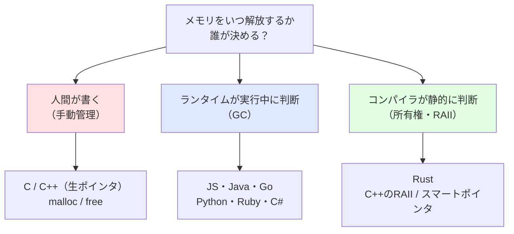
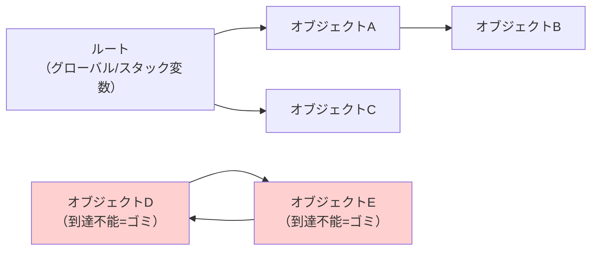
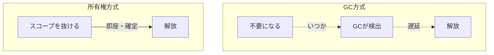

# GCと所有権モデル（Garbage Collection vs Ownership）

> **一言で言うと:** 「確保したメモリをいつ・誰が解放するか」には3つの設計思想がある — 人間が決める（手動）、ランタイムが実行時に決める（GC）、コンパイラが静的に決める（所有権）。GCは開発速度と引き換えに実行時コストとテールレイテンシを払い、所有権は学習コストと引き換えに実行時コストゼロでメモリ安全を保証する。

## なぜ「解放のタイミング」が設計思想になるのか

プログラムがヒープ（[[メモリ管理]]で扱う、サイズや寿命が動的なデータを置く領域）にメモリを確保したら、いつか必ず返さなければならない。返さなければ[[メモリリーク]]になり、まだ使っているのに返せば[[ダングリングポインタ]]になる。

この「いつ返すか」という1点に、プログラミング言語の歴史を貫く緊張がある。**早すぎても遅すぎてもいけない解放タイミングを、誰が・いつ判断するのか。** その答えの違いが、そのまま言語の性格を決める。



ここで言う**ランタイム（runtime）**とは、プログラム実行中に裏で動く言語の管理機構（VMやガベージコレクタなど）のこと。**静的（static）**とは「実行前のコンパイル時に確定する」という意味で、その対義語が「実行時（runtime / 動的）」である。

## 3つの戦略の対比

| | 手動管理 | GC | 所有権モデル |
|---|---|---|---|
| **解放を決める主体** | 人間 | ランタイム（実行時） | コンパイラ（静的） |
| **解放タイミング** | `free()` を書いた瞬間 | 「もう参照されない」と検出された後（遅延あり） | スコープを抜けた瞬間（決定論的） |
| **実行時コスト** | ゼロ | GCの走査・停止コストあり | ゼロ（解放処理自体は手動 free 相当で決定論的） |
| **メモリ安全** | 開発者次第（リーク・二重解放が頻発） | リーク以外は安全 | コンパイル時に保証 |
| **学習コスト** | 中（規律が必要） | 低 | 高（借用チェッカーと戦う） |
| **代表言語** | C, C++（生ポインタ） | JS, Java, Go, Python, Ruby | Rust, C++（RAII） |

この表の核心は **「実行時コスト」と「学習コスト」がトレードオフになっている**点にある。GCは人間を楽にする代わりにマシンに働かせ、所有権は人間に前払いの学習を強いる代わりにマシンを解放する。手動管理は両方を人間に背負わせる代わりに最大の自由を与える — そして最大の事故を招く。

## GCの本質 — 「到達可能性」で生死を判定する

GC（Garbage Collection、ガベージコレクション）の判断基準はただ一つ、**「ルートから参照を辿って到達できるか」**である。ルート（root）とは、グローバル変数やスタック上の変数など「無条件に生きているとみなす起点」のこと。ここから参照の鎖を辿れるオブジェクトは「生きている」、辿れないものは「ゴミ」と判定して回収する。



注目すべきは右下の D と E だ。互いに参照し合っている（**循環参照**）が、ルートからは到達できない。マーク&スイープ方式のGCは「到達できないものはまとめてゴミ」と判断するので、循環していても正しく回収できる。

GCの代償は2つ。

1. **テールレイテンシ（tail latency）** — テールレイテンシとは「最も遅い数%のリクエストの応答時間」のこと。GCが走る瞬間、アプリの実行を一時停止する（**Stop-the-World**）ことがあり、運悪くその瞬間に当たったリクエストだけ突出して遅くなる。平均は速いのに p99（上位99パーセンタイル）が跳ねる、という現象の典型的な原因。
2. **「到達可能なら回収されない」** — コード上は不要でも、グローバルなキャッシュなどから参照が残っていれば「到達可能=生きている」と判定され、永遠に回収されない。これがGC言語で[[メモリリーク]]が起きる仕組み。「GCがあればリークしない」は誤解。

なお、GCの中でも**参照カウント（reference counting）**方式は、各オブジェクトが「自分は今いくつから参照されているか」を数え、0になった瞬間に解放する。即座に解放される利点があるが、単独では上図の循環参照（D↔E が互いに1ずつ数え合い、永遠に0にならない）を検出できない。Pythonは参照カウントを主方式とし、循環だけを補助的なGCで回収する。

## 所有権の本質 — 解放タイミングを静的に決める

所有権モデル（ownership model）は、まったく逆の発想を取る。**「実行時に解放タイミングを探す」のではなく、「コンパイル時に解放タイミングを確定させる」**。

中心ルールは「各値の**所有者（owner）は常にただ一人**であり、所有者がスコープ（変数の有効範囲）を抜けた瞬間にメモリが解放される」。所有権は代入や関数呼び出しで他へ**ムーブ（move、移動）**でき、ムーブ後に元の変数を使うとコンパイルエラーになる。

これにより解放のタイミングがソースコード上で静的に決まるため、**GCのような実行時の追跡装置が一切要らない**。Rustが「GCなしでメモリ安全」を実現できるのはこの仕組みによる。詳しい構文と借用チェッカーの挙動は[[Rust]]を参照。

この「スコープを抜けたら確定的に解放する」という考え方は、Rust独自のものではなく**RAII（Resource Acquisition Is Initialization）**としてC++が確立した古い設計原則だ。RAIIは「リソースの確保をオブジェクトの初期化に結びつけ、解放をデストラクタ（破棄処理）に任せる」もので、メモリに限らずファイルやロックの解放にも使われる。Rustの所有権はRAIIをコンパイラレベルで強制し、安全性を言語仕様にまで高めたものと言える。



## 中間形態 — 参照カウントとスマートポインタ

GCと所有権は両極ではあるが、その間には橋渡しの技術がある。それが**参照カウント**を使ったスマートポインタ（smart pointer、解放を自動化する「賢い」ポインタ型）だ。

- **Swift の ARC（Automatic Reference Counting）** — コンパイラが参照カウントの増減コードを自動挿入する。実行時の追跡装置（GCスレッド）は持たないが、カウント0で解放する点はGC的。循環は `weak`（弱参照）で断つ。
- **C++ の `shared_ptr` / `unique_ptr`** — `unique_ptr` は所有者ただ一人（所有権モデル的）、`shared_ptr` は参照カウントで複数所有を許す（GC的）。プログラマが用途で選ぶ。

つまり「GCか所有権か」は二者択一ではなく、**1つの言語の中で両方を使い分けられる**スペクトラムである、と捉えるのがシニアの視点になる。

## コード例

### Python — 参照カウントと循環参照

```python
import sys
import gc

class Node:
    def __init__(self, name):
        self.name = name
        self.ref = None  # 他ノードへの参照

a = Node("A")
# getrefcount は引数渡しの分も数えるため、実体は表示値-1
print(sys.getrefcount(a))  # 例: 2（変数 a と getrefcount の引数）

# --- 循環参照を作る ---
x = Node("X")
y = Node("Y")
x.ref = y   # X → Y
y.ref = x   # Y → X（循環）

del x, y    # 変数は消えたが、互いに参照し合うのでカウントは1のまま残る
# 参照カウントだけでは回収できない → 補助GCが循環を検出して回収
collected = gc.collect()
print(f"循環参照を {collected} 個回収")  # 0より大きい値が出る
```

ポイントは `del x, y` をしても循環している2オブジェクトは即座に消えないこと。参照カウント単独の限界を、`gc.collect()`（補助的なマーク&スイープGC）が補っている。

### Go — GCに任せつつ、参照を切ってリークを防ぐ

```go
package main

import "fmt"

type Cache struct {
    data map[string][]byte
}

func (c *Cache) Evict(key string) {
    // map から削除すると、その値への参照が消え、
    // ルートから到達不能になる → 次のGCで回収対象になる
    delete(c.data, key)
}

func main() {
    c := &Cache{data: make(map[string][]byte)}
    c.data["session:1"] = make([]byte, 1024*1024) // 1MB 確保

    c.Evict("session:1") // 参照を切る = GCに「もう要らない」と伝える唯一の手段
    fmt.Println("evicted, GCが回収可能に")
}
```

GC言語では `free()` を書けない。**「参照を切ること」がリーク対策の唯一のレバー**になる。所有権言語が「スコープ＝解放」で自動的に行うことを、GC言語では開発者が「到達可能性の管理」として意識する必要がある — これがGC言語でも所有権的思考が役立つ理由。

### Rust — スコープ離脱で確定的に解放される（所有権）

```rust
struct Resource {
    name: String,
}

// Drop トレイトを実装すると、値が破棄される瞬間にこの処理が走る。
// GC のように「いつか」ではなく、スコープを抜けた“その瞬間”に確定的に呼ばれる。
impl Drop for Resource {
    fn drop(&mut self) {
        println!("解放: {}", self.name);
    }
}

fn main() {
    let outer = Resource { name: String::from("outer") };

    {
        let inner = Resource { name: String::from("inner") };
        // inner はこの内側スコープを抜ける瞬間に解放される
    } // ← ここで「解放: inner」が出力される（GC を待たない）

    println!("内側スコープを抜けた");

    let moved = Resource { name: String::from("moved") };
    take_ownership(moved);  // 所有権が関数へムーブされる
    // println!("{}", moved.name); // ❌ コンパイルエラー: borrow of moved value
                                   //   ムーブ済みの値は静的に使用禁止される

} // ← main 終了時、最後に「解放: outer」が出力される

fn take_ownership(r: Resource) {
    println!("受け取った: {}", r.name);
} // ← r はここで所有者になり、関数を抜ける瞬間に「解放: moved」が出力される
```

実際の出力は次の順になる:

```
解放: inner
内側スコープを抜けた
受け取った: moved
解放: moved
解放: outer
```

`inner` は内側スコープを抜けた瞬間に、`moved` は `take_ownership` を抜けた瞬間に、`outer` は `main` の最後に解放される。重要なのは **どの行で解放されるかがソースコードを読むだけで分かる**こと。GC のような「実行時にいつか」ではなく、解放点がコンパイル時に静的に確定している。これが所有権モデルの本質であり、Python/Go の例（GCが裏で「もう到達不能か」を判断する）との決定的な違いになる。

## Webエンジニアの判断軸 — なぜWeb主流言語はGCなのか

Webバックエンドの主流（Node.js, Java, Go, Python, Ruby, C#）はほぼすべてGC言語である。なぜか。

| 観点 | GCが選ばれる理由 |
|---|---|
| **開発速度** | メモリ管理を考えずロジックに集中できる。Webは仕様変更が速く、書き直しコストの低さが効く |
| **チーム開発** | 学習コストが低く、メンバーの習熟度に依存しにくい |
| **ボトルネックの所在** | Webの遅さの多くはDB/ネットワークI/Oであり、メモリ解放コストは相対的に小さい |

逆に**Rust（所有権）がWebで選ばれるのは、GCのテールレイテンシが許容できない領域**に偏る — 高頻度取引、ゲームサーバー、CDNエッジ、決済の低レイテンシ経路など。「GCの停止が数msでも事業インパクトになるか」が分岐点になる。

そして実務上の最重要点: **GC言語を使っていても所有権的な思考（このデータの寿命はどこからどこまでか、誰が参照を握り続けているか）は捨ててはいけない**。GCは「到達不能になったゴミ」しか回収しないため、寿命設計を怠れば[[メモリリーク]]は普通に起きる。所有権モデルは、GC言語の開発者にとっても「正しいメモリの考え方」を学ぶ最良の教材になる。

## AI実装のアンチパターン

| アンチパターン | なぜ問題か | あるべき姿 |
|---|---|---|
| GC言語で「解放」を明示しようと `obj = None` / `delete` を機械的に多用 | ローカル変数はスコープ離脱で自然に回収される。冗長で意図が不明瞭 | 長命なコレクション（グローバルなMap/dict）からの参照削除に絞る |
| 「GCがあるからリークしない」前提のキャッシュ実装 | グローバル参照は到達可能=回収されず、無限増殖する典型リーク | 上限（LRU）かTTLを必ず設ける（[[メモリリーク]]参照） |
| Rust生成コードで `clone()` を多用してコンパイルを通す | 所有権モデルの利点を捨て、無駄なヒープコピーが増える | 借用 `&T` を優先（[[Rust]]の借用チェッカー節参照） |

## 関連トピック

- [[メモリ管理]] — 親トピック。GC・スタック/ヒープ・仮想メモリの全体像
- [[Rust]] — 所有権・借用・ライフタイムの具体的な構文と借用チェッカー
- [[Go]] — GC（三色マーキング）とエスケープ解析、ポインタの扱い
- [[Python]] — 参照カウント主方式 + 循環参照の補助GC
- [[メモリリーク]] — GC言語でリークが起きる仕組みと調査法
- [[ダングリングポインタ]] — 解放済みメモリ参照。所有権モデルがコンパイル時に排除する対象
