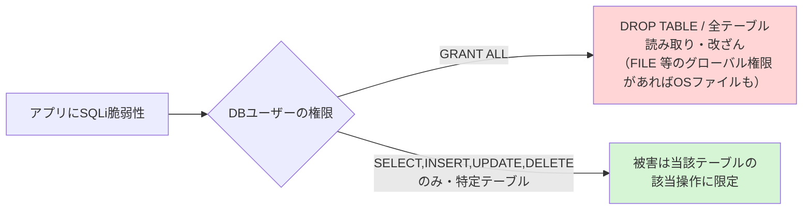
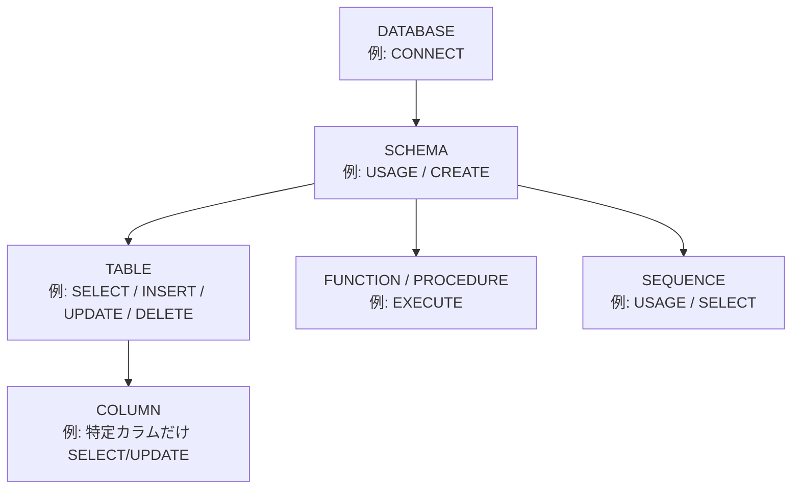
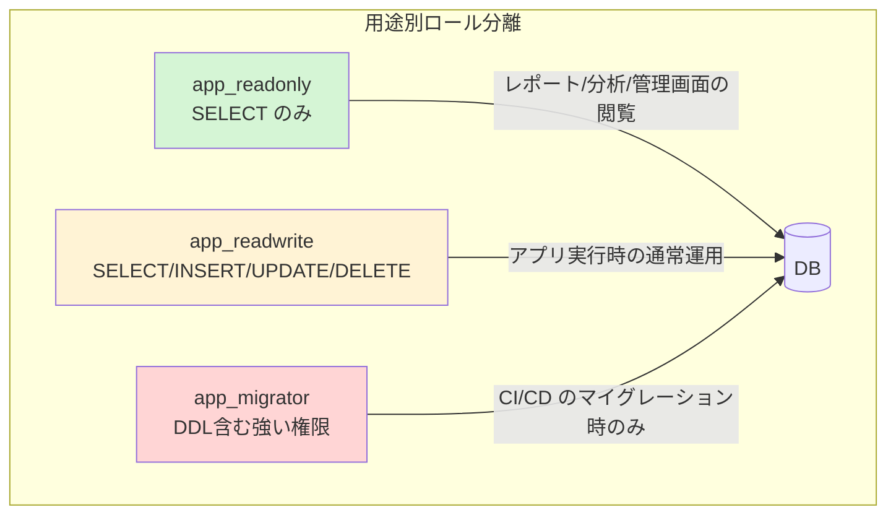

# GRANTとREVOKE（DCL: Data Control Language）

> **一言で言うと:** DB のユーザー／ロールに「どのオブジェクトに対して何ができるか」を付与（GRANT）・剥奪（REVOKE）する仕組み。[[最小権限の原則]]を RDB 内で実装する具体的な手段であり、SQLインジェクションが成功しても被害を限定する「最後の壁」になる。

## DCL とは何か — SQL の3つの顔

SQL は用途によって3つの言語グループに分類される。普段書く `SELECT` や `INSERT` は DML だが、権限を制御する `GRANT` / `REVOKE` は **DCL（Data Control Language、データ制御言語）** という別グループに属する。

| 分類 | 代表的な文 | 役割 |
|---|---|---|
| **DDL**（Data Definition Language） | `CREATE` / `ALTER` / `DROP` | テーブルやスキーマの「構造」を定義する |
| **DML**（Data Manipulation Language） | `SELECT` / `INSERT` / `UPDATE` / `DELETE` | データそのものを「操作」する |
| **DCL**（Data Control Language） | **`GRANT` / `REVOKE`** | 「誰が何をできるか」という**アクセス権限**を制御する |

この記事が扱うのは DCL である。アプリケーション開発者が普段意識しないまま `GRANT ALL PRIVILEGES` のような初期化スクリプトをコピペで通してしまうのがこの領域であり、**意識的に設計すると防御力が一段上がる**にもかかわらず軽視されやすい。

## なぜ GRANT/REVOKE を学ぶ価値があるのか

[[RDB]] の本文では「ACID で壊れない器を作る」ことを学んだ。だが**壊れないこと**と**漏れない・破壊されないこと**は別問題である。アプリケーションが接続する DB ユーザーが全権限（`GRANT ALL`）を持っていると、次のような連鎖が起きる。



[[SQLインジェクション]]の本文でも「アプリ用 DB ユーザーの権限を絞る」ことが防御の一手として登場した。GRANT/REVOKE はその防御を**実際に書き下す道具**である。つまりこのトピックは「[[最小権限の原則]]を RDB 層でどう実装するか」という問いへの答えにあたる。**Assume Breach（侵害は起こる前提で設計する）** の発想に立つと、防御コード（プリペアドステートメント等）をすり抜けられても、権限設計が爆発半径（Blast Radius、被害が及ぶ範囲）を物理的に縮める最後の壁になる。

## 基本構文 — 何を・誰に・どこまで

GRANT の基本形は「**どの権限を／どのオブジェクトに対して／誰に**」の3点で決まる。

```sql
GRANT 権限のリスト ON 対象オブジェクト TO ロール;
REVOKE 権限のリスト ON 対象オブジェクト FROM ロール;
```

```sql
-- 例: users テーブルへの SELECT/INSERT/UPDATE/DELETE を app_user に付与
GRANT SELECT, INSERT, UPDATE, DELETE ON users TO app_user;

-- 例: 付与した DELETE 権限だけを剥奪
REVOKE DELETE ON users FROM app_user;
```

### 権限の「粒度」— どこまで細かく絞れるか

権限は対象オブジェクトの大きさによって階層がある。**上位を絞れば下位もまとめて絞れる**が、上位に権限がないと下位にアクセスできないという前提関係がある（これが後述の落とし穴の温床になる）。



| 粒度 | 代表的な権限 | 用途 |
|---|---|---|
| **DATABASE** | `CONNECT`, `CREATE`, `TEMP` | そもそも DB に接続できるか |
| **SCHEMA** | `USAGE`, `CREATE` | スキーマ内のオブジェクトを参照・作成できるか。`USAGE` がないとテーブル権限があっても触れない |
| **TABLE** | `SELECT`, `INSERT`, `UPDATE`, `DELETE`, `TRUNCATE`, `REFERENCES`, `TRIGGER` | テーブル単位の CRUD と DDL 系操作 |
| **COLUMN** | `SELECT(col)`, `UPDATE(col)` | 特定カラムだけ読める／更新できる（例: 給与カラムは隠す） |
| **FUNCTION** | `EXECUTE` | ストアド関数・プロシージャの実行 |
| **SEQUENCE** | `USAGE`, `SELECT`, `UPDATE` | 連番採番（`nextval`）の利用 |

カラム単位 GRANT は実務での使用頻度こそ低いが、「アプリは `users` を読めるが `password_hash` カラムだけは別ロールしか読めない」といった**機微データの分離**に有効である。

```sql
-- name と email は読めるが、給与カラムは読めない読み取り専用ロール
GRANT SELECT (id, name, email) ON employees TO app_readonly;
-- salary を SELECT しようとするとエラーになる
```

## ロールと PUBLIC — 「誰に」の正体

### ロール（Role）= ユーザーと権限グループの統一概念

PostgreSQL では「ユーザー」と「グループ」を区別せず、すべて **ロール（role）** という単一概念で扱う。`CREATE USER` は実は `CREATE ROLE ... LOGIN` の糖衣構文（シンタックスシュガー、見た目を分かりやすくした別名）にすぎない。ログイン可能なロールが慣習的に「ユーザー」と呼ばれているだけである。

ロールは**継承**できる。権限を持つグループロールを作り、個々のユーザーロールにそれを付与すると、権限管理が一箇所に集約できる。

```sql
-- 読み取り権限の束を持つ「グループロール」
CREATE ROLE readonly_group NOLOGIN;
GRANT CONNECT ON DATABASE mydb TO readonly_group;
GRANT USAGE ON SCHEMA public TO readonly_group;
GRANT SELECT ON ALL TABLES IN SCHEMA public TO readonly_group;

-- 個々のユーザーにグループを継承させる
CREATE ROLE analyst_taro LOGIN PASSWORD 'xxx';
GRANT readonly_group TO analyst_taro;
-- analyst_taro は readonly_group の権限をすべて引き継ぐ
```

これにより「アナリストが増えたら `GRANT readonly_group TO 新ユーザー` 一行」で済む。権限を個別ユーザーに直接 GRANT すると、棚卸しや剥奪のときに漏れが出る。**権限はグループロールに、人はグループロールに紐付ける**のが定石である。

### PUBLIC — 全ロールを指す暗黙の宛先

`PUBLIC` は「**すべてのロール**」を指す特別な擬似ロールである。`GRANT ... TO PUBLIC` とすると、既存・将来を問わず全ロールに権限が渡る。これが後述の最大の落とし穴を生む。

```sql
-- 危険: 全ロールに books テーブルの読み取りを許可
GRANT SELECT ON books TO PUBLIC;
```

### WITH GRANT OPTION — 権限を「再配布する権限」

`WITH GRANT OPTION` を付けて GRANT すると、受け取ったロールが**その権限を第三者にさらに GRANT できる**ようになる。権限の委譲だが、誰がどこまで配ったか追跡が難しくなるため、アプリ用ロールには付けないのが原則。

```sql
GRANT SELECT ON reports TO team_lead WITH GRANT OPTION;
-- team_lead は他のメンバーに SELECT ON reports を再配布できる
```

剥奪時は連鎖に注意が必要で、`REVOKE ... CASCADE` を使うと team_lead が配った先の権限も芋づる式に剥がれる（`RESTRICT` だと再配布先があるとエラーで止まる）。

## ALTER DEFAULT PRIVILEGES — 「今後作るテーブル」への先回り

GRANT は **実行した瞬間に存在するオブジェクト** にしか効かない。`GRANT SELECT ON ALL TABLES IN SCHEMA public TO app_readonly` を実行した後に新しいテーブルを `CREATE TABLE` すると、そのテーブルには権限が付かない。これは初学者が最も戸惑う仕様である。

将来作られるテーブルにも自動で権限を付けたいなら、**デフォルト権限（default privileges）** を設定する。

```sql
-- 今後 app_migrator が public スキーマに作るテーブルは
-- 自動的に app_readonly が SELECT できるようにする
ALTER DEFAULT PRIVILEGES
    FOR ROLE app_migrator        -- 誰が作ったテーブルに対してか（重要）
    IN SCHEMA public
    GRANT SELECT ON TABLES TO app_readonly;
```

ここで注意すべきは `FOR ROLE` の指定である。デフォルト権限は「**どのロールが作成したオブジェクトか**」に紐付く。マイグレーションを `app_migrator` が実行するなら `FOR ROLE app_migrator` が必要で、これを忘れると「マイグレーションで作った新テーブルだけ読み取りロールから見えない」という事故になる。

## ロール分離の実践パターン — 3種類のDBユーザー

[[最小権限の原則]]の核心は「責任範囲ごとにロールを分ける」ことである。アプリケーション1つにつき DB ユーザーを1つだけ作り全権限を与える、という設計をやめ、**用途別に3種類**に分けるのが現代的な定石である。



```sql
-- 1. 読み取り専用ロール（レポート生成・分析・管理画面の閲覧用）
CREATE ROLE app_readonly LOGIN PASSWORD 'xxx';
GRANT CONNECT ON DATABASE shop TO app_readonly;
GRANT USAGE ON SCHEMA public TO app_readonly;
GRANT SELECT ON ALL TABLES IN SCHEMA public TO app_readonly;
-- INSERT/UPDATE/DELETE/DROP は一切持たない

-- 2. 読み書きロール（アプリケーションの通常実行用）
CREATE ROLE app_readwrite LOGIN PASSWORD 'yyy';
GRANT CONNECT ON DATABASE shop TO app_readwrite;
GRANT USAGE ON SCHEMA public TO app_readwrite;
GRANT SELECT, INSERT, UPDATE, DELETE ON users, orders, products TO app_readwrite;
-- DROP/ALTER/CREATE/TRUNCATE は持たない（SQLi で DROP TABLE されない）

-- 3. マイグレーション専用ロール（CI/CD パイプラインでのみ使用）
CREATE ROLE app_migrator LOGIN PASSWORD 'zzz';
GRANT ALL PRIVILEGES ON SCHEMA public TO app_migrator;
-- スキーマ変更時だけ使い、アプリの実行時接続には絶対に使わない
```

ポイントは **アプリが平常運転で使うのは `app_readwrite`** であり、テーブルを `DROP` / `ALTER` する力を持たせないこと。スキーマ変更が必要な瞬間（デプロイ時のマイグレーション）だけ、別系統の `app_migrator` を CI/CD から使う。こうすると、アプリのコードに混入した SQLi 脆弱性が突かれても `DROP TABLE` には到達できない。これは[[最小権限の原則]]の「**時間的最小権限**（必要なときだけ強い権限を使う）」の RDB 版である。

## PostgreSQL と MySQL の権限モデルの違い

GRANT/REVOKE は SQL 標準にあるが、ロールの扱いには方言がある。シニアが移植や運用設計で踏むのはこの差分である。

| 観点 | PostgreSQL | MySQL |
|---|---|---|
| **ユーザーとロールの区別** | 区別しない（すべて `ROLE`、`USER` は糖衣構文） | `CREATE USER`（接続主体）と `CREATE ROLE`（権限の束、8.0+）は別物 |
| **ユーザーの識別** | ロール名のみ | `'user'@'host'`（接続元ホストも識別子の一部） |
| **ロール継承** | `GRANT role TO user` で継承。`INHERIT`/`NOINHERIT` で挙動制御 | ロール付与後、`SET ROLE` または `default_role` で**有効化が必要**（自動で効かない） |
| **PUBLIC** | 全ロールを指す擬似ロール。`public` スキーマに対しデフォルトで広い権限 | `*.*` への GRANT が近いが PUBLIC 擬似ロールの概念はない |
| **デフォルト権限** | `ALTER DEFAULT PRIVILEGES` | 同等機能なし。新テーブル作成のたびに GRANT が必要 |
| **行レベル制御** | [[RLS（Row-Level-Security）]]（9.5+） | 組み込みの RLS なし。ビューや接続ユーザー分離で代替 |
| **権限の確認** | `\dp` (psql) / `information_schema.role_table_grants` | `SHOW GRANTS FOR 'user'@'host'` |

MySQL の「ロールを付与しても `SET ROLE` するまで有効にならない」という挙動は、PostgreSQL に慣れた人が最も驚く差分である。`SET DEFAULT ROLE ALL TO 'user'@'%'` を設定しておかないと、付与したはずの権限が接続直後には効かない。

## よくある落とし穴

### 1. `GRANT ALL PRIVILEGES` をそのまま本番に流す

初期化スクリプトやチュートリアルに頻出する `GRANT ALL PRIVILEGES ON DATABASE shop TO app_user` は、`DROP` / `ALTER` / `CREATE` / `TRUNCATE` まで含む。アプリ用ロールがこれを持つと、SQLi 成功時の被害が「データ閲覧」から「全テーブル破壊」まで跳ね上がる。`ALL` は **allowlist（必要なものだけ許可）の逆＝全開放** であり、[[最小権限の原則]]の典型的な反例。必要な CRUD だけをテーブル単位で列挙する。

### 2. SCHEMA の USAGE を忘れてテーブル権限が効かない

```sql
GRANT SELECT ON ALL TABLES IN SCHEMA app_schema TO app_readonly;
-- これだけだと "permission denied for schema app_schema" になる
```

テーブルへの SELECT を付けても、その**上位のスキーマに `USAGE` 権限がない**とアクセスできない。粒度の階層（DATABASE → SCHEMA → TABLE）で上位の通行許可が前提になるためで、`GRANT USAGE ON SCHEMA app_schema TO app_readonly;` をセットで実行する必要がある。

### 3. `ALL TABLES` は「実行時点の」テーブルにしか効かない

前述の通り、`GRANT ... ON ALL TABLES IN SCHEMA` は**その瞬間に存在するテーブル**だけが対象。マイグレーションで後から追加したテーブルには権限が付かず、「新機能のテーブルだけ読み取りロールから見えない」という不可解なバグになる。`ALTER DEFAULT PRIVILEGES` で先回りするのが正解。

### 4. REVOKE したつもりが PUBLIC のデフォルト権限で残っている

最も発見が遅れる落とし穴。PostgreSQL ではすべての**関数の `EXECUTE` 権限**が、デフォルトで `PUBLIC`（全ロール）に付与されている。加えて `public` スキーマの権限もデフォルトで PUBLIC に開いているが、ここはバージョンで挙動が変わる（後述）。特定ロールから `REVOKE` しても、PUBLIC 経由の権限が生きていてアクセスできてしまう。

> [!info] PostgreSQL 15 で `public` スキーマのデフォルト権限が変わった
> **PostgreSQL 14 以前** は、`public` スキーマに対し `CREATE`（オブジェクト作成）と `USAGE`（参照）の両方が PUBLIC に付与されていた。つまり接続できる全ロールが `public` にテーブルを作れた。
> **PostgreSQL 15 以降** は、CVE-2018-1058 対応として `public` スキーマの所有者が `pg_database_owner` に変わり、`CREATE` が PUBLIC から外された。デフォルトで PUBLIC に残るのは `USAGE` のみになっている。
> どちらの世代でも「**関数の `EXECUTE` が PUBLIC に開いている**」点と「**個別ロールから `REVOKE` しても PUBLIC 経由で残る**」点は共通なので、下記の対処は依然として有効。

```sql
-- これでは不十分: 特定ロールから剥がしても PUBLIC 経由で残る
REVOKE EXECUTE ON FUNCTION sensitive_fn FROM app_user;  -- まだ実行できる！

-- 正解: PUBLIC からも剥がす
REVOKE EXECUTE ON FUNCTION sensitive_fn FROM PUBLIC;
REVOKE ALL ON SCHEMA public FROM PUBLIC;  -- public スキーマの残存権限（PG15以降は主にUSAGE）を締める
```

「個別ロールに GRANT した記憶がないのに読める／実行できる」ときは、まず PUBLIC への暗黙付与を疑う。本番では `REVOKE ALL ON SCHEMA public FROM PUBLIC` で締めてから、必要なロールに明示的に GRANT し直すのが堅い運用である（PG15 以降は `CREATE` が既に外れているぶん、締めるのは主に `USAGE` になる）。

### 5. PostgreSQL のテーブルオーナー・スーパーユーザーは権限チェックをバイパスする

テーブルのオーナー（作成者）とスーパーユーザーは GRANT/REVOKE の対象外で、常に全権限を持つ。アプリがオーナーロールやスーパーユーザー（`postgres`）で接続していると、どれだけ REVOKE しても意味がない。**アプリ接続用ロールは、テーブルを所有しない非特権ロールにする**こと。これは [[RLS（Row-Level-Security）]] でオーナーが RLS をバイパスする問題と根は同じである。

## AI実装のアンチパターン

| アンチパターン | なぜ問題か | レビュー観点 / 対策 |
|---|---|---|
| 初期化 SQL に `GRANT ALL PRIVILEGES ON DATABASE ... TO app_user` | LLM は「とりあえず動く」を優先し全開放を生成しがち | テーブル単位で必要 CRUD のみ。DDL はマイグレーション専用ロールに分離 |
| 1アプリ＝1 DB ユーザーで読み書き兼用 | 用途分離がなく、SQLi 時の被害が最大化 | readonly / readwrite / migrator の3ロールに分ける |
| `GRANT ... ON ALL TABLES` だけで完結させる | 後続マイグレーションのテーブルに権限が付かない | `ALTER DEFAULT PRIVILEGES` を必ずセットで生成させる |
| `REVOKE` を個別ロールにだけ書く | PUBLIC のデフォルト権限が残り、剥奪が無効化 | `REVOKE ... FROM PUBLIC` も併記。`public` スキーマを締める |
| アプリ接続にスーパーユーザー/オーナーロールを使う | 権限制御が一切効かなくなる | 非特権ロールで接続。所有とアプリ実行を分離 |
| `WITH GRANT OPTION` を安易に付与 | 権限の再配布で追跡不能・剥奪困難に | アプリ用ロールには付けない |

→ レイヤー横断のアンチパターン索引: [[_anti-patterns/_index|AIアンチパターン索引]] / [[_anti-patterns/レイヤー別/Layer6|Layer 6 アンチパターン集]]

## 実務での使用シーン

- **新規プロジェクトの DB 初期化** — `init.sql` を書く段階で readonly/readwrite/migrator の3ロールを定義する。最初に分けておくと後からの権限剥がしが不要になる
- **BI ツール・分析基盤の接続** — Metabase / Redash などの分析ツールは `app_readonly` で接続させ、本番データを誤って書き換えられないようにする
- **マルチテナント SaaS** — テーブル単位の GRANT に加え、行単位の制御が必要なら [[RLS（Row-Level-Security）]] を併用する。GRANT が「テーブルに触れるか」、RLS が「どの行が見えるか」を担う
- **監査・セキュリティレビュー** — `\dp`（psql）や `SHOW GRANTS`（MySQL）で現状の権限を棚卸しし、`ALL` や PUBLIC への過剰付与を検出する

## 関連トピック

- [[RDB]] — GRANT/REVOKE が制御対象とするリレーショナルデータベースの基礎（このトピックの親）
- [[最小権限の原則]] — GRANT/REVOKE が RDB 層で実装する上位の設計原則。爆発半径・Assume Breach の考え方
- [[SQLインジェクション]] — DBユーザー権限の最小化が SQLi の被害を限定する「最後の壁」になる関係
- [[RLS（Row-Level-Security）]] — テーブル単位の GRANT を補完する行単位のアクセス制御
- [[マイグレーション]] — migrator ロールが DDL を実行する文脈。スキーマ変更とロール設計の接点
- [[PostgreSQLとMySQLの比較]] — 権限・ロールモデルの方言差の背景

## 参考リソース

- [PostgreSQL公式: GRANT](https://www.postgresql.org/docs/current/sql-grant.html) / [REVOKE](https://www.postgresql.org/docs/current/sql-revoke.html) — 最も正確なリファレンス
- [PostgreSQL公式: Privileges](https://www.postgresql.org/docs/current/ddl-priv.html) — 権限の種類とデフォルト挙動の一覧
- [MySQL公式: Access Control and Account Management](https://dev.mysql.com/doc/refman/8.4/en/access-control.html) — MySQL の権限モデルとロール
- **書籍**: 『SQLアンチパターン』（Bill Karwin著）— 権限設計を含む実務のアンチパターン集
