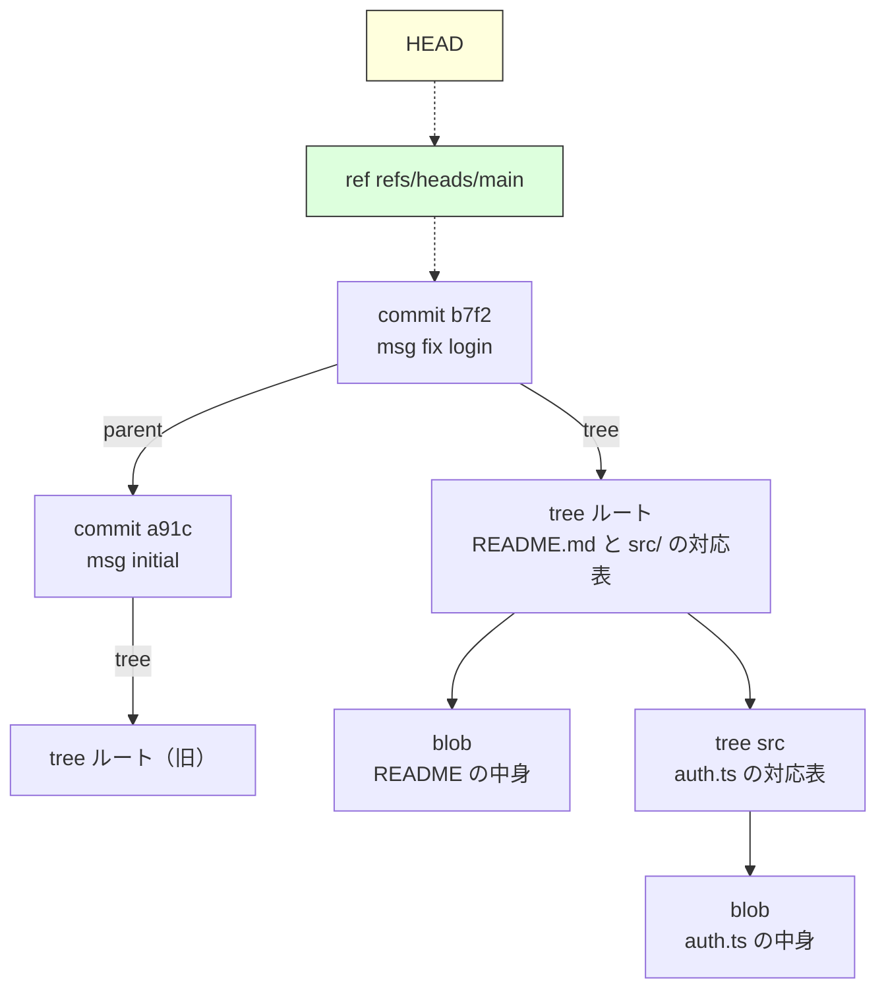
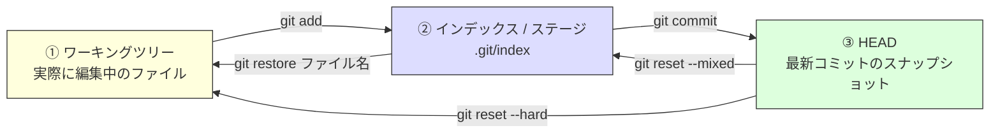
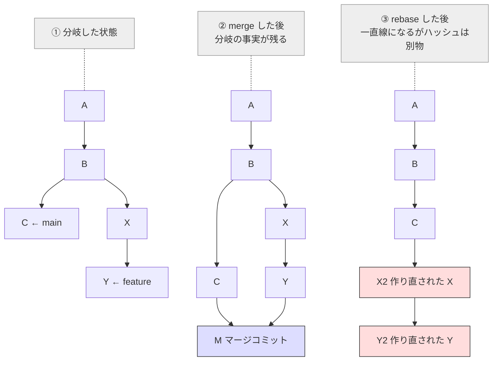
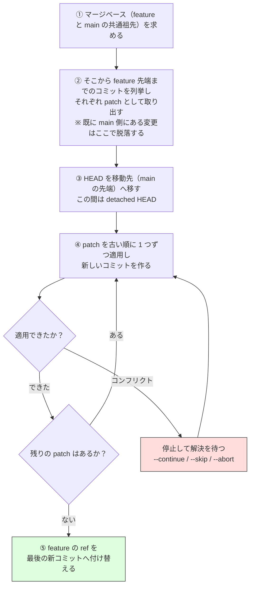
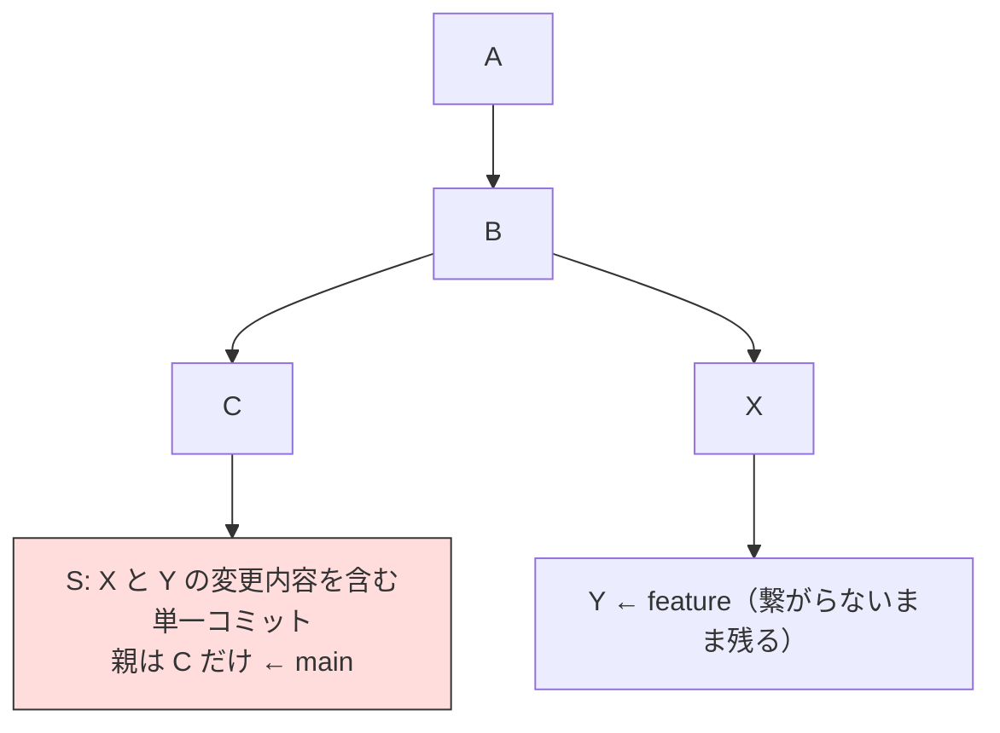
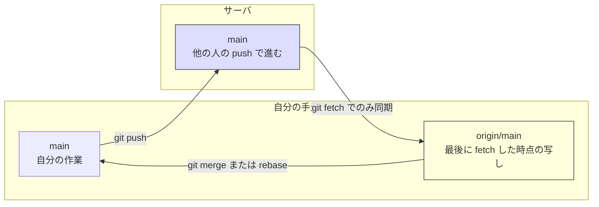

# Git の内部モデルとブランチ操作（Git Internals and Branching）

> **一言で言うと:** Git は「変更差分（diff）を順番に記録する道具」ではなく、**ファイル全体のスナップショットをハッシュ値で名付けて貯めるデータベース + そのスナップショットを親子で繋いだグラフ**である。この 1 点を掴むと、`merge` / `rebase` / `reset` / `revert` が別々の呪文ではなく「同じグラフをどう動かすか」の違いとして一本の線で理解できる。

## まず捨てるべき誤解 — 「コミット = 差分」ではない

多くの人は Git を「変更点を積み上げていくもの」と捉えている。これは **Subversion（SVN）や CVS といった先行ツールの発想**であり、Git には当てはまらない。

- **差分ベース（delta-based）**: リポジトリは「初期状態 + 変更 1 + 変更 2 + …」で構成される。ある時点のファイル内容を知るには、初期状態から差分を順に適用する必要がある
- **スナップショットベース（snapshot-based）**: 各コミットは「その時点のプロジェクト全体の姿」への参照を丸ごと持つ。ある時点の内容を知るには、そのコミットが指す木構造をそのまま読めばいい

> [!info] 用語ミニ辞典
> - **コミット（commit）**: ある時点のプロジェクト全体の状態に、作者・日時・メッセージ・親コミットへの参照を添えて封をしたもの。Git における履歴の最小単位
> - **スナップショット（snapshot）**: ある瞬間の全ファイルの内容一式。「差分」ではなく「その時の完成形そのもの」を指す
> - **リビジョン（revision）**: 履歴上の 1 つの版。Git ではコミットとほぼ同義

ここで **2 つの軸を切り分けておく**と、以降の話がすべて繋がる。混同されやすいが、両者は独立した設計判断である。

- **保存モデル（スナップショット vs 差分）** — 「ある時点のファイル内容をどう復元するか」の話。スナップショットなら、そのコミットが指す木をたどるだけで任意時点の全ファイルが即座に得られる。差分ベースは初期状態から変更を順に再生する必要があり、履歴が長いほど不利になる
- **履歴モデル（DAG vs 線形リビジョン）** — 「ブランチとマージをどう記録するか」の話。Git は各コミットが親を指すため、履歴全体が **DAG（有向非巡回グラフ）** になる。共通祖先（マージベース）の特定は、この DAG を親方向に辿るグラフ探索（[[DFSとBFS]] と同じ考え方）で済む

よく「Git のマージが強いのはスナップショット方式だから」と説明されるが、**マージの強さを支えているのは主に後者の DAG** である。SVN のマージが長らく苦しかったのは保存形式が差分だからではなく、**ブランチが単なるディレクトリのコピーであり、「どのリビジョンをどこへマージ済みか」を記録する構造を持たなかった**（1.5 で `mergeinfo` が入るまで無かった）ためだった。

一方、スナップショット方式が効くのは別のところである。**任意時点のツリーを差分再生なしに取り出せること**、そしてファイル名ではなく内容のハッシュで追跡するために **リネームや移動を後から検出できること**（`git log --follow` や差分表示のリネーム検出）。「何が速くなるのか」を保存モデルと履歴モデルに割り振って理解しておくと、他の VCS を評価するときの物差しになる。

なお「スナップショットだとディスクが爆発するのでは？」という疑問は正しい直感だが、**保存層では packfile（パックファイル）という圧縮形式で似たオブジェクト同士を delta 圧縮している**。つまり「論理モデルはスナップショット、物理保存は差分圧縮」と層が分かれている。ユーザーが考えるべきは論理モデルの方だけでよい。

## 4 つのオブジェクトと 1 つの矢印

Git が扱うオブジェクトは、たった 4 種類しかない（実際の `.git/objects/` には、これらに加えて後述の packfile なども置かれる）。

| オブジェクト | 役割 | 身近な比喩 |
|---|---|---|
| **blob** | ファイルの中身そのもの（ファイル名は持たない） | 名前のない紙 1 枚 |
| **tree** | 「このファイル名 → この blob」「このディレクトリ名 → この tree」の対応表 | ファイル名が書かれた仕分け箱 |
| **commit** | ルート tree + 親コミット + 作者 + メッセージ | 箱に貼った日付入りのラベル |
| **tag（annotated）** | 特定コミットに付ける注釈付きの名札 | 「v1.2.0 リリース版」の付箋 |



ここで決定的に重要なのが、図の上部にある 2 つの点線（`HEAD` → ブランチ → コミット）である。

- **ブランチ（branch）は「コミットを指す 41 バイトのテキストファイル」でしかない** — `.git/refs/heads/main` の中身は、コミットのハッシュ値（40 文字）+ 改行が 1 行あるだけ。ブランチを作るのが一瞬なのはこのためで、「ブランチを切る = ファイルを 1 つ作る」に等しい
    - ただし `git gc` が走ると ref は `.git/packed-refs` に集約され、**個別ファイルは消える**。`cat .git/refs/heads/main` が「そんなファイルはない」と言い出しても壊れてはいない。中身の確認は実装に依存しない `git rev-parse main` を使う（近年は reftable という新しい保存形式も追加されており、ファイル配置に依存した確認方法はいずれ通用しなくなる）
- **HEAD は「いま自分がどのブランチにいるか」を指す矢印** — 通常は `ref: refs/heads/main` のようにブランチ名を指す

> [!info] 用語ミニ辞典
> - **ref（リファレンス）**: コミットのハッシュ値に付けた人間向けの別名。ブランチもタグもリモート追跡ブランチも、実体はすべて ref
> - **HEAD**: 現在チェックアウトしているブランチ（またはコミット）を指す特別な ref。「作業中の位置」を表す

「ブランチを切ったらファイルがコピーされる」という直感は完全に間違いで、**新しいオブジェクトは 1 つも作られない**。この軽さこそが、Git が「小さなブランチを大量に作って捨てる」開発スタイル（[[CI-CD]] のトランクベース開発）を可能にした理由である。

## なぜ名前がハッシュ値なのか — 内容アドレスと改ざん検知

Git のオブジェクト名は、内容そのものから計算したハッシュ値である（既定では SHA-1。後述のとおり SHA-256 も選べる）。これを**内容アドレス指定（content-addressable）** と呼ぶ。

> [!info] 用語ミニ辞典
> - **ハッシュ値**: 任意長のデータから固定長の値を計算する一方向関数の出力。内容が 1 バイトでも違えば全く異なる値になる（→ [[暗号アルゴリズム]]）
> - **内容アドレス指定**: 「どこに置いたか」ではなく「中身が何か」でデータを名付ける方式。同じ内容は必ず同じ名前になる

この設計が同時に 3 つの問題を解いている点が Git の巧妙さである。

1. **重複排除** — 同じ内容のファイルは、何百回コミットしても blob は 1 つしか作られない
2. **分散環境での ID 衝突回避** — 中央サーバに問い合わせず、各自の手元で採番しても ID がぶつからない。連番方式（SVN のリビジョン番号）では中央サーバが必須になる
3. **履歴の改ざん検知** — 各コミットが親のハッシュを内容に含むため、履歴全体が **Merkle DAG（ハッシュで連鎖した有向非巡回グラフ）** になる。過去のコミットを 1 文字書き換えると、そこから先の全コミットのハッシュが変わる。「気づかれずに歴史を書き換える」ことが構造的に不可能

3 番目は blockchain と同じ発想である。ただしどちらが元祖というわけではなく、**ハッシュで木構造を連鎖させる考え方自体は Merkle が 1979 年に示したもの**で、Git（2005 年）はそれを分散バージョン管理に、Bitcoin（2008 年）は分散台帳に応用した兄弟のような関係にある。「Git を理解しておくと blockchain の説明がすんなり入る」のはこのため。

自分の手でハッシュを計算してみると、この仕組みが腑に落ちる。Git は `<型> <バイト長>\0<中身>` という形式のバイト列に対して SHA-1 を取っているだけである。

```python
# hash_blob.py — git hash-object の中身を手で再現する
import hashlib

content = b"hello\n"                      # ファイルの中身
header = f"blob {len(content)}".encode()  # "blob 6"
store = header + b"\x00" + content        # ヘッダ + NUL 区切り + 本体

print(hashlib.sha1(store).hexdigest())
# => ce013625030ba8dba906f756967f9e9ca394464a
```

```bash
# 同じ値になることを Git 自身で確認する
$ printf 'hello\n' | git hash-object --stdin
ce013625030ba8dba906f756967f9e9ca394464a
```

保存されたオブジェクトは zlib で圧縮されているだけなので、Git を使わず直接読むこともできる。

```typescript
// read-object.ts — .git/objects からオブジェクトを直接読む
// 使い方: npx tsx read-object.ts ce013625030ba8dba906f756967f9e9ca394464a
import { readFileSync } from "node:fs";
import { inflateSync } from "node:zlib";

const oid = process.argv[2];
// オブジェクトは 先頭2文字がディレクトリ名 / 残り38文字がファイル名 に分けて置かれる
// （1 ディレクトリにファイルが集中して遅くなるのを避けるための工夫）
const path = `.git/objects/${oid.slice(0, 2)}/${oid.slice(2)}`;

const raw = inflateSync(readFileSync(path));   // zlib 展開
const nul = raw.indexOf(0);                     // ヘッダと本体の区切り
console.log("header:", raw.subarray(0, nul).toString());  // 例: "blob 6"
console.log("body  :", raw.subarray(nul + 1).toString()); // 例: "hello"
```

> このスクリプトは **loose object（個別ファイルとして置かれた状態）** にのみ有効。`git gc` が走ると複数オブジェクトが packfile にまとめられ、このパスにファイルは存在しなくなる。その場合は `git cat-file -p <oid>` を使う。「ファイルが消えた」ように見えて実は pack に移動しただけ、というのは初見で必ず戸惑うポイント。

なお SHA-1 は暗号学的には破られている（2017 年に Google と CWI が実用的な衝突を公表した "SHAttered"）。Git は **SHA-1DC**（衝突検出付き SHA-1）という実装に切り替え、既知の攻撃パターンを持つ入力を拒否することで対処している。さらに Git 2.29 以降は SHA-256 を使うリポジトリを作成できる。

ただし SHA-256 対応は現在も **実験的な位置づけ**であり、決定的な制約として **SHA-1 リポジトリとの相互運用（両者の間での push / fetch）が未実装**である。つまり既存リポジトリの移行経路が事実上存在せず、主要ホスティングサービスも対応していない。既定が依然 SHA-1 なのは「Git 開発者が怠慢だから」ではなく、**世界中の既存リポジトリ・CI・ツール群との互換性という、暗号強度とは別次元の制約が効いているから**である。「技術的に優れた後継があっても、移行経路が無ければ普及しない」というエコシステム設計の典型例として覚えておくとよい。

## 3 つのツリー — Git 操作の混乱はここに集約される

Git を使っていて「何が起きたのか分からない」となる場面のほとんどは、**3 つの状態を混同している**ことが原因である。



> [!info] 用語ミニ辞典
> - **ワーキングツリー（working tree）**: エディタで開いている、実ファイルとしてのディレクトリの状態
> - **インデックス / ステージングエリア（index / staging area）**: 「次のコミットに含める内容」を組み立てる中間置き場。`.git/index` という 1 つのバイナリファイルの実体を持つ
> - **HEAD**: 直前のコミットが持つスナップショット。「コミット済みの状態」

多くの VCS には ② がない。Git がわざわざ中間層を設けたのは、**「作業単位」と「コミット単位」を分離するため**である。1 回の作業で 3 つの関心事を触ってしまったとき、`git add -p` を使えば関心事ごとに分けてコミットできる。これは [[関心の分離]] をコミット履歴に適用する行為であり、後述の `git bisect` の効きにも直結する。

> [!tip] `git add -p` の粒度
> `-p`（`--patch`）が提示する単位は **ハンク（hunk）** — 連続した変更行のかたまりである。行単位で選びたいときは、プロンプトで `s` を押してハンクをより小さく分割し、それでも足りなければ `e` で手編集する。「`-p` = 行単位」と覚えていると、隣接する行が 1 ハンクにまとめられたときに戸惑うことになる。

### reset の 3 モードは「どこまで巻き戻すか」の指定

`git reset` が分かりにくいのは、1 つのコマンドで 3 つのツリーのうち「どこまで」を動かすかを切り替えているからである。上の図を見ながらこの表を読むと、丸暗記が不要になる。

| モード | ① ワーキングツリー | ② インデックス | ③ HEAD（ブランチの指す先） | 典型的な用途 |
|---|---|---|---|---|
| `--soft` | そのまま | そのまま | 動く | 直前の複数コミットを 1 つにまとめ直す |
| `--mixed`（既定） | そのまま | 巻き戻る | 動く | ステージを取り消す（`git add` の取り消し） |
| `--hard` | **巻き戻る** | 巻き戻る | 動く | 作業を全部捨ててやり直す |

**`--hard` だけが危険**なのは、①（まだ Git が一度も記録していない編集内容）を破壊するからである。救出可能性は 3 段階に分かれており、ここを混同すると「戻せるはず」と思って戻せない事故になる。

| 失ったもの | 救出手段 | 理由 |
|---|---|---|
| ③ コミット済みの状態 | `git reflog`（後述） | reflog が「HEAD やブランチが過去に指していた位置」を記録している |
| ② `git add` 済み・未コミットの内容 | `git fsck --lost-found` | **`add` した時点で blob オブジェクトは書き込まれている**。ただし reflog は ref の移動しか追わないため、reflog には現れない |
| ① 編集しただけ・未 `add` の内容 | **なし** | Git に一度も渡していないので、どこにも記録が存在しない |

**「Git に一度でも渡したものは大抵取り戻せる、渡していないものは取り戻せない」** が全体を貫く原則である。②が `git fsck` 頼りになる（＝ハッシュの一覧から中身を目視で探す必要がある）点も踏まえると、危険な操作の前にとりあえずコミットしておく価値が分かる。

## merge と rebase — 同じ目的、違うグラフ

機能ブランチの変更を main に取り込む方法は 2 つある。どちらが優れているかではなく、**「履歴を事実の記録とみなすか、読み物とみなすか」** という価値観の違いである。



> 図中の `X2` `Y2` は、本文で `X'` `Y'` と書いているものと同じ「作り直されたコミット」を指す。

決定的な違いは、**rebase 後の `X'` `Y'` は元の `X` `Y` とは別物**という点である。親コミットが変わればコミットの内容が変わり、内容が変わればハッシュが変わる（＝内容アドレス指定の必然的な帰結）。**rebase は「コミットを移動する」のではなく「同じ変更内容で新しいコミットを作り、古いものを捨てる」操作**である。

ここから、有名な鉄則が導かれる。

> **他人が既に取得したコミットを rebase してはいけない。**

理由は「マナー」ではなく力学である。相手の手元には旧 `X` `Y` が残っているため、あなたが `X'` `Y'` を force push した後に相手が `git pull` すると、**同じ変更が 2 セット存在する状態**になり、解決の難しいコンフリクトを生む。

ただしこの鉄則は、しばしば「**push したら rebase 禁止**」という形で覚えられており、それは条件を取り違えている。危険の本質は push の有無ではなく、**そのコミットを他人が自分の作業のベースにしているか**である。

| ブランチの性格 | rebase してよいか | 理由 |
|---|---|---|
| まだ push していない自分のブランチ | ✅ 完全に安全 | 旧コミットを持っている人が存在しない |
| **レビューのために push しただけの自分の PR ブランチ** | ✅ **`--force-with-lease` 前提で可** | 他人は「読んでいる」だけで、その上にコミットを積んでいない。GitHub の PR はこの運用を前提に設計されている（force push しても PR は壊れず、差分は追記される） |
| 同僚が続きを書いている共同ブランチ | ⚠️ 事前合意が必須 | 相手の手元に旧コミットが積まれている |
| `main` / `develop` など共有の本線 | ❌ 絶対に不可 | 全員のベースが崩れる |

つまり **rebase は「公開したら封印する技」ではなく、「自分の責任範囲の履歴を整える技」**である。この線引きが分かると、後述する「レビュー中は追記し、マージ前に整形する」という実務の型が自然に導かれる。force push の作法（`--force-with-lease` / `--force-if-includes`）は「ref は 3 種類ある」の節で扱う。

### fast-forward と `--no-ff`

分岐していない（main が feature の祖先のまま動いていない）場合、merge はマージコミットを作らずブランチの指す先を進めるだけで済む。これが **fast-forward（早送り）**。履歴は綺麗になるが、「ここからここまでが 1 つの機能だった」という情報が失われる。`--no-ff` を付けると常にマージコミットを作り、機能の境界を履歴に残せる。**GitHub の "Create a merge commit" 設定は実質これ**であり、squash / rebase merge を含めた 3 択はチームの履歴観をそのまま反映する（→ 後述「PR のマージ方式 3 択」）。

### rebase の内部で起きていること

`git rebase main` を実行したとき Git が行うのは、魔法ではなく単純なループである。ここを知っていると、途中で止まったときに慌てなくなる。



この「1 コミットずつ再生する」構造から、実務で効く帰結がいくつも導かれる。

- **コンフリクトは「コミットの数だけ」起こりうる** — merge のコンフリクト解決が原則 1 回で済むのに対し、rebase は各コミットの適用時点で止まる。10 コミットを rebase すれば最大 10 回解決することになる。「さっきと同じ衝突をまた解いている」と感じるのはこのためで、`git config --global rerere.enabled true` で **rerere（reuse recorded resolution = 記録した解決の再利用）** を有効にすると、一度解いた結果を Git が覚えて同じ衝突に自動適用してくれる
- **止まったら 3 択しかない** — 解決して `git rebase --continue` / そのコミットを捨てて `--skip` / **すべて無かったことにして `--abort`**。`--abort` は開始前の状態へ完全に戻すため、状況が読めなくなったらまず `--abort` でよい。**`--skip` は「そのコミットの変更を丸ごと捨てる」**操作であり、衝突から逃れる手段として使うものではない
- **既に取り込み済みの変更は黙って落ちる** — ②で Git は各コミットの **patch-id（変更内容そのものから計算するハッシュ。コミットのハッシュとは別物で、親が違っても内容が同じなら一致する）** を取り、移動先に同じ内容が既にあるコミットを再生対象から外す。cherry-pick 済みのコミットが rebase 後に消えて「コミット数が減った」と驚くのはこれが正体で、**壊れたのではなく重複を防いでいる**。逆に言えば、**まとめて畳まれてしまった変更（→ 後述の squash）はこの照合に引っかからない**ため、同じ内容が二度適用される事故が起きる
- **開始前の位置は `ORIG_HEAD` に残る** — 終わった直後に「やはり戻したい」となれば `git reset --hard ORIG_HEAD` の 1 手で済む。ただし **`ORIG_HEAD` は次の `merge` / `reset` / `pull` で上書きされる**ため、時間が経ってからの救出は reflog が正になる（→「迷子になったときの唯一の命綱」）
- **rebase 中は detached HEAD** — ④ の途中は HEAD がブランチを指していない。この状態で新規コミットを重ねると迷子になりやすい（→「よくある落とし穴」）

> [!tip] `--onto` — 「どこから先を、どこへ」を明示する
> `git rebase --onto <移動先> <この地点より後ろを> <このブランチで>` の 3 引数形式を覚えると、「間違った親ブランチから切ってしまった feature を正しい親へ付け替える」といった操作が 1 コマンドで終わる。
> ```bash
> # feature を、wrong-base ではなく main から生えていたことにする
> $ git rebase --onto main wrong-base feature
> ```

> [!warning] 積み上げブランチ（stacked branches）と `--update-refs`
> `main → A → B → C` と依存する PR を重ねている場合、根元を rebase すると **途中のブランチの ref が古いコミットを指したまま取り残される**。Git 2.38 以降は `git rebase --update-refs`（`git config rebase.updateRefs true` で既定化）が、rebase 範囲に含まれる他ブランチの ref も一緒に張り替えてくれる。

### 対話的 rebase — 履歴を「読み物」に整える

`git rebase -i <起点>` は、起点より後のコミット一覧をエディタで開き、**1 行 1 コミットの指示書（todo リスト）** として編集させる。Git はその指示を上から順に実行するだけである。

| 指示 | 短縮 | 何をするか |
|---|---|---|
| `pick` | `p` | そのまま採用する（既定） |
| `reword` | `r` | 変更内容はそのまま、コミットメッセージだけ書き直す |
| `edit` | `e` | そのコミットの直後で停止し、内容を修正させる（1 コミットの**分割**にも使う） |
| `squash` | `s` | **直前のコミットへ統合し**、メッセージは両方を並べたものを編集して 1 つにする |
| `fixup` | `f` | 直前のコミットへ統合するが、**こちら側のメッセージは捨てる** |
| `drop` | `d` | そのコミットを丸ごと無かったことにする |
| `exec` | `x` | 任意のコマンドを実行する（`x npm test` を挟めば各コミットが単体で通るか検証できる） |

行の**並び替え**も可能で、それがそのままコミット順序の変更になる。なお todo リストは **上が古く下が新しい** — `git log` の表示（上が新しい）と逆順である点は、最初に必ず戸惑うところ。

実務で最も使うのは `squash` / `fixup` による**統合**である。レビュー往復のなかで "typo fix"、"レビュー指摘対応"、"ロールバック" といったコミットが増えたまま main に入れると、後から履歴を読む人にとって「何をした変更なのか」が判別できなくなる。ここで効くのが `--autosquash`。

```bash
# 「これは 9d1e4b8 への修正だ」という印を件名に付けてコミットする
$ git commit --fixup=9d1e4b8

# 印を読んで自動で並べ替え、fixup 指示を入れた状態で todo を開く
# 起点は「畳みたい一番古いコミットの 1 つ前」を指定する
$ git rebase -i --autosquash 9d1e4b8~

# 対象がリポジトリ最初のコミットの場合、その「1 つ前」は存在しないため ~ は使えない
$ git rebase -i --autosquash --root
```

`--fixup` がしているのは `fixup! <元のコミットの件名>` という規約どおりの件名を付けることだけで、`--autosquash` がそれを解釈して行の移動と `fixup` 化を行う。**規約を決めて機械に解釈させる**という、Git の随所に見られる設計パターンの一例である（`git config rebase.autoSquash true` で既定化できる）。

なお `git commit --amend` は「直前の 1 コミットだけを対象にした対話的 rebase」と考えてよい。**新しいコミットを作って古いものを捨てている**点は rebase と同じであり、したがって **push 済みのコミットに対する `--amend` は rebase と同じ危険を持つ**。

### revert は「打ち消すコミットを新たに積む」

| コマンド | グラフへの影響 | 公開済みブランチで使えるか |
|---|---|---|
| `git reset` | ブランチの指す先を過去へ戻す（履歴が消えたように見える） | ❌ 使ってはいけない |
| `git revert` | 逆の変更を持つ**新しいコミットを追加**する | ✅ これが正解 |

本番に出た変更を戻すときは必ず `revert`。履歴が増えるのを嫌って `reset` + force push するのは、[[CI-CD]] のロールバック戦略として最悪の選択になる（他の開発者の手元と食い違い、監査証跡も失われる）。

## squash — 「複数コミットを 1 つに畳む」3 つの経路

「squash（潰す）」という語は文脈によって別の操作を指すため、混乱の元になっている。実体は 3 つあり、**すべて結果として親が 1 つのコミットを作る**という点で共通している。

| 経路 | コマンド / 操作 | 何が起きるか |
|---|---|---|
| ① 自分の履歴を整える | `git rebase -i` の `squash` / `fixup` | 自分のブランチ内の複数コミットを、1 つの新コミットとして作り直す |
| ② 取り込むときに畳む | `git merge --squash <branch>` | 相手ブランチの変更内容を**インデックスに載せるだけ**（コミットは自分で行う）。**マージコミットにはならず、相手ブランチは親にならない**。続く `git commit` には `.git/SQUASH_MSG` に書き出された**元コミットのメッセージ一覧**が初期値として入るので、そこから要約を書く |
| ③ ホスティング側で畳む | GitHub の "Squash and merge" 等 | PR 内の全コミットを 1 つにまとめて base ブランチへ載せる。実質 ② の自動化 |

②③ で決定的に重要なのは、**「マージした」という親子関係がグラフに一切残らない**ことである。ここが最大の落とし穴になる。



`S` は**内容としては** `X` + `Y` を含んでいる。しかし **グラフ上は feature と一切繋がっていない**。Git が「マージ済みか」を判定する手段は親子関係の探索だけなので、次のことが起こる。

- `git branch --merged` に feature が現れない（マージ済みと認識されない）
- **同じ feature ブランチを後から再び main へマージすると、`X` `Y` が「まだ入っていない変更」として再適用される** — マージベースは `S` ではなく `B` のままだから
- マージベースが更新されないため、**長命ブランチほど main を取り込み直すたびに、既に入っているはずの変更をめぐって衝突が増えていく**

2 番目が具体的に何を引き起こすかは、**squash 後に main が動いたかどうか**で変わる。ここを「必ず全面コンフリクトになる」と覚えると、かえって本当の危険を見落とす。

| squash 後の main の状態 | 再マージの結果 | 危険度 |
|---|---|---|
| 何も変更されていない | 両サイドの内容が一致するため **黙ってクリーンに通る**（実質 no-op） | 低（ただし「問題ない」と誤学習する） |
| `S` の内容に**後続修正 `F` が入った** | `B` 起点の `X` `Y` と `F` が同じ箇所を争い、**コンフリクトする** | **高** |
| feature 側が**続きのコミット `Z` を積んだ** | `Z` だけを入れたいのに、`X` `Y` まで再適用対象になり衝突する | **高** |

真の実害は「コンフリクトが出ること」そのものではない。**コンフリクト画面で「自分のブランチ側（feature）が正しいはず」と考えて theirs を採用すると、main に入っていた後続修正 `F` が静かに巻き戻る**ことである。衝突は目に見えるが、巻き戻しは目に見えない。squash merge 運用でのリグレッションはほぼこの経路で起きる。

したがって squash merge を採用する場合の作法は一つに定まる。**マージしたら feature ブランチは即座に削除し、二度と使わない**。短命ブランチを前提とするトランクベース開発と squash merge の相性が良いのは偶然ではなく、この制約から要請されている（→ [[CI-CD]]）。

> [!tip] 消し忘れたブランチが「もう入っているか」を調べる
> 親子関係が残っていない以上 `git branch --merged` は使えない。判定は **変更内容（patch-id）での照合**に切り替える（rebase が重複コミットを自動で落とすのと同じ仕組み → 「rebase の内部で起きていること」）。
> ```bash
> # feature の各コミットが main に内容として入っているかを判定する
> # 行頭が「-」なら「内容は既に main にある」、「+」なら「まだ無い」
> $ git cherry -v main feature
> - 4a1c9e2 add password validation     # ← squash されて既に main にある
> + 8f3b7d1 fix typo in error message   # ← これだけが未反映
> ```
> `+` が付いたものだけを新しいブランチへ cherry-pick すれば、再マージによる巻き戻し事故を避けて取りこぼしを回収できる。

> [!info] 用語ミニ辞典
> - **マージベース（merge base）**: 2 つのブランチの直近の共通祖先コミット。マージ処理の基準点になる
> - **3-way merge**: 「マージベース」「自分」「相手」の 3 点を突き合わせる方式。片方だけが変えた箇所は自動で採用し、**両方が同じ箇所を変えたときだけ**コンフリクトとする。squash merge がこの基準点を更新しないことが、上記の再マージ事故の直接原因である

### PR のマージ方式 3 択 — 何を得て何を捨てるか

GitHub / GitLab の設定にある 3 択は、そのまま**チームが履歴を何だと思っているか**の表明になる。「綺麗だから」で選ぶものではない。

| 方式 | main の履歴の形 | 得るもの | 捨てるもの |
|---|---|---|---|
| Merge commit（`--no-ff` 相当） | 分岐が残る | 起きたことの完全な記録。機能の境界が残り、`git revert -m 1 <merge>` で PR 単位のロールバックができる | 読みやすさ。並行開発が多いと `git log --graph` が絡まる |
| Squash and merge | 一直線・**1 PR = 1 コミット** | main の履歴が PR 単位で読める。作業中の "WIP" が消え、revert も 1 コマンド | PR 内の中間コミット。`git bisect` の粒度が PR 単位まで粗くなる |
| Rebase and merge | 一直線・**中間コミットも全部残る** | 直線でありながら bisect の粒度が最も細かい | 全コミットが作り直されるうえ、**中間コミットが単体でビルド・テストを通る保証がない**（レビューで検証されていない状態が main に並ぶ） |

**Squash and merge を選ぶなら「PR を小さく保つ」が必ずセットの規律になる。** 1 PR に 2000 行を詰め込んで squash すると、障害時の二分探索（→ [[バイナリサーチ]]）が「この巨大な 1 コミットが怪しい」までしか絞れず、bisect の価値がほぼ消える。逆に PR が小さければ、squash 後の 1 コミットがそのまま意味のある変更単位になり、**履歴の可読性と bisect の効きが両立する**。方式そのものより、**選んだ方式が要求する規律を守れるか**が本質である。

## ref は 3 種類ある — `origin/main` の正体

チーム開発での事故で最も多いのは、`main` と `origin/main` を取り違えることである。名前は似ているが、実体はまったく別のものを指している。

| ref | 実体 | 誰が更新するか |
|---|---|---|
| `main`（ローカルブランチ） | `.git/refs/heads/main` | 自分のコミット・マージ |
| `origin/main`（リモート追跡ブランチ） | `.git/refs/remotes/origin/main` | **自分が `fetch` / `pull` した瞬間だけ** |
| リモート側の `main` | GitHub 等のサーバ上にある ref | 他の開発者の push |

決定的なのは真ん中の行である。**`origin/main` はリモートの現在の状態ではなく、「最後に fetch したときのリモートの姿」を写し取った *ローカルの* ref にすぎない。** ネットワークが切れていても `git log origin/main` が即座に返るのはこのためで、裏を返せば **fetch していない間の `origin/main` は古い情報**である。



この一枚が分かると、日常の疑問がまとめて解ける。

- **`git pull` = `git fetch` + `git merge origin/main`** — pull は「取ってくる」と「統合する」の 2 動作の合成にすぎない。既定の統合方法が merge なので、分岐しているとマージコミットが積まれる（後述の落とし穴 3）
- **push が rejected される理由** — サーバ側の先端が自分のコミットの祖先に含まれていない、つまり **push すると他人のコミットを取りこぼす**と判定されたときに拒否される。正しい対処は fetch して統合すること。`--force` はこの安全装置そのものを外す行為である
- **`--force-with-lease` が「まだしも安全」と言える根拠** — push の直前に「**自分の `origin/main`（＝最後に見たリモートの姿）と、いまサーバにある実際の ref が一致しているか**」を検証し、ズレていれば失敗する。つまり「自分が知らない間に誰かが進めていないこと」を条件付きで force する。裸の `--force` にはこの検証が一切ない
  - ただし万能ではない。IDE やエディタが裏で自動 fetch していると `origin/main` が勝手に更新され、**人間は見ていないのに「見たことになる」**ため検証をすり抜ける。「lease（借用）」という控えめな命名は、この限界を踏まえたもの
  - **この穴を塞ぐのが `--force-if-includes`**（Git 2.30 で追加）。「リモート追跡 ref が更新されたか」ではなく「**自分がこれから push しようとしているコミットが、その更新後の先端を実際に取り込んだ上で作られたか**」を検証する。裏で fetch されただけで自分が統合していなければ失敗するため、自動 fetch による誤検知を打ち消せる
    ```bash
    # --force-with-lease に自動で付くようにしておく（既定では有効にならない）
    $ git config --global push.useForceIfIncludes true
    ```
  - 3 者の関係を一言でまとめると、**`--force`（何も見ない）< `--force-with-lease`（ref が動いていないか見る）< `+ --force-if-includes`（動いた分を自分が取り込んだか見る）**。PR ブランチを rebase して push し直す運用なら、最後の設定まで入れておくのが実務上の既定値になる

## 迷子になったときの唯一の命綱 — reflog

`reset --hard` で**コミットを**消した、rebase に失敗した、ブランチを消した——これらは **ほぼ全て `git reflog` で戻せる**（未コミットの編集が対象外である点は「3 つのツリー」の表を参照）。

```bash
# HEAD がこれまで指してきた位置の履歴を表示する
$ git reflog
b7f2a1c HEAD@{0}: reset: moving to HEAD~3
9d1e4b8 HEAD@{1}: commit: add password validation   # ← 消したはずのコミット
3c8a0f2 HEAD@{2}: commit: refactor auth module

# 消えたと思ったコミットへブランチを復活させる
$ git branch rescue 9d1e4b8
```

reflog は「ブランチやタグから辿れなくなったコミット」への参照を一定期間（既定で到達可能なもの 90 日 / 到達不能なもの 30 日）保持する。**Git がオブジェクトを即座には削除しない**——`git gc` が走るまで生き残る——という性質が救出を可能にしている。

ただし reflog は **ローカルのみ**、かつ **一度もコミットしていない編集は対象外**である。だからこそ「危険な操作の前にとりあえずコミットする」「作業中でも `git stash` を挟む」という習慣が効く。

## よくある落とし穴

1. **`.gitignore` は既に追跡されているファイルには効かない** — `.gitignore` は「まだ追跡していないファイルを追跡候補から外す」ルール。誤ってコミット済みなら `git rm --cached <file>` で追跡を外してからコミットする必要がある
2. **一度コミットした秘密情報は「消せない」** — 履歴書き換え（`git filter-repo` 等）で自分のリポジトリからは消せても、他人のクローン、フォーク、GitHub 側に残った PR の ref、CI のキャッシュには残る。**唯一の正しい初動は該当キーの失効と再発行**であり、履歴の掃除は二次対応（→ [[サプライチェーンセキュリティ]]）
3. **`git pull` の既定は merge** — 分岐していると意図しないマージコミットが積まれる。`git config --global pull.rebase true` か `git pull --ff-only` を既定にしておくと事故が減る
4. **detached HEAD でのコミットは行方不明になりやすい** — タグや過去コミットを直接 checkout した状態（HEAD がブランチではなくコミットを直接指す）でコミットしても、どのブランチからも辿れない。ブランチを切ってから作業するか、離脱時の警告に出るハッシュを控える
5. **マージコミットの revert には `-m` が必要** — 親が 2 つあるため「どちらを本線とみなすか」を `git revert -m 1 <merge>` で指定する。さらに厄介なのは、**revert したブランチを後で再マージしても変更が戻らない**こと（Git は「一度マージ済み」と判断する）。再投入したいときは「revert の revert」を行う
6. **大きなバイナリは履歴に永住する** — 100 MB の動画を 1 度コミットして次で消しても、clone すると全員がその 100 MB を取得する。画像・動画・ビルド成果物は Git LFS か外部ストレージへ
7. **改行コードの差異（Windows / Unix）** — `core.autocrlf` の設定違いで「1 文字も変えていないのに全行が差分になる」現象が起きる。チームでは `.gitattributes` に `* text=auto eol=lf` を書いて**リポジトリ側で正解を固定する**のが定石（設定を個人任せにしない）
8. **`checkout` の多義性** — `git checkout` は「ブランチ切替」と「ファイルの復元」という無関係な 2 責務を持っていた。Git 2.23 で `git switch`（ブランチ）と `git restore`（ファイル）に分離されたのは、まさに [[関心の分離]] の適用例。新しく学ぶなら後者 2 つを使う
9. **squash merge したブランチを消さずに使い回す** — 親子関係が残らないため Git は「未マージ」とみなし続ける。再度マージすると同じ変更が再適用対象になり、**main 側の後続修正と衝突する（そして解決を誤ると後続修正が巻き戻る）**。main が無変更なら黙って通ってしまうのが厄介で、「問題ない」と誤学習しやすい。**squash merge の直後にブランチを削除する**のが唯一の運用（→「squash — 3 つの経路」）
10. **`git pull --rebase` は自分のコミットを作り直す** — 事故は減るが、ローカルコミットのハッシュは毎回変わる。同じブランチを複数マシンや同僚と共有している場合は、rebase の鉄則がそのまま当てはまることを忘れない

## AI 実装のアンチパターン

AI コーディングエージェントは「エラーを消す」方向に最適化されがちで、Git 操作では**取り返しのつかない提案**が混ざる。以下は特に警戒すべきもの。

| アンチパターン | なぜ問題か | 正しい対処 |
|---|---|---|
| hook が失敗したので `git commit --no-verify` を提案 | lint / テスト / シークレット検出を意図的に迂回している。CI で落ちるだけならまだしも、検出器を黙らせて機密を混入させうる | hook の失敗内容を直す。迂回が必要なら理由をコミットメッセージに残す |
| `git push --force` をそのまま提案 | 他人が push した内容を無言で消し飛ばす | `--force-with-lease`（自分が見た時点から相手が進めていたら失敗する）を使う |
| 状態が壊れたので `git reset --hard` を提案 | **未 `add` の編集は救出手段が一切ない**（`add` 済みでも `git fsck` での発掘が必要）。AI はローカルにどれだけ未保存の作業があるかを知らない | まず `git stash` か作業コミット。破棄は人間が明示的に判断 |
| `git add .` を常用 | 未追跡の `.env`、鍵、`node_modules`、巨大な生成物をまとめて巻き込む | `git status` で確認してから明示的にパス指定。`.gitignore` の整備を先に行う |
| `git commit -am` を常用 | `-a` は**追跡済みファイルの変更・削除のみ**をステージするため未追跡の `.env` は入らないが、**無関係な変更まで 1 コミットに混ざる**。1 コミット 1 関心事が崩れ、bisect と revert の粒度が効かなくなる | `git add -p` で関心事ごとに分けてコミットする |
| 「履歴から秘密情報を消せば安全」と案内 | 前述の通り、他者のクローンやリモートの ref には残る。**漏洩は既に確定している** | キーを即座に失効させる。履歴掃除は二次対応と位置づける |
| 大量の変更を 1 コミットに squash | `git bisect` による原因コミットの二分探索（→ [[バイナリサーチ]]）が効かなくなり、障害時の切り分けが困難になる | 論理的に意味のある単位でコミットを分ける。squash merge 運用なら PR 自体を小さく保つ |
| rebase が止まると `git rebase --skip` を提案 | そのコミットの変更が**丸ごと消える**。エラーは消えて先へ進めるため「直った」ように見えるのが最も危険 | 内容を確認して `--continue`。判断できなければ `--abort` で開始前へ戻す |
| squash merge 済みのブランチを再び main へマージする手順を提案 | 親子関係が残っていないため同じ変更が再適用対象になる。コンフリクト解決を AI に任せると **main 側の後続修正を巻き戻す** 方向で「解決」されやすい | `git cherry -v main feature` で未反映のコミットだけを特定し、新しいブランチで出し直す |
| push 済みコミットへの `git commit --amend` を提案 | `--amend` は新しいコミットを作って古いものを捨てる操作であり、公開済みコミットの rebase と同じ事故を起こす | 追加のコミットを積む。整理は push 前に `rebase -i --autosquash` で行う |
| `git filter-branch` を提案 | 公式ドキュメントで非推奨とされ、遅くバグも多い | `git filter-repo` を使う |

## 実務での使用シーン

- **障害の原因コミット特定** — `git bisect start` → `bad` / `good` を指定すると、Git が自動で二分探索してくれる。コミットが小さく意味単位で分かれているほど効く。これが「1 コミット 1 関心事」を守る実利
- **レビュー可能な PR を作る** — push 前に `git rebase -i` でコミットを整理（"WIP"、"typo fix" を統合）してから出すと、レビュアーが変更の意図を追える。**誰もこのブランチをベースにしていないので rebase して安全**
- **レビュー指摘への対応** — 指摘ごとに `git commit --fixup=<対象コミット>` で積んでおくと、レビュアーは追加分だけを差分で確認でき、マージ前に `git rebase -i --autosquash` で元のコミットへ畳める。**「レビュー中は追記、マージ前に整形」** が両者の利益を両立させる型。最後の整形で push 済みの履歴を書き換えることになるが、**PR ブランチは他人がベースにしていないため許される**（→「merge と rebase」の判断表）。push は `--force-with-lease` で行う
- **リリースタグとデプロイの紐付け** — [[CI-CD]] パイプラインでイメージタグにコミット SHA を埋めれば、「本番で動いているのはどのコードか」が一意に決まる。`latest` のみのタグ運用が追跡不能になるのはこのため
- **hotfix の本番反映** — 本番タグからブランチを切って修正し、main と release の双方へ取り込む。`revert` でのロールバック手順を事前に決めておく

## 関連トピック

- [[CI-CD]] — 親トピック。トランクベース開発（短命ブランチ + 頻繁な統合）は、本稿のブランチの軽さが前提になっている
- [[関心の分離]] — 1 コミット 1 関心事、`switch` / `restore` の分離はいずれもこの原則の適用例
- [[サプライチェーンセキュリティ]] — コミットしてしまった機密情報の扱い、コミット署名による作者の検証
- [[暗号アルゴリズム]] — SHA-1 の衝突耐性と SHA-256 移行の背景
- [[DFSとBFS]] — マージベース（共通祖先）の探索はコミット DAG のグラフ探索そのもの
- [[バイナリサーチ]] — `git bisect` の中身は二分探索
- [[テスト戦略]] — bisect が効くかどうかは、各コミットでテストが実行可能な状態かに依存する

## 参考リソース

- [Pro Git — 10章 Gitの内側](https://git-scm.com/book/ja/v2/Git%E3%81%AE%E5%86%85%E5%81%B4-%E9%85%8D%E7%AE%A1%E3%81%A8Git%E3%82%AA%E3%83%96%E3%82%B8%E3%82%A7%E3%82%AF%E3%83%88) — 本稿の内容を公式に、より深く扱っている無料書籍
- [git-scm.com — Reference](https://git-scm.com/docs) — 各コマンドの一次情報
- [git-filter-repo](https://github.com/newren/git-filter-repo) — 履歴書き換えの現行推奨ツール
