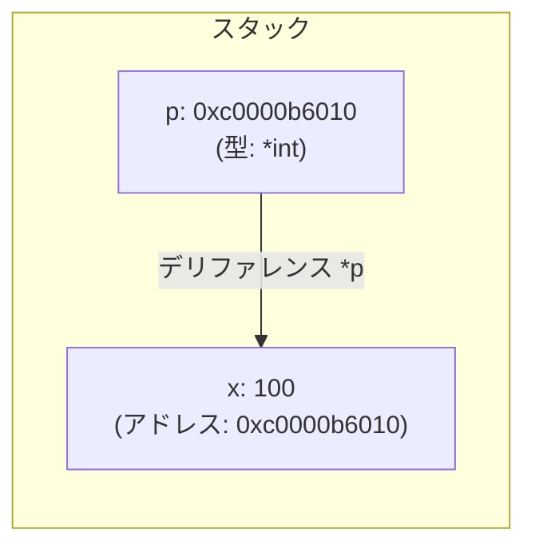
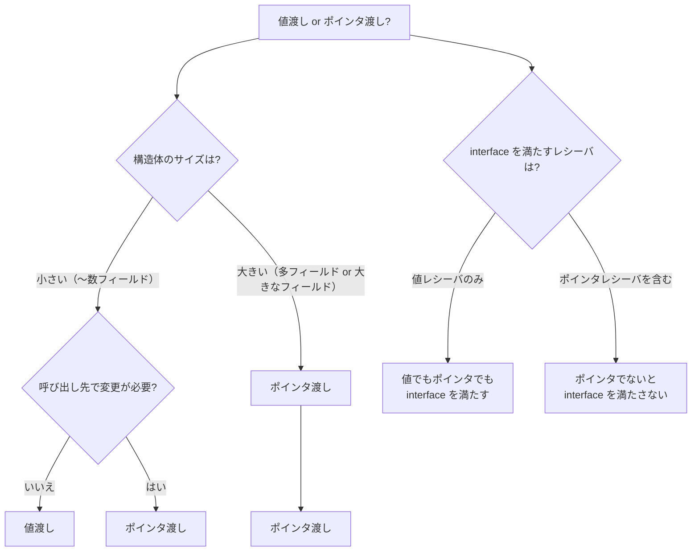
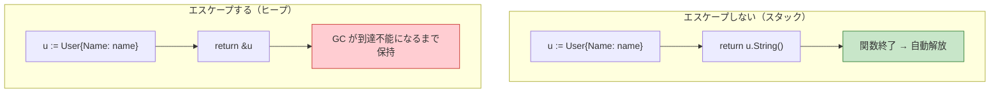

# Go のポインタ（Pointer）

> **一言で言うと:** Go のポインタはメモリアドレスを保持する変数だが、C と異なりポインタ演算が禁止されており、ガベージコレクション（GC）と**エスケープ解析（Escape Analysis）**によって安全に管理される。「値渡しかポインタ渡しか」の判断が Go のパフォーマンスとAPI設計の鍵となる。

## なぜ Go にポインタがあるのか

Java や Python は参照型を暗黙的に扱い、開発者にポインタを意識させない。Go はなぜ明示的なポインタを残したのか。

| 言語 | メモリアドレスの扱い | 開発者の制御度 |
|------|---------------------|---------------|
| **C** | ポインタ演算あり、手動メモリ管理 | 完全な制御（完全な責任） |
| **Go** | ポインタあり、演算なし、GC が管理 | 値とポインタを選択できる |
| **Java** | プリミティブ以外は全て参照（実質ポインタ） | 制御不能（JVM に委任） |
| **Python / Ruby** | 全てがオブジェクト参照 | 制御不能（ランタイムに委任） |

Go がポインタを残した理由:

1. **値セマンティクスとポインタセマンティクスを明示的に使い分ける** — 呼び出し先が元のデータを変更できるか否かをシグネチャで明確にする
2. **不要なヒープアロケーションを避ける** — 小さな構造体を値渡しすればスタック上で完結し、GC の負荷を減らせる
3. **nil による「値がない」の表現** — ポインタ型は `nil` を取れるため、optional な値を自然に表現できる

## 基本構文

```go
package main

import "fmt"

func main() {
	x := 42
	p := &x    // & でアドレスを取得（p は *int 型）
	fmt.Println(*p)  // * でデリファレンス（値を読む）→ 42

	*p = 100         // ポインタ経由で元の変数を変更
	fmt.Println(x)   // 100

	// new() でゼロ値のポインタを生成
	q := new(int)    // *int 型、値は 0
	fmt.Println(*q)  // 0
}
```



## 値渡し vs ポインタ渡し

Go は**すべて値渡し（Pass by Value）**。関数に引数を渡すとコピーが作られる。ポインタを渡すと「アドレスの値」がコピーされるため、呼び出し先から元のデータを変更できる。

```go
package main

import "fmt"

type User struct {
	Name  string
	Email string
	Age   int
}

// 値レシーバ: User のコピーを受け取る → 元は変わらない
func (u User) String() string {
	return fmt.Sprintf("%s (%d)", u.Name, u.Age)
}

// ポインタレシーバ: 元の User を変更できる
func (u *User) SetEmail(email string) {
	u.Email = email
}

func main() {
	user := User{Name: "Alice", Age: 30, Email: "old@example.com"}
	user.SetEmail("new@example.com")
	fmt.Println(user.Email) // new@example.com
}
```

### 使い分けの判断基準



| 観点 | 値渡し | ポインタ渡し |
|------|--------|-------------|
| コピーコスト | 構造体全体をコピー | 8 バイト（64bit 環境のアドレスサイズ） |
| 呼び出し先での変更 | 元のデータに影響しない | 元のデータを変更できる |
| nil の可能性 | なし（常にゼロ値が存在） | `nil` になりうる |
| GC への影響 | スタックに収まりやすい | ヒープにエスケープしやすい |
| 並行安全性 | コピーなのでデータ競合が起きない | 共有データへの競合に注意が必要 |

**実務でのガイドライン:**
- **メソッドレシーバ:** 構造体のどれかのメソッドがポインタレシーバなら、一貫性のため全メソッドをポインタレシーバにする（Go 公式 FAQ の推奨）
- **小さい構造体（〜3 フィールド程度）:** 変更不要なら値渡しが安全。コピーコストは最適化で消えることが多い
- **スライス・マップ・チャネル:** これら自体が内部にポインタを持つ参照型なので、値渡しでも内容は共有される

## エスケープ解析（Escape Analysis）

Go コンパイラは変数のライフタイムを静的に解析し、関数のスコープ内で完結する変数はスタックに、関数外に参照が漏れる変数はヒープに配置する。この判断を**エスケープ解析**と呼ぶ。

```go
// ヒープにエスケープする（ポインタが関数外に漏れる）
func newUser(name string) *User {
	u := User{Name: name} // u はヒープに配置される
	return &u             // 関数外にアドレスを返す → エスケープ
}

// スタックに収まる（ポインタが関数外に漏れない）
func greet(name string) string {
	u := User{Name: name} // u はスタックに配置される
	return u.String()     // 値をコピーして返す → エスケープしない
}
```



エスケープ解析の結果は `go build -gcflags='-m'` で確認できる:

```bash
$ go build -gcflags='-m' main.go
./main.go:10:6: moved to heap: u    # ← ヒープにエスケープした
./main.go:16:6: u does not escape   # ← スタックに収まった
```

### エスケープが発生する主なケース

| パターン | 理由 |
|---------|------|
| ローカル変数のポインタを返す | 関数終了後も参照が生存するため |
| ポインタを interface に渡す | コンパイラが具体的な使用先を追跡できない |
| スライスの容量を超えて append | 新しい配列がヒープに確保される |
| クロージャが外部変数をキャプチャ | クロージャのライフタイムが変数より長い場合 |
| `fmt.Println` 等の `interface{}` 引数 | 引数が `any` (= `interface{}`) にボックス化される |

## nil ポインタ

Go のポインタのゼロ値は `nil`。nil ポインタのデリファレンスはランタイムパニックを引き起こす。

```go
func main() {
	var p *User // nil

	// ❌ パニック: nil pointer dereference
	fmt.Println(p.Name)

	// ✅ nil チェック
	if p != nil {
		fmt.Println(p.Name)
	}
}
```

nil レシーバでも安全なメソッドを設計できる:

```go
// ポインタレシーバは nil でも呼び出し可能
func (u *User) GetName() string {
	if u == nil {
		return ""
	}
	return u.Name
}
```

### nil の有効な使い方

```go
// nil ポインタで「値がない」を表現する（Optional パターン）
func FindUser(id int) (*User, error) {
	// 見つからない場合は nil を返す
	row := db.QueryRow("SELECT name, email FROM users WHERE id = $1", id)
	var u User
	if err := row.Scan(&u.Name, &u.Email); err != nil {
		if errors.Is(err, sql.ErrNoRows) {
			return nil, nil // 「ユーザーが存在しない」は正常系
		}
		return nil, err // DB エラーは異常系
	}
	return &u, nil
}
```

## 他言語との比較

### TypeScript / JavaScript — 参照型との違い

TypeScript にはポインタがないが、オブジェクトは常に参照で渡される。Go のポインタとの比較で、値セマンティクスの利点が明確になる。

```typescript
// TypeScript: オブジェクトは常に参照渡し（参照のコピー）
interface User {
  name: string;
  age: number;
}

function birthday(user: User): void {
  user.age++; // 元のオブジェクトが変更される（常に）
}

const alice: User = { name: "Alice", age: 30 };
birthday(alice);
console.log(alice.age); // 31 — 呼び出し元が意図せず変更される可能性

// 変更を防ぐには明示的にコピーする
function safeBirthday(user: User): User {
  return { ...user, age: user.age + 1 };
}
```

```go
// Go: 値渡しなら呼び出し先での変更は元に影響しない
type User struct {
	Name string
	Age  int
}

func birthday(u User) {
	u.Age++ // コピーを変更するだけ → 元は変わらない
}

func birthdayPtr(u *User) {
	u.Age++ // ポインタ経由 → 元が変わる
}

func main() {
	alice := User{Name: "Alice", Age: 30}

	birthday(alice)
	fmt.Println(alice.Age) // 30 — 変わらない（安全）

	birthdayPtr(&alice)
	fmt.Println(alice.Age) // 31 — 明示的に変更
}
```

**重要な違い:** TypeScript ではオブジェクトの変更を防ぐのに `Readonly<T>` や spread コピーが必要。Go では値渡しがデフォルトなので、ポインタを渡さない限り安全。シグネチャを見るだけで「この関数は元のデータを変更するか」が判断できる。

## よくある落とし穴

### 1. ループ変数のポインタを取得する（Go 1.21 以前）

```go
// ❌ Go 1.21 以前: 全要素が最後の値を指す
users := []string{"Alice", "Bob", "Charlie"}
ptrs := make([]*string, len(users))
for i, name := range users {
	ptrs[i] = &name // name はループで再利用される同一変数
}
// ptrs は全て "Charlie" を指す

// Go 1.22 以降: ループ変数がイテレーションごとにスコープされるため、この問題は解消された
```

### 2. nil マップへの書き込み

```go
// ❌ パニック: nil map への代入
var m map[string]int
m["key"] = 1 // panic: assignment to entry in nil map

// ✅ make で初期化してから使う
m := make(map[string]int)
m["key"] = 1
```

### 3. ポインタのポインタ（`**T`）の乱用

```go
// ❌ 過剰なポインタの入れ子
func updateName(pp **User) {
	(*pp).Name = "Bob" // 読みにくい
}

// ✅ ポインタ 1 段で十分
func updateName(p *User) {
	p.Name = "Bob"
}
```

`**T` が必要なのは「ポインタ自体を差し替える」場合のみ（例: リンクリストのノード挿入）。Web アプリケーション開発ではほぼ不要。

### 4. スライスの要素をポインタで保持してエスケープを増やす

```go
// ❌ 全要素がヒープにエスケープする
type Service struct {
	Users []*User // ポインタのスライス
}

// ✅ 値のスライス（構造体が小〜中規模なら）
type Service struct {
	Users []User // 値のスライス → 連続メモリでキャッシュ効率も良い
}
```

### 5. エスケープ解析を無視した過剰なポインタ使用

```go
// ❌ 不要なポインタ（小さい構造体なのにポインタで渡す）
type Point struct {
	X, Y float64
}

func distance(a, b *Point) float64 {
	dx := a.X - b.X
	dy := a.Y - b.Y
	return math.Sqrt(dx*dx + dy*dy)
}

// ✅ 小さい構造体は値渡しの方が高速（コピーコスト < ヒープ + GC コスト）
func distance(a, b Point) float64 {
	dx := a.X - b.X
	dy := a.Y - b.Y
	return math.Sqrt(dx*dx + dy*dy)
}
```

## AIによる実装のアンチパターン

| アンチパターン | なぜ問題か | 対策 |
|---|---|---|
| 全構造体を常にポインタで渡す | 小さい構造体では値渡しの方が高速。不要なヒープアロケーションと GC 負荷を招く | サイズと変更の必要性で判断する |
| `new(T)` と `&T{}` を無意味に使い分ける | 機能的に同じ。LLM が「new はヒープ、& はスタック」と誤解したコードを生成することがある | どちらもエスケープ解析で配置が決まる。`&T{...}` の方がフィールド初期化できるので一般的 |
| nil チェックを全ポインタ引数に追加する | 関数内部で呼び出し元が nil を渡さないことが自明なのに防御的コードが増える | 公開 API の境界でのみチェックし、内部関数では呼び出し規約を信頼する |
| `interface{}` を多用してエスケープを増やす | ジェネリクス（Go 1.18+）で型安全に書ける場面で `interface{}` を使うと、ボックス化によるヒープアロケーションが発生する | ジェネリクスを活用して具象型のまま処理する |

## 関連トピック

- [[メモリ管理]] — 親トピック。スタックとヒープの使い分け、GC の仕組み
- [[ダングリングポインタ]] — Go では GC により発生しないが、closed channel への送信など類似概念がある
- [[メモリリーク]] — ポインタを保持し続けることで GC が回収できないオブジェクトが蓄積するパターン

## 参考リソース

- [Go 公式 FAQ: Should I define methods on values or pointers?](https://go.dev/doc/faq#methods_on_values_or_pointers) — 値レシーバ vs ポインタレシーバの公式ガイドライン
- [A Guide to the Go Garbage Collector](https://go.dev/doc/gc-guide) — GC の仕組みとチューニング（エスケープ解析との関連）
- [Go Wiki: Compiler Optimizations — Escape Analysis](https://go.dev/wiki/CompilerOptimizations#escape-analysis) — エスケープ解析の仕組み
- 書籍: "The Go Programming Language" (Donovan & Kernighan) Chapter 2, 4 — ポインタと構造体の詳細
