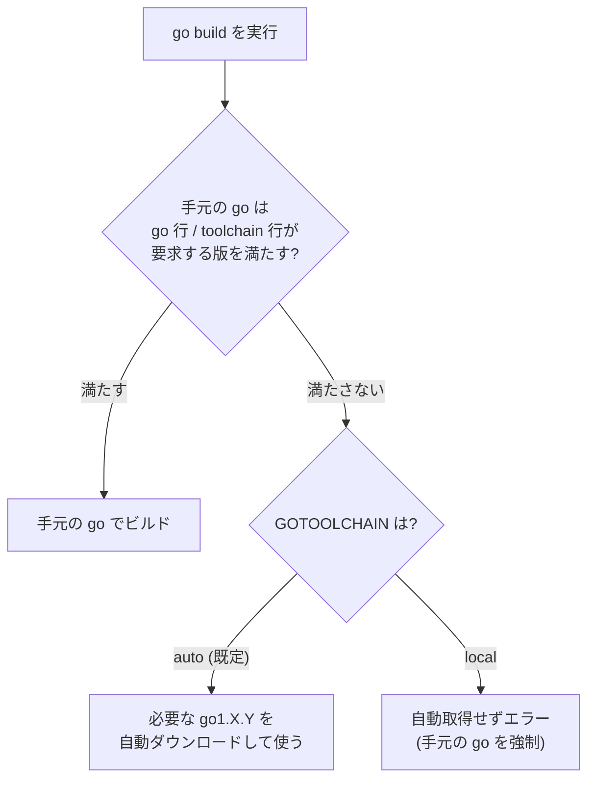

# Goの環境構築とツールチェーン（Go toolchain & environment）

> **一言で言うと:** Go は「**1個のバイナリ `go` がコンパイラ・テストランナー・パッケージマネージャ・フォーマッタを全部兼ねる**」のが最大の特徴。他言語のように `node + npm + jest + prettier + nvm` を別々に入れる必要がなく、`go` コマンドと環境変数（`GOPATH` / `GOPROXY` 等）の挙動さえ押さえれば、プロジェクト参画初日からビルド・テスト・依存解決ができる。Go 1.21 以降は **`go.mod` がツールチェーンのバージョンまで宣言**し、`go` コマンドが必要な Go 自身を自動ダウンロードするようになった点が、参画者にとって最大の変化。

[[Go]] 本体の言語仕様とは別に、ここでは「**プロジェクトに入って最初の1時間で必要になる道具立て**」——インストール・環境変数・日常コマンド・モジュール解決・ビルド——を一望する。Go.md のエコシステム節が触れる `go mod tidy` などの先にある実務知識を埋める位置づけ。

## 3分で全体像

- **何を解決するか** — 「ビルドツール・テスト・依存管理・フォーマッタがバラバラ」という多言語の悩みを、`go` 1コマンドに統合する
- **これだけ覚える3つ** — ①`go.mod` が依存とツールチェーンバージョンの真実の源、②環境変数は `go env` で見る/`go env -w` で書く、③社内プライベートリポジトリを使うなら `GOPRIVATE` を必ず設定
- **詰まったら開く** — 本番イメージ最小化は [[Dockerイメージ]]、依存の脆弱性検査は [[依存パッケージの事後検知ツール比較]]、サプライチェーン全般は [[npmサプライチェーン攻撃事例]]（教訓は言語横断）

## インストールと「Go はどこにある」のメンタルモデル

Go の世界には**2つのディレクトリ**があり、これを混同すると環境構築でハマる。

| 環境変数 | 指す場所 | 中身 | 触ってよいか |
|---|---|---|---|
| **`GOROOT`** | Go 本体のインストール先（例 `/usr/local/go`） | コンパイラ・標準ライブラリ | **触らない**。自動設定される |
| **`GOPATH`** | ユーザーの作業領域（既定 `~/go`） | `bin/`（`go install` の出力）・`pkg/mod/`（ダウンロード済み依存のキャッシュ） | 設定する場面がある |

> [!info] 用語ミニ辞典：GOROOT と GOPATH
> **GOROOT** は「Go 処理系そのものの置き場」。**GOPATH** は「あなたがダウンロードした依存や `go install` で入れたツールの置き場」。かつて（〜2018, Go modules 以前）は GOPATH 配下にソースコードを置くことが必須で、これが初学者の最大の混乱源だった。現在は **Go modules によりプロジェクトを GOPATH の外の任意の場所に置ける**ようになり、GOPATH は主に「キャッシュとツールの置き場」へと役割が縮小した。

```bash
# 現在の設定を全部見る（最初にやること）
go env

# 特定の値だけ
go env GOPATH GOBIN GOPROXY

# 設定を永続化する（シェルの export ではなく go env -w を使うのが今の流儀）
go env -w GOBIN=$HOME/.local/bin
```

`GOBIN` は `go install` がバイナリを置く先（未設定なら `$GOPATH/bin`）。ここに **PATH を通しておかないと、`go install` で入れた CLI ツールが見つからない**——参画初日の定番のつまずき。

## バージョン管理 — `toolchain` ディレクティブ（1.21+ の最重要変更）

Go 1.21（2023）で、**`go.mod` がプロジェクトの必要 Go バージョンを宣言し、`go` コマンドが足りなければ自動で取得する**仕組みが入った。これは参画者の体験を大きく変えた。

```go
// go.mod
module github.com/acme/api

go 1.24          // このモジュールが要求する最低 Go バージョン
toolchain go1.24.3  // 実際に使うツールチェーン（go 行以上を指定可能）
```



- **`GOTOOLCHAIN=auto`（既定）** — `go.mod` が手元より新しい Go を要求したら、その場で自動ダウンロードして使う。「手元が 1.22 なのにプロジェクトが 1.24 要求」でも `go build` が通る
- **`GOTOOLCHAIN=local`** — 自動取得を禁止し、手元の `go` だけを使う。CI や再現性を厳密に縛りたい環境で設定

この自動化により、**`gvm` / `asdf` のような外部バージョンマネージャの必要性は大きく下がった**。ただし複数プロジェクトで「Go そのものの系統」を切り替えたい場合や、`GOTOOLCHAIN=local` 運用の現場では今でも使われる。「なぜ Go は外部バージョンマネージャに依存しない設計にしたか」——単一バイナリで完結する哲学（[[Go]] の設計思想）の延長にある。

## 日常コマンド — 参画初日に使うもの

```bash
# 実行（ビルドして即実行、バイナリは残さない。スクリプト感覚の試し書きに）
go run ./cmd/api

# ビルド（単一バイナリを出力）
go build -o bin/api ./cmd/api

# テスト（後述、最も奥が深い）
go test ./...        # ./... は「カレント配下の全パッケージ」を意味する定番表現

# 静的解析（go vet。明らかな間違いを検出）
go vet ./...

# フォーマット（議論の余地なく自動整形。CI で差分チェックされることが多い）
go fmt ./...

# CLI ツールのインストール（GOBIN へバイナリを置く）
go install github.com/google/wire/cmd/wire@latest

# コード生成（//go:generate コメントを実行。mock や stringer 生成で多用）
go generate ./...
```

> [!info] 用語ミニ辞典：`./...`
> 「カレントディレクトリ以下のすべてのパッケージ」を表す Go 独特のワイルドカード。`go test ./...` は「このリポジトリの全テストを走らせろ」の意味になる。`./` を付けないと「標準ライブラリを含む全部」と解釈されうるので、**ローカル対象には必ず `./` を付ける**のが慣習。

### プロジェクト固有ツールは `tool` ディレクティブで固定（1.24+）

上の `go install ...@latest` は「**自分の環境に**ツールのバイナリを入れる」コマンドで、入るバージョンは実行した時々で変わりうる。一方、**コード生成や lint のように「チーム全員が同じバージョンを使うべきツール」は、Go 1.24（2025-02）で導入された `tool` ディレクティブで `go.mod` に固定する**のが現在の推奨。

```bash
# go.mod に tool 行を追加し、バージョンを go.sum で固定する
go get -tool github.com/golang/mock/mockgen

# go.mod に以下が追記される
#   tool github.com/golang/mock/mockgen
# （依存と同じく require + go.sum でバージョンが固定される）

# 固定されたバージョンで実行（グローバル install 不要）
go tool mockgen -version
go generate ./...   # //go:generate 内から go tool 経由で呼べる
```

使い分けの軸はこうだ。**個人の作業環境に置きたいだけ**なら `go install pkg@version`（グローバル、`GOBIN` へ）。**プロジェクトで全員バージョンを揃えたい**なら `go get -tool` ＋ `go tool`（`go.mod` に固定、再現性が担保される）。本ドキュメントが繰り返す「再現性」を最も素直に満たすのは後者で、参画先の `go.mod` に `tool` 行があれば各自の手元 install は不要——`go tool <名前>` で同じ版が走る。背景は親 [[Go]] のエコシステム節も参照。

### テストコマンドの実務フラグ

`go test` は参画後すぐ毎日使う。最低限押さえるフラグ:

```bash
# 特定のテストだけ実行（正規表現でマッチ）
go test -run TestCreateUser ./internal/user

# データ競合検出（goroutine の競合を実行時に検出。CI で必須級）
go test -race ./...

# カバレッジ計測 + HTML 表示
go test -cover ./...
go test -coverprofile=cover.out ./... && go tool cover -html=cover.out

# ベンチマーク（Benchmark で始まる関数。-bench は対象の正規表現）
go test -bench=. -benchmem ./...

# キャッシュを無視して必ず再実行（go test は結果をキャッシュする）
go test -count=1 ./...
```

`-race` は特に重要。[[Go]] の Goroutine + Channel は強力だが**データ競合は普通に起きる**——`-race` は「テスト中に競合が起きたら教えてくれる」唯一の自動装置で、CI に必ず入れたい。`go test` が結果をキャッシュする性質（同じ入力なら再実行しない）も知らないと「直したのにテストが走っていない？」と混乱するため、強制再実行の `-count=1` を覚えておく。

## モジュールと依存解決

```bash
go mod init github.com/acme/api   # 新規モジュール作成（go.mod を生成）
go mod tidy                        # 使っている依存を go.mod/go.sum に過不足なく揃える
go mod download                    # 依存をローカルキャッシュへ取得（CI の依存取得ステップ）
go mod verify                      # ダウンロード済み依存が go.sum と一致するか検証
go mod why github.com/x/y          # なぜこの依存が必要か（依存パスを表示）
go mod graph                       # 依存グラフ全体を出力
```

### go.sum と再現性 — なぜハッシュを記録するのか

`go.mod` が「何を使うか」なら、**`go.sum` は「使う各バージョンの中身のハッシュ」を記録**する。`go build` のたびに、ダウンロードした依存のハッシュが `go.sum` と一致するか検証される。

これは**サプライチェーン攻撃への防御**だ。万一、公開済みのあるバージョンが後から差し替えられても（あるいは取得経路で改竄されても）、ハッシュ不一致でビルドが止まる。npm の世界で起きた取り込み事故の教訓（[[npmサプライチェーン攻撃事例]]）は言語を問わず効く——`go.sum` は必ずコミットする。ハッシュ検証の暗号的背景は [[暗号アルゴリズム]] を参照。

### GOPROXY / GOSUMDB / GOPRIVATE — 社内リポジトリ参画で必須

| 変数 | 役割 | 典型設定 |
|---|---|---|
| `GOPROXY` | 依存の取得元プロキシ | 既定 `https://proxy.golang.org,direct`（`direct` は VCS から直接） |
| `GOSUMDB` | 公開チェックサムDB。改竄検知の照合先 | 既定 `sum.golang.org` |
| `GOPRIVATE` | 「プロキシ/チェックサムDBを経由させない」プライベートモジュールのパターン | `*.corp.example.com,github.com/acme/*` |

**社内のプライベートリポジトリを依存に含むプロジェクトに参画したら、まず `GOPRIVATE` を設定する**。これを忘れると、`go` が社内モジュールを公開プロキシ（`proxy.golang.org`）に問い合わせ、404 で失敗するか、最悪**モジュールパスが公開DBに記録されて社内構造が漏れる**。

```bash
go env -w GOPRIVATE='github.com/acme/*'
# プライベート GitHub の取得を SSH/HTTPS+token に向ける（.gitconfig 側の設定と併用）
```

なぜ既定でプロキシを経由するのか——再現性とキャッシュ可用性（元リポジトリが消えても proxy.golang.org に残る）のため。だが社内コードはそこに載せたくないので `GOPRIVATE` で例外化する、という設計意図を理解しておく。

## ビルド — バイナリにバージョンを埋める / クロスコンパイル

```bash
# -ldflags でビルド時に変数へ値を注入（バージョン・コミットハッシュの埋め込み）
go build -ldflags "-X main.version=1.4.2 -X main.commit=$(git rev-parse --short HEAD)" \
  -o bin/api ./cmd/api

# -ldflags "-s -w" でデバッグ情報を削りバイナリを小さく（本番ビルドの定番）
go build -ldflags "-s -w" -o bin/api ./cmd/api

# ビルドタグで環境別にファイルを切り替える（//go:build integration 等）
go test -tags=integration ./...
```

> [!info] 用語ミニ辞典：クロスコンパイル
> 開発機（例 macOS/arm64）から、別 OS・別 CPU 向けの実行ファイル（例 Linux/amd64）を生成すること。Go は**環境変数 `GOOS`/`GOARCH` を変えるだけ**でこれができ、クロスコンパイル用のツールチェーンを別途入れる必要がない（C 依存がない純 Go の場合）。

```bash
# macOS から Linux/amd64 の本番バイナリを作る
GOOS=linux GOARCH=amd64 go build -o bin/api-linux ./cmd/api

# 利用可能な組み合わせ一覧
go tool dist list
```

これが Go の Docker 親和性の核心。**純 Go なら `FROM scratch` の極小イメージに単一バイナリを置くだけ**で本番が動く（[[Dockerイメージ]] / [[Go]] の「単一バイナリ」節）。ただし `cgo`（C ライブラリ呼び出し）を使うとクロスコンパイルが一気に難しくなる——`CGO_ENABLED=0` を明示して純 Go ビルドに固定するのが、コンテナビルドでの定番回避策。タイムゾーンや CA 証明書を `scratch` イメージで使う際の注意は [[CA証明書とタイムゾーンデータ]] を参照。

## チーム開発を揃える周辺ツール

`go` 標準に含まれないが、現場でほぼ必ず併用するもの:

| ツール | 役割 | 備考 |
|---|---|---|
| **golangci-lint** | 多数の linter を束ねる定番 | `go vet` より広く検出。CI で走らせる |
| **gofumpt** | `gofmt` より厳格な整形 | 整形ルールを更に固定 |
| **govulncheck** | 既知脆弱性の検査（公式） | 使用コードパスに到達する脆弱性だけ報告。詳細は [[依存パッケージの事後検知ツール比較]] |
| **air** / **reflex** | ファイル変更で自動再ビルド | 開発時のホットリロード |

開発環境そのものをチームで再現する手段（Docker / Nix / devcontainer）は言語横断の課題で、[[DockerとNix-Flakeによる開発環境管理]] / [[devcontainerとNixでレガシー環境を再現する]] を参照。CI でのビルド・テスト・lint の組み立ては [[CI-CD]] を参照。

## よくある落とし穴

### 1. `GOBIN` に PATH が通っておらず `go install` したツールが消える

`go install foo@latest` は成功しているのに `foo: command not found`。`go env GOBIN`（未設定なら `$(go env GOPATH)/bin`）に PATH を通す。参画初日の最頻出。

### 2. `GOPRIVATE` 未設定で社内モジュールが 404

前述。プライベート依存を持つプロジェクトでは最初に設定する。`go env -w GOPRIVATE=...`。

### 3. `go test` のキャッシュで「直したのに通る/落ちる」が変わらない

`go test` は入力が同じなら結果をキャッシュして再実行しない。外部状態（DB・時刻・環境変数）に依存するテストで混乱しがち。強制再実行は `-count=1`。そもそも外部状態依存を減らすのが本筋（[[Go]] の `time.Sleep` で同期するアンチパターンと同根）。

### 4. `cgo` 有効のままクロスコンパイルしようとして失敗

`GOOS=linux go build` が手元（macOS）で謎のリンクエラー。`cgo` が有効だと対象 OS の C ツールチェーンが要る。純 Go で済むなら `CGO_ENABLED=0` を付ける。

### 5. `go get` と `go install` の混同（1.16 以降の変更）

かつて `go get foo` は「依存追加」と「ツールのインストール」を兼ねていたが、**Go 1.16 以降、CLI ツールのグローバルインストールは `go install foo@version` に分離**された。`go get` は依存（`go.mod`）の追加・更新が主務に。古い記事の `go get -u ...` でツールを入れる手順は陳腐化している。さらに **Go 1.24 では `go get -tool` が追加**され、「プロジェクトに固定するツール」の管理は再び `go get` 系へ回帰した（前述の `tool` ディレクティブ）。整理すると——グローバル導入は `go install pkg@ver`、プロジェクト固定は `go get -tool` ＋ `go tool`、依存ライブラリは `go get pkg@ver`。

### 6. `GOFLAGS` の `-mod=vendor` を意識せず vendor ディレクトリと不整合

`vendor/` を使うプロジェクト（依存をリポジトリに同梱する方式）では `go` が自動で `-mod=vendor` になる。依存を足したら `go mod vendor` で `vendor/` を更新しないとビルドが食い違う。

## AI実装のアンチパターン

| アンチパターン | なぜ問題か | 対策 |
|---|---|---|
| `go get` でツールを入れる手順を生成 | 1.16 で `go install pkg@ver` に分離済み、古い | `go install`＋バージョン明示を使わせる |
| `go.sum` を `.gitignore` に入れる | 再現性・改竄検知が失われる | 必ずコミットする |
| `latest` でツール/依存を固定なく取得 | 再現性が壊れる・供給網リスク | バージョンを固定（`@v1.2.3`）。チーム共有ツールは `tool` ディレクティブ（`go get -tool`）で固定 |
| `GOPRIVATE` 抜きで社内モジュール前提のコード | 取得失敗・情報漏れ | プライベートパターンを設定させる |
| クロスコンパイルで `CGO_ENABLED` 未指定 | 環境依存で CI が不安定 | `CGO_ENABLED=0` を明示 |
| `-race` なしの並行コードのテストを「十分」とする | データ競合を見逃す | 並行コードは `-race` 前提 |
| バージョン埋め込みを `var version = "dev"` のハードコードで放置 | リリース追跡不能 | `-ldflags -X` でビルド時注入 |

## 関連トピック

- [[Go]] — 親トピック。言語仕様・単一バイナリ・並行モデルの前提
- [[Echo]] / [[GORM]] — このツールチェーンでビルド・テストする対象のフレームワーク/ORM
- [[Dockerイメージ]] — `CGO_ENABLED=0` + `scratch` による極小イメージ
- [[CA証明書とタイムゾーンデータ]] — `scratch` イメージで純 Go バイナリを動かす際の注意
- [[依存パッケージの事後検知ツール比較]] — govulncheck を含む脆弱性検査の位置づけ
- [[npmサプライチェーン攻撃事例]] — go.sum / GOSUMDB が防ぐ供給網リスク（教訓は言語横断）
- [[暗号アルゴリズム]] — go.sum のハッシュ検証の背景
- [[DockerとNix-Flakeによる開発環境管理]] / [[devcontainerとNixでレガシー環境を再現する]] — チームでの環境再現
- [[CI-CD]] — build/test/lint/-race をパイプラインに組む

## 参考リソース

- [Go 公式: Managing dependencies](https://go.dev/doc/modules/managing-dependencies) — モジュール運用
- [Go Modules Reference](https://go.dev/ref/mod) — go.mod/go.sum/GOPROXY 等の正式仕様
- [Go toolchains](https://go.dev/doc/toolchain) — `toolchain` ディレクティブ / `GOTOOLCHAIN`
- [`go` command documentation](https://pkg.go.dev/cmd/go) — 全サブコマンド・環境変数のリファレンス
- [govulncheck](https://go.dev/blog/govulncheck) — 公式脆弱性検査ツール
