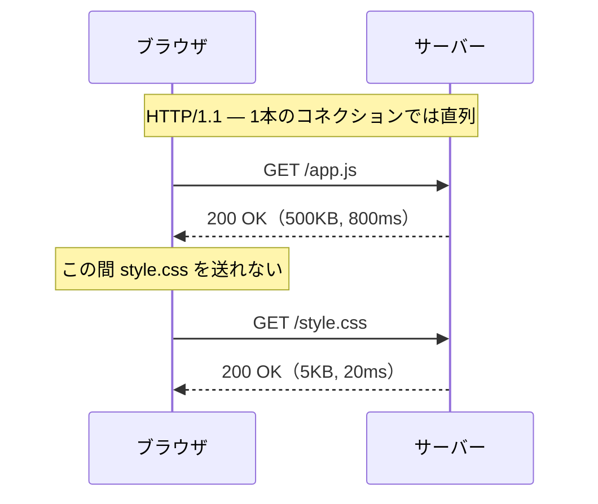
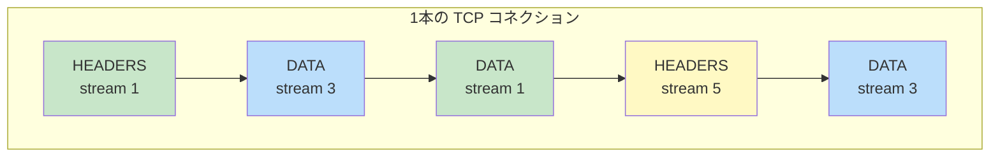
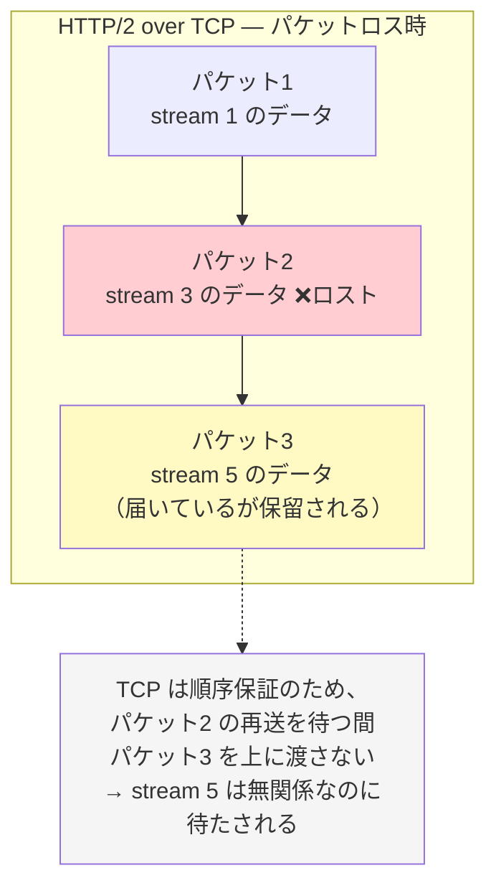
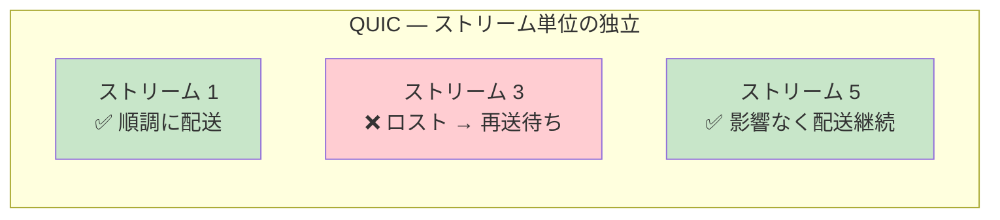

# HTTP/2 と HTTP/3（QUIC）

> **一言で言うと:** HTTP/1.1 → HTTP/2 → HTTP/3 の進化は、いずれも「**1本のコネクションをどう使い切るか**」という同じ問いへの回答であり、HTTP/2 はアプリケーション層の Head-of-Line ブロッキングを、HTTP/3 は TCP そのものを捨てることでトランスポート層の Head-of-Line ブロッキングを解消した。

## この文書の読み方

HTTP のバージョン差は「新しい方が速い」で片付けられがちだが、実務では **「なぜ速いのか」「どういう条件では速くならないのか」** を説明できることが求められる。障害調査で「HTTP/2 にしたのに遅い」「HTTP/3 が有効にならない」に遭遇したとき、この文書の理屈が判断材料になる。

なお本文中の **Head-of-Line ブロッキング（HoL Blocking / 先頭行ブロッキング）** とは、「**列の先頭が詰まると、後ろに並んでいる無関係なものまで全部待たされる**」現象を指す。スーパーのレジで、前の人がレジ袋を探して手間取ると、後ろの人は買い物カゴ1つでも待たされる、あの状態である。HTTP のバージョン進化はこの「詰まり」を、**どの層で**取り除くかの歴史でもある。

## 出発点: HTTP/1.1 が抱えていた3つの制約

### 制約1: 1コネクション = 1リクエスト（アプリケーション層の HoL）

HTTP/1.1 では、1本の TCP コネクション上で **リクエストとレスポンスを1組ずつ順番に**やり取りする。レスポンスが返るまで次のリクエストを送れない。



小さな `style.css` が、巨大な `app.js` の後ろで待たされる。これが**アプリケーション層の HoL ブロッキング**である。

**なぜパイプラインで解決しなかったのか（裏側の理由）**

HTTP/1.1 の仕様には、レスポンスを待たずに複数リクエストを送る **パイプライン（Pipelining）** が定義されていた。しかし実用化しなかった。理由は、**レスポンスをリクエストと同じ順序で返さなければならない**という制約が残っていたためである。順序が固定されている以上、先頭のレスポンス生成が遅ければ後続は結局待たされ、HoL ブロッキングは解消しない。加えて、途中の中継機器（プロキシ）がパイプラインを正しく扱えず応答を壊す実装が多く、ブラウザ側は既定で無効化した。**「順序の固定」を外さない限り多重化は成立しない** — これが HTTP/2 の設計出発点になる。

### 制約2: ブラウザの同時接続数制限

直列がボトルネックなら接続を増やせばよい、と考えるのは自然だ。しかしブラウザは**1オリジンあたり同時6接続程度**に自ら制限している。サーバーとネットワークを守るための自主規制である。

この制限を回避するために生まれたのが **ドメインシャーディング（Domain Sharding）** — `img1.example.com`, `img2.example.com` のようにホスト名を分散して接続数の上限を掛け算で増やす手法である。これは HTTP/1.1 時代の正当な最適化だったが、後述の通り HTTP/2 ではアンチパターンに転じる。

### 制約3: ヘッダの冗長性

HTTP はテキストベースで、リクエストごとに `User-Agent`, `Cookie`, `Accept` などのヘッダが**毎回まるごと**送られる。Cookie が数 KB あると、10KB の画像を取りに行くのに 2KB のヘッダを繰り返し送ることになる。

## HTTP/2 — 順序の固定を外す

HTTP/2（2015年 RFC 7540、2022年に RFC 9113 で改訂）は、HTTP の**意味論（メソッド、ステータスコード、ヘッダの意味）はそのまま**に、**転送形式だけ**を作り直した。

> [!info] 用語ミニ辞典
> - **フレーム（Frame）** — HTTP/2 が通信を分割する最小単位。ヘッダ用（HEADERS）、本文用（DATA）、設定用（SETTINGS）などの種類があり、それぞれ「どのストリームに属するか」を示す ID を持つ
> - **ストリーム（Stream）** — 1つのリクエスト/レスポンスのペアに対応する仮想的な通信路。1本の TCP コネクション上に多数のストリームが同居する
> - **多重化（Multiplexing）** — 複数のストリームのフレームを混ぜて1本のコネクションに流すこと

### バイナリフレーミングによる多重化

HTTP/2 は、リクエストとレスポンスを**フレーム**という小片に分解し、それぞれに**ストリーム ID** を付けて1本の TCP コネクションに混ぜて流す。受信側は ID を見て元のメッセージに組み立て直す。



ストリーム 1 のレスポンスが遅くても、ストリーム 3 のフレームは先に届いて処理できる。**順序の固定が外れたことで、初めて真の多重化が成立した。** テキストからバイナリに変えたのは、フレーム境界を機械的かつ曖昧さなく判定するためである（テキストは改行や空白の扱いに解釈の揺れが生まれ、パーサの脆弱性の温床でもあった）。

### HPACK によるヘッダ圧縮

HTTP/2 は **HPACK**（RFC 7541）でヘッダを圧縮する。仕組みは2段構えで、

1. **静的テーブル** — `:method: GET` のような頻出ヘッダに番号を振った固定表。番号1つで表現できる
2. **動的テーブル** — 一度送ったヘッダを送受信双方が記憶し、2回目以降は**インデックス番号だけ**送る

Cookie のような大きくて毎回同じヘッダは、2回目以降ほぼゼロコストになる。

### サーバープッシュはなぜ消えたのか（歴史的経緯）

HTTP/2 には、クライアントが要求する前にサーバーが関連リソース（CSS など）を先回りで送る **サーバープッシュ** が含まれていた。理論上は往復を1回減らせる。

しかし実際には、**サーバーはクライアントのキャッシュ状態を知らない**。すでにブラウザが持っている CSS を押し付ければ、帯域の純粋な無駄になる。制御が難しく、有効に使えたサイトはごく少数だった。結果として Chrome は 2022年（Chrome 106）にサーバープッシュのサポートを削除し、事実上の廃止となった。

代替として使われているのが **`103 Early Hints`**（RFC 8297）である。サーバーは本レスポンスを準備しながら、先に「この CSS と JS を取りに行っておいて」というヒントだけを返す。**押し付けるのではなく教える**という設計に落ち着いた。

```
HTTP/2 103 Early Hints
Link: </style.css>; rel=preload; as=style
Link: </app.js>; rel=preload; as=script

（本処理の後）
HTTP/2 200 OK
Content-Type: text/html
```

「よかれと思った先回り最適化が、状態を知らないがゆえに裏目に出る」— これはキャッシュ設計全般に通じる教訓でもある（→ [[キャッシュ書き込み戦略とTTL設計]]）。

## 残された問題: TCP レベルの HoL ブロッキング

HTTP/2 はアプリケーション層の HoL を解消したが、**その下にある TCP** には手を付けていない。ここに落とし穴がある。

TCP は「**バイト列が順序通り、欠けなく届く**」ことを保証するプロトコルである。この保証は、途中のパケットが1つ失われたとき、**それ以降に届いたデータをアプリケーションに渡さずに保留する**ことで実現される。再送されたパケットが到着して初めて、まとめて上位に渡される。



**HTTP/2 で多重化したことが、かえって被害を集中させる。** HTTP/1.1 で6本の接続を張っていれば、1本でロスが起きても他の5本は動き続けた。HTTP/2 では全ストリームが1本の TCP に相乗りしているため、**1つのパケットロスが全リクエストを止める**。モバイル回線のようにパケットロス率が高い環境では、HTTP/2 が HTTP/1.1 より遅くなることすらある。

この問題は TCP の内部を改良しても解決しない。**「順序保証を全データにまとめてかけている」という TCP の設計そのもの**が原因だからだ。ストリーム単位で独立に順序保証をかける必要がある — それには新しいトランスポートが要る。

## HTTP/3 — TCP を捨てて QUIC へ

HTTP/3（2022年 RFC 9114）は、TCP ではなく **QUIC**（RFC 9000）というトランスポートプロトコルの上で動く。QUIC は **UDP の上に**、信頼性・順序保証・輻輳制御・暗号化を自前で再実装したものである。

### なぜ UDP の上に作ったのか（設計の裏側）

「TCP を改良する」でも「新しいトランスポートプロトコルを作る」でもなく、UDP の上に載せたのには切実な理由がある。

インターネットの経路上には、NAT ルーター、ファイアウォール、ロードバランサといった **中継機器（ミドルボックス）** が無数に存在する。これらの多くは TCP ヘッダを覗いて動作を最適化・制御しており、**知らない形式のパケットを黙って捨てる**。この「既存の実装に合わせて硬直化し、新しいものが通らなくなる」現象を **硬直化（ossification / オシフィケーション）** と呼ぶ。

- **新しい IP プロトコル番号を割り当てる** → ミドルボックスが通さない。世界中の機器を入れ替えるまで使えない
- **TCP を拡張する** → TCP オプションを削る機器が存在し、拡張が機能しない環境が残る
- **UDP の上に載せる** → UDP は DNS や QUIC 以前から広く通る。ミドルボックスから見れば「ただの UDP パケット」

さらに QUIC は、**パケットヘッダの大部分まで暗号化**している。これは盗聴対策であると同時に、**ミドルボックスに中身を触らせない = 将来また硬直化しないようにする**という意図的な設計である。TCP が30年かけて硬直した歴史から学んだ結果と言える。

副産物として、QUIC は **OS のカーネルではなくアプリケーション（ユーザ空間）で実装できる**。TCP はカーネルの一部なので改良には OS の更新が必要だが、QUIC はブラウザやサーバーのアップデートだけで進化させられる。

### QUIC が解決したこと



| 改善点 | 内容 | 効いてくる場面 |
|---|---|---|
| **ストリーム単位の順序保証** | あるストリームのロストが他のストリームを止めない | パケットロス率の高いモバイル回線・Wi-Fi |
| **ハンドシェイクの統合** | TLS 1.3 が QUIC に組み込まれ、トランスポート確立と暗号鍵交換が同時に完了（1-RTT、再訪時は 0-RTT） | 初回接続の多いサイト、高 RTT な遠距離接続 |
| **コネクションマイグレーション** | 接続を IP/ポートではなく **Connection ID** で識別。Wi-Fi ↔ モバイル回線の切り替えでも接続が切れない | スマートフォンでの移動中の利用 |
| **QPACK によるヘッダ圧縮** | HPACK の考え方を「順序が保証されない前提」に作り直したもの（RFC 9204） | 全般 |

**コネクションマイグレーションの意味**を実感するには、TCP の識別方法を思い出すとよい。TCP コネクションは `(送信元IP, 送信元ポート, 宛先IP, 宛先ポート)` の4つ組で識別される。スマートフォンが Wi-Fi から 5G に切り替わると送信元 IP が変わるため、**TCP から見れば別の接続**になり、既存接続は切断される（動画がひっかかる原因の一つ）。QUIC は接続を Connection ID という論理的な識別子で追跡するので、IP が変わっても同じ接続として継続できる（→ TCP 側の詳細は [[TCPフラグとコネクション状態遷移]]）。

## 3世代の比較

| | HTTP/1.1 | HTTP/2 | HTTP/3 |
|---|---|---|---|
| **標準化** | 1997（RFC 2068→9112） | 2015（RFC 7540→9113） | 2022（RFC 9114） |
| **トランスポート** | TCP | TCP | QUIC（UDP 上） |
| **形式** | テキスト | バイナリフレーム | バイナリフレーム |
| **多重化** | なし（コネクション6本で代替） | あり（1コネクション） | あり（1コネクション） |
| **アプリ層 HoL** | 発生 | 解消 | 解消 |
| **トランスポート層 HoL** | （接続分散で緩和） | **発生** | 解消 |
| **ヘッダ圧縮** | なし | HPACK | QPACK |
| **暗号化** | 任意 | ブラウザ実装上は必須（TLS） | **必須**（TLS 1.3 統合） |
| **接続確立 RTT** | TCP 1 + TLS 1〜2 | TCP 1 + TLS 1〜2 | **1（再訪時 0）** |
| **IP 変更への耐性** | 切断 | 切断 | 継続（Connection ID） |
| **実装位置** | カーネル（TCP） | カーネル（TCP） | ユーザ空間 |

## 実務: 有効化と確認

### ブラウザはどうやって HTTP/3 を知るのか

HTTP/3 は UDP を使うため、ブラウザは「とりあえず HTTP/3 で繋いでみる」ことができない。サーバーが対応しているか事前に分からず、UDP が塞がれている環境もあるからだ。そこで**サーバーが対応を告知する**必要がある。告知の経路は2つある。

**経路1: `Alt-Svc`（Alternative Services）ヘッダ** — HTTP レスポンスで教える

1. ブラウザはまず HTTP/2（TCP + TLS）で接続する
2. サーバーがレスポンスに `Alt-Svc: h3=":443"; ma=86400` を付ける（「HTTP/3 も 443/UDP で提供中、86400秒間有効」）
3. ブラウザはこれを記憶し、**次回以降**の接続で HTTP/3 を試す

**経路2: DNS の HTTPS（SVCB）リソースレコード** — 名前解決の時点で教える

```
example.com.  3600  IN  HTTPS  1 . alpn="h3,h2"
```

ブラウザは A/AAAA レコードと同時に HTTPS レコードを引き、`alpn` に `h3` があれば**初回接続からいきなり HTTP/3 を使う**。主要ブラウザが対応しており、Cloudflare のような CDN は既定でこのレコードを公開している。

**したがって「初回は必ず HTTP/2 になる」のは、`Alt-Svc` だけに頼っている構成の話である。** 自前でオリジンを立てて `Alt-Svc` しか設定していない場合は初回が HTTP/2 になり、「有効にしたのに DevTools で h3 が出ない」の大半はこれが原因になる。初回から HTTP/3 で入れたいなら、DNS 側に HTTPS レコードを追加する（対応は DNS プロバイダによる）。

```bash
# HTTPS レコードが公開されているか確認する
dig +short example.com HTTPS
# 出力例: 1 . alpn="h3,h2" ipv4hint=93.184.216.34
```

### nginx での設定例

```nginx
server {
    # HTTP/2（TCP 443）
    listen 443 ssl;
    http2 on;

    # HTTP/3（UDP 443）— nginx 1.25.0 以降の mainline が必要
    listen 443 quic reuseport;

    server_name example.com;
    ssl_certificate     /etc/letsencrypt/live/example.com/fullchain.pem;
    ssl_certificate_key /etc/letsencrypt/live/example.com/privkey.pem;

    # QUIC は TLS 1.3 が必須
    ssl_protocols TLSv1.2 TLSv1.3;

    location / {
        # ブラウザに「HTTP/3 も使えます」と通知する
        # これがないとブラウザは永久に HTTP/2 のまま
        add_header Alt-Svc 'h3=":443"; ma=86400' always;
        proxy_pass http://backend;
    }
}
```

UDP 443 番がファイアウォール / セキュリティグループで開いているかは別途確認が必要である。TCP だけ開けて「HTTP/3 が効かない」と悩むのは頻出のつまずきポイント。

### curl での確認

```bash
# 実際に使われたプロトコルを確認する（http_version: 1.1 / 2 / 3）
curl -o /dev/null -s -w "protocol=%{http_version}\n" https://example.com

# Alt-Svc ヘッダが返っているか
curl -sI https://example.com | grep -i alt-svc

# HTTP/3 を明示的に指定（HTTP/3 対応ビルドの curl が必要）
curl --http3 -o /dev/null -s -w "protocol=%{http_version}\n" https://example.com

# curl が HTTP/3 に対応しているかを調べる（Features 行に HTTP3 が出るか）
curl --version | grep -i features
```

### Python — HTTP/2 クライアント

```python
# httpx は http2 エクストラ（内部で h2 パッケージ）を入れると HTTP/2 を話せる。
#   pip install "httpx[http2]"
# 注意: HTTP/3 は httpx では未対応。Python で HTTP/3 を扱うなら aioquic を使う。
import httpx

# http2=True にしても、実際に HTTP/2 になるかは TLS の ALPN 交渉次第。
# サーバーが h2 を提示しなければ自動的に HTTP/1.1 にフォールバックする。
with httpx.Client(http2=True) as client:
    response = client.get("https://example.com")

    # 交渉結果は必ず確認する。「設定した = 使われている」ではない
    print(response.http_version)  # 'HTTP/2' または 'HTTP/1.1'
    print(response.status_code)
```

> [!info] 用語ミニ辞典
> **ALPN（Application-Layer Protocol Negotiation）** — TLS ハンドシェイクの中で「この接続で話すアプリケーションプロトコル」を決める仕組み。クライアントが `["h2", "http/1.1"]` のように候補を提示し、サーバーが1つ選ぶ。HTTP/2 への切り替えに追加の往復が要らないのはこの仕組みのおかげ。詳細は [[TLSハンドシェイクと証明書検証]]

### Go — HTTP/3 サーバー

```go
package main

// Go の標準ライブラリ net/http は HTTP/1.1 と HTTP/2 を扱えるが、HTTP/3 は扱えない
// （QUIC 実装 golang.org/x/net/quic は実験的段階で、net/http とは結線されていない）。
// 実運用では quic-go が事実上の標準:
//   go get github.com/quic-go/quic-go
import (
	"log"
	"net/http"

	"github.com/quic-go/quic-go/http3"
)

func main() {
	mux := http.NewServeMux()
	mux.HandleFunc("GET /", func(w http.ResponseWriter, r *http.Request) {
		// r.Proto には実際に使われたプロトコルが入る（"HTTP/3.0" など）
		w.Header().Set("Content-Type", "text/plain")
		w.Write([]byte("protocol: " + r.Proto))
	})

	// HTTP/3 は UDP でリッスンする。TCP 版とは別のリスナーになる点に注意。
	// 実運用では TCP(HTTP/2) 版も同時に起動し、Alt-Svc で HTTP/3 を告知する
	server := &http3.Server{
		Addr:    ":443",
		Handler: mux,
	}

	// QUIC は TLS 1.3 が仕様上必須。証明書なしでは起動できない
	log.Fatal(server.ListenAndServeTLS("fullchain.pem", "privkey.pem"))
}
```

## よくある落とし穴

### 1. HTTP/1.1 時代の最適化を HTTP/2 でも続けている

**ドメインシャーディング**（`img1.example.com`, `img2.example.com` への分散）は HTTP/2 では逆効果になる。ホスト名を分けるとコネクションも分かれてしまい、多重化・ヘッダ圧縮（動的テーブルはコネクション単位）・輻輳制御の恩恵をすべて失う。おまけにホスト名ごとに DNS 解決と TLS ハンドシェイクが発生する。

同様に **CSS スプライト**（多数の小画像を1枚に結合）や **JS/CSS の過剰なバンドル結合**も、HTTP/2 では「1ファイル変更で全体が再ダウンロード」というキャッシュ効率の悪化の方が目立つようになる。ただし「バンドルをやめてファイルを細かく分割せよ」も行き過ぎで、リクエスト数が数百に達すると圧縮効率とフレーム処理コストで不利になる。**適度に分割し、ハッシュ付きファイル名で長期キャッシュする**のが現在の落としどころ（→ [[モジュールバンドラ-webpackとTurbopack]]）。

### 2. 「HTTP/2 にすれば必ず速くなる」

効くのは **多数の小さなリソースを取得する場面**である。以下では恩恵が薄い、あるいは逆効果になる。

- **少数の大きなファイル転送**（動画、大容量ダウンロード）— 多重化する対象がない
- **パケットロスの多い回線** — TCP レベルの HoL ブロッキングが全ストリームを巻き込む。ここは HTTP/3 の出番
- **すでにドメインシャーディングで最適化済みのサイト** — 素直に移行すると遅くなることがある

### 3. `h2` と `h2c` を混同する

- **h2** — TLS 上の HTTP/2。ブラウザが話すのはこちらだけ
- **h2c** — 平文（cleartext）の HTTP/2。**主要ブラウザはサポートしていない**

ロードバランサとバックエンドの間のような内部通信では h2c が使われることがある（gRPC など）。「ブラウザから h2c で繋がらない」は仕様通りの挙動であり、設定ミスではない。

### 4. gRPC が HTTP/2 依存であることを忘れる

gRPC は HTTP/2 のストリームを前提に設計されている。前段のプロキシやロードバランサが HTTP/1.1 に落として中継すると gRPC は動かない。**L7 ロードバランサが HTTP/2 をエンドツーエンドで通す設定になっているか**を確認する必要がある（→ [[L4とL7ロードバランサーの違い]]）。

### 5. HTTP/3 の 0-RTT を無条件に有効化する

0-RTT（再訪時にハンドシェイク完了前からデータを送る）は速いが、**リプレイ攻撃に弱い**。攻撃者が 0-RTT データを記録して再送すると、サーバーが同じリクエストを再処理してしまう。GET のような冪等な操作のみに限定し、POST など状態を変える操作には使わないのが原則である（→ [[TLSハンドシェイクと証明書検証]]、[[データ書き込みの冪等性設計]]）。

### 6. UDP が通らない環境の存在を考慮しない

企業内ネットワークや一部のパブリック Wi-Fi では UDP 443 が遮断されていることがある。この場合ブラウザは HTTP/2 にフォールバックするため通信自体は成立するが、**「HTTP/3 が使われる前提の性能見積もり」は崩れる**。また、CPU 負荷の観点では QUIC はユーザ空間で暗号処理と輻輳制御を行うため、TCP + カーネル TLS より **CPU を多く消費する**傾向がある。高トラフィックなオリジンサーバーでは無視できないコストになりうる。

## AI実装のアンチパターン

| アンチパターン | なぜ問題か | レビュー観点 / 対策 |
|---|---|---|
| HTTP/2 環境向けにドメインシャーディングやスプライト結合を提案する | HTTP/1.1 時代の記事を学習しているため頻出。多重化とヘッダ圧縮の恩恵を打ち消す | 対象の HTTP バージョンを前提として明示する。HTTP/2 以降ではシャーディングを行わない |
| `listen 443 quic` だけ書いて告知手段を用意しない | ブラウザは HTTP/3 の存在を知る術がなく、永久に HTTP/2 のまま。「設定したのに効かない」の典型 | QUIC リスナーと `add_header Alt-Svc` をセットでレビュー。初回接続から HTTP/3 にしたいなら DNS の HTTPS レコードも追加する |
| HTTP/3 化を「TCP 443 だけ開けた」状態で完了とする | QUIC は UDP。ファイアウォール / セキュリティグループで UDP 443 が閉じていれば機能しない | インフラ側の UDP 443 開放とセットで確認 |
| ブラウザ向けエンドポイントを h2c（平文 HTTP/2）で構成する | ブラウザは h2c をサポートしない。内部通信と外部公開の区別がついていない | 外部公開は必ず TLS 上の h2 / h3。h2c は内部通信のみ |
| HTTP/3 で 0-RTT を全メソッドに対して有効化する | リプレイ攻撃で POST が二重処理される（二重決済など） | 0-RTT は冪等操作のみ。サーバー側のリプレイ検知も併用 |
| 「HTTP/3 にすれば速い」とだけ結論づけ、計測を伴わない提案をする | 効果はネットワーク特性（ロス率、RTT、モバイル比率）に依存する。CPU コスト増もある | 実利用者の環境で計測（Real User Monitoring）してから判断（→ [[CoreWebVitals]]） |

→ レイヤー横断のアンチパターン索引: [[_anti-patterns/_index|AIアンチパターン索引]]

## 参考リソース

- **RFC 9113**: HTTP/2 — https://datatracker.ietf.org/doc/html/rfc9113
- **RFC 9114**: HTTP/3 — https://datatracker.ietf.org/doc/html/rfc9114
- **RFC 9000**: QUIC: A UDP-Based Multiplexed and Secure Transport — https://datatracker.ietf.org/doc/html/rfc9000
- **RFC 8297**: An HTTP Status Code for Indicating Hints（103 Early Hints） — https://datatracker.ietf.org/doc/html/rfc8297
- **書籍**: 『Real World HTTP 第3版』（渋川よしき） — HTTP/1.1 から HTTP/3 までを Go のコードとともに解説
- **Web**: HTTP/3 explained（Daniel Stenberg / curl 作者） — https://http3-explained.haxx.se/ja

## 関連トピック

- [[HTTP-HTTPS]] — 親トピック。メソッドの意味論・ステータスコード・キャッシュ制御はバージョンを越えて共通
- [[HTTPとHTTPSの違い]] — TLS レイヤーの有無という観点での整理
- [[TCP-IP]] — HTTP/2 が抱える HoL ブロッキングの根本原因は TCP の順序保証にある
- [[TCPフラグとコネクション状態遷移]] — 4つ組による接続識別と、IP 変更で切断される理由
- [[TLSハンドシェイクと証明書検証]] — ALPN によるプロトコル交渉、TLS 1.3 の 1-RTT / 0-RTT
- [[L4とL7ロードバランサーの違い]] — HTTP/2 をエンドツーエンドで通すには L7 の対応が必要
- [[CDN]] — HTTP/3 対応は CDN 側で先行することが多く、オリジンは HTTP/2 のままという構成が一般的
- [[CoreWebVitals]] — プロトコル移行の効果は実ユーザー計測で確認する
