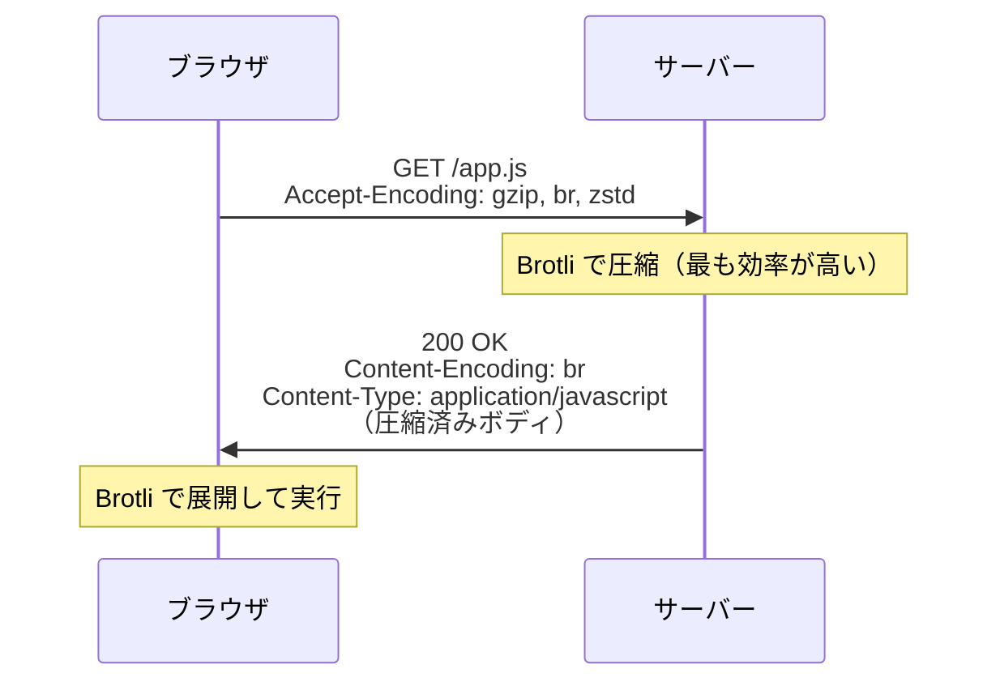

# HTTP圧縮（HTTP Compression）

> **一言で言うと:** サーバーがレスポンスボディを gzip や Brotli で圧縮し、ブラウザが展開する仕組み。テキストベースのリソース（HTML/CSS/JS/JSON）を 60〜90% 削減でき、UTF-8 で日本語が3バイト/文字になるサイズ増も圧縮後は無視できるレベルになる。

## 概念

### HTTP圧縮の仕組み

HTTP圧縮はクライアントとサーバーの**コンテンツネゴシエーション**で成り立つ。クライアントが「この圧縮形式に対応している」と伝え、サーバーが対応する形式で圧縮して返す。



- **`Accept-Encoding`**（リクエストヘッダー）— クライアントが対応する圧縮アルゴリズムを列挙
- **`Content-Encoding`**（レスポンスヘッダー）— サーバーが実際に使用した圧縮アルゴリズムを通知
- **`Vary: Accept-Encoding`**（レスポンスヘッダー）— CDN やプロキシに「Accept-Encoding の値ごとに別キャッシュを保持せよ」と指示。これがないと、圧縮非対応クライアントに圧縮済みレスポンスが返される事故が起きる

### gzip vs Brotli vs Zstandard

| 観点 | gzip | Brotli（br） | Zstandard（zstd） |
|------|------|-------------|-------------------|
| 圧縮率 | 基準 | gzip比で 15〜25% 改善 | gzip比で 10〜20% 改善 |
| 圧縮速度 | 速い | 低レベルでは遅い（静的事前圧縮向き） | 非常に速い（リアルタイム圧縮向き） |
| 展開速度 | 速い | gzipと同等 | 非常に速い |
| ブラウザサポート | 全ブラウザ | 全モダンブラウザ（2017年〜） | Chrome 123+, Firefox（2024年〜） |
| HTTP対応 | `Content-Encoding: gzip` | `Content-Encoding: br` | `Content-Encoding: zstd` |
| 規格 | RFC 1952（1996年） | RFC 7932（2016年） | RFC 8878（2021年） |
| 適するユースケース | 広い互換性が必要な場合 | 静的アセットの事前圧縮 | リアルタイム圧縮、大規模データ |

**実務での使い分け:**
- **静的アセット**（JS/CSS/HTML）→ ビルド時に Brotli で事前圧縮し、CDN から配信。圧縮に時間をかけても一度きりなので最高圧縮率を狙える
- **動的レスポンス**（API JSON 等）→ gzip または Zstandard でリアルタイム圧縮。Brotli の高圧縮レベルはリアルタイムには遅すぎる（低圧縮レベルなら可）
- **フォールバック** → Brotli 非対応クライアント向けに gzip も用意する

### 文字コードとの関係 — UTF-8 のサイズ増は圧縮で消える

[[文字コード-UTF8|UTF-8]] では日本語が3バイト/文字（Shift_JIS は2バイト/文字）だが、HTTP 圧縮後はこの差がほぼ消失する。テキストの圧縮は文字の出現頻度に基づく（ハフマン符号化 + LZ77）ため、エンコーディングのバイト数差よりも**テキストの冗長性**が圧縮率を決定する。

| コンテンツ | 非圧縮（UTF-8） | 非圧縮（Shift_JIS） | gzip 圧縮後 |
|-----------|:---:|:---:|:---:|
| 日本語 HTML（10KB相当の文章） | 約 30KB | 約 20KB | 約 8KB（ほぼ同等） |
| JSON API レスポンス | 約 50KB | — | 約 5KB |
| CSS / JS | 約 200KB | — | 約 40KB |

圧縮はテキスト内のパターン繰り返しを検出するため、UTF-8 の「3バイト目が似たパターン」（日本語のひらがな・カタカナは先頭バイトが共通）は実際にはむしろ圧縮されやすい。

## コード例

### Nginx — 圧縮の設定

```nginx
# gzip 設定
gzip on;
gzip_types text/plain text/css application/javascript application/json
           text/xml application/xml image/svg+xml;
gzip_min_length 256;     # 256バイト未満は圧縮しない（オーバーヘッドの方が大きい）
gzip_comp_level 6;       # 圧縮レベル 1-9（6がバランス良好）
gzip_vary on;            # Vary: Accept-Encoding を自動付与

# Brotli 設定（ngx_brotli モジュールが必要）
brotli on;
brotli_types text/plain text/css application/javascript application/json
             text/xml application/xml image/svg+xml;
brotli_comp_level 6;     # 圧縮レベル 0-11（動的圧縮では 4-6 が推奨）

# 事前圧縮済みファイルの配信（ビルド時に .br / .gz を生成済みの場合）
brotli_static on;        # app.js.br が存在すればそれを返す
gzip_static on;          # app.js.gz が存在すればそれを返す
```

### Node.js（Express）— 動的レスポンスの圧縮

```javascript
const express = require('express');
const compression = require('compression');

const app = express();

// compression ミドルウェア — Accept-Encoding に応じて自動圧縮
app.use(compression({
  threshold: 1024,  // 1KB 未満は圧縮しない
  filter: (req, res) => {
    // 画像やすでに圧縮済みのレスポンスは除外
    if (req.headers['x-no-compression']) return false;
    return compression.filter(req, res);
  },
}));

app.get('/api/users', (req, res) => {
  // JSON レスポンスは自動的に gzip/Brotli 圧縮される
  res.json({ users: largeUserList });
});
```

### Go — 標準ライブラリでの圧縮

```go
package main

import (
	"compress/gzip"
	"encoding/json"
	"net/http"
	"strings"
)

// gzip ミドルウェア
func gzipMiddleware(next http.Handler) http.Handler {
	return http.HandlerFunc(func(w http.ResponseWriter, r *http.Request) {
		// クライアントが gzip に対応しているか確認
		if !strings.Contains(r.Header.Get("Accept-Encoding"), "gzip") {
			next.ServeHTTP(w, r)
			return
		}

		w.Header().Set("Content-Encoding", "gzip")
		w.Header().Set("Vary", "Accept-Encoding")

		gz := gzip.NewWriter(w)
		defer gz.Close()

		next.ServeHTTP(&gzipResponseWriter{Writer: gz, ResponseWriter: w}, r)
	})
}

type gzipResponseWriter struct {
	http.ResponseWriter
	Writer *gzip.Writer
}

func (w *gzipResponseWriter) Write(b []byte) (int, error) {
	return w.Writer.Write(b)
}

func main() {
	mux := http.NewServeMux()
	mux.HandleFunc("/api/data", func(w http.ResponseWriter, r *http.Request) {
		w.Header().Set("Content-Type", "application/json")
		json.NewEncoder(w).Encode(map[string]string{"message": "圧縮されたレスポンス"})
	})

	http.ListenAndServe(":8080", gzipMiddleware(mux))
}
```

### ビルド時の事前圧縮（Node.js スクリプト）

```javascript
import { readFileSync, writeFileSync } from 'fs';
import { gzipSync } from 'zlib';
import { compress } from 'brotli';
import { globSync } from 'glob';

// ビルド成果物を gzip + Brotli で事前圧縮
for (const file of globSync('dist/**/*.{js,css,html,json,svg}')) {
  const content = readFileSync(file);

  // gzip（互換性用）
  writeFileSync(`${file}.gz`, gzipSync(content, { level: 9 }));

  // Brotli（最高圧縮率）
  const brotliResult = compress(content, { quality: 11 });
  if (brotliResult) writeFileSync(`${file}.br`, brotliResult);

  const ratio = ((1 - brotliResult.length / content.length) * 100).toFixed(1);
  console.log(`${file}: ${content.length} → ${brotliResult.length} (${ratio}% 削減)`);
}
```

## 圧縮すべきもの / すべきでないもの

| 圧縮すべき | 圧縮すべきでない |
|-----------|----------------|
| HTML, CSS, JavaScript | JPEG, PNG, GIF（既に圧縮済み） |
| JSON, XML, SVG | WebP, AVIF（既に圧縮済み） |
| CSV, プレーンテキスト | gzip / Brotli 済みファイル（二重圧縮は無意味） |
| Web フォント（WOFF は圧縮済みだが WOFF2 は Brotli ベース） | 非常に小さいレスポンス（< 256B、ヘッダーのオーバーヘッドの方が大きい） |

## よくある落とし穴

### 1. `Vary: Accept-Encoding` の設定忘れ

CDN やリバースプロキシが圧縮済みレスポンスをキャッシュした場合、圧縮非対応のクライアント（古い curl、一部の Bot）にも圧縮済みデータが返される。`Vary: Accept-Encoding` を必ず設定し、Accept-Encoding の値ごとに別のキャッシュエントリを保持させる。

### 2. 動的レスポンスで Brotli の圧縮レベルを高くしすぎる

Brotli の圧縮レベル 11（最高）は極めて遅く、リアルタイム圧縮には不向き。動的レスポンスでは圧縮レベル 4〜6 が実用的。高圧縮レベルはビルド時の事前圧縮に限定する。

### 3. 圧縮済みリソースを再圧縮しようとする

JPEG、PNG、WebP、WOFF2 などの既に圧縮されたフォーマットに HTTP 圧縮を適用しても、ほとんどサイズは減らず CPU を浪費するだけ。Content-Type で圧縮対象を**テキストベースのリソースに限定**する。

### 4. `Content-Length` と圧縮の矛盾

圧縮が有効な場合、`Content-Length` は圧縮後のサイズを示す。アプリケーション層で `Content-Length` を事前にセットしてから圧縮ミドルウェアを通すと、実際のボディサイズと `Content-Length` が不一致になりクライアントがエラーを起こす。圧縮ミドルウェアに `Content-Length` の管理を任せるか、Transfer-Encoding: chunked を使う。

## 関連トピック

- [[文字コード-UTF8]] — 親トピック。UTF-8 の文字あたりバイト数増加を HTTP 圧縮が吸収する
- [[HTTP-HTTPS]] — Content-Encoding / Accept-Encoding は HTTP のコンテンツネゴシエーションの一部
- [[CDN]] — CDN エッジでの圧縮配信。事前圧縮済みファイルをエッジから返す構成が最も効率的
- [[CoreWebVitals]] — 圧縮によるリソースサイズ削減は LCP（Largest Contentful Paint）の改善に直結
- [[パフォーマンス最適化]] — HTTP 圧縮はネットワーク転送量の最適化手段

## 参考リソース

- [MDN Web Docs — HTTP compression](https://developer.mozilla.org/en-US/docs/Web/HTTP/Compression) — HTTP 圧縮の公式リファレンス
- [web.dev — Reduce the size of network payloads](https://web.dev/articles/reduce-network-payloads-using-text-compression) — Google 推奨のテキスト圧縮ガイド
- [Brotli 圧縮フォーマット（RFC 7932）](https://datatracker.ietf.org/doc/html/rfc7932)
- [Zstandard（RFC 8878）](https://datatracker.ietf.org/doc/html/rfc8878) — Facebook 開発の次世代圧縮アルゴリズム
