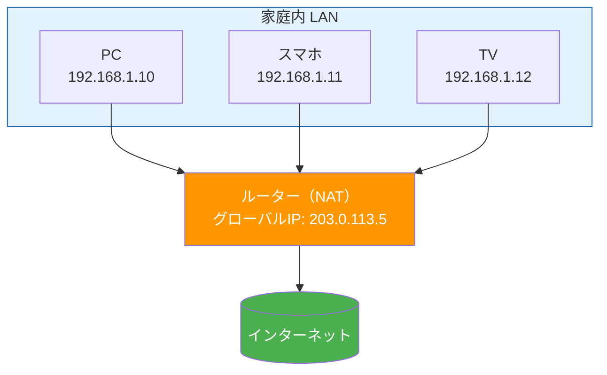

# IPv4 がなぜ今も使われるのか（Why IPv4 Still Dominates）

> **一言で言うと:** IPv4 アドレスは2011年に枯渇したが、NAT・CGNAT という「延命装置」と、IPv6 移行の莫大なコスト・互換性の断絶により、30年以上経った今もインターネットトラフィックの大部分を担っている。

## IPv4 の限界 — 何が問題だったか

IPv4 は32ビットのアドレス空間を持ち、理論上約43億（2^32 = 4,294,967,296）個のアドレスを割り当てられる。1981年の RFC 791 制定時には十分な数に見えたが、インターネットの爆発的普及により枯渇が現実になった。

| 出来事 | 年 |
|--------|-----|
| IPv4 仕様策定（RFC 791） | 1981 |
| IPv6 仕様策定（RFC 2460） | 1998 |
| IANA の未割当プール枯渇 | 2011年2月 |
| APNIC（アジア太平洋）枯渇 | 2011年4月 |
| RIPE NCC（ヨーロッパ）枯渇 | 2012年9月 |
| ARIN（北米）枯渇 | 2015年9月 |

IPv6 は1998年に策定されており、枯渇を見越して**20年以上前から**代替が準備されていた。にもかかわらず、IPv4 は今も広く使われている。

## NAT — IPv4 の延命装置

### NAT（Network Address Translation）の仕組み

NAT は「1つの[[プライベートIPとパブリックIP|パブリックIPアドレス]]を複数のデバイスで共有する」技術。家庭のルーターがまさにこれを行っている。



NAT によって、RFC 1918 で定義された**プライベートアドレス**が再利用可能になった:

| 範囲 | アドレス数 | 用途 |
|------|-----------|------|
| `10.0.0.0/8` | 約1,677万 | 大規模ネットワーク |
| `172.16.0.0/12` | 約104万 | 中規模ネットワーク |
| `192.168.0.0/16` | 約65,000 | 家庭・小規模オフィス |

理論上は各プライベートネットワーク内で同じアドレスを無限に再利用できるため、グローバル IPv4 アドレスの消費速度を劇的に抑えた。

### CGNAT（Carrier-Grade NAT）— [[ISP]]レベルの共有

モバイル回線や一部のISPでは、さらにISP側でもう一段 NAT を挟む **CGNAT** が導入されている。ユーザーに割り当てられるのはグローバルIPですらなく、ISPのプライベートネットワーク内のアドレスになる。

```
デバイス (192.168.1.x) → 家庭ルーター NAT → ISP CGNAT (100.64.x.x) → インターネット
```

これにより1つのグローバル IPv4 アドレスを数百〜数千のユーザーが共有できるが、以下の問題を引き起こす:

- **P2P通信の困難** — ポートフォワーディングができない
- **IP ベースのアクセス制限が使えない** — 同一IPに多数のユーザーがいる
- **WebSocket やリアルタイム通信への影響** — 接続の維持が不安定になりうる
- **ログの追跡困難** — 不正アクセスの発信元特定にポート番号まで必要

## IPv6 への移行が進まない理由

### 1. IPv4 と IPv6 には互換性がない

これが最大の障壁。IPv6 は IPv4 の拡張ではなく、**完全に別のプロトコル**。IPv4 のみのホストと IPv6 のみのホストは直接通信できない。

```
IPv4 パケット: [IPv4ヘッダ 20B][データ]
IPv6 パケット: [IPv6ヘッダ 40B][データ]
           ↑ ヘッダ構造が根本的に異なる。変換なしでは相互に読めない
```

このため「段階的に少しずつ移行」が極めて難しい。実際には**デュアルスタック**（両方対応）か**トンネリング**（一方のパケットを他方に包んで転送）という過渡的な技術が必要になり、運用コストが増える。

### 2. 「動いているものを変えるな」の経済合理性

| 観点 | IPv4 のまま | IPv6 移行 |
|------|-----------|-----------|
| 初期コスト | ゼロ | 機器・ソフトウェア更新、テスト、教育 |
| 運用の成熟度 | 40年以上の運用知見・ツール | トラブルシュート経験が少ない |
| リスク | 既知の問題のみ | 未知の障害が発生しうる |
| NAT で足りるか | 多くの場合 Yes | — |

経営判断として「今動いているIPv4 + NAT を、コストをかけてIPv6に変える明確な収益上の理由」が見えにくい。

### 3. アプリケーション層での対応不足

多くのレガシーシステムやライブラリに IPv4 アドレスのハードコード（`127.0.0.1`、正規表現による IP アドレスバリデーション等）が残っている。

## IPv6 の普及状況と転換点

とはいえ、IPv6 の普及は着実に進んでいる:

- **Google の統計（2026年時点）**: 世界のユーザーの約45%が IPv6 でアクセス
- **日本**: 約50%以上が IPv6 対応（NTT の NGN 網が IPv6 を推進）
- **モバイル**: 大手キャリアの多くが IPv6 をデフォルトに（T-Mobile は90%以上）
- **クラウド**: AWS、GCP、Azure はすべて IPv6 をサポート。VPC のデュアルスタックが標準化

### IPv6 への移行を加速させる要因

1. **IoT の爆発的増加** — 冷蔵庫、センサー、カメラ等にグローバルIPが必要になるケース
2. **CGNAT の限界** — P2P やリアルタイム通信でのユーザー体験劣化
3. **クラウドネイティブ設計** — Kubernetes のPod ネットワークは大量の IP を消費する
4. **IPv4 アドレスの価格高騰** — 1アドレスあたり50〜60ドル（2025年時点）で取引される「資産」

## Web開発者として知っておくべきこと

### デュアルスタック対応のコード

```python
import socket

# IPv4 のみに依存するアンチパターン
# sock = socket.socket(socket.AF_INET, socket.SOCK_STREAM)  # ❌ IPv4 固定

# デュアルスタック対応 — getaddrinfo を使う
def connect_to_host(host: str, port: int) -> socket.socket:
    """IPv4/IPv6 を自動選択して接続する"""
    # getaddrinfo は DNS 解決と同時にアドレスファミリーを返す
    for family, socktype, proto, canonname, sockaddr in socket.getaddrinfo(
        host, port, socket.AF_UNSPEC, socket.SOCK_STREAM
    ):
        try:
            sock = socket.socket(family, socktype, proto)
            sock.settimeout(5)
            sock.connect(sockaddr)
            return sock
        except OSError:
            sock.close()
            continue
    raise ConnectionError(f"Cannot connect to {host}:{port}")
```

```go
package main

import (
	"fmt"
	"net"
	"time"
)

func main() {
	// Go の net パッケージはデフォルトでデュアルスタック対応
	// "tcp" を指定すると IPv4/IPv6 両方を試行する
	conn, err := net.DialTimeout("tcp", "example.com:443", 5*time.Second)
	if err != nil {
		fmt.Println("接続失敗:", err)
		return
	}
	defer conn.Close()
	fmt.Println("接続先:", conn.RemoteAddr()) // IPv4 or IPv6 のアドレスが表示される
}
```

### IPv6 アドレスを含む URL の書き方

```
# IPv4
http://192.168.1.1:8080/api

# IPv6 — アドレスを角括弧 [] で囲む必要がある
http://[2001:db8::1]:8080/api

# IPv6 リテラルを括弧なしで書くとコロンがポート区切りと混同される
# http://2001:db8::1:8080/api  ← ❌ パースできない
```

### Docker / Kubernetes での注意点

```yaml
# docker-compose.yml — IPv6 を有効にする場合
networks:
  app-net:
    enable_ipv6: true
    ipam:
      config:
        - subnet: "fd00::/80"  # ULA（Unique Local Address）を使用
```

## よくある落とし穴

### 1. IP アドレスのバリデーションに正規表現を使う

IPv4 の正規表現（`\d{1,3}\.\d{1,3}\.\d{1,3}\.\d{1,3}`）では IPv6 を扱えない。言語標準ライブラリのパース関数を使うべき。

```python
import ipaddress

# ✅ 標準ライブラリを使う
def is_valid_ip(addr: str) -> bool:
    try:
        ipaddress.ip_address(addr)  # IPv4 も IPv6 も処理できる
        return True
    except ValueError:
        return False

print(is_valid_ip("192.168.1.1"))       # True
print(is_valid_ip("2001:db8::1"))       # True
print(is_valid_ip("999.999.999.999"))   # False
```

### 2. `0.0.0.0` でリッスンすれば IPv6 も受けられると思い込む

`0.0.0.0` は IPv4 の全インターフェースバインド。IPv6 も受けるには `::` にバインドするか、デュアルスタックソケットを使う必要がある。Node.js の `server.listen(3000)` はデフォルトで `::` にバインドするためデュアルスタック対応だが、明示的に `0.0.0.0` を指定すると IPv4 のみになる。

### 3. ログやデータベースに IP アドレスを文字列で保存する際のカラムサイズ

IPv4 は最大15文字（`255.255.255.255`）だが、IPv6 は最大45文字（`[2001:0db8:0000:...]:port` のフル表記）。`VARCHAR(15)` で定義していると IPv6 が格納できない。PostgreSQL なら `inet` 型を使うのが最善。

## 関連トピック

- [[TCP-IP]] — 親トピック。IP アドレッシングの全体像
- [[DNS]] — IPv6 アドレスの解決には AAAA レコードが使われる
- [[TLS-SSL]] — SNI（Server Name Indication）により同一 IP アドレスで複数の TLS 証明書を使えるようになったことも、IPv4 延命の一因
