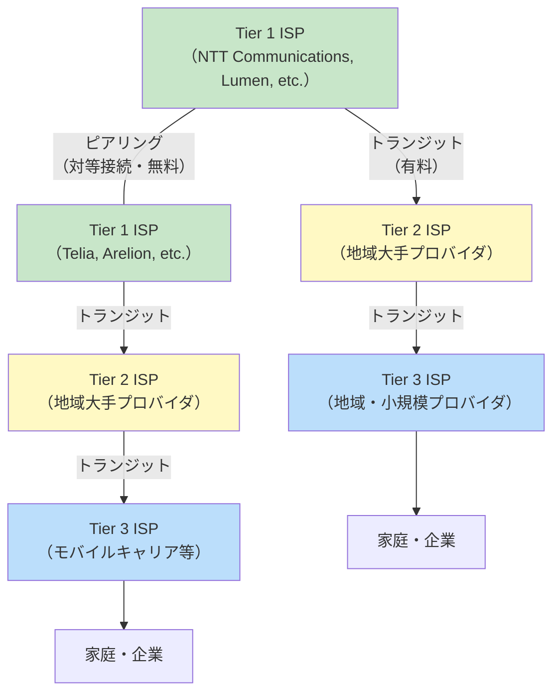
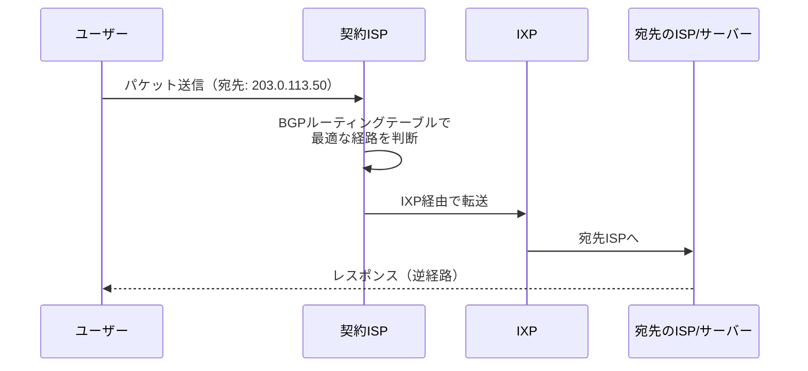

# ISP（Internet Service Provider）

> **一言で言うと:** ISPはインターネットへの接続を提供する事業者であり、家庭や企業のネットワークとインターネットのバックボーンを結ぶ「門番」。IPアドレスの割り当て、パケットのルーティング、DNS解決など、インターネット通信の物理的・論理的な基盤を担っている。

## ISPの階層構造

インターネットは単一のネットワークではなく、**無数のネットワーク（AS: Autonomous System）の相互接続**で成り立っている。ISPはその規模と役割によって階層化される。



### Tier 1 — グローバルバックボーン

- インターネットのバックボーン（幹線ネットワーク）を運用する大規模ISP
- 他のTier 1 ISPと**ピアリング（Peering）**で対等に接続し、トランジット料金を支払わずにトラフィックを交換する
- 世界中のどこにでもパケットを到達させられる「フルルート」を持つ
- 例: NTT Communications（AS2914）、Lumen Technologies、Telia Carrier

### Tier 2 — 地域大手

- Tier 1 ISPから**トランジット（Transit）**を購入してグローバルな到達性を得る
- 同時に他のTier 2やTier 3とピアリングも行う
- 例: 日本のIIJ、OCN（NTTコミュニケーションズの個人向け）

### Tier 3 — エンドユーザー向け

- 一般消費者や中小企業に直接サービスを提供する
- Tier 2からトランジットを購入する
- 例: 各地域のCATV事業者、モバイルキャリア（ドコモ、au、SoftBank）

## ISPが提供する主要機能

### 1. IPアドレスの割り当て

ISPはRIR（Regional Internet Registry、日本ではJPNIC/APNIC）からIPアドレスブロックの割り当てを受け、契約者に[[プライベートIPとパブリックIP|パブリックIPアドレス]]を付与する。

- **固定IP**: サーバー運用向け。追加料金がかかることが多い
- **動的IP**: 一般家庭向け。DHCPで接続のたびに割り当て、プール内のアドレスを使い回す
- **CGNAT（Carrier-Grade NAT）**: [[IPv4がなぜ今も使われるのか|IPv4枯渇]]に対処するため、ISP側でNATを行い複数の契約者で1つのパブリックIPを共有する

### 2. ルーティング

ISPはBGP（Border Gateway Protocol）を使って他のISPやAS（Autonomous System）と経路情報を交換し、パケットを最適な経路で宛先に届ける。



**IXP（Internet Exchange Point）**: ISP同士が物理的にトラフィックを交換する拠点。日本ではJPIX、JPNAPが主要なIXP。IXPの存在により、ISP間の通信がTier 1を経由せず直接行えるため、レイテンシとコストが削減される。

### 3. DNS リゾルバの提供

ほとんどのISPは契約者向けに[[DNS]]リゾルバ（キャッシュDNSサーバー）を提供する。DHCPで自動設定されるDNSサーバーは通常ISPのもの。ただし、Google Public DNS（8.8.8.8）やCloudflare（1.1.1.1）などのパブリックDNSを使うユーザーも増えている。

## Webエンジニアが意識すべきISPの影響

### 通信経路とレイテンシ

ユーザーのISP→IXP→CDN/サーバーという経路が通信遅延を決める。[[CDN]]はISPに近いエッジロケーションにコンテンツを配置することでこの経路を短縮する。

### ISPによるトラフィック操作

- **HTTPインジェクション**: 一部のISPは暗号化されていないHTTP通信に広告スクリプトやトラッキングコードを注入していた事例がある。[[TLS-SSL|HTTPS]]の普及はこの問題への対抗策でもある
- **DPI（Deep Packet Inspection）**: ISPがパケットの内容を検査して特定のトラフィック（P2P、動画ストリーミング等）を制限する場合がある
- **DNSフィルタリング**: ISPのDNSリゾルバでブロックリストを適用し、特定のドメインへのアクセスを制限する

これらの操作は[[TLS-SSL]]による暗号化やDNS over HTTPS（DoH）の利用動機の一つとなっている。

### CGNAT環境の制約

ISPがCGNATを使っている場合、以下の問題が発生する:

- サーバーを外部に公開できない（ポートフォワーディングがISPのNATを越えられない）
- IPアドレスベースのレート制限が、同じCGNAT配下のユーザー全員に影響する
- IP地理情報（GeoIP）の精度が低下する

```
ユーザーデバイス → 家庭ルーターNAT → ISP CGNAT → インターネット
(192.168.1.x)     (10.0.0.x)         (100.64.x.x)   (203.0.113.x)
                                       ↑ RFC 6598の共有アドレス空間
```

## 複数言語でのISP経路確認

### bash — tracerouteでISP経路を可視化

```bash
# Linux/macOS: 経路上のホップ（ルーター）を表示
traceroute example.com

# Windows:
tracert example.com

# ISPのAS番号を確認（BGP経路情報）
whois -h whois.radb.net 203.0.113.1
```

### Python — IPアドレスからISP情報を取得

```python
import socket

# 逆引きDNSでISPのホスト名を確認
try:
    hostname = socket.gethostbyaddr("8.8.8.8")
    print(hostname)  # ('dns.google', [], ['8.8.8.8'])
except socket.herror:
    print("逆引きできません")
```

### JavaScript — ブラウザからの接続情報確認

```javascript
// Network Information API（一部ブラウザ対応）
if ('connection' in navigator) {
  const conn = navigator.connection;
  console.log(`接続タイプ: ${conn.effectiveType}`);  // '4g', '3g', etc.
  console.log(`推定帯域: ${conn.downlink} Mbps`);
}
```

## 落とし穴

- **「ISPが変われば回線品質も変わる」**: 同じ光回線でも、ISP（プロバイダ）の設備投資やIXP接続の質によって速度が大きく異なる。「回線」と「ISP」は別の契約であることが多い（日本ではフレッツ光 + プロバイダの分離モデル）
- **「パブリックIPは固定されている」**: 一般家庭向けの契約では動的IPが標準。ルーター再起動やDHCPリース切れでIPが変わる。固定IPはオプション契約が必要
- **「ISPのDNSを使えば最速」**: 必ずしもそうではない。ISPのDNSはキャッシュが充実しているが、応答速度や信頼性でパブリックDNS（1.1.1.1, 8.8.8.8）が勝る場合もある
