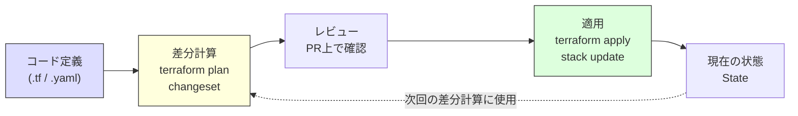
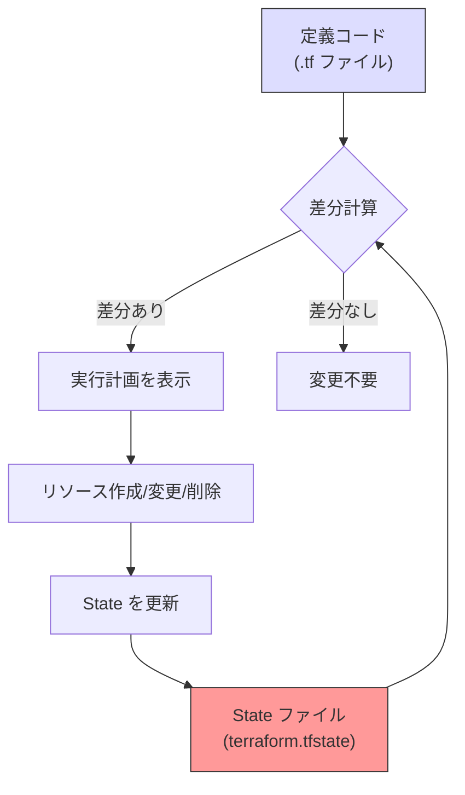
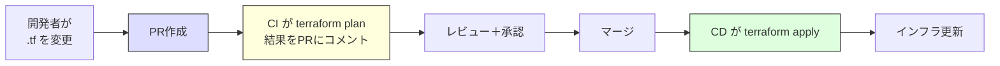

# IaCとクラウドインフラ管理（Infrastructure as Code）

> **一言で言うと:** インフラの構成を手動でコンソール操作するのではなく、コードとして宣言的に定義し、バージョン管理・レビュー・自動適用できるようにするプラクティス。AWS CloudFormation、Terraform、OpenTofu が主要ツールであり、選択はクラウド戦略とチームの制約によって決まる。

## なぜ IaC が必要か

手動でクラウドリソースを管理する場合、以下の問題が不可避になる：

- **再現性がない** — 「本番と同じステージング環境を作って」と言われても、手動で構築した環境を正確に再現できない。微妙な設定差異がバグの原因になる
- **変更履歴が追えない** — 誰が、いつ、なぜセキュリティグループのルールを変更したのか分からない。コンソール操作はgitで管理できない
- **スケールしない** — 環境が1つなら手動で管理できても、開発・ステージング・本番・災害復旧の4環境を同じ構成で維持するのは手動では不可能に近い
- **レビューできない** — インフラ変更をプルリクエストでレビューする仕組みがなく、設定ミスが本番に直接反映される

IaC はこれらを「インフラの定義をコードとして扱う」ことで解決する。[[CI-CD|CI/CD]]パイプラインに組み込めば、コードの変更と同じフローでインフラの変更をテスト・レビュー・デプロイできる。

## 宣言的 vs 命令的アプローチ

IaC ツールは大きく2つのアプローチに分かれる。

| | 宣言的（Declarative） | 命令的（Imperative） |
|---|---|---|
| **考え方** | 「最終的にこうなっていてほしい」 | 「この順番でこれを実行しろ」 |
| **代表ツール** | Terraform, CloudFormation, OpenTofu | シェルスクリプト, AWS CLI |
| **冪等性** | ツールが自動で保証 | 自分で担保する必要がある |
| **差分検出** | ツールが現在の状態と比較して差分を計算 | 実行するたびに全手順が走る |
| **学習コスト** | DSLの理解が必要 | 既存のスクリプト知識で書ける |

実務では**宣言的アプローチが主流**。理由は冪等性と差分検出が自動で得られるため、「今のインフラに対してこの変更を適用すると何が起きるか」を事前にプレビューできること。



## 主要ツールの比較

### AWS CloudFormation

AWSネイティブのIaCサービス。AWSリソースをJSON/YAMLテンプレートで定義し、「スタック（Stack）」という単位で管理する。

**特徴：**
- AWSが提供するため追加コスト不要、API対応が最速
- State管理をAWS側が行うため、自前でStateファイルを管理する必要がない
- AWSリソースのみが対象（マルチクラウドには使えない）
- テンプレートが冗長になりがち（特にJSON）

```yaml
# CloudFormation テンプレート例：VPC + サブネット
AWSTemplateFormatVersion: '2010-09-09'
Description: Simple VPC with public subnet

Resources:
  MyVPC:
    Type: AWS::EC2::VPC
    Properties:
      CidrBlock: 10.0.0.0/16
      EnableDnsSupport: true
      EnableDnsHostnames: true
      Tags:
        - Key: Name
          Value: my-app-vpc

  PublicSubnet:
    Type: AWS::EC2::Subnet
    Properties:
      VpcId: !Ref MyVPC
      CidrBlock: 10.0.1.0/24
      AvailabilityZone: !Select [0, !GetAZs '']
      MapPublicIpOnLaunch: true
      Tags:
        - Key: Name
          Value: my-app-public-subnet

  InternetGateway:
    Type: AWS::EC2::InternetGateway

  VPCGatewayAttachment:
    Type: AWS::EC2::VPCGatewayAttachment
    Properties:
      VpcId: !Ref MyVPC
      InternetGatewayId: !Ref InternetGateway

Outputs:
  VPCId:
    Value: !Ref MyVPC
  SubnetId:
    Value: !Ref PublicSubnet
```

### Terraform

HashiCorp が開発した IaC ツール。HCL（HashiCorp Configuration Language）という独自のDSLでリソースを定義する。AWS, GCP, Azure をはじめ数千のプロバイダーに対応する。

**特徴：**
- マルチクラウド対応 — 1つのツールで AWS + Cloudflare + Datadog 等を一元管理可能
- 豊富なエコシステム（モジュール、プロバイダー）
- State ファイルの管理が利用者の責任（S3 + DynamoDB、または Terraform 1.10+ / OpenTofu では S3 ネイティブロッキングでリモート管理）
- 2023年にライセンスが BSL 1.1（Business Source License）に変更 — 商用利用に制約が生じるケースがある

```hcl
# Terraform 例：同等の VPC + サブネット
terraform {
  required_providers {
    aws = {
      source  = "hashicorp/aws"
      version = "~> 5.0"
    }
  }

  # Stateをリモート管理（チーム開発の必須設定）
  # Terraform 1.10+ では use_lockfile = true で S3 ネイティブロッキングが利用可能
  # 旧バージョンでは dynamodb_table によるロックが必要
  backend "s3" {
    bucket       = "my-terraform-state"
    key          = "prod/terraform.tfstate"
    region       = "ap-northeast-1"
    use_lockfile = true
    encrypt      = true
  }
}

provider "aws" {
  region = "ap-northeast-1"
}

resource "aws_vpc" "main" {
  cidr_block           = "10.0.0.0/16"
  enable_dns_support   = true
  enable_dns_hostnames = true

  tags = {
    Name = "my-app-vpc"
  }
}

resource "aws_subnet" "public" {
  vpc_id                  = aws_vpc.main.id
  cidr_block              = "10.0.1.0/24"
  availability_zone       = "ap-northeast-1a"
  map_public_ip_on_launch = true

  tags = {
    Name = "my-app-public-subnet"
  }
}

resource "aws_internet_gateway" "main" {
  vpc_id = aws_vpc.main.id
}
```

### OpenTofu

Terraform のオープンソースフォーク。2023年8月にHashiCorpがTerraformのライセンスをMPL 2.0からBSLに変更したことを受け、Linux Foundation傘下で開発が始まった。

**経緯：**
1. Terraform は長年 MPL 2.0（Mozilla Public License）で公開されていた
2. 2023年8月、HashiCorpが BSL 1.1 に変更 — Terraformと競合するサービスの提供が制限される
3. コミュニティが反発し、MPL 2.0ベースのフォークとして OpenTofu を立ち上げ
4. Linux Foundation がホスト。`terraform` コマンドを `tofu` に置き換えるだけで移行可能（互換性が高い）

**Terraform との主な違い：**

| 観点 | Terraform | OpenTofu |
|------|-----------|----------|
| ライセンス | BSL 1.1（商用制約あり） | MPL 2.0（制約なし） |
| 開発主体 | HashiCorp（IBM傘下） | Linux Foundation + コミュニティ |
| State暗号化 | Terraform Cloud で対応 | ネイティブでState暗号化をサポート |
| プロバイダー互換 | 本家 | Terraform プロバイダーをそのまま利用可能 |
| CLI互換 | `terraform` | `tofu`（サブコマンドはほぼ同一） |
| レジストリ | registry.terraform.io | OpenTofu独自レジストリ + Terraform互換 |

**選択指針：**
- AWS単一 + 小規模チーム → **CloudFormation**（追加ツール不要、State管理の心配がない）
- マルチクラウド or 大規模 → **Terraform / OpenTofu**
- OSSライセンスが重要 → **OpenTofu**
- HashiCorp のエンタープライズサポートが必要 → **Terraform**
- [[Docker|コンテナ]]が動くインフラ（VPC、ECS/EKS、RDS等）のプロビジョニングには IaC が標準的に使われる。[[AWSコンテナサービスとDockerの実運用]]も参照

### AWS CDK / Pulumi — 汎用プログラミング言語による IaC

HCL や YAML ではなく、TypeScript・Python・Go 等の汎用プログラミング言語でインフラを定義するアプローチもある。

**AWS CDK（Cloud Development Kit）** は AWS が提供するフレームワークで、内部的に CloudFormation テンプレートを生成する（[[AWS-CDKのコンストラクトモデル|コンストラクトモデルの詳細]]を参照）。**Pulumi** はマルチクラウド対応のツールで、Terraform プロバイダーを活用しつつ汎用言語で記述できる。

```typescript
// AWS CDK（TypeScript）例：同等の VPC + サブネット
import * as cdk from 'aws-cdk-lib';
import * as ec2 from 'aws-cdk-lib/aws-ec2';

class VpcStack extends cdk.Stack {
  constructor(scope: cdk.App, id: string) {
    super(scope, id);

    const vpc = new ec2.Vpc(this, 'MyAppVpc', {
      ipAddresses: ec2.IpAddresses.cidr('10.0.0.0/16'),
      maxAzs: 1,
      subnetConfiguration: [
        {
          cidrMask: 24,
          name: 'Public',
          subnetType: ec2.SubnetType.PUBLIC,
        },
      ],
    });
  }
}

const app = new cdk.App();
new VpcStack(app, 'VpcStack');
```

```python
# Pulumi（Python）例：同等の VPC + サブネット
import pulumi_aws as aws

vpc = aws.ec2.Vpc("my-app-vpc",
    cidr_block="10.0.0.0/16",
    enable_dns_support=True,
    enable_dns_hostnames=True,
    tags={"Name": "my-app-vpc"},
)

subnet = aws.ec2.Subnet("my-app-public-subnet",
    vpc_id=vpc.id,
    cidr_block="10.0.1.0/24",
    map_public_ip_on_launch=True,
    tags={"Name": "my-app-public-subnet"},
)

igw = aws.ec2.InternetGateway("main", vpc_id=vpc.id)
```

**HCL/YAML vs 汎用言語の使い分け:**

| 観点 | HCL / YAML（Terraform等） | 汎用言語（CDK / Pulumi） |
|------|--------------------------|------------------------|
| 学習コスト | DSL の習得が必要だが、記述は簡潔 | 言語の既存知識を活かせる |
| 型安全性 | 限定的 | IDE の補完・型チェックが使える |
| テスト | `terraform test` 等 | 通常のテストフレームワークが使える |
| 抽象化 | Module | クラス・関数・ライブラリ |
| エコシステム | 最大（Terraform Registry） | 成長中 |
| 適用場面 | シンプルなインフラ定義 | 複雑なロジックや条件分岐が多い場合 |

## 主要ツール総合比較

| 観点 | CloudFormation | Terraform | OpenTofu | AWS CDK | Pulumi |
|------|---------------|-----------|----------|---------|--------|
| 対応クラウド | AWSのみ | マルチクラウド | マルチクラウド | AWSのみ | マルチクラウド |
| 定義言語 | JSON / YAML | HCL | HCL | TypeScript / Python 等 | TypeScript / Python / Go 等 |
| State管理 | AWS側が管理 | 自前（S3等） | 自前（S3等） | AWS側（CFn経由） | 自前 or Pulumi Cloud |
| 差分プレビュー | Change Set | `terraform plan` | `tofu plan` | `cdk diff` | `pulumi preview` |
| モジュール機構 | Nested Stack | Module Registry | Module Registry | Construct Library | コンポーネント |
| 学習コスト | 低（AWS知識で書ける） | 中（HCLの習得が必要） | 中（Terraformと同等） | 中（言語知識を活かせる） | 中（言語知識を活かせる） |
| ドリフト検出 | Drift Detection機能あり | `plan` で検出 | `plan` で検出 | CFn経由で検出 | `pulumi refresh` |
| 料金 | 無料 | OSS無料 / Cloud有料 | 完全無料 | 無料 | OSS無料 / Cloud有料 |

## State管理 — IaC最大の落とし穴

Terraform / OpenTofu において、State（状態ファイル）は「現在のインフラがどうなっているか」を記録するファイル。IaCツールはこのStateと定義コードを比較して差分を計算する。



### State に関する典型的な事故

**1. State をローカルに置いたまま複数人で作業**

```
# 開発者Aがローカルで apply
terraform apply  # → State がローカルの terraform.tfstate に保存

# 開発者BもローカルでState を持ったまま apply
terraform apply  # → AとBのStateが乖離し、リソースが重複作成される
```

対策: **リモートバックエンド**（S3 + ロック機構）を必ず使う。Terraform 1.10+ では S3 ネイティブロッキング、旧バージョンでは DynamoDB によるロックを設定する。

**2. State ファイルの直接編集・削除**

State を手動で編集したり削除すると、Terraform は既存リソースの存在を忘れる。次の `apply` で同じリソースを二重作成しようとし、名前の衝突やリソース制限に引っかかる。

対策: State の操作は `terraform state mv`, `terraform state rm` 等の専用コマンドで行う。

**3. ドリフト（Drift）**

IaCコードで定義していないが、誰かがコンソールから手動でリソースを変更した場合、Stateとの不整合が発生する。

対策: `terraform plan` を定期的に実行してドリフトを検出する。CI/CDパイプラインでの定期実行が有効。

## よくある落とし穴

### 1. 「全てをIaCで管理しなければならない」という思い込み

IaCの導入は段階的に行うべき。最初から全リソースをコード化しようとすると、学習コストと初期工数で挫折する。まずは新規リソースからIaC管理を始め、既存リソースは `terraform import` 等で段階的に取り込む。

### 2. 巨大な単一Stateファイル

全環境・全サービスのリソースを1つのStateファイルで管理すると、`plan` の実行時間が長くなり、変更の影響範囲が把握しにくくなる。環境別（dev/staging/prod）とサービス別でStateを分割する。

### 3. シークレットのハードコード

データベースのパスワードやAPIキーをIaCコードに直接書くと、gitリポジトリに機密情報がコミットされる。AWS Secrets Manager や HashiCorp Vault から動的に参照する仕組みを使う。

```hcl
# NG: パスワードをハードコード
resource "aws_db_instance" "main" {
  password = "my-secret-password"  # gitに残る
}

# OK: Secrets Managerから参照
data "aws_secretsmanager_secret_version" "db_password" {
  secret_id = "prod/db/password"
}

resource "aws_db_instance" "main" {
  password = data.aws_secretsmanager_secret_version.db_password.secret_string
}
```

### 4. モジュールの過剰抽象化

「再利用のため」にモジュールを何層にもネストすると、変更の影響追跡が困難になる。直接的な記述の重複を恐れるよりも、各環境の構成が明示的に読めることを優先する。モジュール化は3回以上同じパターンが出現してから検討するくらいでよい。

## AIによる実装のアンチパターン

| アンチパターン | なぜ問題か | 対策 |
|---|---|---|
| 全リソースに `depends_on` を明示 | Terraform/OpenTofu は参照関係から依存を自動推論する。明示的な `depends_on` は循環参照やデプロイ速度低下の原因になる | 属性参照（`aws_vpc.main.id`）で暗黙の依存を作る。`depends_on` は自動推論できないケース（IAMポリシーの伝播待ち等）のみ |
| `count` で条件分岐を多用 | インデックスベースの管理で、リソースの追加・削除時に意図しない再作成が発生する | `for_each` を使い、キーベースで管理する |
| 環境ごとにコードをコピー | dev/staging/prod でほぼ同じコードが3セット存在し、片方だけ修正漏れが起きる | 変数ファイル（`.tfvars`）やワークスペースで環境を切り替える |
| `terraform apply -auto-approve` をCIで無条件実行 | plan の内容を確認せずに適用し、意図しないリソース削除が本番で発生する | `plan` の出力をPRコメントに投稿し、マージ後に `apply` を実行するフローにする |

## GitOps との関係

IaC は GitOps（Git をインフラの唯一の真実の源とするプラクティス）と密接に関係する。



このフローにより、インフラの変更もアプリケーションコードと同じレビュープロセスを経る。「誰が何をなぜ変更したか」がgit履歴に残り、監査対応やトラブルシューティングに役立つ。

## 参考リソース

- [Terraform 公式ドキュメント](https://developer.hashicorp.com/terraform/docs) — HCLの文法からベストプラクティスまで網羅
- [OpenTofu 公式ドキュメント](https://opentofu.org/docs/) — Terraformからの移行ガイドも充実
- [AWS CloudFormation ユーザーガイド](https://docs.aws.amazon.com/AWSCloudFormation/latest/UserGuide/) — テンプレートリファレンスが実用的
- *Terraform: Up & Running* — Yevgeniy Brikman（IaCの設計パターンを体系的に学べる実践書）
