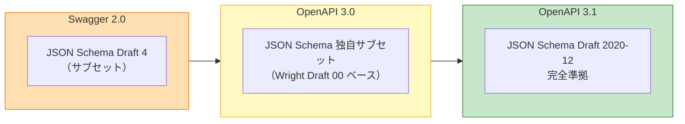
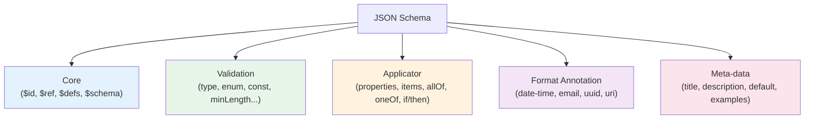

# JSON Schema と OpenAPI の関係（JSON Schema & its role in OpenAPI）

> **一言で言うと:** JSON Schema は JSON の「型」と「制約」を JSON 自身で記述する標準仕様で、OpenAPI の `schemas` セクションはこの JSON Schema を内部文法として採用している。OpenAPI 3.0 は JSON Schema の「ほぼ互換な独自方言」だったが、**OpenAPI 3.1 で JSON Schema Draft 2020-12 に完全準拠**した。

## JSON Schema とは何か

JSON Schema は「ある JSON 値が有効か」を宣言的に表現するための JSON ベースの DSL。単なる型（string / number）だけでなく、値の範囲・長さ・列挙・パターン・相互依存関係まで記述でき、RFC ではなく IETF の Internet Draft として段階的に進化してきた標準である。

| ドラフト | 年 | 主な変更点 |
|----------|----|----|
| Draft 4 | 2013 | 広く普及した最初の安定版。OpenAPI 2.0（Swagger）が採用 |
| Draft 7 | 2018 | `if/then/else`、`$comment`、annotation の整理 |
| 2019-09 | 2019 | `$defs`、`unevaluatedProperties`、vocabulary 概念の導入 |
| **2020-12** | 2020 | **OpenAPI 3.1 が採用。`$dynamicRef`、配列 `items` の分離** |

JSON Schema は単一の巨大仕様ではなく、**Core / Validation / Applicator / Format Annotation** など複数のボキャブラリに分割されており、ツールは必要なボキャブラリだけ実装できる。

### 最小例

```json
{
  "$schema": "https://json-schema.org/draft/2020-12/schema",
  "type": "object",
  "required": ["title", "author"],
  "properties": {
    "title":      { "type": "string", "minLength": 1, "maxLength": 200 },
    "author":     { "type": "string" },
    "publishedAt":{ "type": "string", "format": "date" },
    "tags": {
      "type": "array",
      "items": { "type": "string" },
      "uniqueItems": true,
      "maxItems": 10
    }
  },
  "additionalProperties": false
}
```

`additionalProperties: false` を明示しない限り、**未定義のフィールドは自由に追加できる**のが JSON Schema のデフォルト挙動。これは後述の落とし穴の筆頭。

## OpenAPI との関係：方言から完全準拠へ

OpenAPI の `components.schemas` や `requestBody.content.schema` の中身は、すべて JSON Schema の構文で書かれている。ただしバージョンによって互換性が異なる。



### OpenAPI 3.0 と 3.1 の差分（抜粋）

| 機能 | OpenAPI 3.0 | OpenAPI 3.1 |
|------|-------------|-------------|
| `nullable: true` | 3.0 独自（JSON Schema にはない） | 廃止。`type: ["string", "null"]` を使う |
| `exclusiveMinimum` / `exclusiveMaximum` | boolean（JSON Schema Draft 4 相当） | number（Draft 6 以降と同じ） |
| `type` の配列指定 | 不可（単一型のみ） | 可能（`["string", "null"]` など） |
| `examples` | 単一の `example` | 複数の `examples` が自然に使える |
| `$ref` と他キーワードの併用 | `$ref` の隣の兄弟キーワードは無視 | 併用可能 |
| JSON Schema 仕様書の参照 | 独自拡張 | 直接参照可能 |

この差分は「バリデーションが通るかどうか」に直結するため、**既存 OpenAPI 3.0 スキーマを 3.1 に昇格させるには機械的な変換が必要**になる。特に `nullable` は最頻出の書き換え箇所。なお図中の「Wright Draft 00」は JSON Schema 仕様草案のコードネーム（Draft 5 相当）で、OpenAPI 3.0 はこれを下敷きにしつつ `nullable` など独自キーワードを足した方言として定義されている。

3.0 → 3.1 の自動変換を完全にこなす単一の CLI は現状存在せず、実務では **`@redocly/cli` の lint ルールで差分を検出** → `nullable` 等を置換するスクリプトや `openapi-contrib/openapi-upgrade` のようなライブラリで一括変換し、最後に Spectral で lint し直す、という段階的な移行が一般的。

## JSON Schema の主要キーワード体系



### 組み合わせキーワード（composition）

OpenAPI でもよく使う `allOf` / `oneOf` / `anyOf` / `not` は JSON Schema 由来で、型合成の表現力の中核。

| キーワード | 意味 | 典型的な用途 |
|-----------|------|------------|
| `allOf` | すべての部分スキーマにマッチ | スキーマの継承・ミックスイン |
| `oneOf` | ちょうど1つにマッチ（排他的 union） | 判別可能ユニオン（discriminated union） |
| `anyOf` | 1つ以上にマッチ（非排他的 union） | 複数の型を受け入れる |
| `not` | 指定スキーマにマッチしない | 否定制約（例: 「文字列ではない」） |

`oneOf` はバリデータが**全分岐を評価**するためコストが高い。OpenAPI では `discriminator` で分岐先を事前に決定できる。

## コード例

### TypeScript — Ajv で JSON Schema バリデーション

Ajv は JavaScript/TypeScript で最も広く使われる JSON Schema バリデータ。Draft 2020-12 対応版 `ajv/dist/2020` を使えば OpenAPI 3.1 と同じ方言で検証できる。

```typescript
import Ajv2020 from "ajv/dist/2020";
import addFormats from "ajv-formats";

interface CreateBookRequest {
  title: string;
  author: string;
  publishedAt?: string | null;
}

// Draft 2020-12 ネイティブの書き方：null を許容する場合は type 配列を使う
const schema = {
  $schema: "https://json-schema.org/draft/2020-12/schema",
  type: "object",
  required: ["title", "author"],
  additionalProperties: false,
  properties: {
    title:       { type: "string", minLength: 1, maxLength: 200 },
    author:      { type: "string" },
    publishedAt: { type: ["string", "null"], format: "date" },
  },
} as const;

const ajv = new Ajv2020({ allErrors: true });
addFormats(ajv);
const validate = ajv.compile<CreateBookRequest>(schema);

const input: unknown = { title: "新しい本", author: "著者名" };

if (!validate(input)) {
  console.error(validate.errors);
  process.exit(1);
}

// validate が true を返した時点で input は CreateBookRequest に型ガードされる
console.log(input.title);
```

`compile<T>(schema)` のジェネリック引数で TypeScript 型を明示することで、`validate(input)` が true を返したブランチ内で input が `T` に絞り込まれる。Ajv 独自の `nullable: true` ではなく `type: ["string", "null"]` を使うことで、本文で説明した Draft 2020-12 標準の書き方と一貫させている。

### Python — jsonschema ライブラリ

公式の `jsonschema` パッケージが Draft 2020-12 までサポートしている。

```python
from jsonschema import Draft202012Validator, ValidationError

schema = {
    "$schema": "https://json-schema.org/draft/2020-12/schema",
    "type": "object",
    "required": ["title", "author"],
    "additionalProperties": False,
    "properties": {
        "title":  {"type": "string", "minLength": 1, "maxLength": 200},
        "author": {"type": "string"},
        "tags": {
            "type": "array",
            "items": {"type": "string"},
            "uniqueItems": True,
        },
    },
}

validator = Draft202012Validator(schema)

payload = {"title": "新しい本", "author": "著者名", "tags": ["tech", "tech"]}

errors = sorted(validator.iter_errors(payload), key=lambda e: e.path)
for err in errors:
    print(f"{'/'.join(map(str, err.path))}: {err.message}")
# 出力: tags: ['tech', 'tech'] has non-unique elements
```

`Draft202012Validator` を明示することで、ライブラリが将来新しいドラフトに追従してもバリデーション挙動が固定される。

### Go — santhosh-tekuri/jsonschema

Go では `santhosh-tekuri/jsonschema/v5` が Draft 2020-12 対応で、OpenAPI スキーマの検証にも転用できる。

```go
package main

import (
	"fmt"
	"strings"

	"github.com/santhosh-tekuri/jsonschema/v5"
)

func main() {
	schemaJSON := `{
	  "$schema": "https://json-schema.org/draft/2020-12/schema",
	  "type": "object",
	  "required": ["title", "author"],
	  "additionalProperties": false,
	  "properties": {
	    "title":  {"type": "string", "minLength": 1, "maxLength": 200},
	    "author": {"type": "string"}
	  }
	}`

	compiler := jsonschema.NewCompiler()
	if err := compiler.AddResource("book.json", strings.NewReader(schemaJSON)); err != nil {
		panic(err)
	}
	sch, err := compiler.Compile("book.json")
	if err != nil {
		panic(err)
	}

	payload := map[string]any{"title": "新しい本", "author": "著者名"}
	if err := sch.Validate(payload); err != nil {
		fmt.Println("invalid:", err)
		return
	}
	fmt.Println("valid")
}
```

## TypeScript の型と JSON Schema

JSON Schema と TypeScript は似た目的（データ構造を記述する）を持つが、重要な違いがある。

| 観点 | TypeScript の型 | JSON Schema |
|------|---------------|------------|
| 動作タイミング | **コンパイル時のみ**（実行時は消滅） | **実行時**に値を検証 |
| 記述対象 | プログラム内のあらゆる値（関数、クラス、etc） | JSON として表現可能な値のみ |
| 値の制約 | 表現できない（`minLength: 5` 相当は不可） | 数値範囲・長さ・正規表現・列挙を直接記述可能 |
| 生成方向 | `json-schema-to-typescript` で JSON Schema → 型 | `ts-json-schema-generator` で型 → JSON Schema |

したがって、**同じ型を TS 側と JSON Schema 側で別々に書くと必ずズレる**。単一の真実の源（Single Source of Truth）を決め、そこから他方を生成するのが鉄則。実務では以下の2パターンが主流:

1. **スキーマ駆動:** OpenAPI YAML を正とし、TypeScript 型を生成（orval、openapi-typescript）
2. **zod ファースト:** zod のスキーマを正とし、`z.infer` で TS 型、`zod-to-json-schema` で JSON Schema を生成

どちらを選ぶかは、「契約がチーム間に跨るか」で判断する。外部に公開する API は OpenAPI/JSON Schema を正とし、自チーム完結のフォームや社内 RPC は zod 正の方が記述量が少ない。

## よくある落とし穴

### 1. `additionalProperties` のデフォルトは `true`

スキーマで定義していないキーも**黙って通過**する。攻撃者が任意のフィールドを付加してサーバー側のロジックに影響を与える Mass Assignment 脆弱性の温床になる。`additionalProperties: false` を原則全スキーマに書くか、ルート側で統一ポリシーにする。これは [[OpenAPIとスキーマ駆動開発]] の落とし穴節でも同じ警告がある。

### 2. OpenAPI 3.0 の `nullable: true` は 3.1 で廃止

3.0 では `type: string, nullable: true` と書くが、3.1 では `type: ["string", "null"]` になる。移行時の機械変換漏れで「nullable が効かなくなる」事故が頻発する。`@redocly/cli` で lint して差分を検出し、`openapi-contrib/openapi-upgrade` 等のライブラリか手動スクリプトで一括置換するのが安全（`swagger2openapi` は Swagger 2.0 → OpenAPI 3.0 の変換ツールで、3.0 → 3.1 の移行には使えない点に注意）。

### 3. `format` は「アノテーション」であり自動では検証されない

JSON Schema の `format: "email"` や `format: "date-time"` は、**仕様上はヒント扱い**でバリデータ実装ごとに検証するかどうかが異なる。Ajv では `ajv-formats` を別途追加しないと無視されるし、`jsonschema`（Python）は `format_checker` を渡さない限り検証しない。ドキュメントだけで安心すると本番で通過してしまう。

### 4. `oneOf` の分岐はコストが高い

`oneOf` は**全分岐を評価して「ちょうど1つにマッチ」を確認**するため、分岐数 × バリデーションコストがかかる。API の入力検証で使う場合は `discriminator` で分岐を絞るか、`anyOf`（1つ以上マッチで十分）に緩められないかを検討する。

### 5. `$ref` の循環と相対パス

`$ref: "#/components/schemas/Node"` のような再帰参照は仕様上は合法だが、バリデータによってはスタックオーバーフローや無限ループを起こす。また、**ファイルをまたぐ `$ref` の解決規則**はツールごとに微妙に異なり、`redocly bundle` のようなバンドラで単一ファイルに畳んでから検証するのが無難。

### 6. JSON Schema は「整数とする数値」の区別に弱い

`type: "integer"` は `1.0` を受け入れる実装と拒否する実装がある（JSON 的には `1` と `1.0` は区別されないため）。API の契約で「整数のみ」を厳格に要求する場合は、`type: "integer"` に加えて `multipleOf: 1` を指定するか、言語側でパース後に整数チェックを追加する。

## AIによる実装のアンチパターン

| アンチパターン | なぜ問題か | 対策 |
|---|---|---|
| TypeScript 型と JSON Schema を独立に手書き | 片方を更新すると必ずもう片方がズレる | 単一の真実の源（OpenAPI YAML or zod）からの生成に統一 |
| `additionalProperties` を省略したまま「厳密スキーマ」と称する | Mass Assignment の温床、LLM はデフォルトが許可であることを忘れがち | ルートで `additionalProperties: false` をデフォルト方針に |
| LLM が `anyOf` と `oneOf` を混同して生成 | 挙動が異なる（マッチ個数制約）、パフォーマンス特性も違う | 生成後に「1つに決まるか / 複数可か」を人間がレビュー |
| OpenAPI 3.0 と 3.1 の文法を混ぜて生成 | `nullable` と `type: [..., "null"]` の混在などでバリデータが通らない | スキーマのバージョンを冒頭で固定し、lint で検証 |
| `format: "email"` だけでメール検証したつもりになる | 実装依存、デフォルト無効の実装が多い | `format-assertion` ボキャブラリを有効にするか、別途正規表現・ライブラリで検証 |

## 関連トピック

- 親: [[API設計-REST-GraphQL]] — OpenAPI はこのトピックの文脈で扱う API 契約記述の標準
- [[OpenAPIとスキーマ駆動開発]] — OpenAPI の全体構造とコード生成・ツールチェーンの詳細
- [[バリデーション]] — バックエンドの入力検証の信頼境界と JSON Schema の位置づけ
- [[WAF]] — ポジティブセキュリティ WAF の源泉となるスキーマ定義。スキーマ駆動検証は WAF に対する「構造的防御」でもある

## 参考リソース

- [JSON Schema 公式サイト](https://json-schema.org/) — ドラフト履歴・ボキャブラリ仕様・実装リスト
- [OpenAPI 3.1 仕様書](https://spec.openapis.org/oas/v3.1.0) — Draft 2020-12 完全準拠の根拠条文
- [Ajv ドキュメント](https://ajv.js.org/) — JavaScript 実装のリファレンス
- [Understanding JSON Schema](https://json-schema.org/understanding-json-schema/) — キーワードごとの逆引き入門
