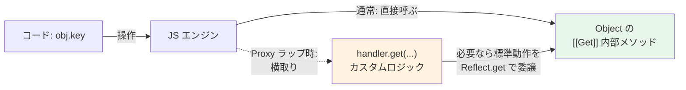

# JSにおけるProxyとObject（Object & Proxy）

> **一言で言うと:** Object は「キーと値を格納する基本データ構造」であり、Proxy は「その Object に対する全ての操作（読み書き・削除・存在確認・関数呼び出し等）を割り込んで書き換える仕組み」。Vue 3 のリアクティビティ、Immer のドラフト、ORM の遅延ロードなど、モダンなフレームワークの“魔法”の正体である。

## ObjectとProxyの関係

JS の Object は単なる連想配列ではない。内部的には `[[Prototype]]`（[[JSにおけるprototype|プロトタイプ]]）と**プロパティ記述子（property descriptor）** を持ち、ECMAScript 仕様では一連の **内部メソッド（Essential Internal Methods）** によって振る舞いが定義されている。

| コード | 呼び出される内部メソッド |
|------|------|
| `obj.key` | `[[Get]]` |
| `obj.key = v` | `[[Set]]` |
| `delete obj.key` | `[[Delete]]` |
| `"key" in obj` | `[[HasProperty]]` |
| `Object.keys(obj)` / `for...in` | `[[OwnPropertyKeys]]` |
| `Object.getPrototypeOf(obj)` | `[[GetPrototypeOf]]` |
| `new Fn()` | `[[Construct]]`（関数オブジェクト） |
| `fn(...)` | `[[Call]]`（関数オブジェクト） |

**Proxy はまさにこの内部メソッドを「トラップ（trap）」する仕組み**である。Object の振る舞いそのものを実行時にカスタマイズできる、JS におけるメタプログラミングの中核。



## Object の基礎 — Proxy 理解の前提

### プロパティ記述子（Property Descriptor）

```javascript
const obj = { name: 'Alice' };
Object.getOwnPropertyDescriptor(obj, 'name');
// { value: 'Alice', writable: true, enumerable: true, configurable: true }
```

| 属性 | 意味 |
|------|------|
| `value` | プロパティの値 |
| `writable` | 値を書き換えられるか |
| `enumerable` | `for...in` / `Object.keys` で列挙されるか |
| `configurable` | 削除・記述子変更ができるか |

`obj.x = v` や class フィールドで作るプロパティは全て `writable/enumerable/configurable` が `true`。`Object.freeze` は `writable` と `configurable` を `false` にし、`Object.defineProperty` で個別に制御できる。

### Reflect — 内部メソッドへの直接アクセス

ES2015 で導入された `Reflect` は、内部メソッドを通常関数として呼び出せる API。Proxy のハンドラ内で「デフォルトの動作」を呼ぶために使うのが定石:

```javascript
Reflect.get(obj, 'key', receiver);    // obj[key] と等価
Reflect.set(obj, 'key', value, recv); // obj[key] = value と等価
Reflect.has(obj, 'key');              // 'key' in obj と等価
Reflect.deleteProperty(obj, 'key');   // delete obj[key]
Reflect.ownKeys(obj);                 // 文字列キー + Symbol キー全列挙
```

`Reflect` のメソッドは Proxy のトラップ名と1対1に対応している点がポイント。

## Proxy の構造

```javascript
const proxy = new Proxy(target, handler);
```

`handler` に定義した**トラップ**が対応する内部メソッドを横取りする。**トラップが未定義のキーは target に素通し（pass-through）** されるので、handler が空 `{}` の Proxy は target と同じ振る舞いをする。

主要なトラップ:

| トラップ | 横取りする操作 |
|---|---|
| `get(target, prop, receiver)` | プロパティ読み取り |
| `set(target, prop, value, receiver)` | プロパティ書き込み |
| `has(target, prop)` | `in` 演算子 |
| `deleteProperty(target, prop)` | `delete` |
| `ownKeys(target)` | `Object.keys`, `Object.getOwnPropertyNames`, `Reflect.ownKeys`, `JSON.stringify`（※ `for...in` はプロトタイプチェーンも辿るため `getPrototypeOf` トラップと連動） |
| `getOwnPropertyDescriptor(target, prop)` | `Object.getOwnPropertyDescriptor` |
| `apply(target, thisArg, args)` | 関数呼び出し（target が関数のとき） |
| `construct(target, args)` | `new` 演算子 |
| `getPrototypeOf` / `setPrototypeOf` | プロトタイプ操作 |

## コード例

### TypeScript — 読み書きロギングの Proxy

```typescript
function logged<T extends object>(target: T): T {
  return new Proxy(target, {
    get(t, prop, receiver) {
      console.log(`[GET] ${String(prop)}`);
      return Reflect.get(t, prop, receiver);  // 標準動作に委譲
    },
    set(t, prop, value, receiver) {
      console.log(`[SET] ${String(prop)} = ${value}`);
      return Reflect.set(t, prop, value, receiver);
    },
  });
}

const user = logged({ name: 'Alice', age: 30 });
user.age = 31;            // [SET] age = 31
console.log(user.name);   // [GET] name → "Alice"
```

### TypeScript — Vue 3 風リアクティビティの最小実装

```typescript
type Effect = () => void;
const targetMap = new WeakMap<object, Map<PropertyKey, Set<Effect>>>();
let activeEffect: Effect | null = null;

function track(target: object, key: PropertyKey) {
  if (!activeEffect) return;
  let depMap = targetMap.get(target);
  if (!depMap) targetMap.set(target, (depMap = new Map()));
  let deps = depMap.get(key);
  if (!deps) depMap.set(key, (deps = new Set()));
  deps.add(activeEffect);
}

function trigger(target: object, key: PropertyKey) {
  targetMap.get(target)?.get(key)?.forEach((eff) => eff());
}

function reactive<T extends object>(obj: T): T {
  return new Proxy(obj, {
    get(t, key, recv) {
      track(t, key);
      const v = Reflect.get(t, key, recv);
      return typeof v === 'object' && v !== null ? reactive(v) : v;
    },
    set(t, key, value, recv) {
      const ok = Reflect.set(t, key, value, recv);
      trigger(t, key);
      return ok;
    },
  });
}

function effect(fn: Effect) {
  activeEffect = fn;
  fn();              // 初回実行で依存を収集
  activeEffect = null;
}

const state = reactive({ count: 0 });
effect(() => console.log(`count = ${state.count}`));
state.count++;       // 自動で再実行: "count = 1"
```

これが [Vue 3](https://vuejs.org/) のリアクティビティシステム（`@vue/reactivity`）の核心。`ref`/`reactive`/`computed` は全てこの Proxy + 依存追跡の上に組み立てられている。

### Python — `__getattr__` / `__setattr__` との比較

```python
class Logged:
    def __init__(self, target):
        object.__setattr__(self, "_target", target)

    def __getattr__(self, name):           # 属性が見つからない時に呼ばれる
        print(f"[GET] {name}")
        return getattr(self._target, name)

    def __setattr__(self, name, value):    # 全ての属性代入で呼ばれる
        print(f"[SET] {name} = {value}")
        setattr(self._target, name, value)

class User:
    def __init__(self):
        self.name = "Alice"

u = Logged(User())
u.name      # [GET] name → "Alice"
u.age = 30  # [SET] age = 30
```

Python の dunder メソッドは JS Proxy のハンドラと同じ役割。ただし JS Proxy は `in`、`delete`、`Object.keys`、プロトタイプ取得まで**全ての内部操作**を一括で傍受できる点で網羅的。

## Proxy と Object.defineProperty の比較

Vue 2 までは Proxy ではなく `Object.defineProperty` による getter/setter で同等のことを実現していた。両者の違いが Vue 3 が Proxy へ移行した動機を説明する:

| 観点 | `Object.defineProperty` | `Proxy` |
|------|------------------------|--------|
| 既存プロパティの捕捉 | ◎（ただし1キーずつ定義が必要） | ◎ |
| 動的に追加されたプロパティの捕捉 | ✗（事前に定義したキーだけ） | ◎ |
| 配列のインデックス変更・`length` 操作 | ✗ | ◎ |
| `delete` の捕捉 | ✗ | ◎ |
| `in` 演算子の捕捉 | ✗ | ◎ |
| `Map` / `Set` の操作 | ✗ | ◎（apply トラップ等で可能） |
| ブラウザ対応 | IE9+ | IE 不可、モダン環境のみ |

## 実務での使用シーン

| 場面 | Proxy の役割 |
|---|---|
| Vue 3 のリアクティビティ | プロパティアクセスを track/trigger でフックして UI 更新を自動化 |
| [Immer](https://immerjs.github.io/) のドラフト | ミュータブルに見える操作を、内部で新しいオブジェクト生成に変換 |
| ORM の遅延ロード | `user.posts` で初めて DB クエリを発火 |
| バリデーション | `set` トラップで型・範囲チェックを集約（個別プロパティに setter を `defineProperty` するパターンの代替） |
| ダミー API クライアント | `api.users.find()` のようなチェーンを動的に組み立てる（HTTP クライアントの DSL） |
| 監査ログ・トレース | デバッグ時に「いつ誰がどの値を読んだ／書いたか」を記録 |

## よくある落とし穴

### 1. プリミティブはラップできない

`new Proxy` の target は **オブジェクトまたは関数** に限られる。`string`/`number`/`boolean` を直接 Proxy で包むことはできない:

```javascript
new Proxy('hello', {});  // TypeError: Cannot create proxy with a non-object as target
```

ボックス化（`new String('hello')`）すれば可能だが、通常は避けるべき。

### 2. ネストしたオブジェクトは自動でラップされない

```javascript
const obj = { nested: { x: 1 } };
const p = new Proxy(obj, handler);

p.nested.x = 2;
// p.nested の get は捕捉されるが、その先の x = 2 は素のオブジェクトへの操作
// → set トラップは発火しない
```

Vue は `get` トラップ内で**再帰的に reactive() を返す**ことでこの問題を解決している（コード例参照）。ただし全プロパティを eager にラップすると初期化コストが膨らむため、必ず lazy に行う。

### 3. `Reflect` を使わないと receiver が壊れる

```javascript
const target = {
  _name: 'Alice',
  get name() { return this._name; },  // this はどれを指すか?
};

const p = new Proxy(target, {
  get(t, k) { return t[k]; },              // ← Reflect を使わない
});
```

`p.name` を呼ぶと、ゲッター内の `this` は `target` になり、Proxy 経由のチェーンが切れる。`Reflect.get(t, k, receiver)` を使えば receiver（= Proxy）が `this` として渡るため、別の Proxy をプロトタイプにしたチェーンでも一貫して動く。

### 4. private フィールド（`#field`）は Proxy で動作しない

```javascript
class Foo {
  #secret = 42;
  getSecret() { return this.#secret; }
}
const p = new Proxy(new Foo(), {});
p.getSecret();
// TypeError: Cannot read private member #secret from an object
//            whose class did not declare it
```

private フィールドは「`this` が**実際の Foo インスタンス**である」ことを語彙的に要求する。Proxy 経由では `this` が proxy になるため、レシーバ判定で弾かれる。回避策は、`get` トラップ内で取得した関数値を target に bind して返すこと:

```javascript
const p = new Proxy(new Foo(), {
  get(t, k, recv) {
    const v = Reflect.get(t, k, recv);
    return typeof v === 'function' ? v.bind(t) : v;
  },
});
```

ただしこの workaround を使うと private 状態の更新が target 側で直接行われるため、**Proxy の `set` トラップが空振りする**点に注意（Vue 等のリアクティブシステムと private フィールドは本質的に相性が悪い）。

### 5. `WeakMap`/`Map` のキーは proxy と target で別物

```javascript
const map = new WeakMap();
const target = {};
const p = new Proxy(target, {});

map.set(p, 'value');
map.get(target);  // undefined ← p と target は別の参照
```

target を「正規の ID」として扱いたいなら、handler 内で `Reflect.set` する前に target を WeakMap に登録する設計にする。

### 6. `Object.is(p, target)` は false

Proxy は target とは別のオブジェクトとして識別される。「ある proxy のラップ元が誰か」を取得する標準 API はないため、必要なら自前で WeakMap 管理する。

### 7. Proxy は取り消し可能（revocable）にもできる

`Proxy.revocable(target, handler)` は `{ proxy, revoke }` を返し、`revoke()` を呼ぶと以降のあらゆる操作が `TypeError` になる。サンドボックスやプラグインのライフサイクル管理に使える。

## AIによる実装のアンチパターン

| アンチパターン | なぜ問題か | 対策 |
|---|---|---|
| 単純な「プロパティ追加禁止」を Proxy で実装する | `Object.preventExtensions` / `Object.seal` / `Object.freeze` で十分 | 標準 API を使う。Proxy は副作用や動的振る舞いが必要な場合のみ |
| `handler.get` で素の `target[prop]` を返す | receiver が壊れ、ゲッターの `this` や private フィールドが破綻 | 必ず `Reflect.get(target, prop, receiver)` を使う |
| 全フィールドに Proxy を eager に再帰でかける | 起動時に大量の Proxy 生成でメモリ・速度が劣化 | Vue 3 のように lazy に「アクセスされた時だけ」ラップする |
| Proxy を `class` 継承の代わりに使う | プロトタイプチェーンを壊し、`instanceof` や private field が破綻 | 通常の継承や合成（composition）で解決する |
| `JSON.stringify(proxy)` の結果が空になる原因を調査せず諦める | `ownKeys` / `getOwnPropertyDescriptor` トラップを実装していない | 列挙系のトラップも忘れず実装する |
| Proxy で「型バリデーション」を実装する（実行時チェックの代替） | 静的解析の代替にはならず、ホットパスの性能を落とす | 入力境界では [[zod]] / Valibot 等の標準的なバリデータを使い、Proxy は本当に動的な場面に限る |

## 関連トピック

- [[HTML-CSS-JS]] — 親トピック。JS の Object は DOM 操作の起点であり、Proxy は Vue/Solid などモダンフレームワークの中核機構
- [[JSにおけるprototype]] — Object のもう1つの本質。Proxy の `getPrototypeOf` トラップで動的に変更可能
- [[DOMと仮想DOM]] — Vue は Proxy で変更を検知し、仮想 DOM で差分計算する。Proxy（変更検知）と diff（更新適用）は別レイヤー
- [[FluxアーキテクチャとRedux]] — Redux はあえて Proxy を使わずイミュータブル路線。Vue/MobX とは正反対の設計思想

## 参考リソース

- [MDN: Proxy](https://developer.mozilla.org/ja/docs/Web/JavaScript/Reference/Global_Objects/Proxy) — トラップごとの詳細仕様
- [MDN: Reflect](https://developer.mozilla.org/ja/docs/Web/JavaScript/Reference/Global_Objects/Reflect)
- [Vue 3 Reactivity in Depth](https://vuejs.org/guide/extras/reactivity-in-depth.html) — Proxy を使ったリアクティビティの実装解説
- [ECMAScript 仕様: Proxy Object Internal Methods and Internal Slots](https://tc39.es/ecma262/#sec-proxy-object-internal-methods-and-internal-slots) — 内部メソッドとトラップの厳密な対応
