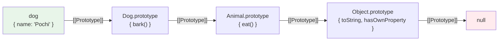

# JSにおけるprototype（Prototype-based Inheritance）

> **一言で言うと:** JavaScriptのオブジェクトは「クラス」ではなく**別のオブジェクト（プロトタイプ）へのリンク**を持ち、プロパティ探索はこのリンクを辿って行われる。`class` 構文はこの仕組みの糖衣構文（syntactic sugar）にすぎない。

## 概念

JavaScriptはC++やJavaのような**クラスベース（class-based）** ではなく、Self言語から受け継いだ**プロトタイプベース（prototype-based）** のオブジェクト指向言語として設計された。

全てのオブジェクトは内部スロット `[[Prototype]]` を持ち、これが**別のオブジェクトへのリンク**になっている。プロパティを参照したとき、そのオブジェクト自身に存在しなければ `[[Prototype]]` の先へ探索が続く — これが **プロトタイプチェーン（prototype chain）** である。



`dog.bark()` を呼ぶと:
1. `dog` 自身に `bark` が無い → `Dog.prototype` を見る → 見つかったので実行
2. `dog.eat()` なら `Dog.prototype` にも無い → `Animal.prototype` で見つかる
3. `dog.toString()` は `Object.prototype` まで辿る

### `prototype` プロパティ と `[[Prototype]]` の違い

この2つの混同が最大のつまずきどころ:

| 名前 | 誰が持つ | 何を指すか |
|------|---------|-----------|
| `[[Prototype]]` 内部スロット | **全てのオブジェクト** | 親オブジェクト。プロパティ探索で辿られる |
| `__proto__` アクセサ | 全てのオブジェクト | `[[Prototype]]` へのレガシーなアクセサ。`Object.prototype.__proto__` は Deprecated 扱いで `Object.getPrototypeOf` / `Object.setPrototypeOf` を使うべき。ただしオブジェクトリテラル `{__proto__: proto}` の記法は ES2015 以降の正規機能 |
| `prototype` プロパティ | **関数（コンストラクタ）のみ** | `new` で生成したインスタンスの `[[Prototype]]` になるオブジェクト |

```javascript
function Dog(name) { this.name = name; }
Dog.prototype.bark = function() { console.log('wan'); };

const pochi = new Dog('Pochi');

pochi.prototype;                      // undefined（インスタンスは持たない）
Object.getPrototypeOf(pochi) === Dog.prototype;  // true
pochi.__proto__ === Dog.prototype;    // true（同じ意味）
```

つまり `Dog.prototype` は「`new Dog()` で作られたインスタンスが `[[Prototype]]` として参照する設計図オブジェクト」であって、`Dog` 自身の親ではない。

## コード例

### 生のprototypeで書く継承

```javascript
// 親: Animal
function Animal(name) {
  this.name = name;
}
Animal.prototype.eat = function() {
  console.log(`${this.name} is eating`);
};

// 子: Dog（Animal を継承）
function Dog(name, breed) {
  Animal.call(this, name);    // 親のコンストラクタを this で呼ぶ
  this.breed = breed;
}
// プロトタイプチェーンを繋ぐ
Dog.prototype = Object.create(Animal.prototype);
Dog.prototype.constructor = Dog;  // constructor 参照を修復
Dog.prototype.bark = function() {
  console.log('wan');
};

const pochi = new Dog('Pochi', 'Shiba');
pochi.eat();   // "Pochi is eating"（Animal.prototype から）
pochi.bark();  // "wan"（Dog.prototype から）
```

### `class` 構文 — 上と完全に等価

ES2015で導入された `class` は**基本的には**上のコードを読みやすく書き換えた糖衣構文であり、内部的にはプロトタイプチェーンのまま:

```javascript
class Animal {
  constructor(name) {
    this.name = name;
  }
  eat() {
    console.log(`${this.name} is eating`);
  }
}

class Dog extends Animal {
  constructor(name, breed) {
    super(name);
    this.breed = breed;
  }
  bark() {
    console.log('wan');
  }
}

const pochi = new Dog('Pochi', 'Shiba');
Object.getPrototypeOf(pochi) === Dog.prototype;          // true
Object.getPrototypeOf(Dog.prototype) === Animal.prototype; // true
```

`class` の内部実装は依然としてプロトタイプチェーンであり、`Dog.prototype.bark` として関数が格納されている。DevToolsで `pochi.__proto__` を展開すれば確認できる。

ただし**完全な糖衣構文ではない**点には注意が必要で、以下は手書きのコンストラクタ関数では再現できない:

- **`new` 強制** — `class` を `new` なしで呼ぶと `TypeError`
- **メソッドの非列挙性** — `class` のメソッドは既定で `enumerable: false`（関数リテラルで `prototype.method =` した場合は `true`）
- **常に strict mode** — `class` 本体は自動的に strict mode で実行される
- **プライベートフィールド `#field`** — 語彙的スコープで真に隠蔽される（WeakMap を使わないと同等機能は作れない）
- **`super` のホームオブジェクト解決** — メソッド定義時点のプロトタイプを静的に参照する

### TypeScriptでの型付け

```typescript
class Animal {
  constructor(public name: string) {}
  eat(): void {
    console.log(`${this.name} is eating`);
  }
}

class Dog extends Animal {
  constructor(name: string, public breed: string) {
    super(name);
  }
  bark(): void {
    console.log('wan');
  }
}

const pochi = new Dog('Pochi', 'Shiba');
pochi.eat();   // 型安全に呼べる
```

TypeScriptはコンパイル時の型検査を追加するだけで、実行時のセマンティクスはJSの `class` = prototypeそのまま。

### `Object.create` — コンストラクタを介さないprototype設定

プロトタイプベースの最も純粋な使い方。クラスも `new` も使わずにオブジェクトを連結できる:

```javascript
const animal = {
  eat() { console.log(`${this.name} is eating`); }
};

const pochi = Object.create(animal);
pochi.name = 'Pochi';
pochi.eat();  // "Pochi is eating"

Object.getPrototypeOf(pochi) === animal;  // true
```

## クラスベース言語との本質的な違い

| 観点 | クラスベース（Java, PHP, Python等） | プロトタイプベース（JS） |
|------|-----|-----|
| 実体 | クラスは型／設計図として独立した言語構造 | `class` も内部的には関数オブジェクトであり、`Dog.prototype` という普通のオブジェクトの集合体 |
| インスタンス生成 | クラスから `new` | 既存オブジェクトから複製・委譲 |
| メソッド解決 | クラス階層（MRO等）を辿る | `[[Prototype]]` チェーンを辿る |
| 実行時の変更 | Java等の静的言語では基本的に不可。Python/PHP/Rubyでも「クラス側」を書き換える形で行う | **インスタンス側**の `[[Prototype]]` を差し替えたり、プロトタイプオブジェクト自体にメソッドを足すのが容易 |

### Pythonとの比較（参考）

Pythonはクラスベースだが、属性探索は `instance.__class__` → MRO（Method Resolution Order）を辿るので、JSの `instance.[[Prototype]] → Constructor.prototype → parent.prototype` と**構造的にはよく似ている**。大きな違いは動的性の軸にある:

- **JS:** インスタンスごとに `Object.setPrototypeOf` でチェーン自体を差し替えられる
- **Python:** 探索元である `__class__` は通常固定で、変更するにはクラス側を書き換える（モンキーパッチ）ことになる

```python
class Animal:
    def eat(self):
        print(f"{self.name} is eating")

class Dog(Animal):
    def bark(self):
        print("wan")

pochi = Dog()
pochi.name = "Pochi"
pochi.eat()     # Animal.eat
type(pochi).__mro__  # (Dog, Animal, object)
```

## よくある落とし穴

### 1. `prototype` プロパティの誤解

`instance.prototype` を書いてしまうケースは頻出。インスタンスにプロトタイプはなく、あるのは `[[Prototype]]`（= `__proto__` / `Object.getPrototypeOf`）。

```javascript
const arr = [1, 2, 3];
arr.prototype;                 // undefined（ハマりどころ）
Array.prototype;               // Arrayのメソッドが並ぶ
Object.getPrototypeOf(arr);    // Array.prototype
```

### 2. 参照型プロパティを `prototype` に置くと共有される

```javascript
function User() {}
User.prototype.tags = [];  // 参照型を prototype に置く

const a = new User();
const b = new User();
a.tags.push('admin');
console.log(b.tags);  // ['admin'] ← 全インスタンスで共有されてしまう
```

`tags` は各インスタンスの `[[Prototype]]` が指す**同じ配列**なので、書き込みが全員に見える。インスタンス固有のデータはコンストラクタ内 (`this.tags = []`) か `class` のフィールド宣言で初期化する。

### 3. `constructor` 参照の破壊

`Dog.prototype = Object.create(Animal.prototype)` だけ書くと、`Dog.prototype.constructor` が `Animal` を指してしまう。`class extends` ではランタイムが自動で修復するが、手書き継承では `Dog.prototype.constructor = Dog;` を忘れずに。

### 4. アロー関数は `prototype` を持たない

```javascript
const Dog = (name) => { this.name = name; };
Dog.prototype;        // undefined
new Dog('Pochi');     // TypeError: Dog is not a constructor
```

アロー関数は `this` を静的に束縛するためコンストラクタとして使えない。

### 5. プロトタイプ汚染（Prototype Pollution）

ユーザー入力でオブジェクトをマージする際、`__proto__` や `constructor.prototype` を経由して `Object.prototype` を書き換えられるとアプリ全体に影響する脆弱性。[[Layer6-セキュリティ/_index|セキュリティ]]観点で重要。対策は `Object.create(null)` で純粋な辞書を使う、`Map` を使う、もしくは `__proto__` キーをフィルタする。

```javascript
// 危険な再帰マージ
function merge(target, src) {
  for (const k in src) {
    // src[k] が null でも typeof は 'object' になるので本来はガードが必要
    if (typeof src[k] === 'object') merge(target[k] ??= {}, src[k]);
    else target[k] = src[k];
  }
}

merge({}, JSON.parse('{"__proto__": {"isAdmin": true}}'));
// k === '__proto__' のとき target.__proto__ はアクセサ経由で Object.prototype を返すため
// ??= は代入せず、そのまま Object.prototype 側にマージされてしまう
({}).isAdmin;  // true ← 全オブジェクトが汚染された
```

## AIによる実装のアンチパターン

| アンチパターン | なぜ問題か | 対策 |
|---|---|---|
| `obj.prototype.xxx` をインスタンスに書く | `prototype` プロパティは関数にしかない | `Object.getPrototypeOf(obj)` または設計を見直す |
| メソッドを `this.method = function(){}` でコンストラクタ内に書く | インスタンスごとに関数オブジェクトが複製されメモリ増 | `class` のメソッドや `prototype` 経由で共有する |
| `Object.setPrototypeOf` を頻繁に使う | JITの最適化を破壊し大幅な性能劣化 | 生成時に `Object.create` か `class` でプロトタイプを固定する |
| `for...in` でインスタンスのプロパティを列挙 | プロトタイプチェーン上のプロパティも拾ってしまう | `Object.keys` / `hasOwnProperty` / `for...of` を使う |

## 実務での使用シーン

現代のWebアプリケーション開発では、直接プロトタイプをいじる場面は激減した。ほとんどは `class` 構文で済む。ただし以下の場面ではprototypeの理解が必要:

- **フレームワーク・ライブラリの実装**（Vue, Lit, Express のミドルウェア拡張など）
- **デバッグ** — DevToolsで `__proto__` を展開してメソッドの出所を特定する
- **ポリフィル** — `Array.prototype.includes` のような既存組み込み型のメソッド拡張（ただし組み込み型のprototype汚染は避けるべき）
- **セキュリティレビュー** — プロトタイプ汚染脆弱性の検出

## 関連トピック

- [[HTML-CSS-JS]] — 親トピック。JSエンジンがDOMを操作する文脈
- [[DOMと仮想DOM]] — DOMノード自体もプロトタイプチェーン（`HTMLDivElement → HTMLElement → Element → Node → EventTarget`）を持つ
- [[Node.js]] — サーバーサイドでも同じプロトタイプ機構が動く
- [[コンポジションover継承]] — プロトタイプチェーンによる継承も深くすると同じ問題を抱える
- [[SQLインジェクションとXSS]] — プロトタイプ汚染もクライアント側の代表的な攻撃ベクター

## 参考リソース

- [MDN: Object prototypes](https://developer.mozilla.org/ja/docs/Learn/JavaScript/Objects/Object_prototypes) — 最も信頼できる入門
- [MDN: Inheritance and the prototype chain](https://developer.mozilla.org/ja/docs/Web/JavaScript/Inheritance_and_the_prototype_chain)
- 書籍:『You Don't Know JS: this & Object Prototypes』(Kyle Simpson) — prototypeを「継承ではなく委譲（delegation）」として捉え直す良書
