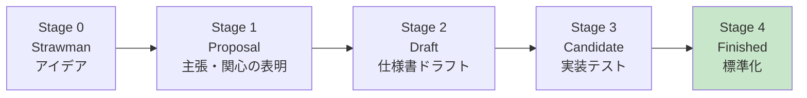
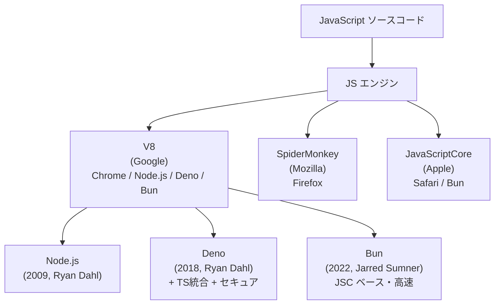

# JavaScript（JavaScript / ECMAScript）

> **一言で言うと:** JavaScript は1995年にBrendan Eichが**わずか10日間**でNetscape Navigator向けに設計した言語で、当初は「ブラウザで動く軽いスクリプト」だった。**プロトタイプベースのオブジェクト指向**・**ファーストクラス関数**・**動的型と弱い型変換**という設計判断と、Web の後方互換性を絶対視する姿勢（Don't break the web）によって、その奇妙さを保ったままWebの覇権言語となった。Node.jsでサーバーサイドへ進出し、ECMAScript標準化と年次リリース化（ES2016〜）を経て、2025年のES2025では Iterator helpers / Set methods / RegExp.escape が追加された。

## 誕生と歴史的経緯

| 年月 | 主な転換点 |
|---|---|
| 1995-05 | Brendan Eich が Netscape で「Mocha」を10日間で設計 |
| 1995-09 | LiveScript に改名し Navigator 2.0β に同梱 |
| 1995-12 | JavaScript に再改名（Java の人気便乗マーケティング） |
| 1996 | Microsoft が JScript で追従（IE3） |
| 1997 | ECMA-262 標準化開始（言語名は ECMAScript） |
| 1999 | ES3 リリース（正規表現・try/catch） |
| 2009 | ES5 リリース（strict mode / JSON / Array methods）、Node.js 登場（Ryan Dahl） |
| 2015 | ES6 / ES2015 大改革（class / let / arrow / Promise / module） |
| 2016 | 年次リリース化開始（毎年6月） |
| 2017 | async/await 標準化（ES2017） |
| 2020 | Deno リリース、2022年に Bun 登場 |
| **2025** | **ES2025（Iterator helpers / Set methods / RegExp.escape / Float16Array）** |

### Brendan Eich の10日間

1995年5月、Netscape は「Java をブラウザに統合する」戦略を検討していたが、同時に「**HTML作者向けの簡単なスクリプト言語も必要**」という判断から、Brendan Eich を雇い10日間で初版を設計させた。Eich の指示は曖昧だった:

- 「Schemeのような関数型言語にしたい」
- 「Javaのように見せろ（マーケティング都合）」
- 「Self（プロトタイプベース）の継承モデルを参考に」

これらの矛盾した要求が混ざった結果、JS は**Lisp系の関数中心思想と、Java風の構文と、Selfのプロトタイプを併せ持つ独特の言語**になった。Eich 自身が後に「**もう一度設計するならクロージャと Lisp ライクな構文は守るが、`==` は捨てる、グローバルオブジェクトは隠す**」と発言している。

### 名前のマーケティング

- **Mocha**（社内コードネーム）→ **LiveScript**（製品名）→ **JavaScript**（最終）
- 当時 Sun Microsystems の Java が大ブームで、Netscape はマーケティング上の便乗を狙った
- **JavaScript と Java は無関係**だが、この命名のせいで現在も初心者を混乱させ続けている

### ECMAScript 標準化と「Don't break the web」

Microsoft が JScript（IE）で独自実装し、両ブラウザで挙動が分裂したため、1997年に ECMA International が **ECMA-262**（ECMAScript）として標準化した。

ECMAScript の設計原則の中で最も重要なのが「**Don't break the web**」:

> 既存のWebサイトが動かなくなる変更は絶対に入れない

これにより、`==` の奇妙な挙動・`var` の hoisting・グローバル汚染などの「**設計ミス**」と当初から認識されていた仕様も、互換性のために永久に残っている。新しい良いやり方は**追加**されるが、悪い古いやり方は**消えない**。

```javascript
// 30年前のJSコードが今でも動く
var x = 5;       // var: 関数スコープ、hoisting する
if (x == "5") {} // == : 暗黙の型変換
this.foo = bar;  // 非strictモードならグローバル汚染
```

新しい書き方（`let`/`const`、`===`、modules）が推奨されるが、古い書き方も完全に valid。

### 年次リリースと TC39 プロセス

ES6（2015）以降、ECMAScript は**毎年6月**に新仕様を確定する。仕様を策定する委員会が **TC39**（Technical Committee 39）。新機能は5段階のステージを通る:



Stage 3 まで進めば多くのエンジンが先行実装する。Babel/TypeScript/SWC が「Stage 3 提案」をサポートするのはこの段階。

#### ES2025（2025年6月確定）の主な追加

| 機能 | 内容 |
|---|---|
| Iterator helpers | `iter.map()` / `filter()` / `take()` / `reduce()` 等が Array と同じ感覚で使える、遅延評価 |
| Set methods | `union()` / `intersection()` / `difference()` / `symmetricDifference()` |
| RegExp `.escape` | 文字列を正規表現で安全に使うエスケープ |
| `Promise.try` | 同期/非同期コードを Promise に統一して扱える |
| Duplicate Named Capture Groups | 異なる選択肢で同名キャプチャグループを使える |
| Float16Array | 半精度浮動小数点の型付き配列（ES2025 で Stage 4 到達） |

参考: [[ECMAScriptの年次リリースとTC39プロセス]]（今後作成予定）

## 設計思想

### 1. プロトタイプベースの継承（Self の影響）

JS にはクラスベースの継承（Java/C++）ではなく、**オブジェクトが他のオブジェクトを直接プロトタイプとして指す**継承モデルがある:

```javascript
// プロトタイプチェーン
const animal = {
  speak() { console.log(`${this.name} makes a sound`); }
};

const dog = Object.create(animal);
dog.name = 'Rex';
dog.bark = function() { console.log(`${this.name} barks!`); };

dog.bark();  // Rex barks!
dog.speak(); // Rex makes a sound（animal から継承）

// プロトタイプチェーン: dog → animal → Object.prototype → null
```

ES6 の `class` 構文は**プロトタイプの上に塗られた化粧**:

```javascript
class Animal {
  speak() { console.log(`${this.name} makes a sound`); }
}
class Dog extends Animal {
  bark() { console.log(`${this.name} barks!`); }
}

// 内部的には Dog.prototype = Object.create(Animal.prototype)
```

詳細は[[JSにおけるProxyとObject]]を参照。

### 2. ファーストクラス関数とクロージャ（Scheme の影響）

関数は**値**として扱われる。変数に代入・引数として渡す・返り値として返す、すべてが可能:

```javascript
// 関数を変数に代入
const greet = (name) => `Hello, ${name}`;

// 関数を引数として渡す（高階関数）
[1, 2, 3].map(n => n * 2);

// 関数を返す（クロージャ）
function counter() {
  let count = 0;
  return () => ++count; // 外側の count を「閉じ込める」
}
const c = counter();
c(); // 1
c(); // 2
c(); // 3
```

クロージャは React の `useState` の実装基盤でもある（[[Reactの設計思想とフック]] 参照）。

### 3. 動的型と弱い型変換

JS は型を**実行時**に決定する。さらに `==` や `+` などの演算子は型を**自動変換**する:

```javascript
// 動的型 — 同じ変数に何でも代入できる
let x = 5;
x = "hello";
x = { foo: 'bar' };
x = [1, 2, 3];

// 弱い型変換（implicit coercion）— 多くのバグの温床
1 + "1"      // "11"（数値が文字列に変換）
"5" - 1      // 4（文字列が数値に変換）
[] + {}      // "[object Object]"
{} + []      // 0（パーサーの解釈次第）
true + true  // 2
[] == false  // true
null == undefined  // true（だが === では false）
```

この緩さが「JSの奇妙さ」の最大要因。後述の落とし穴で詳しく扱う。

### 4. シングルスレッド + イベントループ

JSは**シングルスレッドで動作**する（Worker除く）。長時間のブロッキング処理が UI を凍らせるのを防ぐため、I/O や setTimeout は**イベントループ**経由で非同期に処理される:

```javascript
console.log('1');
setTimeout(() => console.log('2'), 0);
Promise.resolve().then(() => console.log('3'));
console.log('4');

// 出力順: 1, 4, 3, 2
// 理由: 同期コード → microtask（Promise）→ task（setTimeout）の優先度
```

詳細は[[イベントループ]]を参照。

## エンジンとランタイム



詳細は[[Node.js]]を参照。

### V8 の最適化メカニズム

V8 は3段階の JIT コンパイル戦略を持つ:

1. **Ignition**（インタプリタ）— 最初は素朴に解釈
2. **Sparkplug**（baseline JIT）— ホットなコードを軽く最適化
3. **TurboFan**（最適化 JIT）— 何度も実行されるコードを高度に最適化

「**型が変わらない関数**」は TurboFan で激しく最適化される。だから動的型のJSでも、実装次第では C 並みの速度が出る。

```javascript
// V8 はこの関数の引数の型を学習し、TurboFanで最適化する
function add(a, b) { return a + b; }

add(1, 2);     // 数値同士 → 整数加算用に最適化
add(1.5, 2.5); // 浮動小数点同士 → 浮動小数点加算用に最適化
add('a', 'b'); // ❌ 型変化（megamorphic）→ 最適化解除
```

「**同じ関数を異なる型で呼ぶと最適化解除される**」のがJS性能の落とし穴。

## 代表的なイディオム

### モダンな配列操作

```javascript
const users = [
  { name: 'Alice', age: 30, active: true },
  { name: 'Bob', age: 25, active: false },
  { name: 'Carol', age: 35, active: true },
];

// 関数型のチェイン
const activeNames = users
  .filter(u => u.active)
  .map(u => u.name)
  .sort();
// ['Alice', 'Carol']

// reduce で集計
const totalAge = users.reduce((sum, u) => sum + u.age, 0);
// 90

// ES2023 の toSorted/toReversed (元配列を変更しない)
const sorted = users.toSorted((a, b) => a.age - b.age);
```

### 分割代入とスプレッド

```javascript
// オブジェクトの分割代入
const { name, age, ...rest } = user;

// 配列の分割代入
const [first, second, ...others] = [1, 2, 3, 4, 5];

// スプレッドでイミュータブル更新
const updated = { ...user, age: 31 };
const newArray = [...arr, newItem];
```

### Promise / async-await

```javascript
// Promise チェーン（古典的）
fetch('/api/users')
  .then(r => r.json())
  .then(users => console.log(users))
  .catch(err => console.error(err));

// async/await（モダン）
async function loadUsers() {
  try {
    const r = await fetch('/api/users');
    const users = await r.json();
    return users;
  } catch (err) {
    console.error(err);
  }
}

// 並列処理 — Promise.all
const [users, posts] = await Promise.all([
  fetch('/api/users').then(r => r.json()),
  fetch('/api/posts').then(r => r.json()),
]);

// レース・最初の成功のみ採用
const fastest = await Promise.any([
  fetch('https://mirror1.example.com/file'),
  fetch('https://mirror2.example.com/file'),
]);
```

### モジュールシステム

```javascript
// ESM（ES Modules、現代の標準）
// math.js
export function add(a, b) { return a + b; }
export const PI = 3.14159;

// app.js
import { add, PI } from './math.js';
import * as math from './math.js';
import defaultExport from './math.js';
```

CommonJS（Node.js の旧方式）と ESM の混在は今も悩ましい。Node.js 22+ では `--experimental-require-module` で `require()` から ESM を読めるようになった。

### ES2025 Iterator helpers

```javascript
// 巨大データの遅延処理
function* naturals() {
  let n = 1;
  while (true) yield n++;
}

const result = naturals()
  .filter(n => n % 2 === 0)
  .map(n => n * n)
  .take(5)
  .toArray();
// [4, 16, 36, 64, 100]
// → 中間配列を一切作らずに必要な分だけ計算
```

これは Array methods と違い**遅延評価**で動く。無限イテレータも扱える。

## よくある落とし穴

### 1. `==` vs `===`（暗黙の型変換）

```javascript
0 == ''         // true  — どちらも falsy
0 == '0'        // true  — '0' が数値0に変換
'' == false     // true  — 両方が0に変換
null == undefined  // true
NaN == NaN      // false（NaN は自分自身とも等しくない）

// === は型を変換しない（推奨）
0 === ''        // false
null === undefined // false
NaN === NaN     // false（これは === でも例外的に false）
```

**ルール: `===` を常に使う。`==` は禁忌**。ESLint の `eqeqeq` ルールで強制可能。

### 2. `this` の動的バインディング

```javascript
const obj = {
  name: 'Alice',
  greet: function() { console.log(this.name); }
};

obj.greet();           // 'Alice' — メソッド呼び出し
const fn = obj.greet;
fn();                  // undefined — this は undefined（strictモード）

// アロー関数は this を持たない（外側のスコープを継承）
const obj2 = {
  name: 'Alice',
  greet: () => console.log(this.name) // window.name または undefined
};

// React のクラスコンポーネントで bind が必要だった理由
class Counter {
  count = 0;
  // ❌ event handler に渡すと this を失う
  increment() { this.count++; }
  // ✅ アロー関数フィールドなら this が固定される
  incrementArrow = () => { this.count++; };
}
```

### 3. Hoisting と Temporal Dead Zone（TDZ）

```javascript
console.log(x); // undefined（var は宣言だけ巻き上げ、値は undefined）
var x = 5;

console.log(y); // ReferenceError — let/const は TDZ
let y = 5;

// 関数宣言は完全に巻き上げ
foo(); // 'hello' — OK
function foo() { console.log('hello'); }

// 関数式は巻き上げない
bar(); // TypeError: bar is not a function
var bar = function() { console.log('hi'); };
```

**ルール**: `var` は使わず、`const` を基本とし、再代入が必要な場合のみ `let`。

### 4. `NaN` と浮動小数点

```javascript
0.1 + 0.2 === 0.3  // false（実際は 0.30000000000000004）
Number.EPSILON     // 2.220446049250313e-16

// 浮動小数点比較は EPSILON との差を見る
Math.abs(0.1 + 0.2 - 0.3) < Number.EPSILON; // true

// NaN の判定
isNaN('hello')     // true（先に Number に変換するため、紛らわしい）
Number.isNaN('hello') // false（厳密な NaN チェック、推奨）
```

[[浮動小数点とIEEE754]]（今後作成予定）も参照。

### 5. 配列の sort は文字列比較

```javascript
[10, 1, 2, 100].sort(); // [1, 10, 100, 2] — 文字列として比較！

// 数値ソートには比較関数を渡す
[10, 1, 2, 100].sort((a, b) => a - b); // [1, 2, 10, 100]
```

### 6. オブジェクトのコピーは shallow

```javascript
const user = { name: 'Alice', address: { city: 'Tokyo' } };

// shallow copy — ネストは共有される
const copy = { ...user };
copy.address.city = 'Osaka';
console.log(user.address.city); // 'Osaka' — 元も変わってしまう

// deep copy
const deep = structuredClone(user); // ES2022+ — Web標準のディープクローン
// または JSON でラウンドトリップ（関数・undefined・Symbol・Date は失われる）
const deep2 = JSON.parse(JSON.stringify(user));
```

### 7. async関数の中の `forEach`

```javascript
// ❌ awaitが効かず、loop が終わるのを待たない
[1, 2, 3].forEach(async (n) => {
  await processItem(n);
});
console.log('done'); // 全 processItem 完了を待たずに表示される

// ✅ for...of を使う（順次処理）
for (const n of [1, 2, 3]) {
  await processItem(n);
}

// ✅ 並列処理が良いなら Promise.all
await Promise.all([1, 2, 3].map(processItem));
```

### 8. `JSON.stringify` の落とし穴

```javascript
JSON.stringify(undefined)        // undefined（文字列ではなく値）
JSON.stringify(NaN)              // "null"
JSON.stringify(Infinity)         // "null"
JSON.stringify(BigInt(1))        // TypeError
JSON.stringify({ a: undefined }) // "{}"（undefined のキーは消える）

// 循環参照
const obj = {};
obj.self = obj;
JSON.stringify(obj); // TypeError: circular reference
```

詳細は[[JSON-RPCとREST]]（今後作成予定）。

## AIによる実装のアンチパターン

| アンチパターン | なぜ問題か | 対策 |
|---|---|---|
| `var` を使う | 関数スコープ、巻き上げ、再宣言可能 — 古いコード | `const` を基本に、`let` を例外的に使う |
| `==` を使う | 暗黙の型変換でバグの温床 | `===` を常用。ESLint の `eqeqeq` で強制 |
| `for ... in` を配列で使う | プロトタイプチェーン上のプロパティも列挙されうる | 配列には `for ... of` か `forEach` |
| `forEach` 内で `await` | awaitが期待通り動かない | `for ... of` か `Promise.all(arr.map(...))` |
| `JSON.parse(JSON.stringify(x))` でディープクローン | undefined / 関数 / Date / Symbol が失われる | `structuredClone(x)` を使う |
| `arguments` オブジェクト | アロー関数で使えない、配列ではない | rest 引数 `...args` を使う |
| `Function` コンストラクタ・`eval` | XSS の温床、最適化されない | 動的コードが必要なら別の設計を検討 |
| try/catch で全部 catch して握りつぶす | エラーの原因が見えなくなる | 想定エラーのみ catch、未知のエラーは再スロー |
| Promise を await せず投げっぱなし | unhandled rejection になる | `await` するか `.catch()` で確実にハンドル |
| `Array(n).fill().map(...)` で初期配列 | 冗長、可読性低い | `Array.from({ length: n }, (_, i) => ...)` |

## 関連トピック

- [[プログラミング言語の系譜と選択]] — 親トピック
- [[TypeScript]] — JS への型システム追加
- [[イベントループ]] — JS のシングルスレッド非同期モデルの核
- [[JSにおけるProxyとObject]] — プロトタイプとメタプログラミング
- [[DOMツリーとノード]] — JS が操作する対象
- [[Reactの設計思想とフック]] — JS のクロージャを最大限活用したフレームワーク
- [[Node.js]] — JS をサーバーサイドへ拡張したランタイム
- [[モジュールバンドラ-webpackとTurbopack]] — JS のビルドエコシステム
- [[npmサプライチェーン攻撃事例]] — JS エコシステム特有のセキュリティ課題

## 参考リソース

- [MDN Web Docs — JavaScript](https://developer.mozilla.org/ja/docs/Web/JavaScript) — 最も信頼できる JS リファレンス
- [TC39 Proposals](https://github.com/tc39/proposals) — 仕様策定の進行状況
- [ECMA-262 言語仕様](https://tc39.es/ecma262/) — 公式の言語仕様（読みにくいが正確）
- [V8 Blog](https://v8.dev/blog) — エンジン最適化の解説
- [JavaScript: The Good Parts (Douglas Crockford)](https://www.oreilly.com/library/view/javascript-the-good/9780596517748/) — 古典、JSの「使うべき部分」を選別
- [You Don't Know JS (Kyle Simpson)](https://github.com/getify/You-Dont-Know-JS) — JSの深層を扱う無料書籍シリーズ
- [JavaScript: 言語仕様の歴史 (Allen Wirfs-Brock)](https://github.com/allenwb/ESideas) — 仕様策定者による言語史
- 書籍:『JavaScript第7版』(David Flanagan, O'Reilly) — 言語仕様の網羅的解説

## 学習メモ

- 「JSは10日間で作られた」という事実は、設計の奇妙さの説明にはなるが言い訳にはならない。むしろ、その後30年で**仕様の追加だけで穴を埋めてきた**Web標準の運用力に注目すべき
- 言語の進化は TC39 のプロセスを追えば**1〜2年先まで予測できる**。Stage 3 の提案を見れば、次に書ける機能が分かる
- ES2025 の Iterator helpers は、長らく lodash で書かれていた処理を標準で書けるようにした。同様の流れ（標準化が外部ライブラリを駆逐する）は今後も続く（Records & Tuples、Pipeline operator 等）
- JS の最大の強みは「**ブラウザという至高のランタイムが全てのデバイスにインストール済み**」という事実。これは他言語が10年かけても追いつけない非対称優位
