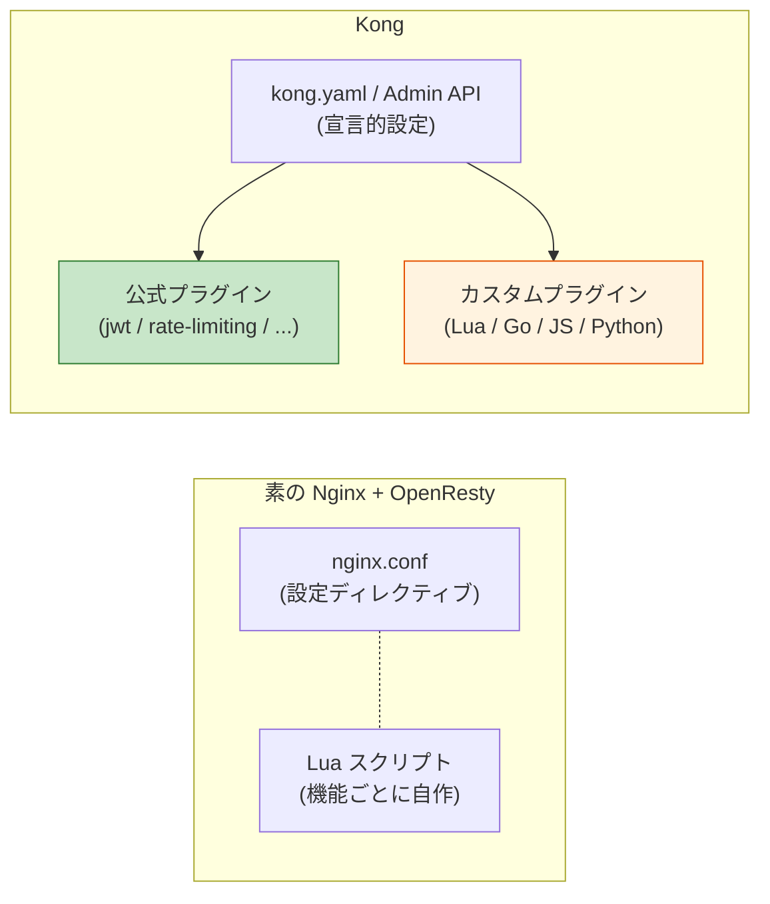
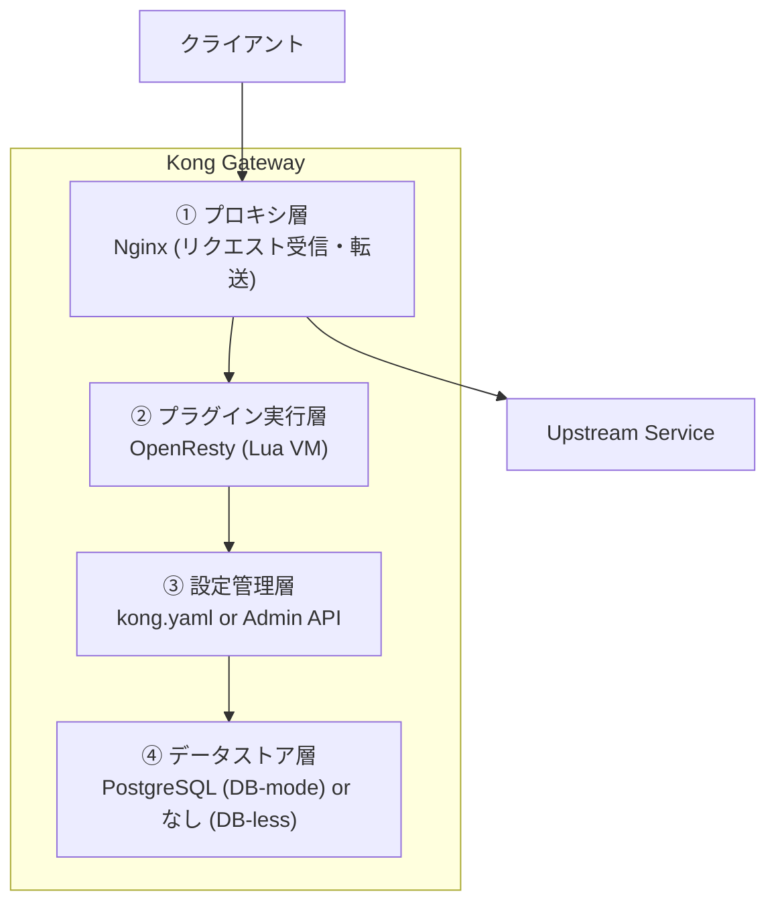
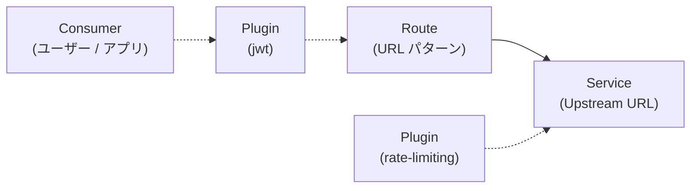
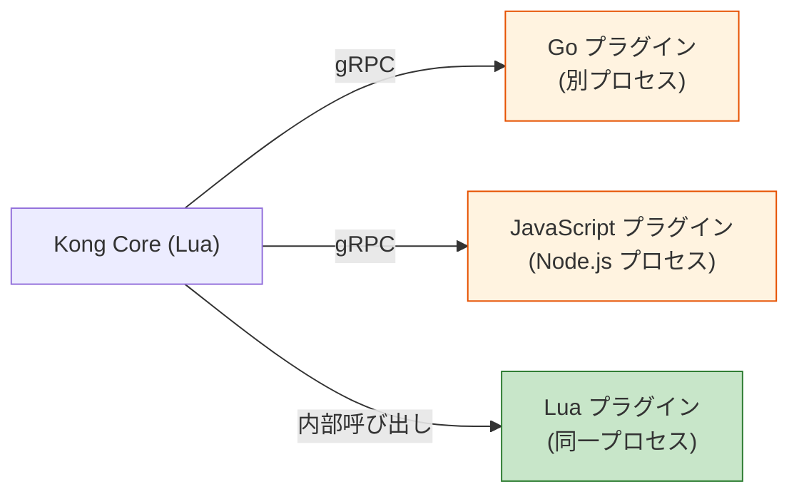
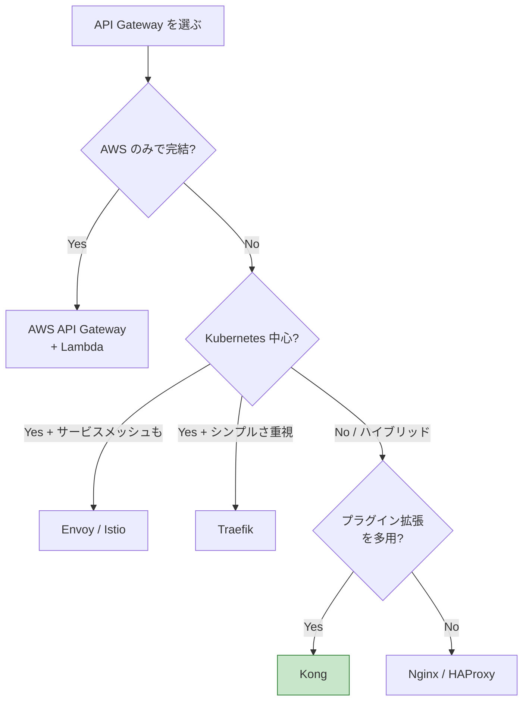

# Kong（Kong Gateway）

> **一言で言うと:** Nginx と OpenResty（Nginx + Lua）の上に構築された OSS の [[API-Gateway|API Gateway]] 実装。**プラグインによる機能拡張**を中核設計に据えており、認証・レート制限・ログ・変換などをコードを書かずに合成できる。宣言的設定（YAML / Kubernetes CRD: Custom Resource Definition）と Admin API による動的設定の両方をサポートし、オンプレミスからマネージドクラウド（Konnect）まで同一の構成で展開できる。

## なぜ Kong が生まれたか

[[API-Gateway]] の責務（認証・レート制限・ルーティング・ロギング等）を Nginx の `nginx.conf` で書こうとすると、`http_auth_jwt_module`（商用版限定）、`limit_req_zone`、`log_format` など、機能ごとに**別々の設定ディレクティブ**を組み合わせる必要があり、複雑な要件では Lua 拡張（OpenResty）を書くしかなかった。

Kong は 2015 年に Mashape 社（現 Kong Inc.）から公開され、「**OpenResty を基盤に、機能を Lua プラグインとして再利用可能な形で配布する**」という設計思想で、この再発明コストを解消した。



## アーキテクチャ

Kong は以下の 4 層で構成される。



| 層 | 役割 | 実装 |
|---|---|---|
| ① プロキシ層 | TCP コネクション処理、HTTP パース、転送 | Nginx（C 製） |
| ② プラグイン実行層 | リクエスト/レスポンスのライフサイクルフックでプラグインを実行 | OpenResty（Nginx + LuaJIT） |
| ③ 設定管理層 | Service / Route / Plugin / Consumer のオブジェクト管理 | Kong コア（Lua） |
| ④ データストア層 | 設定の永続化（DB-mode）、または起動時のメモリロード（DB-less） | PostgreSQL または YAML ファイル |

### Kong のオブジェクトモデル

Kong の設定は 4 つの主要オブジェクトの組み合わせで表現される。これは Nginx の `server` / `location` ブロックよりも**抽象化された API 単位**で考えるためのモデル。



| オブジェクト | 意味 |
|---|---|
| **Service** | Upstream（バックエンドサービス）の抽象。`http://user-service:3001` のような転送先 URL を保持する |
| **Route** | クライアントから見たエンドポイント。`/api/users/*` を `Service` にマッピングする |
| **Plugin** | 認証・レート制限・ログ等の機能。Service / Route / Consumer / Global のいずれかにアタッチする |
| **Consumer** | API を呼び出す主体（ユーザー、アプリ）。Plugin の対象を絞り込むのに使う |

## デプロイモード: DB-mode と DB-less の比較

Kong には 2 つの動作モードがあり、運用思想が大きく異なる。

| 観点 | **DB-mode** | **DB-less / 宣言的モード** |
|---|---|---|
| データストア | PostgreSQL | なし（メモリ + YAML ファイル） |
| 設定変更 | Admin API → DB 経由で全ノードに伝播 | YAML を再ロード（`kong reload`）または再起動 |
| 動的設定 | 可能（API 経由でリアルタイム） | 不可（YAML を更新する必要） |
| Kubernetes との親和性 | 中（DB の運用が必要） | 高（CRD ベースで GitOps 可能） |
| 運用負荷 | DB のバックアップ・HA が必要 | DB 不要、YAML を Git で管理 |
| 推奨ユースケース | レガシー環境、SaaS マルチテナント、動的にプラグインを追加する用途 | Kubernetes、IaC、設定変更が頻繁でない用途 |

近年の主流は **DB-less + GitOps**（kong.yaml を Git 管理し CI でデプロイ）で、特に [[IaCとクラウドインフラ管理|IaC]] 文化と相性が良い。

## プラグインエコシステム

Kong の最大の差別化要因が**プラグイン**。公式と OSS で 100 以上が提供されており、宣言的に有効化できる。

| カテゴリ | 代表的プラグイン |
|---|---|
| 認証 | `jwt`、`key-auth`、`oauth2`、`ldap-auth`、`basic-auth` |
| セキュリティ | `acl`（アクセス制御リスト）、`bot-detection`、`ip-restriction`、`cors` |
| トラフィック制御 | `rate-limiting`、`request-size-limiting`、`request-termination` |
| 変換 | `request-transformer`、`response-transformer`、`correlation-id` |
| 観測性 | `prometheus`、`datadog`、`zipkin`、`file-log`、`http-log` |
| サーバーレス | `aws-lambda`、`azure-functions` |

### カスタムプラグインの言語

公式の Lua に加え、**Go / JavaScript / Python** で書ける PDK（Plugin Development Kit）が用意されている。Lua を書きたくないチームでも独自ロジックを実装できる。



Lua は同一プロセス内で実行されるため最速だが、Go / JS / Python は別プロセスを gRPC で呼び出すためレイテンシが加算される（10ms 程度）。

## Kong ファミリー製品

| 製品 | 用途 | 形態 |
|---|---|---|
| **Kong Gateway**（OSS / Enterprise） | 標準的な API Gateway | OSS / 商用版あり |
| **Kong Ingress Controller**（KIC） | Kubernetes の Ingress として動作 | OSS、CRD で設定 |
| **Kong Mesh** | サービスメッシュ（Envoy ベース、Kuma の Enterprise 版） | Enterprise |
| **Konnect** | マネージド Kong（コントロールプレーン SaaS） | 商用クラウド |

## コード例

### 1. DB-less 宣言的設定（kong.yaml）

最も一般的な構成。Service / Route / Plugin を YAML で定義する。

```yaml
_format_version: "3.0"

services:
  - name: user-service
    url: http://user-service:3001
    routes:
      - name: users-route
        paths:
          - /api/users
        strip_path: true
    plugins:
      - name: jwt
        config:
          key_claim_name: iss
          claims_to_verify:
            - exp
      - name: rate-limiting
        config:
          minute: 100
          policy: local

  - name: order-service
    url: http://order-service:3002
    routes:
      - name: orders-route
        paths:
          - /api/orders
    plugins:
      - name: rate-limiting
        config:
          minute: 60

consumers:
  - username: mobile-app
    jwt_secrets:
      # 発行する JWT の "iss" クレームをこの key と一致させる必要がある
      # （上の jwt プラグインの key_claim_name: iss と対応）
      - key: mobile-app-key
        secret: super-secret-key

plugins:
  # グローバルプラグイン（全 Service に適用）
  - name: cors
    config:
      origins:
        - https://example.com
      methods:
        - GET
        - POST
  - name: prometheus
```

起動:

```bash
docker run -d --name kong \
  -e KONG_DATABASE=off \
  -e KONG_DECLARATIVE_CONFIG=/kong/kong.yaml \
  -v $(pwd)/kong.yaml:/kong/kong.yaml \
  -p 8000:8000 \
  -p 8001:8001 \
  kong:3
# 本番環境ではメジャーのみ固定（kong:3）ではなく、検証済みのマイナー（例: kong:3.9.0）に固定すること
```

### 2. Admin API 経由の動的設定（DB-mode）

DB-mode では `:8001` の Admin API でリアルタイムに設定変更できる。

```bash
# Service の登録
curl -X POST http://localhost:8001/services \
  -d name=user-service \
  -d url=http://user-service:3001

# Route の登録
curl -X POST http://localhost:8001/services/user-service/routes \
  -d 'paths[]=/api/users' \
  -d name=users-route

# レート制限プラグインの有効化（Service スコープ）
curl -X POST http://localhost:8001/services/user-service/plugins \
  -d name=rate-limiting \
  -d config.minute=100 \
  -d config.policy=local

# JWT 認証プラグインの有効化
curl -X POST http://localhost:8001/services/user-service/plugins \
  -d name=jwt
```

### 3. TypeScript — Admin API でのバルク登録スクリプト

CI/CD やマイグレーションで複数の Service / Route / Plugin をまとめて登録したい場合、curl の代わりにスクリプトで Admin API を叩く構成が運用しやすい。

```typescript
import { fetch } from 'undici';

const ADMIN = process.env.KONG_ADMIN_URL ?? 'http://localhost:8001';

async function kongPost<T>(path: string, body: Record<string, unknown>): Promise<T> {
  const res = await fetch(`${ADMIN}${path}`, {
    method: 'POST',
    headers: { 'Content-Type': 'application/json' },
    body: JSON.stringify(body),
  });
  if (!res.ok) {
    throw new Error(`Kong ${path} failed: ${res.status} ${await res.text()}`);
  }
  return res.json() as Promise<T>;
}

const services = [
  { name: 'user-service', url: 'http://user-service:3001', path: '/api/users', rate: 100 },
  { name: 'order-service', url: 'http://order-service:3002', path: '/api/orders', rate: 60 },
];

for (const s of services) {
  await kongPost(`/services`, { name: s.name, url: s.url });
  await kongPost(`/services/${s.name}/routes`, { paths: [s.path], name: `${s.name}-route` });
  await kongPost(`/services/${s.name}/plugins`, {
    name: 'rate-limiting',
    config: { minute: s.rate, policy: 'local' },
  });
  console.log(`registered: ${s.name}`);
}
```

### 4. Kubernetes（Kong Ingress Controller）

Kubernetes では Ingress リソースまたは KongPlugin / KongIngress などの CRD で設定する。

```yaml
apiVersion: networking.k8s.io/v1
kind: Ingress
metadata:
  name: api-ingress
  annotations:
    kubernetes.io/ingress.class: kong
spec:
  rules:
    - http:
        paths:
          - path: /api/users
            pathType: Prefix
            backend:
              service:
                name: user-service
                port:
                  number: 3001
---
# プラグインを CRD として定義（GitOps 可能）
apiVersion: configuration.konghq.com/v1
kind: KongPlugin
metadata:
  name: rate-limit-100
config:
  minute: 100
  policy: local
plugin: rate-limiting
---
# Ingress にプラグインをアタッチ
apiVersion: networking.k8s.io/v1
kind: Ingress
metadata:
  name: api-ingress-with-plugin
  annotations:
    kubernetes.io/ingress.class: kong
    konghq.com/plugins: rate-limit-100
spec:
  rules:
    - http:
        paths:
          - path: /api/users
            pathType: Prefix
            backend:
              service:
                name: user-service
                port:
                  number: 3001
```

### 5. カスタムプラグイン（Lua）の最小例

特定ヘッダを必須にする独自プラグイン。

```lua
-- handler.lua
local CustomAuth = {
  -- jwt (1005) より後・rate-limiting (910) より前で実行されるよう 1000 を採用
  -- （優先度が高いものほど先に実行される）
  PRIORITY = 1000,
  VERSION = "0.1.0",
}

function CustomAuth:access(conf)
  local tenant = kong.request.get_header("X-Tenant-ID")
  if not tenant then
    return kong.response.exit(400, { message = "X-Tenant-ID header is required" })
  end
  -- 検証済みテナント ID を Upstream に伝搬
  kong.service.request.set_header("X-Verified-Tenant", tenant)
end

return CustomAuth
```

```lua
-- schema.lua（プラグインの設定スキーマ）
return {
  name = "custom-auth",
  fields = {
    { config = {
        type = "record",
        fields = {
          { allowed_tenants = { type = "array", elements = { type = "string" } } },
        },
    } },
  },
}
```

## 他の API Gateway との比較

| 観点 | **Kong** | **AWS API Gateway** | **Envoy** | **Traefik** |
|---|---|---|---|---|
| 種別 | OSS + Enterprise | マネージド | OSS（CNCF 卒業） | OSS + Enterprise |
| ベース | Nginx + OpenResty (Lua) | 独自（クラウド統合） | C++ 製 | Go 製 |
| プラグイン | Lua / Go / JS / Python | AWS Lambda（Authorizer） | Wasm（HTTP filter） | Plugins（Yaegi: Go interpreter） |
| 設定 | YAML / Admin API / CRD | コンソール / CloudFormation / CDK | YAML / xDS API | ファイル / ラベル自動検出 |
| Kubernetes 対応 | ◎（KIC + CRD） | △（外部公開のみ） | ◎（Istio のデータプレーン） | ◎（K8s ネイティブ） |
| 学習コスト | 中（Lua の知識があると有利） | 低（コンソール GUI） | 高（YAML が複雑） | 低（自動検出が強み） |
| 強み | プラグインエコシステム、ハイブリッドクラウド | サーバーレス統合（Lambda） | 高性能 + サービスメッシュ | 開発者体験、自動設定 |
| 弱み | Lua のデバッグ、メモリ消費 | ベンダーロックイン、コスト | 設定の複雑さ | 大規模での実績がやや少ない |

選定の指針:



## よくある落とし穴

### 1. DB-mode で Admin API を本番環境にネット公開してしまう

`:8001` の Admin API は**認証なしで全設定を変更可能**。誤って Public IP に晒すと、認証プラグインを無効化されて即座に侵入される。**対策:** Admin API は `127.0.0.1` または Private Subnet のみにバインドし、外部公開する場合は別途 mTLS / IP 制限をかける。Enterprise 版の RBAC 機能を使う。

### 2. プラグインの実行順序を理解せずに有効化する

Kong のプラグインには `PRIORITY` があり、優先度の高いものが先に実行される。例えば `cors` (2000) → `jwt` (1005) → `rate-limiting` (910) の順。**落とし穴:** レート制限を認証より前に置きたいのに優先度を変更し忘れて、未認証リクエストが認証プラグインに到達してから弾かれる。**対策:** プラグインの優先度を [Kong Plugin Reference](https://docs.konghq.com/hub/) で確認し、必要なら `priority` 設定で上書きする。

### 3. DB-less モードで Consumer 認証情報を一括管理する

DB-less モードでは Consumer ごとの API キーや JWT シークレットを `kong.yaml` に書く必要がある。**問題:** YAML ファイルにシークレットが平文で残り、Git に誤コミットされるリスク。**対策:** Vault プラグインまたは環境変数参照（`{vault://env/MY_SECRET}` 構文）を使い、シークレットは Kong の外部で管理する。

### 4. Lua プラグインで `ngx.shared.dict` を雑に使う

Lua プラグイン内でワーカ間共有データを保持する `ngx.shared.dict` は Nginx ワーカ全体で共有されるが、サイズが固定で溢れると古いキーから LRU で消える。**落とし穴:** レート制限のカウンタが消えて制限を超過してしまう。**対策:** 永続化が必要な状態は Redis に置く（`rate-limiting` プラグインの `policy: redis` がこれを実装している）。

### 5. プラグインを増やしすぎてレイテンシが膨らむ

各プラグインはリクエストごとに Lua VM で実行される。10 個以上のプラグインをチェーンすると 5〜10ms のオーバーヘッドが追加されることがある。**対策:** 不要なプラグイン（例: 開発時の `request-transformer-debug`）を本番から外す。`prometheus` プラグインで各フェーズのレイテンシを可視化する。

### 6. `strip_path: true` の挙動を勘違いする

Route の `paths: ["/api/users"]` + `strip_path: true` の組み合わせで `/api/users/42` を受けると、Upstream には `/42` が転送される（プレフィックスが除去される）。`strip_path: false` ならフルパスが転送される。**落とし穴:** バックエンドのルーティングが噛み合わずに 404 が返る。**対策:** `strip_path` の設定とバックエンドの期待パスを一致させ、テスト時に `httpbin.org` のような echo サービスで実際の転送先を確認する。

## AIによる実装のアンチパターン

| アンチパターン | なぜ問題か | 対策 |
|---|---|---|
| カスタムプラグインで認証を自作 | `jwt` / `oauth2` / `key-auth` 等の公式プラグインで十分なケースが多く、自作は脆弱性を埋め込む | 既存プラグインを徹底的に調査してから自作を検討 |
| Admin API で 1 リソースずつ curl を生成 | 設定がバージョン管理されず、再現性が失われる | DB-less + `kong.yaml` に統一、または `decK`（kong の宣言的設定 CLI）を使う |
| プラグイン設定を Service / Route / Consumer の各層に重複定義 | スコープの優先順位（Consumer > Route > Service > Global）を理解しておらず、想定外のプラグインが効く | スコープ階層を理解し、最小限のスコープに 1 箇所だけ設定する |
| DB-mode で開発・本番を 1 つの DB で運用 | 開発時の設定変更が即本番に反映される事故 | 環境ごとに別 DB、または DB-less + 環境別 YAML で分離 |
| `request-termination` プラグインを動的判定で使う | 静的な「メンテナンス中」レスポンス専用なので、動的なビジネスロジックに使うと別のプラグインで代替できる場面でも採用される | 動的判定はカスタムプラグインまたはバックエンドで実装 |

## 実務での使用シーン

| シーン | 構成例 | ポイント |
|---|---|---|
| **マイクロサービスのフロント** | Kong + Consul / Kubernetes Service Discovery | 動的にバックエンドが増減してもサービスディスカバリで自動追従 |
| **B2B SaaS のテナント別レート制限** | Kong + `rate-limiting` (Consumer 単位) | テナント = Consumer として登録し、契約プランごとにレート制限を変える |
| **既存 REST API への OAuth 追加** | Kong + `oauth2` プラグイン | バックエンドコードを変えずに認証を追加できる |
| **オンプレ + クラウドのハイブリッド** | Kong Gateway（オンプレ）+ Konnect（コントロールプレーン） | クラウドで設定を一元管理、データプレーンはオンプレに配置（[[クラウドサービスモデル]]のハイブリッドモデル） |
| **Kubernetes の Ingress 統合** | Kong Ingress Controller + KongPlugin CRD | GitOps で Ingress + プラグイン設定を一括デプロイ |
| **gRPC のプロトコル変換** | Kong + `grpc-gateway` プラグイン | 外部 REST → 内部 gRPC への変換 |

## 関連トピック

- [[API-Gateway]] — 親概念。API Gateway の責務全般、Kong は代表的 OSS 実装の 1 つ
- [[L4とL7ロードバランサーの違い]] — Kong は L7 LB の上位機能を提供する
- [[レート制限]] — Kong の `rate-limiting` プラグインの背景理論
- [[認証と認可]] — Kong の `jwt` / `oauth2` プラグインで実装される
- [[CORS]] — Kong の `cors` プラグインで一元管理できる
- [[Backend-For-Frontend]] — Kong は横断的関心事、BFF はクライアント固有処理という補完関係
- [[IaCとクラウドインフラ管理]] — DB-less + GitOps での宣言的運用
- [[クラウドサービスモデル]] — Konnect はマネージド型のハイブリッドソリューション

## 参考リソース

- [Kong 公式ドキュメント](https://docs.konghq.com/) — Gateway / Ingress Controller / Mesh の包括的リファレンス
- [Kong Plugin Hub](https://docs.konghq.com/hub/) — 公式・コミュニティプラグインのカタログと優先度一覧
- [decK](https://docs.konghq.com/deck/) — Kong の宣言的設定 CLI、設定の差分確認・同期に使う
- [OpenResty Reference](https://openresty.org/en/) — Kong の基盤となる Nginx + Lua 拡張
- "Mastering Kong" (Bo Pang) — Kong の内部実装・カスタムプラグイン開発の解説書
