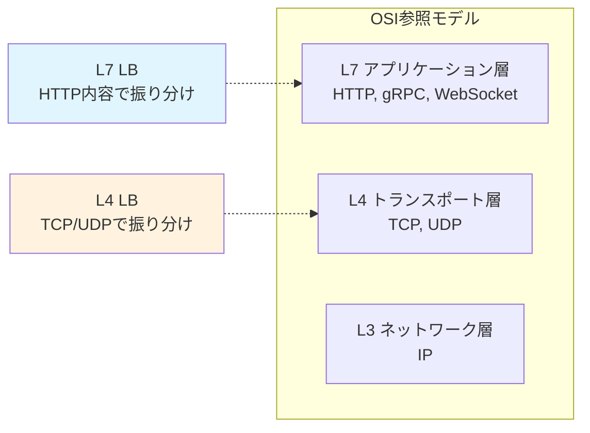
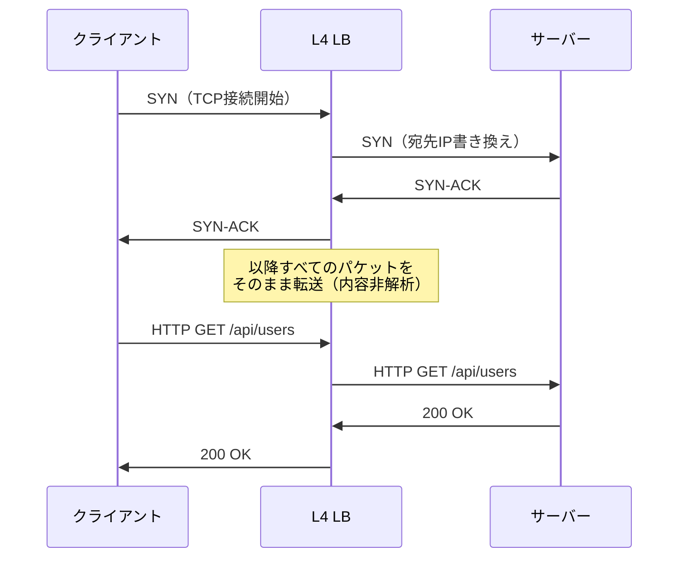
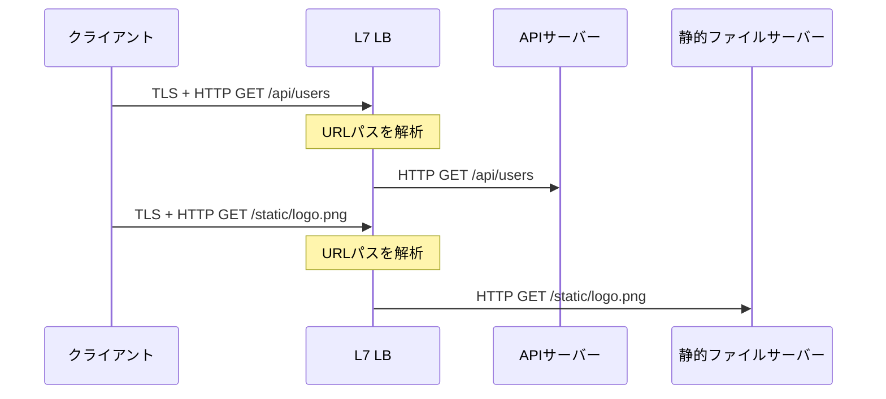
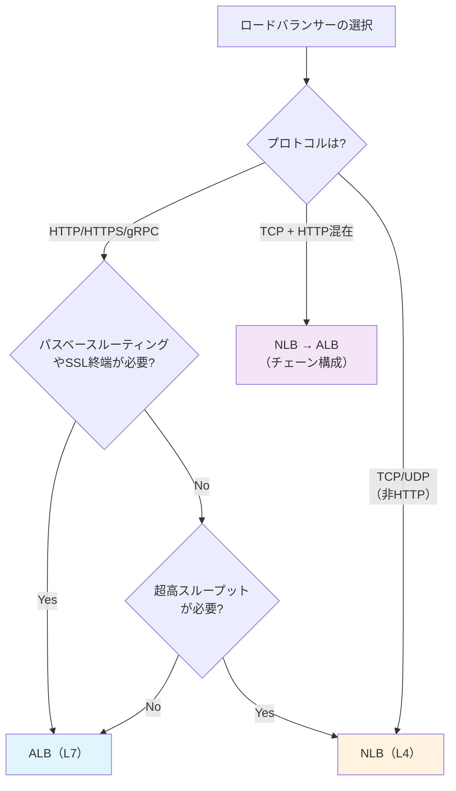

# L4とL7ロードバランサーの違い（L4 vs L7 Load Balancer）

> **一言で言うと:** L4ロードバランサーはTCP/UDPレベルでパケットを転送し高速だが中身は見えない。L7ロードバランサーはHTTPの内容を解析してインテリジェントなルーティングが可能だが処理コストが高い。両者は排他的でなく、組み合わせて使うのが一般的。

## OSI参照モデルにおける位置



## 動作原理の比較

### L4 ロードバランサー

L4 LBはTCPコネクション（またはUDPパケット）を**そのままバックエンドに転送**する。パケットの中身（HTTPヘッダー、URL、Cookie等）は一切解析しない。

**動作の流れ:**
1. クライアントがLBのIPアドレスに接続
2. LBはアルゴリズムに従いバックエンドサーバーを選択
3. パケットの宛先IPをバックエンドのIPに書き換えて転送（NAT方式）、またはDSR（Direct Server Return）でバックエンドから直接クライアントに返す



### L7 ロードバランサー

L7 LBはHTTPリクエストを**完全に解析**した上で、ルーティング先を決定する。クライアントとLBの間、LBとバックエンドの間で**2つの独立したTCPコネクション**が確立される。

**動作の流れ:**
1. クライアントがLBとTLS/TCP接続を確立
2. LBがHTTPリクエストを受信・解析
3. URL、ヘッダー、Cookie等に基づきバックエンドを選択
4. LBがバックエンドと別のTCP接続でリクエストを転送



## 機能比較

| 観点 | L4 LB | L7 LB |
|------|-------|-------|
| **解析対象** | IPアドレス + ポート番号 | HTTP ヘッダー、URL、Cookie、ボディ |
| **パフォーマンス** | 高速（パケット転送のみ） | やや低速（HTTP解析のオーバーヘッド） |
| **スループット** | 数百万RPS対応可能 | 数万〜数十万RPS |
| **SSL終端** | 不可（パケットを転送するだけ） | 可能（TLSをLBで復号） |
| **パスベースルーティング** | 不可 | `/api/*` → API、`/static/*` → CDN |
| **ヘッダーベースルーティング** | 不可 | `Host`, `Accept-Language` 等で振り分け |
| **Cookieベースのアフィニティ** | 不可（IP Hashは可能） | 可能（Cookie値でサーバー固定） |
| **リクエストの書き換え** | 不可 | ヘッダー追加/削除、URLリライト可能 |
| **WebSocket** | 透過的に転送 | Upgrade ヘッダーの解析が必要 |
| **gRPC** | 透過的に転送 | HTTP/2の解析でインテリジェントなルーティング可能 |
| **ヘルスチェック** | TCP接続確認（ポートが開いているか） | HTTPレベル（`/health` の応答コード確認） |
| **ロギング** | 接続元IP、バイト数、接続時間 | リクエストURL、ステータスコード、レイテンシ |

## 主要な製品・サービスの比較

### OSS / セルフホスト

| 製品 | L4 | L7 | 特徴 |
|------|----|----|------|
| **Nginx** | △（stream モジュール） | ◎ | 最も広く使われるリバースプロキシ。L7が主用途 |
| **HAProxy** | ◎ | ◎ | L4/L7両対応の高性能LB。設定の柔軟性が高い |
| **Envoy** | ◎ | ◎ | クラウドネイティブ向け。サービスメッシュ（Istio）のデータプレーン |
| **Traefik** | ○ | ◎ | Docker/Kubernetes と自動連携。設定の自動検出が強み |
| **Caddy** | △ | ○ | 自動HTTPS。小規模向けで設定が簡単 |

### クラウドマネージド

| サービス | レイヤー | 特徴 |
|---------|---------|------|
| **AWS NLB**（Network Load Balancer） | L4 | 超高スループット（数百万RPS）、静的IP、低レイテンシ |
| **AWS ALB**（Application Load Balancer） | L7 | パスベースルーティング、gRPC対応、WAF統合 |
| **GCP Network LB** | L4 | リージョン内の負荷分散、DSR方式で超低レイテンシ |
| **GCP Application LB** | L7 | グローバルLB（Anycast）、URLマップによる細かいルーティング |
| **Azure Load Balancer** | L4 | ゾーン冗長、アウトバウンドNAT機能 |
| **Azure Application Gateway** | L7 | WAF統合、SSL終端、Cookieアフィニティ |

### AWS ALB vs NLB の使い分け



## コード例

### HAProxy — L4/L7 両方の設定例

```haproxy
# L4 ロードバランサー（TCP モード）
# --- DBコネクションの分散など、HTTP以外の用途 ---
frontend tcp_front
    bind *:5432
    mode tcp
    default_backend postgres_servers

backend postgres_servers
    mode tcp
    balance roundrobin
    server pg1 10.0.1.1:5432 check
    server pg2 10.0.1.2:5432 check

# L7 ロードバランサー（HTTP モード）
# --- URLパスに基づくインテリジェントなルーティング ---
frontend http_front
    bind *:443 ssl crt /etc/ssl/certs/example.pem
    mode http

    # パスベースルーティング
    acl is_api path_beg /api/
    acl is_static path_beg /static/
    acl is_ws hdr(Upgrade) -i websocket

    use_backend api_servers if is_api
    use_backend static_servers if is_static
    use_backend ws_servers if is_ws
    default_backend web_servers

backend api_servers
    mode http
    balance leastconn
    option httpchk GET /health
    http-check expect status 200
    server api1 10.0.2.1:3000 check
    server api2 10.0.2.2:3000 check

backend web_servers
    mode http
    balance roundrobin
    server web1 10.0.3.1:8080 check
    server web2 10.0.3.2:8080 check

backend static_servers
    mode http
    server cdn1 10.0.4.1:80 check

backend ws_servers
    mode http
    option http-server-close
    server ws1 10.0.5.1:8080 check
```

### Nginx — L7ルーティング + L4ストリーム

```nginx
# L7: HTTPレベルのルーティング
http {
    upstream api {
        least_conn;
        server 10.0.1.1:3000;
        server 10.0.1.2:3000;
    }

    upstream web {
        server 10.0.2.1:8080;
        server 10.0.2.2:8080;
    }

    server {
        listen 443 ssl;
        server_name example.com;

        # パスベースルーティング（L7の特権）
        location /api/ {
            proxy_pass http://api;
            # ヘッダーの追加（L7だからできる）
            proxy_set_header X-Request-ID $request_id;
        }

        location / {
            proxy_pass http://web;
        }
    }
}

# L4: TCPレベルの転送（stream モジュール）
stream {
    upstream postgres {
        server 10.0.3.1:5432;
        server 10.0.3.2:5432;
    }

    server {
        listen 5432;
        proxy_pass postgres;
        # HTTP内容は見えない — IPとポートだけで振り分け
    }
}
```

### Terraform — AWS ALB + NLB の構成例

```hcl
# L7: ALB（パスベースルーティング）
resource "aws_lb" "alb" {
  name               = "app-alb"
  internal           = false
  load_balancer_type = "application"  # L7
  subnets            = var.public_subnets
}

resource "aws_lb_listener" "https" {
  load_balancer_arn = aws_lb.alb.arn
  port              = 443
  protocol          = "HTTPS"
  ssl_policy        = "ELBSecurityPolicy-TLS13-1-2-2021-06"
  certificate_arn   = var.certificate_arn

  default_action {
    type             = "forward"
    target_group_arn = aws_lb_target_group.web.arn
  }
}

# パスベースルーティング（L7の機能）
resource "aws_lb_listener_rule" "api" {
  listener_arn = aws_lb_listener.https.arn
  priority     = 100

  action {
    type             = "forward"
    target_group_arn = aws_lb_target_group.api.arn
  }

  condition {
    path_pattern { values = ["/api/*"] }
  }
}

# L4: NLB（TCP転送、超高スループット）
resource "aws_lb" "nlb" {
  name               = "app-nlb"
  internal           = true
  load_balancer_type = "network"  # L4
  subnets            = var.private_subnets
}
```

## よくある落とし穴

### 1. 「とりあえずL7」で選択してスループットが足りなくなる

L7 LBはHTTPの解析コストがあるため、L4に比べてスループットが1〜2桁低い場合がある。WebSocketの大量接続や、ゲームサーバーのようなUDPベースの通信にはL4 LBが適切。

### 2. L4 LBの背後でクライアントIPが取れない

L4 LBがNATモードで動作する場合、バックエンドから見えるIPはLBのIPになる。クライアントの元IPを取得するには:
- **Proxy Protocol**: L4 LBとバックエンド間でクライアントIP情報を付加するプロトコル（HAProxy, AWS NLBが対応）
- **DSR（Direct Server Return）**: バックエンドがクライアントに直接応答する方式（元IPが保持される）

### 3. L7 LBでWebSocket接続がタイムアウトする

L7 LBはHTTPのリクエスト-レスポンスモデルを前提にしており、WebSocketのような長時間接続はデフォルトのアイドルタイムアウト（ALBは60秒）で切断される場合がある。タイムアウト値の調整とPing/Pongの実装が必要。

### 4. gRPCにALBを使って問題が発生する

gRPCはHTTP/2ベースだが、ALBのgRPC対応には制約がある。特にストリーミングRPC（双方向ストリーム）ではNLB + Envoy の組み合わせがより安定する場合がある。

## 関連トピック

- [[ロードバランシング]] --- 親トピック。アルゴリズム、ヘルスチェック、デプロイ戦略の全体像
- [[TCP-IP]] --- L4 LBが動作するトランスポート層の基礎
- [[HTTP-HTTPS]] --- L7 LBが解析するプロトコル
- [[TLS-SSL]] --- SSL TerminationはL7 LBの主要機能
- [[AnycastとUnicast]] --- グローバルLBのルーティング技術
