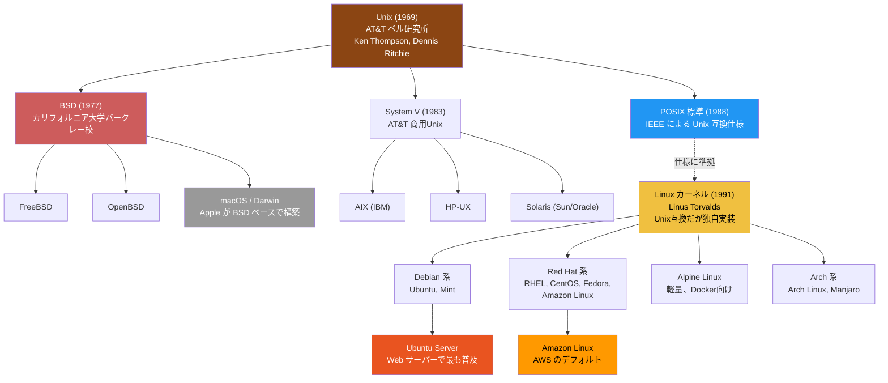
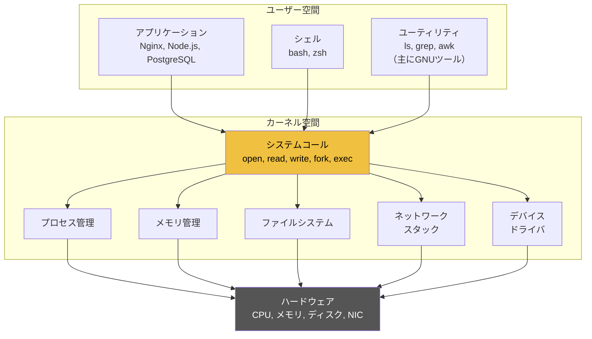

# LinuxとUnixの系譜（Linux and Unix Lineage）

> **一言で言うと:** LinuxはUnixの設計思想を受け継いだオープンソースOSカーネルであり、Unixの「小さなツールを組み合わせる」哲学が現代のWeb開発基盤を形作っている。両者の関係を理解することで、なぜLinuxコマンドがああいう設計になっているのかが腑に落ちる。

## UnixからLinuxへ — 何が受け継がれたか

### Unix の誕生と設計思想

Unix は1969年、AT&Tベル研究所で Ken Thompson と Dennis Ritchie によって開発された。当時のOSは巨大で複雑だったが、Unixは「シンプルさ」を設計原則に据えた。

この思想は **Unix哲学（Unix Philosophy）** として体系化され、現代のLinux操作の根幹になっている:

| 原則 | 意味 | 現代での例 |
|------|------|-----------|
| 一つのことをうまくやれ | 各ツールは単一の機能に特化 | `grep` は検索だけ、`sort` は並べ替えだけ |
| テキストを共通インターフェースにせよ | プログラム間のデータ交換はテキスト | ログファイル、設定ファイル、パイプ |
| 小さなプログラムを組み合わせよ | 複雑な処理はツールの連携で実現 | `cat access.log \| grep 500 \| wc -l` |
| 早い段階でプロトタイプを作れ | 最初から完璧を目指さない | シェルスクリプトで素早く自動化 |

```bash
# Unix哲学の実践例 — 単機能ツールの組み合わせ
# 「アクセスログから500エラーを返したIPアドレスの上位5件」
cat /var/log/nginx/access.log \
  | grep " 500 " \
  | awk '{print $1}' \
  | sort \
  | uniq -c \
  | sort -rn \
  | head -5

# 各コマンドが1つのことだけ担当:
# cat  → ファイルの内容を出力
# grep → パターンに合致する行を抽出
# awk  → 特定のフィールドを切り出す
# sort → 行を並べ替える
# uniq → 重複を除去しカウント
# head → 先頭N行だけ取得
```

### Unixの系譜図



**重要なポイント:** Linux は Unix のソースコードを使っていない。POSIX（Portable Operating System Interface）という標準仕様に基づいて、一から書き直された「Unix互換」のカーネル。だから「Linuxは Unix の一種」ではなく「Unix の思想と互換性を持つ別のOS」が正確な表現。

### macOS もUnix

macOS は BSD（Berkeley Software Distribution）をベースにした Darwin カーネルを使っており、正式なUnix認証（Single UNIX Specification）を取得している。つまり macOS は「本物のUnix」であり、ターミナルでの操作がLinuxと似ているのはこのため。

```bash
# macOS で確認
uname -a
# Darwin MacBook.local 23.4.0 Darwin Kernel Version 23.4.0 ...

# Linux で確認
uname -a
# Linux web-server 6.1.0-18-amd64 ... GNU/Linux
```

ただし macOS と Linux では細かい差異がある:

| 項目 | macOS (BSD系) | Linux (GNU系) |
|------|--------------|---------------|
| `sed` のインプレース編集 | `sed -i '' 's/old/new/'` | `sed -i 's/old/new/'` |
| `date` コマンド | BSD date（構文が異なる） | GNU date |
| パッケージマネージャ | Homebrew (`brew`) | apt / yum / dnf |
| ファイルシステム | APFS | ext4 / xfs / btrfs |
| `ls` の色付き出力 | `ls -G` | `ls --color` |

この差異が「macOSで動いたスクリプトが本番のLinuxで動かない」原因になることがある。

## Linuxカーネルとディストリビューション

### カーネルとは何か

Linux という名前は厳密には **カーネル**（Kernel）だけを指す。カーネルはハードウェアとソフトウェアの橋渡しをするOSの中核部分。



普段「Linux」と呼んでいるものは、正確には **GNU/Linux** — Linux カーネル + GNU ツール群（`ls`, `grep`, `awk` など）+ パッケージマネージャ + 設定ツール等を組み合わせた「ディストリビューション」。

### 主要ディストリビューションの選び方

Web開発者が遭遇する主なディストリビューション:

| ディストリビューション | パッケージ管理 | 主な用途 | 特徴 |
|---------------------|-------------|---------|------|
| **Ubuntu Server** | apt (deb) | Webサーバー、開発環境 | 情報量が多い、LTS（5年サポート） |
| **Amazon Linux 2023** | dnf (rpm) | AWS上の本番環境 | AWS最適化、EC2/ECSデフォルト |
| **Debian** | apt (deb) | 安定性重視のサーバー | Ubuntuの上流、超安定 |
| **Alpine Linux** | apk | Dockerコンテナ | 極めて軽量（約5MB）、musl libc |
| **RHEL / Rocky Linux** | dnf (rpm) | エンタープライズ | 商用サポート、長期安定 |

```bash
# 自分が使っているディストリビューションの確認
cat /etc/os-release

# Ubuntu の場合の出力例:
# NAME="Ubuntu"
# VERSION="22.04.3 LTS (Jammy Jellyfish)"
# ID=ubuntu
# ID_LIKE=debian
```

### パッケージマネージャの対応表

同じことをするのにディストリビューションでコマンドが異なるのは、初心者が混乱しやすいポイント。

```bash
# パッケージの更新
apt update && apt upgrade      # Debian / Ubuntu
dnf update                     # RHEL / Amazon Linux 2023 / Fedora
apk update && apk upgrade      # Alpine

# パッケージのインストール
apt install nginx              # Debian / Ubuntu
dnf install nginx              # RHEL / Amazon Linux 2023
apk add nginx                  # Alpine

# インストール済みパッケージの検索
dpkg -l | grep nginx           # Debian / Ubuntu
rpm -qa | grep nginx           # RHEL 系
apk list --installed | grep nginx  # Alpine
```

## 「Everything is a File」の思想

Unixから受け継いだ最も重要な抽象化が **「すべてはファイルである」** という考え方。デバイス、[[プロセスとスレッド|プロセス]]の情報、ネットワークソケットまでもが[[ファイルシステムとIO|ファイル]]として扱える。

```bash
# プロセス情報もファイル（/proc 仮想ファイルシステム）
cat /proc/cpuinfo             # CPU情報
cat /proc/meminfo             # メモリ情報
cat /proc/1/status            # PID 1（init/systemd）のプロセス情報
ls /proc/self/fd/             # 現在のプロセスのファイルディスクリプタ一覧

# デバイスもファイル（/dev）
ls -la /dev/sda               # ディスクデバイス
echo "hello" > /dev/null      # データの破棄（ブラックホール）

# この抽象化により、同じツール（cat, grep等）で
# ファイルもプロセス情報もデバイスも扱える
```

この設計が[[ファイルディスクリプタ]]やリダイレクト（`>`, `<`, `2>&1`）の仕組みにつながっている。「すべてがファイル」だからこそ、パイプ（`|`）で異なるプログラムのデータを自由に受け渡せる。

## よくある落とし穴

### 1. 「Linuxコマンドはどのディストリビューションでも同じ」と思い込む

基本コマンド（`ls`, `grep`, `cat` 等）は共通だが、パッケージ管理（`apt` vs `dnf` vs `apk`）、サービス管理（古いシステムでは `init.d` が残っている）、デフォルトのシェル（Ubuntu は `dash` がデフォルトの `/bin/sh`）など、ディストリビューションごとの差異がある。Dockerfileを書くときに特に注意が必要。

```dockerfile
# Alpine ベースのイメージでは bash がデフォルトで入っていない
FROM alpine:3.19
RUN apk add --no-cache bash   # 明示的にインストールが必要
# または sh (ash) を使う
```

### 2. 「macOSで動いたからLinuxでも動く」と思い込む

macOS は BSD 系、Linux は GNU 系のツールを使っている。シェルスクリプトの `sed`, `date`, `find` などで微妙に構文が異なる。CI/CDパイプラインやDockerfile内で使うスクリプトは、必ずLinux環境でテストすべき。

### 3. カーネルとディストリビューションを混同する

「Ubuntuのバージョン」と「Linuxカーネルのバージョン」は別物。Ubuntu 22.04 は初期出荷時にカーネル 5.15 を採用しているが、HWE（Hardware Enablement）カーネルにより 6.x 系も利用可能。カーネルの脆弱性情報が出たとき、自分の環境のカーネルバージョンを確認する必要がある。

```bash
# カーネルバージョンの確認
uname -r
# 6.1.0-18-amd64

# ディストリビューションのバージョン確認
cat /etc/os-release
# Ubuntu 22.04.3 LTS
```

## 実務での使用シーン

### Dockerfileでのディストリビューション選択

```dockerfile
# 開発・本番共通: 軽量な Alpine を選ぶケースが多い
FROM node:20-alpine
# イメージサイズ: 約 130MB（node:20 は約 1GB）

# ただし Alpine は musl libc を使うため、
# glibc 依存のネイティブモジュールが動かないことがある
# その場合は Debian slim を使う
FROM node:20-slim
# イメージサイズ: 約 200MB（フルイメージより大幅に小さい）
```

### CI/CDパイプラインでの環境差異

```yaml
# GitHub Actions — Ubuntu ベースのランナー
jobs:
  test:
    runs-on: ubuntu-latest
    steps:
      - run: |
          # Ubuntu なので apt が使える
          sudo apt-get update
          sudo apt-get install -y some-package
```

## 関連トピック

- [[Linux基本操作]] — 親トピック。具体的なコマンド操作はこちら
- [[ファイルシステムとIO]] — 「Everything is a File」の実装としてのファイルシステム
- [[ファイルディスクリプタ]] — Unix のファイル抽象化を支える仕組み
- [[プロセスとスレッド]] — Unix の `fork` / `exec` モデルから派生したプロセス管理
- [[Docker]] — Linuxカーネルの機能（namespace, cgroup）を活用した隔離技術
