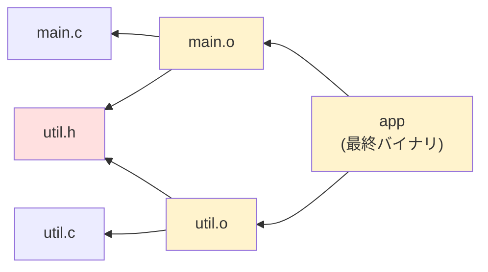

# Makefileとmakeコマンド（Makefile & make）

> **一言で言うと:** `make` は「**このファイルを作るには、どのファイルが要って、どのコマンドを打つのか**」を宣言しておくと、**古くなった部分だけを、正しい順序で、必要なら並列に**作り直してくれる道具。1976年にビルド時間を削るために生まれたが、現代の Web 開発では「**言語もツールもバラバラなプロジェクトの、統一されたコマンド入口**」——つまりタスクランナーとして生き残っている。

`make` は [[Linux基本操作]] のシェルスクリプトの延長にあるが、シェルスクリプトとは発想が根本的に違う。シェルスクリプトが「**手順（どう作るか）**」を上から順に書く**手続き型**なのに対し、Makefile は「**関係（何が何に依存するか）**」を書く**宣言型**である。この差が、差分ビルド・並列実行・「途中から再開」という性質をまるごと生む。

## 用語の整理

> [!info] 用語ミニ辞典
> - **ビルド（build）** — ソースコードから、実行可能な成果物（バイナリ、バンドルされた JS、Docker イメージ等）を作り出す一連の処理。コンパイル・リンク・トランスパイル・最小化などを含む総称
> - **ターゲット（target）** — make が「作るもの」の名前。通常は生成されるファイル名（`app`, `dist/bundle.js`）だが、`test` のような**実体のないラベル**でもよい
> - **前提条件（prerequisite / 依存）** — そのターゲットを作るために先に揃っている必要があるファイルやターゲット
> - **レシピ（recipe）** — ターゲットを実際に作るためのシェルコマンド列。**行頭がタブ文字**であることで make に識別される
> - **タスクランナー（task runner）** — `npm run test` のように、プロジェクトで頻用するコマンド列に短い名前を付けて実行する仕組み。ビルドそのものより「入口の統一」が目的

## 中核にあるのは「依存グラフ + タイムスタンプ」

make の全機能は、たった2つの仕組みから導かれる。

1. **依存グラフ（dependency graph）** — ターゲットと前提条件の関係は有向非巡回グラフ（DAG）を成す。make はこれを**トポロジカルソート**して実行順を決める（→ グラフ探索の基礎は [[DFSとBFS]]）
2. **タイムスタンプ比較** — ターゲットのファイル更新時刻（mtime）が、すべての前提条件の mtime より新しければ「**最新である**」と判断し、レシピをスキップする（→ mtime の実体は [[ファイルシステムとIO]] の inode に記録されている）



`util.h`（赤）を編集すると、それに依存する `main.o` / `util.o` / `app`（黄）だけが再ビルド対象になる。`util.c` 自体は触っていないのでコンパイルは走る（ヘッダに依存しているため）が、無関係なファイルが100個あってもそれらは一切触られない。**これが「差分ビルド（incremental build）」の正体**であり、フルビルド10分のプロジェクトを3秒で回せる理由である。

> [!note]- なぜ mtime なのか、なぜ内容ハッシュではないのか
> 1976年当時、ファイル全体を読んでハッシュを取るのはディスク I/O 的に高価だった。mtime は inode に既に載っているメタデータなので、`stat()` 1回で済む。この設計判断は「**速いが、たまに間違う**」というトレードオフを make に永続的に埋め込んだ。
>
> 具体的な破綻例: `git checkout` でブランチを切り替えるとファイルの mtime が「今」に更新されるため、**内容が同じでも再ビルドが走る**。逆に、ビルド成果物の mtime を手で未来にずらすと、ソースを変えても再ビルドされない。
>
> Bazel / Buck / Turborepo など現代のビルドシステムが**内容ハッシュ**を採用しているのは、この弱点の克服が動機。ハッシュベースならリモートキャッシュ（他人がビルドした成果物を再利用）も成立する。[[モジュールバンドラ-webpackとTurbopack]] の永続キャッシュも同じ思想の延長にある。

## 最小の Makefile を読む

```makefile
# ターゲット: 前提条件
#	レシピ（行頭は必ずタブ文字。スペースだと構文エラー）

app: main.o util.o
	gcc -o app main.o util.o

main.o: main.c util.h
	gcc -c main.c

util.o: util.c util.h
	gcc -c util.c
```

`make` を引数なしで実行すると、**ファイル内で最初に定義された、ピリオドで始まらないターゲット**（ここでは `app`）が作られる。これを**既定の目標（default goal）**と呼ぶ。`.PHONY:` のような特殊ターゲットは数に入らない。`make main.o` のように名指しもでき、`.DEFAULT_GOAL := help` と書けば既定の目標を明示的に指定できる。

make は `app` を作れと言われたら、まず前提条件 `main.o` `util.o` を見に行き、それらもターゲットとして定義されているのでさらに `main.c` `util.h` を見に行く……と**再帰的に依存を降りてから、下から順に**レシピを実行する。

### 行頭タブという悪名高い仕様

レシピ行は**タブ文字**でなければならない。スペース8個では `Makefile:4: *** missing separator. Stop.` になる。作者の Stuart Feldman 自身が後年「既に十数人のユーザーがいたので直せなかった」と語った、有名な設計ミスである。

エディタ設定で「タブをスペースに自動変換」していると必ず踏むので、`.editorconfig` に例外を書いておく。

```ini
# .editorconfig
[Makefile]
indent_style = tab
```

## 変数と自動変数

同じファイル名を何度も書くのは [[DRY原則]] に反するので、変数を使う。

```makefile
CC := gcc
CFLAGS := -Wall -O2
OBJS := main.o util.o

app: $(OBJS)
	$(CC) $(CFLAGS) -o $@ $^

%.o: %.c util.h
	$(CC) $(CFLAGS) -c $< -o $@
```

| 記法 | 意味 |
|---|---|
| `$@` | ターゲット名（上の例では `app` や `main.o`） |
| `$<` | **最初の**前提条件（`%.o: %.c` なら対応する `.c` ファイル） |
| `$^` | **すべての**前提条件（重複除去済み。上の例では `main.o util.o`） |
| `%` | パターンマッチのワイルドカード。`%.o: %.c` は「任意の `.o` は同名の `.c` から作る」というルール |

**`:=` と `=` の違い**は必ず押さえる。`:=` は**その場で1回だけ評価**（単純展開）、`=` は**使われるたびに再評価**（再帰展開）。`=` で自分自身を参照すると無限ループになるため、迷ったら `:=` を使う。

```makefile
A := $(shell date)   # Makefile 読み込み時の時刻で固定
B  = $(shell date)   # $(B) を書いた箇所ごとに date が再実行される
```

### 変数はコマンドラインから上書きできる

`make deploy ENV=prod` と打つと、Makefile 内に `ENV := dev` と書いてあっても**コマンドライン側が勝つ**。優先順位は低い方から「Makefile 内の `?=` < 環境変数 < Makefile 内の `:=` / `=` < コマンドライン引数」で、`override ENV := dev` と書いたときだけ Makefile が最強になる。

CI から `make deploy ENV=staging` のように環境を切り替える運用は、この仕様に依存している。

```makefile
# ?= は「まだ値が無いときだけ代入する」。環境変数があればそれを優先したい既定値に使う
ENV ?= dev

.PHONY: deploy
deploy:
	@echo "deploying to $(ENV)"
```

`make deploy` なら `dev`、`make deploy ENV=prod` なら `prod`、`ENV=stg make deploy` なら `stg` になる。

## `.PHONY` — ビルドツールからタスクランナーへの転換点

`make test` のように「ファイルを作らないターゲット」を書きたい場面が出てくる。ここで make のタイムスタンプ判定が牙を剥く。

```makefile
test:
	go test ./...
```

これは普段は動く。しかし**プロジェクトに `test` という名前のディレクトリやファイルが存在すると**、make は「`test` はもう存在していて、前提条件がないから最新だ」と判断し、`make test` が `make: 'test' is up to date.` と言って**何もしなくなる**。

これを防ぐのが `.PHONY`（偽のターゲット）宣言である。

```makefile
.PHONY: test build clean lint

test:
	go test ./...

build:
	mkdir -p bin
	go build -o bin/app ./cmd/app

clean:
	rm -rf bin/

lint:
	golangci-lint run
```

`.PHONY` に列挙されたターゲットは**ファイルとの照合をスキップし、常にレシピを実行**する。ついでに `stat()` を省くので、わずかに速くもなる。

この `.PHONY` 中心の使い方が、現代 Web 開発における make の主用途である。差分ビルドという本来の売りは使わず、「**プロジェクト共通のコマンド辞書**」として使う。

## 実務での使用シーン: 多言語プロジェクトの統一入口

現代の Web プロジェクトは、フロントは `npm run`、バックエンドは `go build`、インフラは `terraform apply`、DB は `docker compose exec` ……と、コマンド体系がバラバラになる。新規参画者は README を読み解かないと何も起動できない。

Makefile は「**この階層に `make help` があれば全部わかる**」という一点集約を提供する。

```makefile
# ==== 開発者が最初に打つコマンドを1箇所に集める ====

# 安全側のデフォルト3点セット（理由は後述の「よくある落とし穴」3・5）
SHELL := /bin/bash
.SHELLFLAGS := -eu -o pipefail -c   # パイプ途中の失敗と未定義変数を見逃さない
.DELETE_ON_ERROR:                   # 中断時に書きかけの成果物を残さない

.PHONY: help setup dev test lint migrate down

# デフォルトターゲットを help にしておくと、素の `make` が案内になる
.DEFAULT_GOAL := help

## help: 利用可能なコマンド一覧を表示
help:
	@grep -E '^## ' $(MAKEFILE_LIST) | sed 's/## //'

## setup: 依存インストールと初期セットアップ
setup:
	npm ci
	go mod download
	test -f .env || cp .env.example .env   # 既にあれば上書きしない（意図を明示する書き方）

## dev: 開発環境を起動（DB + API + フロント）
dev:
	docker compose up -d db redis
	npm run dev

## test: 全テストを実行
test:
	go test ./... -race
	npm test

## migrate: DBマイグレーションを適用
migrate:
	docker compose exec api go run ./cmd/migrate up

## down: 開発環境を停止
down:
	docker compose down
```

`@` をコマンド先頭に付けると、**実行するコマンド自体のエコー（画面表示）を抑制**する。付けないと `grep -E ...` という行がそのまま出力に混ざる。

このパターンの本当の価値は、[[CI-CD]] との一致にある。CI の YAML に `npm ci && npx tsc --noEmit && npx eslint . --max-warnings=0` と長々書く代わりに `make lint` と書けば、**ローカルと CI が同じ1つの定義を共有する**。「CI でだけ落ちる」の原因の一角——コマンドの微妙な差異——が構造的に消える。

```yaml
# .github/workflows/ci.yml（抜粋）
- run: make setup
- run: make lint
- run: make test
```

## 各言語エコシステムでの位置づけ

```makefile
# --- Node / TypeScript プロジェクトでの例 ---
.PHONY: build typecheck lint

# node_modules は package-lock.json より古ければ作り直す
# （.PHONY にしないことで、差分ビルドの恩恵をここでは使う）
node_modules: package-lock.json
	npm ci
	@touch node_modules   # mtime を明示更新して「最新」と認識させる

typecheck: node_modules
	npx tsc --noEmit

lint: node_modules
	npx eslint . --max-warnings=0

build: node_modules
	npx vite build
```

`node_modules` を**実ファイルターゲットとして扱う**のがポイント。`make typecheck` を連打しても `npm ci` は1回しか走らない。

`touch` を挟むのは、**「ターゲットの mtime が前提条件より確実に新しい」状態を自力で保証する**ため。`npm ci` は node_modules を削除して作り直すので通常は問題ないが、`npm install` は差分更新なので「実質何も変わらなかった」場合にディレクトリの mtime が更新されず、`package-lock.json` の方が新しいまま残る。すると make は「まだ古い」と判断して毎回インストールを走らせてしまう。パッケージマネージャの実装差（pnpm はシンボリックリンク構成を取る）に依存させないための保険である（→ [[npmとpnpmの比較]]）。

```makefile
# --- Go プロジェクトでの例 ---
BIN := bin/app
SRC := $(shell find . -name '*.go' -not -path './vendor/*')

# 「| bin」は順序限定前提条件。bin/ が存在することだけを要求し、mtime は比較しない
$(BIN): $(SRC) go.mod | bin
	go build -o $(BIN) ./cmd/app

bin:
	mkdir -p bin

.PHONY: run
run: $(BIN)
	./$(BIN)
```

Go は `go build` 自体が高度なビルドキャッシュを持つため（→ [[Goの環境構築とツールチェーン]]）、make 側の差分判定はほぼ冗長。それでも Makefile が使われるのは、**`make run` / `make test` という統一入口**が欲しいからである。

> [!warning] 順序限定前提条件（order-only prerequisite）は必ず覚える
> `go build -o bin/app` は、**`bin/` ディレクトリが存在しないと失敗する**。Go は `-o` の親ディレクトリを自動作成しないため、クローン直後に `make` を打つと `open bin/app: no such file or directory` で落ちる。
>
> では素直に `$(BIN): $(SRC) bin` と書けばよいかというと、これが罠になる。**ディレクトリの mtime は、その中にファイルが追加・削除されるたびに更新される**。`bin/` は `go build` の出力先なので、ビルドするたびに `bin/` の mtime が `bin/app` より新しくなり、**次回も必ず再ビルドされる**——差分ビルドが永久に効かなくなる。
>
> この「存在してほしいが、新旧の比較対象にはしたくない」というニーズのために用意されたのが、パイプ `|` の右側に書く**順序限定前提条件**である。make は `|` の右側を「先に作る」対象としては扱うが、**mtime の比較からは除外する**。ディレクトリを前提条件にする場面では、ほぼ常にこちらが正解になる。

```makefile
# --- Python プロジェクトでの例 ---
.PHONY: fmt test

VENV := .venv/bin

$(VENV)/activate: requirements.txt
	python -m venv .venv
	$(VENV)/pip install -r requirements.txt

fmt: $(VENV)/activate
	$(VENV)/ruff format .

test: $(VENV)/activate
	$(VENV)/pytest -q
```

## 並列実行（`-j`）— 依存グラフを正しく書いた者だけの報酬

`make -j4` で最大4並列、`make -j$(nproc)` で CPU コア数ぶん並列に実行される（→ コア数と並列度の考え方は [[シングルコア・マルチコアとスレッドモデル]]）。なお `$(nproc)` は**シェルに直接打つ場合**の書き方で、Makefile の中に書くなら `$$(nproc)` とエスケープが要る（後述の落とし穴2）。

make は依存グラフを持っているので、**依存関係のないターゲット同士を安全に同時実行**できる。ここがシェルスクリプトに対する決定的な優位性である。ただし条件がある。

```makefile
# 危険: lint と test が同じ node_modules を「暗黙に」必要としているのに宣言していない
lint:
	npm ci && npx eslint .

test:
	npm ci && npx jest
```

これを `make -j2 lint test` すると、**2つの `npm ci` が同じ `node_modules` を同時に書き換えて壊れる**。宣言されていない依存関係は、直列実行では偶然動き、並列実行で初めて牙を剥く。

```makefile
# 安全: 共有リソースを明示的なターゲットとして宣言する
node_modules: package-lock.json
	npm ci
	@touch node_modules

lint: node_modules
	npx eslint .

test: node_modules
	npx jest
```

こう書けば make は「`node_modules` は共通の前提条件だから、先に1回だけ作る」と理解する。**「並列で壊れた」の大半は make のバグではなく、依存宣言の不足**である。

## デバッグ — 「なぜ動かない」「なぜ毎回走る」の調べ方

mtime ベースの判定は速い代わりに、たまに人間の直感と食い違う。そのとき**推測でファイルを消して回る前に**打つべきコマンドがある。make は自分の判断根拠を必ず説明できる。

| コマンド | 用途 |
|---|---|
| `make -n <target>` | **実行せずに**、実行されるはずのコマンドを表示する（dry run）。デプロイ系など破壊的なターゲットを初めて触るときは必ずこれを先に打つ |
| `make --debug=b <target>` | 各ターゲットについて「最新と判断したか / どの前提条件が新しかったか」を出力する。**「毎回再ビルドされる」の原因はほぼこれで割れる** |
| `make -p` | 変数・ルール・暗黙ルールの**全展開結果**を表示する。変数が想定と違う値になっているときに使う |
| `make --warn-undefined-variables` | タイプミスした変数（make では警告なく空文字に化ける）を検出する |
| `make -B <target>` | mtime を無視して強制的に再実行する。「make の判定がおかしい気がする」ときの切り分けに使う |

`--debug=b` の出力は次のように読む。

```
Prerequisite 'package-lock.json' is newer than target 'node_modules'.
Must remake target 'node_modules'.
```

「どのファイルが新しかったせいで再実行が決まったか」が名指しで出る。ここに**自分が意図していないファイル**が現れたら、それが依存宣言のミス（あるいは前述の「ディレクトリを前提条件にしてしまった」パターン）である。

## 代替ツールとの比較

| ツール | 差分ビルド | 依存グラフ | 学習コスト | 現状 |
|---|---|---|---|---|
| **make** | ○（mtime） | ○ | 中（タブ・変数展開の癖） | 普及度が突出（POSIX 標準コマンド）。ただし slim / alpine 系コンテナには未同梱 |
| **npm scripts** | ×（毎回実行） | △（`pre`/`post` のみ） | 低 | Node プロジェクト内で完結するなら十分 |
| **just** | ×（タスクランナー特化） | ○（依存指定可） | 低 | make のタブ問題・シェル分離を解消。要インストール |
| **Taskfile (go-task)** | ○（内容ハッシュ） | ○ | 低 | YAML 記法。クロスプラットフォーム対応が良い |
| **Bazel / Buck2** | ◎（内容ハッシュ＋リモートキャッシュ） | ◎ | 高 | 巨大モノレポ向け。導入コストが重い |
| **Turborepo / Nx** | ◎（内容ハッシュ＋リモートキャッシュ） | ◎ | 中 | JS モノレポ向け。→ [[モノリスvsマイクロサービス]] のリポジトリ戦略と関連 |

**なぜ2026年になっても make が生き残るのか。** 答えは「**依存ゼロで、どこにでも既にある**」に尽きる。`just` も `task` も優れているが、それを使うにはまずインストール手順が必要で、CI イメージにも足す必要がある。make なら **「セットアップ手順を書くためのツールが、セットアップを必要とする」という循環を断ち切れる**。技術的優位ではなく普及度による優位——これは [[IPv4がなぜ今も使われるのか]] と同じ構図である。

もっとも「どこにでもある」は無条件ではない。make は POSIX 標準コマンドとして規定されているが、`alpine` や `debian:*-slim`、distroless などの軽量コンテナイメージには**入っていない**（`apk add make` / `apt-get install make` が要る）。macOS も Xcode Command Line Tools を入れるまでは存在しない。それでも `just` / `task` に対して優位なのは、**入れるのが1行で済み、追加バイナリの配布経路・バージョン固定・サプライチェーン検証（→ [[サプライチェーンセキュリティ]]）を誰も気にしないで済む**点にある。「どこにでもある」より「**誰も疑問を持たない**」の方が、make の強さを正確に表している。

## よくある落とし穴

**1. レシピの各行が別々のシェルで実行される**

make はレシピの**1行ごとに新しいシェルプロセスを起動**する。したがって `cd` や変数代入は次の行に引き継がれない。

```makefile
# 誤り: cd の効果が消え、npm install はプロジェクトルートで実行される
build:
	cd frontend
	npm install

# 正: 1行にまとめる（&& でつなぐ。; だと cd 失敗時に続行してしまう）
build:
	cd frontend && npm install

# 別解: .ONESHELL を宣言すると、そのファイル全体のレシピが1シェルで実行される（GNU make 3.82+）
.ONESHELL:
```

**2. `$` がシェルに届かない**

Makefile 内では `$` は make の変数展開記号。シェル変数として渡したいなら `$$` と二重に書く。

```makefile
# 誤り: $f を make が変数展開してしまい、空文字になる
list:
	for f in *.log; do echo $f; done

# 正
list:
	for f in *.log; do echo $$f; done
```

**3. エラーが無視される設定を無自覚に使う**

行頭に `-` を付けると、そのコマンドが失敗しても make は続行し、**しかも失敗を無かったことにする**。`make -i`（`--ignore-errors`）はこれを全ターゲットに適用するもので、CI で使うと「**失敗しているのに緑**」という最悪の状態を作る。使うのは `rm -f` 相当の「無くても構わない後始末」だけに限る。

紛らわしいが `make -k`（`--keep-going`）は別物である。失敗したターゲット以外を可能な限り進めるだけで、**終了ステータスは 2（失敗）のまま**返る。「1回の実行でエラーを全部洗い出したい」ときに使う正当なオプションなので、`-i` と混同しないこと。

```makefile
clean:
	-rm -rf dist/     # 存在しなくても失敗させない意図なら妥当
	-npm test         # これは論外。テスト失敗が握り潰される
```

なお、シェルスクリプトの `set -euo pipefail` に相当するものを make で得たいなら、次を宣言する。

```makefile
SHELL := /bin/bash
.SHELLFLAGS := -eu -o pipefail -c   # -c は必ず最後に置く（既定値が -c のため）
```

ただし **`-e` はほぼ冗長**である。make は `.ONESHELL` を使わない限り**レシピの1行ごとに終了ステータスを確認し、失敗したらそこで止まる**ので、`set -e` 相当の挙動は最初から効いている。本当に効くのは残り2つの方だ。

- **`-o pipefail`** — `npm test | tee test.log` のようにパイプすると、シェルは**最後のコマンド（`tee`）の成否**しか返さない。テストが落ちても make には成功に見える。これを塞ぐ
- **`-u`** — `rm -rf $$BUILD_DIR/` の変数が未定義だったとき、`rm -rf /` に化けるのを未然に止める

`-o pipefail` は bash / zsh の機能で、`sh`（dash）や alpine の busybox sh には存在しない。`SHELL := /bin/bash` の指定とセットで初めて成立する点に注意する。

**4. `.PHONY` 忘れとファイル名衝突**

前述の通り。特に `test/` `build/` `docs/` は実在しがちなディレクトリ名なので危険。`.PHONY` を書く癖をつける。

**5. 中断されたビルドが「完成品」として残る**

レシピの途中でエラーになったりユーザが Ctrl-C で止めたりすると、**書きかけの出力ファイルが残る**。次回 make はその mtime を見て「最新だ」と判断し、壊れたファイルを使い続ける。GNU make はこれを緩和する宣言を持つ。

```makefile
.DELETE_ON_ERROR:   # レシピが失敗したらターゲットファイルを削除する
```

一行書くだけで防げるのに、ほとんどの Makefile に書かれていない。**入れておくべきデフォルト**である。

**6. Windows で動かない**

Makefile のレシピは基本的に `sh` の文法を前提とする。`rm -rf` も `cp` も Windows のネイティブシェルには無い。パスの区切り文字も違い、スペースや括弧を含むパス（`C:\Program Files (x86)\`）でさらに壊れる（→ [[Program-Filesとx86]]）。チームに Windows 開発者がいるなら、**WSL / Git Bash / Docker コンテナ内での実行を前提にする**か、[[Docker]] の中に make ごと閉じ込めるのが現実解。

**7. 再帰 make（`make -C subdir`）の依存が繋がらない**

サブディレクトリごとに Makefile を置いて親から呼ぶ構成は、`make -j` の並列度が分断される・サブディレクトリをまたぐ依存が見えないといった問題を持つ。1997年の論文 "Recursive Make Considered Harmful"（Peter Miller）で批判されて以来、大規模ビルドでは**単一の Makefile に全体のグラフを持たせる**方が正しいとされる。タスクランナー用途では実害が小さいので、そこは気にしすぎなくてよい。

ただし再帰的に呼ぶなら、**必ず `$(MAKE) -C subdir` と書く**（素の `make` ではなく）。`$(MAKE)` を使うと親の並列度を管理する仕組み（ジョブサーバ）の情報が子プロセスに引き継がれるが、素の `make` で呼ぶと引き継がれず、**親の `-j8` × 子の `-j8` で 64 並列**といった形で CPU が飽和する。「`-j` を付けたらマシンが固まった」の典型的な原因がこれである。

## AI実装のアンチパターン

| パターン | なぜ問題か | 対処 |
|---|---|---|
| `.PHONY` の宣言漏れ | AI は `.PHONY` を省いた Makefile を平気で出す。`test/` `docs/` ディレクトリと衝突した瞬間、静かに「何も実行しない」状態になる | 生成された Makefile は**まず `.PHONY` 行の有無を確認**する。ファイルを生成しない全ターゲットを列挙させる |
| 複数行レシピで `cd` が効かない | AI は「シェルスクリプトの続き」として複数行を書き、行ごとに別シェルという make の仕様を無視しがち | `cd` を含む行は `&&` で連結されているか確認。または `.ONESHELL:` を明示 |
| 出力先ディレクトリを作らない / 普通の前提条件にする | `go build -o bin/app` を `mkdir -p bin` なしで出す（初回に必ず失敗）。指摘すると今度は `$(BIN): $(SRC) bin` と**普通の**前提条件にして、差分ビルドを永久に壊す | 出力先ディレクトリは**順序限定前提条件 `| bin`** で書かせる。`|` を知らない生成物は疑う |
| 共有リソースの依存を書かず `-j` を推奨 | 「`make -j` で速くなります」と添えつつ、`node_modules` や `dist/` の共有依存を宣言していない。直列では動くため気付かれない | 各ターゲットが**暗黙に前提としているもの**を洗い出し、実ターゲットとして宣言させる |
| `-` プレフィックスやエラー握り潰しの多用 | AI は「エラーで止まらないように」と善意で付けるが、CI が偽の緑になる。[[Linux基本操作]] のシェルスクリプトと同じバイアス | エラーを無視する記述を grep して意図を確認。後始末以外は削る |
| 差分ビルドが不要な場面での過剰なパターンルール | 実体は `npm run build` を呼ぶだけなのに、`%.o: %.c` 風の凝ったルールや `wildcard` を多用して読めなくする | **タスクランナー用途なら `.PHONY` の平坦な列挙で十分**。凝った書き方を要求されていないか確認 |
| `.DELETE_ON_ERROR:` と `SHELL`/`.SHELLFLAGS` の欠落 | 安全側のデフォルトを AI はまず書かない。中断ビルドの残骸とパイプ内エラーの見逃しが起きる | プロジェクトの雛形 Makefile 冒頭にこの3行を固定で入れておき、AI にはそれを踏襲させる |

効くプロンプトの型:

```
前提: Go の API と Vite のフロントを持つモノレポ。CI は GitHub Actions。開発者に Windows 利用者がいる。
やってほしいこと: 開発者の入口となる Makefile を作る（setup / dev / test / lint / migrate / down / help）。
制約:
- ファイルを生成しないターゲットはすべて .PHONY に列挙すること
  （意図: ディレクトリ名との衝突で無言スキップされるのを防ぐ）
- 冒頭に SHELL := /bin/bash / .SHELLFLAGS := -eu -o pipefail -c / .DELETE_ON_ERROR: を置くこと
  （意図: 失敗を握り潰さない）
- エラーを無視する `-` プレフィックスは、後始末以外で使わないこと
- 複数行レシピは行ごとに別シェルである前提で書くこと（cd は && で連結）
- CI からも同じターゲットを呼ぶので、ローカル専用の前提（特定のパス、個人の環境変数）を埋め込まないこと
判断基準: 新規参画者が `make help` だけで開発を開始できること。CI の YAML に生のコマンド列が現れないこと。
```

→ [[_anti-patterns/_index|AIアンチパターン索引]]

## 参考リソース

- [GNU Make Manual](https://www.gnu.org/software/make/manual/make.html) — 一次情報。特に "Special Built-in Target Names" の章は `.PHONY` `.DELETE_ON_ERROR` などの一覧として有用
- Stuart Feldman, *Make — A Program for Maintaining Computer Programs* (1979) — make の原論文。設計意図が読める
- Peter Miller, *Recursive Make Considered Harmful* (1997) — 再帰 make 批判の古典
- [just](https://github.com/casey/just) / [Task](https://taskfile.dev/) — make のタスクランナー用途を置き換える現代的な選択肢

## 関連トピック

- [[Linux基本操作]] — 親トピック。レシピの中身はシェルコマンドそのもの
- [[CI-CD]] — Makefile をローカルと CI の共通入口にするパターン
- [[Docker]] / [[Dockerイメージ]] — マルチステージビルドは make の差分ビルドと同じ「変わっていない層は再利用する」思想
- [[ファイルシステムとIO]] — mtime（更新時刻）がどこに保存され、いつ更新されるか
- [[DFSとBFS]] — 依存グラフのトポロジカルソートという実行順決定の中身
- [[モジュールバンドラ-webpackとTurbopack]] — 内容ハッシュベースの差分ビルドという make の後継思想
- [[Goの環境構築とツールチェーン]] / [[npmとpnpmの比較]] — 各言語が自前で持つビルドキャッシュとの役割分担
- [[DRY原則]] — 変数とパターンルールが解決しようとしている重複
