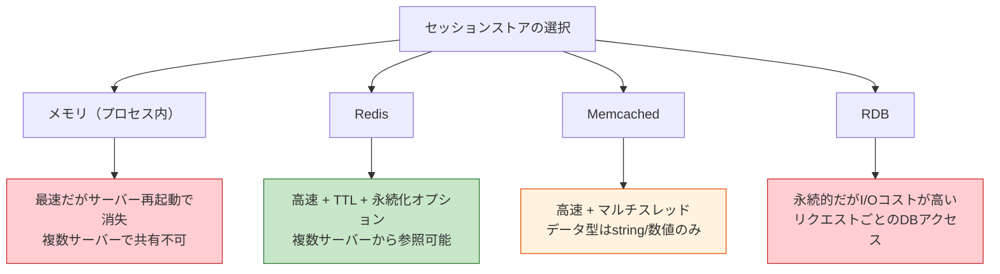
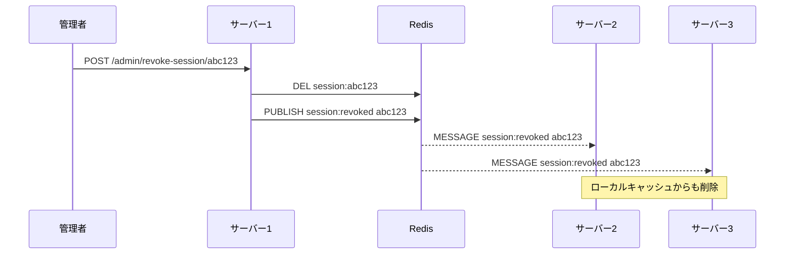

# MemcachedとRedis（Memcached vs Redis）

> **一言で言うと:** MemcachedとRedisはどちらもインメモリKVS（Key-Value Store）だが、Memcachedは「高速なキャッシュ」に特化したシンプルな設計、Redisは「データ構造サーバー」として多様な機能を持つ。セッションストアにはRedisが事実上の標準であり、単純なキャッシュのみの用途でMemcachedを選ぶケースがある。

## セッションストアにおける位置づけ

[[セッションとJWT|セッション]]ベースの認証では、サーバー側にセッションデータを保持するストアが必要になる。選択肢は主に3つあり、本番環境ではRedisが標準的な選択肢となっている。



## 基本設計の違い

| 観点 | Memcached | Redis |
|------|-----------|-------|
| 設計思想 | キャッシュ専用（揮発性データ） | データ構造サーバー（多目的） |
| データ型 | string / 数値のみ | String, List, Set, Sorted Set, Hash, Stream 等 |
| 永続化 | なし（メモリのみ） | RDB（スナップショット）/ AOF（追記ログ） |
| スレッドモデル | **マルチスレッド** | シングルスレッド（Redis 7以降はI/Oマルチスレッド） |
| メモリ管理 | Slab Allocator（固定サイズブロック） | jemalloc（可変サイズ） |
| 最大値サイズ | 1MB（デフォルト） | 512MB |
| Pub/Sub | なし | あり |
| Lua スクリプト | なし | あり（アトミック操作） |
| クラスタリング | クライアント側の分散 | Redis Cluster（サーバー側の分散） |
| TTL設定 | キー単位 | キー単位 |

## なぜセッションストアにはRedisが選ばれるのか

### 1. TTL（Time-To-Live）による自動期限切れ

セッションには有効期限がある。RedisもMemcachedもTTLをサポートするが、Redisは期限切れ通知（Keyspace Notifications）を使って「セッション期限切れ時にイベントを発火させる」ことができる。

### 2. データ構造の豊富さ

セッションデータはユーザーID、ロール、カートの内容など複数のフィールドを持つことが多い。RedisのHash型なら個別フィールドの読み書きが可能だが、Memcachedでは全体をシリアライズ/デシリアライズする必要がある。

```
# Redis: Hash型でセッションデータを個別フィールドで管理
HSET session:abc123 user_id 7 role admin cart_count 3
HGET session:abc123 role    # → "admin"（roleだけ取得）

# Memcached: JSON文字列として丸ごと保存/取得
set session:abc123 0 86400 {"user_id":7,"role":"admin","cart_count":3}
get session:abc123          # → 全体を取得してパースする必要がある
```

### 3. 永続化オプション

Memcachedはメモリのみで、プロセスが再起動するとセッションが全て消失する。Redisは RDB/AOF で永続化が可能なため、再起動後もセッションを復元できる。

### 4. Pub/Subによるセッション無効化の伝播

分散環境で特定のセッションを無効化する場合、Redis Pub/Subで全サーバーに即座に通知できる。



## Memcachedが適するケース

Redisが多くの場面で優位だが、Memcachedが適するシナリオも存在する。

| シナリオ | Memcachedが有利な理由 |
|---------|---------------------|
| 大量の単純キャッシュ（HTMLフラグメント、APIレスポンス等） | マルチスレッドでCPUコアをフル活用でき、単純なGET/SETではRedisより高スループット |
| メモリ効率が重要な大規模キャッシュ | Slab Allocatorによるメモリオーバーヘッドの予測可能性。Redisはデータ構造のメタデータ分だけオーバーヘッドが大きい |
| 既存のMemcachedインフラがある | 単純なキャッシュ用途なら移行の必要がない |

## コード例

### Go — Redisでセッション管理

```go
package main

import (
	"context"
	"crypto/rand"
	"encoding/hex"
	"encoding/json"
	"fmt"
	"time"

	"github.com/redis/go-redis/v9"
)

type SessionData struct {
	UserID int64  `json:"user_id"`
	Role   string `json:"role"`
}

var rdb = redis.NewClient(&redis.Options{Addr: "localhost:6379"})
var ctx = context.Background()

const sessionTTL = 24 * time.Hour

// セッション作成
func createSession(data SessionData) (string, error) {
	// 暗号論的に安全なセッションIDを生成
	b := make([]byte, 32)
	rand.Read(b)
	sessionID := hex.EncodeToString(b)

	// Hash型で保存（フィールド単位でアクセス可能）
	pipe := rdb.Pipeline()
	pipe.HSet(ctx, "session:"+sessionID, map[string]any{
		"user_id": data.UserID,
		"role":    data.Role,
	})
	pipe.Expire(ctx, "session:"+sessionID, sessionTTL)
	_, err := pipe.Exec(ctx)
	return sessionID, err
}

// セッション取得
func getSession(sessionID string) (*SessionData, error) {
	result, err := rdb.HGetAll(ctx, "session:"+sessionID).Result()
	if err != nil {
		return nil, err
	}
	if len(result) == 0 {
		return nil, fmt.Errorf("session not found")
	}

	var userID int64
	fmt.Sscan(result["user_id"], &userID)
	return &SessionData{UserID: userID, Role: result["role"]}, nil
}

// セッション削除（ログアウト / 強制無効化）
func destroySession(sessionID string) error {
	return rdb.Del(ctx, "session:"+sessionID).Err()
}

func main() {
	sid, _ := createSession(SessionData{UserID: 7, Role: "admin"})
	fmt.Println("Session ID:", sid)

	data, _ := getSession(sid)
	b, _ := json.Marshal(data)
	fmt.Println("Session data:", string(b))

	destroySession(sid)
	_, err := getSession(sid)
	fmt.Println("After destroy:", err) // session not found
}
```

### TypeScript（Node.js）— Redisセッションストア with Express

```typescript
import express from 'express';
import session from 'express-session';
import { createClient } from 'redis';
import RedisStore from 'connect-redis';

const app = express();

async function setup() {
  const redisClient = createClient({ url: 'redis://localhost:6379' });
  await redisClient.connect();

  app.use(session({
    store: new RedisStore({ client: redisClient }),
    secret: process.env.SESSION_SECRET!,
    resave: false,
    saveUninitialized: false,
    cookie: {
      httpOnly: true,
      secure: true,
      sameSite: 'lax',
      maxAge: 24 * 60 * 60 * 1000,
    },
  }));

  app.post('/login', (req, res) => {
    // パスワード照合後
    req.session.userId = 7;
    req.session.role = 'admin';
    res.json({ message: 'Logged in' });
  });

  app.post('/logout', (req, res) => {
    req.session.destroy(() => {
      res.clearCookie('connect.sid');
      res.json({ message: 'Logged out' });
    });
  });

  app.listen(3000);
}

setup();
```

### Python — Memcachedでシンプルなキャッシュ

```python
from pymemcache.client.base import Client
import json

mc = Client("localhost:11211")

# APIレスポンスのキャッシュ（セッションではなく純粋なキャッシュ用途）
def get_user_profile(user_id: int) -> dict:
    key = f"profile:{user_id}"
    cached = mc.get(key)
    if cached:
        return json.loads(cached)

    # キャッシュミス → DBから取得（省略）
    profile = {"id": user_id, "name": "山田太郎"}

    # 5分間キャッシュ
    mc.set(key, json.dumps(profile), expire=300)
    return profile

print(get_user_profile(7))
```

## よくある落とし穴

### 1. Redisをセッション専用にデプロイして永続化を無効にしない

セッション用Redisでは永続化（RDB/AOF）を有効にすることが推奨されるが、キャッシュ用Redisではディスク書き込みがパフォーマンスを劣化させる。用途を分けて別インスタンスにするか、設定を用途に合わせる。

### 2. Memcachedのeviction（退去）を想定しない

Memcachedはメモリが満杯になるとLRU（Least Recently Used）で古いデータを自動的に削除する。セッションストアとして使うと、メモリ不足時にログイン中のユーザーのセッションが突然消えるリスクがある。

### 3. Redisのシングルスレッド特性を無視する

Redisは基本的にシングルスレッドで動作するため、`KEYS *` のような全キー走査コマンドを本番で実行すると、その間すべてのリクエストがブロックされる。`SCAN` コマンドで段階的に走査する。

```
# ❌ 本番で絶対にやってはいけない
KEYS session:*

# ✅ SCANで段階的に走査
SCAN 0 MATCH session:* COUNT 100
```

### 4. セッションストアのフェイルオーバーを考慮しない

Redisが停止するとセッションベースの認証が全面ダウンする。Redis Sentinel（自動フェイルオーバー）やRedis Cluster（分散構成）を導入し、セッションストアの可用性を確保する。

## 関連トピック

- [[認証と認可]] — 親トピック。セッションストアは認証状態の維持に使われる
- [[セッションとJWT]] — セッション方式ではRedis/Memcachedがストアとして使われる
- [[キャッシュ戦略]] — Redis/Memcachedはキャッシュインフラとしても使われる。Write-through、Write-behind等の戦略
- [[NoSQL]] — RedisはKey-Value型NoSQLの代表例。データ構造とユースケース

## 参考リソース

- Redis 公式ドキュメント — データ型、永続化、クラスタリング
- Memcached Wiki — Slab Allocator、プロトコル仕様
- 「Redis in Action」（Josiah L. Carlson著）— Redisの実践パターン
