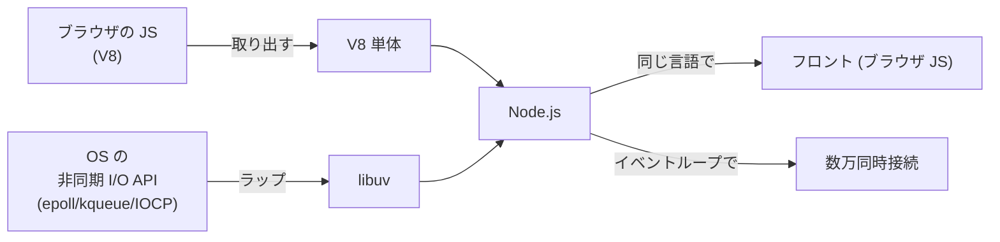
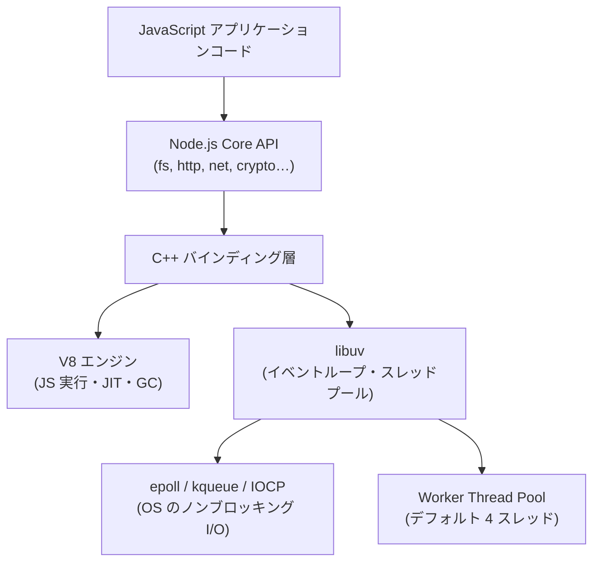
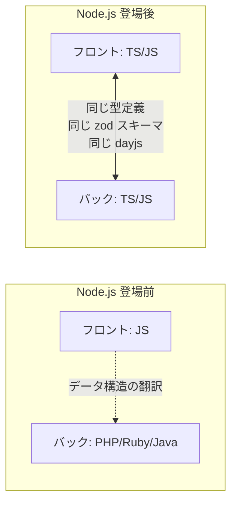

# Node.js

> **一言で言うと:** ブラウザ専用だった JavaScript を、V8 エンジンと libuv（非同期 I/O ライブラリ）と結合することでサーバーサイドの汎用ランタイムに仕立てた実行環境。「フロント/バック同一言語」と「I/O 駆動の高並行性」を同時に実現した点が画期的だった。

## 何が新しかったのか — 2009 年当時の文脈

2009 年に Ryan Dahl が Node.js を発表するまで、JavaScript は「ブラウザの DOM を操作するためのスクリプト」でしかなかった。サーバーサイドは PHP / Ruby / Python / Java が主流で、それぞれ次の問題を抱えていた:

- **スレッドプールモデルの限界** — Apache / Tomcat は 1 リクエスト = 1 スレッドで、同時接続数が増えるとメモリとコンテキストスイッチで崩壊する（C10K 問題）
- **I/O 待ちでスレッドがブロックされる** — DB クエリ中、スレッドは「何もせず待つ」だけなのに OS リソースを占有し続ける
- **言語の分断** — フロントは JS、バックは別言語。型・バリデーション・エラー表現を二重に書く必要があった

Node.js はこの 3 つを同時に解いた:



**画期的だった 3 つのポイント:**

| 観点 | 従来 | Node.js |
|---|---|---|
| 実行単位 | 1 リクエスト = 1 スレッド（数 MB/接続） | 1 プロセス = 1 イベントループ（数 KB/接続） |
| I/O | 同期ブロッキングが既定 | 非同期ノンブロッキングが既定 |
| 言語 | フロント JS / バック別言語 | フロント・バック共通（Isomorphic / Universal） |
| パッケージ | 言語ごとに分断（gem, pip, maven…） | npm による単一の巨大エコシステム |

V8 と libuv は既存の部品だったが、**「ブラウザから V8 を引き剥がして OS の非同期 I/O と結線する」** という発想そのものが新しかった。

## アーキテクチャ — 中身は何でできているか



- **V8** — Google Chrome の JS エンジン。JS を機械語に JIT コンパイルする。詳細は [[インタプリタ・コンパイラ・JIT]] を参照
- **libuv** — クロスプラットフォームな非同期 I/O ライブラリ。Linux の epoll、macOS の kqueue、Windows の IOCP をひとつの API に抽象化する
- **イベントループ** — libuv が提供する「待機中のイベントを順番に捌くループ」。これが Node の高並行性の源泉。詳細は [[イベントループ]] を参照
- **Worker スレッドプール** — 本質的にブロッキングな処理（ファイル I/O、DNS、crypto の一部）は裏でスレッドに逃がす

> **重要:** JS を実行するスレッドは **1 つ**。ただし「JS が 1 スレッド」なのであって、Node.js プロセス全体はマルチスレッドで動いている。この混同が「Node はシングルスレッドだから遅い」という誤解の源。

## サーバーで JS を動かす意味

技術的な意味と、ビジネス的な意味の両方がある。

### 1. ランタイムモデルとしての意味 — I/O バウンドに強い

Web サーバーの仕事の 9 割は「DB やキャッシュや外部 API を待つこと」である。同期モデルでは待ち時間中もスレッドが居座るが、Node.js は `await` するだけでスレッドが解放され、同じスレッドで次のリクエストを処理できる。

詳細なモデル比較は [[Webサーバーとランタイムのリクエスト処理モデル]] を参照。

### 2. 開発体験としての意味 — 言語の統一



- 型定義を共有できる（tRPC, Zod, Prisma）
- SSR / SSG をサーバーで実行できる（Next.js, Nuxt）→ SEO と初期表示を両立
- フロントエンド開発者が「バックエンドも書ける」
- ビルド/テスト/リンターのツールチェインが統一される

### 3. エコシステムとしての意味 — npm

npm は 2026 年現在、世界最大のパッケージレジストリ（300 万超のパッケージ）。[[npmとpnpmの比較]] も参照。ただし大きすぎることに伴う闇もあり、[[npmサプライチェーン攻撃事例]] のようなリスクも生まれた。

## コード例

### 最小の HTTP サーバー

```javascript
import http from 'node:http';

const server = http.createServer(async (req, res) => {
  if (req.url === '/') {
    res.writeHead(200, { 'Content-Type': 'text/plain' });
    res.end('Hello from Node.js\n');
  } else {
    res.writeHead(404);
    res.end();
  }
});

server.listen(3000, () => console.log('listening on :3000'));
```

たった 10 行で、数千の同時接続を捌けるサーバーが書ける。PHP + Apache なら `httpd.conf` と `php-fpm.conf` を触る必要がある。この **「立ち上がりの軽さ」** もまた Node.js の特徴である。

### イベントループが「待たない」ことを体感する

```typescript
import { setTimeout as delay } from 'node:timers/promises';

async function handler(name: string) {
  console.log(`${name} 開始`);
  await delay(1000); // 1 秒 "待つ" が、スレッドはブロックされない
  console.log(`${name} 完了`);
}

// 3 つ同時に走らせる
await Promise.all([handler('A'), handler('B'), handler('C')]);
// 出力:
// A 開始
// B 開始
// C 開始
// (1 秒後)
// A 完了
// B 完了
// C 完了
// → 合計 1 秒で終わる（3 秒ではない）
```

同じことを Python (sync) や Ruby (sync) で書くと合計 3 秒かかる。Node.js は **非同期を既定** にしたからこれが自然に書ける。

### Go との比較 — 「同期的に書けて並行に走る」という別解

Node.js が「**コードを非同期に書く (`async`/`await`) ことで並行性を得る**」アプローチなのに対し、Go は「**コードは同期的に書き、ランタイムが Goroutine を裏で多重化する**」アプローチを取る。結果として得られるスループット特性は近いが、プログラミングモデルは正反対に近い。

**(1) 3 つの処理を並行に走らせるデモ — Node.js の Promise.all 例と対応:**

```go
package main

import (
	"fmt"
	"sync"
	"time"
)

func task(name string) {
	fmt.Printf("%s 開始\n", name)
	time.Sleep(1 * time.Second) // 同期的に "待つ" が、Goroutine はパーキングされる
	fmt.Printf("%s 完了\n", name)
}

func main() {
	var wg sync.WaitGroup
	for _, name := range []string{"A", "B", "C"} {
		wg.Add(1)
		go func(n string) { // Goroutine として起動 — これだけで並行
			defer wg.Done()
			task(n)
		}(name)
	}
	wg.Wait()
	// 合計 1 秒で終わる（Node.js の例と同じ）
}
```

**(2) 最小の HTTP サーバー — Node.js の `http.createServer` 例と対応:**

```go
package main

import (
	"fmt"
	"net/http"
)

func main() {
	http.HandleFunc("/", func(w http.ResponseWriter, r *http.Request) {
		// リクエストごとに自動的に Goroutine が割り当てられる
		// 開発者は「この関数が並行実行されている」ことを意識せず同期コードを書ける
		fmt.Fprintln(w, "Hello from Go")
	})
	http.ListenAndServe(":8080", nil)
}
```

**Node.js と Go の本質的な違い:**

| 観点 | Node.js | Go |
|---|---|---|
| 並行性の表現 | `async`/`await` をコード上に書く | `go` キーワードで Goroutine を起動。呼び出し側はただの関数に見える |
| I/O 待ちの扱い | イベントループが他のコールバックを実行 | ランタイムが Goroutine をパーキングし別の Goroutine に切り替える |
| JS/関数の色 | 「関数の色問題」あり — `async` 関数は `async` からしか自然に呼べない | 色なし — 同期/非同期の区別がコード上に現れない |
| CPU バウンド処理 | イベントループを止めるので `worker_threads` が必要 | スケジューラが自動的に OS スレッドを複数使うため、1 Goroutine が重くても他の Goroutine は進む |
| マルチコア活用 | JS 実行は 1 コアに固定（`cluster` / PM2 / コンテナで横展開）。libuv スレッドプールや `worker_threads` は別 | 既定でマルチコア活用（`GOMAXPROCS`） |
| 同時接続あたりのメモリ | 数 KB（イベントループのエントリ） | 約 2 KB（Goroutine の初期スタック） |
| 型システム | TypeScript（後付け） | 言語組み込みの静的型 |

**「関数の色問題」について:** Node.js では `async` 関数の結果を **同期的に受け取ることができない**。同期関数から呼び出した場合、戻り値はただの `Promise` でしかなく、実際の値を取り出すには `.then()` でチェーンするか、呼び出し側も `async` にして `await` する必要がある。結果として「一度 async にしたら、それを呼ぶ関数も連鎖的に async になる」伝染が起きる（これが Bob Nystrom が "What Color is Your Function?" で指摘した問題）。Go には `async`/`await` そのものがなく、`db.Query(...)` も `fmt.Println(...)` も同じ見た目で書ける — これが Go のシンプルさの源泉のひとつ。

**どちらが優れているか？:** ワークロードと開発文化で変わる。

- **Node.js が有利:** フロントと言語を共有したい、SSR/Edge で動かしたい、npm の資産を使いたい、I/O 中心で CPU 負荷が軽い
- **Go が有利:** CPU バウンドな処理が混じる、マルチコアを素直に使いたい、同期的な書き味を保ちたい、単一バイナリで配布したい

より詳細なモデル比較は [[Webサーバーとランタイムのリクエスト処理モデル]] を参照。

## よくある落とし穴

### 1. CPU バウンドな処理でイベントループを止める

JS を実行するスレッドは 1 つしかない。ここを長時間占有すると、**他の全リクエストが停止する**。

```javascript
// NG: 暗号化ハッシュの同期 API を HTTP ハンドラ内で呼ぶ
app.post('/hash', (req, res) => {
  const hash = crypto.pbkdf2Sync(req.body.pw, salt, 1_000_000, 64, 'sha512');
  res.json({ hash });
});
// → 1M iterations の pbkdf2-sha512 は数百ms〜1秒オーダーでスレッドを占有し、
//    その間の全接続が停止する

// OK: 非同期 API を使う（内部で libuv スレッドプールに逃がす）
app.post('/hash', async (req, res) => {
  const hash = await promisify(crypto.pbkdf2)(req.body.pw, salt, 1_000_000, 64, 'sha512');
  res.json({ hash });
});
```

重い計算は [`worker_threads`](https://nodejs.org/api/worker_threads.html) で別スレッドへ逃がすのが定石。

### 2. 「シングルスレッドだからマルチコアを活かせない」という誤解

正しくは「1 プロセスはシングルスレッド」。マルチコアは `cluster` モジュールか、より実務的には **プロセスマネージャ（PM2）** や **コンテナを CPU コア数分並べる** のが定石。Node.js の世界では「縦に強くする」のではなく「横に並べる」のが標準戦略。

### 3. `require` と `import` の混在

Node.js は歴史的に CommonJS (`require`) だけだったが、ES Modules (`import`) も後から追加された。両者は別のローダーで動いており、長年 `require()` から ESM を読み込むと `ERR_REQUIRE_ESM` で落ちるのが定石だった。

**Node.js 22.12 (2024-11) 以降は状況が変わった:** `require(esm)` が既定で有効化され、同期的に ESM を require できるようになった。ただし以下の制約は残る:

- 対象の ESM がトップレベル `await` を含む場合は依然として不可
- `package.json` の `"type"` や拡張子による解決ルールは従来通り適用される
- 古い LTS（Node.js 20 以前）を併用するライブラリは引き続き `ERR_REQUIRE_ESM` に備える必要がある

新規プロジェクトは `"type": "module"` + ESM で統一するのが最も摩擦が少ない。

### 4. グローバル状態を使うとスケールできない

Node.js のプロセスはメモリを持てるが、**水平スケール（複数インスタンス）** したとたん共有されなくなる。セッション・キャッシュ・レート制限などは必ず [[MemcachedとRedis|Redis]] のような外部ストアに置く。

## 代替ランタイムとの関係

Node.js が切り拓いた「JS ランタイム」という土俵に、後発が参入している:

| ランタイム | 作者 | 特徴 |
|---|---|---|
| **Node.js** | OpenJS Foundation | 事実上の標準。npm エコシステムを保有 |
| **Deno** | Ryan Dahl（Node.js の作者自身） | 「Node.js の後悔」を修正。TS 標準搭載、URL ベースのモジュール、Web 標準 API 優先、デフォルトでサンドボックス |
| **Bun** | Oven | Zig 製。起動速度・npm install・テストランナーが桁違いに速い。Node.js 互換を強く意識 |
| **workerd** | Cloudflare | V8 Isolate ベース。数 ms で起動するエッジ実行環境（Cloudflare Workers の中身） |

Deno の登場は「Ryan Dahl が Node.js の 10 年を振り返って自己批判した」という意味で象徴的。特に `node_modules` の肥大化、セキュリティの既定値、CJS の負債が挙げられている。

## 実務での使用シーン

- **BFF (Backend For Frontend)** — フロントエンドから使いやすい API を集約する中間層。[[Backend-For-Frontend]] を参照
- **SSR / SSG** — Next.js / Nuxt によるサーバーサイドレンダリング
- **リアルタイム通信** — WebSocket を使ったチャット・通知・協調編集
- **CLI ツール / ビルドツール** — webpack, Vite, ESLint, Prettier など、フロントエンドのビルドツール群はほぼ全て Node.js で動く
- **軽量なマイクロサービス** — 起動が速く、Lambda などのサーバーレスとも相性がよい

## AI による実装のアンチパターン

| アンチパターン | なぜ問題か | 対策 |
|---|---|---|
| `fs.readFileSync` を HTTP ハンドラ内で使う | イベントループをブロックし全接続が遅延する | `fs.promises.readFile` を使う |
| すべての Promise を `.then` チェーンで繋ぐ | ネストが深くなりエラー境界が不明瞭 | `async`/`await` を使う |
| エラーを `process.on('uncaughtException')` で握り潰す | 実は壊れた状態で走り続け、より悪い結果を招く | 起動時のセーフティネットとしてログ＋即時終了に留め、通常のエラーは try/catch で扱う |
| `setTimeout(fn, 0)` で「非同期化」したつもりになる | 重い計算は timer の裏でも同じスレッドで走るので意味がない | `worker_threads` か別プロセスに逃がす |
| CommonJS と ESM を雑に混ぜる | Node 22.12 未満では `ERR_REQUIRE_ESM` で落ち、22.12+ でもトップレベル await を含む ESM は require 不可 | プロジェクト全体で ESM に統一 |

## 関連トピック

- [[HTML-CSS-JS]] — 親トピック。ブラウザの JS がどこから来たか
- [[イベントループ]] — Node.js の心臓部
- [[Webサーバーとランタイムのリクエスト処理モデル]] — 他ランタイムとの比較
- [[インタプリタ・コンパイラ・JIT]] — V8 の実行モデル
- [[npmとpnpmの比較]] — パッケージマネージャ
- [[npxとは]] — Node.js エコシステムのワンショット実行ツール
- [[Backend-For-Frontend]] — Node.js がよく採用されるアーキテクチャ

## 参考リソース

- [Node.js 公式ドキュメント](https://nodejs.org/docs/latest/api/)
- Ryan Dahl「10 Things I Regret About Node.js」（JSConf EU 2018）— Deno 発表の原点となった講演
- *Node.js Design Patterns*（Mario Casciaro, Luciano Mammino）— イベント駆動設計を学ぶ定番書
