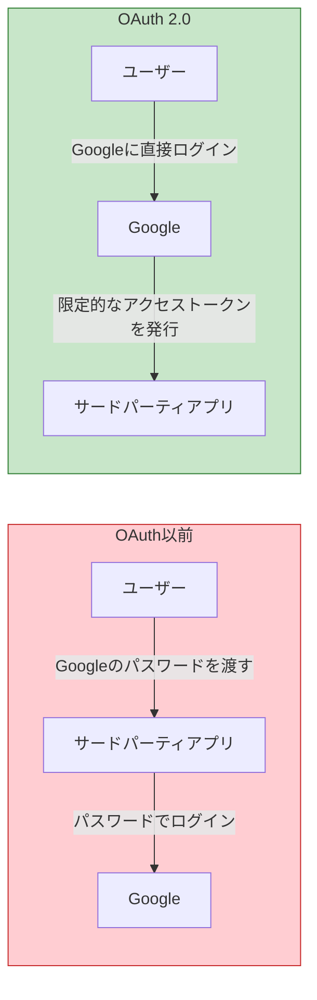
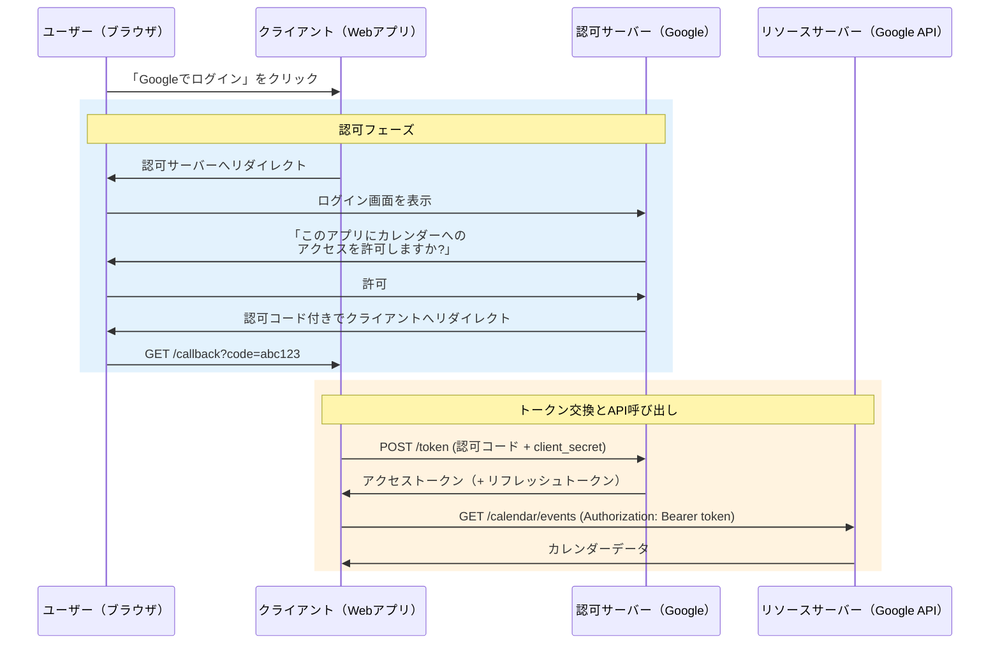
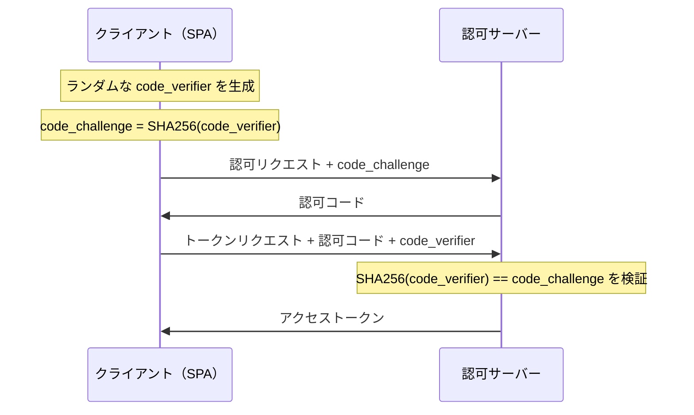
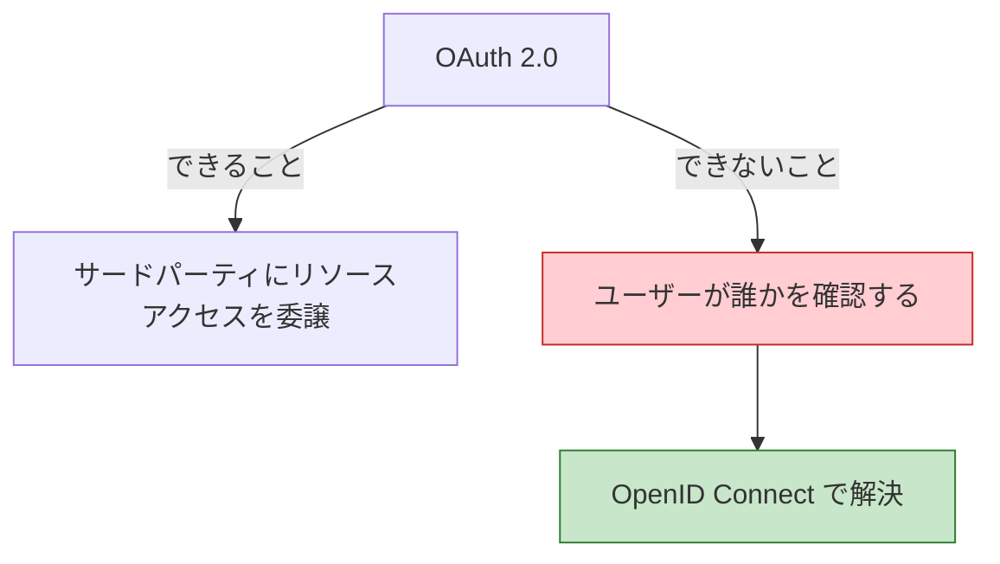

# OAuth 2.0 と OpenID Connect（OIDC）

> **一言で言うと:** OAuth 2.0は「第三者アプリにユーザーのリソースへのアクセスを委譲する」ための**認可**フレームワーク。OpenID Connect（OIDC）はOAuth 2.0の上に「ユーザーが誰か」を確認する**認証**レイヤーを追加した仕様。「Googleでログイン」のようなソーシャルログインは、内部でOIDCを使っている。

## OAuth 2.0が解決する問題

OAuth 2.0が登場する前、サードパーティアプリがユーザーのデータにアクセスするには、**ユーザーのパスワードを直接受け取る**しかなかった。



これには深刻な問題がある:

- アプリがパスワードを保持するため、漏洩リスクが膨大
- アプリに全権限が渡り、スコープを限定できない
- パスワード変更で全サードパーティアプリが壊れる
- 特定のアプリだけアクセスを取り消せない

OAuth 2.0は**パスワードを共有せずに、限定的な権限を委譲する**仕組みを提供する。

## 登場人物（ロール）

| ロール | 説明 | 具体例 |
|--------|------|--------|
| **Resource Owner** | リソースの所有者（通常はユーザー） | Googleアカウントを持つユーザー |
| **Client** | リソースにアクセスしたいアプリケーション | 「Googleカレンダー連携」するタスク管理アプリ |
| **Authorization Server** | 認可を管理しトークンを発行するサーバー | Google OAuth サーバー |
| **Resource Server** | 保護されたリソースを提供するAPI | Google Calendar API |

## Authorization Code Flow（認可コードフロー）

Webアプリケーションで最も一般的なフロー。



### なぜ「認可コード」を経由するのか

ブラウザのリダイレクトで直接アクセストークンを返す（Implicit Flow）と、URLフラグメントにトークンが露出してブラウザ履歴やRefererヘッダから漏洩するリスクがある。認可コードフローでは:

1. ブラウザには一時的な**認可コード**だけが渡る（短命、1回限り使用可能）
2. クライアントがサーバー間通信で認可コードをアクセストークンに交換する（`client_secret` を使用）
3. アクセストークンはブラウザに一切露出しない

## PKCE — パブリッククライアントの保護

SPA（シングルページアプリケーション）やモバイルアプリは `client_secret` を安全に保持できない（ソースコードに埋め込むと閲覧可能）。**PKCE**（Proof Key for Code Exchange、「ピクシー」と読む）はこの問題を解決する（詳細は [[PKCEフロー]] を参照）。



認可リクエスト時にチャレンジ（ハッシュ値）を送り、トークン交換時に元の値を送る。認可コードを傍受した攻撃者は元の `code_verifier` を知らないため、トークンを取得できない。

**現在の推奨:** パブリッククライアント（SPA、モバイル）だけでなく、**すべてのクライアントでPKCEを使用する**ことがOAuth 2.1ドラフトで推奨されている。

## OAuth 2.0 は「認可」であり「認証」ではない

OAuth 2.0のアクセストークンは「このトークンの持ち主にカレンダーの読み取りを許可する」ことを意味するが、**「このトークンの持ち主がユーザーAである」とは言っていない**。



例えば「Googleでログイン」をOAuth 2.0だけで実装すると、アクセストークンでGoogleのプロフィールAPIを叩いてユーザー情報を取得することになる。しかしこれは標準化されておらず、プロバイダごとにAPIが異なり、セキュリティ上の落とし穴もある。

## OpenID Connect（OIDC）— OAuth 2.0 + 認証

OIDCはOAuth 2.0の上に構築された**認証レイヤー**であり、以下を標準化する:

- **IDトークン** — ユーザーの身元情報を含むJWT
- **UserInfoエンドポイント** — 追加のユーザー情報を取得するAPI
- **標準クレーム** — `sub`（ユーザーID）、`email`、`name` 等の統一フォーマット
- **ディスカバリー** — プロバイダのエンドポイントを自動検出する仕組み

### OAuth 2.0 vs OIDC 比較

| 観点 | OAuth 2.0 | OpenID Connect |
|------|-----------|----------------|
| 目的 | **認可**（リソースアクセスの委譲） | **認証**（ユーザーの身元確認） |
| 発行されるトークン | アクセストークン（+ リフレッシュトークン） | アクセストークン + **IDトークン（JWT）** |
| ユーザー情報の取得 | 標準化されていない | UserInfoエンドポイントで標準化 |
| スコープ | `read`, `write` 等（リソース固有） | `openid`, `profile`, `email` 等（標準化） |
| 仕様 | RFC 6749 | OAuth 2.0 の拡張仕様 |

### IDトークンの中身

```json
{
  "iss": "https://accounts.google.com",
  "sub": "110169484474386276334",
  "aud": "your-client-id.apps.googleusercontent.com",
  "exp": 1711643200,
  "iat": 1711639600,
  "email": "user@example.com",
  "email_verified": true,
  "name": "山田太郎",
  "picture": "https://lh3.googleusercontent.com/..."
}
```

| クレーム | 意味 |
|---------|------|
| `iss`（Issuer） | トークンの発行者 |
| `sub`（Subject） | ユーザーの一意識別子（プロバイダ内で不変） |
| `aud`（Audience） | このトークンの対象クライアントID |
| `exp` / `iat` | 有効期限 / 発行時刻 |

**`sub` クレームが認証の核心。** メールアドレスは変更される可能性があるが、`sub` はプロバイダ内で不変のため、ユーザーの同一性判定には `sub` を使う。

## コード例

### Go — OIDCでGoogleログイン（Authorization Code Flow + PKCE）

```go
package main

import (
	"context"
	"crypto/rand"
	"crypto/sha256"
	"encoding/base64"
	"encoding/json"
	"fmt"
	"net/http"
	"os"

	"github.com/coreos/go-oidc/v3/oidc"
	"golang.org/x/oauth2"
)

var (
	provider     *oidc.Provider
	oauth2Config oauth2.Config
)

func init() {
	ctx := context.Background()
	var err error
	provider, err = oidc.NewProvider(ctx, "https://accounts.google.com")
	if err != nil {
		panic(err)
	}

	oauth2Config = oauth2.Config{
		ClientID:     os.Getenv("GOOGLE_CLIENT_ID"),
		ClientSecret: os.Getenv("GOOGLE_CLIENT_SECRET"),
		RedirectURL:  "http://localhost:3000/callback",
		Endpoint:     provider.Endpoint(),
		Scopes:       []string{oidc.ScopeOpenID, "profile", "email"},
	}
}

// PKCE用のcode_verifierとcode_challengeを生成
func generatePKCE() (verifier, challenge string) {
	b := make([]byte, 32)
	rand.Read(b)
	verifier = base64.RawURLEncoding.EncodeToString(b)
	h := sha256.Sum256([]byte(verifier))
	challenge = base64.RawURLEncoding.EncodeToString(h[:])
	return
}

func handleLogin(w http.ResponseWriter, r *http.Request) {
	verifier, challenge := generatePKCE()
	// verifierをセッションに保存（簡略化: 本番ではセッションストアを使う）
	http.SetCookie(w, &http.Cookie{
		Name: "pkce_verifier", Value: verifier,
		HttpOnly: true, Secure: true, SameSite: http.SameSiteLaxMode,
	})

	url := oauth2Config.AuthCodeURL("state",
		oauth2.SetAuthURLParam("code_challenge", challenge),
		oauth2.SetAuthURLParam("code_challenge_method", "S256"),
	)
	http.Redirect(w, r, url, http.StatusFound)
}

func handleCallback(w http.ResponseWriter, r *http.Request) {
	cookie, _ := r.Cookie("pkce_verifier")

	// 認可コードをアクセストークン + IDトークンに交換
	token, err := oauth2Config.Exchange(r.Context(), r.URL.Query().Get("code"),
		oauth2.SetAuthURLParam("code_verifier", cookie.Value),
	)
	if err != nil {
		http.Error(w, "Token exchange failed", http.StatusInternalServerError)
		return
	}

	// IDトークンを検証
	verifier := provider.Verifier(&oidc.Config{ClientID: oauth2Config.ClientID})
	rawIDToken, ok := token.Extra("id_token").(string)
	if !ok {
		http.Error(w, "No id_token", http.StatusInternalServerError)
		return
	}

	idToken, err := verifier.Verify(r.Context(), rawIDToken)
	if err != nil {
		http.Error(w, "ID token verification failed", http.StatusUnauthorized)
		return
	}

	// ユーザー情報を取得
	var claims struct {
		Sub           string `json:"sub"`
		Email         string `json:"email"`
		EmailVerified bool   `json:"email_verified"`
		Name          string `json:"name"`
	}
	idToken.Claims(&claims)

	// claims.Sub でユーザーを特定してセッションを作成
	json.NewEncoder(w).Encode(claims)
}

func main() {
	http.HandleFunc("/login", handleLogin)
	http.HandleFunc("/callback", handleCallback)
	fmt.Println("Server running on :3000")
	http.ListenAndServe(":3000", nil)
}
```

### TypeScript（Express）— OIDCでGoogleログイン

```typescript
import express from 'express';
import { Issuer, generators } from 'openid-client';

const app = express();

async function setup() {
  // ディスカバリー: Googleのエンドポイントを自動検出
  const googleIssuer = await Issuer.discover('https://accounts.google.com');

  const client = new googleIssuer.Client({
    client_id: process.env.GOOGLE_CLIENT_ID!,
    client_secret: process.env.GOOGLE_CLIENT_SECRET!,
    redirect_uris: ['http://localhost:3000/callback'],
    response_types: ['code'],
  });

  app.get('/login', (req, res) => {
    const codeVerifier = generators.codeVerifier();
    const codeChallenge = generators.codeChallenge(codeVerifier);

    // code_verifierをセッションに保存（簡略化）
    (req as any).session = { codeVerifier };

    const url = client.authorizationUrl({
      scope: 'openid profile email',
      code_challenge: codeChallenge,
      code_challenge_method: 'S256',
    });
    res.redirect(url);
  });

  app.get('/callback', async (req, res) => {
    const params = client.callbackParams(req);
    const codeVerifier = (req as any).session?.codeVerifier;

    // 認可コード → トークン交換 + IDトークン検証を一括実行
    const tokenSet = await client.callback(
      'http://localhost:3000/callback',
      params,
      { code_verifier: codeVerifier },
    );

    const claims = tokenSet.claims();
    // claims.sub でユーザーを特定
    res.json({
      sub: claims.sub,
      email: claims.email,
      name: claims.name,
    });
  });

  app.listen(3000, () => console.log('Server running on :3000'));
}

setup();
```

## 実務での使用シーン

| シーン | 使うもの | 理由 |
|--------|---------|------|
| 「Googleでログイン」 | OIDC | ユーザーの身元確認（認証）が目的 |
| 「Googleカレンダーと連携」 | OAuth 2.0 | カレンダーAPIへのアクセス委譲（認可）が目的 |
| マイクロサービス間通信 | OAuth 2.0 Client Credentials Flow | ユーザーは介在せず、サービス同士が認証 |
| 社内SSO（シングルサインオン） | OIDC | 1回のログインで複数サービスにアクセス |

## よくある落とし穴

### 1. OAuth 2.0だけで「ログイン」を実装する

OAuth 2.0のアクセストークンはリソースアクセスの許可であり、ユーザーの身元証明ではない。アクセストークンでプロフィールAPIを叩く方法は動くが、「confused deputy」問題（別のクライアント向けに発行されたトークンを流用される攻撃）に脆弱。OIDCのIDトークンは `aud` クレームで対象クライアントを検証するため、この攻撃を防げる。

### 2. IDトークンの署名検証をスキップする

IDトークンはJWTなので、クレームを取り出すだけならデコードするだけで済む。しかし署名を検証しないと、攻撃者が任意のクレームを持つ偽のIDトークンを作成できる。ライブラリの `verify()` を必ず使い、署名・`iss`・`aud`・`exp` を検証する。

### 3. `email` でユーザーを同一視する

メールアドレスは変更される可能性がある。また、一部のプロバイダでは `email_verified` が `false` のまま返ることがある。ユーザーの同一性判定には **`iss` + `sub`** の組み合わせを使う。

### 4. Implicit Flowを使い続ける

Implicit Flow（`response_type=token`）はアクセストークンがURLフラグメントに露出するため、OAuth 2.1ドラフトで非推奨になった。SPAでも Authorization Code Flow + PKCE を使うべき。

### 5. stateパラメータの省略

認可リクエストに `state` パラメータ（CSRFトークン相当）を含めないと、攻撃者が自分の認可コードをユーザーのコールバックURLに差し込んで、攻撃者のアカウントとユーザーのセッションを紐付ける攻撃が可能になる。

## 関連トピック

- [[認証と認可]] — 親トピック。OAuth 2.0は認可、OIDCは認証のフレームワーク
- [[セッションとJWT]] — IDトークンはJWT形式。OIDCで認証した後、セッションまたはJWTでログイン状態を維持する
- [[CORS]] — SPAからのOAuth 2.0フローではCORS設定が必要
- [[HTTP-HTTPS]] — OAuth 2.0はHTTPS前提の仕様。トークンが平文で流れると致命的

## 参考リソース

- RFC 6749 — OAuth 2.0 Authorization Framework
- RFC 7636 — PKCE（Proof Key for Code Exchange）
- OpenID Connect Core 1.0 仕様
- OAuth 2.1 ドラフト — Implicit Flow非推奨、PKCE必須化
- 「雰囲気でOAuth2.0を使っているエンジニアがOAuth2.0を整理して、手を動かしながら学べる本」（Auth屋著）
