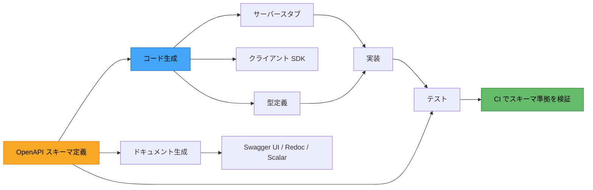

# OpenAPI とスキーマ駆動開発（Schema-Driven Development）

> **一言で言うと:** OpenAPI Specification（旧 Swagger）は API の契約を YAML/JSON で記述する標準仕様であり、スキーマ駆動開発はこのスキーマを「単一の真実の源（Single Source of Truth）」としてコード生成・テスト・ドキュメントを自動化する開発手法。

## OpenAPI Specification とは

OpenAPI Specification（OAS）は、REST API のインターフェースを言語非依存で記述するためのオープンな標準仕様。もともと Swagger Specification として始まり、2016 年に Linux Foundation 傘下の OpenAPI Initiative へ移管された。

現在の最新版は **OpenAPI 3.1**（2021年リリース）で、JSON Schema との完全互換が実現されている。

### OpenAPI 3.1 の基本構造

```yaml
openapi: "3.1.0"
info:
  title: Bookstore API
  version: "1.0.0"

servers:
  - url: https://api.example.com/v1

paths:
  /books:
    get:
      summary: 書籍一覧を取得
      operationId: listBooks
      parameters:
        - name: limit
          in: query
          schema:
            type: integer
            default: 20
      responses:
        "200":
          description: 書籍一覧
          content:
            application/json:
              schema:
                type: array
                items:
                  $ref: "#/components/schemas/Book"
    post:
      summary: 書籍を登録
      operationId: createBook
      requestBody:
        required: true
        content:
          application/json:
            schema:
              $ref: "#/components/schemas/CreateBookRequest"
      responses:
        "201":
          description: 作成された書籍
          content:
            application/json:
              schema:
                $ref: "#/components/schemas/Book"
        "422":
          description: バリデーションエラー
          content:
            application/json:
              schema:
                $ref: "#/components/schemas/ValidationError"

components:
  schemas:
    Book:
      type: object
      required: [id, title, author]
      properties:
        id:
          type: string
          format: uuid
        title:
          type: string
          maxLength: 200
        author:
          type: string
        publishedAt:
          type: string
          format: date
          description: 出版日（nullable）
          nullable: true

    CreateBookRequest:
      type: object
      required: [title, author]
      properties:
        title:
          type: string
          maxLength: 200
        author:
          type: string

    ValidationError:
      type: object
      properties:
        message:
          type: string
        errors:
          type: object
          additionalProperties:
            type: array
            items:
              type: string

  securitySchemes:
    BearerAuth:
      type: http
      scheme: bearer
      bearerFormat: JWT

security:
  - BearerAuth: []
```

主要な構成要素:

| セクション | 役割 |
|-----------|------|
| `openapi` | 仕様バージョンの宣言 |
| `info` | API のメタデータ（タイトル、バージョン、説明） |
| `servers` | API のベース URL |
| `paths` | エンドポイントごとのリクエスト/レスポンス定義 |
| `components/schemas` | 再利用可能なデータモデル定義 |
| `components/securitySchemes` | 認証方式の定義 |
| `security` | グローバルに適用するセキュリティ要件 |

## スキーマ駆動開発のワークフロー

スキーマ駆動開発（Schema-First / Contract-First）は、API スキーマを最初に定義し、そこからコード・テスト・ドキュメントを生成するアプローチ。



### Code-First vs Schema-First の比較

| 観点 | Code-First | Schema-First |
|------|-----------|-------------|
| **起点** | コード（アノテーション等）からスキーマを生成 | スキーマからコードを生成 |
| **フロント・バック連携** | 実装完了まで正確なスキーマが確定しない | スキーマ合意後にフロント・バックが並行開発できる |
| **スキーマの正確性** | 実装に忠実（ただし意図しない公開リスク） | 設計意図が明確に反映される |
| **初期コスト** | 低い（既存コードにアノテーションを追加） | 高い（YAML/JSON でスキーマを手書き） |
| **向いているケース** | 小規模チーム、プロトタイピング | 複数チーム連携、公開 API、マイクロサービス |
| **代表ツール** | tsoa, NestJS Swagger, FastAPI | openapi-generator, orval, oapi-codegen |

## コード生成ツールと実践例

### TypeScript — orval

orval は OpenAPI スキーマから TypeScript の API クライアントと型定義を生成する。React Query / SWR / axios 等に対応。

```typescript
// orval.config.ts
import { defineConfig } from "orval";

export default defineConfig({
  bookstore: {
    input: "./openapi.yaml",
    output: {
      target: "./src/api/bookstore.ts",
      schemas: "./src/api/models",
      client: "react-query",
      mode: "tags-split",
    },
  },
});

// 生成されたコードの使用例
// src/api/bookstore.ts から自動生成された hooks を利用
import { useListBooks, useCreateBook } from "./api/bookstore";

function BookList() {
  // 型安全なクエリ — レスポンス型は Book[] と推論される
  const { data: books, isLoading } = useListBooks({ limit: 10 });

  const { mutate: createBook } = useCreateBook();

  const handleCreate = () => {
    // CreateBookRequest 型に準拠しないとコンパイルエラー
    createBook({ data: { title: "新しい本", author: "著者名" } });
  };

  if (isLoading) return <p>Loading...</p>;
  return (
    <ul>
      {books?.map((book) => (
        <li key={book.id}>{book.title} — {book.author}</li>
      ))}
    </ul>
  );
}
```

### Go — oapi-codegen

oapi-codegen は OpenAPI スキーマから Go のサーバーインターフェースとモデルを生成する。Echo / Chi / Gin / net/http に対応。

```go
// oapi-codegen の設定ファイル: oapi-codegen.yaml
package: api
output: ./internal/api/openapi.gen.go
generate:
  models: true
  echo-server: true
  strict-server: true

// --- 生成されるインターフェース ---
// internal/api/openapi.gen.go（自動生成）
type StrictServerInterface interface {
    ListBooks(ctx context.Context, request ListBooksRequestObject) (ListBooksResponseObject, error)
    CreateBook(ctx context.Context, request CreateBookRequestObject) (CreateBookResponseObject, error)
}

// --- 実装 ---
// internal/api/handler.go
package api

import "context"

type BookHandler struct {
    repo BookRepository
}

// インターフェースを実装 — メソッドが不足するとコンパイルエラー
func (h *BookHandler) ListBooks(
    ctx context.Context,
    request ListBooksRequestObject,
) (ListBooksResponseObject, error) {
    limit := 20
    if request.Params.Limit != nil {
        limit = *request.Params.Limit
    }
    books, err := h.repo.FindAll(ctx, limit)
    if err != nil {
        return nil, err
    }
    return ListBooks200JSONResponse(books), nil
}

func (h *BookHandler) CreateBook(
    ctx context.Context,
    request CreateBookRequestObject,
) (CreateBookResponseObject, error) {
    book, err := h.repo.Create(ctx, request.Body.Title, request.Body.Author)
    if err != nil {
        return nil, err
    }
    return CreateBook201JSONResponse(*book), nil
}
```

### PHP — Laravel OpenAPI

Laravel では `vyuldashev/laravel-openapi` や `dedoc/scramble`（Code-First 系）が使われるが、Schema-First で進める場合は `openapi-generator` でリクエスト/レスポンスの DTO を生成し、[[バリデーション]]と組み合わせる。

```php
<?php

// openapi-generator で生成された DTO
// app/Dto/CreateBookRequest.php（自動生成をベースにカスタマイズ）
namespace App\Dto;

class CreateBookRequest
{
    public function __construct(
        public readonly string $title,
        public readonly string $author,
    ) {}

    /** OpenAPI スキーマの required/maxLength に基づくバリデーションルール */
    public static function rules(): array
    {
        return [
            'title'  => ['required', 'string', 'max:200'],
            'author' => ['required', 'string'],
        ];
    }
}

// app/Http/Controllers/BookController.php
namespace App\Http\Controllers;

use App\Dto\CreateBookRequest;
use Illuminate\Http\Request;
use Illuminate\Http\JsonResponse;

class BookController extends Controller
{
    public function store(Request $request): JsonResponse
    {
        $validated = $request->validate(CreateBookRequest::rules());
        $dto = new CreateBookRequest(...$validated);

        $book = $this->bookService->create($dto);

        return response()->json($book, 201);
    }
}
```

### Ruby — committee

committee は OpenAPI スキーマに基づいてリクエスト/レスポンスをバリデーションする Rack ミドルウェア。Rails / Sinatra で利用でき、スキーマと実装の乖離をランタイムで検出する。

```ruby
# Gemfile
gem "committee"
gem "committee-rails" # Rails 用アダプタ

# config/application.rb
config.middleware.use Committee::Middleware::RequestValidation,
  schema_path: Rails.root.join("openapi.yaml").to_s,
  strict_reference_validation: true,
  parse_response: true

# spec/requests/books_spec.rb
require "rails_helper"
require "committee/test/methods"

RSpec.describe "Books API", type: :request do
  include Committee::Test::Methods

  def committee_options
    {
      schema_path: Rails.root.join("openapi.yaml").to_s,
      parse_response: true
    }
  end

  describe "POST /books" do
    it "スキーマに準拠したレスポンスを返す" do
      post "/books", params: { title: "テスト書籍", author: "著者" }.to_json,
                     headers: { "Content-Type" => "application/json" }

      expect(response).to have_http_status(201)
      # レスポンスが OpenAPI スキーマに準拠しているか自動検証
      assert_response_schema_confirm(201)
    end

    it "スキーマに違反するリクエストを拒否する" do
      post "/books", params: { title: "" }.to_json,
                     headers: { "Content-Type" => "application/json" }

      expect(response).to have_http_status(422)
    end
  end
end
```

### Python — FastAPI（Code-First の代表例）

FastAPI は Pydantic モデルから OpenAPI スキーマを自動生成する Code-First アプローチ。型ヒントがそのまま API ドキュメントになる。

```python
from datetime import date
from uuid import UUID, uuid4

from fastapi import FastAPI, HTTPException
from pydantic import BaseModel, Field

app = FastAPI(title="Bookstore API", version="1.0.0")


class CreateBookRequest(BaseModel):
    title: str = Field(max_length=200)
    author: str


class Book(BaseModel):
    id: UUID
    title: str
    author: str
    published_at: date | None = None


# Pydantic モデルの型情報から OpenAPI スキーマが自動生成される
@app.get("/books", response_model=list[Book])
async def list_books(limit: int = 20):
    # 実装
    ...


@app.post("/books", response_model=Book, status_code=201)
async def create_book(body: CreateBookRequest):
    book = Book(id=uuid4(), title=body.title, author=body.author)
    # DB に保存
    return book


# /docs で Swagger UI、/redoc で ReDoc が自動的に利用可能
```

## ドキュメント自動生成ツール

OpenAPI スキーマから対話的な API ドキュメントを生成できる。

| ツール | 特徴 |
|-------|------|
| **Swagger UI** | 最も普及。Try it out 機能でブラウザから API を実行可能 |
| **Redoc** | 三カラムレイアウト。読みやすいリファレンス向き |
| **Scalar** | モダンな UI。テーマカスタマイズが豊富で、API クライアント機能を内蔵 |

いずれも OpenAPI スキーマの YAML/JSON を読み込むだけで、エンドポイント一覧・リクエスト/レスポンス例・認証情報を含むドキュメントサイトを生成する。CI/CD パイプラインに組み込んでデプロイ時に自動更新するのが一般的。

## 落とし穴

### スキーマと実装の乖離

最も深刻な問題。Schema-First で始めても、スキーマを更新せずに実装だけ変更してしまうことがある。

**対策:**
- CI でスキーマ準拠を自動検証する（committee、openapi-diff、Prism の proxy モード）
- コード生成を使い、スキーマ変更なしには実装を変更できない仕組みにする
- E2E テストでレスポンスのスキーマバリデーションを実行する

### バージョニングの複雑さ

API のバージョンアップ時に、古いバージョンのスキーマと新しいバージョンのスキーマを両方メンテナンスする必要がある。

**対策:**
- URL パスバージョニング（`/v1/books`, `/v2/books`）とスキーマファイルの対応を明確にする
- `openapi-diff` で破壊的変更を自動検出する
- 非推奨フィールドには `deprecated: true` を設定し、段階的に移行する

### 巨大スキーマの管理

単一ファイルにすべてを書くと数千行になり、レビューや編集が困難になる。

**対策:**
- `$ref` で外部ファイルを参照し、スキーマを分割する（`$ref: "./schemas/book.yaml"`）
- 最終的に `redocly bundle` や `swagger-cli bundle` で単一ファイルにバンドルする
- ディレクトリ構造の例:

```
openapi/
├── openapi.yaml          # ルートファイル（paths の $ref のみ）
├── paths/
│   ├── books.yaml
│   └── authors.yaml
└── schemas/
    ├── Book.yaml
    ├── Author.yaml
    └── Error.yaml
```

### `additionalProperties` のデフォルト挙動

OpenAPI 3.0 では `additionalProperties` のデフォルトが `true` であるため、スキーマに定義していないフィールドもバリデーションを通過してしまう。意図しないデータの混入を防ぐには明示的に `additionalProperties: false` を設定する。

## 関連トピック

- [[API設計-REST-GraphQL]] — REST API 設計の基本原則とOpenAPI の位置づけ
- [[バリデーション]] — スキーマから生成されるバリデーションルールとの関係
