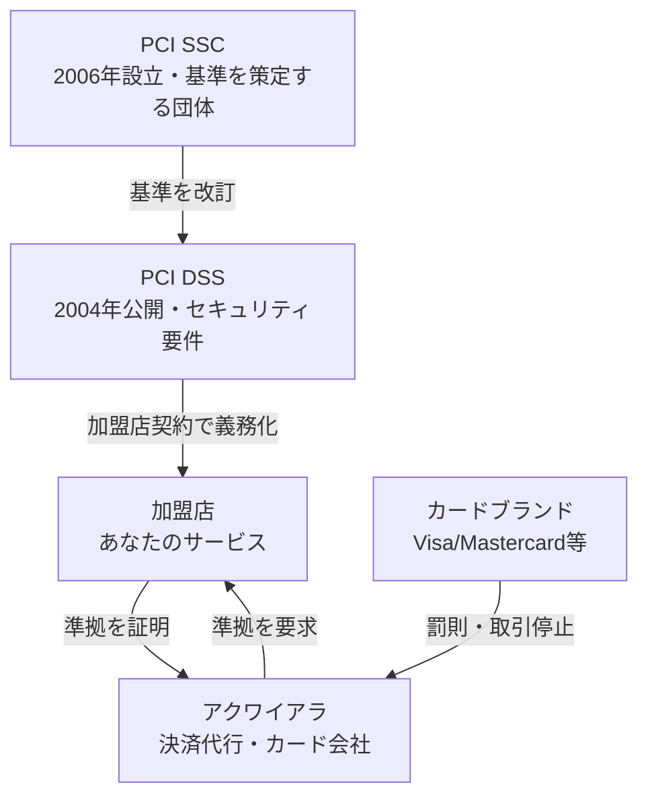
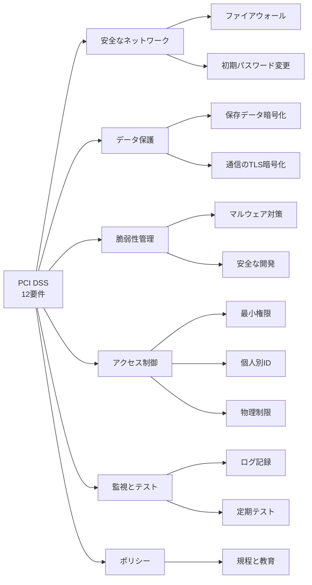
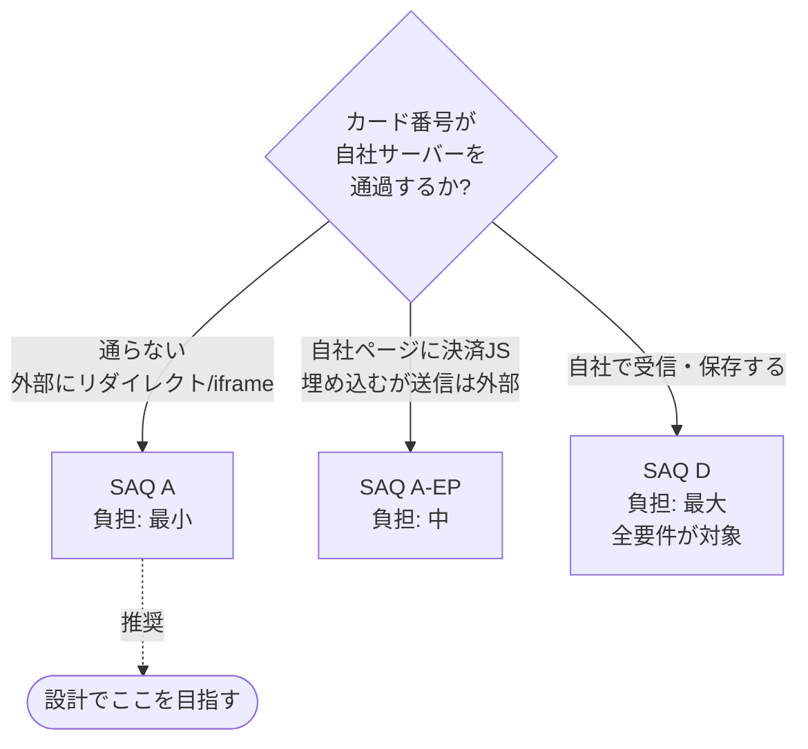
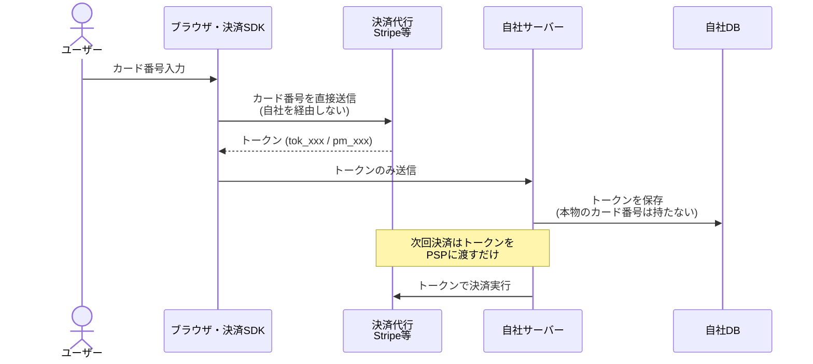

# PCI DSS（Payment Card Industry Data Security Standard / 決済カード業界データセキュリティ基準）

> **一言で言うと:** PCI DSS は、クレジットカード情報を「保存・処理・送信」する全ての事業者が守るべき、業界が定めた強制力のあるセキュリティ基準。技術標準であると同時に「自社がカード情報にどれだけ触れるか」で準拠の負担が決まる契約上の義務であり、エンジニアの最良の戦略は**カード情報に一切触れない設計（スコープの最小化）**にある。

## なぜ「業界基準」が必要だったのか

PCI DSS を理解する鍵は、これが**法律ではなく、カードブランドが作った民間の契約上のルール**だという点にある。

2000年代初頭、オンライン決済の普及とともにカード情報の大規模漏洩が相次いだ。問題は、カード番号を扱う事業者ごとにセキュリティ水準がバラバラで、Visa・Mastercard など各ブランドが独自の基準を押し付けていたため、加盟店は複数の基準に重複対応する必要があったことだ。

そこで**2004年12月**、主要5ブランド（Visa, Mastercard, American Express, JCB, Discover）が各社バラバラだったプログラムを統合し、**PCI DSS v1.0** として一本化した。さらに**2006年**、この基準を継続的に策定・改訂していく母体として、5ブランド共同で **PCI SSC（PCI Security Standards Council）** を設立した。以後、基準の改訂は PCI SSC が担っている。

> 「2004年に基準が公開され、2006年にそれを運営する評議会ができた」という順序がポイント。基準（PCI DSS）の誕生が先で、運営団体（PCI SSC）の設立は2年後である。



> [!info] 用語ミニ辞典
> - **カードブランド（card brand）**: Visa, Mastercard など、カード決済ネットワークを運営する企業。
> - **アクワイアラ（acquirer / 加盟店契約会社）**: 加盟店とカードブランドの間に立ち、決済処理を取り次ぐ事業者。日本では「決済代行会社」がこの役割の一部を担うことが多い。
> - **加盟店（merchant）**: カード決済を受け付ける事業者。EC サイトを運営するあなたの会社もこれに該当する。

**法律ではないのに無視できない理由:** PCI DSS への準拠は、加盟店がアクワイアラと結ぶ契約に組み込まれている。違反して情報漏洩を起こすと、ブランドからアクワイアラ経由で**多額の制裁金（数百万〜数億円規模）**が科され、最悪の場合**カード決済の取扱い自体を停止**される。決済できなくなる EC 事業者は事実上廃業に近いため、強制力は法律に劣らない。

## 守るべきは「カード会員データ」— スコープの考え方

PCI DSS の全要件は「カード会員データ（cardholder data）に触れる範囲」にのみ適用される。この**範囲（スコープ, scope）**をいかに小さくするかが、実務上の最大の論点になる。

カードに関わるデータは2種類に分類され、扱いのルールが大きく異なる。

| 分類 | 含まれるデータ | 保存の可否 |
|------|---------------|-----------|
| **カード会員データ（CHD: Cardholder Data）** | PAN（カード番号）、カード会員名、有効期限、サービスコード | PAN は**暗号化等の保護をすれば保存可**。ただし保存は最小限にすべき |
| **機密認証データ（SAD: Sensitive Authentication Data）** | CVV/CVC（セキュリティコード）、磁気ストライプ全データ、PIN | **オーソリ（承認）後は保存禁止**。暗号化しても保存してはいけない |

> [!info] 用語ミニ辞典
> - **PAN（Primary Account Number）**: カード券面に印字された13〜19桁（一般的には16桁）の主要カード番号。PCI DSS が最も厳重に守る対象。
> - **CVV/CVC（Card Verification Value / Code）**: カード裏面（AMEX は表面）の3〜4桁のコード。「カードを物理的に持っている」ことの証明に使う。**決済処理が終わったら一切残してはならない**のが鉄則。
> - **オーソリ（authorization / 与信）**: 決済時にカード会社へ「この金額を使えるか」を問い合わせ、利用枠を確保する処理。

**最も多い実装ミス:** CVV をログやデータベースに保存してしまうこと。「再決済に便利だから」とつい保存したくなるが、これは PCI DSS の最も重い違反の一つ。決済が終わったら CVV は破棄しなければならない（そもそも保存しても次回決済には使えない設計になっている）。

PAN を画面表示・ログ出力する際は、**マスキング（masking）** が必須。表示してよいのは原則「最初の6桁（または8桁）＋末尾4桁」だけで、中間は伏せる。

```
4242 42** **** 4242   ← 表示してよい形
```

さらに、保存する PAN は暗号化に加えて **トークン化（tokenization）** で置き換えるのが現代的な定石（後述）。

## 12 の要件 — 6 つのゴール

PCI DSS は12個の要件にまとまっており、それらは6つの大目標にグループ化されている。細部を暗記する必要はないが、「どんな観点で守れと言っているか」を俯瞰しておくと、設計レビューで抜けに気づける。

| ゴール | 要件（要約） | エンジニアが関わる主な実装 |
|--------|-------------|--------------------------|
| **1. 安全なネットワークの構築** | 1. ファイアウォール設置<br>2. ベンダ初期パスワードの変更 | セキュリティグループ、初期認証情報の排除（[[最小権限の原則]]） |
| **2. カード会員データの保護** | 3. 保存データの保護（暗号化）<br>4. 通信の暗号化 | DB 暗号化、[[HTTPとHTTPSの違い\|TLS/HTTPS]]、トークン化 |
| **3. 脆弱性管理** | 5. マルウェア対策<br>6. 安全なシステムとアプリの開発 | 依存パッケージ更新（[[サプライチェーンセキュリティ]]）、[[SQLインジェクション]]/[[XSS]]対策 |
| **4. アクセス制御** | 7. 業務上の必要性に基づくアクセス制限<br>8. 利用者ごとの ID 付与<br>9. 物理アクセスの制限 | RBAC、個人別アカウント、MFA |
| **5. 監視とテスト** | 10. アクセスのログ記録と監視<br>11. 定期的なセキュリティテスト | 監査ログ、脆弱性スキャン、ペネトレーションテスト |
| **6. 情報セキュリティポリシー** | 12. ポリシーの維持 | 規程の整備・教育（組織的対応） |



要件3・4・6・10 が特にアプリケーションエンジニアの仕事に直結する。本教材の他トピックがそのまま PCI DSS の要件を満たすための手段になっている点に注目したい。

## SAQ — 準拠の証明レベルは「自社がどう決済するか」で決まる

PCI DSS の準拠を証明する方法は、事業者の規模と決済方式によって変わる。年間取引件数が膨大な大手は外部審査機関（QSA）による訪問審査が必要だが、多くの EC 事業者は **SAQ（Self-Assessment Questionnaire / 自己問診）** という自己申告のチェックリストで済む。

そして重要なのは、**SAQ には複数のタイプがあり、自社サーバーがカード情報にどれだけ触れるかでタイプ（=答えるべき質問数と負担）が激変する**こと。

| SAQ タイプ | 決済方式 | カード情報が自社サーバーを通るか | 負担 |
|-----------|---------|-------------------------------|------|
| **SAQ A** | 決済を完全に外部委託（リダイレクト / iframe 埋め込み） | **通らない** | 最小（設問が最も少ない） |
| **SAQ A-EP** | 自社ページに決済 JS を読み込むが、入力は外部送信 | 通らないが自社ページが関与 | 中 |
| **SAQ D** | 自社サーバーでカード番号を受け取る / 保存する | **通る** | 最大（全要件が対象） |



**これが「PCI DSS のためにカード情報に触れない設計をする」という戦略の核心。** [[StripeによるSaaS決済実装|Stripe]] の Hosted Checkout や Payment Element（iframe 経由）を使えば、カード番号がブラウザから直接 Stripe に送られ、自社サーバーには一切到達しない。結果として最も軽い **SAQ A** で済み、満たすべき要件が数十問のチェックに圧縮される。

逆に「自前の決済フォームでカード番号を受け取り、自社 API に POST する」設計を選ぶと、一気に **SAQ D** に落ちる。全12要件・数百項目の監査対象となり、暗号化されたカード DB の管理、定期的な脆弱性スキャン、ログ監視体制まで自前で背負うことになる。スタートアップにとっては事実上非現実的なコストだ。

> シニアの判断ポイント: 「決済機能を作る」という要件が来たとき、まず問うべきは「どう実装するか」ではなく「**どうすればカード情報を自社で持たずに済むか**」。これは技術選定であると同時に、年間の監査コストとインシデント時の賠償リスクを左右する経営判断でもある。

## トークン化 — カード番号を「持たない」ための技術

カード情報を自社で扱わざるを得ない、あるいは「リピート購入のために決済手段を保存したい」場合に使うのが **トークン化（tokenization）** だ。

仕組みはシンプルで、カード番号そのものの代わりに、決済代行会社が発行した**無意味な代替文字列（トークン）**を自社 DB に保存する。トークンは決済代行会社の金庫（Vault）の中でのみ本物のカード番号と紐づいており、漏洩しても単体では決済に使えない。



**暗号化との違い:** 暗号化（encryption）は鍵があれば元のカード番号に復号できる——つまり鍵が漏れれば終わり。トークン化は自社側に元データへの復元手段が**そもそも存在しない**ため、漏洩耐性が一段高い。PCI DSS のスコープから自社 DB を外す効果があるのが大きい。

### コード例: トークンを使った決済（カード番号を持たない）

決済代行のフロントエンド SDK がブラウザ内でカード番号を直接 PSP に送り、トークンだけが自社サーバーに渡る。以下はそのトークンを受け取って決済するサーバー側の最小例。

**TypeScript（Node.js / Stripe）:**

```typescript
import Stripe from 'stripe';
const stripe = new Stripe(process.env.STRIPE_SECRET_KEY!);

// クライアントから届くのは payment method トークンのみ。
// カード番号・CVV はこのサーバーに一度も到達しない（= PCI スコープ外）。
app.post('/api/charge', async (req, res) => {
  const { paymentMethodId, customerId } = req.body; // 例: "pm_1xxx"

  const intent = await stripe.paymentIntents.create({
    amount: 2980,                 // ¥2,980（JPY はゼロデシマル通貨）
    currency: 'jpy',
    customer: customerId,
    payment_method: paymentMethodId,
    confirm: true,                // 即時に与信・決済を確定
  });

  // 自社DBにはトークン(customerId)だけ保存。生のカード番号は一切扱わない。
  res.json({ status: intent.status });
});
```

**Python（Flask / Stripe）:**

```python
import os
import stripe
from flask import Flask, request, jsonify

stripe.api_key = os.environ["STRIPE_SECRET_KEY"]
app = Flask(__name__)

@app.post("/api/charge")
def charge():
    data = request.get_json()
    # 受け取るのはトークンのみ。カード番号・CVV はサーバーに来ない。
    intent = stripe.PaymentIntent.create(
        amount=2980,              # ¥2,980
        currency="jpy",
        customer=data["customerId"],
        payment_method=data["paymentMethodId"],  # 例: "pm_1xxx"
        confirm=True,
    )
    return jsonify(status=intent.status)
```

どちらの例でも、リクエストボディに **PAN も CVV も登場しない**点が肝心。これが「触れない設計」の具体形であり、SAQ A で済ませられる根拠になる。

## よくある落とし穴

### 1. CVV（セキュリティコード）を保存してしまう
「定期課金で毎月使うから」と CVV を DB やログに残すのは最も重い違反の一つ。CVV はオーソリ後の保存が暗号化の有無を問わず禁止されている。定期課金は CVV ではなく**トークン（カード登録）**で実現する。

### 2. ログにカード番号が漏れる
リクエストボディをまるごとログ出力するミドルウェアが、デバッグ時にうっかり PAN を記録してしまう典型例。決済関連エンドポイントはログのフィールドマスキングを必須にする。AI 生成コードはこの種の「全ボディをロギング」を平気で書くので要注意。

### 3. 「Stripe を使えば PCI 対応は不要」という誤解
Stripe 等を使ってもゼロにはならない。**SAQ A の自己問診の提出は依然として必要**で、HTTPS の徹底・決済 SDK を改ざんさせない（読み込むスクリプトの完全性管理）・アクセス管理などの責任は残る。「負担が最小になる」のであって「消える」のではない。

### 4. 自前フォームで受けて Stripe に中継する（SAQ D 転落）
「カード番号は自社 API で受けてから Stripe に渡せばシンプル」という発想は、自社サーバーをカード情報の通り道にしてしまい SAQ A → SAQ D へ転落させる最悪手。必ずブラウザから PSP へ直接送る（リダイレクトか iframe / SDK）。

### 5. PCI DSS と個人情報保護法／GDPR を混同する
PCI DSS は**カード情報に特化**した業界基準で、氏名・住所などの一般的な個人情報全般を守る法律（日本の個人情報保護法、EU の GDPR）とは別物。両方が同時に適用される場面が多く、片方を満たせばもう片方も満たせるわけではない。

### 6. バージョンの世代を意識しない
PCI DSS は改訂され続けており、現行は **v4.0.1**（v3.2.1 からの移行は2024年3月末で完了済み）。新要件（多要素認証の拡大、決済ページのスクリプト改ざん検知など）が段階的に必須化されている。「昔こうだった」で止めず、契約先のアクワイアラが要求する版を確認する。

## AI 実装のアンチパターン

| アンチパターン | なぜ問題か | 対策 |
|---|---|---|
| 自前の決済フォームを実装し、カード番号を `POST /api/payment` で受け取る | 自社サーバーがカード情報の経路になり PCI スコープが SAQ A → SAQ D に激増 | 決済 SDK / Hosted Checkout でブラウザから PSP へ直接送らせる |
| 再決済のために CVV を DB カラムに保存する | オーソリ後の CVV 保存は重大違反。そもそも保存しても再利用できない | 定期課金はトークン化で実装し、CVV は破棄する |
| デバッグのためリクエストボディ全体をログ出力する | PAN/CVV がログに平文で残り、ログ閲覧者全員がスコープ内になる | 決済系は機密フィールドをマスクしてからログする |
| カード番号を「AES で暗号化したから安全」と DB 保存する | 暗号化は鍵漏洩リスクが残り、スコープ外にはならない | トークン化して元データを自社から消す |
| 「Stripe 利用＝PCI 完全準拠」とコメントして対応を打ち切る | SAQ A 提出・HTTPS・スクリプト完全性管理の責任が残る | 残存責任を洗い出し、SAQ A のチェックリストを完了する |

→ [[_anti-patterns/_index|AIアンチパターン索引]]

## 関連トピック

- [[StripeによるSaaS決済実装]] — PCI スコープを SAQ A に抑える具体的な実装。本ドキュメントの「触れない設計」の実例
- [[最小権限の原則]] — 要件7・8（アクセス制御）の中核となる考え方
- [[HTTPとHTTPSの違い]] — 要件4（通信の暗号化）。決済ページの TLS は必須
- [[サプライチェーンセキュリティ]] — 要件6および v4.0 の決済ページスクリプト改ざん検知に直結
- [[SQLインジェクション]] / [[XSS]] — 要件6「安全な開発」が防ぐべき代表的な脆弱性
- [[暗号アルゴリズム]] — 要件3（保存データ保護）で使う暗号化・ハッシュの基礎

## 参考リソース

- PCI Security Standards Council 公式サイト — PCI DSS v4.0.1 本文および SAQ 各タイプの様式
- PCI SSC「Prioritized Approach」 — 12要件をリスクの高い順に段階導入するためのガイド
- 各カードブランドのセキュリティガイドライン（日本では JCB / 経産省「クレジットカード・セキュリティガイドライン」）
- [[StripeによるSaaS決済実装]] の「PCI コンプライアンス」節 — 実装側からの最短ルート

## 学習メモ

- PCI DSS の本質は「技術要件の暗記」ではなく「スコープ設計」。設計段階で自社をカード情報の経路から外せるかどうかが、その後の運用コストとリスクの大半を決める
- 「触れない・持たない・残さない」が決済セキュリティの合言葉。トークン化はこの思想を技術で体現したもの
- 12要件の多くは本教材の他トピック（最小権限・TLS・SQLi/XSS 対策・監査ログ）の集合体。PCI DSS は「良いセキュリティ実践のチェックリスト」として読むと腹落ちしやすい
