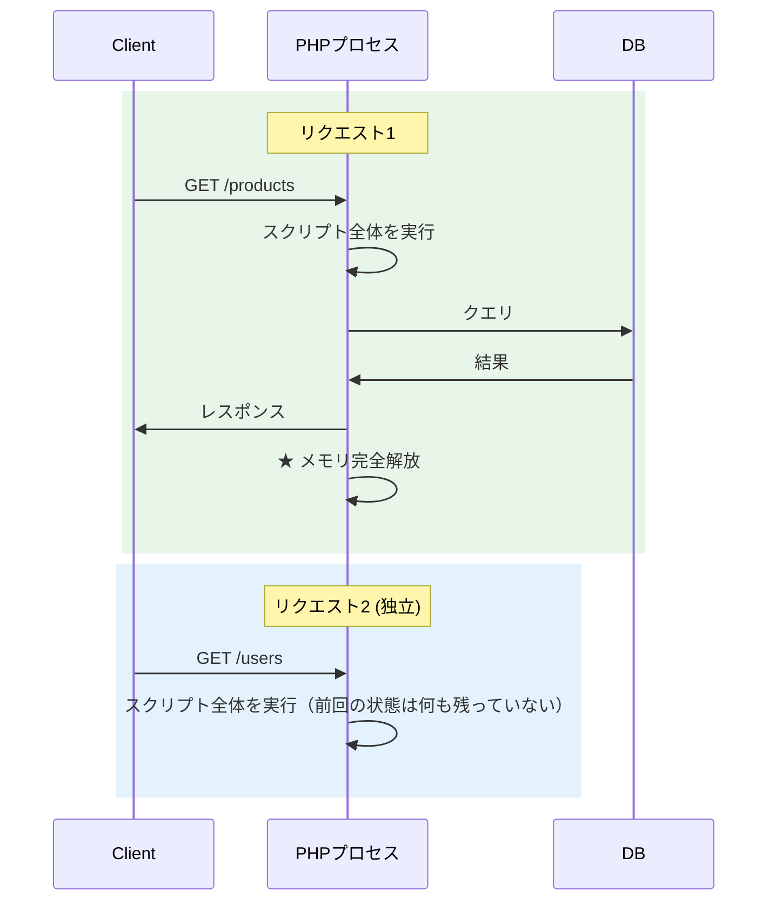

# PHP（PHP: Hypertext Preprocessor）

> **一言で言うと:** PHP は1993〜1994年に **Rasmus Lerdorf** が個人サイト（Personal Home Page）のフォーム処理用 CGI スクリプトとして書き始め、**1995年6月8日に PHP Tools 1.0 として公開**された、**Web専用に進化した稀有な言語**。**Share-nothing アーキテクチャ**（リクエスト終了で全状態リセット）と **HTML への直接埋め込み構文** が、低レイヤーを意識せずに動的 Web を作れるようにし、WordPress を生んだ。長らく「使い捨て言語」「悪い書き方が蔓延」と批判されてきたが、**PHP 7（2015）で性能が2倍**、**PHP 8（2020）以降は JIT・型宣言・enum・match・property hooks**（8.4, 2024）など現代的な機能が次々追加され、**事実上の別言語に進化**した。それでも依然として**Webの約75%（W3Techs 2026年時点）がPHPで動く**現実。

## 誕生と歴史的経緯

| 年月 | 主な転換点 |
|---|---|
| 1993-1994 | Rasmus Lerdorf が個人サイト用に C で CGI スクリプト集を開発 |
| 1995-06-08 | PHP Tools 1.0 公開（comp.infosystems.www.authoring.cgi） |
| 1996 | PHP/FI 統合（Forms Interpreter / HTML 埋め込み構文） |
| 1997 | Andi Gutmans / Zeev Suraski がパーサーを書き直し（PHP 3） |
| 2000 | PHP 4 / Zend Engine 登場 |
| 2004 | PHP 5 / Zend Engine 2 で OOP 本格対応 |
| 2010 | Composer 登場（依存管理）、2011 年 Laravel 1.0 |
| 2015 | PHP 7 で性能2倍、スカラー型宣言 |
| 2020 | PHP 8.0 / JIT / 名前付き引数 / attribute / match / union 型 |
| 2021 | PHP 8.1 / enum / readonly / Fiber / never 型 |
| 2022 | PHP 8.2 / readonly class / DNF 型 |
| 2023 | PHP 8.3 / typed class constants |
| 2024-11 | PHP 8.4 / property hooks / asymmetric visibility、新 JIT（IR Framework） |
| **2025-11** | **PHP 8.5 / pipe operator（\|>）/ clone with** |

### 設計者と動機

設計者の **Rasmus Lerdorf**（デンマーク系カナダ人エンジニア）は、自分の履歴書を Web 上に置くために、**1993〜1994年**に C で CGI スクリプトを書き始めた。これを **1995年6月8日に「PHP Tools 1.0」として公開**（comp.infosystems.www.authoring.cgi にて）、その後「Forms Interpreter（FI）」として書き直し、**1996年に両者を統合した「PHP/FI」** が登場した。

Lerdorf 自身が後に語っている重要な事実:

> **「私は言語を作ろうとしたわけではない。問題を解決しようとしたら、いつの間にか言語ができていた」**

つまり PHP は**最初から言語として設計された [[Python]] や [[Ruby]] とは出自が決定的に違う**。最初は「HTMLに動的処理を埋め込む道具」であり、後付けで言語仕様が整備された。これが PHP が長らく「美しくない」と批判される根本原因であり、同時に「Web に最適化されている」と評価される理由でもある。

### PHP 5 → PHP 7 の停滞期

PHP 5 が2004年にリリースされた後、PHP 6 の開発が始まったが、**Unicode 対応に挫折**して2010年に放棄された。コミュニティは長らく PHP 5.x を引きずり、「PHP は終わった」と言われた時期が続いた。

この停滞中に **HHVM**（Facebook 製の PHP 実装、JIT 搭載）が登場し性能で PHP を圧倒。**PHP コミュニティが危機感を持ち、PHP 7（2015）で根本的な性能改善**を行った。これが現代 PHP の出発点。

### バージョン進化の山場（PHP 7 以降）

| バージョン | 年 | 主な貢献 |
|---|---|---|
| 7.0 | 2015-12 | **性能2倍**（メモリ使用量も半減）、スカラー型宣言、戻り値型 |
| 7.1 | 2016 | nullable型 (`?int`)、void 戻り値型 |
| 7.4 | 2019 | 型付きプロパティ、アロー関数、null合体代入 (`??=`) |
| 8.0 | 2020-11 | **JIT**、union型、名前付き引数、コンストラクタプロモーション、`match`、attribute |
| 8.1 | 2021-11 | **enum**、readonly プロパティ、**Fiber**、never型、純粋交差型 |
| 8.2 | 2022-12 | readonly class、DNF型、`null`/`false`/`true` 単独型 |
| 8.3 | 2023-11 | typed class constants、`json_validate`、`Override` attribute |
| 8.4 | 2024-11 | **Property Hooks**、**Asymmetric Visibility**、Lazy Objects、新JIT |
| **8.5** | **2025-11** | **Pipe Operator (\|>)**、Clone with、static asymmetric visibility |

PHP 8.x の追加機能リストは、もはや別言語と呼べるほど膨大。**「PHPは古臭い」イメージは PHP 5 時代の知識で止まっている**ケースが多い。

## 設計思想

### 1. Web 専用設計 — Share-Nothing Architecture

PHP の最大の設計判断は**Share-Nothing**:



**リクエストごとにメモリが完全にリセットされる**ため:

| メリット | デメリット |
|---------|----------|
| 状態同期問題が原理的に発生しない | ウォームアップキャッシュが効かない |
| メモリリークがプロセス全体を壊さない | 起動コストが毎回かかる |
| 並行性の難しさを意識しなくて良い | アプリ内キャッシュが使えない |
| デプロイがシンプル（コードを置くだけ） | 永続接続を持てない |

これは [[Node.js]] / [[Go]] / [[Ruby]]（Rails）の**永続プロセス + イベントループ/スレッド**モデルとは対照的。**「PHPは並行性で勝負しない、リクエスト独立で勝負する」**。

OPcache（バイトコードキャッシュ）と JIT（PHP 8+）の組み合わせで、起動コストの問題は実用上ほぼ解消されている。

### 2. HTML 埋め込み構文

PHP は最初から **HTML テンプレート言語**として設計された:

```php
<!DOCTYPE html>
<html>
<body>
    <h1>商品一覧</h1>
    <ul>
        <?php foreach ($products as $product): ?>
            <li><?= htmlspecialchars($product->name) ?> - <?= $product->price ?>円</li>
        <?php endforeach; ?>
    </ul>
</body>
</html>
```

`<?= ?>` の短縮構文や `endforeach` などの代替構文は、**HTML 中に PHP を埋め込む用途を最適化したもの**。他言語では別途テンプレートエンジン（[[JavaScript]] の EJS、[[Python]] の Jinja2、[[Ruby]] の ERB）が必要だが、PHP はそれ自体がテンプレートエンジン。

ただし**現代の PHP プロジェクトはこの書き方をしない**。Laravel では Blade、Symfony では Twig という独立したテンプレートエンジンを使い、ロジックとビューを明確に分離する。

### 3. 「実用優先」哲学

PHP は他言語と比べて**ベストプラクティス論争を避け、まず動くこと**を優先してきた。これは批判の対象でもあり、強みでもある:

- **批判**: グローバル関数の命名が一貫しない（`strlen` vs `str_replace`、`array_map` の引数順 vs `array_filter` の引数順 etc）
- **強み**: 初心者が書いたコードでも本番で動く、学習コストが低い

PSR（PHP Standard Recommendations）標準の登場（2009〜）で、コミュニティとして規約整備が進んだ。

## 型システム — 動的型から段階的型付けへ

PHP は伝統的に**動的型 + 弱い型変換**だったが、PHP 7+ で**段階的型付け**（Gradual typing）が大幅に強化された。

### 型宣言の進化

```php
// PHP 5 — 型なし
function add($a, $b) {
    return $a + $b;
}

// PHP 7 — スカラー型
function add(int $a, int $b): int {
    return $a + $b;
}

// PHP 8 — Union型
function process(int|string $value): bool { /* ... */ }

// PHP 8 — 名前付き引数 + コンストラクタプロモーション
class User {
    public function __construct(
        public readonly int $id,
        public readonly string $name,
        public readonly string $email = '',
    ) {}
}
$user = new User(id: 1, name: 'Alice');

// PHP 8.1 — enum
enum Status: string {
    case Active = 'active';
    case Inactive = 'inactive';

    public function label(): string {
        return match($this) {
            Status::Active => '有効',
            Status::Inactive => '無効',
        };
    }
}

$status = Status::Active;
echo $status->label(); // "有効"

// PHP 8.4 — Property Hooks
class Temperature {
    public function __construct(public float $celsius) {}

    public float $fahrenheit {
        get => $this->celsius * 9 / 5 + 32;
        set(float $value) => $this->celsius = ($value - 32) * 5 / 9;
    }
}

$t = new Temperature(celsius: 25);
echo $t->fahrenheit; // 77 (getter)
$t->fahrenheit = 100; // setter
echo $t->celsius; // 37.78

// PHP 8.4 — Asymmetric Visibility
class Order {
    public function __construct(
        public private(set) Status $status = Status::Active,
    ) {}

    public function complete(): void {
        $this->status = Status::Inactive; // クラス内部からは set できる
    }
}

$order = new Order();
echo $order->status->value; // 読み取りは public
$order->status = Status::Inactive; // ❌ Error: 外部からは set できない
```

PHP の型宣言は実行時にチェックされる（[[TypeScript]] のような type erasure ではない）:

```php
function add(int $a, int $b): int {
    return $a + $b;
}

add('1', 2); // strict_types=0 なら 3（自動変換）
             // strict_types=1 なら TypeError

// ファイル先頭で declare すると厳格モード
declare(strict_types=1);
add('1', 2); // ❌ TypeError
```

### 静的解析の標準化

- **PHPStan** / **Psalm** が業界標準。レベル0〜9（または最大）まで段階的に厳格化
- IDE 統合（PhpStorm が圧倒的シェア）
- `mixed` 型（PHP 8）で「型を書きたくない」を明示

[[TypeScript]] の Gradual Typing と同じ思想。

## エコシステム

### Composer — 依存管理の革命

```bash
# Composer は Node.js の npm と同じ役割
$ composer init
$ composer require symfony/console
$ composer require --dev phpunit/phpunit

# composer.json
{
    "require": {
        "php": ">=8.3",
        "symfony/console": "^7.0",
        "guzzlehttp/guzzle": "^7.0"
    }
}

# autoload で名前空間ベースの自動読み込み
$ composer dump-autoload
```

Composer 登場（2012）以前の PHP は**世界一悪名高い依存管理**だった（`include` をひたすら手書き）。Composer + Packagist が PHP エコシステムを近代化した。

### 主要フレームワーク

| フレームワーク | 特徴 | 主用途 | シェア |
|--------------|------|--------|--------|
| **Laravel** | フルスタック、Eloquent ORM、Blade、Artisan CLI、優れた DX | 大規模 SaaS / API | **64%**（2025 JetBrains 調査） |
| **Symfony** | コンポーネントベース、エンタープライズ向け、Doctrine ORM | 大規模・複雑なドメイン | 23% |
| **CodeIgniter** | 軽量、学習容易 | レガシー継承 | 低下傾向 |
| **WordPress** | CMS（フレームワークというよりプラットフォーム） | ブログ・コンテンツサイト | **Web 全体の 43.4%** |

Laravel は近年さらに加速。**Inertia.js**（[[TypeScript]]/[[Reactの設計思想とフック|React]]/Vue を SPA 風に統合）や **Livewire**（PHPでリアクティブUI）の登場で、フロント・バックの境界を超えた開発体験が魅力。

### PSR — 標準化の取り組み

| PSR | 内容 |
|-----|------|
| PSR-1, 12 | コーディング規約 |
| PSR-3 | ロガーインターフェース |
| PSR-4 | オートロード（Composer 互換） |
| PSR-7 | HTTP メッセージインターフェース |
| PSR-15 | HTTP ミドルウェア |
| PSR-17 | HTTP ファクトリ |

これらにより**フレームワークの相互運用性**が大幅に向上。Laravel と Symfony の間でコンポーネントを共有できるようになった。

### WordPress の現実

Web全体の **43.4%** で動く WordPress は、**現代の PHP コードベースとは別物**:

- PHP 5 時代のレガシー API がまだ多い
- グローバル関数中心、OOP の活用が控えめ
- カスタマイズ性は圧倒的だが、セキュリティ脆弱性も多い

**「PHP を書く ≒ Laravel/Symfony を書く」**のがモダン PHP 開発であり、WordPress カスタマイズとは技術スタックが大きく違う。

## 代表的なイディオム

### コンストラクタプロモーション + readonly + enum

```php
declare(strict_types=1);

namespace App\Domain;

enum OrderStatus: string {
    case Pending = 'pending';
    case Confirmed = 'confirmed';
    case Shipped = 'shipped';
    case Delivered = 'delivered';
    case Cancelled = 'cancelled';
}

final readonly class Order {
    public function __construct(
        public int $id,
        public int $userId,
        public OrderStatus $status,
        public DateTimeImmutable $createdAt,
        /** @var array<int, OrderItem> */
        public array $items,
    ) {}

    public function totalAmount(): int {
        return array_sum(array_map(
            fn(OrderItem $item) => $item->price * $item->quantity,
            $this->items
        ));
    }

    public function withStatus(OrderStatus $status): self {
        return new self(
            id: $this->id,
            userId: $this->userId,
            status: $status,
            createdAt: $this->createdAt,
            items: $this->items,
        );
    }
}
```

PHP 8.2+ の `readonly class` は、Java の record や [[Rust]] の immutable struct と同じ役割。値オブジェクトの実装が劇的にシンプルになった。

### Match 式 + パターンマッチ

```php
// PHP 8 の match — switch より厳密
$result = match($status) {
    OrderStatus::Pending, OrderStatus::Confirmed => '処理中',
    OrderStatus::Shipped => '配送中',
    OrderStatus::Delivered => '完了',
    OrderStatus::Cancelled => 'キャンセル',
};

// PHP 8.5 の Pipe Operator — 関数の合成
$result = $input
    |> trim(...)
    |> strtolower(...)
    |> fn($s) => str_replace(' ', '-', $s)
    |> 'urlencode';
// trim → strtolower → 置換 → urlencode の順で実行
```

### Attributes（PHP 8+）

```php
use Symfony\Component\Routing\Attribute\Route;
use Symfony\Component\Validator\Constraints as Assert;

class UserController {
    #[Route('/users/{id}', methods: ['GET'])]
    public function show(int $id): Response {
        // ...
    }
}

class CreateUserRequest {
    public function __construct(
        #[Assert\NotBlank]
        #[Assert\Length(max: 100)]
        public string $name,

        #[Assert\Email]
        public string $email,
    ) {}
}
```

[[TypeScript]] のデコレータや [[Python]] のデコレータと同等だが、**メタデータとして取り出して別途処理する**設計（コードの実行に直接影響しない）。

### Fiber（PHP 8.1+）— 軽量並行性

```php
$fiber = new Fiber(function (): void {
    $value = Fiber::suspend('first');
    echo "再開: $value\n";
});

$result = $fiber->start();
echo "Fiber から: $result\n";  // "first"

$fiber->resume('second');
// "再開: second"
```

ReactPHP / Amp / Swoole などの非同期フレームワークが Fiber を使って [[Node.js]] のような書き味を実現している。**Laravel Octane** が代表例で、永続プロセス + Fiber で性能を10倍以上に。

## よくある落とし穴

### 1. `==` vs `===`（弱い型変換）

```php
0 == 'abc'      // PHP 7: true / PHP 8+: false（修正された！）
0 == ''         // PHP 7: true / PHP 8+: false
'1' == '01'     // true
'10' == '1e1'   // true（科学記法として比較）
100 == '100abc' // PHP 7: true / PHP 8+: false（警告）

// === は型と値の厳密比較（推奨）
0 === '0'  // false
```

**PHP 8 で多くの暗黙変換が修正された**が、レガシーコードには残っているので注意。**常に `===` を使う**のが鉄則。

### 2. 配列が「順序付き連想配列」

PHP の配列は**hash map と配列の融合**:

```php
// 数値インデックス
$nums = [1, 2, 3];
$nums[0]; // 1

// 文字列キー（連想配列）
$assoc = ['name' => 'Alice', 'age' => 30];

// 混在も可
$mixed = [0 => 'first', 'key' => 'value', 1 => 'second'];

// 順序が保持される（挿入順）
foreach ($mixed as $k => $v) {
    // 0 => 'first', 'key' => 'value', 1 => 'second'
}
```

これが便利な場面と困る場面がある:

```php
// ❌ 数値配列のつもりで穴が開いた
$arr = [1, 2, 3];
unset($arr[1]);
$arr = [0 => 1, 2 => 3];  // インデックスが飛ぶ！

// JSON エンコード結果も変わる
json_encode([1, 2, 3]);     // "[1,2,3]"
json_encode([0 => 1, 2 => 3]); // "{"0":1,"2":3}" — オブジェクトとして扱われる

// ✅ 配列を再インデックス
$arr = array_values($arr);
```

### 3. `$this` と `self` の違い

```php
class Animal {
    public static function create(): static {
        return new static(); // 呼び出し元のクラス（後期静的束縛）
    }

    public static function createSelf(): self {
        return new self(); // 必ず Animal
    }
}

class Dog extends Animal {}

$d = Dog::create();      // Dog インスタンス
$d2 = Dog::createSelf(); // Animal インスタンス（直感に反する）
```

`self` は**定義されたクラス**、`static` は**呼び出し元のクラス**（後期静的束縛、Late Static Binding）。多くのフレームワークでは `static` を使う。

### 4. `array_map` と `array_filter` の引数順が違う

```php
// array_map: callable が先
array_map(fn($x) => $x * 2, [1, 2, 3]);

// array_filter: array が先
array_filter([1, 2, 3], fn($x) => $x > 1);

// array_reduce: array, callable, initial
array_reduce([1, 2, 3], fn($carry, $x) => $carry + $x, 0);
```

**標準関数の API 一貫性のなさ**は PHP の悪名高い欠陥。歴史的経緯（C 関数のラッパーが多数）で固まった。`Collection` ライブラリ（Laravel）や `iterator` 関数群で改善できる。

### 5. ファイル先頭の `<?php` 後の空白

```php
<?php
// ファイル末尾の空白文字（改行・スペース）が出力される
?>
```

クラス定義のみのファイルでは**閉じタグ `?>` を書かない**のが推奨。空白が "headers already sent" エラーの原因になる。

### 6. レガシー関数の地雷原

```php
// ❌ PHP 5 時代の関数（PHP 7 で削除済み）
mysql_query("SELECT * FROM users");  // SQL インジェクションの温床

// ✅ PDO（PHP 5.1〜、現代の標準）
$stmt = $pdo->prepare("SELECT * FROM users WHERE id = ?");
$stmt->execute([$id]);

// ✅ または mysqli（手続き型 or オブジェクト型）
$stmt = $mysqli->prepare("SELECT * FROM users WHERE id = ?");
$stmt->bind_param('i', $id);
$stmt->execute();
```

[[SQLインジェクションとXSS]] と関連。古い PHP チュートリアルをそのままコピーすると脆弱になる。

### 7. グローバル変数とスーパーグローバル

```php
$_GET['id']     // クエリ文字列
$_POST['name']  // POST データ
$_SESSION       // セッション
$_COOKIE        // Cookie
$_SERVER        // サーバー情報
$_FILES         // アップロードファイル
$_ENV           // 環境変数

// ❌ 直接使うと検証漏れの原因
$id = $_GET['id'];

// ✅ filter_input でバリデーション + サニタイズ
$id = filter_input(INPUT_GET, 'id', FILTER_VALIDATE_INT);

// ✅✅ Laravel/Symfony の Request オブジェクト（型安全）
$id = $request->getInt('id');
```

### 8. `null` 合体演算子の落とし穴

```php
$user['name'] ?? 'unknown'  // キーが存在しないか null なら 'unknown'

// 注意: false や 0 は ?? では置換されない
$count = 0 ?? 10;  // 0（?: なら 10）

// PHP 8 の null safe operator
$country = $user?->address?->country;  // 途中が null なら null
```

## AIによる実装のアンチパターン

| アンチパターン | なぜ問題か | 対策 |
|---|---|---|
| `mysql_*` 関数を生成 | PHP 7 で削除済み、SQL インジェクションの温床 | PDO または `mysqli` の prepared statement |
| `==` を使う | 弱い型変換でバグ | 常に `===` を使う、`declare(strict_types=1)` |
| Composer を使わずに `require` で手動 include | 名前空間衝突、依存解決不可能 | Composer + PSR-4 オートロード |
| `register_globals` の前提 | PHP 5.4 で削除済み | スーパーグローバル `$_GET` / `$_POST` を直接 |
| グローバル関数で書く | テスト困難、依存追跡不可 | クラス + 依存性注入（Symfony Container や Laravel Container） |
| 型宣言を書かない | 静的解析が効かない、IDE 補完弱い | スカラー型・戻り値型・プロパティ型を明示、PHPStan/Psalm |
| `array` を構造化データとして使う | 型安全性なし、IDE 補完なし | DTO クラス（readonly + コンストラクタプロモーション） |
| `eval` / `${$var}` 動的コード | セキュリティリスク、最適化阻害 | 設計を見直して避ける |
| HTML 内に PHP を埋め込んだ巨大ビュー | ロジックとビューが混在、テスト不可能 | Blade（Laravel）や Twig（Symfony）テンプレートエンジン |
| `include`/`require` で動的ロジック | 名前空間と読みづらさ | クラスのオートロードに任せる |
| `print_r` / `var_dump` でデバッグ | 本番に残ると情報漏洩 | `Symfony VarDumper` や Xdebug、ログに出力 |

## 関連トピック

- [[プログラミング言語の系譜と選択]] — 親トピック
- [[JavaScript]] — Web専用言語の比較対象
- [[Ruby]] — Rails と Laravel の対比
- [[Python]] — Web フレームワーク（Django/FastAPI）の対比
- [[SQLインジェクションとXSS]] — PHP のレガシー関数とセキュリティ
- [[セッションとJWT]] — PHP の `$_SESSION` モデル
- [[認証と認可]] — Laravel の Auth システム
- [[StripeによるSaaS決済実装]] — Laravel 等での実装例

## 参考リソース

- [PHP 公式ドキュメント](https://www.php.net/manual/ja/)
- [PHP 8.4 リリース告知](https://www.php.net/releases/8.4/en.php)
- [PHP The Right Way](https://phptherightway.com/) — 現代的 PHP の入門書（日本語版あり）
- [PSR 標準](https://www.php-fig.org/psr/) — PHP-FIG が定める標準仕様
- [Laravel 公式ドキュメント](https://laravel.com/docs)
- [Symfony 公式ドキュメント](https://symfony.com/doc/current/index.html)
- [JetBrains State of PHP 2025](https://blog.jetbrains.com/phpstorm/2025/10/state-of-php-2025/) — 最新の PHP エコシステム実態調査
- 書籍:『モダン PHP 入門』(Joshua Lockhart) — PHP The Right Way の書籍版
- 書籍:『Modern PHP』(Joshua Lockhart, O'Reilly) — モダン PHP の網羅
- [stitcher.io](https://stitcher.io/) — Brent Roose による PHP ブログ、新機能解説の決定版

## 学習メモ

- 「PHP は古臭い」という評価は **PHP 5 時代の知識で止まっている**ケースがほとんど。PHP 8.4 + Laravel 11 + PHPStan の組み合わせは、[[TypeScript]] や [[Python]]（FastAPI）に劣らない現代的な開発体験
- **Web の約75%（W3Techs 2026 時点）で動く**という現実は無視できない。新規プロジェクトで選ぶかは別として、レガシーアプリの保守・改修・移行案件は今後10年以上発生し続ける
- **WordPress と Laravel/Symfony は同じ言語で書かれた別世界**。WordPress プラグイン開発と Laravel エンタープライズ開発は、求められるスキルが大きく違う
- **Share-Nothing アーキテクチャ**は永続プロセス時代になっても根深い影響を残している。Laravel Octane（永続プロセス）で動かすと、Share-Nothing 前提のコード（グローバル状態を毎回初期化）がバグの原因になる
- AI コード生成が苦手とする領域: 「**バージョンに応じた書き方**」（PHP 5 と PHP 8 で別言語並みに違う）、「**WordPress vs モダン PHP の文脈の使い分け**」。生成されたコードがどの時代のスタイルかを人間が判断する必要がある
