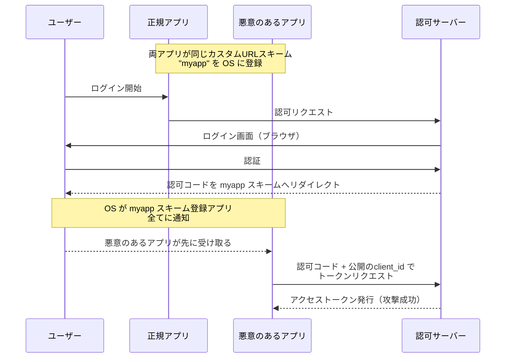
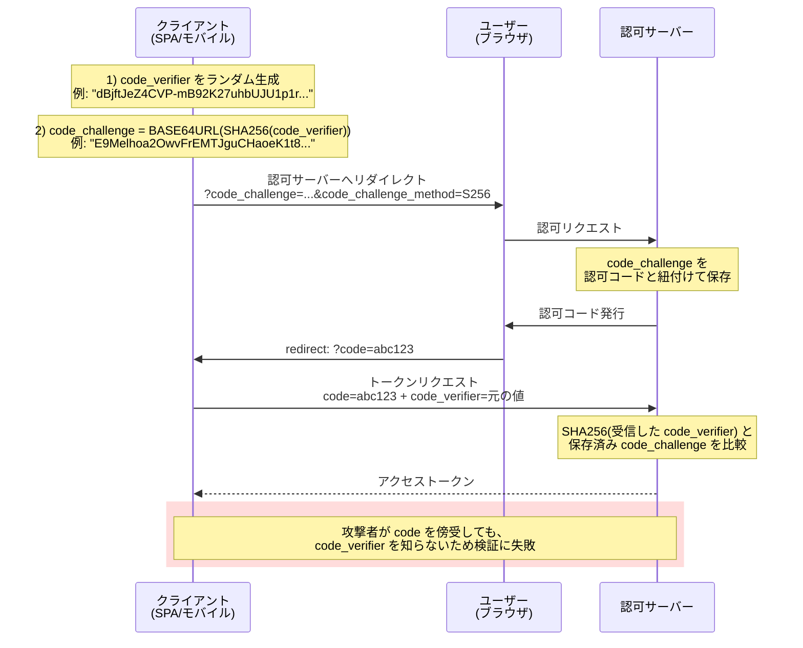
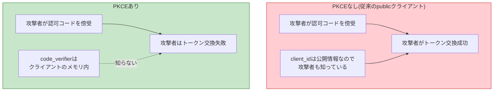

# PKCEフロー（Proof Key for Code Exchange）

> **一言で言うと:** PKCE（ピクシー）は「認可コードを横取りした攻撃者がアクセストークンを取得できないようにする」OAuth 2.0の拡張仕様（RFC 7636）。クライアントが**毎回ランダムな秘密（code_verifier）**を生成し、認可リクエストにはそのハッシュ（code_challenge）を、トークンリクエストには元の値を送る。攻撃者は認可コードを傍受しても元の秘密を知らないため、トークン交換ができない。当初はモバイル・SPAなど `client_secret` を安全に保てない**パブリッククライアント**向けに作られたが、OAuth 2.1ドラフトでは**全クライアントで必須**化される方向。

## なぜ必要か — 「認可コード横取り攻撃」の脅威

[[OAuth2とOpenID-Connect|Authorization Code Flow]]は本来、`client_secret` でクライアントを認証することで安全性を担保している。しかし `client_secret` を安全に保管できないクライアントが存在する:

| クライアント種別 | client_secret 保管の可否 | 理由 |
|----------------|-------------------------|------|
| サーバーサイドWebアプリ（confidential） | ○ 可能 | サーバーの環境変数や Secret Manager に保管 |
| **SPA**（public） | ✗ 不可能 | JavaScriptバンドルに含めるとブラウザのDevToolsで丸見え |
| **モバイルアプリ**（public） | ✗ 不可能 | APKを逆コンパイルすれば抽出できる |
| **デスクトップアプリ**（public） | ✗ 不可能 | バイナリから抽出可能 |
| **CLIツール**（public） | ✗ 不可能 | 配布バイナリに同梱できない |

`client_secret` がないと、認可コードを横取りした攻撃者が「正規のクライアントになりすまして」トークン交換できてしまう。

### モバイルでの典型的な攻撃シナリオ



モバイルOSのカスタムURLスキームは「先勝ち」または「ユーザー選択」になり、悪意のあるアプリが同じスキームを登録すると認可コードを傍受される。SPAでもURLパラメータがブラウザ履歴・サーバーログ・Refererヘッダ経由で漏れるリスクがある。

PKCEはこの状況で「**認可コードだけ持っていてもトークン交換できない**」状態を作る。

## PKCEの仕組み

PKCEは**3つの値**を導入する:

| 値 | 何か | 誰が知っているか |
|----|------|----------------|
| `code_verifier` | ランダムな秘密文字列（43〜128文字） | クライアントだけが知っている |
| `code_challenge` | `code_verifier` のハッシュ | 認可サーバーに送る（公開されてもOK） |
| `code_challenge_method` | ハッシュアルゴリズム（`S256` または `plain`） | 認可リクエストに含める |

### フロー全体図



### code_verifier と code_challenge の生成仕様（RFC 7636）

```
code_verifier:
  - 43〜128文字のランダム文字列
  - 文字種: [A-Z] / [a-z] / [0-9] / "-" / "." / "_" / "~"
  - 最低 256bit のエントロピーを推奨

code_challenge:
  - S256 方式: BASE64URL(SHA256(ASCII(code_verifier)))
  - plain 方式: code_verifier そのまま

BASE64URL:
  - 通常のBase64から "+/=" を除き、"-_" に置換、パディング無し
```

### S256 と plain の比較

| 方式 | 値 | セキュリティ | 推奨度 |
|------|-----|------------|--------|
| `S256` | `BASE64URL(SHA256(verifier))` | 認可リクエストを傍受されても元の verifier は復元困難 | ★★★ 必須 |
| `plain` | `verifier` そのまま | 認可リクエストを傍受されると verifier も漏れる | ✗ 使うべきでない |

`plain` は SHA256 を実装できないレガシーモバイル環境向けの後方互換用。**現代のクライアントは必ず `S256` を使う**。RFC 7636 でも認可サーバーは可能な限り `S256` を要求すべきとされている。

## PKCEあり/なしの違い



PKCEの本質は「**認可コードと code_verifier の両方を持つ者だけがトークンを取得できる**」という制約を加えること。これは confidential クライアントが `client_secret` で実現していた「正規クライアントの証明」を、ランダム値による動的な証明に置き換えている。

## コード例

### TypeScript（ブラウザSPA）— Web Crypto APIを使った実装

```typescript
// PKCEヘルパー: code_verifier と code_challenge を生成
function base64UrlEncode(bytes: Uint8Array): string {
  // URL-safe Base64（パディング無し）
  return btoa(String.fromCharCode(...bytes))
    .replace(/\+/g, '-')
    .replace(/\//g, '_')
    .replace(/=+$/, '');
}

async function generatePKCE(): Promise<{ verifier: string; challenge: string }> {
  // 32バイト = 256bit のランダム値（推奨エントロピー）
  const randomBytes = crypto.getRandomValues(new Uint8Array(32));
  const verifier = base64UrlEncode(randomBytes);

  // S256: SHA-256 でハッシュ化
  const hash = await crypto.subtle.digest('SHA-256', new TextEncoder().encode(verifier));
  const challenge = base64UrlEncode(new Uint8Array(hash));

  return { verifier, challenge };
}

// ログイン開始: 認可サーバーへリダイレクト
async function startLogin() {
  const { verifier, challenge } = await generatePKCE();
  const state = crypto.randomUUID();

  // verifier / state はコールバックで必要 → セッションストレージに保存
  // localStorage は永続化されすぎるので避ける
  sessionStorage.setItem('pkce_verifier', verifier);
  sessionStorage.setItem('oauth_state', state);

  const params = new URLSearchParams({
    response_type: 'code',
    client_id: 'your-client-id',
    redirect_uri: 'https://your-app.example/callback',
    scope: 'openid profile email',
    state, // PKCEとは別の保険的役割
    code_challenge: challenge,
    code_challenge_method: 'S256',
  });

  window.location.href = `https://auth.example.com/authorize?${params}`;
}

// コールバック: 認可コードをアクセストークンに交換
async function handleCallback() {
  const params = new URLSearchParams(window.location.search);
  const code = params.get('code');
  const receivedState = params.get('state');
  const verifier = sessionStorage.getItem('pkce_verifier');
  const expectedState = sessionStorage.getItem('oauth_state');
  if (!code || !verifier) throw new Error('Missing code or verifier');

  // state検証: 認可リクエスト時に保存した値と一致するか
  if (!receivedState || receivedState !== expectedState) {
    throw new Error('Invalid state — possible CSRF attack');
  }

  const response = await fetch('https://auth.example.com/token', {
    method: 'POST',
    headers: { 'Content-Type': 'application/x-www-form-urlencoded' },
    body: new URLSearchParams({
      grant_type: 'authorization_code',
      code,
      redirect_uri: 'https://your-app.example/callback',
      client_id: 'your-client-id',
      code_verifier: verifier, // ← PKCEの肝: 元の値を送信
    }),
  });

  // 使い終わったら削除（使い回し防止）
  sessionStorage.removeItem('pkce_verifier');
  sessionStorage.removeItem('oauth_state');
  const tokens = await response.json();
  return tokens;
}
```

### Go — 標準ライブラリで実装

PKCE 値の生成部分のみを抜き出した最小実装。認可URL組み立て・コールバック処理を含む完全なフローは [[OAuth2とOpenID-Connect]] の Go 例（`golang.org/x/oauth2` + `coreos/go-oidc` を使用）を参照。

```go
package pkce

import (
	"crypto/rand"
	"crypto/sha256"
	"encoding/base64"
)

type PKCE struct {
	Verifier  string
	Challenge string
	Method    string
}

func Generate() (*PKCE, error) {
	// 32バイト = 256bit のランダム値
	b := make([]byte, 32)
	if _, err := rand.Read(b); err != nil {
		return nil, err
	}

	// code_verifier: BASE64URL（パディング無し）
	verifier := base64.RawURLEncoding.EncodeToString(b)

	// code_challenge: SHA256 → BASE64URL
	hash := sha256.Sum256([]byte(verifier))
	challenge := base64.RawURLEncoding.EncodeToString(hash[:])

	return &PKCE{
		Verifier:  verifier,
		Challenge: challenge,
		Method:    "S256",
	}, nil
}
```

### Python — モバイル/CLIツール向け

```python
import base64
import hashlib
import secrets
from dataclasses import dataclass


@dataclass
class PKCE:
    verifier: str
    challenge: str
    method: str = "S256"


def generate_pkce() -> PKCE:
    # secrets はCSPRNG（暗号学的に安全な乱数生成器）
    # token_urlsafe は内部で base64 url-safe を生成する
    verifier = secrets.token_urlsafe(32)  # 約43文字の URL-safe 文字列

    # S256: SHA-256 → BASE64URL（パディング無し）
    digest = hashlib.sha256(verifier.encode("ascii")).digest()
    challenge = base64.urlsafe_b64encode(digest).rstrip(b"=").decode("ascii")

    return PKCE(verifier=verifier, challenge=challenge)


# 使い方
pkce = generate_pkce()
auth_url = (
    f"https://auth.example.com/authorize"
    f"?response_type=code&client_id=cli-tool"
    f"&redirect_uri=http://localhost:8080/callback"
    f"&code_challenge={pkce.challenge}"
    f"&code_challenge_method={pkce.method}"
)
```

## よくある落とし穴

### 1. `code_verifier` を `localStorage` に保存する

`localStorage` はオリジン全体で共有され、XSSが発生すれば任意のスクリプトから読み取れる。PKCEのフロー中だけ必要な値なので、`sessionStorage`（タブが閉じれば消える）か、より安全には**メモリ上の変数**に保持する。Cookieに保存する場合は `HttpOnly` + `SameSite=Lax` を必ず設定する。

### 2. `state` パラメータの省略

PKCE単体でも[[CSRF]]攻撃の主要なベクトルは塞がる（OAuth 2.0 Security Best Current Practice / RFC 9700）が、`state` パラメータには別の役割がある:

- **アプリ側の状態保持** — 認可リクエスト前のページURLや画面状態をリダイレクト往復で持ち回る
- **多層防御** — PKCE実装ミスや認可サーバー側の検証バグへの保険

`state` は推測困難な乱数（`crypto.randomUUID()` 等）を生成して認可リクエストに含め、コールバックで保存値と比較する。**PKCE と state を両方併用するのが保守的かつ推奨される実装**。

### 3. 弱い乱数生成器を使う

`Math.random()` や `rand()` は予測可能で、攻撃者に `code_verifier` を推測される可能性がある。必ず**CSPRNG**（暗号学的に安全な乱数生成器）を使う:

| 言語 | CSPRNG |
|------|--------|
| JavaScript（ブラウザ） | `crypto.getRandomValues()` |
| Node.js | `crypto.randomBytes()` |
| Go | `crypto/rand` パッケージ |
| Python | `secrets` モジュール |
| Ruby | `SecureRandom` |
| PHP | `random_bytes()` |

### 4. `plain` メソッドを使う

`code_challenge_method=plain` は「verifier をそのまま送信」するため、認可リクエストを傍受された時点で意味を失う。**必ず `S256` を使う**。実装ミスで `plain` がデフォルトになっていないか要確認。

### 5. `code_verifier` の使い回し

`code_verifier` は**毎回新しく生成**する。複数の認可フローで同じ値を使い回すと、1つのフローで漏洩した場合に他のフローも危殆化する。フロー完了後（成功/失敗問わず）は速やかに破棄する。

### 6. confidential クライアントでPKCEを省略

「サーバーサイドだから `client_secret` で守られている、PKCEは不要」という判断は古い。OAuth 2.1ドラフトでは **すべてのAuthorization Code FlowでPKCE必須**を方針としている。`client_secret` の漏洩や、認可コードがプロキシ・ログ等で漏洩するリスクへの多層防御として有効。実装コストは小さいので**全クライアントで有効化**を推奨。

### 7. `code_verifier` の長さ不足

RFC 7636は43〜128文字を要求するが、43文字ぎりぎりだと約 256bit のエントロピー確保が文字種次第。**32バイト（256bit）のランダムバイトをBASE64URLエンコード**すれば自動的に約43文字になり、十分なエントロピーを持つ。

## AIによる実装のアンチパターン

| アンチパターン | なぜ問題か | 対策 |
|---|---|---|
| 自前で BASE64URL エンコードを実装 | パディング処理や文字置換のミスでサーバー側の検証に失敗 | 言語標準の URL-safe Base64（`base64.RawURLEncoding`、`base64.urlsafe_b64encode` 等）を使う |
| `Date.now()` や UUID を `code_verifier` に流用 | エントロピー不足で予測可能 | CSPRNG 由来の 32バイトランダム値を使う |
| `code_challenge_method` を省略 | 一部の認可サーバーは省略時に `plain` をデフォルトにする | 明示的に `S256` を指定 |
| PKCEさえあればstateは不要と判断 | CSRF攻撃を防げない（PKCEはコード横取り、stateはCSRF対策と役割が異なる） | 両方を必ず実装 |
| `code_verifier` をURLパラメータで送信 | URLはサーバーログ・ブラウザ履歴・Refererに残る | トークンエンドポイントへの **POSTリクエストボディ** で送信 |
| ライブラリのPKCE機能を無視して自前実装 | `openid-client`（Node）、`AppAuth`（モバイル）等は認可サーバー間の差異も吸収する | 既存の十分にテストされたライブラリを使う |

## 実務での使用シーン

| シーン | PKCE の必要性 | 補足 |
|--------|--------------|------|
| SPA（React/Vue/Svelte）からのGoogleログイン | **必須** | `client_secret` を持てない |
| モバイルアプリ（iOS/Android）からのログイン | **必須** | カスタムURLスキームの横取り対策 |
| デスクトップアプリ・CLIツール | **必須** | バイナリ配布で `client_secret` を保てない |
| サーバーサイドWebアプリ（Rails/Laravel/Express等） | **推奨**（OAuth 2.1で必須化） | 多層防御として有効 |
| バックエンド間の Client Credentials Flow | 不要 | 認可コードフローを使わないため |
| Resource Owner Password Credentials Flow | 不要（そもそも非推奨） | OAuth 2.1で廃止予定 |

## 関連トピック

- [[OAuth2とOpenID-Connect]] — 親トピック。PKCEはAuthorization Code Flowの拡張
- [[認証と認可]] — 認証フロー全体での位置づけ
- [[CSRF]] — `state` パラメータが対応する別の攻撃ベクトル
- [[セッションとJWT]] — PKCEで取得したアクセストークン/IDトークンの保存と検証
- [[暗号アルゴリズム]] — SHA-256・BASE64URL・CSPRNGの基礎

## 参考リソース

- RFC 7636 — Proof Key for Code Exchange by OAuth Public Clients
- RFC 8252 — OAuth 2.0 for Native Apps（モバイルアプリのベストプラクティス）
- RFC 9700 — OAuth 2.0 Security Best Current Practice（PKCE 必須化、`state` の役割整理）
- `draft-ietf-oauth-v2-1` — OAuth 2.1 ドラフト（PKCE全クライアント必須化、Implicit Flow / ROPC廃止）
- OAuth Working Group の公式リソース（oauth.net/2/pkce/）
