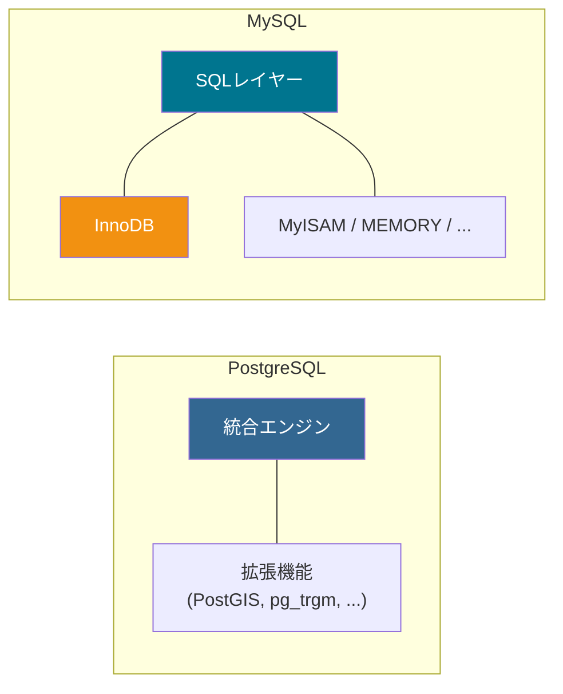
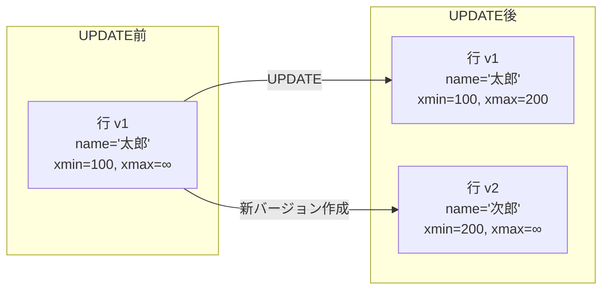
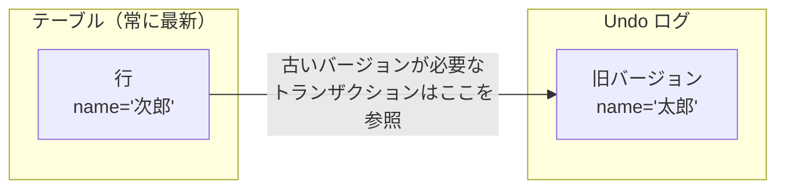
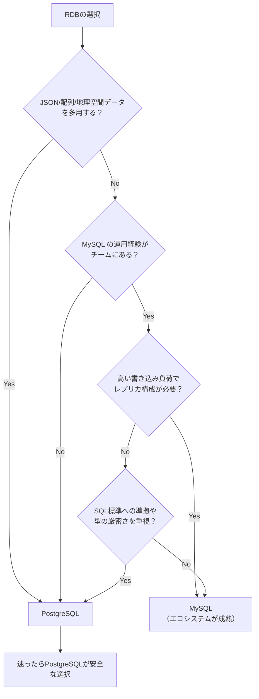

# PostgreSQLとMySQLの比較（PostgreSQL vs MySQL）

> **一言で言うと:** PostgreSQLは「正しさと拡張性」を、MySQLは「速さとシンプルさ」を重視して進化してきた2大オープンソースRDB。SQL標準への準拠度、MVCC実装、データ型、レプリケーション方式に本質的な設計思想の違いがある。

## 設計思想の根本的な違い

PostgreSQLとMySQLの違いは個々の機能差の前に、**設計思想の違い**を理解すると全体像が掴める。

| 観点 | PostgreSQL | MySQL (InnoDB) |
|------|-----------|----------------|
| **起源** | 学術研究（UC Berkeley, 1986年〜） | Web向け軽量DB（1995年〜） |
| **設計思想** | SQL標準への忠実さ、拡張性、正確性 | 高速な読み書き、シンプルさ、実用性 |
| **ストレージエンジン** | 単一（統合型） | プラガブル（InnoDB, MyISAM等を選択可能） |
| **型システム** | 厳密（暗黙の型変換を最小化） | 寛容（暗黙の型変換が多い） |
| **拡張性** | カスタム型・演算子・インデックスを定義可能 | プラグインで機能追加 |



## MVCC（Multi-Version Concurrency Control）の実装差

MVCC は「読み取りがロックを取らない」ことで並行性を高める仕組みだが、実装方法が根本的に異なる。

### PostgreSQL — 追記型（Append-only）

PostgreSQLは行を更新するとき、**古い行を残したまま新しいバージョンの行を別の場所に追記**する。



- 各行に `xmin`（作成トランザクションID）と `xmax`（削除トランザクションID）を持つ
- 読み取りトランザクションは自分のスナップショットに基づいて「見えるバージョン」を判断する
- **古いバージョンがテーブル内に残る** → 定期的な **VACUUM**（バキューム）が必要

### MySQL (InnoDB) — Undo ログ型

InnoDBは行を**その場で上書き**し、古いバージョンを **Undo ログ** に退避する。



- テーブルには常に最新バージョンだけが存在する
- 古いバージョンが必要なトランザクションは Undo ログを辿る
- Undo ログは自動的にパージされるため、VACUUMのような手動運用は不要

### 実務上の影響

| 観点 | PostgreSQL | MySQL (InnoDB) |
|------|-----------|----------------|
| 読み取り性能 | テーブルが肥大化すると劣化（HOT更新で軽減） | Undo ログ参照のコストはあるが安定 |
| 書き込み後の運用 | VACUUM が必須。autovacuum のチューニングが運用の鍵 | Undo ログのパージは自動。長時間トランザクションに注意 |
| テーブル肥大化 | 更新・削除が多いテーブルは膨張する（bloat） | テーブルサイズは安定 |
| インデックス更新 | HOTが使えない場合、更新のたびにインデックスも更新 | クラスタインデックス構造のため主キー更新は高コスト |

## トランザクション分離レベルの違い

両者とも4つの分離レベルをサポートするが、**デフォルト値と内部実装が異なる**。

| 分離レベル | PostgreSQL | MySQL (InnoDB) |
|-----------|-----------|----------------|
| **デフォルト** | **READ COMMITTED** | **REPEATABLE READ** |
| REPEATABLE READ の実装 | スナップショット分離 | スナップショット分離 + **ギャップロック** |
| Phantom Read の防止 | SERIALIZABLE が必要 | REPEATABLE READ でギャップロックにより防止 |
| SERIALIZABLE の実装 | SSI（Serializable Snapshot Isolation） | 伝統的なロックベース |

### ギャップロック（Gap Lock）— MySQL 固有の概念

MySQLの REPEATABLE READ では、範囲検索時にインデックスの「隙間（ギャップ）」にもロックを取る。これにより Phantom Read を防止するが、**予期しないロック待ちやデッドロック**の原因にもなる。

```sql
-- MySQL: この範囲クエリはギャップロックを取る
BEGIN;
SELECT * FROM orders WHERE amount BETWEEN 1000 AND 5000 FOR UPDATE;
-- → amount の 1000〜5000 の範囲だけでなく、その「隙間」もロックされる
-- → 別トランザクションが amount=3000 の行を INSERT しようとするとブロックされる
COMMIT;
```

PostgreSQLにはギャップロックがないため、同じクエリで INSERT がブロックされることはない。代わりに SERIALIZABLE レベルで SSI を使用して矛盾を検出する。

## データ型の違い

| データ型 | PostgreSQL | MySQL |
|---------|-----------|-------|
| **JSON** | `json`（テキスト保存）と `jsonb`（バイナリ、インデックス可能） | `JSON`（バイナリ保存、5.7+） |
| **配列** | `INTEGER[]`, `TEXT[]` 等のネイティブ配列型 | なし（JSONで代替） |
| **レンジ型** | `int4range`, `tstzrange` 等 | なし |
| **ENUM** | 内部的に整数で保存、ALTER TYPE で値追加可能 | 文字列で定義、値追加に ALTER TABLE が必要 |
| **BOOLEAN** | `TRUE` / `FALSE`（専用型） | `TINYINT(1)` の別名（0/1で保存） |
| **文字列** | `TEXT` に長さ制限なし（性能差もなし） | `VARCHAR` と `TEXT` で性能差あり |
| **日時** | `TIMESTAMPTZ`（タイムゾーン付きを推奨） | `DATETIME`（TZなし）/ `TIMESTAMP`（UTC変換あり、2038年問題） |

### PostgreSQLの JSONB — [[NoSQL]]的な使い方

```sql
-- PostgreSQLの JSONB はインデックスが効く
CREATE TABLE events (
    id BIGINT GENERATED ALWAYS AS IDENTITY PRIMARY KEY,
    data JSONB NOT NULL,
    created_at TIMESTAMPTZ NOT NULL DEFAULT NOW()
);

-- GINインデックスでJSONB内を高速検索
CREATE INDEX idx_events_data ON events USING GIN (data);

INSERT INTO events (data) VALUES
('{"type": "click", "page": "/home", "user_id": 42}'),
('{"type": "purchase", "item": "book", "amount": 1500}');

-- JSONB演算子で検索
SELECT * FROM events WHERE data @> '{"type": "click"}';
SELECT * FROM events WHERE data ->> 'page' = '/home';
SELECT * FROM events WHERE (data ->> 'amount')::int > 1000;
```

## インデックスの違い

| 観点 | PostgreSQL | MySQL (InnoDB) |
|------|-----------|----------------|
| **テーブル構造** | ヒープテーブル（行の物理順序はランダム） | **クラスタインデックス**（主キー順に物理配置） |
| **セカンダリインデックス** | 行の物理位置（ctid）を指す | 主キーの値を指す → 主キーで再度B-Tree検索が必要 |
| **部分インデックス** | `WHERE` 句付きで作成可能 | なし（8.0+ の関数インデックスで一部代替） |
| **式インデックス** | `CREATE INDEX ON t (LOWER(email))` | 8.0+ で `CREATE INDEX ON t ((LOWER(email)))` |
| **GIN / GiST** | ネイティブサポート | なし（全文検索は FULLTEXT インデックス） |
| **インデックスの同時作成** | `CREATE INDEX CONCURRENTLY` | `ALGORITHM=INPLACE`（ロックの種類が異なる） |

### クラスタインデックス vs ヒープテーブル

この違いは[[Resources/Study/Layer3-データ永続化/インデックス|インデックス]]の設計に大きく影響する。


**MySQLでの実務上の影響:**
- セカンダリインデックスの検索は「セカンダリ → 主キーB-Tree → 行データ」の2段階になる
- 主キーが大きい（UUID v4 の16バイト等）と、全セカンダリインデックスが肥大化する
- [[サロゲートキーと自然キー]]でUUID v4 を主キーにすると影響が特に大きい

## レプリケーションの違い

| 観点 | PostgreSQL | MySQL |
|------|-----------|-------|
| **方式** | WAL（Write-Ahead Log）ベースの物理レプリケーション | binlog ベースの論理レプリケーション（行 or 文ベース） |
| **論理レプリケーション** | 10+ で対応（テーブル単位で選択可能） | 標準機能 |
| **レプリカの書き込み** | 読み取り専用（ホットスタンバイ） | 書き込み可能（マルチソースレプリケーション） |
| **遅延の管理** | `pg_stat_replication` で監視 | `SHOW REPLICA STATUS` で `Seconds_Behind_Source` を確認 |

## コード例

### TypeScript — DB選択がコードに影響するケース

```typescript
import { Pool as PgPool } from "pg";
import mysql from "mysql2/promise";

// --- PostgreSQL: JSONB と配列型を活用 ---
const pg = new PgPool({ connectionString: "postgres://localhost/mydb" });

// JSONB で柔軟なメタデータを保存
await pg.query(`
  INSERT INTO events (data) VALUES ($1)
`, [JSON.stringify({ type: "click", tags: ["mobile", "home"] })]);

// 配列型で PostgreSQL ネイティブに扱う
await pg.query(`
  INSERT INTO articles (title, tags) VALUES ($1, $2)
`, ["RDBの基礎", ["database", "postgresql"]]);

// JSONB + GIN インデックスで検索
const events = await pg.query(`
  SELECT * FROM events WHERE data @> $1
`, [JSON.stringify({ type: "click" })]);

// --- MySQL: 同じことを JSON 型で実現 ---
const my = await mysql.createPool("mysql://localhost/mydb");

// JSON型で保存
await my.execute(`
  INSERT INTO events (data) VALUES (?)
`, [JSON.stringify({ type: "click", tags: ["mobile", "home"] })]);

// JSON関数で検索（GINインデックスは使えない）
const [rows] = await my.execute(`
  SELECT * FROM events WHERE JSON_EXTRACT(data, '$.type') = ?
`, ["click"]);
```

### Go — 接続とトランザクション分離レベルの指定

```go
package main

import (
	"context"
	"database/sql"
	"fmt"
	"log"

	_ "github.com/jackc/pgx/v5/stdlib" // PostgreSQL
	_ "github.com/go-sql-driver/mysql"  // MySQL
)

func main() {
	// PostgreSQL 接続
	pgDB, err := sql.Open("pgx", "postgres://localhost/mydb?sslmode=disable")
	if err != nil {
		log.Fatal(err)
	}
	defer pgDB.Close()

	// MySQL 接続
	myDB, err := sql.Open("mysql", "user:pass@tcp(localhost:3306)/mydb?parseTime=true")
	if err != nil {
		log.Fatal(err)
	}
	defer myDB.Close()

	// PostgreSQL: デフォルト READ COMMITTED、SERIALIZABLE は SSI
	pgTx, _ := pgDB.BeginTx(context.Background(), &sql.TxOptions{
		Isolation: sql.LevelSerializable, // SSI: ロックを取らずに矛盾を検出
	})
	// SSI ではシリアライズ失敗時にエラーが返るのでリトライが必要
	_, err = pgTx.Exec("UPDATE accounts SET balance = balance - 100 WHERE id = 1")
	if err != nil {
		pgTx.Rollback()
		// "could not serialize access" → リトライ
		fmt.Println("Serialization failure, should retry:", err)
		return
	}
	pgTx.Commit()

	// MySQL: デフォルト REPEATABLE READ、ギャップロックに注意
	myTx, _ := myDB.BeginTx(context.Background(), &sql.TxOptions{
		Isolation: sql.LevelRepeatableRead,
	})
	// FOR UPDATE はギャップロックを取る可能性がある
	myTx.Query("SELECT * FROM orders WHERE amount BETWEEN 1000 AND 5000 FOR UPDATE")
	// → 別トランザクションの INSERT がブロックされる可能性あり
	myTx.Commit()
}
```

### SQL — 同じ操作の構文差

```sql
-- ============================
-- UPSERT（存在すれば更新、なければ挿入）
-- ============================

-- PostgreSQL: ON CONFLICT
INSERT INTO users (email, name) VALUES ('taro@example.com', '太郎')
ON CONFLICT (email) DO UPDATE SET name = EXCLUDED.name;

-- MySQL: ON DUPLICATE KEY UPDATE（8.0.20+ のエイリアス構文）
INSERT INTO users (email, name) VALUES ('taro@example.com', '太郎') AS new
ON DUPLICATE KEY UPDATE name = new.name;

-- ============================
-- RETURNING（INSERT/UPDATE結果の取得）
-- ============================

-- PostgreSQL: RETURNING で直接取得（追加クエリ不要）
INSERT INTO users (email, name) VALUES ('jiro@example.com', '次郎')
RETURNING id, created_at;

-- MySQL: RETURNING なし → LAST_INSERT_ID() で取得
INSERT INTO users (email, name) VALUES ('jiro@example.com', '次郎');
SELECT LAST_INSERT_ID();

-- ============================
-- ページネーション
-- ============================

-- PostgreSQL / MySQL 共通
SELECT * FROM posts ORDER BY created_at DESC LIMIT 20 OFFSET 40;

-- ============================
-- 文字列連結
-- ============================

-- PostgreSQL: || 演算子（SQL標準）
SELECT first_name || ' ' || last_name AS full_name FROM users;

-- MySQL: CONCAT 関数
SELECT CONCAT(first_name, ' ', last_name) AS full_name FROM users;

-- ============================
-- 型キャスト
-- ============================

-- PostgreSQL: :: 構文（独自）またはCAST（標準）
SELECT '42'::INTEGER;
SELECT CAST('42' AS INTEGER);

-- MySQL: CAST のみ
SELECT CAST('42' AS SIGNED);
```

## よくある落とし穴

### 1. MySQLの暗黙の型変換でインデックスが効かない

MySQLは型が一致しないと暗黙の型変換を行うが、これにより[[Resources/Study/Layer3-データ永続化/インデックス|インデックス]]が使えなくなることがある。

```sql
-- phone カラムが VARCHAR 型の場合
-- ❌ MySQL: 数値と比較 → 全行を数値に変換して比較（Seq Scan）
SELECT * FROM users WHERE phone = 08012345678;

-- ✅ 文字列として比較 → インデックスが効く
SELECT * FROM users WHERE phone = '08012345678';
```

PostgreSQLは型不一致でエラーを返すため、この種のバグは発生しない。

### 2. PostgreSQLの VACUUM を放置してテーブルが肥大化

autovacuum はデフォルトで有効だが、更新頻度の高いテーブルではデフォルト設定で追いつかないことがある。

```sql
-- テーブルの膨張具合を確認
SELECT
    relname,
    n_live_tup AS live_rows,
    n_dead_tup AS dead_rows,
    round(100.0 * n_dead_tup / NULLIF(n_live_tup + n_dead_tup, 0), 1) AS dead_pct,
    last_autovacuum
FROM pg_stat_user_tables
WHERE n_dead_tup > 1000
ORDER BY n_dead_tup DESC;
```

`dead_pct`（死んだ行の割合）が20%を超えていたら autovacuum の設定を見直す。

### 3. MySQLの TIMESTAMP 型の2038年問題

MySQLの `TIMESTAMP` 型は内部的にUnixタイムスタンプ（32ビット符号付き整数）で保存されるため、**2038年1月19日**を超える日時を扱えない。

```sql
-- MySQL: TIMESTAMP の範囲
-- '1970-01-01 00:00:01' UTC ～ '2038-01-19 03:14:07' UTC

-- 新規テーブルでは DATETIME を使う（範囲: 1000-01-01 ～ 9999-12-31）
CREATE TABLE events (
    id BIGINT AUTO_INCREMENT PRIMARY KEY,
    occurred_at DATETIME(6) NOT NULL  -- マイクロ秒精度
);
```

PostgreSQLの `TIMESTAMPTZ` にはこの制限はない。

### 4. MySQLの utf8 は本当のUTF-8ではない

MySQLの `utf8` 文字セットは最大3バイトしかサポートせず、絵文字（4バイト）が保存できない。**`utf8mb4` を使う必要がある**。

```sql
-- ❌ MySQL: utf8 では絵文字が保存できない
CREATE TABLE messages (
    body TEXT CHARACTER SET utf8
);

-- ✅ utf8mb4 を使う
CREATE TABLE messages (
    body TEXT CHARACTER SET utf8mb4
);

-- テーブル作成時に指定するか、my.cnf でデフォルトを変更
-- [mysqld]
-- character-set-server = utf8mb4
```

PostgreSQLは `UTF8` が常にフルUTF-8（4バイト対応）。

## 選択の指針



チーム内に特定のDBの運用経験者がいる場合、その経験は大きなアドバンテージになる。技術的にはPostgreSQLがほぼ全ての面で優位だが、MySQLの巨大なエコシステム（AWS Aurora MySQL、PlanetScale等）と運用ノウハウの蓄積も無視できない選択要因である。

## 関連トピック

- [[RDB]] — 親トピック。PostgreSQLとMySQLの違いを「誤解されやすいポイント」で言及
- [[Resources/Study/Layer3-データ永続化/インデックス|インデックス]] — クラスタインデックス（MySQL）とヒープテーブル（PostgreSQL）の構造差がインデックス設計に影響
- [[サロゲートキーと自然キー]] — MySQLのクラスタインデックスでは主キーサイズがセカンダリインデックスの効率に直結
- [[マイグレーション]] — ENUM型の扱いやインデックスの同時作成構文が異なる

## 参考リソース

- [PostgreSQL Documentation](https://www.postgresql.org/docs/) — 公式ドキュメント
- [MySQL Reference Manual](https://dev.mysql.com/doc/refman/8.4/en/) — 公式ドキュメント
- 『詳解 PostgreSQL』（Robert Haas 他） — MVCC、VACUUM、プランナの内部動作を解説
