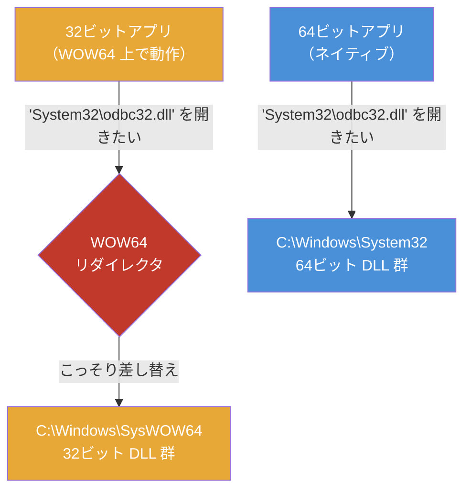

# Program Files と Program Files (x86)（WOW64 / x86 / x64）

> **一言で言うと:** `C:\Program Files (x86)` の `x86` は「32ビット」を指す符牒であり、2つのフォルダが並んでいるのは **64ビット Windows が32ビットアプリも同時に動かすため、同名で中身が違うファイル群を物理的に隔離する必要があった** から。この一件を追うと「後方互換性のために設計をねじ曲げる」というOSの宿命が見える。

## まず「x86」という語を分解する

**x86** とは、Intel が 1978 年に発売した CPU「**8086**」から始まる命令セットアーキテクチャ（ISA: Instruction Set Architecture、CPU が理解できる機械語命令の体系）の系譜を指す総称である。後継が 80186, 80286, 80386, 80486 と「**86** で終わる型番」で続いたため、末尾を取って「x86」と呼ばれるようになった。正式な規格名ではなく、業界の慣用呼称である。

| 世代 | 代表 CPU | 登場 | ビット幅 | 別名 |
|---|---|---|---|---|
| 初代 | 8086 | 1978 | 16ビット | — |
| 保護モード導入 | 80286 | 1982 | 16ビット | — |
| **32ビット化** | 80386 | 1985 | **32ビット** | **IA-32**, i386, x86 |
| 高速化世代 | 80486 / Pentium 系 | 1989〜 | 32ビット | IA-32 |
| **64ビット拡張** | AMD Opteron | 2003 | **64ビット** | **x86-64**, AMD64, **x64**, Intel 64 |

ここで押さえるべきは、**「x86」という語が文脈によって指す範囲が変わる**ことだ。

- 広義の x86 = 8086 から現在の 64 ビット CPU まで含む系譜全体（例: 「x86 サーバー」= Intel/AMD の PC 系サーバー）
- 狭義の x86 = **32ビット時代の x86（IA-32）だけ**を指す。Windows のフォルダ名、Docker の `--platform`、パッケージのアーキテクチャ表記などはこの用法

`C:\Program Files (x86)` の `x86` は後者、つまり「**32ビット版**」の意味である。64ビット側は `x64` や `amd64` と表記されるため、`(x86)` と書けば「32ビットのほう」と一意に読める、という命名になっている。

> [!info] 用語ミニ辞典
> - **AMD64 / x86-64 / x64** — 3つとも同じものを指す。x86 を64ビットに拡張した命令セットを**先に設計・実装したのは Intel ではなく AMD**（1999年10月に発表、2000年8月に仕様公開、2003年 Opteron で製品化）。Intel は独自の64ビット路線（Itanium / IA-64）を推していたが市場に受け入れられず、AMD の拡張を「Intel 64」として後追い採用した。Linux/Docker が `amd64` と呼び、Microsoft が `x64` と呼ぶのは、この経緯の呼称の違いにすぎない
> - **IA-64（Itanium）** — Intel が 2001 年に投入した**x86 とは互換性のない別物の64ビット ISA**。名前が似ているため x86-64 と混同されやすいが無関係で、事実上消滅した（2021 年に最終出荷）。「x86 の64ビット化は AMD の拡張が勝った」という歴史を知らないと、`amd64` という表記が Intel CPU にも使われる理由が理解できない
>
> 年表で見ると、AMD が仕様を公開した2000年8月は Intel が Itanium を出荷する前年にあたる。**「x86 を捨てて作り直す」（Intel）と「x86 を拡張して延命する」（AMD）が真正面からぶつかり、後者が勝った** — この文書のテーマである「互換性を守る側が勝つ」という力学は、CPU の命令セットのレベルですでに働いていた。

## なぜフォルダを2つに分けたのか

64ビット版 Windows は、**64ビットアプリと32ビットアプリの両方を同時に動かす**という要件を背負って生まれた。当時ソフトウェア資産の大半は32ビットであり、「64ビット OS に乗り換えたら既存のアプリが全部動かない」では誰も移行しないからだ。

ここで意外な事実がある。**この仕組みが最初に投入されたのは x64 版ではなく、2001年10月リリースの Windows XP 64-Bit Edition — すなわち Itanium（IA-64）版**である。先ほど「市場に受け入れられず消滅した」と書いたあの Itanium が、WOW64 の生まれ故郷だ。x86 と命令セットが根本的に違う IA-64 上で既存の32ビット x86 アプリを動かすには、命令を変換して実行する層がどうしても必要だった。2005年の Windows XP Professional x64 Edition（一般に普及したのはこちら）は、そこで作られた仕組みをそのまま引き継いでいる。**「消えたアーキテクチャが残した互換性レイヤーを、勝ったアーキテクチャが使い続けている」**という、この文書のテーマそのものの構図がここにもある。

さて、フォルダを分けざるを得なかった技術的な制約に入る。

> **Windows のローダ（実行ファイルや DLL をメモリに読み込む OS の部品）は、1つのプロセス（実行中のプログラム）に、異なるビット幅の通常モジュール（EXE / DLL）を混在させない。**

理由はポインタ（メモリ番地を表す値）のサイズにある。32ビットプロセスのポインタは4バイト、64ビットプロセスのポインタは8バイト。関数を呼ぶときにスタックやレジスタへどう引数を積むかという取り決め（ABI: Application Binary Interface）が両者で食い違うため、混ぜて呼び合うと引数の受け渡しが破綻する。実際、64ビットの DLL を32ビットプロセスに読み込ませようとすると、実行時にクラッシュする以前に **PE ヘッダ（実行ファイル先頭のメタデータ）のマシンタイプが一致せずロード自体が失敗する**（`ERROR_BAD_EXE_FORMAT`）。したがって **32ビットアプリは32ビット版の DLL（Dynamic Link Library、共有ライブラリ）しか読み込めず、64ビットアプリは64ビット版しか読み込めない**。

> [!warning] 「混在できない」は CPU の制約ではない
> よく「x64 CPU では32ビットと64ビットのコードを同一プロセスで動かせない」と説明されるが、これは正確ではない。x64 CPU はコードセグメントのセレクタ（`0x23` = 32ビット互換モード / `0x33` = 64ビットモード）を跨ぐジャンプでモードを切り替えられる。
>
> そして **WOW64 自身がまさにそれをやっている**。64ビット Windows 上の「32ビットプロセス」の中には、実は64ビットの `ntdll.dll` と `wow64.dll` / `wow64win.dll` / `wow64cpu.dll` が同居している。32ビットアプリがシステムコールを呼ぶと、`wow64cpu.dll` が64ビットモードへ切り替えて64ビットカーネルに渡し、戻り値を持って32ビット側へ帰ってくる。
>
> つまり制約は **「CPU にできない」ではなく「OS がアプリのモジュールについては許さない」**。この区別が付くと、「なぜ WOW64 という層がわざわざ存在するのか」——アプリには混在を禁じつつ、その禁を破る特権的な変換層を OS 側が1つだけ用意している——という設計の意図が見えてくる。

ところが困ったことに、**32ビット版と64ビット版の DLL や実行ファイルはファイル名が同じ**である。`kernel32.dll` は32ビット版も64ビット版も `kernel32.dll` だ（名前に `32` が入っているのは16ビット時代との区別の名残で、64ビット版も同名のまま）。

同じ名前で中身が違うファイルを、同じディレクトリには置けない。取れる選択肢は3つあった。

| 案 | 内容 | 採用されなかった理由 |
|---|---|---|
| A. ファイル名を変える | 64ビット版を `kernel64.dll` にする | 世界中のアプリのソースとバイナリに埋め込まれた DLL 名が全滅する |
| B. 同一フォルダに共存させる | メタデータでビット数を判別 | ファイルシステムの根幹（1ディレクトリ内で名前は一意）を変える必要がある |
| **C. フォルダを分ける** | 置き場所そのものを分離 | **採用**。既存アプリの想定を壊さずに済む唯一の現実解 |

この C の結果が、`C:\Program Files`（64ビット用）と `C:\Program Files (x86)`（32ビット用）の並存である。

## System32 が64ビットで、SysWOW64 が32ビット

同じ発想が OS のシステムディレクトリにも適用されているが、こちらは**名前が直感と真逆**という悪名高い罠になっている。

| ディレクトリ | 実際の中身 |
|---|---|
| `C:\Windows\System32` | **64ビット**のシステム DLL・実行ファイル |
| `C:\Windows\SysWOW64` | **32ビット**のシステム DLL・実行ファイル |

「32 と書いてあるほうが64ビット、64 と書いてあるほうが32ビット」——これは冗談ではなく現実である。理由は2つ。

1. **`System32` は改名できなかった** — 無数のアプリ・インストーラ・バッチファイルが `C:\Windows\System32\...` というパスを**文字列としてハードコード**している。ここを `System64` に改名すれば互換性は壊滅する。そこで「32ビット OS でも64ビット OS でも、**そのシステムのネイティブなシステムディレクトリは常に `System32`**」というルールにした
2. **`SysWOW64` の `WOW64` は「64」の意味ではない** — WOW64 は **W**indows 32-bit **O**n **W**indows 64-bit の略。つまり「64ビット Windows の上で32ビット Windows を動かすためのサブシステム」であり、`SysWOW64` は「WOW64 用のシステムディレクトリ」と読む。数字の 64 は「ホストが64ビット」を意味していて、中身のビット数ではない

この2つを知らずに名前だけ見ると必ず取り違える。**「ネイティブは常に System32、それ以外は別の場所」** と覚えるのが正しい読み方である（この覚え方が「32/64」より優れている理由は、後述の ARM64 の節で明らかになる）。

## WOW64 リダイレクション — OS が嘘のパスを返す

分離しただけでは互換性は保てない。32ビットアプリは `C:\Windows\System32\odbc32.dll` を開こうとするからだ。そのまま開かせても、前述のとおり PE ヘッダのマシンタイプが合わずロードに失敗し、アプリは起動できない。

そこで WOW64 は、**32ビットプロセスからのファイルアクセスを裏で書き換える**（ファイルシステムリダイレクション）。



同じことがレジストリ（Windows の設定データベース）でも起きる。32ビットプロセスが `HKEY_LOCAL_MACHINE\SOFTWARE\Foo` を読むと、実際には `HKEY_LOCAL_MACHINE\SOFTWARE\WOW6432Node\Foo` にリダイレクトされる。「64ビット版のインストーラで書いたはずのレジストリ値が、32ビットのツールから読めない」という現象の正体はこれである。

環境変数も同様にプロセスのビット数で値が変わる。

| 環境変数 | 64ビットプロセスから見た値 | 32ビットプロセスから見た値 |
|---|---|---|
| `%ProgramFiles%` | `C:\Program Files` | **`C:\Program Files (x86)`** |
| `%ProgramFiles(x86)%` | `C:\Program Files (x86)` | `C:\Program Files (x86)` |
| `%ProgramW6432%` | `C:\Program Files` | **`C:\Program Files`**（常に64ビット側） |
| `%PROCESSOR_ARCHITECTURE%` | `AMD64` | **`x86`**（自プロセスのアーキテクチャ） |
| `%PROCESSOR_ARCHITEW6432%` | 未定義 | **`AMD64`**（本当の CPU アーキテクチャ） |

パスのほうも、同じ文字列が指す先がプロセスによって変わる。

| 指定するパス | 64ビットプロセスが実際に開く先 | 32ビットプロセスが実際に開く先 |
|---|---|---|
| `%windir%\System32` | `System32`（64ビット） | **`SysWOW64`（32ビット）にリダイレクト** |
| `%windir%\Sysnative` | 存在しない（エラー） | **`System32`（64ビット）— リダイレクト回避用** |

`%PROCESSOR_ARCHITEW6432%` は「WOW64 上で動いているときだけ現れる環境変数」であり、**この変数が定義されているかどうかで「自分は32ビットプロセスとして64ビット Windows 上で動いているか」を判定できる**。バッチファイルのように API を呼べない環境での定番手法である。

`%ProgramW6432%` と `Sysnative` は、この「親切な嘘」を意図的に迂回するための脱出口である。32ビットのビルドスクリプトから64ビット版のツールを起動したいときに使う。

## コードで確かめる

### PowerShell — 自分が何ビットで動いているか

```powershell
# PowerShell 自身のビット数（64ビットなら True）
[Environment]::Is64BitProcess          # True / False

# OS のビット数（プロセスとは別物であることに注意）
[Environment]::Is64BitOperatingSystem  # True

# 同じ変数名でもプロセスのビット数で値が変わる
$env:ProgramFiles        # 64bit プロセス: C:\Program Files
$env:ProgramW6432        # 常に:          C:\Program Files
${env:ProgramFiles(x86)} # 常に:          C:\Program Files (x86)
# ↑ 変数名に括弧が含まれるため ${...} で囲む必要がある（$env:ProgramFiles(x86) は構文エラー）

# 32ビット版 PowerShell を明示的に起動して差を見る
& "$env:windir\SysWOW64\WindowsPowerShell\v1.0\powershell.exe" -Command '$env:ProgramFiles'
# => C:\Program Files (x86)   ← 同じ変数名なのに値が違う
```

### Node.js / TypeScript — インストール先の取り違えを検出する

```typescript
import { execFileSync } from "node:child_process";

// process.arch は「Node.js 自身」のアーキテクチャ。OS のビット数ではない
console.log(process.arch); // 'x64' | 'ia32' | 'arm64'

/**
 * 64ビット版が入っているべきツールが (x86) 側に入っていないか検査する。
 * 32ビット版の Node が混入した CI で、ネイティブモジュールのビルドが
 * 「同じ手順なのに片方のマシンだけ失敗する」原因になりやすい。
 */
function assertNativeBitness(): string {
  // 32ビットプロセスから見ると ProgramFiles は (x86) を指してしまうため、
  // 64ビット側は必ず ProgramW6432 を参照する（32ビット Windows には存在しないので fallback）
  const native = process.env.ProgramW6432 ?? process.env.ProgramFiles;
  const wow = process.env["ProgramFiles(x86)"]; // 括弧入りはブラケット記法で取る

  console.log({ native, wow, arch: process.arch });

  if (process.arch === "ia32") {
    throw new Error("32ビット版 Node.js で実行されています。x64 版を使ってください");
  }
  if (!native) {
    throw new Error("ProgramFiles 系の環境変数が取得できませんでした");
  }
  return native;
}

// Windows 以外では環境変数が存在しないため、必ずプラットフォームで分岐する
if (process.platform === "win32") {
  const programFiles = assertNativeBitness();

  // パスにスペースが含まれるため、シェル経由の実行では必ず引用符が要る。
  // execFileSync は引数を配列で渡すのでシェル解釈を経由せず、この問題を回避できる
  execFileSync(`${programFiles}\\Git\\bin\\git.exe`, ["--version"], {
    stdio: "inherit",
  });
}
```

### Python — OS とプロセスのビット数を区別する

```python
import os
import platform
import struct

# よくある誤解: platform.machine() は「OS/CPU」のアーキテクチャを返す。
# 32ビット Python を 64ビット Windows で動かしても 'AMD64' が返り、
# 「自分自身のビット数」の判定には使えない。
#
# なぜそうなるか: WOW64 は32ビットプロセスに対して
#   PROCESSOR_ARCHITECTURE  = 'x86'    （自プロセスのアーキテクチャ）
#   PROCESSOR_ARCHITEW6432  = 'AMD64'  （本当の CPU のアーキテクチャ）
# の2つを設定する。CPython の platform.py は「WOW64 はネイティブ
# アーキテクチャを隠してしまう」という理由から、後者を優先して読む
print(platform.machine())            # 'AMD64'

# 実行中のプロセス自身のビット数はポインタサイズで判定するのが確実
print(struct.calcsize("P") * 8)      # 64 or 32（P = void* のサイズ）
print(platform.architecture()[0])    # '64bit' or '32bit'（インタプリタ自身の値）

# 「32ビットプロセスとして64ビット Windows 上で動いているか」の判定
is_wow64 = "PROCESSOR_ARCHITEW6432" in os.environ
print(is_wow64)                      # 32ビット Python on 64ビット Windows なら True

# 64ビット側のインストール先を確実に得る
program_files_64 = os.environ.get("ProgramW6432", r"C:\Program Files")
program_files_32 = os.environ.get("ProgramFiles(x86)", r"C:\Program Files (x86)")
print(program_files_64, program_files_32, sep="\n")
```

### Go — ビルド対象のアーキテクチャ

```go
package main

import (
	"fmt"
	"runtime"
	"unsafe"
)

// ビット幅判定の定番イディオム。
// ^uint(0) は全ビットが 1 の値（32ビット環境なら32個、64ビット環境なら64個）。
// それを63ビット右シフトすると、64ビット環境でのみ 1 が残り、32ビット環境では 0 になる。
// 結果として 32 << 1 = 64、あるいは 32 << 0 = 32 が得られる
const intBits = 32 << (^uint(0) >> 63)

func main() {
	// コンパイル時に決まる値。GOARCH=386 でビルドすれば "386"、
	// GOARCH=amd64 なら "amd64"。実行環境ではなく「バイナリ自身」の性質
	fmt.Println(runtime.GOOS, runtime.GOARCH) // windows amd64

	// ポインタのバイト数からも判定できる（8 バイト = 64ビット）
	var p *int
	fmt.Println(unsafe.Sizeof(p), intBits) // 8 64
}
```

`^uint(0)` のようなビット演算による幅の判定は、C 由来のコードから Go・Rust まで広く使われるイディオムである（→ [[ビットフラグとビット演算]]）。

## なぜ今でも32ビットアプリが残るのか

「もう全部64ビットにすればいいのでは」と思うところだが、`Program Files (x86)` が消えない理由がある。

- **プラグイン・アドインのビット数は本体に従属する** — 32ビット版 Office に64ビットのアドインは読み込めない。企業内の VBA マクロや古い会計ソフト連携が32ビット前提なら、Office 側を32ビットで入れ続けるしかない
- **再ビルドできないバイナリがある** — ソースコードが失われた業務アプリ、開発元が消滅したライブラリ。動いているものを触らないのが最も安いという判断
- **64ビット化にコストがあり、利益が小さいアプリがある** — 64ビット化の主な恩恵は「1プロセスが扱えるメモリ量」だ。32ビットプロセスの仮想アドレス空間はポインタが4バイト（2³² = 約43億）のため理論上 4GB、Windows では既定でユーザー領域は **2GB** に制限される（`LARGEADDRESSAWARE` フラグを立てれば64ビット OS 上で最大 4GB）。メモ帳のようなアプリにこの上限は無関係なので、移行の動機が生まれない（アドレス空間の話は [[メモリ管理]] を参照）
- **ポインタが太るとメモリを食う** — 64ビット化するとポインタが4バイト→8バイトになり、ポインタを大量に持つデータ構造はメモリ使用量が増える。キャッシュ効率も落ちる（→ [[メモリ階層とキャッシュ]]）。64ビット化は無条件の性能向上ではない

## これは「ビット数」の話ではない — ARM64 が明かす一般則

ここまで「32ビット vs 64ビット」の話として読んできたが、ARM64 版 Windows を見ると、この分離ルールの本当の姿が現れる。

| ディレクトリ | ARM64 Windows での中身 |
|---|---|
| `C:\Program Files` / `C:\Windows\System32` | **ARM64 ネイティブ** |
| `C:\Program Files (x86)` / `C:\Windows\SysWOW64` | 32ビット x86（エミュレーション） |
| `C:\Program Files (Arm)` / `C:\Windows\SysArm32` | 32ビット ARM |

32ビットプロセスが `System32` を要求したとき、リダイレクト先は**そのプロセスのアーキテクチャによって振り分けられる** — x86 プロセスなら `SysWOW64`、ARM32 プロセスなら `SysArm32` へ。つまりルールはこうだ。

> **ネイティブなものは常に `Program Files` と `System32`。それ以外はアーキテクチャごとに専用の置き場所を与える。**

「64 だから System32 じゃないほう」という覚え方をしていると `SysArm32` の存在で破綻するが、「ネイティブか否か」で覚えていれば ARM64 でも、将来 RISC-V の Windows が出ても同じ規則で読める。**一段抽象度を上げた理解のほうが、環境が変わっても壊れない** — 個別の知識と原理の違いがここに出る。

## よくある落とし穴

### 1. パスのスペースと括弧でスクリプトが壊れる

`Program Files` に**スペース**が、`Program Files (x86)` にはさらに**括弧**が含まれる。これが古典的な事故源になる。

そもそもなぜスペース入りの名前にしたのか。Windows 95 で長いファイル名（LFN: Long File Name。それ以前は「8文字＋拡張子3文字」しか使えなかった）がサポートされた際、**あえてスペースを含む名前を選び、長いファイル名を正しく扱えないアプリを炙り出した**と言われている（Raymond Chen らが語る逸話で、一次資料で断定はできない）。真偽はともかく、示唆は明快だ。**新機能を導入するとき、その機能を「使わずに済む逃げ道」を残すと誰も対応しない**。OS の標準パスに強制的に採用することで、エコシステム全体に対応を促した——という構図は、後方互換性を守る話の裏返しとして読む価値がある。

```powershell
# Bad: スペースで引数が2つに分割される
cmd /c C:\Program Files\MyApp\app.exe    # 'C:\Program' は認識されないコマンド

# Good: 引用符で囲む
cmd /c "C:\Program Files\MyApp\app.exe"
```

さらに `cmd.exe` のバッチでは、`if` / `for` ブロックの中に括弧を含むパスをクォートなしで書くと、括弧がブロックの終端と誤認されて構文エラーになる。Makefile やシェルスクリプトが Windows でだけ落ちるとき、まずこれを疑う。

歴史的な回避策として **8.3 短縮名**（MS-DOS 時代の「8文字＋拡張子3文字」形式の別名）があり、`C:\PROGRA~1` が `Program Files`、`C:\PROGRA~2` が `Program Files (x86)` に対応する。ただし短縮名の生成は NTFS の設定で無効化できるため、**常に存在する保証はない**。恒久的な解決策ではなく、緊急回避として知っておくもの。

### 2. 「インストールしたのにツールが見つからない」

64ビット版をインストールしたつもりが `(x86)` 側に入っていた、あるいはその逆。原因はインストーラ側にあることが多い。

- インストーラ（MSI）は `ProgramFilesFolder`（32ビット用）と `ProgramFiles64Folder`（64ビット用）を使い分けるが、古い MSI は前者しか持っていない
- 32ビットのインストーラが起動した子プロセスも32ビットになるため、`%ProgramFiles%` が `(x86)` を返し、そこに展開される

検証は「そのファイルの実体がどちらのフォルダにあるか」を直接見るのが確実。`where.exe git` や `Get-Command git | Select-Object Source` でパスを確認する。

### 3. レジストリに書いたはずの値が読めない

64ビットのインストーラが `HKLM\SOFTWARE\Vendor\Product` に書いた設定を、32ビットのツールから読むと**存在しないように見える**（`WOW6432Node` にリダイレクトされるため）。逆も同様。`reg query` には明示的にビューを指定する `/reg:64` と `/reg:32` があり、これで両方を確認する。

```powershell
reg query "HKLM\SOFTWARE\Vendor\Product" /reg:64
reg query "HKLM\SOFTWARE\Vendor\Product" /reg:32
```

### 4. IIS のアプリケーションプールとドライバのビット数不一致

IIS（Windows の Web サーバー）のアプリケーションプールには「32 ビット アプリケーションの有効化（Enable 32-Bit Applications）」という設定がある。これを `True` にすると、ワーカープロセス `w3wp.exe` が WOW64 上で32ビットとして起動する。

この状態で「64ビット版の ODBC ドライバ（データベース接続ドライバ）しか入っていないサーバー」に接続しようとすると、**ドライバが見つからない**というエラーになる。開発機では動くのに本番でだけ落ちる典型例。ODBC の設定画面が `System32\odbcad32.exe`（64ビット用）と `SysWOW64\odbcad32.exe`（32ビット用）で**同名なのに別物**という、輪をかけて分かりにくい構造も事故を助長する。

### 5. 「x86 と書いてあるから Intel 用」と読んでしまう

Docker の `--platform linux/amd64` や Node.js の `process.arch === 'ia32'` を見たとき、`x86` / `amd64` をメーカー名として読むと誤る。**`amd64` は AMD 社製 CPU 専用の意味ではなく、Intel CPU 上でも同じ表記を使う**（→ [[Dockerイメージ]] のマルチプラットフォームビルド）。前掲の歴史的経緯どおり、命名がメーカーではなく「命令セットの出自」に由来しているだけである。

## AI実装のアンチパターン

| アンチパターン | なぜ問題か | レビュー観点 / 対策 |
|---|---|---|
| **`C:\Program Files\...` をクォートなしで文字列連結** — `exec("C:\\Program Files\\app\\cli.exe --version")` のようにシェル文字列を組み立てる | スペースで引数が分割され「'C:\Program' は認識されていません」になる。ユーザー入力が混じればコマンドインジェクションにもなる | `execFile` / `subprocess.run([...])` のように**引数を配列で渡す** API を使い、シェル解釈自体を挟まない |
| **`%ProgramFiles%` を「常に64ビット側」と決め打ち** — 環境変数を読めば64ビットのパスが取れる前提でコードを書く | 32ビットプロセスから実行された瞬間に `(x86)` 側を指し、ツールを見つけられない | 64ビット側が必要なら `ProgramW6432`、32ビット側が必要なら `ProgramFiles(x86)` を**明示**する |
| **`C:\Program Files` をパス区切りのハードコードで組み立て** — システムドライブが `C:` である前提、フォルダ名が英語である前提 | 別ドライブに Windows を入れた環境、ローカライズ環境で破綻する（表示名は日本語でも実体は英語だが、ドライブは可変） | 必ず環境変数か `SHGetKnownFolderPath` 相当の API から取得する |
| **`platform.machine()` でプロセスのビット数を判定** — 「AMD64 が返ったから64ビットプロセス」と判断 | 返るのは OS/CPU 側の情報。32ビットプロセスでも `AMD64` が返りうる | プロセス自身は `struct.calcsize("P")` / `[Environment]::Is64BitProcess` / `process.arch` で判定する |
| **`System32` を「32ビット用」と説明するコメント・ドキュメントを生成** | 名前と中身が逆という Windows 特有の罠をそのまま誤って固定化し、後続の担当者を確実に誤らせる | 生成された説明文の事実確認。`System32` = ネイティブ、`SysWOW64` = 32ビット |
| **レジストリ読み取りでビューを指定しない** — `reg query` や `winreg` をビュー指定なしで呼ぶ | 実行プロセスのビット数で暗黙にリダイレクトされ、環境によって結果が変わる非決定的なコードになる | `/reg:64` `/reg:32`、Python `winreg` なら `KEY_WOW64_64KEY` / `KEY_WOW64_32KEY` を明示 |

→ レイヤー横断のアンチパターン索引: [[_anti-patterns/_index|AIアンチパターン索引]]

## この一件から持ち帰るべき設計の教訓

`Program Files (x86)` と `SysWOW64` は、単なる Windows のトリビアではない。**後方互換性を守るために、設計の美しさを犠牲にする**という判断がどう積み重なるかの標本である。

- 名前を変えないために意味と実体がずれた（`System32` が64ビット）
- 嘘のパスを返す層を挟むことで、既存アプリを1行も変えずに動かした（WOW64 リダイレクション）
- その代償として、「同じ変数を読んでも呼び出し元によって値が違う」という**理解の難しさ**を永続的に抱え込んだ

同じ構図は Web 開発の随所にある。HTTP ヘッダの `Referer`（referrer の綴り間違いが仕様として固定された）、[[UTF-8が標準になった理由|UTF-8 の設計]]（ASCII 互換を守るための可変長化）、[[IPv4がなぜ今も使われるのか|IPv4 の延命]]（NAT という中間層の追加）——いずれも「既存の資産を壊さない」ことを最優先した結果、複雑さを引き受けている。**互換性の維持は無料ではなく、後から来た人が払う認知コストとして請求される**。自分が API やスキーマを設計する側に回ったとき、この請求書の存在を思い出せるかどうかが分かれ目になる。

## 参考リソース

- **The Old New Thing:** [Why are there separate Program Files and Program Files (x86) directories?](https://devblogs.microsoft.com/oldnewthing/20220329-00/?p=106404) — 本テーマの直球記事。Windows の互換性設計の裏側を当事者（Raymond Chen）が語る
- **Microsoft Learn:** [File System Redirector](https://learn.microsoft.com/windows/win32/winprog64/file-system-redirector) — `System32` → `SysWOW64` リダイレクションと `Sysnative` の正式仕様
- **Microsoft Learn:** [Registry Redirector](https://learn.microsoft.com/windows/win32/winprog64/registry-redirector) — `WOW6432Node` の扱い
- **Microsoft Learn:** [WOW64 Implementation Details](https://learn.microsoft.com/windows/win32/winprog64/wow64-implementation-details) — WOW64 が IA-64 版 Windows 由来であることを含む実装解説
- **コマンド:** `where.exe <ツール名>` / `Get-Command <ツール名>` — 実際にどのパスのバイナリが使われているかの確認

## 関連トピック

- [[ファイルシステムとIO]] — 親トピック。パスとディレクトリという抽象そのものの話
- [[メモリ管理]] — 32ビットの 2GB/4GB 制限が生まれる仮想アドレス空間の仕組み
- [[メモリ階層とキャッシュ]] — ポインタ幅がキャッシュ効率に効く理由
- [[プロセスとスレッド]] — 「プロセスのビット数」という単位がなぜ意味を持つのか
- [[WSL2とDocker]] — Windows 上で別アーキテクチャ・別 OS を動かすもう1つのアプローチ
- [[Dockerイメージ]] — `amd64` / `arm64` のマルチプラットフォームビルド
- [[ビットフラグとビット演算]] — ビット幅とシフト演算の基礎
