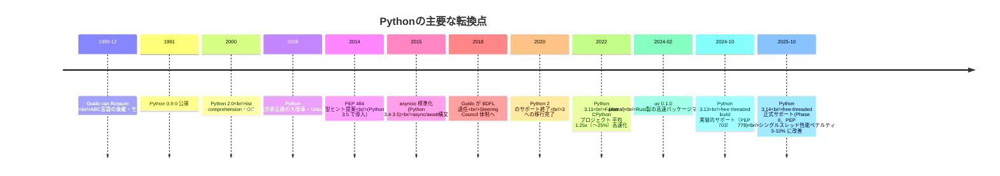
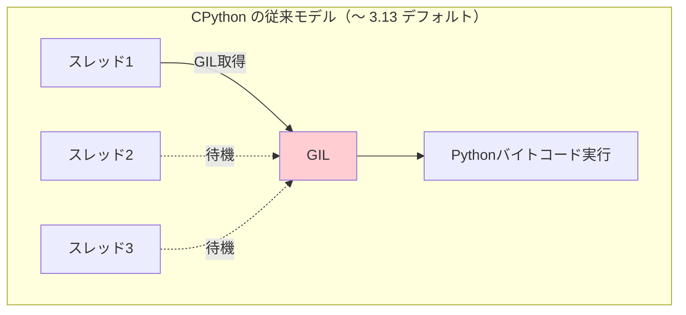
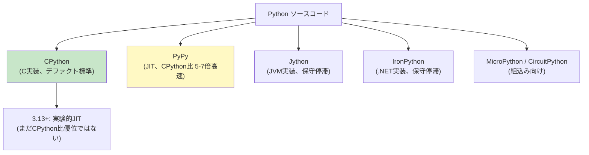
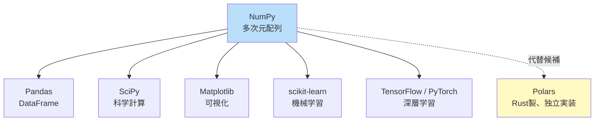

# Python（Python）

> **一言で言うと:** Python は1991年に **Guido van Rossum** が「**読みやすさ**」を最重視して設計した汎用言語で、**「There should be one — and preferably only one — obvious way to do it」（やり方は一つ、できれば一つだけ）** という Zen of Python の哲学が言語と文化を貫く。長らく**GIL（Global Interpreter Lock）**による CPU 並列性の制約が弱点だったが、**PEP 703（GIL オプション化、3.13 で実験的導入）**と**PEP 779（Phase II 公式サポートの判定基準）**によって、2025年10月の **Python 3.14 で free-threaded build が正式サポート（experimental タグ削除）** され、30年来の制約が解消されつつある。型ヒント（PEP 484, 2014）の成熟と、Rust 製の **uv**（pip 代替、10〜100倍高速）の台頭で、エコシステムも近代化が進む。

## 誕生と歴史的経緯



### 設計者と動機

設計者の **Guido van Rossum** はオランダの計算機科学者で、CWI（中央数学・計算機科学研究所）で **ABC** 言語の開発に関わっていた。ABC は教育向けの言語として優れていたが普及せず、Guido はそこから「**より実用的で柔軟な言語**」を作ろうとした。

1989年12月、クリスマス休暇に開発を開始し、当時好きだった **モンティ・パイソン**（Monty Python's Flying Circus）から名前を取った。蛇とは無関係。

#### Guido の動機

- **可読性を最優先**: コードはマシンよりも人間が読む時間のほうが圧倒的に長い
- **インデントで構造を表現**: 中括弧の流派論争を避ける（gofmt と同じ精神）
- **「電池付属」（batteries included）**: 標準ライブラリを充実させ、外部依存を減らす
- **C との橋渡し**: CPython 実装で C 拡張を簡単に書ける（NumPy・SciPy の基盤に）

### Python 2 → 3 の大改革（2008）

2008年12月の Python 3.0 リリースは、Python 史上最大の事件。**後方互換性を意図的に壊して長年の設計ミスを修正**:

| 領域 | Python 2 | Python 3 |
|------|---------|---------|
| `print` | 文（statement） | 関数 |
| 文字列 | バイト列とユニコードが曖昧 | str = Unicode、bytes = バイト列 |
| 整数除算 | `5 / 2 = 2`（切り捨て） | `5 / 2 = 2.5`（浮動小数点）、整数除算は `//` |
| dict のメソッド | `keys()` がリストを返す | イテレータを返す |
| 例外構文 | `except Exception, e` | `except Exception as e` |

業界の移行には**12年**かかった（Python 2 は2020年に EOL）。多くの企業が Python 2 と 3 を並行運用し、移行ツール `2to3` を使った。**この経験が、後のJavaScriptで「Don't break the web」が徹底される反面教師となった**。

### バージョン進化の山場

| バージョン | 年 | 主な貢献 |
|---|---|---|
| 2.0 | 2000 | list comprehension、GC |
| 3.0 | 2008 | 後方非互換大改革（Unicode str / 整数除算） |
| 3.4 | 2014 | asyncio（標準ライブラリ）、enum |
| 3.5 | 2015 | **async/await** 構文、**型ヒント（PEP 484）** |
| 3.6 | 2016 | **f-string**、変数の型注釈 |
| 3.7 | 2018 | dataclass、`from __future__ import annotations` |
| 3.8 | 2019 | walrus operator (`:=`)、TypedDict |
| 3.9 | 2020 | dict 結合演算子 (`|`)、ジェネリクス組み込み (`list[int]`) |
| 3.10 | 2021 | **Structural Pattern Matching**（match 文） |
| 3.11 | 2022 | **Faster CPython** でアプリにより 10-60%（平均 1.25x = 〜25%）高速化、`Self` 型 |
| 3.12 | 2023 | f-string 制限緩和、ジェネリクス簡略化 (`def f[T](x: T)`) |
| 3.13 | 2024-10 | **free-threaded build 実験的、JIT 実験的** |
| **3.14** | **2025-10** | **free-threaded 正式サポート、JIT 改善、パターンマッチ拡張** |

## 設計思想 — The Zen of Python

Python のインタプリタで `import this` と入力すると現れる、Tim Peters による設計原則:

```
The Zen of Python, by Tim Peters

Beautiful is better than ugly.        美しいは醜いより良い
Explicit is better than implicit.     明示は暗黙より良い
Simple is better than complex.        シンプルは複雑より良い
...
There should be one — and preferably only one — obvious way to do it.
やり方は一つ、できれば一つだけ
...
Now is better than never.             今やる方がやらないより良い
Although never is often better than *right* now.  すぐにやるよりはやらない方が良いことも
...
```

[[Ruby]] や [[Perl]] が「**やり方は何通りもある（TIMTOWTDI）**」を哲学とするのと正反対。Python のコードは誰が書いても似た形になることを目指す。

### Pythonic という文化

```python
# ❌ Pythonic でない（C/Java 的）
i = 0
while i < len(items):
    print(items[i])
    i += 1

# ✅ Pythonic
for item in items:
    print(item)

# ❌ 値の存在チェック
if x != None:
    process(x)

# ✅ Pythonic
if x is not None:
    process(x)

# ❌ 条件付きリスト構築
result = []
for x in numbers:
    if x > 0:
        result.append(x * 2)

# ✅ Pythonic（リスト内包表記）
result = [x * 2 for x in numbers if x > 0]

# ❌ 一時変数で交換
tmp = a
a = b
b = tmp

# ✅ Pythonic
a, b = b, a
```

「**Pythonic**」という形容詞が一般化しているのは Python 文化の独特な点。コードレビューで「もっとPythonicに書こう」という指摘が当たり前に行われる。

## 核心的な特性

### 動的型 + 漸進的型ヒント

```python
# 動的型 — 型注釈なし
def add(a, b):
    return a + b

add(1, 2)        # 3
add("a", "b")    # "ab"
add([1], [2])    # [1, 2]

# 型ヒント（PEP 484, 2014） — 静的解析ツール用
def add(a: int, b: int) -> int:
    return a + b

# Python 3.10+ — Union を | で書ける
def parse(value: str | int) -> int:
    if isinstance(value, str):
        return int(value)
    return value

# Python 3.12+ — ジェネリクス構文
def first[T](items: list[T]) -> T:
    return items[0]
```

**型ヒントはランタイムでチェックされない**。実行時の型情報は単なる注釈であり、`mypy` / `Pyright`（[[TypeScript]] と同じ Microsoft 製）/ `ty`（Astral 製、2025-12 発表、Beta 段階）などの**静的解析ツール**で検証する。

詳細は[[Pythonの型ヒントと静的解析]]（今後作成予定）。

### 「ダックタイピング」と Protocol

歴史的に Python は**ダックタイピング**（duck typing）— 「**それがアヒルのように歩き、アヒルのように鳴くなら、それはアヒルだ**」— で動いてきた:

```python
def process(obj):
    obj.read()  # read メソッドがあれば何でもOK

# File、StringIO、BytesIO、独自クラス — どれも process に渡せる
```

PEP 544（Python 3.8+）で **Protocol**（[[TypeScript]] の構造的型と同等）が導入され、ダックタイピングを型レベルで表現できるようになった:

```python
from typing import Protocol

class Readable(Protocol):
    def read(self) -> bytes: ...

def process(obj: Readable) -> bytes:
    return obj.read()

# Readable を継承していなくても、read メソッドがあればOK
class CustomReader:
    def read(self) -> bytes:
        return b"data"

process(CustomReader())  # 型チェッカーも通る
```

### GIL（Global Interpreter Lock）と PEP 703

**Python 最大の制約**だったGIL:



CPython（標準実装）は**いかなる瞬間も単一スレッドのみが Python バイトコードを実行できる**。これにより:

| 影響 | 詳細 |
|------|------|
| CPU 並列性が出ない | マルチコアでも CPU バウンド処理は1コアぶんしか速くならない |
| I/O は問題なし | I/O 待ちの間は GIL を解放するため、I/O 並行性は高い |
| C 拡張で回避可能 | NumPy などは C 側で GIL を解放して並列計算 |
| マルチプロセスで回避 | `multiprocessing` モジュール（プロセス分離） |

#### PEP 703: GIL 廃止への道（2023 採択 → 2026 へ向けて段階的）

| Phase | バージョン | 状況 |
|-------|----------|------|
| Phase I | 3.13 (2024-10) | free-threaded build が**実験的**に提供（PEP 703）。シングルスレッド性能に大きなペナルティ（おおよそ -40% 程度と報告） |
| **Phase II** | **3.14 (2025-10)** | **PEP 779 の判定基準を満たし、free-threaded が正式サポート（experimental の表記なし）。性能ペナルティ -5〜10% に改善** |
| Phase III | 3.15-3.17 (2026-2027 予定) | デフォルトビルドが free-threaded に |
| 完全移行 | 未定 | GIL 完全廃止、ABI も統一 |

```bash
# Python 3.14 で free-threaded ビルドを使う
$ python3.14t  # 't' suffix が free-threaded
$ python3.14t -c "import sys; print(sys._is_gil_enabled())"
False
```

```python
# CPU バウンド処理が真に並列実行される
from concurrent.futures import ThreadPoolExecutor

def cpu_intensive(n):
    return sum(i * i for i in range(n))

# 従来（GIL あり）— マルチコアでも1コアぶん
# 3.14t（GIL なし）— コア数に応じて並列実行
with ThreadPoolExecutor(max_workers=8) as executor:
    results = list(executor.map(cpu_intensive, [10**7] * 8))
```

ただし**エコシステム移行には数年かかる**。NumPy・PyTorch などのC拡張ライブラリは free-threaded への対応中。完全移行は2027年以降の見込み。

### asyncio — 非同期 I/O モデル

```python
import asyncio

async def fetch_user(user_id: int) -> dict:
    # await で I/O 待ちの間、他のタスクに制御が移る
    await asyncio.sleep(1)  # 実際は HTTP リクエスト等
    return {"id": user_id, "name": f"User{user_id}"}

async def main():
    # gather で複数の非同期タスクを並行実行（I/O 並行性）
    users = await asyncio.gather(
        fetch_user(1),
        fetch_user(2),
        fetch_user(3),
    )
    print(users)

asyncio.run(main())
# 1秒で完了（直列なら3秒）
```

[[JavaScript]] の Promise / async-await と類似だが、asyncio は**スレッドではなくシングルスレッド内のコルーチンスケジューリング**で動く。詳細は[[イベントループ]]も参照。

**重要な落とし穴**: 同期コードを `async` の中で書くと、イベントループ全体がブロックされる。

```python
# ❌ async 内で重い同期処理をするとイベントループ停止
async def bad():
    data = read_huge_file()  # 同期I/O — 他のタスクが進まない
    await process(data)

# ✅ run_in_executor で別スレッドへ
async def good():
    loop = asyncio.get_event_loop()
    data = await loop.run_in_executor(None, read_huge_file)
    await process(data)
```

### インタプリタ実装の選択肢



**99%のユーザーは CPython を使う**。CPython は C で書かれ、C 拡張モジュールとの相互運用が容易（NumPy・SciPy エコシステムの基盤）。

## 代表的なイディオム

### List/Dict/Set Comprehension

```python
# リスト内包表記
squares = [n ** 2 for n in range(10) if n % 2 == 0]
# [0, 4, 16, 36, 64]

# 辞書内包表記
word_count = {word: len(word) for word in ["apple", "banana", "cherry"]}
# {'apple': 5, 'banana': 6, 'cherry': 6}

# 集合内包表記
unique_chars = {c for word in words for c in word}

# ジェネレータ式（メモリ効率）
total = sum(n ** 2 for n in range(10**8))
# リストではなくジェネレータ → 巨大データもメモリ消費なし
```

### dataclass — ボイラープレート削減

```python
from dataclasses import dataclass, field

@dataclass(frozen=True)  # frozen で immutable に
class User:
    id: int
    name: str
    email: str
    tags: list[str] = field(default_factory=list)

# __init__, __repr__, __eq__ が自動生成される
user = User(id=1, name="Alice", email="alice@example.com")
print(user)  # User(id=1, name='Alice', email='alice@example.com', tags=[])

# Pydantic（外部ライブラリ）はランタイムバリデーション付き
from pydantic import BaseModel

class UserModel(BaseModel):
    id: int
    name: str
    email: str

UserModel(id="not_a_number", name="A", email="a@b.com")  # ❌ ValidationError
```

API 境界では Pydantic / msgspec / attrs などが事実上の標準。

### Context Manager（with 文）

```python
# ファイルの自動 close
with open('data.txt') as f:
    content = f.read()
# f.close() が自動的に呼ばれる

# 自前の context manager
from contextlib import contextmanager

@contextmanager
def timer(name):
    import time
    start = time.time()
    yield
    print(f"{name}: {time.time() - start:.2f}s")

with timer("処理A"):
    do_heavy_work()

# 複数の context を同時に
with open('input.txt') as fin, open('output.txt', 'w') as fout:
    fout.write(fin.read())
```

### Structural Pattern Matching（3.10+）

```python
def handle_response(response):
    match response:
        case {"status": 200, "data": data}:
            return process(data)
        case {"status": 404}:
            return "Not Found"
        case {"status": code} if code >= 500:
            return f"Server Error: {code}"
        case [first, *rest]:
            return f"List: first={first}, rest={rest}"
        case Point(x=0, y=0):
            return "Origin"
        case _:
            return "Unknown"
```

JS の switch とは違い、**構造を分解しながらマッチング**できる。Rust の match に近い。

### f-string とフォーマット

```python
name = "Alice"
age = 30

# f-string（3.6+）
print(f"{name} is {age} years old")
# Alice is 30 years old

# 式も埋め込める
print(f"次の年: {age + 1}")

# フォーマット指定
pi = 3.14159265
print(f"{pi:.3f}")        # 3.142
print(f"{1234567:_}")     # 1_234_567（区切り）
print(f"{0.5:.1%}")       # 50.0%（パーセント）

# 3.12+ — f-string 内で複数行式・コメント可能
result = f"""
{[
    item.name  # コメントもOK
    for item in items
]}
"""
```

## エコシステム

### パッケージマネージャ — uv の台頭

長らく `pip` + `virtualenv` + `requirements.txt` が標準だったが、依存解決が遅く、ロックファイル機能も弱かった。**Astral**（Ruff の開発元）が 2024年に **uv**（Rust 製、10〜100倍高速）をリリースし、急速に普及中。

```bash
# 旧来の pip
$ python -m venv .venv
$ source .venv/bin/activate
$ pip install -r requirements.txt
$ pip freeze > requirements.txt

# 新興の uv（10〜100倍速）
$ uv init                  # pyproject.toml と .venv を作成
$ uv add fastapi pydantic  # 追加 + ロックファイル自動更新
$ uv sync                  # 環境を pyproject.toml に同期
$ uv run python main.py    # uv 経由で実行（venv activate 不要）
```

**uv は Cargo（Rust）や pnpm（Node.js）の体験を Python に持ち込む**。pyproject.toml を中心とした統一的な設計で、`pip` / `pip-tools` / `pipenv` / `poetry` を1つで置き換える。

### pyproject.toml — 設定の統一

```toml
[project]
name = "myapp"
version = "0.1.0"
requires-python = ">=3.12"
dependencies = [
    "fastapi>=0.115",
    "pydantic>=2.0",
    "httpx",
]

[dependency-groups]
dev = [
    "pytest>=8.0",
    "ruff",
    "mypy",
]

[tool.ruff]
line-length = 100
target-version = "py312"

[tool.mypy]
strict = true
```

setup.py / setup.cfg / requirements.txt が分散していた時代から、**pyproject.toml 1ファイル**で完結する時代へ。

### Web フレームワーク

| フレームワーク | 特徴 | 主用途 |
|--------------|------|--------|
| **Django** | フルスタック、ORM・admin・auth 内蔵 | 大規模サービス、CMS |
| **FastAPI** | 型ヒントで API スキーマ自動生成、async 対応 | API サーバー、マイクロサービス |
| **Flask** | 最小限、組み合わせ自由 | 小規模 / プロトタイピング |
| **Litestar** | FastAPI のライバル、依存注入とパフォーマンス重視 | 大規模 API |

FastAPI の人気は近年急上昇。**型ヒント駆動の開発体験は Python の流れを変えた**。

### データ・機械学習エコシステム



データ・ML 領域では Python が事実上の標準。**Polars（Rust 製、Pandas からの派生ではなく独立実装）が高速性と表現力で注目**され、新規プロジェクトでは第一選択候補にもなりつつある。

### 開発ツール — Ruff の革命

Astral 製の **Ruff** は、Rust 製のリンター + フォーマッター:

```bash
$ ruff check .   # 静的チェック（flake8 + isort + pyupgrade ... の統合）
$ ruff format .  # フォーマット（Black 互換）
```

**従来ツール（flake8/isort/Black/pyupgrade）の 10〜100倍高速**。1つの設定で全てを賄える。Pythonエコシステムの「Astral 革命」（Ruff + uv + ty）が進行中（ty は 2025-12 発表、2026 時点では Beta 段階）。

## よくある落とし穴

### 1. 可変デフォルト引数（最有名の罠）

```python
# ❌ デフォルト引数は関数定義時に1度だけ評価される
def append_to(item, lst=[]):
    lst.append(item)
    return lst

print(append_to(1))  # [1]
print(append_to(2))  # [1, 2] ← 同じリストが使い回される！
print(append_to(3))  # [1, 2, 3]

# ✅ None を使ってチェック
def append_to(item, lst=None):
    if lst is None:
        lst = []
    lst.append(item)
    return lst
```

### 2. グローバルインタプリタロック（GIL）の誤解

```python
import threading

# ❌ CPU バウンドな処理を threading で並列化しようとする
def cpu_work():
    return sum(i * i for i in range(10**7))

threads = [threading.Thread(target=cpu_work) for _ in range(4)]
for t in threads: t.start()
for t in threads: t.join()
# 期待: 4倍速い / 実際: GILにより1倍 + スレッド切替えオーバーヘッドで遅くなる場合も

# ✅ multiprocessing で別プロセス化
from multiprocessing import Pool
with Pool(4) as p:
    results = p.map(cpu_work, range(4))

# ✅✅ Python 3.14+ の free-threaded build で真の並列化
# python3.14t で実行すれば threading でも CPU 並列が効く
```

### 3. 浮動小数点比較

```python
0.1 + 0.2 == 0.3  # False（実際は 0.30000000000000004）

# ✅ math.isclose を使う
import math
math.isclose(0.1 + 0.2, 0.3)  # True

# ✅✅ 厳密な計算は Decimal
from decimal import Decimal
Decimal('0.1') + Decimal('0.2') == Decimal('0.3')  # True
```

[[JavaScript]] と同じ問題（IEEE 754）。

### 4. `is` と `==` の混同

```python
# == は値の等価性
[1, 2] == [1, 2]  # True

# is はオブジェクトの同一性（メモリアドレス）
[1, 2] is [1, 2]  # False（別のオブジェクト）

# 小さな整数や None は CPython がキャッシュしているため is でも True になる
a = 256
b = 256
a is b  # True（CPython の実装詳細！）

a = 257
b = 257
a is b  # False（環境による）

# ✅ None / True / False のチェックは is
if x is None: ...
if x is True: ...

# ✅ 値比較は ==
if x == 0: ...
```

### 5. ループ内のクロージャ

```python
# ❌ 全クロージャが同じ i を参照
funcs = []
for i in range(3):
    funcs.append(lambda: i)
print([f() for f in funcs])  # [2, 2, 2]

# ✅ デフォルト引数で値を捕捉
funcs = []
for i in range(3):
    funcs.append(lambda i=i: i)  # i のデフォルト値が現在の i
print([f() for f in funcs])  # [0, 1, 2]
```

[[JavaScript]] の旧 `var` の問題と類似。

### 6. インデントの罠（タブとスペース）

```python
# Python 3 ではタブとスペースの混在はエラー
def foo():
    x = 1      # スペース 4
	y = 2      # タブ
    # ↑ TabError
```

ESLint や gofmt のような強制ツールがないため、`.editorconfig` や IDE 設定が必須。

### 7. import の循環参照

```python
# a.py
from b import B
class A: pass

# b.py
from a import A  # ← 循環
class B: pass

# ImportError: cannot import name 'A' from partially initialized module 'a'
```

対策: 関数内 import、または依存方向を整理する。

### 8. 文字列の連結を `+` で繰り返す

```python
# ❌ 大量の文字列連結は O(n²)
result = ""
for s in strings:
    result += s

# ✅ join で O(n)
result = "".join(strings)
```

文字列は immutable なので、`+=` は毎回新しいオブジェクトを生成する。

## AIによる実装のアンチパターン

| アンチパターン | なぜ問題か | 対策 |
|---|---|---|
| 型ヒントを過剰に冗長に書く | `Dict[str, Dict[str, List[Tuple[int, str]]]]` のような型地獄 | `TypedDict` / `dataclass` / `Pydantic` で構造化 |
| 型ヒントを全く書かない | 動的型なので静的解析の恩恵が得られない | 公開 API には型ヒントを必ず付ける |
| `print` でデバッグ | 本番でも残り、構造化されない | `logging` モジュールを使う |
| 例外を裸の `except:` で catch | KeyboardInterrupt まで握りつぶす | `except Exception as e:` を使う、そもそも catch を最小限に |
| 並列化に `threading` を CPU バウンド処理で使う | GIL で並列化されない | CPU バウンドは `multiprocessing` か Python 3.14+ free-threaded |
| `os.path` を使う | 古い API、文字列ベース | `pathlib.Path` を使う |
| `pip install` をシステム Python に | システム Python 汚染、依存衝突 | `uv` または venv で隔離 |
| `requirements.txt` のみで管理 | ロックファイルがないと再現性なし | `uv.lock` または `pip-tools` |
| Python 2 の書き方 | `print x`、`xrange`、文字列 unicode | Python 3 の書き方に統一 |
| ジェネレータの代わりにリストを返す | 巨大データでメモリ枯渇 | `yield` を使う、`itertools` を活用 |

## 関連トピック

- [[プログラミング言語の系譜と選択]] — 親トピック
- [[JavaScript]] — async/await の対比、動的型言語の比較
- [[TypeScript]] — 型ヒント vs TS の比較
- [[Go]] — Goroutine vs threading + GIL の比較
- [[並行性の基本概念]] — GIL とロックの理解
- [[イベントループ]] — asyncio のモデル
- [[インタプリタ・コンパイラ・JIT]] — CPython と PyPy の実装差
- [[OpenAPIとスキーマ駆動開発]] — FastAPI の中核機能

## 参考リソース

- [Python 公式ドキュメント](https://docs.python.org/ja/3/)
- [Python 3.14 リリースノート](https://docs.python.org/3/whatsnew/3.14.html)
- [PEP 703: Making the GIL Optional](https://peps.python.org/pep-0703/) — GIL 廃止の提案書
- [PEP 484: Type Hints](https://peps.python.org/pep-0484/) — 型ヒント導入の提案書
- [PEP 8: Style Guide](https://peps.python.org/pep-0008/) — Python のコーディング規約
- [Real Python](https://realpython.com/) — 実践的な解説記事
- [The Hitchhiker's Guide to Python](https://docs.python-guide.org/) — 包括的なベストプラクティス集
- [uv 公式ドキュメント](https://docs.astral.sh/uv/)
- 書籍:『Fluent Python』(Luciano Ramalho, O'Reilly) — Python の深層を扱う名著
- 書籍:『エキスパートPythonプログラミング』(Tarek Ziadé) — 大規模 Python 開発の実践

## 学習メモ

- 「Pythonは遅い」という通説は半分正しく半分間違い。**インタプリタが遅いのは事実**だが、NumPy など C 拡張を呼ぶ層では C 並みの速度が出る。さらに 3.14+ の JIT と free-threaded で改善が続く
- **PEP 703 の GIL 廃止は Python 史上最大級の変革**。エコシステム移行に数年かかるが、完了すれば Python は CPU 並列性のハンディキャップを失う。Web/データ領域での選択肢としての立ち位置が変わる
- **Astral（Ruff/uv/ty）の革命**は、Python エコシステムが Rust 製ツールに置き換えられていく流れ。これは [[JavaScript]] エコシステムが SWC/esbuild で置き換えられたのと同じパターン
- 型ヒントは「書かないより書いた方が良い」が、**TypeScript と異なり実行時に効力を持たない**。境界バリデーションには Pydantic / msgspec が必須
- AI コード生成が苦手とする領域: 「**Pythonic な書き方**」「**型ヒントの適切な粒度**」「**asyncio と threading の使い分け**」。慣用句の感覚は人間のレビューが要る
